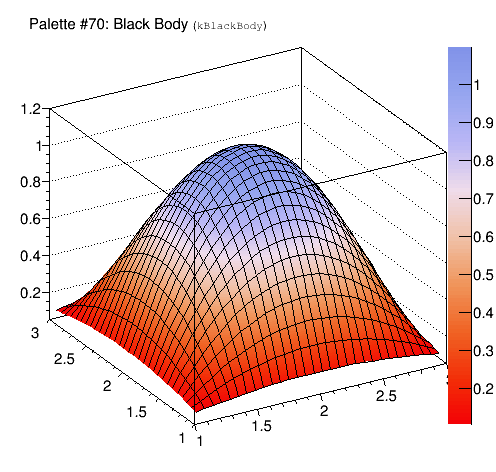
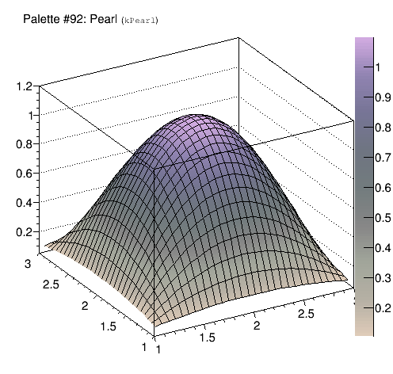

% ROOT Version 6.04/02 Release Notes
% 14 July 2015
<a name="TopOfPage"></a>

## Introduction

ROOT version 6.04/02 was released on 14 July, 2015.
Changes with respect to 6.04/00 are listed [at the end of the document](#patchreleases).

For more information, see:

[http://root.cern.ch](http://root.cern.ch)

The following people have contributed to this new version:

 David Abdurachmanov, CERN, CMS,\
 Bertrand Bellenot, CERN/SFT,\
 Rene Brun, CERN/SFT,\
 Philippe Canal, FNAL,\
 Cristina Cristescu, CERN/SFT,\
 Olivier Couet, CERN/SFT,\
 Kyle Cranmer, NYU, RooStats,\
 Aurelie Flandi, CERN/SFT,\
 Gerri Ganis, CERN/SFT,\
 Andrei Gheata, CERN/Alice,\
 Lukasz Janyst, CERN/IT,\
 Christopher Jones, Fermilab, CMS,\
 Wim Lavrijsen, LBNL, PyRoot,\
 Sergey Linev, GSI, http,\
 Pere Mato, CERN/SFT,\
 Lorenzo Moneta, CERN/SFT,\
 Axel Naumann, CERN/SFT,\
 Danilo Piparo, CERN/SFT,\
 Timur Pocheptsov, CERN/SFT,\
 Fons Rademakers, CERN/SFT,\
 Enric Tejedor Saavedra, CERN/SFT,\
 Liza Sakellari, CERN/SFT,\
 Manuel Tobias Schiller,\
 David Smith, CERN/IT,\
 Matevz Tadel, UCSD/CMS, Eve, \
 Vassil Vassilev, CERN/SFT \
 Wouter Verkerke, NIKHEF/Atlas, RooFit, \
 Yue Shi Lai, MIT,\
 Maciej Zimnoch, GSOC


## Core Libraries

### General

#### Platform support

ROOT now works on linuxarm64 / AArch64 / ARMv8 64-bit - thanks, David Abdurachmanov!

ROOT supports GCC 5.0 (a preview thereof) and XCode 6.3, Mac OSX 10.10.3


#### Thread-Safety

A lot of effort went into improving the thread-safety of Core and Meta classes / functions. A special thanks to Chris Jones from CMS!

#### std::string_view

Introduce a preview of C++17's std::string_view.  To take advantage of this new
class use:
```{.cpp}
#include "RStringView.h"
```
The documentation of this can be found at `http://en.cppreference.com/w/cpp/experimental/basic_string_view`
The implementation provided is extracted from libcxx.  Whenever the current
compiler and standard library provide an implmentation, it is used.

The type string_view describes an object that can refer to a constant contiguous sequence of char-like objects with the first element of the sequence at position zero.

This type is used throughout the ROOT code to avoid copying strings when a
sub-string is needed and to extent interfaces that uses to take a const char*
to take a std::string_view as thus be able to be directly directly passed a
TString, a std::string or a std::string_view.   Usage example:

``` {.cpp}
// With SetName(std::string_view)
std::string str; …
obj.SetName( str );
obj.SetName( {str.data()+pos, len} );
```

### Meta library

#### Backward Incompatibilities

TIsAProxy's constructor no longer take the optional and unused 2nd argument which was reserved for a 'context'.  This context was unused in TIsAProxy itself and was not accessible from derived classes.

#### Interpreter

The new interface `TInterpreter::Declare(const char* code)` will declare the
code to the interpreter with all interpreter extensions disabled, i.e. as
"proper" C++ code. No autoloading or synamic lookup will be performed.

A new R__LOAD_LIBRARY(libWhatever) will load libWhatever at parse time. This allows ROOT to resolve symbols from this library very early on. It is a work-around for the following code from ROOT 5:

``` {.cpp}
  // ROOT 5:
  void func() {
    gSystem->Load("libEvent");
    Event* e = new Event;
  }
```

Instead, write:

``` {.cpp}
  // ROOT 6:
  R__LOAD_LIBRARY(libEvent)
  #include "Event.h"

  void func() {
    Event* e = new Event;
  }
```

#### TClass

Introduced new overload for calculating the TClass CheckSum:

``` {.cpp}
   UInt_t TClass::GetCheckSum(ECheckSum code, Bool_t &isvalid) const;
```

which indicates via the 'isvalid' boolean whether the checksum could be
calculated correctly or not.

### TROOT

Implemented new gROOT->GetTutorialsDir() static method to return the actual location of the tutorials directory.
This is $ROOTSYS/tutorials when not configuring with --prefix  or -Dgnuinstall for CMake.

### TColor

Add an enum to access the palette by name.

Add new palettes with 255 colors. Names and colors' definitions have been taken from
[here](http://www.rcnp.osaka-u.ac.jp/~noji/colormap). Except for the `kBird` palette.
These palettes can be accessed with `gStyle->SetPalette(num)`. `num` can be taken
within the following enum:

* kDeepSea = 51
* kGreyScale = 52
* kDarkBodyRadiator = 53
* kBlueYellow =  54
* kRainBow = 55
* kInvertedDarkBodyRadiator = 56
* kBird = 57
* kCubehelix = 58
* kGreenRedViolet = 59
* kBlueRedYellow = 60
* kOcean = 61
* kColorPrintableOnGrey = 62
* kAlpine = 63
* kAquamarine = 64
* kArmy = 65
* kAtlantic = 66
* kAurora = 67
* kAvocado = 68
* kBeach = 69
* kBlackBody = 70
* kBlueGreenYellow = 71
* kBrownCyan = 72
* kCMYK = 73
* kCandy = 74
* kCherry = 75
* kCoffee = 76
* kDarkRainBow = 77
* kDarkTerrain = 78
* kFall = 79
* kFruitPunch = 80
* kFuchsia = 81
* kGreyYellow = 82
* kGreenBrownTerrain = 83
* kGreenPink = 84
* kIsland = 85
* kLake = 86
* kLightTemperature = 87
* kLightTerrain = 88
* kMint = 89
* kNeon = 90
* kPastel = 91
* kPearl = 92
* kPigeon = 93
* kPlum = 94
* kRedBlue = 95
* kRose = 96
* kRust = 97
* kSandyTerrain = 98
* kSienna = 99
* kSolar = 100
* kSouthWest = 101
* kStarryNight = 102
* kSunset = 103
* kTemperatureMap = 104
* kThermometer = 105
* kValentine = 106
* kVisibleSpectrum = 107
* kWaterMelon = 108
* kCool = 109
* kCopper = 110
* kGistEarth = 111








### Interpreter Library

Many, many bugs have been fixed; thanks to everyone who has reported them!

#### Cling

Cling is now using a new just-in-time compilation engine called OrcJIT, a development based on MCJIT. It enables interpretation of inline assembly and exceptions; it will hopefully in the near future also support interpreting thread local storage (but doesn't at the moment).

Thanks to the new JIT, cling also comes with debug symbols for interpreted code; you can enable them with ".debug".

#### Function evaluation

Function calls through TMethodCall etc have been accelerated.

#### llvm / clang

llvm / clang were updated to r227800. This includes everything from the clang 3.6 release.

### Dictionary Generation

Detect usage of #pragma once for inlined headers.

Turn on verbosity of genreflex if the VERBOSE environment variable is defined.

Optimise forward declarations in rootmap files in order to make their interpretation faster.

Propagate attributes specified in xml selection files to selected classes even when selected through typedefs.

Optimise selection procedure caching selected declarations in the selection rules, therewith avoiding to query the AST twice.

Include in the PCH all the STL and C headers to guarantee portability of binaries from SLC6 to CC7.


## I/O Libraries

### I/O New functionalities

- Support for forward_list and I/O of unordered stl containers.
- Support for std::complex.

### I/O Behavior change.

- The I/O now properly skip the content of base class onfile that have been removed from the in-memory class layout.

- The scheduling the I/O customization rules within a StreamerInfo is now as soon as possible, i.e. after all sources have been read.  One significant consequence is that now when an object is stored in a split branch
the rule is associtated with the branch of the last of the rule's sources rather
than the last of the object's data member.

- Properly support TStreamerInfo written by ROOT v4.00.

- Fix the ordering of the keys in a TFile being written; in particular fixing the result of GetKey and FindKey which were no longer returning the lastest cycle for a TFile being written since v5.34/11.

## Networking Libraries

### HTTP Server

##### Command Interface
One can now register an arbitrary command to the server, which become visible in the web browser. Then, when the item is clicked by the user, the command ends-up in a gROOT->ProcessLineSync() call.

##### Custom Properties
Custom properties can be configured for any item in the server. For example, one could configure an icon for each item visible in the browser. Or one could 'hide' any item from the user (but keep access with normal http requests). With such properties one could specify which item is drawn when web page is loaded, or configure monitoring. See tutorials/http/httpcontrol.C macro for more details.

##### Method Calls
Implement exe.json requests to be able to execute any method of registered objects. This request is used to provide remote TTree::Draw() functionality.

##### Misc
Correctly set 'Cache-Control' headers when replying to http requests.
Better support of STL containers when converting objects into json with TBufferJSON class.


## JavaScript ROOT

- Several files can now be loaded simultaneously
- Use d3.time.scale to display time scales
- Implemented drag and drop to superimpose histograms or graphs
- Allow selection of drawing option via context menu
- Better support of touch devices
- Provide simple layout, making it default
- Allow to open ROOT files in online session (via url parameter)
- One could monitor simultaneously objects from server and root files
- Implement 'autocol' draw option  - when superimposing histograms,
   their line colors will be automatically assigned
- Implement 'nostat' draw option - disabled stat drawing
- Using '_same_' identifier in item name, one can easily draw or superimpose
   similar items from different files. Could be used in URL like:
     `...&files=[file1.root,file2.root]&items=[file1.root/hpx, file2.root/_same_]`
     `...&files=[file1.root,file2.root]&item=file1.root/hpx+file2.root/_same_`
   Main limitation - file names should have similar length.
- When 'autozoom' specified in draw options, histogram zoomed into
  non-empty content. Same command available via context menu.
- Item of 'Text' kind can be created. It is displayed as
  lain text in the browser. If property 'mathjax' specified,
  MathJax.js library will be loaded and used for rendering.
  See tutorials/http/httpcontrol.C macro for example.
- When using foreignObject, provide workaround for absolute positioning
  problem in Chrome/Safari, see <http://bit.ly/1wjqCQ9>
- Support usage of minimized versions of .js and .css files.
  Minimized scripts used by default on web servers.
- Implement JSROOT.extend instead of jQuery.extend, reduce
  usage of jquery.js in core JSROOT classes
- Implement main graphics without jquery at all,
  such mode used in `nobrowser` mode.
- Provide optional latex drawing with MathJax SVG.
  TMathText always drawn with MathJax,
  other classes require `mathjax` option in URL
- Improve drawing of different text classes, correctly handle
  their alignment and scaling, special handling for IE


## TTree Libraries

### TTree Behavior change.

#### Merging.

Added fast cloning support to TTree::MergeTrees and TTree::Merge(TCollection*,Option_t*).

#### TTreeCache

The TTreeCache is now enabled by default.  The default size of the TTreeCache
is the estimated size of a cluster size for the TTree.  The TTreeCache
prefilling is also enabled by default; when in learning phase rather than
reading each requested branch individually, the TTreeCache will read all the
branches thus trading off the latencies inherent to multiple small reads for
the potential of requesting more data than needed by read from the disk or
server the baskets for too many branches.

The default behavior can be changed by either updating one of the rootrc files
or by setting environment variables.  The rootrc files, both the global and the
local ones, now support the following the resource variable TTreeCache.Size
which set the default size factor for auto sizing TTreeCache for TTrees. The
estimated cluster size for the TTree and this factor is used to give the cache
size. If option is set to zero auto cache creation is disabled and the default
cache size is the historical one (equivalent to factor 1.0). If set to
non zero auto cache creation is enabled and both auto created and
default sized caches will use the configured factor: 0.0 no automatic cache
and greater than 0.0 to enable cache.  This value can be overridden by the
environment variable ROOT_TTREECACHE_SIZE.

The resource variable TTreeCache.Prefill sets the default TTreeCache prefilling
type.  The prefill type may be: 0 for no prefilling and 1 to prefill all
the branches.  It can be overridden by the environment variable ROOT_TTREECACHE_PREFILL

In particular the default can be set back to the same as in version 5 by
setting TTreeCache.Size (or ROOT_TTREECACHE_SIZE) and TTreeCache.Prefill
(or ROOT_TTREECACHE_PREFILL) both to zero.

TTree methods which are expected to modify a cache, like AddBranchToCache, will
attempt to setup a cache of default size if one does not exist, irrespective of
whether the auto cache creation is enabled. Additionally several methods giving
control of the cache have changed return type from void to Int_t, to be able to
return a code to indicate if there was an error.

Usually TTree::SetCacheSize will no longer reset the list of branches to be
cached (either set or previously learnt) nor restart the learning phase.
The learning phase is restarted when a new cache is created, e.g. after having
removed a cache with SetCacheSize(0).

### TSelectorDraw

The axis titles in case of a `x:y:z` plot with the option `COLZ` were not correct.

### TParallelCoordVar

Change the format used to print the variables limit for ||-Coord to `%g`. It was
`%6.4f` before.

## Histogram Libraries

### TFormula

-  New version of the TFormula class based on Cling. Formula expressions are now used to create  functions which are passed to Cling to be Just In Time compiled.
The expression is therefore compiled using Clang/LLVVM which will give execution time as compiled code and in addition correctness of the result obtained.
-  This class is not 100% backward compatible with the old TFormula class, which is still available in ROOT as =ROOT::v5::TFormula=.
    Some of the TFormula member funtions available in version 5, such as =Analyze= and =AnalyzeFunction= are not available in the new TFormula class.
    On the other hand formula expressions which were valid in version 5 are still valid in TFormula version 6
-  TFormula is not anymore a base class for TF1.
-  The new TFormula allows to defines the parameter names directly in the syntax. Example:

``` {.cpp}
TFormula f("f","f1","[constant]+[slope]*x");
```

-  New pre-defined functions are provided, as: `crystalball` for the Crystal-Ball function, `cheb0,1,...10` for the Chebyshev polynomials

### TF1

-  Change of its inheritance structure. `TF1` has not anymore `TFormula` as a base class, so this code


``` {.cpp}
TF1 * f1 = new TF1("f1","f1","sin(x)",0,10);
TFormula * formula = (TFormula *) f1;
```

**it is not valid anymore.**
The equivalent correct code is now


``` {.cpp}
TF1 * f1 = new TF1("f1","f1","sin(x)",0,10);
TFormula * formula = f1->GetFormula();
```

-   Allow possibility to automatically normalize itself. If the function `TF1::SetNormalized(true)` is called, when evaluated, the function will return its value divided by its integral computed in
the function range.

### TF1NormSum

-   New helper class computing the normalized sum of TF1 objects. It is a functor class which can be used as input to a global TF1 for fitting a sum of normalized components. This is useful for
example in signal plus background fit, where one can fit directly the number of signal and background events, without the need to use something like `TF1::IntegralError`.
See the tutorial `tutorials/fit/fitNormSum.C` as an example on how to use the `TF1NormSum` and perform such a fit.

### TF1Convolution

-   Another helper functor class for performing numerical convolution of functions, expressed as TF1 objects, using Fast Fourier Transform. The class requires the FFTW package installed in
ROOT. The tutorial `tutorials/fit/fitConvolution.C` provides an example on how to create a TF1 based on the convolution of two others TF1 objects and used it to fit some data.


### TGraph2DPainter

-   In some case and extra point was drawn in the center od the plot when a
    `TGRaph2d`was drawn with `P`, `P0`, or `PCOL` options.

### THistPainter

- It was possible to interactively zoom outside the histograms' limits. Protections
  have been added.
- When an histogram was drawn with the option `E0` and log scale along the Y axis,
  some additional markers were drawn at the bottom line of the plot. This was
  reported <a href="http://root.cern.ch/phpBB3/viewtopic.php?f=3&t=18778">here</a>.
- Implement the option `0` combined with the option `COL` as requested
  <a href="https://root.cern.ch/phpBB3/viewtopic.php?f=3&t=19046">here</a>.
  When the minimum of the histogram is set to a greater value than the real minimum,
  the bins having a value between the real minimum and the new minimum are not drawn
  unless the option <tt>0</tt> is set.

    Example:

    ``` {.cpp}
    {
       TCanvas *c1 = new TCanvas("c1","c1",600,600);
       c1->Divide(1,2);
       TH2F *hcol21 = new TH2F("hcol21","Option COLZ",40,-4,4,40,-20,20);
       TH2F *hcol22 = new TH2F("hcol22","Option COLZ0",40,-4,4,40,-20,20);
       Float_t px, py;
       for (Int_t i = 0; i < 25000; i++) {
          gRandom->Rannor(px,py);
          hcol21->Fill(px,5*py);
          hcol22->Fill(px,5*py);
       }
       hcol21->SetBit(TH1::kNoStats);
       hcol22->SetBit(TH1::kNoStats);
       gStyle->SetPalette(1);
       c1->cd(1); hcol21->Draw("COLZ");
       c1->cd(2); hcol22->Draw("COLZ0");
       hcol22->SetMaximum(100);
       hcol22->SetMinimum(40);
       return c1;
}
    ```
    
- The parameter `gStyle->SetHistTopMargin()` was ignored when plotting a 2D histogram
  using the option `E`. This can be seen plotting the histogram with `"LEGO E"`.
- `GetObjectInfo` did not display the right value form `"Sum"` for histograms plotted
  with option `SAME` on top of an histogram displayed with a subrange. This was
  reported in ROOT-7124.
- Use `GeyStdDev` instead of `GetRMS`. The stat box now shows `Std Dev` instead
  of `RMS`.
- The Stats Format was ignored when painting the pave stats for 2D histograms.

### TGraph2D

- Change `GetHistogram()` in order to be able to access the returned histogram
  before the 2D graph has been filled with points. That was not possible previously.
  This problem was reported
 <a href="https://root.cern.ch/phpBB3/viewtopic.php?f=3&t=19186">here</a>.
- When a `TGraph2D` was entirely in the plane `Z=0` the 3D could not be defined.
  This problem was reported
 <a href="https://root.cern.ch/phpBB3/viewtopic.php?f=3&t=19517">here</a>.

### TMultiGraph
- When a `TMultiGraph` contained only one `TGraph` the number of bins for the
  internal histogram was not set correctly.   This problem was reported
  <a href="https://root.cern.ch/phpBB3/viewtopic.php?f=3&t=19603&p=83973#p83973">here</a>.

### THStack

- Implement `GetNhists()` to return the number of histograms in the stack.
- New drawing option `NOSTACKB`. histograms are drawn next to each other as
  bar charts.

    Example:

    ``` {.cpp}
    TCanvas* nostackb() {
       TCanvas *cst0 = new TCanvas("cst0","cst0",600,400);
       THStack *hs = new THStack("hs","Stacked 1D histograms: option #font[82]{\"nostackb\"}");

       TH1F *h1 = new TH1F("h1","h1",10,-4,4);
       h1->FillRandom("gaus",20000);
       h1->SetFillColor(kRed);
       hs->Add(h1);

       TH1F *h2 = new TH1F("h2","h2",10,-4,4);
       h2->FillRandom("gaus",15000);
       h2->SetFillColor(kBlue);
       hs->Add(h2);

       TH1F *h3 = new TH1F("h3","h3",10,-4,4);
       h3->FillRandom("gaus",10000);
       h3->SetFillColor(kGreen);
       hs->Add(h3);

       hs->Draw("nostackb");
       return cst0;
    }

    ```
    

## GUI Libraries

### TGTextViewostream

- A new `TGTextViewostream` class has been added. It is a text viewer widget and is a specialization of `TGTextView` and `std::ostream`. It uses a `TGTextViewStreamBuf`, which inherits from `std::streambuf`, allowing to stream text directly to the text view in a `cout` - like fashion. A new tutorial showing how to use the `TGTextViewostream` widget has also been added.

### FitPanel

-   Add the functionality for composing function using convolution and for normalized sums using the new `TF1NormSum` and `TF1Convolution` classes.


## 2D Graphics Libraries

### TText

- The character position was not correct with the Cocoa backend.
  (see https://sft.its.cern.ch/jira/browse/ROOT-6561)
- Interactive update of `TText` position did not work in NDC mode.
  (se https://sft.its.cern.ch/jira/browse/ROOT-7284).

### TLegend

- Use the new `TStyle` global attribute `gStyle->GetLegendTextSize()` to set the
  legend item text size. If this value is 0 and if the text size directly set on
  the `TLegend` object is also 0, then the text size is automatically computed to
  fit the legend box. If `gStyle->GetLegendTextSize()` is non equal to 0 and if
  text size  directly set on the `TLegend` object is 0, then the `gStyle` value is
  used to draw the legend text. If the text size directly set on the `TLegend`
  object is not null, then it is used to draw the legend text.

### TTexDump

- The hollow fill style was not rendered correctly.
  (see https://sft.its.cern.ch/jira/browse/ROOT-6841)
- Better line width matching with screen and pdf output.
- Text color was ignored. It was always black.
- Text color was ignored. It was always black.
- The underscore `_` produced an error outside the TeX math context.
- Fix an issue with transparent pads.
- Implement transparent colors using TiKZ "opacity".
- Implement `TStyle::SetLineScalePS()` to control le global basic line width.
- Offer 0 as line width option. Useful to make a line invisible.

### TPostScript

- Small fix for fill patterns 1, 2 and 3.
- With `TMathtext`, only the fonts really used are now loaded in the PostScript
  file. Typically it reduces the file size by a factor 10 (compare to the previous
  implementation) for normal plots with math formulae and greek characters.
- Offer 0 as line width option. Useful to make a line invisible.

### TPDF

- When a text size was equal or smaller than 0 the PDF file was corrupted.
- Small fix for fill patterns 1, 2 and 3.
- When printing a coloured 2D histograms (with option COLZ) into a PDF or PostScript
  file, the preview on screen using many standard PDF previewer tools showed very
  thin white lines between the bins as well as in the color palette.
  This made very ugly the final output.
  This problem is due to bad implementation of anti-aliasing in these previewers.
  A way to bypass this issue was to turn off the anti-aliasing in the previewer
  but then the rest of the document does not look nice. This problem is now bypassed
  with a fix in both PDF and PostScript output.
- Offer 0 as line width option. Useful to make a line invisible.

### TSVG

- Use float numbers instead of integer to describe graphics paths to avoid
  rounding problems.
- Implement missing math symbols.
- Offer 0 as line width option. Useful to make a line invisible.

### TASImage

- In the animated gif it is now possible to specify the delay between the last
  image and the fist image in case of infinite loop. (Fernando Hueso González
  <f.gonzalez@hzdr.de>).

### TPadPainter
- Offer 0 as line width option. Useful to make a line invisible.

### TPad

- In `TPad::ShowGuidelines` the number of guide lines is limited to 15. Above
  that they become useless.
- Print a warning if one of the pad limit is a NaN.
- Fix https://sft.its.cern.ch/jira/browse/ROOT-6703.

### TCanvas

- Make sure that "/" and "." are not part of the method name when a canvas is
 saved as a .C file.

### TLatex

- With the Cocoa backend the PDF and PS output produced miss-aligned exponents
  because the `GetTextExtend` method behaved differently in batch mode and "screen"
  mode. This is now fixed. See http://root.cern.ch/phpBB3/viewtopic.php?f=3&t=18883
- Improve the square-root drawing in case it is small.
- Better adjustment of the tilde accent position in case of Cocoa backend.

### TMathText

- `\mu` is now working for Postscript output.
- `\splitline` is now implemented.

### Cocoa backend

- Line width and line style were not applied on boxes.


## 3D Graphics Libraries

### GL Viewer
- New option "Rotate scene" in the "Extras" tab of the GL Viewer. It allows to
  do a real rotation instead of a wobbling when the "Auto Rotator" is launched.
- New methods from Jeremi Niedziela <jeremi.niedziela@cern.ch> to return the
  image in memory.

## Tutorials

-   New tutorial `textviewostream.C` showing how to use the TGTextViewostream widget.

## Build, Configuration and Testing Infrastructure

- Backport Python3 compatibility of build scripts

### New functionalities

- Support ARM 64 bits architecture.

- Partial support for PPC 64 bits Little Endian architecture.

- Add "Optimized" CMAKE_BUILD_TYPE: allow highest level of optimisation of the GCC and Clang compilers (-Ofast).

- Support ccache activation with cmake configuration switch.

- Support link to jemalloc and tcmalloc allocators.

- Careful suppression of known and understood warnings, e.g. coming from external packages.

\
\
\

# Patch Releases

## Release 6.04/02

### Platform Support
 - Added support for Intel icc 15

### Build System
 - Define ROOT_XXX_FLAGS in ROOTConfig.cmake for use by client packages [ROOT-7401]
 - Enabled c++14 in CLING when compiling ROOT with c++14 enabled (CMake: -Dcxx14=ON, classic: --enable-cxx14) 

#### Dictionary Generation
 - Uniform style of warnings, use standard ROOT logging facilities rather than cout/cerr.
 - Do not add as autoparse keys stl classes, stl (nested) containers templated with plain old data or integers.

### Core
 - Fixed support for dictionary for class with inlined namespace.
 - Do not treat Mac OSX's "cl_kernels" dylinker entry as a library [ROOT-7436]

#### TDirectory::TContext
- Fixed a thread safety issue in TMVA by updating TDirectory::TContext.
- We added a default constructor to TDirectory::TContext which record the current directory
and will restore it at destruction time and does not change the current directory.
- The constructor for TDirectory::TContext that takes a single TDirectory pointer as
an argument was changed to set gDirectory to zero when being passed a null pointer;
previously it was interpreting a null pointer as a request to *not* change the current
directory - this behavior is now implement by the default constructor.

### I/O
 - Fix the issue described at [ROOT-7500] : crash due to change in base class which versioned derived class.

### Proof
 - Add support for aliases [ROOT-7392]
 - Fix issue with trees in sub-directories causing stressProof test #29 to fail

### Interpreter
 - Fix unloading of code [ROOT-7290]
 - Fix template instantiations in cling internals [ROOT-7364]
 - Forget erroneous decls in case of errors [ROOT-7295]
 - Work around binutils issue (ld crash building llvm) on MacOSX with GCC (pull requests 64-66)
 - Work around MacOS X builds being version specific [ROOT-6966]
 - Handle relocation of ROOT and non-PCH-able glibc headers.
 - Fix parsing of definition for forward declared enums [ROOT-7419]
 - Pass CXXFLAGS to the PCH generator, to ensure platform consistency.
 - Work around linker assert when building with GCC on OS X (PR #68)

### PyROOT
 - Fix lookup of templated classes in namespace with arguments that have 'std::' in their name [ROOT-7448]
 - Use GetTrueTypeName() instead of GetFullTypeName(), as the latter loses namespaces
 - Strip down number of libraries linked to libPyROOT in order to reduce to the minimum the time needed to import the ROOT module.

### TFormula, TF1
 - Allow possibility to automatically normalize itself. If the function `TF1::SetNormalized(true)` is called, when evaluated, the function will return its value divided by its integral computed in the function range.
 - Added helper classes TF1NormSum, TF1Convolution.
 - Fix a bug in calling TF1::Update when changing the parameter values. Fix also the TF1Convolution.
 - Fix the caching of the parameters in TF1NormSum to avoid recomputing integrals for same parameter values.
 - Remove unwanted printout from Streamer method.

### RooFit
 - Fix for contour computations in RooMinimizer[ROOT-7290]

### Dictionary Generation

 - Uniform style of warnings, use standard ROOT logging facilities rather than cout/cerr.
 - Do not add as autoparse keys stl classes, stl (nested) containers templated with plain old data or integers.

### Tree
 - `TTreeReaderArray` now supports `vector<builtin-type>`.

### Graphics
 - Fix file corruption in `TTeXDump::DrawPolyMarker`.
 - Make sure the line width used to draw `#sqrt` is always >=1.


----------------------------------------------------------------------------------------------------------------------

## Release 6.04/04

### Build System
- Fix generation of PCH with CXX flags with spaces [ROOT-7478]
- Implemented option 'geocad' with CMake making use of the OpenCASCADE software package.
- Fix option 'rpath' for `CMake` and ensure that works for MacOSX 10.11

### Core
- Fix the location of include files in ROOTINCDIR/include instead of ROOTINCDIR [ROOT-7537]

### Interpreter
- Fix redirection [ROOT-7053]
- Take the language and target options from the PCH [ROOT-7478] [ROOT-6966]
- Properly recover from a template instantiation failure when looking up a class in the interpreter [ROOT-7462]
- Do not clear pending instantiations upon unloading; fixes missing symbols due to missing function bodies [ROOT-7586]
- Speed up significantly cling's findType and remove its memory cost in most cases.
- Make sure object declared on the interpreter stack are deleted at the end of the process [ROOT-7673]
- Resolve issues with error recovery when the transaction includes template instantiation.
- Fix handling of argument that negative integers in `TClingCallFunc` [ROOT-7684]

### I/O
- Fix memory leak in handling of I/O customization rules [ROOT-7683]
- Set CheckSum of StreamerInfo of user classes that have a collection proxy.

### Tree
- Fix [ROOT-6885] which affects very large `TChain` with friend trees.
- Fix [ROOT-7423] which can stop the TTreeCache from stopping the learning phase when asynchronous prefetching is enabled.

#### TTreeReader
- Fix reading of data members of type `BasicType[42]`
- Fix support for large file [ROOT-7652]

### Geom
- Fix missing OCC header file for the version [ROOT-7536]

### Bugs

*   [[ROOT-6419](https://sft.its.cern.ch/jira/browse/ROOT-6419)] - ROOT-6.00.01 fails to build with geocad support due to conficting function definition
*   [[ROOT-6966](https://sft.its.cern.ch/jira/browse/ROOT-6966)] - MacOS 10.9 build cannot run on 10.10
*   [[ROOT-7342](https://sft.its.cern.ch/jira/browse/ROOT-7342)] - Conflicting definitions of Printf function
*   [[ROOT-7402](https://sft.its.cern.ch/jira/browse/ROOT-7402)] - Fix the inconsistency in ROOT_LINKER_LIBRARY() macro between 5 and 6 versions
*   [[ROOT-7423](https://sft.its.cern.ch/jira/browse/ROOT-7423)] - Activating prefetching makes TTree iteration slower when reading through HTTP
*   [[ROOT-7475](https://sft.its.cern.ch/jira/browse/ROOT-7475)] - TTreeReader is retrieving the containers properly, but when used in a for loop, the elements get somehow "overridden"
*   [[ROOT-7478](https://sft.its.cern.ch/jira/browse/ROOT-7478)] - Generating PCH fails with CXX flags with spaces
*   [[ROOT-7491](https://sft.its.cern.ch/jira/browse/ROOT-7491)] - TLatex display issues with root 6.04
*   [[ROOT-7509](https://sft.its.cern.ch/jira/browse/ROOT-7509)] - Build Failure on FreeBSD 10.1
*   [[ROOT-7515](https://sft.its.cern.ch/jira/browse/ROOT-7515)] - C++14 needs GCC 5.1
*   [[ROOT-7536](https://sft.its.cern.ch/jira/browse/ROOT-7536)] - Missing include file
*   [[ROOT-7537](https://sft.its.cern.ch/jira/browse/ROOT-7537)] - Root tries to find include files in ROOTINCDIR/include instead of ROOTINCDIR
*   [[ROOT-7575](https://sft.its.cern.ch/jira/browse/ROOT-7575)] - ROOT 6 can't compile with python 3.3
*   [[ROOT-7586](https://sft.its.cern.ch/jira/browse/ROOT-7586)] - CMS missing symbol / function body of template
*   [[ROOT-7598](https://sft.its.cern.ch/jira/browse/ROOT-7598)] - Size shown in dmg installer is wrong
*   [[ROOT-7602](https://sft.its.cern.ch/jira/browse/ROOT-7602)] - CMake: Touching core/meta/inc/Linkdef.h, core/base/G__Base.cxx does not get regenerated
*   [[ROOT-7605](https://sft.its.cern.ch/jira/browse/ROOT-7605)] - cmake -Dminimal=ON not working
*   [[ROOT-7606](https://sft.its.cern.ch/jira/browse/ROOT-7606)] - cmake -Dfail-on-missing=ON -Dmathmore=ON not consistent
*   [[ROOT-7663](https://sft.its.cern.ch/jira/browse/ROOT-7663)] - failure to compile master branch on ubuntu 15.04
*   [[ROOT-7683](https://sft.its.cern.ch/jira/browse/ROOT-7683)] - Memory leak in ROOT::TSchemaRuleSet reported in ATLAS job
*   [[ROOT-7706](https://sft.its.cern.ch/jira/browse/ROOT-7706)] - thisroot.sh not working properly for zsh

### Improvements

*   [[ROOT-7480](https://sft.its.cern.ch/jira/browse/ROOT-7480)] - improvement of the occincdir search in configure

### Tasks

*   [[ROOT-7583](https://sft.its.cern.ch/jira/browse/ROOT-7583)] - Let thisroot add ROOT to CMAKE_PREFIX_PATH

---------------------------------------------------------------------------------------------------------------------

## Release 6.04/06

### Build
- Building ROOT with `cmake` command not in my PATH now fixed [ROOT-7715]
- Fix `builtin_xrootd` option that was not working for XROOTD version 4.2.2.
- Option `gnuinstall` also sets RPATH in librries and executables in installation directory
- Various fixes for  MacOS X 10.11 [ROOT-7680]

### Core
- Fix thread safety of the creation of `TMethodCall` from a `TFunction`.
- Fix dictionary generation of STL collection involving one of ROOT's core classes when the user header contains only a forward declaration of the class [ROOT-7695].

### Bugs
*   [[ROOT-7680](https://sft.its.cern.ch/jira/browse/ROOT-7680)] - Can't build v6-02-12 on MacOS X 10.11
*   [[ROOT-7695](https://sft.its.cern.ch/jira/browse/ROOT-7695)] - Segmentation violation in rootcint
*   [[ROOT-7709](https://sft.its.cern.ch/jira/browse/ROOT-7709)] - PyROOT not functional with system-default Python version on MacOS X 10.11
*   [[ROOT-7715](https://sft.its.cern.ch/jira/browse/ROOT-7715)] - Building ROOT with CMake not in my PATH fails

-------------------------------------------------------------------------------------------------------------------------

## Release 6.04/08

### Build
- Add --disable-search-usrlocal to configure/make to be able to avoid conflict with incompatible installation (e.g. homebrew).
- Add /opt/X11 to configure/make search for include files and libraries.
- Updates PCRE to 8.37 (current upstream version) which can detect PPC64LE machine.
- Fail cmake configuration if the specified CMAKE_BUILD_TYPE is unknown
- Fix RPATH for MacOSX (El Capitan) to avoid building with -Drpath=ON. The default uses rpath=@loader_path/../lib.

### Core
- Add missing protection when creating new StreamerInfo.
- Add accessor functions and functionality needed by CMS event display.
- Do not delete resource when replaceing default TApplication.

### Interpreter
- Prevent crash in expressions which contain use undefined identifier [ROOT-7737]
- Disable unnecessary code during dictionary generation that triggered problem due to the lack of support for template parameter packs [ROOT-7708]
- Add suport in the type and name normalization routine for template parameter packs [ROOT-7708]

### IO
- For backward compatibility with ROOT5, allow to define IO constructors with the signature MyClass::MyClass(__void__&) where void is a forward declared type.
- In TBuffer shrink buffers when requested.

### Histograms
- Fix interval calculation in Divide for the Poisson ratio case

### Minuit
- Make function pointer held by TMinuitMinimize thread local

Release Notes - ROOT - Version 6.04/08

### Bugs

*   [[ROOT-7627](https://sft.its.cern.ch/jira/browse/ROOT-7627)] - [ICC][CMake][PATCH] Pass CC and CXX to builtin_lzma if Intel C++ Compiler (ICC) Is used
*   [[ROOT-7629](https://sft.its.cern.ch/jira/browse/ROOT-7629)] - [CMake][PPC64LE][PATCH] Set correct ROOT architecture on PPC64LE -- linuxppc64gcc
*   [[ROOT-7708](https://sft.its.cern.ch/jira/browse/ROOT-7708)] - Failure in dictionary generation of HEPMC3
*   [[ROOT-7713](https://sft.its.cern.ch/jira/browse/ROOT-7713)] - Menus not highlighted under mouse cursor using Cocoa backend in OS X El Capitan
*   [[ROOT-7723](https://sft.its.cern.ch/jira/browse/ROOT-7723)] -  allow IOCtors to have as argument a ref to a type called __void__
*   [[ROOT-7725](https://sft.its.cern.ch/jira/browse/ROOT-7725)] - MANPATH not correctly set by thisroot.sh
*   [[ROOT-7727](https://sft.its.cern.ch/jira/browse/ROOT-7727)] - CMake: include/compiledata.h has empty CXXOPT and CXXDEBUG
*   [[ROOT-7737](https://sft.its.cern.ch/jira/browse/ROOT-7737)] - Assert in cling when using undeclared variables
*   [[ROOT-7744](https://sft.its.cern.ch/jira/browse/ROOT-7744)] - Crash in llvm::cl::AddLiteralOption

### Improvement

*   [[ROOT-7630](https://sft.its.cern.ch/jira/browse/ROOT-7630)] - [pcre][PPC64LE][PATCH] Update builtin_pcre to 8.37 version

### Task

*   [[ROOT-7773](https://sft.its.cern.ch/jira/browse/ROOT-7773)] - find_package(ROOT) should include a set of default libraries

-------------------------------------------------------------------------------------------------------------------------
## HEAD of the v6-04-00-patches branch

Changes will be part of the future 6.04/08

