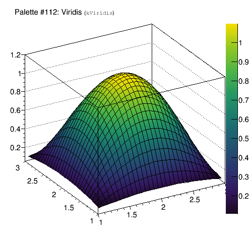

% ROOT Version 6.06 Release Notes
% 2015-06-02
<a name="TopOfPage"></a>

## Introduction

ROOT version 6.06/00 is scheduled for release in November, 2015.

For more information, see:

[http://root.cern.ch](http://root.cern.ch)

The following people have contributed to this new version:

 David Abdurachmanov, CERN, CMS,\
 Bertrand Bellenot, CERN/SFT,\
 Rene Brun, CERN/SFT,\
 Philippe Canal, FNAL,\
 Cristina Cristescu, CERN/SFT,\
 Olivier Couet, CERN/SFT,\
 Kyle Cranmer, NYU, RooStats,\
 Gerri Ganis, CERN/SFT,\
 Andrei Gheata, CERN/Alice,\
 Lukasz Janyst, CERN/IT,\
 Christopher Jones, Fermilab, CMS,\
 Wim Lavrijsen, LBNL, PyRoot,\
 Sergey Linev, GSI, http, JSROOT, \
 Pere Mato, CERN/SFT,\
 Lorenzo Moneta, CERN/SFT,\
 Axel Naumann, CERN/SFT,\
 Danilo Piparo, CERN/SFT,\
 Timur Pocheptsov, CERN/SFT,\
 Fons Rademakers, CERN/SFT,\
 Enric Tejedor Saavedra, CERN/SFT,\
 Liza Sakellari, CERN/SFT,\
 Manuel Tobias Schiller,\
 David Smith, CERN/IT,\
 Matevz Tadel, UCSD/CMS, Eve, \
 Vassil Vassilev, CERN/SFT \
 Wouter Verkerke, NIKHEF/Atlas, RooFit, \
 Maciej Zimnoch


## Core Libraries

### Dictionary generation

Fixed the dictionary generation in the case of class inside a namespace
marked inlined.

### Thread safety

We added the function `TMethodCall::GetCallFunc` to allow direct access to the function wrapper.

We reduced thread serialization in `TClass::GetCheckSum`, `TClass::GetBaseClassOffset` and `TClass::Property`

`TObjArray::Delete` was updated to allow its caller to explicitly avoid costly checks (extra RecursiveRemove and lock)

We removed the need to create a TThread object per thread in a multi-threaded application.

### TDirectory::TContext

We added a default constructor to `TDirectory::TContext` which record the current directory
and will restore it at destruction time and does not change the current directory.

The constructor for `TDirectory::TContext` that takes a single TDirectory pointer as
an argument was changed to set `gDirectory` to zero when being passed a null pointer;
previously it was interpreting a null pointer as a request to *not* change the current
directory - this behavior is now implement by the default constructor.

## I/O Libraries

### hadd

We extended the `hadd` options to allow more control on the compression settings use for the
output file.  In particular the new option -fk allows for a copy of the input
files with no decompressions/recompression of the TTree baskets even if they
do not match the requested compression setting.

New options:

- `-ff` allows to force the compression setting to match the one from the first input
- `-fk[0-209]` allows to keep all the basket compressed as is and to compress the meta data with the given compression setting or the compression setting of the first input file.
- `-a` option append to existing file
- The verbosity level is now optional after -v

### Command line utilities

We added command line utilities to streamline very common operations performed on root files, like listing their content or creating directories.
The command line utilities are:
- `rootbrowse`: to open the file in a TBrowser
- `rootcp`: to copy content from one file to another
- `rooteventselector`: to select a subset of the events in a tree contained in a file
- `rootls`: to list the content of a rootfile
- `rootmkdir`: to create a directory in a rootfile
- `rootmv`: to move content across files
- `rootprint`: to plot content (histograms, graphs) of files
- `rootrm`: to remove content from files
These utilities took inspiration from the well known *nix commands and all offer the `-h` switch which provides documentation for all options available and example invocation lines.


### I/O New functionalities

### I/O Behavior change.


## TTree Libraries

### Improvement of handling of default number of entries

A new const expression value: `TTree::kMaxEntries` has been introduced to
express the largest possible entry number in a `TTree`.  This is used in
two main cases:

- as the default value for the requested number of entries a routine should be
applied to; for example this is used for `TTree::Draw` and `TTree::Process`.
Previously the default was only 1 billions entries, causing those routines to
end early in case of very large trees.

- as the default value for the number of entries returned by TChain::GetEntriesFast.
The previous value was kBigNumber (set to 1234567890) and internally (but somewhat
inconsistently, see [ROOT-6885]) a larger value was used (named theBigNumber).  Now
`TTree::kMaxEntries` is used throughout TChain.

`TChain::kBigNumber` is deprecated and its value has been changed to be equal
to `TTree::kMaxEntries`.


## Histogram Libraries


## Math Libraries


## RooFit Libraries


## 2D Graphics Libraries

### THistPainter

Improve the algorithm to compute the lower limit of an axis in log scale when its
real lower limit is 0. The problem was reported in ROOT-7414.

Using the `COL` option with histograms having some negative bins; the empty bins
(containing 0) are drawn. In some cases one wants to not draw empty bins
(containing 0) of histograms having a negative minimum. The option `1`, used with
the option `COL`, allows to do that.

Implement the Log option for `CANDLE` plots as requested
[here](https://root.cern.ch/phpBB3/viewtopic.php?f=3&t=20225&p=87006#p87006).

### TTeXDump

From Dmitry Kalinkin (via github): Fix file corruption in `TTeXDump::DrawPolyMarker`
The current implementation of `TTeXDump` uses `TVirtualPS::PrintFast` based methods
to output TeX markup with automatic linewraps. Yet these methods are optimized for
PostScript format where there are a lot of space characters that are used for newline
placement. Current `TTeXDump::DrawPolyMarker` would often produce a long contiguous lines
that trigger a forceful linewrap that can happen in the middle of real number constant
(ignored by latex) or even in the middle of latex command (producing incorrect file).
One solution would be to rewrite TTeXDump using only `PrintRaw` (that you can't mix
with `PrintStr/PrintFast/WriteReal`). The other would be to fix `PrintFast` to not
introduce forced newline. The third option is less intrusive and just adds additional
spaces to provide clues for the proper line wrapping (this is the one implemented in
this change).

### TLatex

Make sure the line width used to draw `#sqrt` is always >= 1.

When a global text alignment was set the `TLatex`characters `#minus`, `#plus`,
`#mp`, `#hbar`, and `#backslash` were mis-aligned. The following macro demonstrate
the problem:

``` {.cpp}
{
   gStyle->SetTextAlign(22);
   TLatex t(.5,.5,"#minus100 #mp100 #plus100 #hbar #backslash");
   t.Draw();
}
```

The angle of a `TLatex` object was set to 0 if the `GetYsize` method was called.

### TColor

New palette `kViridis`. It was presented at SciPy2015 by Stéfan van der Walt and
Nathaniel Smith. It is now matplotlib's current default color map.




### TMultiGraph

Ignore empty graphs when computing the multi-graph range at painting time.

### TASImage

A left click on a image produced a one pixel zoom.

### TCreatePrimitives

The ending of a polyline creation is based on the closeness of the two last
entered points. The previous algorithm was based on user coordinates. It is now
based on pixel to avoid the problem reported here: https://root.cern.ch/phpBB3/viewtopic.php?f=3&t=20343

### TCanvas

When the first canvas created by ROOT was in batch mode, it was note possible to
comme back in interactive mode for the next canvases. this problem was reported here:
https://root.cern.ch/phpBB3/viewtopic.php?f=3&t=20354

## 3D Graphics Libraries


## Geometry Libraries


## Database Libraries


## Networking Libraries

### THttpServer

Support of POST HTTP requests. For example, ROOT objects can be send with POST request and used as arguments of
objects method execution in exe.bin and exe.json requests. Request and response HTTP headers are now directly accessible in THttpCallArg class

When command is registered with THttpServer::RegisterCommand() method,
one could configure additional arguments which should be submitted when
command is executed with cmd.json requests

Introduce restriction rules for objects access with THttpServer::Restrict() method.
Up to now general read-only flag was applied - either
everything read-only or everything is fully accessible.
Now one could restrict access to different parts of
objects hierarchy or even fully 'hide' them from the client.
Restriction based on user account name, which is applied
when htdigest authentication is configured.
One also able to allow execution of selected methods.

Implement multi.bin and multi.json requests.
One could request many items with single HTTP request.
Let optimize communication between server and client.

With *SNIFF* tag in ClassDef() comments one could expose different properties,
which than exposed by the TRootSniffer to the client with h.json requests.
Such possibility ease implementation of client-side code for custom classes.

Allow to bind http port with loopback address.
This restrict access to http server only from localhost.
One could either specify 'loopback' option in constructor:
    new THttpServer("http:8080?loopback")
or in clear text specify IP address to which http socket should be bind:
    new THttpServer("http:127.0.0.1:8080")
If host has several network interfaces, one could select one for binding:
    new THttpServer("http:192.168.1.17:8080")


## GUI Libraries


## Montecarlo Libraries


## PROOF Libraries


## Language Bindings

### Notebooks
We provided integration of ROOT with Jupyter notebooks. For what concerns Python notebooks, tab completion, output and graphics capturing have been enabled. It is possible to switch from Python to C++ and have a C++ notebook at disposal.
New tutorials and code examples have been provided here: https://root.cern.ch/code-examples#notebooks

## JavaScript ROOT

- support registered in THttpServer commands with arguments.
- provide workaround for websites using require.js and older jquery-ui
- support custom requests to remote objects, demonstrated in httptextlog.C tutorial
- rewrite draw.htm (page for individual object drawing) to support all custom features as main gui does

## Tutorials


## Class Reference Guide


## Build, Configuration and Testing Infrastructure
