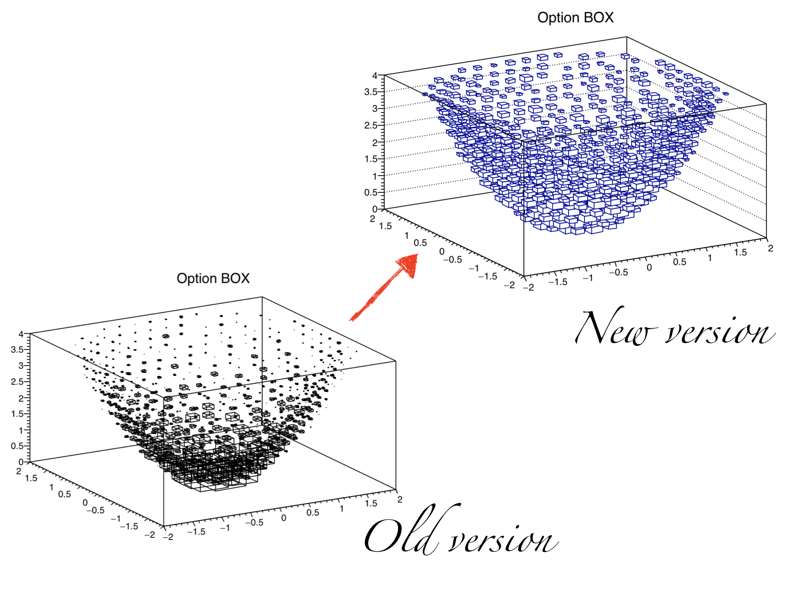

% ROOT Version 6.10 Release Notes
% 2016-09-30
<a name="TopOfPage"></a>

## Introduction

ROOT version 6.10/00 is scheduled for release in 2017.

For more information, see:

[http://root.cern.ch](http://root.cern.ch)

The following people have contributed to this new version:

 Bertrand Bellenot, CERN/SFT,\
 Georgios Bitzes, CERN/IT,\
 Rene Brun, CERN/SFT,\
 Philippe Canal, FNAL,\
 Olivier Couet, CERN/SFT,\
 Gerri Ganis, CERN/SFT,\
 Andrei Gheata, CERN/SFT,\
 Sergey Linev, GSI, http,\
 Pere Mato, CERN/SFT,\
 Lorenzo Moneta, CERN/SFT,\
 Axel Naumann, CERN/SFT,\
 Danilo Piparo, CERN/SFT,\
 Fons Rademakers, CERN/SFT,\
 Enric Tejedor Saavedra, CERN/SFT,\
 Vassil Vassilev, Fermilab/CMS,\
 Wouter Verkerke, NIKHEF/Atlas, RooFit

## Removed interfaces

The following interfaces have been removed, after deprecation in v6.08.

### CINT remnants, dysfunctional for ROOT 6

- `TInterpreter`'s `Getgvp()`, `Getp2f2funcname(void*)`, `Setgvp(Long_t)`, `SetRTLD_NOW()`, `SetRTLD_LAZY()`.
- `SetFCN(void*)` from TVirtualFitter, TFitter, TBackCompFitter, TMinuit
- `TFoam::SetRhoInt(void*)`

### Core

- The enum constant `TRef::kNotComputed`, `TLink::kObjIsParent` were never used and have been removed.
- The enum constant `TClonesArray::kNoSplit` has not been used since v2.26 and has been removed.

## Interpreter

- Automatic declaration of variables (`h = new TH1F(...)`) is *only* available at the prompt. The side-effects of relying on this in source files is simply too grave. Due to a bug (ROOT-8538), automatically declared variables must currently reside on the top-most scope, i.e. not inside an `if` block etc.
- Improved the stack frame information generated by the JIT.  By avoiding interleaving of the memory associated to multiple JIT module, the generation of stack trace involving jitted code and the catching of exception going through jitted code has been repaired.
- Interpreted code is now optimized; `.O 0/1/2/3` can be used to change the optimization level, as well as `#pragma cling optimize`.
- The prompt colors are now much more visible, both on terminals with light and dark background.
- Significant speedup of `TMethodCall`.
- One can now run `.x 12file-with@funny=name.C`; it will expect a function called `_12file_with_funny_name()`.

## Core Libraries

- See "Build, Configuration and Testing Infrastructure" below for changes in the directory structure.
- libCling now exports only a minimal set of symbols.
- Add support for std::array_view also for C++11 builds. The implementation has been modified to work before C++14.
- Added TCollection::Notify to allow notifying more than one object.
```{.cpp}
  TList formulas;
  // Add several TTreeFormula to the list;
  chain.SetNotify(&formulas);
```
- For classes that need the `ClassDef` support, `ClassDefInline(ClassName, Version)` now provides it without the need for a dictionary source: all members injected by this `ClassDef` flavor are generated by the interpreter.

### `TObjString` to `TString`

`TObjString::GetString()` now returns a `const TString&` to the `TString` inside the `TObjString`, instead of copying it.
This is to prevent very common misunderstanding of the interface.

In several cases, the misunderstanding of the interface caused invalid memory accesses to the already destructed
temporary `TString` returned by `GetString()`, e.g. `objStr->GetString().Data()`. This will be fixed automatically by the
new return type.

In rare cases, the caller expected `GetString()` to return a (non-const) reference to the embedded `TString`, e.g.
`objString->GetString().ReplaceAll("a", "b"); // WRONG!` This will now fail to compile, instead of not doing what the author of the
code expected. Please fix that code by using the `TObjString::String()` interface, which returns a non-const `TString&`:
`objString->String().ReplaceAll("a", "b");`.

In extremely rare cases, this change breaks a valid use where the temporary `TString` was modified and then captured in a new `TString`
object before the destruction of the temporary: `TString str = objStr->GetString().ReplaceAll("a", "b");`. In these rare cases,
please use the new function `CopyString()` which clearly indicates that it involves a temporary.


## Histogram Libraries

- New class `THnChain` was added to provide a `TChain`-like experience when
  working with `THnBase`'ed histograms (currently `THn` and `THnSparse`) from
  many files, see [here](https://sft.its.cern.ch/jira/browse/ROOT-4515). This
  allows to e.g., interactively adjust axis parameters before performing
  projections from high-dimensional histograms,

  ```{.cpp}
  // Create a chain of histograms called `h`.
  THnChain chain("h");

  // Add files containing histograms `h` to `chain`.
  chain->AddFile("file1.root");

  chain->GetXaxis(1)->SetRangeUser(0.1, 0.2);

  TH1* projection = chain->Projection(0)
  ```


## Math Libraries

* Improve thread friendliness of the TMinuit class.

## RooFit Libraries

- Remove deprecated `RooComplex` superseded by `std::complex`.

## TTree Libraries

- `TTreeReader` now supports `TEntryList`s, `Double32_t` / `Float16_t`.
- `TTreeReader::SetLastEntry()` has been deprecated. Its name is misleading; please use `TTreePlayer::SetEntriesRange()` instead.
- `TTree::Branch()` now complains for wrong leaf list strings, e.g. "value/F[4]" (which should really be spelled as "value[4]/F").
- Allow reading of older version of TTreePerfStats (ROOT-8520)
- In `TTree::OptimizeBaskets()` do not call GetBasket(0) to avoid disc reads
- It is now possible to define the precision of the default histogram created
  by `TTree::Draw`. Three new parameters are available in `$ROOTSYS/etcsystem.rootrc`
  ```{.cpp}
   Hist.Precision.1D:           float
   Hist.Precision.2D:           float
   Hist.Precision.3D:           float
  ```
  the default values are `float`. They can be set to `double`.
- Fix ROOT-8742: TTree::SetBranchAddress could not be invoked safely even when dealing with the same tree obtained from the same file opened in different threads.
- TTree::Branch() now complains if a "name[size]/F" branch specification is passed wrongly (e.g. as "name/F[size]")

### TDataFrame
- Creation of the TDataFrame class. The TDataFrame allows to interact with data
stored in columnar format in a functional and intuitive way in order to perform
data analysis. Parallelism is accessible simply by activating implicit
multi-threading with the ROOT::EnableImplicitMT() function.
In a nutshell, the functionality provided is:
    - Create and fill histograms with one single method invocation
    - Express filtering of entries with strings, lambdas or functions
    - Easy creation of efficiencies of cut-flows
    - Possibility to run on ranges of entries
    - Creating columns not present in the original dataset
    - Chain multiple actions to be executed on the same event loop
    - Creation of events on-the-fly (e.g. via Pythia or user-define generator functors), with no need for an input TTree
    - Snapshot on a rootfile the dataset after cuts and after augmentation with columns created by the user
    - Run analyses expressed as chains of actions in parallel in a transparent way for the user
See [the online documentation](https://root.cern.ch/doc/master/classROOT_1_1Experimental_1_1TDF_1_1TDataFrame.html) for more details

## 2D Graphics Libraries
- If one used "col2" or "colz2", the value of `TH1::fMaximum` got modified.
  This deviated from the behavior of "col" or "colz". This is now fixed as
  requested [here](https://sft.its.cern.ch/jira/browse/ROOT-8389).
- When the option SAME (or "SAMES") is used with the option COL, the boxes' color
  are computing taking the previous plots into account. The range along the Z axis
  is imposed by the first plot (the one without option SAME); therefore the order
  in which the plots are done is relevant.
- With option BOX on 2D histos with negative content:
    - do not draw the empty bins as requested [here](https://sft.its.cern.ch/jira/browse/ROOT-8385).
    - fix the issue mentioned [here](https://sft.its.cern.ch/jira/browse/ROOT-*402).
- When several histogram were drawn on top of each other with the option
  `BOX SAME` and if the log scale along Z was on, the plot showed only the
  first histogram. This can be reproduce by using the documentation example
  illustrating `BOX SAME`and turning the canvas into log scale along Z.
- In TLatex:
    - Do not paint the text when the text size is <= 0. This fixes
      the problem mentioned [here](https://sft.its.cern.ch/jira/browse/ROOT-8305)
    - Do not paint text if the text string is empty.
- From: Sergey Linev: In `TPad::SaveAs` method json file extension is now handled
- Because of some precision issue some data points exactly on the plot limits of
  a `TGraph2D` were not drawn (option `P`).
  The problem was reported [here](https://sft.its.cern.ch/jira/browse/ROOT-8447).
- New options for automatic coloring of graphs and histograms. When several
  histograms or graphs are painted in the same canvas thanks to the option "SAME"
  via a `THStack` or `TMultigraph` it might be useful to have an easy and automatic
  way to choose their color. The simplest way is to pick colors in the current active color
  palette. Palette coloring for histogram is activated thanks to the options `PFC`
  (Palette Fill Color), `PLC` (Palette Line Color) and `AMC` (Palette Marker Color).
  When one of these options is given to `TH1::Draw` the histogram get its color
  from the current color palette defined by `gStyle->SetPalette(…)`. The color
  is determined according to the number of objects having palette coloring in
  the current pad.
- The line width and line style can be change on 2d histograms painted with
  option `ARR`.
- When the angle of a TGraphPolar was not in radian, the error bars were misplaced.
  The problem was reported [here](https://sft.its.cern.ch/jira/browse/ROOT-8476).
- In `TASimage::DrawLineInternal` the case of a line with 0 pixel along X and 0
  pixel along Y was not treated properly. An horizontal line was drawn instead.
- In `TGraphPainter::PaintGrapHist`: Decouple the `P` option (histogram drawn with
  a simple polymarker) from the `L` option (Histogram drawn as a simple polyline). This
  improved (in some cases some extra markers were drawn) and simplified the code.
- Candle plot improvements:
   * Rearragement of TCandle-code - split into calculate and paint
   * Implementation for a "raw-data candle" inside TCandle - to be used from TTreeViewer in the future
   * Implementation of 1D histograms along each candle (left, right and violin) - to be used for violin-charts
   * Implementation of a zero indicator line for TCandle - to be used for violin-charts
   * Reimplementation if THistPainter draw option VIOLIN
   * Implementations of presets and individual options for VIOLIN-charts
   * Implementation of VIOLIN-charts in THStack - can be combined with CANDLE
   * Update of the docs (THistPainter and THStack)
   * New tutorials
- In various places in TGraph the underlying histogram was deleted when the graph
  range should be recomputed. This has the side effect that some graph parameters
  (like the axis titles) were also deleted. This now fixed. It was reported
  [here](https://sft.its.cern.ch/jira/browse/ROOT-8092).
- Improve the error bars drawing in TLegend to match the plot's error
  drawing. This improvement was requested [here](https://sft.its.cern.ch/jira/browse/ROOT-5468).
- Implement text clipping in TASImage as requested [here](https://sft.its.cern.ch/jira/browse/ROOT-4538).
  Also the text size in batch mode for png (gif jpeg) files better matches the
  size on screen and pdf.
- `TMathText` and `TTeXDump` implement the `TLatex` character `\bar`.
- In the following example, `TPad::WaitPrimitive` was not stoping the macro
  execution after each plot :
~~~ {.cpp}
{
   TCanvas c1("c1");
   TFile f("hsimple.root");
   hpx->Draw();        gPad->WaitPrimitive();
   hpxpy->Draw();      gPad->WaitPrimitive();
   hprof->Draw();
~~~
  this was reported [here](https://root.cern.ch/phpBB3/viewtopic.php?f=3&t=22957).
- New flag `Cocoa.EnableFillAreaAntiAliasing` in `system.rootrc` to enable the
  anti-aliasing for filled area for the Cocoa backend. Default is `no`.
- The "BOX" option, to draw 3D histograms, has been reimplemented by Evgueni Tcherniaev
  The following picture show the old and new version



- Implement options "BOX1", "BOX2" and "BOX3" for TH3 equivalent of "LEGO1", "LEGO2" and "LEGO3"for TH2.
- When a 2d histogram was drawn with option `LEGO1` and white colored, the dark side
  of the lego was red instead of gray.
- New option "0" to draw TH2Poly. When used with any `COL` options, the empty
  bins are not drawn.
- Fix a long pending problem with Z axis drawing when a lego or a surface was drawn
  upside-down.
- Add a protection in TLatex when a string has a syntax error. It was reported
  [here](https://sft.its.cern.ch/jira/browse/ROOT-7424).
- Implement the automatic placement of the Y axis title. If the title offset is
  set to 0:
~~~ {.cpp}
  h->GetYaxis()->SetTitleOffset(0.);
~~~
   the axis title is automatically placed to avoid overlaps with the axis labels.
- Implement the automatic placement of the `TLegend`. A new constructor not
  specifying the legend position is available. Only width and height are defined.
- `ChangeLabel` is now available for log axis as well as requested [here](https://sft.its.cern.ch/jira/browse/ROOT-8537).
- The `TGraph` copy constructor also copy the underlying `TH1F` if it exists (it
  holds the axis titles).
- `TGraph` axis range was computed differently depending on the order of SetLog[x|y]"
  This issue was reported [here](https://sft.its.cern.ch/jira/browse/ROOT-8751)
- Add the new markers suggested [here](https://root-forum.cern.ch/t/adding-custom-markers/24506).
  Improve the marker style for the OpenGl backend (some where wrong or missing).


- Remove a large memory leak in TFITSHDU's GetArrayRow, GetArrayColumn and GetTabRealVectorColumn member functions.
- When `TGraph`s belonging to a `TMultiGraph` were changed (for instance with `SetPoint`)
  after the `TMultiGraph` was drawn, the `TMultiGraph` range was not recomputed.
  This issue was discovered thanks to [this forum post](https://root-forum.cern.ch/t/multi-layer-perceptron/24561/2).
- When a TGraph is drawn, the X-axis is drawn with increasing values from left to
  right and the Y-axis from bottom to top. The two options `RX` and `RY` allow to
  change this order. The option `RX` allows to draw the X-axis with increasing values
  from right to left and the `RY` option allows to draw the Y-axis with increasing
  values from top to bottom.
~~~ {.cpp}
   g->Draw("APL");
   g->Draw("A RX RY PL");
~~~


## 3D Graphics Libraries
- In `TMarker3DBox::PaintH3` the boxes' sizes was not correct.
- The option `BOX`and `GLBOX` now draw boxes with a volume proportional to the
  bin content to be conform to the 2D case where the surface of the boxes is
  proportional to the bin content.

## Geometry Libraries

## Dictionaries
- Stop dictionary generation early, during AST scanning, if a union is selected for I/O as this is not supported (triggered by [ROOT-8492](https://sft.its.cern.ch/jira/browse/ROOT-8492))
- Allow inclusion of headers in linkdef files [ROOT-7765](https://sft.its.cern.ch/jira/browse/ROOT-7765)
- More expressive error messages when trying to directly select std::arrays
- rootcling now `#define`s `__PIC__` when parsing input headers [ROOT-8719].

## I/O Libraries
- [[ROOT-8478](https://sft.its.cern.ch/jira/browse/ROOT-8478)] - Prompt error when building streamer info and a data member is a vector<T> w/o dictionary
- Fix ROOT-8686 and ROOT-8595 which led to error when persistifying classes which featured std::arrays as data members in TTrees.
- TDavixFile: Added support for bucket name in path
- Fix error sometimes prompted when trying to write std::array column-wise


## Database Libraries


## Networking Libraries


## GUI Libraries


## Montecarlo Libraries


## Parallelism and PROOF
- Add ROOT::GetImplicitMTPoolSize function to get the size of the pool used to enable implicit multi threading
- Add the TThreadExecutor::Foreach method for parallelising functions featuring void return type
- Add TBufferMerger and TBufferMergerFile classes

  TBufferMerger is a class to facilitate writing data in
  parallel from multiple threads, while writing to a single
  output file. Its purpose is similar to TParallelMergingFile,
  but instead of using processes that connect to a network
  socket, TBufferMerger uses threads that each write to a
  TBufferMergerFile, which in turn push data into a queue
  managed by the TBufferMerger. An excerpt of the
  [tutorial](https://github.com/root-project/root/blob/master/tutorials/multicore/mt103_fillNtuples.C)
  is shown below.
  ```{.cpp}
  // Create the TBufferMerger
  TBufferMerger merger("mp103_fillNtuple.root");

  // Define what each worker will do
  auto work_function = [&]() {
     auto f = merger.GetFile();
     TNtuple ntrand("ntrand", "Random Numbers", "r");
     fill(ntrand, nEventsPerWorker);
     ntrand.Write();
     f->Write();
  };
  ```

## Language Bindings

- Add in PyROOT the converter for std::string_view
- Fix ROOT-8811: pickling of ROOT.Long now works
- Fix ROOT-8809: push_back on a vector of pointers
- Fix ROOT-8805: itemsize was not set on buffers returned by PyROOT functions

## JavaScript ROOT


## Tutorials


## Class Reference Guide


## Build, Configuration and Testing Infrastructure

- rlibmap has been removed; it was deprecated for three years.
- Added the CMake exported ROOT libraries into the ROOT:: namespace. In this way, projects based on CMake using ROOT can avoid
  conflicts in library target names. As an example, this is the way to build a project consisting of one library and one
  executable using ROOT.
  ```
  find_package(ROOT REQUIRED)
  include(${ROOT_USE_FILE})

  include_directories(${CMAKE_SOURCE_DIR} ${ROOT_INCLUDE_DIRS})
  add_definitions(${ROOT_CXX_FLAGS})

  ROOT_GENERATE_DICTIONARY(G__Event Event.h LINKDEF EventLinkDef.h)

  add_library(Event SHARED Event.cxx G__Event.cxx)
  target_link_libraries(Event ROOT::Hist ROOT::Tree)

  add_executable(Main MainEvent.cxx)
  target_link_libraries(Main Event)
  ```
- Added option `builtin_all` to enable all the built in options.
- For rootcling_stage1 (formerly known as rootcling_tmp), the package structure was changed to enable homogenous visibility
  settings across object files. See core/README for an overview.
- Several non-public headers are not copied into include/ anymore; they reside in the PACKAGE/res/ subdirectory in the source tree.
- The IMT switch is set to on by default.
- A new library is now created, libImt. It contains all classes which depend on TBB. Those classes were previously part of libThread. As a consequence rootcling/genreflex do not depend anymore from TBB even in presence of imt builds.
- Refactoring of several math tests to avoid exact comparisons of floating point numbers
