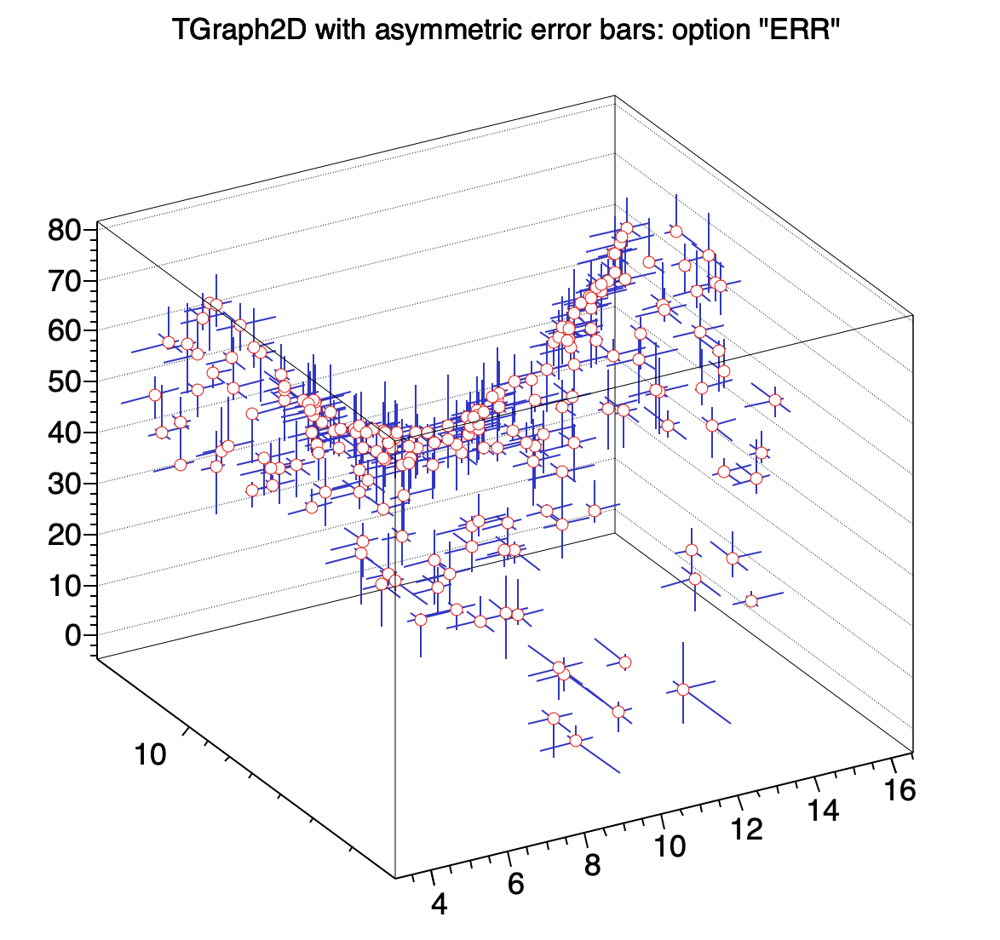
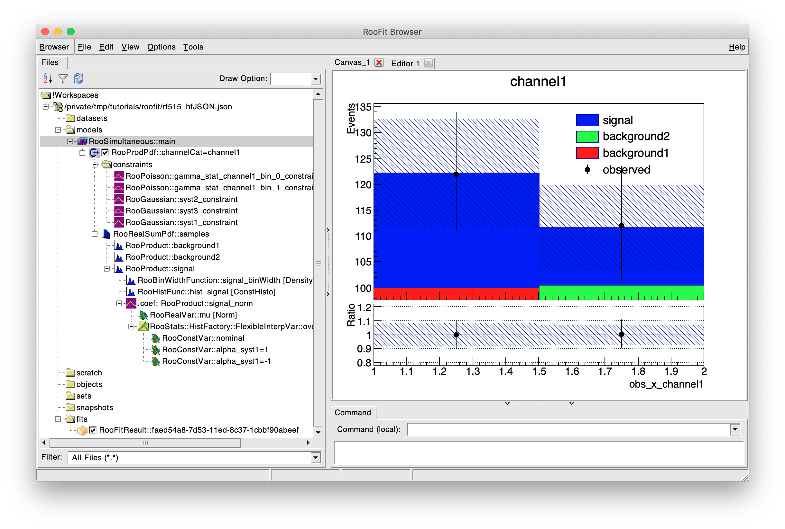

% ROOT Version 6.28 Release Notes
% 2022-01-05
<a name="TopOfPage"></a>

## Introduction

ROOT version 6.28/00 is scheduled for release in May 2022.

For more information, see:

[http://root.cern](http://root.cern)

The following people have contributed to this new version:

 Rahul Balasubramanian, NIKHEF/ATLAS,\
 Bertrand Bellenot, CERN/SFT,\
 Jakob Blomer, CERN/SFT,\
 Patrick Bos, Netherlands eScience Center,\
 Rene Brun, CERN/SFT,\
 Carsten D. Burgard, TU Dortmund University/ATLAS,\
 Will Buttinger, RAL/ATLAS,\
 Philippe Canal, FNAL,\
 Olivier Couet, CERN/SFT,\
 Michel De Cian, EPFL/LHCb,\
 Mattias Ellert, Uppsala University,\
 Gerri Ganis, CERN/SFT,\
 Andrei Gheata, CERN/SFT,\
 Konstantin Gizdov, University of Edinburgh/LHCb,\
 Max Goblirsch, CERN/ATLAS,\
 Enrico Guiraud, CERN/SFT,\
 Stephan Hageboeck, CERN/IT,\
 Jonas Hahnfeld, CERN/SFT,\
 Ahmat Mahamat Hamdan, CERN/SFT,\
 Fernando Hueso-González, University of Valencia,\
 Subham Jyoti, ITER Bhubaneswar,\
 Sergey Linev, GSI,\
 Javier Lopez-Gomez, CERN/SFT,\
 Enrico Lusiani, INFN/CMS,\
 Pere Mato, CERN/SFT,\
 Lorenzo Moneta, CERN/SFT,\
 Nicolas Morange, CNRS/ATLAS,\
 Axel Naumann, CERN/SFT,\
 Hanna Olvhammar, CERN/SFT,\
 Vincenzo Eduardo Padulano, CERN/SFT and UPV,\
 Danilo Piparo, CERN/SFT,\
 Fons Rademakers, CERN/SFT,\
 Jonas Rembser, CERN/SFT,\
 Enric Tejedor Saavedra, CERN/SFT,\
 Neel Shah, GSOC,\
 Sanjiban Sengupta, CERN/SFT,\
 Harshal Shende, GSOC,\
 Garima Singh, Princeton/SFT,\
 Matevz Tadel, UCSD/CMS,\
 Vassil Vassilev, Princeton/CMS,\
 Wouter Verkerke, NIKHEF/ATLAS,\
 Zef Wolffs, NIKHEF/ATLAS,\
 Ivan Kabadzhov, CERN/SFT,\
 David Poulton, Wits/SFT

## Deprecation and Removal

- The deprecated types `ROOT::Experimental::TBufferMerger` and `ROOT::Experimental::TBufferMergerFile` are removed.
Please use their non-experimental counterparts `ROOT::TBufferMerger` and `ROOT::TBufferMergerFile` instead.
- `ROOT::RVec::shrink_to_fit()` has now been removed after deprecation; it is not needed.
- `ROOT::RVec::emplace()` has now been removed after deprecation; please use `ROOT::RVec::insert()` instead.
- The deprecated function `ROOT::Detail::RDF::RActionImpl<Helper>::GetDataBlockCallback()` is removed; please use `GetSampleCallback()` instead.
- The deprecated RooFit containers `RooHashTable`, `RooNameSet`, `RooSetPair`, and `RooList` are removed. Please use STL container classes instead, like `std::unordered_map`, `std::set`, and `std::vector`.
- The `RooFit::FitOptions(const char*)` command to steer [RooAbsPdf::fitTo()](https://root.cern.ch/doc/v628/classRooAbsPdf.html) with an option string was removed. This way of configuring the fit was deprecated since at least since ROOT 5.02.
  Subsequently, the `RooMinimizer::fit(const char*)` function and the [RooMCStudy](https://root.cern.ch/doc/v628/classRooMCStudy.html) constructor that takes an option string were removed as well.
- The overload of `RooAbsData::createHistogram` that takes integer parameters for the bin numbers is now deprecated and will be removed in ROOT 6.30.
  This was done to avoid confusion with inconsistent behavior when compared to other `createHistogram` overloads.
  Please use the verson of `createHistogram` that takes RooFit command arguments.
- The `RooAbsData::valid()` method to cache valid entries in the variable range
  was removed. It was not implemented in RooDataSet, so it never worked as
  intended. Related to it was the `RooDataHist::cacheValidEntries()` function, which is removed as well.
  The preferred way to reduce RooFit datasets to subranges is [RooAbsData::reduce()](https://root.cern.ch/doc/v628/classRooAbsData.html#acfa7b31e5cd751eec1bc4e95d2796390).
- The longtime-deprecated `RooStats::HistFactory::EstimateSummary` class is removed, including the functions that use it. The information that it was meant to store is managed by the `RooStats::HistFactory::Measurement` object since many years.
- The `RooSuperCategory::MakeIterator()` function that was deprecated since 6.22 is now removed. Please use range-based loops to iterate over the category states.
- The `HybridCalculatorOriginal` and `HypoTestInverterOriginal` classes in RooStats that were deprecated for a very long time aleady are removed. Please use `HybridCalculator` and `HypoTestInverter`.
- The `RooSimPdfBuilder` that was deprecated in ROOT 5.20 and replaced by the `RooSimWSTool` is removed.
- The RDataFrame factory functions `MakeNumpyDataFrame`, `MakeCsvDataFrame`, `MakeArrowDataFrame`, `MakeNTupleDataFrame` and `MakeSqliteDataFrame` are now deprecated in favor of `FromNumpy`, `FromCSV`, `FromArrow`, `FromRNTuple` and `FromSqlite` respectively.

- The build option `alien` has been removed.
- The build options `gfal`, `gsl_shared`, `jemalloc`, `monalisa`, `pyroot_legacy`, `tcmalloc`, and `xproofd` have been deprecated. Please complain with root-dev@cern.ch should you still need one!

## rootreadspeed

This version adds the new `rootreadspeed` CLI tool. This tool can be used to help identify bottlenecks in analysis runtimes, by providing time and throughput measurements when reading ROOT files via file systems or XRootD. More detailed information can be found in the tool's help information.

To see help information, install and source a recent enough version of ROOT, and run the command `rootreadspeed --help` in your terminal.

### Example usage of the tool:

```console
$ rootreadspeed --files <local-folder>/File1.root xrootd://<url-folder>/File2.root --trees Events --all-branches --threads 8
```

## Core Libraries

### Interpreter

#### Support for profiling/debugging interpreted/JITted code

This version of ROOT adds an LLVM JIT event listener to create perf map files
during runtime. This allows profiling of interpreted/JITted code generated by
cling. Instead of function addresses, the perf data will contain full function
names. In addition, stack frame pointers are enabled in JITted code, so full
stack traces can be generated. Debugging is aided by switching off optimisations
and adding frame pointers for better stack traces. However, since both have a
runtime cost, they are disabled by default. Similar to `LD_DEBUG` and `LD_PROFILE`
for `ld.so`, the environment variables `CLING_DEBUG=1` and/or `CLING_PROFILE=1`
can be set to enable debugging and/or profiling.

### Other changes

- Shadowing of declarations in the `std` namespace is now diagnosed. Specifically, given that ROOT injects `using namespace std` directive, _all_ the names in the `std` namespace become available in the global scope. However, in some circumstances users inadvertently introduce a declaration that conflicts with a name in `std` making references to the former declaration result in ambiguous lookup.
A fairly common case is trying to declare a global variable named `data` which conflict with [`std::data`](https://en.cppreference.com/w/cpp/iterator/data) [C++17]. See [ROOT-5971](https://sft.its.cern.ch/jira/browse/ROOT-5971) for a discussion.
As of v6.28, such declarations result in
```
root [] int data;
ROOT_prompt_0:1:1: warning: 'data' shadows a declaration with the same name in the 'std' namespace; use '::data' to reference this declaration
int data;
^
```

- Line editing at the ROOT interactive prompt has been improved. This version introduces useful shortcuts for common actions, e.g. Xterm-like fast movement between words using Ctrl+Left and Ctrl+Right, Ctrl+Del to delete the word under the cursor, or clearing the screen using Ctrl+L. Most users coming from a GUI will find these shortcuts convenient.
A list of the available key bindings is printed by
```
root [] .help edit
```

## I/O Libraries

### Faster reading from EOS

A new cross-protocol redirection has been added to allow files on EOS mounts to be opened
by `TFile::Open` via XRootD protocol rather than via FUSE when that is possible. The
redirection uses the `eos.url.xroot` extended file attribute that is present on files in EOS.
The attribute can be viewed with `getfattr -n eos.url.xroot [file]` on the command line.
When the URL passed into `TFile::Open` is a for a file on an EOS mount, the extended
attribute is used to attempt the redirection to XRootD protocol. If the redirection fails,
the file is opened using the plain file path as before. This feature is controlled by the
pre-existing configuration option `TFile.CrossProtocolRedirects` and is enabled by default.
It can be disabled by setting `TFile.CrossProtocolRedirects` to `0` in `rootrc`.

## TTree Libraries

## RNTuple
ROOT's experimental successor of TTree has seen many updates during the last few months. Specifically, v6.28 includes the following changes:

- Complete support for big-endian architectures (PR [#10402](https://github.com/root-project/root/pull/10402)).

- Support for `std::pair<T1, T2>` and `std::tuple<Ts...>` fields

- Support for C array fields whose type is of the form `T[N]`. Note that only single-dimension arrays are currently supported.

- Improvements to the ROOT file embedding (PR [#10558](https://github.com/root-project/root/pull/10558)). In particular, a `RNTupleReader` or `RDataFrame` object can be created from a `TFile` instance as follows
```
auto f = TFile::Open("data.root");
auto ntpl = f->Get<ROOT::Experimental::RNTuple>("Events");

auto reader = ROOT::Experimental::RNTupleReader::Open(ntpl);
// or for RDataFrame
auto rdf = ROOT::Experimental::MakeNTupleDataFrame(ntpl);
```

- If buffered write is enabled, vector writes are used where possible. In particular, this yields important improvements in storage backends leveraging parallel writes, e.g. in object storages.

- Large read/write throughput improvements in the experimental Intel DAOS backend.

- `RNTupleWriter::Fill()` now returns the number of uncompressed bytes written, which is align with TTree behavior.

- Support for user-defined classes that behave as a collection via the `TVirtualCollectionProxy` interface.
Fields created via `RFieldBase::Create()` automatically detect the presence of a collection proxy at run-time. However, if `RField<T>` (`T` being a class) is used instead, the trait `IsCollectionProxy<T>` must be set for the given type (see PR [#11525](https://github.com/root-project/root/pull/11525) for details).
Note that associative collections are not yet supported.

- Some internal support for per field post-read callbacks. This functionality will be presented in upcoming releases through custom I/O rules.

Please, report any issues regarding the abovementioned features should you encounter them.
RNTuple is still experimental and is scheduled to become production grade in 2024. Thus, we appreciate feedback and suggestions for improvement.

## RDataFrame

### New features

- Add [`GraphAsymmErrors`](https://root.cern/doc/master/classROOT_1_1RDF_1_1RInterface.html#acea30792eef607489d498bf6547a00a6) action that fills a TGraphAsymmErrors object.
- Introduce [`RDatasetSpec`](https://root.cern/doc/master/classROOT_1_1RDF_1_1Experimental_1_1RDatasetSpec.html) as an
experimental class to specify the input dataset to an RDataFrame.
- Arbitrary metadata can be associated to the samples in the dataset specified via `RDatasetSpect`. The metadata of each
sample can then be retrieved during the execution by calling `DefinePerSample`.
- Users can create an RDataFrame with a dataset specification written in a JSON file via the factory function
[ROOT::RDF::Experimental::FromSpec](https://root.cern/doc/master/namespaceROOT_1_1RDF_1_1Experimental.html#a7193987f3c1b65c649399656cc6acce8).

### Notable bug fixes and improvements

- Fix the node counter of [`SaveGraph`](https://root.cern/doc/master/namespaceROOT_1_1RDF.html#ac06a36e745255fb8744b1e0a563074c9), where previously `cling` was getting wrong static initialization.
- Fix [`Graph`](https://root.cern/doc/master/classROOT_1_1RDF_1_1RInterface.html#a1ca9a94bece4767cac82968910afa02e) action (that fills a TGraph object) to properly handle containers and non-container types.
- The [`RCsvDS`](https://root.cern.ch/doc/master/classROOT_1_1RDF_1_1RCsvDS.html) class now allows users to specify column types, and can properly read empty entries of csv files.
- Fixed a bug where the `Display` operation would not show the correct amount of entries requested by the user if called
together with other operations ([PR](https://github.com/root-project/root/pull/11398)).
- Requesting variations for `Stats` results with `VariationsFor` is now supported.
- Factory functions for RDataFrames reading CSV files, RNTuples, Arrow tables, etc. have been renamed in order to
increase consistency, e.g. `MakeCsvDataFrame` is now `FromCSV`. The old wording is still available but deprecated.
- The precision of `Sum`s and `Mean`s of single-precision floating point values has been greatly improved by employing
Kahan summations.
- The content of [execution logs](https://root.cern/doc/master/classROOT_1_1RDataFrame.html#rdf-logging) from RDataFrame
has been streamlined in order to make them more useful.

### Distributed RDataFrame

- Add support for systematic variations (e.g. `Vary` and `VariationsFor` operations) in distributed mode.
- If an instant action (e.g. `Snapshot`) is purposely made lazy by the user, distributed RDataFrame now respects this
and avoids triggering the computations right away.
- The algorithm for automatic splitting of the input dataset has been reworked, bringing the startup time cost of
distributed RDataFrame close to zero.
- A histogram model (name, title, binning) for the `Histo*D` actions is now required in distributed mode. See the
[relative PR](https://github.com/root-project/root/pull/10368) for more discussion.
- The performance of distributed RDataFrame for large computation graphs (>1000 operations) has been greatly improved.
- If the `npartitions` argument is not set by the user, the default number of tasks created by a distributed RDataFrame
is equal to the number of cores specified by the user when connecting to the cluster.
- C++ exceptions (i.e. instances of `std::exception` and derived) are now correctly propagated from the processes of the
computing nodes to the user side.
- The minimum `dask` version required to support distributed RDataFrame is 2022.8.1, since a series of critical bugs
present before that version were hindering the normal execution of the tool. Consequently, the minimum Python version
needed to include distributed RDataFrame in the ROOT build is Python 3.8. More information in the relative
[github issue](https://github.com/root-project/root/issues/11515).
- `Stats` and `StdDev` operations are now available in distributed mode.
- `GetColumnNames` operation is now available in distributed mode.

## Histogram Libraries

- New class `TGraph2DAsymmErrors` to create TGraph2D with asymmetric errors.


## Math Libraries

### Fitter class

Some improvements and small fixes to the internal object memory management have been applied to the `ROOT::Fit::Fitter` class.
- When setting an external FCN (objective function) to the Fitter, the function object is not cloned anymore.
- A memory leak has been fixed, when using the `GSLMultiFit` class.
- A bug has been resolved in setting fixed variables when using the linear fitter (via the `TLinearMinimizer` class).

Support for providing the second derivatives (Hessian matrix) from the model function is added to the `Fitter` class and the corresponding function interfaces. The functionality it is then propagated in the implementation of the `FitMethod` classes and it is also added to the `Minimizer` classes for providing a user computed Hessian of the objective functions to the minimizers. Only Minuit2 (see below) has the capabilities of using this external Hessian.

The `GradFunctor` class has been improved by providing a new constructor taking an `std::function` implementing the full gradient calculations instead of the single partial derivative.

The specialized methods for least-square/likelihood functions such as Fumili, Fumili2 and GSLMultiFit have been improved in case of binned likelihood fits, where a better approximation is used than before. This makes these method work better (conerging with less number of function calls) for these types of fits.

### Minuit2

The support for using an External Hessian calculator has been added. The external Hessian can be used for both the initial seeding, using only the diagonal part, if the strategy is equal to 1 (the default value) and in `MnHesse`, after the minimization, to compute the covariance and correlation matrices.

The print log of Minuit2 has been improved, especially when printing vector and matrices with large number of parameters (when the print level = 3).


### KahanSum updates

The `ROOT::Math::KahanSum` class was slightly modified:
- The behavior of `operator-=` and `operator+=` on a `KahanSum` were not symmetric, leading to slight bit-wise inaccuracies. In fits, where such operations are done a lot of times (e.g. through the offsetting mechanism in RooFit which subtracts a constant `KahanSum` term after each likelihood evaluation), this can add up to significant numerical divergence. An improved algorithm was implemented, based on an algorithm for combining Kahan sums and carry terms (Tian et al. 2012). (PR #11940)
- The auto-conversion to type `T` and implicit type `T` constructor in `KahanSum` made it hard to debug `KahanSum`, because it is easy to overlook implicit conversions in code, especially in lines where the type of the return value is `auto`. These auto-conversions were removed. Where necessary, they should be replaced with an explicit construction or explicit conversion to double via `Sum()`. (PR #11941)
- Binary addition and subtraction operators were added, as well as a unary negation operator. (PR #11940)
- Comparison operators `operator==` and `operator!=` were added.

### Foam

The usage of `TRef` in the `TFoamCell` class has ben replaced with array indices. This avoids, when generating a large number of toys requiring a re-initialization of `TFoam` an increase in the memory usage caused by `TRef`.

### RVec

- a number of new helper functions have been added to [RVec](https://root.cern/doc/master/classROOT_1_1VecOps_1_1RVec.html): [Range](https://root.cern/doc/master/group__vecops.html#ga59cc6e477803f2bfd7dae29e56048cc1), [Product](https://root.cern/doc/master/group__vecops.html#ga25e4c2cf5c82fe56dd6bbc86b2386b69) and Enumerate
- the [Take](https://root.cern/doc/master/group__vecops.html#gac719439afb1ec9d32a28acdc7aee5948) helper function now allows passing a default value that will be used to fill the output array in case it's longer than the input

## RooFit Libraries

### Consistent definition of the default minimizer type for all of RooFit/RooStats

In previous releases, the default minimizer type that RooFit used was hardcoded to be the original `Minuit`, while RooStats used the default minimizer specified by `ROOT::Math::MinimizerOptions::DefaultMinimizerType()`. Now it is possible to centrally define the global minimizer for all RooFit libraries via `ROOT::Math::MinimizerOptions::SetDefaultMinimizer()`, or alternatively in the `.rootrc` file by adding for example `Root.Fitter: Minuit2` to select Minuit2.


### Code modernization by using `std::string` in RooFit interfaces

The following lesser-used RooFit functions now return a `std::string` instead of a `const char*`, potentially requiring the update of your code:

- [std::string RooCmdConfig::missingArgs() const](https://root.cern/doc/v628/classRooCmdConfig.html#aec50335293c45a507d347c604bf9651f)
### Uniquely identifying RooArgSet and RooDataSet objects

Before v6.28, it was ensured that no `RooArgSet` and `RooDataSet` objects on the heap were located at an address that had already been used for an instance of the same class before.
With v6.28, this is not guaranteed anymore.
Hence, if your code uses pointer comparisons to uniquely identify RooArgSet or RooDataSet instances, please consider using the new `RooArgSet::uniqueId()` or `RooAbsData::uniqueId()`.

### Introducing binned likelihood fit optimization in HistFactory

In a binned likelihood fit, it is possible to skip the PDF normalization when
the unnormalized binned PDF can be interpreted directly in terms of event
yields. This is now done by default for HistFactory models, which
results in great speedups for binned fits with many channels. Some RooFit users
like ATLAS were already using this for a long time.

To disable this optimization when using the `hist2workspace` executable, add the `-disable_binned_fit_optimization` command line argument.
Directly in C++, you can also set the `binnedFitOptimization` to `false` in the
HistFactory configuration as follows:
```C++
RooStats::HistFactory::MakeModelAndMeasurementFast(measurement, {.binnedFitOptimization=false});
```
If your compiler doesn't support aggregate initialization with designators, you
need to create and edit the configuration struct explicitely:
```C++
RooStats::HistFactory::HistoToWorkspaceFactoryFast::Configuration hfCfg;
hfCfg.binnedFitOptimization = false;
RooStats::HistFactory::MakeModelAndMeasurementFast(measurement, hfCfg);
```

### Disable copy assignment for RooAbsArg and derived types

Copy assignment for RooAbsArgs was implemented in an unexpected and
inconsistent way. While one would expect that the copy assignment is copying
the object, it said in the documentation of `RooAbsArg::operator=` that it will
"assign all boolean and string properties of the original bject. Transient
properties and client-server links are not assigned." This contradicted with
the implementation, where the server links were actually copied too.
Furthermore, in `RooAbsRealLValue`, the assigment operator was overloaded by a
function that only assigns the value of another `RooAbsReal`.

With all these inconsistencies, it was deemed safer to disable copy assignment
of RooAbsArgs from now on.

### RooBrowser: a graphical user interface for workspace exploration, visualization, and analysis

This experimental new feature utilises the technology from ROOT's familiar `TBrowser` in order to create an interface for graphically exploring and visualizing the content of a workspace, as well as perform basic fitting operations with the models and datasets.




### Removal of deprecated HistFactory functionality

#### Removal of HistoToWorkspaceFactory (non-Fast version)

The original `HistoToWorkspaceFactory` produced models that consisted of a
Poisson term for each bin.  In this "number counting form" the dataset has one
row and the collumns corresponded to the number of events for each bin. This
led to severe performance problems in statistical tools that generated
pseudo-experiments and evaluated likelihood ratio test statistics.

Nowadays, everyone uses the faster `HistoToWorkspaceFactoryFast` implementation that
produces a model in the "standard form" where the dataset has one row for each
event, and the column corresponds to the value of the observable in the
histogram.

Therefore, the original `HistoToWorkspaceFactory` is now removed to avoid
confusion and maintainance burden.

#### Removing constant parameter flag from RooStats:HistFactory::NormFactor

As printed out by the HistFactory in a warning message for a long time already,
setting the `Const` attribute to the `<NormFactor>` tag is deprecated and it
will be ignored. Instead, add `<ParamSetting Const="True"> myparam </ParamSetting>` to your top-level XML's `<Measurement>` entry.

This deprecation implied that the constant parameter flag in the
`RooStats:HistFactory::NormFactor` class had no effect as well. To avoid
ambiguity in the future, the possibility to set and retrieve this flag with
`NormFactor::SetConst()` and `NormFactor::GetConst()` was removed, as well as the
`Sample::AddNormFactor(std::string Name, double Val, double Low, double High, bool Const)`
overload. Also, the aforementioned deprecation warning is not printed anymore.

### Removal of `RooAbsMinimizerFcn` and `RooMinimizerFcn` from the public interface

The `RooAbsMinimizerFcn` class and its implementation `RooMinimizerFcn` were removed from the public interface.
These classes are implementation details of the RooMinimizer and should not be used in your code.
In the unlikely case that this causes any problem for you, please open a GitHub issue requesting to extend the RooMinimizer by the needed functionality.

### Vectorize `RooAbsBinning` interface for bin index lookups

The `RooAbsBinning` interface for bin index lookups was changed to enable vectorized implementations.
Instead of having the override `RooAbsBinning::binNumber()`, the binning implementations now have to override the `RooAbsBinning::binNumbers()` function to evaluate the bin indices of multiple values in one function call.

### Disable relative and absolute epsilon in `RooAbsRealLValue::inRange()`

So far, the `RooAbsRealLValue::inRange()` function used the following
undocumented convention to check whether a value `x` is in the range with
limits `a` and `b`: test if `[x - eps * x, x + eps * x]` overlaps with `[a, b]`, where the
parameter `eps` is defined as `max(epsRel * x, epsAbs)`.

The values of the relative and absolute epsilons were inconsistent among the overloads:

* [RooAbsRealLValue::inRange(const char* rangeName)](https://root.cern.ch/doc/v626/classRooAbsRealLValue.html#ab6050a0c3e5583b9d755a38fd7fb82f7): `epsRel = 1e-8, epsAbs = 0`
* [RooAbsRealLValue::inRange(double value, const char* rangeName, double* clippedValPtr)](https://root.cern.ch/doc/v626/classRooAbsRealLValue.html#afc2a8818f433a9a4ec0c437cbdad4e8a): `epsRel = 0, epsAbs = 1e-6`
* [RooAbsRealLValue::inRange(std::span<const double> values, std::string const& rangeName, std::vector<bool>& out)](https://root.cern.ch/doc/v626/classRooAbsRealLValue.html#af9217abd0afe34364562ad0c194f5d2c): `epsRel = 0, epsAbs = 1e-6`


With this release, the default absolute and relative epsilon is zero to avoid confusion.
You can change them with `RooNumber::setRangeEpsRel(epsRel)` and `RooNumber::setRangeEpsAbs(epsAbs)`.

## TMVA

### SOFIE : Code generation for fast inference of Deep Learning models

A large number of new features have been added in the TMVA SOFIE library. The list of all operators supported in the `RModel` class is the one provided below for the ONNX parser.

The interface of `RModel::Generate` has been changed to
```
RModel::Generate(Options options = Options::kDefault, int batchsize = 1)`
```
where `Options` is a new enumeration having 3 different values:
- `kDefault = 0x0` : default case, a session class is generated and the weights are stored in a separate `.dat` file (in text format).
- `kNoSession = 0x1` : no session class is generated and the internal intermediate tensors are declared in the global namespace `TMVA_SOFIE_$ModelName`.
- `kNoWeightFile = 0x2` the weight values are not written in a separate `.dat` file, but they are included in the generated header file.

In addition, the `RModel::Generate` function takes as an additional optional argument the batch size (default is = 1) and the inference code can then be generated for the desired batch size.

#### SOFIE ONNX Parser

The ONNX parser supports now several new ONNX operators. The list of the current supported ONNX operator is the following:
- Gemm
- Conv (in 1D,2D and 3D)
- RNN, GRU, LSTM
- Relu, Selu, Sigmoid, Softmax, Tanh, LeakyRelu
- BatchNormalization
- MaxPool, AveragePool, GlobalAverage
- ConvTranspose
- Gather
- Expand, Reduce
- Neg, Exp, Sqrt, Reciprocal
- Add, Sum, Mul, Div
- Reshape, Flatten, Transpose
- Squeeze, Unsqueeze, Slice
- Concat, Reduce
- Identity
- Shape

In addition a Custom (user defined) operator is supported. An example of using a Custom operator is the program `tmva/pymva/test/EmitCustomModel.cxx`.

The ONNX parser supports also the fusing of the operators MatMul + Add in a Gemm operator and fusing Conv + Add and ConvTranspose + Add.

#### SOFIE Keras Parser

The Keras parser supports now model with input batch size not defined (e.g `bathsize=-1`), and by default the model is generated with `batchsize=1`.
The Keras parser supports now in addition to the Dense layer the Conv2D layer, several activation functions (Relu, Selu, Sigmoid, Softmax, Tanh, LeakyRelu) and these other layers: BatchNormalization, Reshape, Convatenate, Add, Subtract, Multiply.
Models with Dropout layers are supported in case the Dropout is used only during training and not inference.

For model having operators not yet supported in the Keras parser it is then reccomended to convert the Keras model to `ONNX` using the python `tf2onnx` tool.

#### SOFIE PyTorch Parser

If using PyTorch it is recommended to save the model directly in `ONNX` format instad of the native `.pt` format by using the `torch.onnx.export` function of PyTorch. The support for parsing directly `.pt` files is limited to the Gemm, Conv, Relu, Selu, Sigmoid and Transpose operators.

#### SOFIE RDataFrame Integration

The SOFIE inference is now integrated with RDataFrame, where a model can be evaluated on the columns of an input `TTree` with `RDataFrame` using the adapter functor class `SofieFunctor`.
Examples of using SOFIE with `RDataFrame` are the new tutorials  (in the `tutorials/tmva` directory) `TMVA_SOFIE_RDataFrame.C` or `TMVA_SOFIE_RDataFrame.py`. `TMVA_SOFIE_RDataFrame_JIT.C` is an example where the SOFIE model is generated and compiled at runtime using ROOT Cling and evaluated using RDataFrame.

#### RSofieReader

`RSofieReader` is a new class, which takes as input a model file (in ONNX, Keras, PyTorch or ROOT format) and generates and compiles the C++ code for the inference at run time using the ROOT JITing capabilities of CLING. An example of using this class is the tutorial `TMVA_SOFIE_RSofieReader.C`.

### TMVA Pythonizations

New Pythonizations are available for TMVA allowing to replace the option string passed to several `TMVA` functions such as the `TMVA::Factory` constructor, the `DataLoader::PrepareTrainingAndTestTree` and `Factory::BookMethod` using Python function arguments.
For example instead of writing an option string `"NTrees=500:BoostType=AdaBoost"` one can use in Python `NTrees=500,BoostType='AdaBoost'`.
The new tmva tutorials `TMVA_Higgs_Classification.py`, `TMVA_CNN_Classificaion.py` and `TMVA_RNN_Classificaton.py` provide examples of using these new pythonizations.


## 2D Graphics Libraries

- Implement the option "File": The current file name is painted on the bottom right of each plot
  if the option `File` is set on via `gStyle->SetOptFile()`.

- In matplolib one can use the "Default X-Points" feature to plot X/Y graphs: If one doesn't
  specify the points in the x-axis, they will get the default values 0, 1, 2, 3, (etc. depending
  on the length of the y-points). The matplotlib script will be:
```
   import matplotlib.pyplot as plt
   import numpy as np
   points = np.array([3, 8, 1, 10, 5, 7])
   plt.plot(ypoints)
   plt. show()
```
It is now possible to do the same with the ROOT TGraph:
```
   double y[6] = {3, 8, 1, 10, 5, 7};
   auto g = new TGraph(6,y);
   g->Draw();
```

So, if we take the same example as above, and leave out the x-points, the diagram will look like this:

## 3D Graphics Libraries


## Geometry Libraries

- Support with web geometry viewer image production in batch mode. Just do:
```
   ROOT::Experimental::RGeomViewer viewer(geom);
   viewer.SaveImage("rootgeom.jpeg", 800, 600);
```
This runs normal WebGL rendering in headless web browser (Chrome or Firefox) and
creates png or jpeg image out of it.


## Database Libraries


## Networking Libraries

### THttpServer

- upgrade civetweb code to version 1.15, supports SSL version 3.0
- resolve problem with symbolic links usage on Windows
- let disable/enable directory files listing via THttpServer (default is off)
- enable usage of unix sockets, used by `rootssh` script for tunnel to remote session


## GUI Libraries

- Provide web-based TTree viewer, integrated with RBrowser
- Support Edge browser on Windows for all kinds of web widgets
- Provide `rootssh` shell script to simplify use of web-based widgets on remote nodes:
```
   [localnode] rootssh user@remotenode
   [remotenode] root --web -e 'new TBrowser'
```
Script automatically configures ssh tunnel between local and remote nodes, one the remote node
unix socket with strict 0700 mode is used. When ROOT running on remote node wants to display
new web widget, script will automatically start web browser on local node with appropriate URL,
accessing widget via configured ssh tunnel.


## Montecarlo Libraries


## PROOF Libraries


## Language Bindings


## JavaScript ROOT

- Major JSROOT upgrade to version 7, using ES6 modules and classes


## Tutorials

- Several new tutorials have been added in both C++ and Python in the `tutorial/tmva` directory.
  Tutorials like `TMVA_Higgs_Classification.py` shows the new pythonizations available in TMVA and
  new `TMVA_SOFIE_...` tutorials show th eusage of SOFIE in both C++ or Python.


## Class Reference Guide


## Build, Configuration and Testing Infrastructure

- Building external applications that use ROOT oftentimes fail if there is a mismatch in the C++ standard between ROOT and the application. As of v6.28, suchs builds will issue a warning if the C++ standard does not match ROOT's, i.e. if there is a mismatch in the value of the `__cplusplus` preprocessor macro w.r.t. when ROOT was configured.

## PyROOT

- A `.rootlogon.py` file will be searched both in the current working directory and in the user's home directory. This
file is the Python equivalent of `rootlogon.C` and can be used to tweak ROOT settings when using PyROOT.
- A new pythonization for `TFile` now enables its usage as a Python context manager:
```python
from ROOT import TFile
with TFile("file1.root", "recreate") as outfile:
    hout = ROOT.TH1F(...)
    outfile.WriteObject(hout, "myhisto")
```
- A new pythonization for `TDirectory::TContext` now enables its usage as a Python context manager:
```python
with TDirectory.TContext():
    # Open some file here
    file = ROOT.TFile(...)
    # Retrieve contents from the file
    histo = file.Get("myhisto")
 
# After the 'with' statement, the current directory is restored to ROOT.gROOT
```
