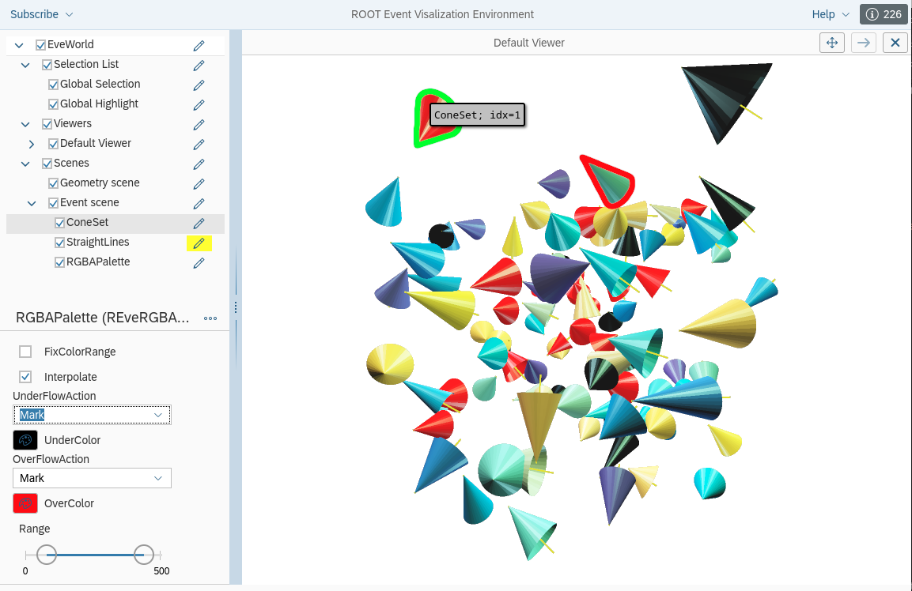

% ROOT Version 6.32 Release Notes
% 2024-05-26
<a name="TopOfPage"></a>

## Introduction

ROOT version 6.32.00 was released on 28 May 2024.
This release is a long term support one, ideal for inclusion in production or
data taking software stacks of experiments.

For more information, see:

[http://root.cern](http://root.cern)

The following people have contributed to this new version:

 Anton Alkin, Sungkyunkwan University\
 Guilherme Amadio, CERN/IT,\
 Abhigyan Acherjee, University of Cincinnati,\
 Bertrand Bellenot, CERN/EP-SFT,\
 Jakob Blomer, CERN/EP-SFT,\
 Rene Brun,\
 Carsten Burgard, DESY\
 Will Buttinger, RAL,\
 Philippe Canal, FNAL,\
 Jolly Chen, CERN/EP-SFT,\
 Olivier Couet, CERN/EP-SFT,\
 Marta Czurylo, CERN/EP-SFT,\
 Monica Dessole, CERN/EP-SFT,\
 Mattias Ellert, Uppsala University,\
 Gerri Ganis, CERN/EP-SFT,\
 Florine de Geus, CERN/University of Twente,\
 Andrei Gheata, CERN/EP-SFT,\
 Bernhard Manfred Gruber,\
 Enrico Guiraud,
 Jonas Hahnfeld, CERN/Goethe University Frankfurt,\
 Fernando Hueso Gonzalez, University of Valencia\
 Attila Krasznahorkay, CERN/EP-ADP-OS,\
 Wim Lavrijsen, LBL,\
 Dennis Klein, GSI,\
 Christoph Langenbruch, Heidelberg University/LHCb,\
 Sergey Linev, GSI,\
 Javier Lopez-Gomez,\
 Pere Mato, CERN/EP-SFT,\
 Alaettin Serhan Mete, Argonne,\
 Thomas Madlener, DESY,\
 Lorenzo Moneta, CERN/EP-SFT,\
 Alja Mrak Tadel, UCSD/CMS,\
 Axel Naumann, CERN/EP-SFT,\
 Dante Niewenhuis, VU Amsterdam\
 Luis Antonio Obis Aparicio, University of Zaragoza,
 Ianna Osborne, Princeton University,\
 Vincenzo Eduardo Padulano, CERN/EP-SFT,\
 Danilo Piparo, CERN/EP-SFT,\
 Fons Rademakers, CERN/IT,\
 Jonas Rembser, CERN/EP-SFT,\
 Andrea Rizzi, University of Pisa,\
 Andre Sailer, CERN/EP-SFT,\
 Garima Singh, ETH,\
 Juraj Smiesko, CERN/RCS-PRJ-FC,
 Pavlo Svirin, National Technical University of Ukraine,\
 Maciej Szymanski, Argonne,\
 Christian Tacke, Darmstadt University,\
 Matevz Tadel, UCSD/CMS,\
 Alvaro Tolosa Delgado, CERN/RCS-PRJ-FC,\
 Devajith Valaparambil Sreeramaswamy, CERN/EP-SFT,\
 Peter Van Gemmeren, Argonne,\
 Vassil Vassilev, Princeton/CMS,\
 Wouter Verkerke, NIKHEF/ATLAS,
 Stefan Wunsch

## Deprecation and Removal
- The RooFit legacy iterators are deprecated and will be removed in ROOT 6.34 (see section "RooFit libraries")
- Some memory-unsafe RooFit interfaces were removed
- Some redundant **RooDataSet** constructors are deprecated and will be removed in ROOT 6.34.
  Please use the RooDataSet constructors that take RooFit command arguments instead
- ROOT does not longer support Python 2. The minimum required Python version to build ROOT is 3.8.
- Support for wildcard imports like `from ROOT import *` is dropped from PyROOT
- Support for external (ie. non-builtin) libAfterImage is now deprecated and it will be removed in next release 6.34.
- The `TList::TList(TObject*)` constructor is deprecated and will be removed in ROOT 6.34
- The deprecated `TProofOutputList::TProofOutputList(TObject *o)` constructor was removed

## Core Libraries

The Cling interpreter now relies on LLVM version 16.

## I/O Libraries

### hadd respects compression settings

Fixed a bug that was previously changing the compression settings to a single digit number instead of the full value
(by default 101).

## TTree Libraries
### Add files from subdirectories with `TChain::Add` globbing
It is now possible to add files from multiple subdirectories with `TChain::Add` globbing. For example,
```
TChain::Add("/path/to/tree/*/*.root")
```
grabs all the root files with the path `/path/to/tree/somedir/file.root` (but not `/path/to/tree/file.root` and `/path/to/tree/somedir/anotherdir/file.root`).

Another example:
```
TChain::Add("/path/to/tree/subdir[0-9]/*.root")
```
This grabs all the root files in subdirectories that have a name starting with `subdir` and ending with some digit.

### Improved efficiency of TTree friends with indices

`TTreeIndex` and `TChainIndex` classes now implement the `Clone` method such that it does not use the ROOT I/O to clone the
index but just does a copy in memory. Notably, this improves processing efficiency for RDataFrame in multithreaded
execution since the same index must be copied over to all the threads and attached to the current tree for proper
event matching.

## RNTuple
ROOT's experimental successor of TTree has seen a number of updates since the last release. Specifically, 6.32 includes the following changes:

- A major refactoring of the interface, improving consistency across different parts and improving overall robustness. **Note that this is a breaking change with regard to 6.30!**
- The on-disk format has been updated to release candidate 2. **It will not be possible to read RNTuples written in the previous format anymore.**
- Support has been added for several new field types: `std::unordered_set<T>`, `std::map<K,V>`, `std::unordered_map<K,V>`
- Support has been added for on-disk half-precision (IEEE 754-2008 16-bit) float fields. This can be enabled through `RField<float>::SetHalfPrecision()`. On reading, values of such fields are represented as regular, 32-bit floats.
- A new `RNTupleInspector` utility class has been added, to provide information about the on-disk metadata of an RNTuple.
- A new `RNTupleParallelWriter` class has been added, providing (initial) support for parallel writing of RNTuples.
- A new static method `RFieldBase::Check()` has been added, which produces a support status report of a type with regards to RNTuple I/O.
- A new internal `RNTupleMerger` class has been added, enabling the merging of different page sources into one page sink. This also means that RNTuples can be merged through `hadd`.
- Zero-copy bulk reading has been added, with extra optimizations for `ROOT::RVec` fields.
- It is now possible to use the `RNTupleView` with an external address with type erasure, e.g.:
  ```cpp
  std::shared_ptr<void> data{new float()};
  auto view = reader->GetView("pt", data);
  ```
  This enables use cases such as reading one specific entry of one specific field into a previously allocated memory location.
- Further integration with [RDataFrame](#rdataframe): it is now possible to create RDataFrame for chains of RNTuples. This addition also comes with improvements to the multi-threaded work scheduling.
- Many additional bug fixes and improvements.

Please, report any issues regarding the above mentioned features should you encounter them. RNTuple is still in pre-production. The on-disk format is scheduled to be finalized by the end of 2024. Thus, we appreciate feedback and suggestions for improvement.

## Histogram Libraries

- Implement the FLT_MAX mechanism for `THStack::GetMaximum()` and `THStack::GetMiniumum()`.
- Print a warning when the range given to `TAxis::SetRange` is invalid.
- Fix projection name in `TH3` as requested [here](https://root-forum.cern.ch/t/project3d-letter-d-in-name-option/57612).

## Parallelism
  - The ROOT::Experimental::TFuture template has been removed.

## RooFit Libraries

### New CPU likelihood evaluation backend by default

The new vectorizing CPU evaluation backend is not the default for RooFit likelihoods.
Likelihood minimization is now up to 10x faster on a single CPU core.

If you experience unexpected problems related to the likelihood evaluation, you
can revert back to the old backend by passing `RooFit::EvalBackend("legacy")`
to `RooAbsPdf::fitTo()` or `RooAbsPdf::createNLL()`.

In case you observe any slowdowns with the new likelihood evaluation, please
open a GitHub issue about this, as such a performance regression is considered
a bug.

### Asymptotically correct uncertainties for extended unbinned likelihood fits

Added correct treatment of extended term in asymptotically correct method for uncertainty determination in the presence of weights.
This improvement will allow for extended unbinned maximum likelihood fits to use the asymptotically correct method when using the `RooFit::AsymptoticError()` command argument in [RooAbsPdf::fitTo()](https://root.cern.ch/doc/master/classRooAbsPdf.html#ab0721374836c343a710f5ff92a326ff5).
See also this [writeup on extended weighted fits](https://root.cern/files/extended_weighted_fits.pdf) that is also linked from the reference guide.
The [pull request](https://github.com/root-project/root/pull/14751) that introduced this feature might also be a good reference.

### Compile your code with memory safe interfaces

If you define the `ROOFIT_MEMORY_SAFE_INTERFACES` preprocessor macro, the
RooFit interface changes in a way such that memory leaks are avoided.

The most prominent effect of this change is that many functions that used to
return an owning pointer (e.g., a pointer to an object that you need to
manually `delete`) are then returning a `std::unique_pt` for automatic memory
management.

For example this code would not compile anymore, because there is the risk that
the caller forgets to `delete params`:
```c++
RooArgSet * params = pdf.getParameters(nullptr);
```
If you wrap such return values in a `std::unique_ptr`, then your code will
compile both with and without memory safe interfaces:
```c++
std::unique_ptr<RooArgSet> params{pdf.getParameters(nullptr)};
```

Also some `virtual` RooFit functions like [RooAbsReal::createIntegral()](https://root.cern.ch/doc/master/classRooAbsReal.html#aff4be07dd6a131721daeeccf6359aea9)
are returning a different type conditional on `ROOFIT_MEMORY_SAFE_INTERFACES`.
If you are overriding such a function, you need to use the `RooFit::OwningPtr`
return type, which is an alias for `std::unique_ptr` in memory-safe mode or an
alias for a raw pointer otherwise.
```c++
RooFit::OwningPtr<RooAbsReal> RooAbsReal::createIntegral(...) const override
{
   std::unique_ptr<RooAbsReal> integral;
   // Prepare a std::unique_ptr as the return value
   ...
   // Use the RooFit::makeOwningPtr<T>() helper to translate the
   // std::unique_ptr to the actual return type (either std::unique_ptr<T> or T*).
   return RooFit::makeOwningPtr<RooAbsReal>(std::move(integral));
}
```

The biggest application of the memory-safe interfaces is to spot memory leaks
in RooFit-based frameworks. If you make sure that your framework compiles both
with and without `ROOFIT_MEMORY_SAFE_INTERFACES`, you can get rid of all memory
leaks related to RooFit user error! After making the necessary changes, you can
remove the marco definition again to keep backwards compatibility.

Note that the memory-safe interfaces might become the default at some point, so
doing this **backwards-compatible migration early** is strongly encouraged and
appreciated.

### Removal of some memory-unsafe interfaces

* The final `bool takeOwnership` parameter of the **RooAddition** and
  **RooStats::HistFactory::PiecewiseInterpolation** constructors was removed.
  This is to avoid situations where ownership is not clear to the compiler.
  Now, ownership of the input RooAbsArgs is never passed in the constructor. If
  you want the pass input ownership to the created object, please use
  `addOwnedComponents`. If you want to be extra safe, make sure the inputs are
  in an owning collection and then `std::move` the collection, so that the
  ownership is always clear.

  Example:
  ```c++
  RooArgList sumSet;
  sumSet.add(*(new RooRealVar("var1", "var1", 1.0)));
  sumSet.add(*(new RooRealVar("var2", "var2", 3.0)));
  RooAddition addition{"addition", "addition", sumSet, /*takeOwnership=*/true};
  ```
  should become:
  ```c++
  RooArgList sumSet;
  sumSet.addOwned(std::make_unique<RooRealVar>("var1", "var1", 1.0));
  sumSet.addOwned(std::make_unique<RooRealVar>("var2", "var2", 3.0));
  RooAddition addition{"addition", "addition", sumSet};
  addition.addOwnedComponents(std::move(sumSet));
  ```

### Deprecation of legacy iterators

The following methods related to the RooFit legacy iterators are deprecated and will be removed in ROOT 6.34.
They should be replaced with the suitable STL-compatible interfaces, or you can just use range-based loops:

- `RooAbsArg::clientIterator()`: use `clients()` and `begin()`, `end()` or range-based loops instead
- `RooAbsArg::valueClientIterator()`: use `valueClients()`
- `RooAbsArg::shapeClientIterator()`: use `shapeClients()`
- `RooAbsArg::serverIterator()`: use `servers()`
- `RooAbsArg::valueClientMIterator()`: use `valueClients()`
- `RooAbsArg::shapeClientMIterator()`: use `shapeClients()`
- `RooAbsArg::serverMIterator()`: use `servers()`

- `RooAbsCollection::createIterator()`: use `begin()`, `end()` and range-based for loops
- `RooAbsCollection::iterator()`: same
- `RooAbsCollection::fwdIterator()`: same

- `RooWorkspace::componentIterator()`: use `RooWorkspace::components()` with range-based loop

### Deprecation of legacy test statistics classes in public interface

Instantiating the following classes and even including their header files is deprecated, and the headers will be removed in ROOT 6.34:

* RooAbsTestStatistic
* RooAbsOptTestStatistic
* RooNLLVar
* RooChi2Var
* RooXYChi2Var

Please use the higher-level functions `RooAbsPdf::createNLL()` and `RooAbsPdf::createChi2()` if you want to create objects that represent test statistics.

### Change of RooParamHistFunc

The `RooParamHistFunc` didn't take any observable `RooRealVar` as constructor
argument. It assumes as observable the internal variables in the passed
RooDataHist. This means it was in most contexts unusable, because the input
can't be changed, other than loading a different bin in the dataset.

Furthermore, there was actually a constructor that took a `RooAbsArg x`, but it
was simply ignored.

To fix all these problems, the existing constructors were replaced by a new one
that takes the observable explicitly.

Since the old constructors resulted in wrong computation graphs that caused
trouble with the new CPU evaluation backend, they had to be removed without
deprecation. Please adapt your code if necessary.

### Renaming of some RooFit classes

The `RooPower` was renamed to `RooPowerSum`, and `RooExpPoly` was renamed to `RooLegacyExpPoly`.

This was a necessary change, because the names of these classes introduced in ROOT 6.28 collided with some classes in CMS combine, which were around already long before. Therefore, the classes had to be renamed to not cause any problems for CMS.

In the unlikeliy case where you should have used these new classes for analysis already, please adapt your code to the new names and re-create your workspaces.

## RDataFrame

* The `RDataFrame` constructors that take in input one or more file names (or globs thereof) will now infer the format of the dataset, either `TTree` or `RNTuple`, that is stored in the first input file. When multiple files are specified, it is assumed that all other files contain a coherent dataset of the same format and with the same schema, exactly as it used to happen with `TChain`. This automatic inference further contributes towards a zero-code-change experience when moving from processing a `TTree` to processing an `RNTuple` dataset while using an `RDataFrame`. It also introduces a backwards-incompatible behaviour, i.e. now the constructor needs to open one file in order to infer the dataset type. This means that if the file does not exist, the constructor will throw an exception. Previously, an exception would be thrown only at a JIT-ting time, before the start of the computations.
* Distributed `RDataFrame` now supports processing an `RNTuple` dataset.
* In distributed `RDataFrame`, the `initialize` function useful to run initialization code at the beginning of every task
on a worker will now run only in the worker processes. Previously, it was also run eagerly at the point of calling, that
is in the main user process. This is done to better separate the user driver environment and the worker environments. If
necessary, the function passed to `initialize` can be called directly by the user in the main application to reproduce
the same effect as before.
* Some internal details of the `RDataFrame` implementation were reworked to decrease memory usage and runtime of programs
with very deep computation graphs (more than O(10K) nodes in the same branch). Preliminary tests indicate between 30%
and a factor 2.5 in memory decrease. This improvement is transparent for `RDataFrame` users.

## Graphics backends
The ROOT release 6.32 brings a lot of impressive enhancements to the Web Graphics package, greatly surpassing the features and capabilities of version 6.30. 
This update provides users with a more robust Web Graphics.

* The JSROOT version has been updated to v7.7

## 2D Graphics Libraries

- TMultiGraph: Add the objects from the list of functions in legend produce by TLegend.
- Implement the IsInside method for TEllipse, TCrown and TDiamond. Also, a new graphics example `inside.C` has been added.
- Two new methods in TColor: `ListColors()` and `GetColorByname()`.
- Make sure the option `L` draws closed polygon for `TH2Poly`.
- Use Tex Gyre fonts for sans serif (similar to Helvetica) .
- The new method `TPad::ModifiedUpdate` is short cut to call `Modified()` and `Update()` in a single call. On Mac with Cocoa, it performs an additional ProcessEvents().
- Improve `SetTextSize` error: show code and values.
- Very long text string generated a wrong SVG file.
- Fix the option `SAME` works for `TGraph2D`.
- Implement the title for the palette of a `TH3`.
- Fix typo in `TLegend::PaintPrimitives()` and improve the exclusion graphs legend.
- `SetParameters(…)` or `SetParameter(…)` on a TF1 reset the properties of the axis that have been previously defined.
  This was due to the `Update()` that was done after the parameters definition.
- Update fonts' documentation (CMS request).
- Delaunay triangles were computed by the package `triangle.c` included in the ROOT code.
  This package had several problems:
      - It was not maintained anymore.
      - Its license was not compatible with LGPL.
  It is now replaced  by the CDT package which is properly maintained and has a license (MLP) compatible with LGPL

## 3D Graphics Libraries

### REve
* Introduce lightweight visualization of instanced shapes on the level of 100.000 instances. This is integrated in digit visualization of the type REveBoxSet. List of typed instances are boxes, hexagons, and cones. The digit sets support different types of transformation: positioning, rotation, and scaling in different combinations. With the digit set a palette GUI interface has also been added to enable setting digits threshold and value to color mapping.

<figure>
 
 <figcaption>REveBoxSet screenshot with cone shape type. The set is using value to color map with overflow and underflow mark. The single REveBoxet object has a secondary selection enabled, where one can set a custom tooltip on mouse hover of an individual instance.</figcaption>
</figure>

* Update version of RenderCore to fix tone mapping of transparent objects.

## PROOF Libraries

By default, PROOF is not configured and built any more. It will be deprecated in the future given that its functionality is now provided by the superior RDataFrame and its distributed version, [DistRDF](https://root.cern/doc/master/classROOT_1_1RDataFrame.html#distrdf).

## PyROOT

PyROOT was rebased on the latest version of the [cppyy library](https://cppyy.readthedocs.io/en/latest/).
This means PyROOT benefits from many upstream improvements and fixes, for example related to the conversion of NumPy arrays to vectors, implicit conversion from nested Python tuples to nested initializer lists, and improved overload resolution.

Related to this cppyy upgrade, there are some changes in PyROOT behavior.

### Different representation of `std::string`

Calling `repr()` on a `cppyy.gbl.std.string` object now comes with a "b" prefix, i.e. a bytes object is returned instead of a Python string.
This is an intentional change for better unicode support.

See: https://github.com/root-project/root/issues/15153#issuecomment-2040504962

### No more implicit conversion of static size `char` buffer to Python strings

A static size character buffer of type `char[n]` is not converted to a Python string anymore. 
The reason for this: since it was previously assumed the string was
null-terminated, there was no way to get the bytes after a `null`, even if you
wanted to.

```python
import ROOT

ROOT.gInterpreter.Declare("""
struct Struct { char char_buffer[5] {}; }; // struct with char[n]
void fill_char_buffer(Struct & st) {
    std::string foo{"foo"};
    std::memcpy(st.char_buffer, foo.data(), foo.size());
}
""")

struct = ROOT.Struct()
ROOT.fill_char_buffer(struct)
char_buffer = struct.char_buffer

# With thew new cppyy, you get access to the lower level buffer instead of a
# Python string:
print("struct.char_buffer            : ", char_buffer)

# However, you can turn the buffer into a string very easily with as_string():
print("struct.char_buffer.as_string(): ", char_buffer.as_string())
```
The output of this script with ROOT 6.32:
```
struct.char_buffer            :  <cppyy.LowLevelView object at 0x74c7a2682fb0>
struct.char_buffer.as_string():  foo
```

### Deprecate the attribute pythonization of `TDirectory` in favor of item-getting syntax

The new recommended way to get objects from a `TFile` or any `TDirectory` in general is now via `__getitem__`:

```python
tree = my_file["my_tree"] # instead of my_file.my_tree
```

This is more consistent with other Python collections (like dictionaries), makes sure that member functions can't be confused with branch names, and easily allows you to use string variables as keys.

With the new dictionary-like syntax, you can also get objects with names that don't qualify as a Python variable. Here is a short demo:
```python
import ROOT

with ROOT.TFile.Open("my_file.root", "RECREATE") as my_file:

    # Populate the TFile with simple objects.
    my_file.WriteObject(ROOT.std.string("hello world"), "my_string")
    my_file.WriteObject(ROOT.vector["int"]([1, 2, 3]), "my vector")

    print(my_file["my_string"])  # new syntax
    print(my_file.my_string)  # old deprecated syntax

    # With the dictionary syntax, you can also use names that don't qualify as
    # a Python variable:
    print(my_file["my vector"])
    # print(my_file.my vector) # the old syntax would not work here!
```

The old pythonization with the `__getattr__` syntax still works, but emits a deprecation warning and will be removed from ROOT 6.34.

### Removal of Python 2 support

ROOT does no longer support Python 2. The minimum Python version necessary to use ROOT in a Python application is 3.8.
As a consequence, any reference to Python 2 in ROOT code was removed and certain configuration options are no longer
usable, e.g.

* `root-config --python2-version`
* cmake -Dpyroot-python2

The cmake build system now looks for the standard `Python3` package and previously custom Python-related cmake variables
are now just the ones automatically produced by cmake (see https://cmake.org/cmake/help/latest/module/FindPython.html).

### More usage of the public cppyy API

Many implementation details of the ROOT pythonizations were moved from C++ functions to pure Python bindings using the
public cppyy API. This helps in the integration with the tool but also improves code efficiency and memory usage.

## Class Reference Guide

- Define missing doxygen groups.
- Fix a few typos in the `THStack` documentation.
- Small fixes in the `THistPainter` documentation.
- Improve the `TColor` documentation: use modern C++ in the examples.
- Make sure the python examples do not generate wrong namespaces in the documentation.
- The dataframe tutorials json spec files were not displayed properly. Moreover there was
  no direct correspondence between the code source and the json file. Those files do not
  have any doc in them. With a direct link to the GitHub source file the dependency between source
  code and json is now more obvious.
- Document how to remove shadow of `TPave`, as it was not evident (only explanations were hidden here and there in the forum).
- Improve the `SetFillColorAlpha` documentation.
- Simplify some graphics examples: arrow.C, crown.C, diamond.C and ellipse.C.
- Fix a typo in the documentation of `TGraph::SetHighlight` in `TGraph.cxx`.
- Change the marker style in the tutorial `df014_CSVDataSource`.
- Remove useless settings in the tutorial `scatter.C`.
- Fix the tutorial `h1analysisTreeReader.C`.
- Fix doxygen formatting in `TGNumberEntry.cxx`.
- Avoid the CDT documentation to appear in the reference guide.
- Remove last references to the old ROOT `drupal` website.

## Build, Configuration and Testing Infrastructure

Release v6.32.00 is the first one integrated and tested entirely through the new GitHub based build system.

## Bugs and Issues fixed in this release

More than 200 items were addressed for this release. The full list is:

* [[#15621](https://github.com/root-project/root/issues/15621)] - Buffer overflow in TBranch::Init
* [[#15610](https://github.com/root-project/root/issues/15610)] - Memory leak in TTree __getattr__ pythonization
* [[#15590](https://github.com/root-project/root/issues/15590)] - Infinite recursion in TFile::Open
* [[#15460](https://github.com/root-project/root/issues/15460)] - TEnum::GetEnum("B")->GetUnderlyingType() does not following typedefs
* [[#15413](https://github.com/root-project/root/issues/15413)] - Fails to build with cuDNN version 9
* [[#15406](https://github.com/root-project/root/issues/15406)] - `TEnum::GetEnum` does not seem to see 'through' using statements.
* [[#15399](https://github.com/root-project/root/issues/15399)] - Memory leak with jitted nodes if the execution is never triggered
* [[#15396](https://github.com/root-project/root/issues/15396)] - [TMVA] Pymva test (Keras) failing on 632 and main
* [[#15370](https://github.com/root-project/root/issues/15370)] - Broken link in HS3 printout
* [[#15340](https://github.com/root-project/root/issues/15340)] - Webgraphics: canvas displayed, but many error printed
* [[#15253](https://github.com/root-project/root/issues/15253)] - C++ standard not propagated via CMake anymore
* [[#15197](https://github.com/root-project/root/issues/15197)] - RBDT does not support xgboost inference
* [[#15156](https://github.com/root-project/root/issues/15156)] - Segfault in TMVA::Experimental::SOFIE::RModel::Streamer
* [[#15139](https://github.com/root-project/root/issues/15139)] - cmake option -Dall=YES breaks the cmake
* [[#15118](https://github.com/root-project/root/issues/15118)] - jsoninterface does not build if provided with RapidYAML
* [[#15108](https://github.com/root-project/root/issues/15108)] - Turn off clang-format for Linkdef files
* [[#15090](https://github.com/root-project/root/issues/15090)] - TClass::GetClassInfo() is not thread safe
* [[#15077](https://github.com/root-project/root/issues/15077)] - Passing different floating point types to `RVec` utility functions
* [[#15048](https://github.com/root-project/root/issues/15048)] - [ntuple] Handling of virtual inheritance broken
* [[#15040](https://github.com/root-project/root/issues/15040)] - [RDataFrame] Inaccurate example of progress bar from documentation
* [[#15028](https://github.com/root-project/root/issues/15028)] - [RDataFrame] Unable to cacheread remote file
* [[#15027](https://github.com/root-project/root/issues/15027)] - spurrious cmake message about AfterImage with -Dminimal=ON
* [[#14981](https://github.com/root-project/root/issues/14981)] - RVecs leak memory with np.asarray in pyROOT
* [[#14964](https://github.com/root-project/root/issues/14964)] - ROOT-HEAD fails with "cling interactive line includer >>>: fatal error: module file '[snip]/Vc.pcm' not found: module file not found"
* [[#14958](https://github.com/root-project/root/issues/14958)] - ROOT_HEAD failed with error message: Fail to detect cryptographic random generator
* [[#14921](https://github.com/root-project/root/issues/14921)] - ROOT Fails to build macOS 14.4 arm64 Xcode 15.3
* [[#14914](https://github.com/root-project/root/issues/14914)] - VecOps::Take with default argument doesn't check correctly the out of boundary condition
* [[#14910](https://github.com/root-project/root/issues/14910)] - hadd issue when using parallelization together with indirect file
* [[#14902](https://github.com/root-project/root/issues/14902)] - compilation error
* [[#14863](https://github.com/root-project/root/issues/14863)] - [hist] TH1::SaveAs missing default option argument causes compilation errors
* [[#14855](https://github.com/root-project/root/issues/14855)] - TRatioPlot crashes if loaded from the file
* [[#14842](https://github.com/root-project/root/issues/14842)] - TRatioplot gives "different" results with Web Graphics
* [[#14838](https://github.com/root-project/root/issues/14838)] - Problems with Confidence Band of TRatioPlot
* [[#14801](https://github.com/root-project/root/issues/14801)] - TEfficiency drawing to .C is broken
* [[#14793](https://github.com/root-project/root/issues/14793)] - 6.26 cannot read file written with 6.30.4
* [[#14772](https://github.com/root-project/root/issues/14772)] - [cling] Undocumented behaviour of root macro_C.so
* [[#14767](https://github.com/root-project/root/issues/14767)] - rootn.exe instant crash on startup
* [[#14765](https://github.com/root-project/root/issues/14765)] - TGenPhaseSpace weight normalization
* [[#14748](https://github.com/root-project/root/issues/14748)] - [ntuple] `Show` and `PrintInfo` does not work for friend RNTuples
* [[#14601](https://github.com/root-project/root/issues/14601)] - std::source_location not found when running with c++20 enabled
* [[#14599](https://github.com/root-project/root/issues/14599)] - The example th2polyUSA.C needs re-labelling
* [[#14598](https://github.com/root-project/root/issues/14598)] - A "printf" change the behaviour of a macro ... 
* [[#14595](https://github.com/root-project/root/issues/14595)] - Problem when creating dictionary in Osx 12.7, Xcode 14.2
* [[#14594](https://github.com/root-project/root/issues/14594)] - Provide `file.root` request in THttpServer
* [[#14593](https://github.com/root-project/root/issues/14593)] - Build fails with CLING_DEBUG=1 set
* [[#14586](https://github.com/root-project/root/issues/14586)] - [ROOT-6317] using namespace statement does not provoke autoload
* [[#14576](https://github.com/root-project/root/issues/14576)] - [ROOT-7155] Angular units used in HTML doc of TGLViewer::SetPerspectiveCamera are wrong
* [[#14575](https://github.com/root-project/root/issues/14575)] - [ROOT-10196] boundary check in TH1::AddBinContent is missing
* [[#14569](https://github.com/root-project/root/issues/14569)] - [ROOT-8348] Segmentation Fault in TMVA::DecisionTreeNode::Print
* [[#14562](https://github.com/root-project/root/issues/14562)] - [ROOT-5009] TClass::SetDeclFile: second parameter wrong type
* [[#14553](https://github.com/root-project/root/issues/14553)] - [ROOT-10909] Add TMVA python dependencies to the requirements.txt
* [[#14547](https://github.com/root-project/root/issues/14547)] - [ROOT-9200] With Cocoa backend sometimes need two ProcessEvents to show Canvas
* [[#14528](https://github.com/root-project/root/issues/14528)] - Bug in TFoam::GetIntNorm
* [[#14510](https://github.com/root-project/root/issues/14510)] - Large computation graphs cause serious memory and runtime overhead
* [[#14509](https://github.com/root-project/root/issues/14509)] - ROOT segfaults on riscv64
* [[#14508](https://github.com/root-project/root/issues/14508)] - Using LZMA compression with RNTupleWriter leads to memory corruption
* [[#14499](https://github.com/root-project/root/issues/14499)] - It is not possible to set the Title of the palette for a 3D axis
* [[#14462](https://github.com/root-project/root/issues/14462)] - Parser for I/O customization rule is too strict.
* [[#14458](https://github.com/root-project/root/issues/14458)] - Crash when doing Weighted Likelihood fit
* [[#14453](https://github.com/root-project/root/issues/14453)] - Implement IsInside for TEllipse
* [[#14401](https://github.com/root-project/root/issues/14401)] - The red frame around the selected pad of the webgui is not configurable
* [[#14385](https://github.com/root-project/root/issues/14385)] - Strange behavior with TF1 and SetParameters
* [[#14381](https://github.com/root-project/root/issues/14381)] - Legend entry for exclusion graph
* [[#14376](https://github.com/root-project/root/issues/14376)] - build failure with `mysql 8.3`
* [[#14372](https://github.com/root-project/root/issues/14372)] - File with mtime equal to 0 are ignored by Cling.
* [[#14333](https://github.com/root-project/root/issues/14333)] - "Empty plot" for df014_CSVDataSource.C 
* [[#14331](https://github.com/root-project/root/issues/14331)] - Unexpected behaviour when using the Project3D function to make a TH2 from a TH3
* [[#14329](https://github.com/root-project/root/issues/14329)] - [RF] RDataFrameToRooFit - Clarification on returned object
* [[#14324](https://github.com/root-project/root/issues/14324)] - Compatibility Issue with thisroot.sh and zsh 
* [[#14320](https://github.com/root-project/root/issues/14320)] - [RF] Wrong analytic integrals when using Gaussians with sigma depending on the observable
* [[#14303](https://github.com/root-project/root/issues/14303)] - Test failure with `nbconvert-7.14`
* [[#14302](https://github.com/root-project/root/issues/14302)] - The command "root --notebook" is not allowed on Windows 11
* [[#14277](https://github.com/root-project/root/issues/14277)] - Cling triggers a huge number of `openat` calls when loading libraries
* [[#14263](https://github.com/root-project/root/issues/14263)] - [tmva] When using DNN_USE_CBLAS, CMakeLists should link publicly to gsl instead of privately
* [[#14256](https://github.com/root-project/root/issues/14256)] - TAxis::GetTicks and TAxis::SetTicks are inconsistent. Significantly so.
* [[#14244](https://github.com/root-project/root/issues/14244)] - String comparison operators defined in TString.h should be defined as constexpr
* [[#14229](https://github.com/root-project/root/issues/14229)] - [6.30] root-config --git-revision broken
* [[#14225](https://github.com/root-project/root/issues/14225)] - [RF] Segmentation fault in ROOT 6.30 workspace creation
* [[#14223](https://github.com/root-project/root/issues/14223)] - Extremely long startup time when loading dictionaries with pyroot
* [[#14219](https://github.com/root-project/root/issues/14219)] - [cling] Use deduction guides for llvm::ArrayRef
* [[#14211](https://github.com/root-project/root/issues/14211)] - Implement value printing for `std::source_location`
* [[#14205](https://github.com/root-project/root/issues/14205)] - [cling] Replace llvm::Optional and llvm::None with std::optional
* [[#14199](https://github.com/root-project/root/issues/14199)] - Memory hoarding triggered by the TPluginManager
* [[#14188](https://github.com/root-project/root/issues/14188)] - cmake find_package ROOT 6.30 broken: it requires nlohmann-json
* [[#14163](https://github.com/root-project/root/issues/14163)] - cmake find_package ROOT broken with 6.30, nlohmann and vdt are builtin but not found
* [[#14162](https://github.com/root-project/root/issues/14162)] - `RooFFTConvPdf` is not working for ROOT 6.30/02
* [[#14157](https://github.com/root-project/root/issues/14157)] - Minuit2 standalone build: StandAlone.cmake looks for the wrong path for VERSION_FILE
* [[#14113](https://github.com/root-project/root/issues/14113)] - The `find_package(root)` command fails when using Root installed via Homebrew.
* [[#14101](https://github.com/root-project/root/issues/14101)] - Missing documentation for `RDataSetSpec`
* [[#14097](https://github.com/root-project/root/issues/14097)] - Cleaner stack traces in python
* [[#14085](https://github.com/root-project/root/issues/14085)] - thisroot.sh does not recognize bash when running in qemu-x86_64
* [[#14084](https://github.com/root-project/root/issues/14084)] - [ntuple] `RRecordField` creation crashes when `TStreamerInfo` has insufficient information
* [[#14075](https://github.com/root-project/root/issues/14075)] - [FreeBSD] root.exe crash at end of compilation during modules.idx generation
* [[#14068](https://github.com/root-project/root/issues/14068)] - ROOT 6.30/00 reports `root-config --version` as 6.30.00
* [[#14064](https://github.com/root-project/root/issues/14064)] - Include Tex Gyre Heros in ROOT fonts
* [[#14032](https://github.com/root-project/root/issues/14032)] - `TPaveText` has problems when label is set
* [[#14030](https://github.com/root-project/root/issues/14030)] - Allow zero-copy RNTuple bulk reading
* [[#13965](https://github.com/root-project/root/issues/13965)] - [Cling] Assertion fails with wrong but innocent code
* [[#13962](https://github.com/root-project/root/issues/13962)] - `THnSparse::Scale()` unsparsifies
* [[#13877](https://github.com/root-project/root/issues/13877)] - [ntuple] Segfault when processing recursive classes
* [[#13865](https://github.com/root-project/root/issues/13865)] - [FreeBSD] cling cmake error
* [[#13861](https://github.com/root-project/root/issues/13861)] - Remove all traces of Python2 from the ROOT codebase in preparation for 6.32/00
* [[#13851](https://github.com/root-project/root/issues/13851)] - Test crash with GCC 13 and C++20
* [[#13834](https://github.com/root-project/root/issues/13834)] - Can't open TBrowser locally after upgrading macos “Apple M2 14.0 (23A344)”
* [[#13825](https://github.com/root-project/root/issues/13825)] - builtin libpng too old
* [[#13815](https://github.com/root-project/root/issues/13815)] - Cling (rightfully) confused about forward-declared template specializations
* [[#13697](https://github.com/root-project/root/issues/13697)] - Unexpected behaviour of KSTest with toys ("X" option) for identical histograms
* [[#13659](https://github.com/root-project/root/issues/13659)] - rootprint/rootls missing recursive traversal
* [[#13623](https://github.com/root-project/root/issues/13623)] - Add directory wildcarding in TChain
* [[#13531](https://github.com/root-project/root/issues/13531)] - Huge RAM consumption of the hadd command for input files with several directories 
* [[#13511](https://github.com/root-project/root/issues/13511)] - TMapFile can't work 
* [[#13497](https://github.com/root-project/root/issues/13497)] - Assertion failure in TMVA with `vector iterators incompatible` error on Windows
* [[#13441](https://github.com/root-project/root/issues/13441)] - error in root-generated code for cubic spline (TSpline3)
* [[#13421](https://github.com/root-project/root/issues/13421)] - [MSVC] ROOT builds under msvc option /permissive- with error C4576
* [[#13359](https://github.com/root-project/root/issues/13359)] - Bug in TFileMerger class for a single input file and a selective list of objects to be merged in output file
* [[#13288](https://github.com/root-project/root/issues/13288)] - [cling] long double type incorrectly parsed by interpreter
* [[#13155](https://github.com/root-project/root/issues/13155)] - TMVA doesn't compile with pytorch 2.0.1
* [[#13130](https://github.com/root-project/root/issues/13130)] - Valgrind reports leak when constructing TChain
* [[#13110](https://github.com/root-project/root/issues/13110)] - Bug in TDecompBase::DiagProd
* [[#13079](https://github.com/root-project/root/issues/13079)] - Builtin TBB library sometimes not found (or more exactly the one install in /usr/lib sometimes take priority)
* [[#13041](https://github.com/root-project/root/issues/13041)] - TVirtualFitter::GetFitter() unexpectedly returns NULL on macOS 12 and 13 with Xcode 14
* [[#13019](https://github.com/root-project/root/issues/13019)] - LLVM assertion failure in HandleUnionActiveMemberChange
* [[#12993](https://github.com/root-project/root/issues/12993)] - std::source_location not working in the interpreter
* [[#12959](https://github.com/root-project/root/issues/12959)] - [ntuple] Distinguish between connecting a page sink and a page source in `RColumn`
* [[#12783](https://github.com/root-project/root/issues/12783)] - [IO] Writing HistFactory model file twice gives strange results since ROOT 6.26.02
* [[#12770](https://github.com/root-project/root/issues/12770)] - tmva/sofie_parsers does not build with latest Protobuf (22.x)
* [[#12744](https://github.com/root-project/root/issues/12744)] - wrong Python version found during build
* [[#12718](https://github.com/root-project/root/issues/12718)] - A crash when trying to initialise a vector from a >1D numpy array in PyROOT
* [[#12685](https://github.com/root-project/root/issues/12685)] - `TEnum::GetEnum` does NOT process typedefs
* [[#12644](https://github.com/root-project/root/issues/12644)] - Can't find cxxabi.h and build module 'ROOT_Foundation_Stage1_NoRTTI' when building from source on Macos
* [[#12631](https://github.com/root-project/root/issues/12631)] - Unable to build master with external XROOTD
* [[#12621](https://github.com/root-project/root/issues/12621)] - [I/O][RDF] Usage of xrootd from multi-thread event loops runs into severe bottlenecks
* [[#12592](https://github.com/root-project/root/issues/12592)] - [doc] TProfile bin error documentation is not correct
* [[#12591](https://github.com/root-project/root/issues/12591)] - Allow partial enablement of modules
* [[#12527](https://github.com/root-project/root/issues/12527)] - MacOS build fails if configured without cocoa
* [[#12492](https://github.com/root-project/root/issues/12492)] - The problem with building ROOT v6-26-10 in debug mode on ubuntu 20.04
* [[#12230](https://github.com/root-project/root/issues/12230)] - Wrong conversion from Numpy Array to `std.vector` when using the wrong type
* [[#12091](https://github.com/root-project/root/issues/12091)] - TSpline SaveAs not using equidistant and loss of precision
* [[#11924](https://github.com/root-project/root/issues/11924)] - PyROOT: wrong overload resolution for C++ functions from python 
* [[#11901](https://github.com/root-project/root/issues/11901)] - Binary distribution for Ubutu 22.04 is broken (on WSL2)
* [[#11750](https://github.com/root-project/root/issues/11750)] - FindXROOTD adds libraries to link against irrespective of xrootd version used
* [[#11746](https://github.com/root-project/root/issues/11746)] - TH2::Fill(const char *namex, const char *namey, Double_t w) doesn't update fTsumwxy
* [[#11743](https://github.com/root-project/root/issues/11743)] - CMake >= 3.24 fails to build LZMA: WARNING: 'aclocal-1.15' is missing on your system.
* [[#11673](https://github.com/root-project/root/issues/11673)] - [ntuple] Consider making `REntry::AddValue()` publicly accessible
* [[#11667](https://github.com/root-project/root/issues/11667)] - [cling] GetClassSharedLibs fails to find several classes
* [[#11653](https://github.com/root-project/root/issues/11653)] - TFile plugins :: pass meta4 extension files to TNetXNGFile and process it
* [[#11596](https://github.com/root-project/root/issues/11596)] - cppyy does not retrieve correct size of type when pythonizing vector
* [[#11484](https://github.com/root-project/root/issues/11484)] - roottest/root/meta/genreflex/ROOT-5768 needs to be enabled
* [[#11411](https://github.com/root-project/root/issues/11411)] - [PyROOT] Python list of strings -> std::initializer_list< std::string > conversion is broken
* [[#11395](https://github.com/root-project/root/issues/11395)] - Migrate to pcre2
* [[#11353](https://github.com/root-project/root/issues/11353)] - Compiled program with libNew.so crash
* [[#11304](https://github.com/root-project/root/issues/11304)] - WW option for fit functions as the W option
* [[#11238](https://github.com/root-project/root/issues/11238)] - an old bug in ROOT v6 TAB completion ?
* [[#11197](https://github.com/root-project/root/issues/11197)] - Build github release into version release procedure
* [[#11190](https://github.com/root-project/root/issues/11190)] - ROOT compiled with `-Ddev=ON` crashes when type `#` in ROOT session
* [[#11021](https://github.com/root-project/root/issues/11021)] - [Fit Panel] Fitting to Gaus + Pol0 in two steps is unnecessarily hard
* [[#10891](https://github.com/root-project/root/issues/10891)] - [RF] Deletion order of objects in RooFit/RooStats tutorials should not matter in Python
* [[#10871](https://github.com/root-project/root/issues/10871)] - [DF][ntuple] Better task splitting with RDF+RNTuple
* [[#10866](https://github.com/root-project/root/issues/10866)] - ACLiC flags parsing for compiler command line options broken in certain cases
* [[#10684](https://github.com/root-project/root/issues/10684)] - [PyROOT] Cannot use SofieFunctor in Python
* [[#10664](https://github.com/root-project/root/issues/10664)] - [ntuple] Expose fixed-size arrays as RVecs in RDF datasource
* [[#10395](https://github.com/root-project/root/issues/10395)] - [core] CleanCompiledMacros behavior
* [[#10222](https://github.com/root-project/root/issues/10222)] - Suspicious behavior of TUnuran::SampleMulti 
* [[#10221](https://github.com/root-project/root/issues/10221)] - ROOT interpreter built with C++17 does not find `std::optional` without including it first
* [[#10146](https://github.com/root-project/root/issues/10146)] - Byte swapped floats in TMVA sofie on big endian architectures (s390x)
* [[#10061](https://github.com/root-project/root/issues/10061)] - Distributed RDataFrame test failures on Mac/ARM
* [[#9917](https://github.com/root-project/root/issues/9917)] - SetRange and SetRangeUser fail silently
* [[#9594](https://github.com/root-project/root/issues/9594)] - Systematic build failure of ROOT master in the LCG DEBUG builds since Jan 15th
* [[#9524](https://github.com/root-project/root/issues/9524)] - Failure to build/run when MACOSX_DEPLOYMENT_TARGET is set to 11 or higher
* [[#9514](https://github.com/root-project/root/issues/9514)] - Printed SVG image contains newline cutting through XML tags
* [[#9489](https://github.com/root-project/root/issues/9489)] - [RF] Cannot turn off useless messages with RooMCStudy unbinned fits + Progress bar would be better.
* [[#9292](https://github.com/root-project/root/issues/9292)] - Integer overflow in TTreeCache::FillBuffer
* [[#8959](https://github.com/root-project/root/issues/8959)] - `ninja clean` does not remove `modules.idx`
* [[#8952](https://github.com/root-project/root/issues/8952)] - Make hadd return a non-zero exit code when encountering a corrupted file
* [[#8942](https://github.com/root-project/root/issues/8942)] - cannot buid the dependent project
* [[#8794](https://github.com/root-project/root/issues/8794)] - [TGNumberEntry] centiseconds
* [[#8720](https://github.com/root-project/root/issues/8720)] - Apply TChain::SetImplicitMT() to underlying trees
* [[#8639](https://github.com/root-project/root/issues/8639)] - (RDataFrame) AsNumpy returns Boolean branches as 'object' dtype numpy arrays
* [[#8582](https://github.com/root-project/root/issues/8582)] - TThreadTimer behavior
* [[#8581](https://github.com/root-project/root/issues/8581)] - [ntuple] RNTupleModel columns ownership issue
* [[#8517](https://github.com/root-project/root/issues/8517)] - Add integer support to TVectorT
* [[#8494](https://github.com/root-project/root/issues/8494)] - cling crashes on conditional parameter in template
* [[#8260](https://github.com/root-project/root/issues/8260)] - Build system cannot detect version of oneTBB
* [[#8148](https://github.com/root-project/root/issues/8148)] - Document TMethodCall class limitations
* [[#7950](https://github.com/root-project/root/issues/7950)] - Assertion exception including header file with GaudiPython module
* [[#7900](https://github.com/root-project/root/issues/7900)] - Support spectator variables in RReader
* [[#7872](https://github.com/root-project/root/issues/7872)] - TExecutorCRTP::Map() should support void
* [[#7871](https://github.com/root-project/root/issues/7871)] - Usability of TExecutor::MapReduce
* [[#7845](https://github.com/root-project/root/issues/7845)] - Improve TMatrix reference documentation
* [[#7805](https://github.com/root-project/root/issues/7805)] - Inconsistent and unintuitive behaviour of TFormula::SetParNames and TFormula::SetParameters
* [[#7774](https://github.com/root-project/root/issues/7774)] - Unreasonably slow behaviour of CompileMacro
* [[#7699](https://github.com/root-project/root/issues/7699)] - [VecOps] Make free functions in VecOps better visible
* [[#7686](https://github.com/root-project/root/issues/7686)] - [PyROOT] Segfault when creating proxy to derived class with multiple overloads
* [[#7669](https://github.com/root-project/root/issues/7669)] - Inconsistent behaviour in wildcard import
* [[#7644](https://github.com/root-project/root/issues/7644)] - Provide in the cmake configuration the C++ standard which was used to compile ROOT
* [[#7627](https://github.com/root-project/root/issues/7627)] - Fix TMVA group links
* [[#7159](https://github.com/root-project/root/issues/7159)] - TNetXNGFile::Open fails with double slash (//) in path
* [[#7128](https://github.com/root-project/root/issues/7128)] - Cannot build ROOT if another ROOT at /usr/local
* [[#6900](https://github.com/root-project/root/issues/6900)] - mathmore: invalid roots for a quartic polynomial
* [[#6811](https://github.com/root-project/root/issues/6811)] - Bug displaying several 3D objects such as TGraph2D on the same canvas 
* [[#6755](https://github.com/root-project/root/issues/6755)] - Greek letter epsilon not rendered correctly using TLatex with OpenGL.CanvasPreferGL option, segmentation fault.
* [[#6753](https://github.com/root-project/root/issues/6753)] - CMake dependency on Python: use targets
* [[#6616](https://github.com/root-project/root/issues/6616)] - hadd writes files with unspecified compression algorithm
* [[#6438](https://github.com/root-project/root/issues/6438)] - hadd --help prints wrong usage info
* [[#6384](https://github.com/root-project/root/issues/6384)] - cxx-standard should not be in CMAKE_CXX_FLAGS
* [[ROOT-3358](https://its.cern.ch/jira/browse/ROOT-3358)] - SetRootSys()  improperly sets $ROOTSYS
* [[ROOT-6424](https://its.cern.ch/jira/browse/ROOT-6424)] - Bogus template names suggested by autocompletion
* [[ROOT-6581](https://its.cern.ch/jira/browse/ROOT-6581)] - .x stress.cxx(1) broken
* [[ROOT-6713](https://its.cern.ch/jira/browse/ROOT-6713)] - Root attempts to stream null pointers to abstract classes
* [[ROOT-6867](https://its.cern.ch/jira/browse/ROOT-6867)] - forward declaration 'payload' inadvertently (?) unloaded
* [[ROOT-7280](https://its.cern.ch/jira/browse/ROOT-7280)] - Memory leaks due to erroneous use of ExpandPathName
* [[ROOT-7801](https://its.cern.ch/jira/browse/ROOT-7281)] - Typo in TMultiDimFit::MakeRealCode()
* [[ROOT-7289](https://its.cern.ch/jira/browse/ROOT-7289)] - Documentation for TMath::fooI distributions foo unclear
* [[ROOT-7970](https://its.cern.ch/jira/browse/ROOT-7970)] - Failure to use implicit auto with initializer lists
* [[ROOT-8042](https://its.cern.ch/jira/browse/ROOT-8042)] - Allocating buffer close to INT_MAX throws exceptions
* [[ROOT-8051](https://its.cern.ch/jira/browse/ROOT-8051)] - When projecting THn into TH1, TH2 or TH3, bin labels on the involved axis are lost
* [[ROOT-8259](https://its.cern.ch/jira/browse/ROOT-8259)] - Minuit constantly modifies debug message even though it is never printed
* [[ROOT-8274](https://its.cern.ch/jira/browse/ROOT-8274)] - "ComputeIntegral" member function of THnBase.h always returns 1
* [[ROOT-8384](https://its.cern.ch/jira/browse/ROOT-8384)] - GenVectors objects should tell how many dimensions they have
* [[ROOT-8501](https://its.cern.ch/jira/browse/ROOT-8501)] - TMultiLayerPerceptron destructor can cause double delete of memory]
* [[ROOT-8458](https://its.cern.ch/jira/browse/ROOT-8458)] - Templated constructor overload resolution in PyROOT
* [[ROOT-8644](https://its.cern.ch/jira/browse/ROOT-8644)] - PyRoot - Initializer-list support
* [[ROOT-8712](https://its.cern.ch/jira/browse/ROOT-8712)] - TGeoBBox::AreOverlapping does not catch all intersections
* [[ROOT-8800](https://its.cern.ch/jira/browse/ROOT-8800)] - Support rvalue-reference parameters in PyROOT
* [[ROOT-8801](https://its.cern.ch/jira/browse/ROOT-8801)] - Support variadic template arguments of methods and functions in PyROOT
* [[ROOT-8919](https://its.cern.ch/jira/browse/ROOT-8919)] - Eigenvalues delivered in wrong format
* [[ROOT-9000](https://its.cern.ch/jira/browse/ROOT-9000)] - TSpline3 
* [[ROOT-9076](https://its.cern.ch/jira/browse/ROOT-9076)] - Missing symbol after syntax error
* [[ROOT-9083](https://its.cern.ch/jira/browse/ROOT-9083)] - ROOT crashes on usage of undeclared identifier
* [[ROOT-9088](https://its.cern.ch/jira/browse/ROOT-9088)] - Variable destruction issue when macro executed line by line.
* [[ROOT-9159](https://its.cern.ch/jira/browse/ROOT-9159)] - Function pointers not supported in PyROOT
* [[ROOT-9181](https://its.cern.ch/jira/browse/ROOT-9181)] - Crash value-printing the std::vector read from a TTreeReaderArray from root prompt
* [[ROOT-9261](https://its.cern.ch/jira/browse/ROOT-9261)] - TMatrixTSparse fails to transpose non-square matrices
* [[ROOT-9284](https://its.cern.ch/jira/browse/ROOT-9284)] - BUG (See description note) PyDoubleBuffer tolist and numpy array cause segfault.
* [[ROOT-9313](https://its.cern.ch/jira/browse/ROOT-9313)] - Crash in TFile::Close on Fedora, ROOT v6.10
* [[ROOT-9320](https://its.cern.ch/jira/browse/ROOT-9320)] - Make GenVector data structures constexpr
* [[ROOT-9321](https://its.cern.ch/jira/browse/ROOT-9321)] - Dictionary generation: type normalization issue in pcm file
* [[ROOT-9448](https://its.cern.ch/jira/browse/ROOT-9448)] - libNew returns nullptr instead of implementing operator new, has many warnings
* [[ROOT-9983](https://its.cern.ch/jira/browse/ROOT-9983)] - [DOC] hadd --help does not show description and epilogue
* [[ROOT-10033](https://its.cern.ch/jira/browse/ROOT-10033)] - ROOT::EnableImplicitMT: Number of threads in scheduling environments
* [[ROOT-10231](https://its.cern.ch/jira/browse/ROOT-10231)] - TMatrixD(a,TMatrixD::kInvMult,b) requires b.GetNcols() = a.GetNcols()
* [[ROOT-10320](https://its.cern.ch/jira/browse/ROOT-10320)] - ROOT/meta does not support anonymous unions/structs
* [[ROOT-10425](https://its.cern.ch/jira/browse/ROOT-10425)] - Missing symbols not reported as missing anymore
* [[ROOT-10546](https://its.cern.ch/jira/browse/ROOT-10546)] - RDataFrame cannot be interrupted from PyROOT
* [[ROOT-10593](https://its.cern.ch/jira/browse/ROOT-10593)] - Segmentation fault when calling a not-yet-defined function from ROOT interpreter
* [[ROOT-10607](https://its.cern.ch/jira/browse/ROOT-10607)] - Several ROOT 7 tests fail when assertions are enabled
* [[ROOT-10613](https://its.cern.ch/jira/browse/ROOT-10613)] - Configuration does not fail when fail-on-missing is ON and cudnn is not found
* [[ROOT-10621](https://its.cern.ch/jira/browse/ROOT-10621)] - Segfault if TFile is used with TRint in teardown
* [[ROOT-10705](https://its.cern.ch/jira/browse/ROOT-10705)] - The "x" and "x0" options in THnBase::PrintEntries misbehave
* [[ROOT-10789](https://its.cern.ch/jira/browse/ROOT-10789)] - some cppyy examples do not work under ROOT
* [[ROOT-10827](https://its.cern.ch/jira/browse/ROOT-10827)] - Missing contribution of extended term in the  error  Correction for extended  weighted likelihood fits 
* [[ROOT-10859](https://its.cern.ch/jira/browse/ROOT-10859)] - std.make_shared[T] does not work on macOS
* [[ROOT-10866](https://its.cern.ch/jira/browse/ROOT-10866)] - Numerical instabilities when calculating the derivatives for the asymptotically correct erros
* [[ROOT-10958](https://its.cern.ch/jira/browse/ROOT-10958)] - jupyter notebook does not render geometries with new pyroot
* [[ROOT-10977](https://its.cern.ch/jira/browse/ROOT-10977)] - Exit code 0 with failing C++ notebook in nbconvert
* [[ROOT-11006](https://its.cern.ch/jira/browse/ROOT-11006)] - [TTreeReader] Crash when reading array branch

## Release 6.32.02

Published on June 18, 2024

### Items addressed in this release

* [[#7236](https://github.com/root-project/root/issues/7236)] - Memory leak in TFile::WriteObjectAny, depending on data type
* [[#10075](https://github.com/root-project/root/issues/10075)] - Difficult to configure Xrootd to use non-builtin openssl
* [[#14051](https://github.com/root-project/root/issues/14051)] - [web graphics] Web graphics resizes canvas despite canvas size definition in the macro
* [[#15321](https://github.com/root-project/root/issues/15321)] - [MSVC] Root is failed with error G694476FC: static_assert failed "Unexpected size"
* [[#15405](https://github.com/root-project/root/issues/15405)] - [RF] ExternalConstraints documentation incorrect for RooMCStudy
* [[#15430](https://github.com/root-project/root/issues/15430)] - Test failures with Python 3.13
* [[#15473](https://github.com/root-project/root/issues/15473)] - Segmentation fault when building with the mold linker
* [[#15498](https://github.com/root-project/root/issues/15498)] - gPad is not consistent in pyROOT with web canvas
* [[#15511](https://github.com/root-project/root/issues/15511)] - Possible memory corruption in cling
* [[#15579](https://github.com/root-project/root/issues/15579)] - Performance regression (slowdown) in ALICE event generation
* [[#15686](https://github.com/root-project/root/issues/15686)] - JITted code changes the execution order of computation graph nodes
* [[#15688](https://github.com/root-project/root/issues/15688)] - [PyROOT] TProfile2D::Fill ambiguities preventing use of some signatures in pyROOT
* [[#15690](https://github.com/root-project/root/issues/15690)] - [RF] SegFault in RooBernstein::fillBuffer
* [[#15694](https://github.com/root-project/root/issues/15694)] - [RF] New RooFit EvalBackend returning incorrect result for binned likelihoods
* [[#15703](https://github.com/root-project/root/issues/15703)] - Leaking memory though strings in PyROOT
* [[#15727](https://github.com/root-project/root/issues/15727)] - Windows CMake project cannot find_library() after integrating with ROOT.
* [[#15751](https://github.com/root-project/root/issues/15751)] - [RF] Using a conditional RooProdPdf in a multi-channel fit spawns too many integrals with new CPU evaluation backend
* [[#15791](https://github.com/root-project/root/issues/15791)] - JS ROOT does not draw tprofile2d correctly with "TEXT" draw option
* [[#15799](https://github.com/root-project/root/issues/15799)] - pyunittests-pyroot-pyz-ttree-setbranchaddress segfaults with Python 3.13
* [[ROOT-7412](https://its.cern.ch/jira/browse/ROOT-7412)] - Strange results looking for nested types
* [[ROOT-8439](https://its.cern.ch/jira/browse/ROOT-8439)] - PyROOT does not treat exceptions properly in overloaded methods
* [[ROOT-9307](https://its.cern.ch/jira/browse/ROOT-9307)] - TPad::GetListOfPrimitives() double deletion error in TList::Clear()

## Release 6.32.04

Published on August 14, 2024

### Items addressed in this release
* [[#7223](https://github.com/root-project/root/issues/7223)] - [RF] RDataFrame to RooDataSet/RooDataHist conversion
* [[#7782](https://github.com/root-project/root/issues/7782)] - [RF] Allow to set nbins for RooPlot (or disallow)
* [[#9838](https://github.com/root-project/root/issues/9838)] - [RF] RooCurve::Average() overestimating average values of standard precision curves on small
* [[#11565](https://github.com/root-project/root/issues/11565)] - [RF] Crash in RooStats::ToyMCSample::GenerateToyData
* [[#13387](https://github.com/root-project/root/issues/13387)] - Please recover SrvAuthenticate from libSrvAuth library
* [[#14541](https://github.com/root-project/root/issues/14541)] - [ROOT-6193] Editor for palette axis cannot set title properties
* [[#15104](https://github.com/root-project/root/issues/15104)] - new PyROOT/cppyy fails to pickle enums
* [[#15161](https://github.com/root-project/root/issues/15161)] - Attribute (__getitem__) differences for PyROOT objects in ROOT master
* [[#15234](https://github.com/root-project/root/issues/15234)] - cppyy - wrong object type when iterating over a polymorphic container
* [[#15315](https://github.com/root-project/root/issues/15315)] - [PyROOT] Example with inheriting from ROOT.Math.IMultiGenFunction doesn't work after recent cppyy upgrade
* [[#15425](https://github.com/root-project/root/issues/15425)] - TTreeProcessorMP processes events multiple times when there are more threads than entries
* [[#15755](https://github.com/root-project/root/issues/15755)] - [RF][HS3] Higgs discovery workspaces roundtrip
* [[#15874](https://github.com/root-project/root/issues/15874)] - [Hist] Backwards compatibility broken for THnSparseL in 6.32
* [[#15887](https://github.com/root-project/root/issues/15887)] - Broken plot .C macros for default Name() argument in plotOn()
* [[#15977](https://github.com/root-project/root/issues/15977)] - [gui] Event StatusBar does not work well when TMarker outside of zoom region
* [[#15986](https://github.com/root-project/root/issues/15986)] - Problems with TUri compilation
* [[#16031](https://github.com/root-project/root/issues/16031)] - VecOps binary functions not using the right types
* [[#16038](https://github.com/root-project/root/issues/16038)] - Could NOT find Vdt error when using 6.32.02 docker image
* [[#16087](https://github.com/root-project/root/issues/16087)] - [docs] Potential typo in function name case: DistanceToPrimitive
* [[#16201](https://github.com/root-project/root/issues/16201)] - [PyROOT] Support most recent numba version 0.60.0
intervals
* [[ROOT-6286](https://its.cern.ch/jira/browse/ROOT-6286)] - Reading a TChain and TTreeCache
* [[ROOT-7991](https://its.cern.ch/jira/browse/ROOT-7991)] - THnSparse::ProjectionND yields disfunctional histogram
* [[ROOT-8238](https://its.cern.ch/jira/browse/ROOT-8238)] - TPrincipal tries to make histograms with nbin=0
* [[ROOT-8519](https://its.cern.ch/jira/browse/ROOT-8519)] - Bug when use simple math functions in TTree::SetAlias()

## HEAD of the v6-32-00-patches branch
