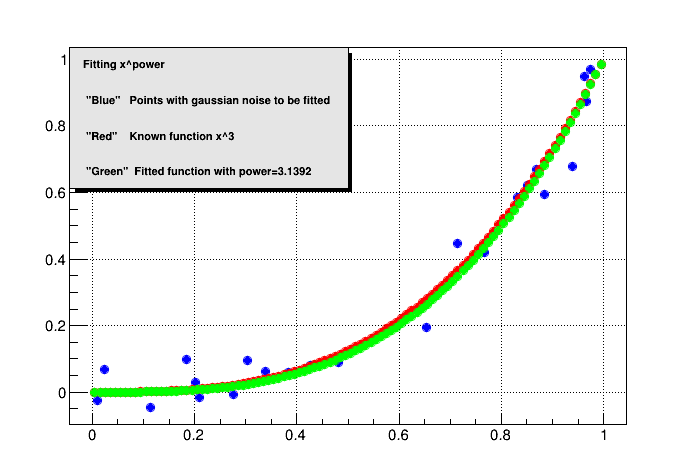
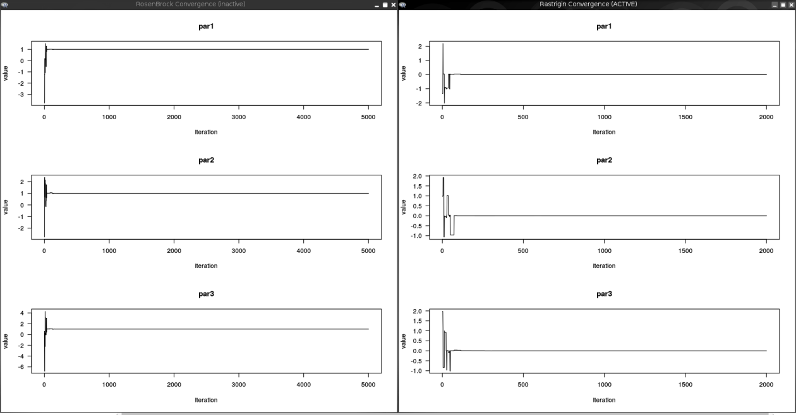
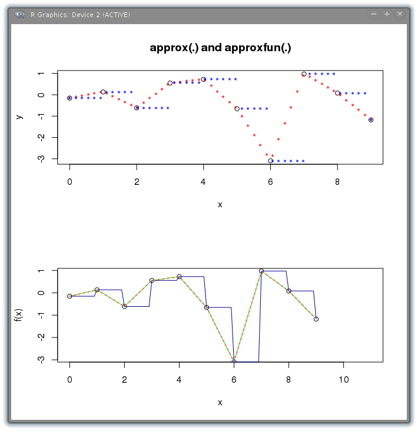

<center></center>
# ROOTR Users Guide


## DESCRIPTION
ROOT R is an interface in ROOT to call R functions using an R C++ interface (Rcpp, see http://dirk.eddelbuettel.com/code/rcpp.html).
This interface opens the possibility in ROOT to use the very large set of mathematical and statistical tools provided by R.
With ROOTR you can perform a conversion from ROOT's C++ objects to R's objects, transform the returned R objects into ROOT's C++ objects, then
the R functionality can be used directly for statistical studies in ROOT.

## ROOTR BASICS
ROOTR creates a working environment to execute R coding called from `C++`. It allows to translate some datatypes from `C++` to R
inside the R environment and vice versa in an easy way to get the most from both R and ROOT.
To ease the sending and receiving of data in both environments, I overloaded the operators `<<`,`>>` and `[]`
which make look the job as a flow of data between environments, we will see more of that later.
With this tool you ca use any library or R package wich allows you to access a big ammount of benefits to make statistical analysis.
ROOTR also has a R events processing system, which allows to use the R graphical system from `C++`.

## INSTALLATION
To install ROOTR please read first.

- [http://root.cern.ch/drupal/content/installing-root-source](http://root.cern.ch/drupal/content/installing-root-source)
- [http://root.cern.ch/drupal/content/build-prerequisites](http://root.cern.ch/drupal/content/build-prerequisites)


### COMPILING ROOTR ON MAC WITH CMAKE:
**NOTE:** Mac OSX Yosemite last xcode and without macports


**Prerequisities**

-  xcode
- [http://xquartz.macosforge.org/](http://xquartz.macosforge.org/)
-  R last version [http://cran.rstudio.com/bin/macosx/R-3.1.3-mavericks.pkg](http://cran.rstudio.com/bin/macosx/R-3.1.3-mavericks.pkg)
- [http://www.cmake.org/files/v3.2/cmake-3.2.1-Darwin-x86_64.dmg](http://www.cmake.org/files/v3.2/cmake-3.2.1-Darwin-x86_64.dmg)

To compile with cmake added into ~/.profile

``` {.sh}
export PATH=$PATH:/Applications/CMake.app/Contents/bin/
```
and

``` {.sh}
source ~/.profile
```

Install needed R packages, open R and in the prompt type

``` {.sh}
install.packages(c('Rcpp','RInside'))
```
select a mirror and install.

Download code from git repo

``` {.sh}
git clone -b master-root-R  https://github.com/lmoneta/root.git
```

To compile ROOTR lets to create a compilation directory and to activate it use cmake -Dr=ON ..

``` {.sh}
mkdir compile
cd compile
cmake -Dr=ON ..
make -j n
```
This is a basic video using ROOTR on

](http://www.youtube.com/watch?v=tvhuEen8t7c)

### Compiling ROOTR on Gnu/Linux with CMake:
**NOTE:** Tested on Gnu/Linux Debian Jessie with gcc 4.9

**Prerequisities**
install
(For debian-based distros)

``` {.sh}
apt-get install r-base r-base-dev
```
Install needed R packages, open R and in the prompt type

``` {.sh}
install.packages(c('Rcpp','RInside'))
```
select a mirror and install.
Download code from git repo

``` {.sh}
git clone -b master-root-R  https://github.com/lmoneta/root.git
```

To compile ROOTR lets to create a compilation directory and to activate it use cmake -Dr=ON ..

``` {.sh}
mkdir compile
cd compile
cmake -Dr=ON ..
make -j n
```
This is a basic video using ROOTR on

](http://www.youtube.com/watch?v=FkrmM2xCPoM)


## HOW DOES IT WORK
There is a class called TRInterface which is located at the header TRInterface.h and uses the namespace `ROOT::R`, it is in charge
of making calls to R to give and obtein data. This class has a series of overcharged operators which ease the passing and obtaining of data
and code from R to C++ and vice versa. To create an object of this class the user must use the static methods `ROOT::R::TRInterface::Instance`
and `ROOT::R::TRInterface::InstancePtr` which return a reference object and a pointer object respectively.

``` {.cpp}
#include<TRInterface.h>
ROOT::R::TRInterface &r=ROOT::R::TRInterface::Instance();
```

## Running R code and passing/getting variables.
We have different ways to run R code and pass/obtain data to/from R environment: using the methods Execute(code) and
Eval(code).

``` {.cpp}
#include<TRInterface.h>
 
//creating an instance
ROOT::R::TRInterface &r=ROOT::R::TRInterface::Instance();
//executing simple r commands with the operator <<
r<<"print('hello ROOTR')";
r<<"vec=c(1,2,3)"<<"print(vec)";
 
//executing R's code using the method Execute that doesn't return anything
r.Execute("print('hello ROOTR')");
 
//We execute the code using the method Eval which returns an instance of TRObjectProxy
//which can be converted to a ROOTR supported classes
std::vector<Int_t> v=r.Eval("c(1,2,3)");
std::cout<<v[0]<<" "<<v[1]<<" "<<v[2]<<std::endl;
 
std::vector<Double_t> vd(3);
 
//obtaining variables from R environment using the operators [] and >> 
r["seq(0,1,0.5)"]>>vd;
std::cout<<vd[0]<<" "<<vd[1]<<" "<<vd[2]<<std::endl;
 
std::vector<Int_t> v(3);
v[0]=0;
v[1]=1;
v[2]=2;
 
r["v1"]<<v;
r<<"print(v1)";
 
TMatrixD m(2,2);
 
//Creating a matrix inside r environment and converting it into a TMatrixD
r<<"mat<-matrix(c(0.1,0.2,0.3,0.4),nrow=2)";
r["mat"]>>m;
m.Print();
```
So, working with ROOTR is like working with flows of data to pass, obtain and process data.

## Passing functions from ROOT to R
You can pass functions from ROOT to R using the opetrators `<<` and `=` or using the class TRFunction, but the arguments and datatypes of the return value cannot be pointers. They must be ROOTR supported datatypes.
So instead of using `*Double_t` you must use `std::vector` and instead of `*Char_t` use TString or `std::string`.

For this example we need to create a macro, so save it as fun.C

``` {.cpp}
#include<TRInterface.h>
#include<TMath.h>
 
Double_t myfun(Double_t x)
{
    return 2*cos(x);
}
 
Double_t myfun2(std::vector<Double_t> x) //use std::vector<Double_t> instead Double_t*
{
    return x[1]*cos(x[0]);
}
 
void fun()
{
ROOT::R::TRInterface &r=ROOT::R::TRInterface::Instance();
r["dilog"]<<ROOT::R::TRFunction(TMath::DiLog);
r["myfun"]<<myfun;
r["myfun2"]<<myfun2;
r<<"print(dilog(0))";
r<<"print(myfun(0))";
r<<"print(myfun2(c(0,4)))";
}
```

**IMPORTANT**
- For overloaded functions you should pass the function with a explicit cast to the wanted function.
- The system works with templates and the template can not resolve the correct type of function because it is overloaded.
- If you pass a function without the explicit cast you will get a very ugly traceback.
- A lot of common standard functions for example from math.h like sin, cos etc.. are overloaded, take care passing it.

``` {.cpp}
#include<TRInterface.h>
 
Double_t myfun(Double_t x)
{
    return 2*cos(x);
}
 
Int_t myfun(Int_t x) 
{
    return x;
}
 
void fun()
{
ROOT::R::TRInterface &r=ROOT::R::TRInterface::Instance();
r["myfund"]<<(Double_t (*)(Double_t))myfun;
r["myfuni"]<<(Int_t (*)(Int_t))myfun;
 
r<<"print(myfund(0.0))";
r<<"print(myfuni(1))";
}
```

## Wrapping a class
You can wrap a class and expose it in R environment using only a pair of macrodefinitions and the template class
`ROOT::R::class_<>`
The `ROOTR_EXPOSED_CLASS(Class)` macro allows you to expose the class as a new datatype of R, but it has to be alongside
the `ROOTR_MODULE(Module)` macro which allows you to create an internal R module and make the class wrapping
To do this you must use inside the `ROOTR_MODULE` braces the class `ROOT::R::class_<>` and specify
each constructor, attribute or method that the class to export has.
Then the macrodefinition `LOAD_ROOTR_MODULE(Module)` can load the module and the class in R's environment.
You can find a more clear instruction by looking at a example below in Functor section.

##DataFrames
DataFrame? is a very important datatype in R and in ROOTR we have a class to manipulate
dataframes called TRDataFrame, with a lot of very useful operators overloaded to work with TRDataFrame's objects
in a similar way that in the R environment but from c++ in ROOT.
Example:

Lets to create need data to play with dataframe features

``` {.cpp}
////////////////////////
//creating variables//
////////////////////////
TVectorD v1(3);
std::vector<Double_t> v2(3);
std::array<Int_t,3>  v3{ {1,2,3} };
std::list<std::string> names;
 
//////////////////////
//assigning values//
//////////////////////
v1[0]=1;
v1[1]=2;
v1[2]=3;
 
v2[0]=0.101;
v2[1]=0.202;
v2[2]=0.303;
 
names.push_back("v1");
names.push_back("v2");
names.push_back("v3");
 
ROOT::R::TRInterface &r=ROOT::R::TRInterface::Instance();
```
In R the dataframe have associate to every column a label, in ROOTR you can have the same label using the class ROOT::R::Label to create a TRDataFrame where you data
have a label associate.

``` {.cpp}
/////////////////////////////////////////////////
//creating dataframe object with its labels//
/////////////////////////////////////////////////
 
ROOT::R::TRDataFrame  df1(ROOT::R::Label["var1"]=v1,ROOT::R::Label["var2"]=v2,ROOT::R::Label["var3"]=v3,ROOT::R::Label["strings"]=names);
 
//////////////////////////////////////////////
//Passing dataframe to R's environment//
//////////////////////////////////////////////
 
r["df1"]<<df1;
r<<"print(df1)";
```
Output

``` {.sh}
var1  var2 var3 strings
1    1 0.101    1      v1
2    2 0.202    2      v2
3    3 0.303    3      v3
```
Manipulating data between dataframes

``` {.cpp}
////////////////////////////////
//Adding colunms to dataframe //
////////////////////////////////
 
TVectorD v4(3);
//filling the vector fro R's environment
r["c(-1,-2,-3)"]>>v4;
//adding new colunm to df1 with name var4
df1["var4"]=v4;
//updating df1 in R's environment
r["df1"]<<df1;
//printing df1
r<<"print(df1)";
```
Output

``` {.sh}
var1  var2 var3 strings var4
1    1 0.101    1      v1   -1
2    2 0.202    2      v2   -2
3    3 0.303    3      v3   -3
``` 

Getting data frames from R's environment

``` {.cpp}
//////////////////////////////////////////
//Getting dataframe from R's environment//
//////////////////////////////////////////
ROOT::R::TRDataFrame df2;
 
r<<"df2<-data.frame(v1=c(0.1,0.2,0.3),v2=c(3,2,1))";
r["df2"]>>df2;
 
TVectorD v(3);
df2["v1"]>>v;
v.Print();
 
df2["v2"]>>v;
v.Print();
```

Output

``` {.sh}
Vector (3)  is as follows
 
     |        1  |
------------------
   0 |0.1 
   1 |0.2 
   2 |0.3 
 
Vector (3)  is as follows
 
     |        1  |
------------------
   0 |3 
   1 |2 
   2 |1
```

``` {.cpp}
///////////////////////////////////////////
//Working with colunms between dataframes//
///////////////////////////////////////////
 
df2["v3"]<<df1["strings"];
 
//updating df2 in R's environment
r["df2"]<<df2;
r<<"print(df2)";
```
Output

``` {.sh}
v1 v2 v3
1 0.1  3 v1
2 0.2  2 v2
3 0.3  1 v3
```

``` {.cpp}
///////////////////////////////////////////
//Working with colunms between dataframes//
///////////////////////////////////////////
 
//passing values from colunm v3 of df2 to var1 of df1 
df2["v3"]>>df1["var1"];
//updating df1 in R's environment
r["df1"]<<df1;
r<<"print(df1)";
```

Output

``` {.sh}
var1  var2 var3 strings var4
1   v1 0.101    1      v1   -1
2   v2 0.202    2      v2   -2
3   v3 0.303    3      v3   -3
```

## Plotting with R's graphical system.
ROOTR supports an eventloop for R's graphical system which allows plotting using the R functions to the
graphical system or generating images(ps, pdf png, etc).
You can find a demo in Interpolation below in examples section.

## Interactive Mode
The interactive mode lets you get the R's command line within ROOT's command line to run R code with tab completion support.
The variables created in the interactive mode can be passed to ROOT with TRObjectProxy and the method ParseEval?.
To initialize the interactive mode just call Interactive() method and type ".q" to exit from R's prompt and to go to the ROOT's prompt again.

``` {.cpp}
[omazapa] [tuxhome] [~]$ root -l
root [0] #include<TRInterface.h>
root [1] ROOT::R::TRInterface &r=ROOT::R::TRInterface::Instance();
root [2] r.Interactive()
[r]:a=seq
seq          seq_along    seq.Date     seq.default  seq.int      seq_len      seq.POSIXt   sequence     
[r]:a=seq(1,5,0.5)
[r]:.q
root [3] TVectorD v=r.ParseEval("a");
root [4] v.Print()
 
Vector (9)  is as follows
 
     |        1  |
------------------
   0 |1 
   1 |1.5 
   2 |2 
   3 |2.5 
   4 |3 
   5 |3.5 
   6 |4 
   7 |4.5 
   8 |5 
 
root [4]
``` 

## EXAMPLES
The examples can also be found in `$ROOTSYS/tutorials/r`

## Creating a Functor
A functor is a class which wraps a function, very useful when states and propierties
associated to that function are needed.
In this example I show how to give support to a custom class to be used in R's environment,
which at the same time is a functor.

``` {.cpp}
#include<TRInterface.h>
#include<TMath.h>
 
typedef Double_t (*Function)(Double_t);
 
//Functor class with the function inside
class MyFunctor{
public:
  MyFunctor(){
    status=false;
    f=TMath::BesselY1;
  }
  void setFunction(Function fun)
  {
    f=fun;
    status=true;
  }
  Bool_t getStatus(){return status;}
  Double_t doEval(Double_t x) {
    return f(x);
  }
private:
   Function f;
   Bool_t status;
};
//this macro exposes the class into R's enviornment
// and lets you pass objects directly.
ROOTR_EXPOSED_CLASS(MyFunctor)
 
//Macro to create a module
ROOTR_MODULE(MyFunctorModule) {
    ROOT::R::class_<MyFunctor>( "MyFunctor" )
    //creating a default constructor
    .constructor()
    //adding the method doEval to evaluate the internal function
    .method( "doEval", &MyFunctor::doEval )
    .method( "getStatus", &MyFunctor::getStatus)
    ;
}
 
void Functor()
{
   ROOT::R::TRInterface &r=ROOT::R::TRInterface::Instance();
   ////////////////////////////////////////////////////////////
   //Creating a functor with default function TMath::BesselY1//
   // and status false from R's environment                  //             
   ////////////////////////////////////////////////////////////
   //Loading module into R's enviornment
   r["MyFunctorModule"]<<LOAD_ROOTR_MODULE(MyFunctorModule);
 
   //creating a class variable from the module
   r<<"MyFunctor <- MyFunctorModule$MyFunctor";
   //creating a MyFunctor's object
   r<<"u <- new(MyFunctor)";
 
   //printing status
   r<<"print(u$getStatus())";
 
   //printing values from Functor and Function
   r<<"print(sprintf('value in R = %f',u$doEval( 1 )))";
   std::cout<<"value in ROOT = "<<TMath::BesselY1(1)<<std::endl;
 
   ////////////////////////////////////////////////////////////
   //creating a MyFunctor's object and passing object to R's //
   //enviornment, the status should be true because is not   //
   //using the default function                              //
   ////////////////////////////////////////////////////////////
   MyFunctor functor;
   functor.setFunction(TMath::Erf);
   r["functor"]<<functor;
   //printing the status that should be true
   r<<"print(functor$getStatus())";
   r<<"print(sprintf('value in R = %f',functor$doEval( 1 )))";
   std::cout<<"value in ROOT = "<<TMath::Erf(1)<<std::endl;
}
```

## Simple fitting in R and plot in ROOT
The next example creates an exponential fit.
The idea is to create a set of numbers x,y with noise from ROOT,
pass them to R and fit the data to `x^3`,
get the fitted coefficient(power) and plot the data,
the known function and the fitted function using ROOT's classes.

``` {.cpp}
#include<TRInterface.h>
#include<TRandom.h>
 
TCanvas *SimpleFitting(){
   TCanvas *c1 = new TCanvas("c1","Curve Fitting",700,500);
   c1->SetGrid();
 
   // draw a frame to define the range
   TMultiGraph *mg = new TMultiGraph();
 
   // create the first graph (points with gaussian noise)
   const Int_t n = 24;
   Double_t x1[n] ;
   Double_t y1[n] ;
   //Generate the points along a X^3 with noise
   TRandom rg;
   rg.SetSeed(520);
   for (Int_t i = 0; i < n; i++) {
      x1[i] = rg.Uniform(0, 1);
      y1[i] = TMath::Power(x1[i], 3) + rg.Gaus() * 0.06;
   }
 
   TGraph *gr1 = new TGraph(n,x1,y1);
   gr1->SetMarkerColor(kBlue);
   gr1->SetMarkerStyle(8);
   gr1->SetMarkerSize(1);
   mg->Add(gr1);
 
      // create the second graph
   TF1 *f_known=new TF1("f_known","pow(x,3)",0,1);
   TGraph *gr2 = new TGraph(f_known);
   gr2->SetMarkerColor(kRed);
   gr2->SetMarkerStyle(8);
   gr2->SetMarkerSize(1);
   mg->Add(gr2);
   //passing data to Rfot fitting
     ROOT::R::TRInterface &r=ROOT::R::TRInterface::Instance();
   r["x"]<<TVectorD(n, x1);
   r["y"]<<TVectorD(n, y1);
   //creating a R data frame
   r<<"ds<-data.frame(x=x,y=y)";
   //fitting x and y to X^power using Nonlinear Least Squares
   r<<"m <- nls(y ~ I(x^power),data = ds, start = list(power = 1),trace = T)";
   //getting the exponent
   Double_t power;
   r["summary(m)$coefficients[1]"]>>power;
 
   TF1 *f_fitted=new TF1("f_fitted","pow(x,[0])",0,1);
   f_fitted->SetParameter(0,power);
   //plotting the fitted function
   TGraph *gr3 = new TGraph(f_fitted);
   gr3->SetMarkerColor(kGreen);
   gr3->SetMarkerStyle(8);
   gr3->SetMarkerSize(1);
 
   mg->Add(gr3);
   mg->Draw("ap");
 
   //displaying basic results
   TPaveText *pt = new TPaveText(0.1,0.6,0.5,0.9,"brNDC");
   pt->SetFillColor(18);
   pt->SetTextAlign(12);
   pt->AddText("Fitting x^power ");
   pt->AddText(" \"Blue\"   Points with gaussian noise to be fitted");
   pt->AddText(" \"Red\"    Known function x^3");
   TString fmsg;
   fmsg.Form(" \"Green\"  Fitted function with power=%.4lf",power);
   pt->AddText(fmsg);
   pt->Draw();   
   c1->Update();
   return c1;
}
```
In the first image you can see the blue dots wichi are the function `x^3` with gaussian noise, the red dots correspond to
the original function and the green ones correspond to the fitted function.
<center>  </center>

## Global Minimization in R using the package DEoptim
DEoptim is a R package for Differential Evolution Minimization that lets you do global
Minimization.
To install this package you just need to run:

``` {.cpp}
#include<TRInterface.h>
ROOT::R::TRInterface &r=ROOT::R::TRInterface::Instance();
r<<"install.packages('DEoptim',repos='http://cran.rstudio.com/')";
```

Then create a macro named GlobalMinimization.C with the next code.

``` {.cpp}
#include<TRInterface.h>
#include<TBenchmark.h>
#include<math.h>
#include<stdlib.h>
//In the next function the *double pointer should be changed by a TVectorD datatype,
//because the pointer has no meaning in the R enviroment.
//This is a generalization of the RosenBrock function, with the min xi=1 and i>0.
Double_t GenRosenBrock(const TVectorD xx )
{
  int length=xx.GetNoElements();
 
  Double_t result=0;
  for(int i=0;i<(length-1);i++)
  {
    result+=pow(1-xx[i],2)+100*pow(xx[i+1]-pow(xx[i],2),2);
  }
  return result;
}
 
//the min xi=0 i>0
Double_t Rastrigin(const TVectorD xx)
{
  int length=xx.GetNoElements();
  Double_t result=10*length;
  for(int i=0;i<length;i++)
  {
    result+=xx[i]*xx[i]-10*cos(6.2831853*xx[i]);
  }
  return result;
}
 
void GlobalMinimization()
{
 TBenchmark bench;
 ROOT::R::TRInterface &r=ROOT::R::TRInterface::Instance();
 
 Bool_t installed=r.Eval("is.element('DEoptim', installed.packages()[,1])");
 if(!installed)
 {
    std::cout<<"Package DEoptim no installed in R"<<std::endl;
    std::cout<<"Run install.packages('DEoptim') in R's environment"<<std::endl;
    return;
 }
 
 //loading DEoptim
 r<<"suppressMessages(library(DEoptim, quietly = TRUE))";
 
//  passing RosenBrock function to R
 r["GenRosenBrock"]<<GenRosenBrock;
 
 //maximun number of iterations 
 r["MaxIter"]<<5000;
 //n = size of vector that is an argument for GenRosenBrock
 r["n"]<<3;
 //lower limits
 r<<"ll<-rep(-25, n)";
 //upper limits
 r<<"ul<-rep(25, n)";
 
 bench.Start("GlobalMinimizationRosenBrock");
 //calling minimization and timing it.
 r<<"result1<-DEoptim(fn=GenRosenBrock,lower=ll,upper=ul,control=list(NP=10*n,itermax=MaxIter,trace=FALSE))";
 std::cout<<"-----------------------------------------"<<std::endl;
 std::cout<<"RosenBrock's minimum in: "<<std::endl;
 r<<"print(result1$optim$bestmem)";
 std::cout<<"Bechmark Times"<<std::endl;
//  printing times
 bench.Show("GlobalMinimizationRosenBrock");
 
 
 //passing RosenBrock function to R
 r["Rastrigin"]<<Rastrigin;
 //maximun number of iterations 
 r["MaxIter"]<<2000;
 //n = size of a vector which is an argument for Rastrigin
 r["n"]<<3;
 //lower limits
 r<<"ll<-rep(-5, n)";
 //upper limits
 r<<"ul<-rep(5, n)";
 
 bench.Start("GlobalMinimizationRastrigin");
 //calling minimization and timing it.
 r<<"result2<-DEoptim(fn=Rastrigin,lower=ll,upper=ul,control=list(NP=10*n,itermax=MaxIter,trace=FALSE))";
 std::cout<<"-----------------------------------------"<<std::endl;
 std::cout<<"Rastrigin's minimum in: "<<std::endl;
 r<<"print(result2$optim$bestmem)";
 std::cout<<"Bechmark Times"<<std::endl;
 //printing times
 bench.Show("GlobalMinimizationRastrigin");
 r<<"dev.new(title='RosenBrock Convergence')";
 r<<"plot(result1,type='o',pch='.')";
 r<<"dev.new(title='Rastrigin Convergence')";
 r<<"plot(result2,type='o',pch='.')";
}
```
In the image you can see the convergence plots of the functions and their minimum.
For RosenBrock is (1,1,1) and for Rastrigin is (0,0,0).
<center> </center>

## Interpolation (Plotting in R)
This example shows an interpolation using the function aproxfun and how to make a plot with R's
graphical functions.

More Information on R interpolation at
[http://stat.ethz.ch/R-manual/R-patched/library/stats/html/approxfun.html](http://stat.ethz.ch/R-manual/R-patched/library/stats/html/approxfun.html)

``` {.cpp}
#include<TRInterface.h>
#include<TRandom.h>
#include<vector>
 
void Interpolation()
{
 ROOT::R::TRInterface &r=ROOT::R::TRInterface::Instance();  
//Creting points
TRandom rg;
std::vector<Double_t> x(10),y(10);
for(int i=0;i<10;i++)
{
  x[i]=i;
  y[i]=rg.Gaus();
}
 
r["x"]=x;
r["y"]=y;
 
 
r<<"dev.new()";//Required to activate new window for plotting
//Plot parameter. Plotting using two rows and one column
r<<"par(mfrow = c(2,1))";
 
//plotting the points
r<<"plot(x, y, main = 'approx(.) and approxfun(.)')";
 
//The function "approx" returns a list with components x and y, 
//containing n coordinates which interpolate the given data points according to the method (and rule) desired.
r<<"points(approx(x, y), col = 2, pch = '*')";
r<<"points(approx(x, y, method = 'constant'), col = 4, pch = '*')";
 
 
//The function "approxfun" returns a function performing (linear or constant) 
//interpolation of the given data. 
//For a given set of x values, this function will return the corresponding interpolated values.
r<<"f <- approxfun(x, y)";
 
r<<"curve(f(x), 0, 11, col = 'green2')";
r<<"points(x, y)";
 
 
//using approxfun with const method
r<<"fc <- approxfun(x, y, method = 'const')";
r<<"curve(fc(x), 0, 10, col = 'darkblue', add = TRUE)";
// different interpolation on left and right side :
r<<"plot(approxfun(x, y, rule = 2:1), 0, 11,col = 'tomato', add = TRUE, lty = 3, lwd = 2)";
}
```
The image shows the interpolated function plotted within R
<center>  </center>

## Integration (Passing vectorized function to R)
Numerical integration using R passing the function from ROOT

``` {.cpp}
#include<TMath.h>
#include<TRInterface.h>
#include<Math/Integrator.h>
#include<TF1.h>
 
//To integrate using R the function must be vectorized
//The idea is just to receive a vector like an argument,to evaluate 
//every element saving the result in another vector 
//and return the resultant vector.
std::vector<Double_t>  BreitWignerVectorized(std::vector<Double_t> xx)
{
  std::vector<Double_t> result(xx.size());
  for(Int_t i=0;i<xx.size();i++)
  {
    result[i]=TMath::BreitWigner(xx[i]);
  }
  return result;
}
 
double BreitWignerWrap( double x){ 
   return TMath::BreitWigner(x);
}
 
 
void Integration()
{
 
  ROOT::R::TRInterface &r=ROOT::R::TRInterface::Instance();
 
  r["BreitWigner"]=BreitWignerVectorized;
 
  Double_t value=r.Eval("integrate(BreitWigner, lower = -2, upper = 2)$value");
 
  std::cout.precision(18);
  std::cout<<"Integral of the BreitWigner Function in the interval [-2, 2] R        = "<<value<<std::endl;
 
 
  ROOT::Math::WrappedFunction<> wf(BreitWignerWrap);
  ROOT::Math::Integrator i(wf);
  value=i.Integral(-2,2);
  std::cout<<"Integral of the BreitWigner Function in the interval [-2, 2] MathMore = "<<value<<std::endl;
 
 
  TF1 f1("BreitWigner","BreitWignerWrap(x)");
  value=f1.Integral(-2,2);
  std::cout<<"Integral of the BreitWigner Function in the interval [-2, 2] TF1      = "<<value<<std::endl;
 
  //infinte limits
  value=r.Eval("integrate(BreitWigner, lower = -Inf, upper = Inf)$value");
  std::cout<<"Integral of BreitWigner Function in the interval [-Inf, Inf] R    = "<<value<<std::endl;
 
}
```


