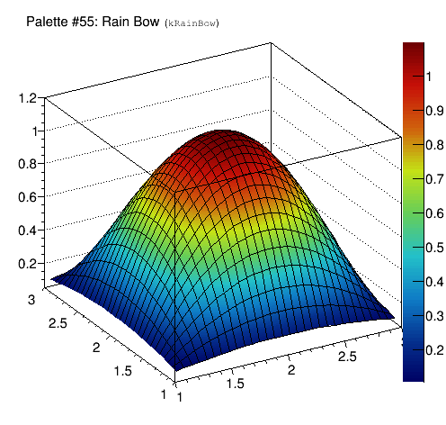
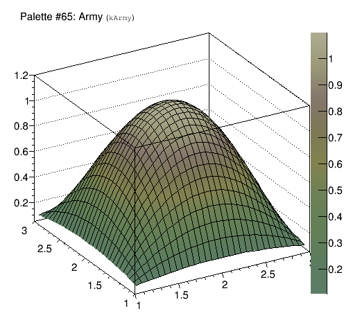
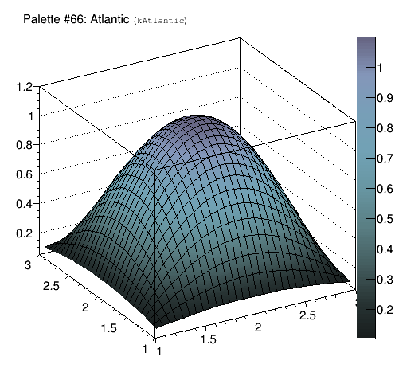
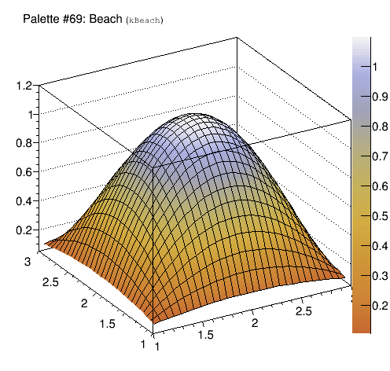
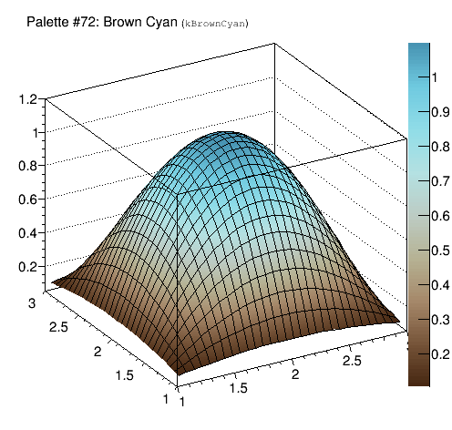
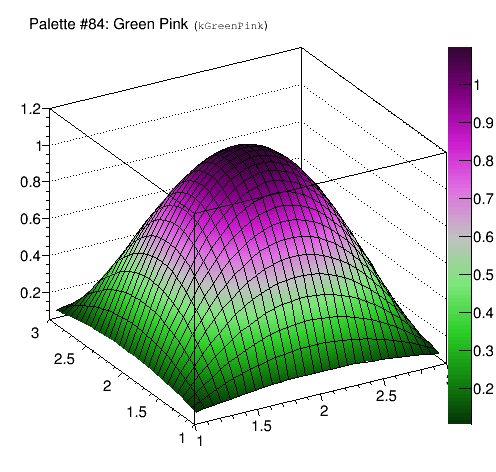
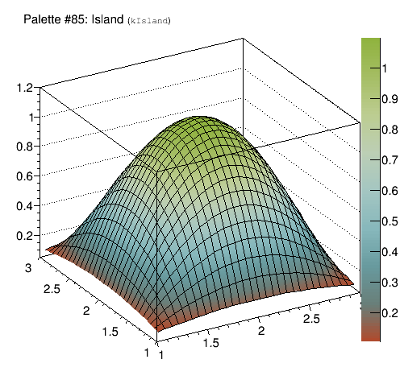
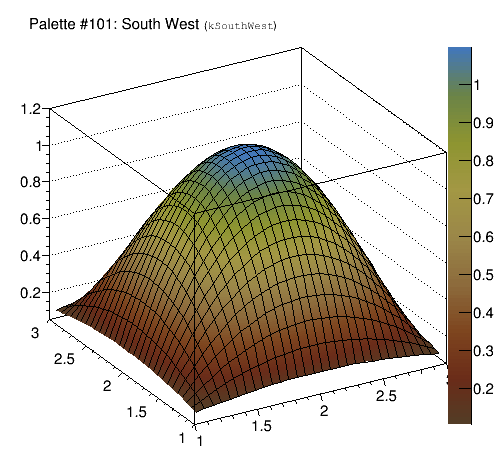
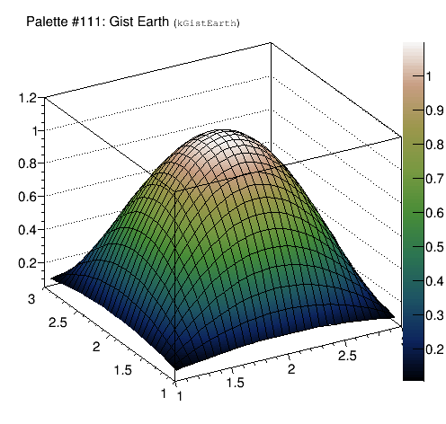

## Core Libraries

### General

#### Platform support

ROOT now works on linuxarm64 / AArch64 / ARMv8 64-bit - thanks, David Abdurachmanov!

ROOT supports GCC 5.0 (a preview thereof) and XCode 6.3, Mac OSX 10.10.3


#### Thread-Safety

A lot of effort went into improving the thread-safety of Core and Meta classes / functions. A special thanks to Chris Jones from CMS!

#### std::string_view

Introduce a preview of C++17's std::string_view.  To take advantage of this new
class use:
```{.cpp}
#include "RStringView.h"
```
The documentation of this can be found at `http://en.cppreference.com/w/cpp/experimental/basic_string_view`
The implementation provided is extracted from libcxx.  Whenever the current
compiler and standard library provide an implmentation, it is used.

The type string_view describes an object that can refer to a constant contiguous sequence of char-like objects with the first element of the sequence at position zero.

This type is used throughout the ROOT code to avoid copying strings when a
sub-string is needed and to extent interfaces that uses to take a const char*
to take a std::string_view as thus be able to be directly directly passed a
TString, a std::string or a std::string_view.   Usage example:

``` {.cpp}
// With SetName(std::string_view)
std::string str; …
obj.SetName( std );
obj.SetName( {str.data()+pos, len} );
```

### Meta library

#### Backward Incompatibilities

TIsAProxy's constructor no longer take the optional and unused 2nd argument which was reserved for a 'context'.  This context was unused in TIsAProxy itself and was not accessible from derived classes.

#### Interpreter

The new interface `TInterpreter::Declare(const char* code)` will declare the
code to the interpreter with all interpreter extensions disabled, i.e. as
"proper" C++ code. No autoloading or synamic lookup will be performed.

A new R__LOAD_LIBRARY(libWhatever) will load libWhatever at parse time. This allows ROOT to resolve symbols from this library very early on. It is a work-around for the following code from ROOT 5:

``` {.cpp}
  // ROOT 5:
  void func() {
    gSystem->Load("libEvent");
    Event* e = new Event;
  }
```

Instead, write:

``` {.cpp}
  // ROOT 6:
  R__LOAD_LIBRARY(libEvent)
  #include "Event.h"

  void func() {
    Event* e = new Event;
  }
```

#### TClass

Introduced new overload for calculating the TClass CheckSum:

``` {.cpp}
   UInt_t TClass::GetCheckSum(ECheckSum code, Bool_t &isvalid) const;
```

which indicates via the 'isvalid' boolean whether the checksum could be
calculated correctly or not.

### TROOT

Implemented new gROOT->GetTutorialsDir() static method to return the actual location of the tutorials directory.
This is $ROOTSYS/tutorials when not configuring with --prefix  or -Dgnuinstall for CMake.

### TColor

Add an enum to access the palette by name.

Add new palettes with 255 colors. Names and colors' definitions have been taken from
[here](http://www.rcnp.osaka-u.ac.jp/~noji/colormap). Except for the `kBird` palette.
These palettes can be accessed with `gStyle->SetPalette(num)`. `num` can be taken
within the following enum:

* kDeepSea = 51
* kGreyScale = 52
* kDarkBodyRadiator = 53
* kBlueYellow =  54
* kRainBow = 55
* kInvertedDarkBodyRadiator = 56
* kBird = 57
* kCubehelix = 58
* kGreenRedViolet = 59
* kBlueRedYellow = 60
* kOcean = 61
* kColorPrintableOnGrey = 62
* kAlpine = 63
* kAquamarine = 64
* kArmy = 65
* kAtlantic = 66
* kAurora = 67
* kAvocado = 68
* kBeach = 69
* kBlackBody = 70
* kBlueGreenYellow = 71
* kBrownCyan = 72
* kCMYK = 73
* kCandy = 74
* kCherry = 75
* kCoffee = 76
* kDarkRainBow = 77
* kDarkTerrain = 78
* kFall = 79
* kFruitPunch = 80
* kFuchsia = 81
* kGreyYellow = 82
* kGreenBrownTerrain = 83
* kGreenPink = 84
* kIsland = 85
* kLake = 86
* kLightTemperature = 87
* kLightTerrain = 88
* kMint = 89
* kNeon = 90
* kPastel = 91
* kPearl = 92
* kPigeon = 93
* kPlum = 94
* kRedBlue = 95
* kRose = 96
* kRust = 97
* kSandyTerrain = 98
* kSienna = 99
* kSolar = 100
* kSouthWest = 101
* kStarryNight = 102
* kSunset = 103
* kTemperatureMap = 104
* kThermometer = 105
* kValentine = 106
* kVisibleSpectrum = 107
* kWaterMelon = 108
* kCool = 109
* kCopper = 110
* kGistEarth = 111

























### Interpreter Library

Many, many bugs have been fixed; thanks to everyone who has reported them!

#### Cling

Cling is now using a new just-in-time compilation engine called OrcJIT, a development based on MCJIT. It enables interpretation of inline assembly and exceptions; it will hopefully in the near future also support interpreting thread local storage (but doesn't at the moment).

Thanks to the new JIT, cling also comes with debug symbols for interpreted code; you can enable them with ".debug".

#### Function evaluation

Function calls through TMethodCall etc have been accelerated.

#### llvm / clang

llvm / clang were updated to r227800. This includes everything from the clang 3.6 release.

### Dictionary Generation

Detect usage of #pragma once for inlined headers.

Turn on verbosity of genreflex if the VERBOSE environment variable is defined.

Optimise forward declarations in rootmap files in order to make their interpretation faster.

Propagate attributes specified in xml selection files to selected classes even when selected through typedefs.

Optimise selection procedure caching selected declarations in the selection rules, therewith avoiding to query the AST twice.

Include in the PCH all the STL and C headers to guarantee portability of binaries from SLC6 to CC7.


