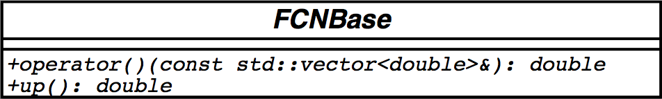
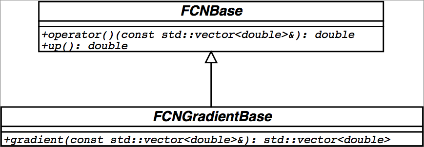

# Foreword #

## What M is intended to do ##

M is conceived as a tool to find the minimum value of a multi-parameter
function (the "$\mbox{FCN}$") and analyze the shape of the function
around the minimum. The principal application is foreseen for
statistical analysis, working on chisquare or log-likelihood functions,
to compute the best-fit parameter values and uncertainties, including
correlations between the parameters. It is especially suited to handle
difficult problems, including those which may require guidance in order
to find the correct solution.

## What M is not intended to do ##

Although M will of course solve easy problems faster than complicated
ones, it is not intended for the repeated solution of identically
parametrized problems (such as track fitting in a detector) where a
specialized program will in general be much more efficient.

## Further remarks ##

M was initially written in Fortran around 1975-1980 at CERN by Fred
James @bib-MINUIT. Its main field of usage is statistical data analysis
of experimental data recorded at CERN, but it is also used by people
doing data analysis outside CERN or outside high energy physics (HEP).
In 2002 Fred James started a project aiming to re-implement M in an
object-oriented way using .

More information about recent developments, releases and installation
can be obtained from the M homepage @bib-C++MINUIT.

The names of M applications are written in capital letters (e.g.
$\mbox{MIGRAD}$, $\mbox{MINOS}$, $\mbox{CONTOURS}$), the
corresponding names of the classes are written using sans-serif font
type (MnMigrad, MnMinos, MnContours).

# Introduction: M basic concepts #

[sec:intro]

## The organization of M ##

The M package acts on a multiparameter *objective function* which is
called — for historical reasons — the $\mbox{FCN}$ function (see
[howto:fcn]). This function is usually a chisquared or a log–likelihood,
but it could also be a mathematical function. The $\mbox{FCN}$
function needs to be written in for which M defines the pure abstract
base class FCNBase as interface. The user must define and implement the
$\mbox{FCN}$ function in a derived class from FCNBase. Sometimes
this is done by an intermediate program such as HippoDraw@bib-HippoDraw,
in which case M is being used under the control of such an intermediate
program[^1]. The value of the $\mbox{FCN}$ function will in general
depend on one or more variable parameters whose meaning is defined by
the user (or by the intermediate program), but whose trial values are
determined by M .

To take a simple example, suppose the problem is to fit a polynomial
through a set of data points. Then the user would write a
$\mbox{FCN}$ which calculates the $\chi^2$ between a polynomial and
the data; the variable parameters of $\mbox{FCN}$ would be the
coefficients of the polynomials. Using objects for minimization from M ,
the user would request M to minimize the $\mbox{FCN}$ with respect
to the parameters, that is, find those values of the coefficients which
give the lowest value of chisquare.

The user must therefore supply, in addition to the function to be
analyzed, via a set or sequence of M applications the instructions which
analysis is wanted. The instructions are coded in in the calling program
(main.cpp), which allows looping, conditional execution, and all the
other possibilities of , but not interactivity, since it must be
compiled before execution.

## Design aspects of M in ##

What M is:

-   platform independent

-   written in an object-oriented way using standard

-   independent of any external package

The maintainability should be guaranteed with the choice of a modern
computer language. Choosing object-oriented technology M should profit
from an increased flexibility and functionality and make it also
extendable (recursiveness, new algorithms, new functionality).

What M does not:

-   histogramming

-   data handling

-   graphics

M is kept as a low-level package with optimal performance.

The main usages of M are

-   from a user's program (such as int main()...)

-   from a graphical data analysis tool such as HippoDraw@bib-HippoDraw

The most important goals of M in are

-   its numerical accuracy (equivalent to its Fortran version)

-   its computational performance (equivalent to its Fortran version)

For the design of the application programming interface (API) of M a
two-way strategy was imposed:

-   a minimal required interface with minimum interaction with M objects
    and with appropriate usage of the standard library (STL): the user's
    implementation of the FCNBase class, initial parameter values and
    uncertainties are provided by the to M user via std::vectors.

-   a rich interface which provides the user with more functionality
    such as interaction with parameters.

The core of the minimization functionality and related tools (the kernel
of M ) should be clearly separated from the user, who is interfacing via
defined user interfaces (the API).

## Internal and external parameters ##

Each of the parameters to the $\mbox{FCN}$ is defined by the user as
belonging to one of the following types:

-   Freely variable: allowed to take on any value.

-   Variable with double sided limits: allowed to vary only between two
    limits specified by the user.

-   Variable with single sided limits: allowed to vary only between one
    upper or one lower limit specified by the user and unlimited to the
    other side.

-   Fixed: originally defined as variable, but now taking on only the
    value the parameter had at the moment it was fixed, or a value later
    assigned by the user.

-   Constant: taking on only one value as specified by the user.

When using the minimal required interface, all variable parameters are
free and unbound.

The user, in their $\mbox{FCN}$, must of course be able to "see" all
types of defined parameters, and they therefore have access to what we call
the *external parameter list*, that is, the parameters as he defined
them. On the other hand, the internal M minimizing routines only want to
"see" variable parameters without limits, and so they have access only
to the *internal parameter list* which is created from the external list
by the following transformation:

-   Squeeze out all parameters that are not variable.

-   Transform all variable parameters with limits, so that the
    transformed parameter can vary without limits. (See the next section
    for details concerning this transformation.) Because this
    transformation is non-linear, it is recommended to avoid putting
    limits on parameters where they are not needed.

As an example, suppose that the user has defined the following
parameters:

-   Parameter 0, constant.

-   Parameter 1, freely variable.

-   Parameter 2, variable with limits.

-   Parameter 3, constant.

-   Parameter 4, freely variable.

Then the internal parameter list would be as follows:

-   Internal parameter 0 = external parameter 1.

-   Internal parameter 1 = external parameter 2, transformed
    appropriately.

-   Internal parameter 2 = external parameter 4.

In the above example, M considers that the number of external parameters
is 5, and the number of internal parameters is 3. This is the number
which determines, for example, the size of the error matrix of the
parameters, since only variable parameters have errors.

An important feature of M is that parameters are allowed to change types
during the M minimization and analysis of a $\mbox{FCN}$ function.
Several applications in M have methods available to make variable
parameters fixed and vice-versa; to impose, change, or remove limits
from variable parameters; and even to define completely new parameters
at any time during a run. In addition, some M applications (notably the
$\mbox{MINOS}$ error analysis) cause one or more variable parameters
to be temporarily fixed during the calculation. Therefore, the
correspondence between external and internal parameter lists is in
general a dynamic one, and the number of internal parameters is not
necessarily constant.

For more details about parameter interaction see [api:parameters].

### The transformation for parameters with limits ###

[intro:limits]

For variable parameters with double sided limits $a$ (lower) and $b$
(upper), M uses the following transformation:

$$\begin{aligned}
P_{\mathrm{int}} &=& \arcsin
        \left( 2\: \frac{ P_{\mathrm{ext}}-a}{ b-a} - 1 \right) \\
P_{\mathrm{ext}} &=& a + \frac{ b - a}{ 2}
        \left( \sin P_{\mathrm{int}} + 1 \right)              \end{aligned}$$

so that the internal value $P_{\mathrm{int}}$ can take on any value,
while the external value $P_{\mathrm{ext}}$ can take on values only
between the lower limit $a$ and the upper limit $b$. Since the
transformation is necessarily non-linear, it would transform a nice
linear problem into a nasty non-linear one, which is the reason why
limits should be avoided if not necessary. In addition, the
transformation does require some computer time, so it slows down the
computation a little bit, and more importantly, it introduces additional
numerical inaccuracy into the problem in addition to what is introduced
in the numerical calculation of the $\mbox{FCN}$ value. The effects
of non-linearity and numerical roundoff both become more important as
the external value gets closer to one of the limits (expressed as the
distance to nearest limit divided by distance between limits). The user
must therefore be aware of the fact that, for example, if they put limits
of $(0,10^{10})$ on a parameter, then the values $0.0$ and $1.0$ will be
indistinguishable to the accuracy of most machines.

For this purpose single sided limits on parameters are provided by M ,
with their transformation being:

Lower bound $a$:

$$\begin{aligned}
P_{\mathrm{int}} &=& \pm\sqrt{(P_{\mathrm{ext}} - a + 1)^2 - 1} \\
P_{\mathrm{ext}} &=& a - 1 + \sqrt{P_{\mathrm{int}}^2 + 1}              \end{aligned}$$

Upper bound $b$:

$$\begin{aligned}
P_{\mathrm{int}} &=& \pm\sqrt{(b - P_{\mathrm{ext}} + 1)^2 - 1} \\
P_{\mathrm{ext}} &=& b + 1 - \sqrt{P_{\mathrm{int}}^2 + 1}              \end{aligned}$$

The transformation of course also affects the parameter error matrix, so
M does a transformation of the error matrix (and the "parabolic"
parameter errors) when there are parameter limits. Users should however
realize that the transformation is only a linear approximation, and that
it cannot give a meaningful result if one or more parameters is very
close to a limit, where
$\partial P_{\mathrm{ext}} / \partial P_{\mathrm{int}} \approx 0$.
Therefore, it is recommended that:

-   Limits on variable parameters should be used only when needed in
    order to prevent the parameter from taking on unphysical values.

-   When a satisfactory minimum has been found using limits, the limits
    should then be removed if possible, in order to perform or
    re-perform the error analysis without limits.

Further discussion of the effects of parameter limits may be found in
the last chapter.

## M strategy ##

At many places in the analysis of the $\mbox{FCN}$ (the user
provided function), M must decide whether to be "safe" and waste a few
function calls in order to know where it is, or to be "fast" and attempt
to get the requested results with the fewest possible calls at a certain
risk of not obtaining the precision desired by the user. In order to
allow the user to influence these decisions, there is a M class
MnStrategy (see [api:strategy]) which the user can use to put different
settings. In the current release, this MnStrategy can be instantiated
with three different minimization quality levels for low (0), medium (1)
and high (2) quality. Default settings for iteration cycles and
tolerances are initialized then. The default setting is set for medium
quality. Value 0 (low) indicates to M that it should economize function
calls; it is intended for cases where there are many variable parameters
and/or the function takes a long time to calculate and/or the user is
not interested in very precise values for parameter errors. On the other
hand, value 2 (high) indicates that M is allowed to waste function calls
in order to be sure that all values are precise; it is intended for
cases where the function is evaluated in a relatively short time and/or
where the parameter errors must be calculated reliably. In addition all
constants set in MnStrategy can be changed individually by the user,
e.g. the number of iteration cycles in the numerical gradient.

## Parameter errors ##

M is usually used to find the "best" values of a set of parameters,
where "best" is defined as those values which minimize a given function,
$\mbox{FCN}$. The width of the function minimum, or more generally,
the shape of the function in some neighbourhood of the minimum, gives
information about the *uncertainty* in the best parameter values, often
called by physicists the *parameter errors*. An important feature of M
is that it offers several tools to analyze the parameter errors.

### $\mbox{FCN}$ normalization and the error definition ###

Whatever method is used to calculate the parameter errors, they will
depend on the overall (multiplicative) normalization of
$\mbox{FCN}$, in the sense that if the value of $\mbox{FCN}$ is
everywhere multiplied by a constant $\beta$, then the errors will be
decreased by a factor $\sqrt{\beta}$. Additive constants do not change
the parameter errors, but may imply a different goodness-of-fit
confidence level.

Assuming that the user knows what the normalization of their
$\mbox{FCN}$ means, and also that they are interested in parameter
errors, the user can change the error definition which allows them to
define what they means by one "error", in terms of the change in the
$\mbox{FCN}$ value which should be caused by changing one parameter
by one "error". If the $\mbox{FCN}$ is the usual chisquare function
(defined below) and if the user wants the usual one-standard-deviation
errors, then the error definition (return value of the FCNBase::up()
method, see [howto:errordef]) should be $1.0$. If the $\mbox{FCN}$
is a negative-log-likelihood function, then the one-standard-deviation
value for FCNBase::up() to return is $0.5$. If the $\mbox{FCN}$ is a
chisquare, but the user wants two-standard-deviation errors, then
FCNBase::up() should return $= 4.0$, etc.

Note that in the usual case where M is being used to perform a fit to
some experimental data, the parameter errors will be proportional to the
uncertainty in the data, and therefore meaningful parameter errors
cannot be obtained unless the measurement errors of the data are known.
In the common case of a least-squares fit, $\mbox{FCN}$ is usually
defined as a chisquare:

$$\chi^2 (\alpha) = \sum_{i=1}^{n} (\frac{f(x_i,\alpha) - m_i)^2}{\sigma_i^2}$$

where $\alpha$ is the vector of free parameters being fitted, and the
$\sigma_i$ are the uncertainties in the individual measurements $m_i$.
If these uncertainties are not known, and are simply left out of the
calculation, then the fit may still have meaning, but not the
quantitative values of the resulting parameter errors. (Only the
relative errors of different parameters with respect to each other may
be meaningful.)

If the $\sigma_i$ are all overestimated by a factor $\beta$, then the
resulting parameter errors from the fit will be overestimated by the
same factor $\beta$.

### The error matrix ###

The M processors $\mbox{MIGRAD}$ (MnMigrad, see [api:migrad]) and
HESSE (MnHesse, see [api:hesse]) (normally) produce an error matrix.
This matrix is twice the inverse of the matrix of second derivatives of
the $\mbox{FCN}$, transformed if necessary into external coordinate
space[^2], and multiplied by FCNBase::up(). Therefore, errors based on
the M error matrix take account of all the parameter correlations, but
not the non-linearities. That is, from the error matrix alone,
two-standard-deviation errors are always exactly twice as big as
one-standard-deviation errors.

When the error matrix has been calculated (for example by the successful
execution of $\mbox{MIGRAD}$ (MnMigrad::operator(), see
[api:migradop]) or HESSE (MnHesse::operator())) then the parameter
errors printed by M are the square roots of the diagonal elements of
this matrix. The covariance or the correlations can be printed and shown
via std::cout as the ostream operator operator$<<$ is overloaded. The
eigenvalues of the error matrix can be calculated using MnEigen, which
should all be positive if the matrix is positive-definite (see below on
$\mbox{MIGRAD}$ and positive-definiteness).

The effect of correlations on the individual parameter errors can be
seen as follows. When parameter $\mbox{n}$ is fixed (e.g. via the
method MnMigrad::fix(n)), M inverts the error matrix, removes the row
and column corresponding to parameter $\mbox{n}$, and re-inverts the
result. The effect on the errors of the other parameters will in general
be to make them smaller, since the component due to the uncertainty in
parameter $\mbox{n}$ has now been removed. (In the limit that a
given parameter is uncorrelated with parameter $\mbox{n}$, its error
will not change when parameter $\mbox{n}$ is fixed.) However the
procedure is not reversible, since M forgets the original error matrix,
so if parameter $\mbox{n}$ is then released (e.g. via the method
MnMigrad::release(n)), the error matrix is considered as unknown and has
to be recalculated with appropriate commands.

### $\mbox{MINOS}$ errors ###

The M processor $\mbox{MINOS}$ (MnMinos, see [api:minos]) was
probably the first, and may still be the only, generally available
program to calculate parameter errors taking into account both parameter
correlations and non-linearities. The $\mbox{MINOS}$ error intervals
are in general asymmetric, and may be expensive to calculate,
especially if there are a lot of free parameters and the problem is very
non-linear.

$\mbox{MINOS}$ can only operate after a good minimum has already
been found, and the error matrix has been calculated, so the
$\mbox{MINOS}$ error analysis will normally follow a
$\mbox{MIGRAD}$ minimization. The $\mbox{MINOS}$ error for a
given parameter is defined as the change in the value of that parameter
which causes ${\displaystyle F'}$ to increase by the amount
FCNBase::up(), where ${\displaystyle F'}$ is the minimum of
$\mbox{FCN}$ with respect to all *other* free parameters, and
FCNBase::up() is the return value of the error definition specified by
the user (default = 1.).

The algorithm for finding the positive and negative $\mbox{MINOS}$
errors for parameter $\mbox{n}$ consists of varying parameter
$\mbox{n}$, each time minimizing $\mbox{FCN}$ with respect to
all the other $\mbox{npar - 1}$ variable parameters, to find
numerically the two values of parameter $\mbox{n}$ for which the
minimum of $\mbox{FCN}$ takes on the values
$\displaystyle F_{\mathrm{min}} + \mbox{up}$, where
$\displaystyle F_{\mathrm{min}}$ is the minimum of $\mbox{FCN}$ with
respect to all $\mbox{npar}$ parameters. In order to make the
procedure as fast as possible, $\mbox{MINOS}$ uses the error matrix
to predict the values of all parameters at the various sub-minima which
it will have to find in the course of the calculation, and in the limit
that the problem is nearly linear, the predictions of $\mbox{MINOS}$
will be nearly exact, requiring very few iterations. On the other hand,
when the problem is very non-linear (i.e., $\mbox{FCN}$ is far from
a quadratic function of its parameters), is precisely the situation when
$\mbox{MINOS}$ is needed in order to indicate the correct parameter
errors.

### $\mbox{CONTOURS}$ plotting ###

M offers a procedure for finding $\mbox{FCN}$ $\mbox{CONTOURS}$
(provided via the class MnContours, see [api:contours]).

The contour calculated by MnContours::operator() is dynamic, in the
sense that it represents the minimum of $\mbox{FCN}$ with respect to
all the other $\mbox{npar - 2}$ parameters (if any). In statistical
terms, this means that MnContours takes account of the correlations
between the two parameters being plotted, and all the other variable
parameters, using a procedure analogous to that of $\mbox{MINOS}$.
(If this feature is not wanted, then the other parameters must be fixed
before calling $\mbox{CONTOURS}$.) MnContours provides the actual
coordinates of the points around the contour, suitable for plotting with
a graphics routine or by hand (using MnPlot, see [api:plot]). The points
are given in counter-clockwise order around the contour. Only one
contour is calculated per command, and the level is
$\displaystyle F_{\mathrm{min}} + \mbox{up}$. where $\mbox{up}$
is the return value of FCNBase::up() specified by the user (usually 1.0
by default). The number of points to be calculated is chosen by the user
(default is 20). As a by-product, $\mbox{CONTOURS}$ provides the
$\mbox{MINOS}$ errors of the two parameters in question, since these
are just the extreme points of the contour (use the
MnContours::contour(...) method in order to get the points of the
contour and the ones of the $\mbox{MINOS}$ errors).
MnContours::operator() returns a
std::vector$<$std::pair$<$double,double$> >$ of (x,y) points. Using
MnPlot::operator() will generate a text graphics plot in the terminal.

# M installation #

## M releases ##

To follow the current release process the user is referred to the M
homepage @bib-C++MINUIT.

M was re–implemented in from 2002–2004, but the functionality is largely
compatible with the one of the version. The usage is different in the
sense that the re–write from to was done by its signification and not
literally (with minor exceptions). Applications such as
$\mbox{MIGRAD}$ have a corresponding class MnMigrad, M "commands"
became classes or methods of classes according to their purpose. Users
familiar with the version of M , who have not yet used releases from the
version, should however read this manual, in order to adapt to the
changes as well as to discover the new features and easier ways of using
old features.

## Install M using autoconf/make ##

For each release of M a tar.gz file is provided for downloading from the
M homepage @bib-C++MINUIT. For non-UNIX platforms please refer to the M
homepage.

The necessary steps to follow are:

1.  download the tar.gz by clicking on it from the release page

2.  unzip it:

        $ unzip Minuit-x.x.x.tar.gz

3.  untar it:

        $ tar xvf Minuit-x.x.x.tar

4.  step down to the created Minuit-x.x.x directory:

        $ cd Minuit-x.x.x/

5.  run the "configure" script:

        $ ./configure

6.  run "make" to compile the source code:

        $ make

7.  run "make check" to create the executable example:

        $ make check

8.  run the executable example:

        $ tests/MnTutorial/Quad4FMain.C

The output should look like that:

    Minuit did successfully converge.

    # of function calls: 74
    minimum function value: 1.12392e-09
    minimum edm: 1.12392e-09
    minimum internal state vector: LAVector parameters:

     -1.82079e-05
     -1.20794e-05
      6.22382e-06
      -3.0465e-05


    minimum internal covariance matrix: LASymMatrix parameters:

                4            1            2  2.70022e-18
                1            5            3  1.87754e-17
                2            3            6  2.29467e-17
      2.70022e-18  1.87754e-17  2.29467e-17            1


    # ext. ||   name    ||   type  ||   value   ||  error +/-

       0   ||         x ||  free   ||-1.821e-05 ||       2
       1   ||         y ||  free   ||-1.208e-05 ||   2.236
       2   ||         z ||  free   || 6.224e-06 ||   2.449
       3   ||         w ||  free   ||-3.047e-05 ||       1


    MnUserCovariance:

                4            1            2  2.70022e-18
                1            5            3  1.87754e-17
                2            3            6  2.29467e-17
      2.70022e-18  1.87754e-17  2.29467e-17            1

    MnUserCovariance parameter correlations:

                1     0.223607     0.408248  1.35011e-18
         0.223607            1     0.547723  8.39663e-18
         0.408248     0.547723            1  9.36796e-18
      1.35011e-18  8.39663e-18  9.36796e-18            1


    MnGlobalCorrelationCoeff:

         0.408248
         0.547723
         0.621261
                0

## CVS code repository ##

How to check out (–in) code from the CVS code repository is described at
the M homepage @bib-C++MINUIT. To get the source code from the CVS
repository one needs to do:

Kerberos IV authorization:

    $ setenv CVSROOT :kserver:SEAL.cvs.cern.ch:/cvs/SEAL

    $ cvs co MathLibs/Minuit

Anonymous read-only access (if it's enabled by the librarian, see
details):

    $ setenv CVSROOT :pserver:anonymous@SEAL.cvs.cern.ch:/cvs/SEAL

    $ cvs login

(Logging in to :pserver:anonymous@seal.cvs.cern.ch:2401/cvs/SEAL) CVS
password:cvs

    $ cvs co MathLibs/Minuit

(If you want to check out a tagged version SEAL\_x\_x\_x of MINUIT, then
do

    $ cvs co -r SEAL\_x\_x\_x MathLibs/Minuit )

## Create a tar.gz from CVS ##

Once the sources are checked out from the CVS code repository,

1.  change to the directory:

        $ cd MathLibs/Minuit

2.  run autogen:

        $ ./autogen

3.  create a new directory:

              $ cd ..
              $ mkdir Minuit-BUILD
              $ cd Minuit-BUILD/

4.  run configure:

        $ ../Minuit/configure

5.  create the tar.gz:

        $ make dist

This will create a Minuit-x.x.x.tar.gz which can be distributed and used
as described above.

## M versions ##

The version numbers of M follow the release numbers of the SEAL project
@bib-SEAL at CERN @bib-CERN.

### From to  ###

The program is entirely written in standard portable . M does not depend
on any external library. In its minimal usage the user must only provide
an implementation of the FCNBase class to M and parameters and
uncertainties in form of std::vector containers.

### Memory allocation and thread safety ###

Differently to the version of M , the version has its own memory manager
(StackAllocator. The user can select between the standard dynamic memory
allocation and deallocation (default) and performance-optimized
stack–like allocation (optional). However, the library is not thread
save using stack–allocation.

### M parameters ###

Differently to the version of M there is no limit on the number of
parameters, variable or non-variable. Memory allocation is done
dynamically according to the actual needs and "on demand". There is no
protection against an upper limit on the number of parameters, however
the "technological" limitations of M can be seen around a maximum of 15
free parameters at a time.

## Interference with other packages ##

The new M has been designed to interfere as little as possible with
other programs or packages which may be loaded at the same time. M is
thread safe by default. Optionally the user can select a different way
of dynamically allocating memory in the class StackAllacator for M , in
which case (and after an entire recompilation of the whole library) the
thread safety is lost.

## Floating-point precision ##

[install:epsmac]

M is entirely based on double precision. The actual floating point
precision of double precision (32–bit or 64–bit) is platform dependent
and can even vary on the same platform, depending on whether a floating
point number is read from memory a CPU register.

The argument of the user's implementation of FCNBase::operator() is
therefore a std:vector$<$double$>$. M expects that the calculations
inside $\mbox{FCN}$ will be performed approximately to the same
accuracy.

The accuracy M expects is called *machine precision*
(MnMachinePrecision, see [api:epsmac]) and can be printed on demand
using std::cout. If the user fools M by making internal $\mbox{FCN}$
computations in single precision, M will interpret roundoff noise as
significant and will usually either fail to find a minimum, or give
incorrect values for the parameter errors.

It is therefore recommended to make sure that all computations in
$\mbox{FCN}$, as well as all methods and functions called by
$\mbox{FCN}$, are done in double precision. If for some reason the
computations cannot be done to a precision comparable with that expected
by M , the user **must** inform M of this situation with setting a
different machine precision via the
MnMachinePrecision::setPrecision(double) method.

With reduced precision, the user may find that certain features
sensitive to first and second differences ($\mbox{HESSE}$,
$\mbox{MINOS}$, $\mbox{CONTOURS}$) do not work properly, in
which case the calculations must be performed in higher precision.

# How to use M #

[howto:howto]

## The $\mbox{FCN}$ Function ##

[howto:fcn]

The user must always implement a derived class of FCNBase (the
"$\mbox{FCN}$") which calculates the function value to be minimized
or analyzed.



Note that when M is being used through an intermediate package such as
HippoDraw @bib-HippoDraw, then the user's $\mbox{FCN}$ may be
supplied by the this package.

The name of the user's class to implement the FCNBase interface may be
chosen freely (in documentation we give it the generic name
$\mbox{FCN}$).

### FCNBase::operator()(const std::vector$<$double$>$&) ###

The meaning of the vector of parameters std::vector$<$double$>$ in the
argument of FCNBase::operator() are of course defined by the user, who
uses the values of those parameters to calculate their function value. The
order and the position of these parameters is strictly the one specified
by the user when supplying the starting values for minimization.

The starting values must be specified by the user, either via an
std::vector$<$double$>$ or the MnUserParameters (see [api:parameters])
supplied as input to the M minimizers such as VariableMetricMinimizer or
MnMigrad (see [api:migrad]). Later values are determined by M as it
searches for the minimum or performs whatever analysis is requested by
the user.

### FCNBase::up() ###

[howto:errordef] Returns the value of $\mbox{up}$ (default value
$= 1.$), defining parameter errors. M defines parameter errors as the
change in parameter value required to change the function value by
$\mbox{up}$. Normally, for chisquared fits $\mbox{up = 1}$, and
for negative log likelihood, $\mbox{up = 0.5}$.

### $\mbox{FCN}$ function with gradient ###

By default first derivatives are calculated numerically by M . In case
the user wants to supply their own gradient calculator (e.g. analytical
derivatives), they need to implement the FCNGradientBase interface.





The size of the output vector is the same as of the input one. The same
is true for the position of the elements (first derivative of the
function with respect to the $n_\mathrm{th}$ variable has index $n$ in
the output vector).

## M parameters ##

Interaction with the parameters of the function are essential both for M
and the user. Different interfaces are provided, depending on the level
of interaction.

### Minimal required interface ###

Starting values of parameters and uncertainties can be provided to M by
the user via std::vector$<$double$>$ vector containers. Any interaction
with the parameters before minimization (fix, release, limits, etc.) is
not possible then.

Optionally if the user wants to provide starting values for the
covariance, they have to provide the values in a std::vector$<$double$>$
vector container stored in upper triangular packed storage format (see
[api:covariance]).

### MnUserParameters ###

A more functional interface to the user parameters is provided through M
via the class MnUserParameters. The user can add parameters giving them
a name and starting values. More information can be found in
[api:parameters].

### MnUserCovariance ###

The user can (optionally) provide a covariance matrix as input using the
class MnUserCovariance. More information can be found in
[api:covariance].

### MnUserParameterState ###

The MnUserParameterState contains the parameters (MnUserParameters) and
covariance (MnUserCovariance). The MnUserParameterState has to main
purposes:

-   It can be used as input to minimization.

-   The result of the minimization is transformed into the user
    representable format by M .

For more explanations see [api:state].

## Input to M ##

The following input combinations to M are possible:

-   $\mbox{FCN}$ + parameters + uncertainties

-   $\mbox{FCN}$ with gradient + parameters + uncertainties

-   $\mbox{FCN}$ + parameters + covariance

-   $\mbox{FCN}$ with gradient + parameters + covariance

For each of these combinations the user can chose between a minimal
required interface (using std::vector containers) for the parameters and
uncertainties or a more functional one provided by M . If the user wants
to interact with the parameters before minimization (fixing,
adding/removing limits), the minimal required interface cannot be used.

### What the user must supply ###

The user must supply to M

-   a valid implementation of the FCNBase base class

-   parameters with their starting values

-   expected uncertainties on the parameters

The input parameters can be simply defined via an
std::vector$<$double$>$, which means that all parameters are variables.
If the user wants fix a parameter or put limits on it before
minimization, they have to instantiate a MnUserParameters object and then
add parameters one by one, giving them a name, value, uncertainty. Once
all parameters are added to MnUserParameters, they can fix a parameter or
put limits on another one before handing them over to Minuit for
minimization.

### What the user can supply ###

Optionally the user can supply their own gradient calculator by
implementing the FCNGradientBase interface or supply a full covariance
matrix for input if one is available. The covariance matrix can be
supplied in form of a std::vector$<$double$>$ in packed storage format
(upper triangular), or in a more user-friendly way by using the
interface provided by the MnUserCovariance.

## Running a M minimization ##

Two use cases are addressed for minimization:

-   The user just wants the function to be minimized in one go.

-   The user wants to minimize the $\mbox{FCN}$ in several
    minimization steps, re-using the result of the preceeding
    minimization in the next step and change parameters in between
    (fix/release/put limits on them, etc.).

How M minimizations can be performed is shown in [example:main].

### Direct usage of minimizers ###

Minimizers such as the VariableMetricMinimizer are designed as
state-less minimization engines, which means that they do not depend on
the current function and its parameters. Any $\mbox{FCN}$ function
can be minimized with the same minimizer. The interface is restricted to
minimization and no parameter interaction is possible.

### Using an application (MnMigrad) ###

MnMigrad uses the VariableMetricMinimizer for minimization but allows as
well for parameter interaction by the user. An instance of MnMigrad is
specific to the current $\mbox{FCN}$ and user parameters. Any
parameter interaction of the user between two minimization steps will
make use of the result of the preceeding minimization in an optimal way.
The interface for parameters (see [api:parameters], [api:covariance] and
[api:state]) is forwardedin MnMigrad.

### Subsequent minimizations ###

M takes care that all information is treated in an optimal and correct
way if the user interacts with the parameters between two minimizations.
MnMigrad retains the result of the last minimization and uses this as
input for the next step. Between two minimization requests to MnMigrad
the user can fix or release parameters, put limits on them or remove
limits from them. Each instance of a MnMigrad object maintains its own
state and one can have multiple instances of MnMigrad objects.

### M fails to find a minimum ###

If M fails to find a minimum, the user is notified by a warning message
issued by M when running into troubles. Problems can be:

-   a bug in M

-   an error in the $\mbox{FCN}$

-   a highly difficult problem (usually strong correlations among
    parameters)

-   floating–point precision

## The output from minimization ##

### The FunctionMinimum ###

The output of the minimizers is the FunctionMinimum. The FunctionMinimum
contains the result of the minimization in both internal parameter
representation and external parameter representation.

### User representable format: MnUserParameterState ###

On request, the result of the minimization is transformed into a user
representable format for parameters and errors, the
MnUserParameterState.

### Access values, errors, covariance ###

The result can be accessed via methods like
MnUserParameterState::value(unsigned int n) and
MnUserParameterState::error(unsigned int n), where $n$ is the index of
the parameter in the list of parameters defined by the user.

### Printout of the result ###

The FunctionMinimum can be printed on the output simply via std::cout.
It will print both the internal and external state, that is parameters,
errors and the covariance matrix (if available). It also tells the user
if M did converge or not by issuing an appropriate message. If a
covariance matrix is available, the global correlation coefficients are
printed as well.

### Global correlation coefficients ###

The global correlation coefficient for parameter $n$ is a number between
zero and one which gives the correlation between parameter $n$ and that
linear combination of all other parameters which is most strongly
correlated with $n$.

# M application programming interface (API) #

[api:api]

## FunctionMinimum ##

[api:fm] The FunctionMinimum is the output of the minimizers and
contains the minimization result. The state at the minimum is available
both in internal and external representations. For the external
representations the return methods

-   FunctionMinimum::userState(),

-   FunctionMinimum::userParameters() and

-   FunctionMinimum::userCovariance()

are provided. These can be used as new input to a new minimization after
some manipulation. The parameters and/or the FunctionMinimum can be
printed using std::cout.

### isValid() ###

In general, if the method bool FunctionMinimum::isValid() returns
"true", the minimizer did find a minimum without running into troubles.
However, in some cases it may happen that a minimum cannot be found,
then the return value will be "false". Reasons for the minimization to
fail are

-   the number of allowed function calls has been exhausted

-   the minimizer could not improve the values of the parameters (and
    knowing that it has not converged yet)

-   a problem with the calculation of the covariance matrix

Additional methods for the analysis of the state at the minimum are
provided.

### fval(), edm(), nfcn() ###

The method double FunctionMinimum::fval() returns the function value at
the minimum, the method double FunctionMinimum::edm() returns the
expected *vertical* distance to the minimum EDM and unsigned int
FunctionMinimum::nfcn() returns the total number of function calls
during the minimization.

## MnContours ##

[api:contours]

### MnContours(const FCNBase&, const FunctionMinimum&) ###

Construct an MnContours object from the user's FCN and a valid
FunctionMinimum. Additional constructors for user specific MnStrategy
settings are provided.

### operator() ###

The method MnContours::operator()(unsigned int parx, unsigned int pary,
unsigned int npoints = 20) const calculates one function contour of
$\mbox{FCN}$ with respect to parameters $\mbox{parx}$ and
$\mbox{pary}$. The return value is a
std::vector$<$std::pair$<$double,double$>$ $>$ of (x,y) points.
$\mbox{FCN}$ minimized always with respect to all other
$\mbox{n - 2}$ variable parameters (if any). M will try to find
$\mbox{npoints}$ points on the contour (default 20). To calculate
more than one contour, the user needs to set the error definition
[howto:errordef] in its $\mbox{FCN}$ to the appropriate value for
the desired confidence level and call the method MnContours::operator()
for each contour.

### contour(...) ###

MnContours::contour(unsigned int parx, unsigned int pary, unsigned int
npoints = 20) causes a $\mbox{CONTOURS}$ error analysis and returns
the result in form of ContoursError. As a by-product ContoursError keeps
the MinosError information of parameters $\mbox{parx}$ and
$\mbox{pary}$. The result ContoursError can be easily printed using
std::cout.

## MnEigen ##

[api:eigen] MnEigen calculates and the eigenvalues of the user
covariance matrix MnUserCovariance.

### MnEigen() ###

MnEigen is instantiated via default constructor.

### operator() ###

operator()(const MnUserCovariance&) const will perform the calculation
of the eigenvalues of the covariance matrix and return the result in
form of a std::vector\<double\>. The eigenvalues are ordered from the
smallest first to the largest eigenvalue.

## MnHesse ##

[api:hesse]

With MnHesse the user can instructs M to calculate, by finite
differences, the Hessian or error matrix. That is, it calculates the
full matrix of second derivatives of the function with respect to the
currently variable parameters, and inverts it.

### MnHesse() ###

The default constructor of MnHesse() will use default settings of
MnStrategy. Other constructors with user specific MnStrategy settings
are provided as well.

### operator() ###

The MnHesse::operator() is overloaded both for internal (M ) and
external (user) parameters. External parameters can be specified as
std::vector$<$double$>$ or as MnUserParameters. The return value is
always a MnUserParameterState.

The optional argument $\mbox{maxcalls}$ specifies the (approximate)
maximum number of function calls after which the calculation will be
stopped.

## MnMachinePrecision ##

[api:epsmac]

### MnMachinePrecision() ###

M determines the nominal precision itself in the default constructor
MnMachinePrecision().

### setPrecision(double eps) ###

Informs M that the relative floating point arithmetic precision is
$\mbox{eps}$. The method can be used to override M 's own
determination, when the user knows that the $\mbox{FCN}$ function
value is not calculated to the nominal machine accuracy. Typical values
of $\mbox{eps}$ are between $10^{-5}$ and $10^{-14}$.

## MnMigrad and VariableMetricMinimizer ##

[api:migrad]

MnMigrad provides minimization of the function by the method of
$\mbox{MIGRAD}$, the most efficient and complete single method,
recommended for general functions (see also [api:minimize]), and the
functionality for parameters interaction. It also retains the result
from the last minimization in case the user may want to do subsequent
minimization steps with parameter interactions in between the
minimization requests. The minimization is done by the
VariableMetricMinimizer. Minimization of the function can be done by
directly using the VariableMetricMinimizer if no parameters interaction
is required. The minimization produces as a by-product the error matrix
of the parameters, which is usually reliable unless warning messages are
produced.

### MnMigrad(const FCNBase&, const std::vector$<$double$>$&, const std::vector$<$double$>$&, unsigned int) ###

Constructor for the minimal required interface: $\mbox{FCN}$ and
starting values for parameters and uncertainties. Optional the strategy
level in MnStrategy can be specified.

### MnMigrad(const FCNBase&, const MnUserParameters&, unsigned int) ###

Constructor for high level parameters interface. Optional the strategy
level in MnStrategy can be specified.

### MnMigrad(const FCNBase&, const MnUserParameterState&, const MnStrategy&) ###

Constructor from a full state (parameters + covariance) as starting
input plus the desired strategy.

### operator() ###

[api:migradop] MnMigrad::operator()(unsigned int maxfcn, double
tolerance) causes minimization of the $\mbox{FCN}$ and returns the
result in form of a FunctionMinimum. The optional argument
$\mbox{maxfcn}$ specifies the (approximate) maximum number of
function calls after which the calculation will be stopped even if it
has not yet converged. The optional argument $\mbox{tolerance}$
specifies the required tolerance on the function value at the minimum.
The default $\mbox{tolerance}$ value is $0.1$, and the minimization
will stop when the estimated vertical distance to the minimum
($\mbox{EDM}$) is less than
$0.001*$$\mbox{tolerance}$$*$$\mbox{up}$ (see [howto:errordef]).

### Parameter interaction ###

MnMigrad retains the result after each minimization
(MnUserParameterStae, see [api:state]) and forwards the interface.

### VariableMetricMinimizer() ###

The VariableMetricMinimizer is instantiated using default constructor.

### minimize(const FCNBase&, ...) ###

The VariableMetricMinimizer provides several overloaded methods minimize
with return value FunctionMinimum. Together with the user
$\mbox{FCN}$ (either an implementation of FCNBase or
FCNGradientBase) the user has to give as input the parameters with
starting values in one of the defined formats (std::vector$<$double$>$,
MnUserParameters or MnUserParameterState).

## MnMinimize and CombinedMinimizer ##

[api:minimize]

Causes minimization of the function by the method of
$\mbox{MIGRAD}$, as does the MnMigrad class, but switches to the
$\mbox{SIMPLEX}$ method if $\mbox{MIGRAD}$ fails to converge.
Constructor arguments, methods arguments and names of methods are the
same as for MnMigrad or MnSimplex and VariableMetricMinimizer or
SimplexMinimizer.

## MnMinos ##

[api:minos] Causes a $\mbox{MINOS}$ error analysis to be performed
on the parameter whose number is specified. $\mbox{MINOS}$ errors
may be expensive to calculate, but are very reliable since they take
account of non-linearities in the problem as well as parameter
correlations, and are in general asymmetric. The optional argument
$\mbox{maxcalls}$ specifies the (approximate) maximum number of
function calls **per parameter requested**, after which the calculation
will be stopped for that parameter.

### MnMinos(const FCNBase&, const FunctionMinimum&) ###

Construct an MnMinos object from the user's $\mbox{FCN}$ and a valid
FunctionMinimum. Additional constructors for user specific MnStrategy
settings are provided.

### operator() ###

MnMinos::operator()(unsigned int n, unsigned int maxcalls) causes a
$\mbox{MINOS}$ error analysis for external parameter $\mbox{n}$.
The return value is a std::pair$<$double,double$>$ with the lower and
upper bounds of parameter $\mbox{n}$.

### minos(unsigned int n, unsigned int maxcalls) ###

MnMinos::minos(unsigned int n, unsigned int maxcalls) causes a
$\mbox{MINOS}$ error analysis for external parameter $\mbox{n}$
and returns a MinosError with the lower and upper bounds of parameter
$\mbox{n}$ and additional information in case that one bound could
not be found. The result MinosError can be easily printed using
std::cout.

### Other methods ###

Additional methods exist to ask for one side of $\mbox{MINOS}$
errors only.

## MnPlot ##

[api:plot] MnPlot prints the result of $\mbox{CONTOURS}$ or
$\mbox{SCAN}$ on a text terminal.

### MnPlot() ###

The default constructor initializes default settings for the text window
size.

### operator() ###

MnPlot::operator()(const std::vector$<$std::pair$<$double,double$>$
$>$&) prints a vector of (x,y) points on the text terminal.
operator()(double xmin, double ymin, const
std::vector$<$std::pair$<$double,double$>$ $>$&) prints in addition the
coordinates of the (x,y) values at the minimum.

## MnScan and ScanMinimizer ##

[api:scan]

MnScan scans the value of the user function by varying one parameter. It
is sometimes useful for debugging the user function or finding a
reasonable starting point. Constructor arguments, methods arguments and
names of methods are the same as for MnMigrad and
VariableMetricMinimizer.

### scan(unsigned int par, unsigned int npoint, double low, double high) ###

Scans the value of the user function by varying parameter number
$\mbox{par}$, leaving all other parameters fixed at the current
value. If $\mbox{par}$ is not specified, all variable parameters are
scanned in sequence. The number of points $\mbox{npoints}$ in the
scan is 40 by default, and cannot exceed 100. The range of the scan is
by default 2 standard deviations on each side of the current best value,
but can be specified as from $\mbox{low}$ to $\mbox{high}$.
After each scan, if a new minimum is found, the best parameter values
are retained as start values for future scans or minimizations. The
curve resulting from each scan can be plotted on the output terminal
using MnPlot [api:plot] in order to show the approximate behaviour of
the function.

### ScanMinimizer ###

Although the $\mbox{SCAN}$ method is not intended for minimization
it can be used as a minimizer in its most primitive form.

## MnSimplex and SimplexMinimizer ##

[api:simplex]

$\mbox{SIMPLEX}$ is a function minimization method using the simplex
method of Nelder and Mead. MnSimplex provides minimization of the
function by the method of $\mbox{SIMPLEX}$ and the functionality for
parameters interaction. It also retains the result from the last
minimization in case the user may want to do subsequent minimization
steps with parameter interactions in between the minimization requests.
The minimization is done by the SimplexMinimizer. Minimization of the
function can be done by directly using the SimplexMinimizer if no
parameters interaction is required. As $\mbox{SIMPLEX}$ is a
stepping method it does not produce a covariance matrix.

### MnSimplex(const FCNBase&, const std::vector$<$double$>$&,\
const std::vector$<$double$>$&, unsigned int) ###

Constructor for the minimal required interface: $\mbox{FCN}$ and
starting values for parameters and uncertainties. Optional the strategy
level in MnStrategy can be specified.

### MnSimplex(const FCNBase&, const MnUserParameters&,\
unsigned int) ###

Constructor for high level parameters interface. Optional the strategy
level in MnStrategy can be specified.

### MnSimplex(const FCNBase&, const MnUserParameterState&,\
const MnStrategy&) ###

Constructor from a full state (parameters + covariance) as starting
input plus the desired strategy.

### operator() ###

MnSimplex::operator()(unsigned int maxfcn, double tolerance) causes
minimization of the $\mbox{FCN}$ and returns the result in form of a
FunctionMinimum. Minimization terminates either when the function has
been called (approximately) $\mbox{maxfcn}$ times, or when the
estimated vertical distance to minimum ($\mbox{EDM}$) is less than
$\mbox{tolerance*up}$. The default value of $\mbox{tolerance}$
is $\mbox{0.1}$. (see [howto:errordef]).

### Parameter interaction ###

MnSimplex retains the result after each minimization
(MnUserParameterStae, see [api:state]) and forwards the interface for
parameter interaction.

### SimplexMinimizer() ###

The SimplexMinimizer() is instantiated using default constructor.

### minimize(const FCNBase&, ...) ###

The SimplexMinimizer provides several overloaded methods minimize with
return value FunctionMinimum. Together with the user $\mbox{FCN}$
(either an implementation of FCNBase or FCNGradientBase) the user has to
give as input the parameters with starting values in one of the defined
formats (std::vector$<$double$>$, MnUserParameters or
MnUserParameterState).

## MnStrategy ##

[api:strategy] Sets the strategy to be used in calculating first and
second derivatives and in certain minimization methods. In general, low
values of $\mbox{level}$ mean fewer function calls and high values
mean more reliable minimization. Currently allowed values are 0 (low), 1
(default), and 2 (high).

### MnStrategy() ###

Default constructor, sets all settings according to
$\mbox{level}$$ = 1.$

### MnStrategy(unsigned int level) ###

Explicit constructor for predefined settings of desired
$\mbox{level}$ 0 (low), 1 (default), or 2 (high).

### setLowStrategy(), setMediumStrategy(), setHighStrategy() ###

Methods to set specific strategy level.

### Other methods ###

In addition, methods for individual settings such as
setGradientNCycles() are provided.

## MnUserCovariance ##

[api:covariance] MnUserCovariance is the external covariance matrix
designed for the interaction of the user. The result of the minimization
(internal covariance matrix) is converted into the user representable
format. It can also be used as input prior to the minimization. The size
of the covariance matrix is according to the number of variable
parameters (free and limited).

### MnUserCovariance(const std::vector$<$double$>$&, unsigned int nrow) ###

Construct from data, positions of the elements in the array are arranged
according to the packed storage format. The size of the array must be
$nrow*(nrow+1)/2$. The array must contain the upper triangular part of
the symmetric matrix packed sequentially, column by column, so that
arr(0) contains covar(0,0), arr(1) and arr(2) contain covar(0,1) and
covar(1,1) respectively, and so on. The number of rows (columns) has to
be specified.

### MnUserCovariance(unsigned int nrow) ###

Specify the number of rows (columns) at instantiation. It will allocate
an array of the length $nrow*(nrow+1)/2$ and initialize it to $0$.
Elements can then be set using the method operator()(unsigned int,
unsigned int).

### MnUserCovariance::operator()(unsigned int, unsigned int) ###

Individual elements can be accessed via the operator(), both for reading
and writing.

## MnUserParameters ##

[api:parameters] MnUserParameters is the main class for user interaction
with the parameters. It serves both as input to the minimization as well
as output as the result of the minimization is converted into the user
representable format in order to allow for further interaction.
Parameters for M can be added (defined) specifying a name, value and
initial uncertainty.

### add(...) ###

The method MnUserParameters::add(...) is overloaded for three kind of
parameters:

-   add(const char\*, double, double) for adding a free variable
    parameter

-   add(const char\*, double, double, double, double) for adding a
    variable parameter with limits (lower and upper)

-   add(const char\*, double) for adding a constant parameter

When adding parameters, M assigns indices to each parameter which will
be the same as in the std::vector$<$double$>$ in the
FCNBase::operator(). That means the first parameter the user adds gets
index 0, the second index 1, and so on. When calculating the function
value inside FCN, M will call FCNBase::operator() with the elements at
their positions.

### setValue(...) ###

[api:setvalue] setValue(unsigned int parno, double value) or
setValue(const char\* name, double value) set the value of parameter
$\mbox{parno}$ or with name $\mbox{name}$ to
$\mbox{ value}$. The parameter in question may be variable, fixed,
or constant, but must be defined.

### setError(...) ###

[api:seterror] setError(unsigned int parno, double error) or
setError(const char\* name, double error) set the error (sigma) of
parameter $\mbox{parno}$ or with name $\mbox{name}$ to
$\mbox{value}$.

### fix(...) ###

[api:fix] fix(unsigned int parno) or fix(const char\* name) fixes
parameter $\mbox{parno}$ or with name $\mbox{name}$.

### release(...) ###

[api:release] release(unsigned int parno) or release(const char\* name)
releases a previously fixed parameter $\mbox{parno}$ or with name
$\mbox{name}$.

### setLimits(...) ###

[api:setlimits] setLimits(unsigned int n, double low, double up) or
setLimits(const char\* name, double low, double up) sets the lower and
upper bound of parameter $\mbox{n}$ or with name $\mbox{name}$.

However, if $\mbox{low}$ is equal to $\mbox{up}$, an error
condition results.

### setUpperLimit(...) ###

[api:setupperlimits] setUpperLimit(unsigned int n, double up) or
setUpperLimit(const char\* name, double up) sets the upper bound of
parameter $\mbox{n}$ or with name $\mbox{name}$. The parameters
does not have a lower limit.

### setLowerLimit(...) ###

[api:setlowerlimits] setLowerLimit(unsigned int n, double low) or
setLowerLimit(const char\* name, double low) sets the lower bound of
parameter $\mbox{n}$ or with name $\mbox{name}$. The parameters
does not have an upper limit.

### removeLimits(...) ###

[api:removelimits] removeLimits(unsigned int n) or removeLimits(const
char\* name) removes all possible limits on parameter $\mbox{n}$ or
with name $\mbox{name}$. The parameter can then vary in both
directions without any bounds.

### value(...) ###

value(unsigned int n) or value(const char\* name) return the current
value of parameter $\mbox{n}$ or with name $\mbox{name}$.

### error(...) ###

error(unsigned int n) or error(const char\* name) return the current
uncertainty (error) of parameter $\mbox{n}$ or with name
$\mbox{ name}$.

### index(...) ###

index(const char\* name) returns the index (current position) of the
parameter with name $\mbox{ name}$ in the list of defined
parameters. The index is the same as for the calculation of the function
value in the user's FCN (FCNBase::operator()).

### name(...) ###

name(unsigned int n) returns the name of the parameter with index $n$.

## MnUserParameterState ##

[api:state] The class MnUserParameterState contains the MnUserParameters
and the MnUserCovariance. It can be created on input by the user, or by
M itself as user representable format of the result of the minimization.

### MnUserParameterState(const std::vector$<$double$>$&,\
const std::vector$<$double$>$&) ###

Construct a state from starting values specified via
std::vector$<$double$>$. No covariance is available.

### MnUserParameterState(const MnUserParameters&) ###

Construct a state from starting values specified via MnUserParameters.
No covariance is available.

### MnUserParameterState(const MnUserParameters&,\
const MnUserCovariance&) ###

Construct a state from starting values specified via MnUserParameters
and MnUserCovariance.

### parameters() ###

The method parameters() returns a const reference to the
MnUserParameters data member.

### covariance() ###

The method covariance() returns a const reference to the
MnUserCovariance data member.

### globalCC() ###

The method globalCC() returns a const reference to the
MnGlobalCorrelationCoeff data member.

### MnUserParameterState::isValid() and\
MnUserParameterState::hasCovariance() ###

isValid() returns true if the the state is valid, false if not.
hasCovariance returns true if the the state has a valid covariance,
false otherwise.

### MnUserParameterState::fval(), MnUserParameterState::edm(),\
MnUserParameterState::nfcn() ###

After minimization:

-   fval() returns the function value at the minimum

-   edm() returns the expected vertical distance to the minimum EDM

-   nfcn() returns the number of function calls during the minimization

## MnPrint.h ##

[api:os] The following std::ostream operator$<<$ output operators are
defined in the file MnPrint.h.

### operator$<<$(std::ostream&, const FunctionMinimum&) ###

Prints out the the values of the FunctionMinimum, internal parameters
and external parameters (MnUserParameterState), the function value, the
expected distance to the minimum and the number of function calls.

### operator$<<$(std::ostream&, const MnUserParameters&) ###

Prints out the MnUserParameters.

### operator$<<$(std::ostream&, const MnUserCovariance&) ###

Prints out the MnUserCovariance.

### operator$<<$(std::ostream&, const MnGlobalCorrelationCoeff&) ###

Prints out the MnGlobalCorrelationCoeff.

### operator$<<$(std::ostream&, const MnUserParameterState&) ###

Prints out the whole MnUserParameterState: MnUserParameters,
MnUserCovariance and MnGlobalCorrelationCoeff.

### operator$<<$(std::ostream&, const MinosError&) ###

Prints out the MinosError of a given parameter.

### operator$<<$(std::ostream&, const ContoursErros&) ###

Prints out the MinosError of the two parameters and plots a line printer
graphic of the contours on the output terminal.

# How to get the right answer from M #

The goal of M — to be able to minimize and analyze parameter errors for
all possible user functions with any number of variable parameters — is
of course impossible to realise, even in principle, in a finite amount
of time. In practice, some assumptions must be made about the behaviour
of the function in order to avoid evaluating it at all possible points.
In this chapter we give some hints on how the user can help M to make
the right assumptions.

## Which minimizer to use ##

One of the historically interesting advantages of M is that it was
probably the first minimization program to offer the user a choice of
several minimization algorithms. This could be taken as a reflection of
the fact that none of the algorithms known at that time were good enough
to be universal, so users were encouraged to find the one that worked
best for them. Since then, algorithms have improved considerably, but M
still offers several, mostly so that old users will not feel cheated,
but also to help the occasional user who does manage to defeat the best
algorithms. M currently offers four applications which can be used to
find a smaller function value, in addition to $\mbox{MINOS}$, which
will retain a smaller function value if it stumbles on one unexpectedly.
The objects which can be used to minimize are:

### $\mbox{MIGRAD}$ ###

This is the best minimizer for nearly all functions. It is a
variable-metric method with inexact line search, a stable metric
updating scheme, and checks for positive-definiteness. It will run
faster if you instantiate it with a low–level MnStrategy and will be
more reliable if you instantiate it with a high–level MnStrategy
(although the latter option may not help much). Its main weakness is
that it depends heavily on knowledge of the first derivatives, and fails
miserably if they are very inaccurate. If first derivatives are a
problem, they can be calculated analytically inside $\mbox{FCN}$
(see [howto:fcn]) or if this is not feasible, the user can try to
improve the accuracy of M 's numerical approximation by adjusting values
of MnMachinePrecision and/or MnStrategy (see [api:epsmac] and
[api:strategy]).

### $\mbox{MINIMIZE}$ ###

This is equivalent to $\mbox{MIGRAD}$, except that if
$\mbox{MIGRAD}$ fails, it reverts to $\mbox{SIMPLEX}$ and then
calls $\mbox{MIGRAD}$ again.

### $\mbox{SCAN}$ ###

This is not intended to minimize, and just scans the function, one
parameter at a time. It does however retain the best value after each
scan, so it does some sort of highly primitive minimization.

### $\mbox{SIMPLEX}$ ###

This genuine multidimensional minimization routine is usually much
slower than $\mbox{MIGRAD}$, but it does not use first derivatives,
so it should not be so sensitive to the precision of the
$\mbox{FCN}$ calculations, and is even rather robust with respect to
gross fluctuations in the function value. However, it gives no reliable
information about parameter errors, no information whatsoever about
parameter correlations, and worst of all cannot be expected to converge
accurately to the minimum in a finite time. Its estimate of the
*expected distance to the minimum* $\mbox{EDM}$ is largely fantasy,
so it would not even know if it did converge.

## Floating point precision ##

M figures out at execution time the machine precision [api:epsmac], and
assumes that $\mbox{FCN}$ provides about the same precision. That
means not just the length of the numbers used and returned by
$\mbox{FCN}$, but the actual mathematical accuracy of the
calculations. Section [install:epsmac] describes what to do if this is
not the case.

## Parameter limits ##

Putting limits (absolute bounds) on the allowed values for a given
parameter, causes M to make a non-linear transformation of its own
internal parameter values to obtain the (external) parameter values
passed to $\mbox{FCN}$. To understand the adverse effect of limits,
see [intro:limits].

Basically, the use of limits should be avoided unless needed to keep the
parameter inside a desired range.

If parameter limits are needed, in spite of the effects described in
Chapter One, then the user should be aware of the following techniques
to alleviate problems caused by limits.

### Getting the Right Minimum with Limits ###

If $\mbox{MIGRAD}$ converges normally to a point where no parameter
is near one of its limits, then the existence of limits has probably not
prevented M from finding the right minimum. On the other hand, if one or
more parameters is near its limit at the minimum, this may be because
the true minimum is indeed at a limit, or it may be because the
minimizer has become "blocked" at a limit. This may normally happen only
if the parameter is so close to a limit (internal value at an odd
multiple of $\pm \frac{ \pi}{ 2}$ that M prints a warning to this effect
when it prints the parameter values.

The minimizer can become blocked at a limit, because at a limit the
derivative seen by the minimizer
$\partial F / \partial P_{\mathrm{int}}$ is zero no matter what the real
derivative $\partial F / \partial P_{\mathrm{ext}}$ is.

$$\frac{\partial F}{\partial P_{\mathrm{int}}}                =
\frac{\partial F}{\partial P_{\mathrm{ext}}}
\frac{\partial P_{\mathrm{ext}}}{\partial P_{\mathrm{int}}} =
\frac{\partial F}{\partial P_{\mathrm{ext}}}                = 0$$

For a stepping method (like $\mbox{SIMPLEX}$) this seldom poses any
problem, but a method based on derivatives ($\mbox{MIGRAD}$) may
become blocked at such a value. If this happens, it may be necessary to
move the value of the parameter in question a significant distance from
the limit (e.g. with MnMigrad::setValue(...)) and restart the
minimization, perhaps with that parameter fixed temporarily.

### Getting the right parameter errors with limits ###

[answer:right-errors]

In the best case, where the minimum is far from any limits, M will
correctly transform the error matrix, and the parameter errors it
reports should be accurate and very close to those you would have got
without limits. In other cases (which should be more common, since
otherwise you wouldn't need limits), the very meaning of parameter
errors becomes problematic. Mathematically, since the limit is an
absolute constraint on the parameter, a parameter at its limit has no
error, at least in one direction. The error matrix, which can assign
only symmetric errors, then becomes essentially meaningless. On the
other hand, the $\mbox{MINOS}$ analysis is still meaningful, at
least in principle, as long as $\mbox{MIGRAD}$ (which is called
internally by $\mbox{MINOS}$) does not get blocked at a limit.
Unfortunately, the user has no control over this aspect of the
$\mbox{MINOS}$ calculation, although it is possible to get enough
printout from the $\mbox{MINOS}$ result to be able to determine
whether the results are reliable or not.

## Fixing and releasing parameters ##

When M needs to be guided to the "right" minimum, often the best way to
do this is with the methods e.g. MnMigrad::fix(...) and
MnMigrad::release(...). That is, suppose you have a problem with ten
free parameters, and when you minimize with respect to all at once, M
goes to an unphysical solution characterized by an unphysical or
unwanted value of parameter number four. One way to avoid this is to fix
parameter four at a "good" value (not necessarily the best, since you
presumably don't know that yet), and minimize with respect to the
others. Then release parameter four and minimize again. If the problem
admits a "good" physical solution, you will normally find it this way.
If it doesn't work, you may see what is wrong by the following sequence
(where $\mbox{xxx}$ is the expected physical value for parameter
four):

    MnMigrad migrad(...);
    migrad.setValue(4, xxx);
    migrad.fix(4);
    FunctionMinimum min = migrad();
    migrad.release(4);
    MnScan scan(...);
    std::vector<std::pair<double, double> > points = scan(4);

where $\mbox{SCAN}$ gives you a picture of $\mbox{FCN}$ as a
function of parameter four alone, the others being fixed at their
current best values. If you suspect the difficulty is due to parameter
five, then add

    MnContours contour(...);
    std::vector<std::pair<double, double> > points = contour(4, 5);

to see a two-dimensional picture.

## Interpretation of parameter errors ##

There are two kinds of problems that can arise: The **reliability** of M
's error estimates, and their **statistical interpretation**, assuming
they are accurate.

### Statistical interpretation ###

For discussion of basic concepts, such as the meaning of the elements
of the error matrix, parabolic versus $\mbox{MINOS}$ errors, the
appropriate value for $\mbox{up}$ (see [howto:errordef]), and
setting of exact confidence levels, see (in order of increasing
complexity and completeness):

-   *"Interpretation of the Errors on Parameters",* see Part 3 of this
    write-up.

-   *"Determining the Statistical Significance of Experimental
    Results"*@bib-MIN81.

-   *"Statistical Methods in Experimental Physics"*@bib-EADIE.

### The reliability of M error estimates ###

M always carries around its own current estimates of the parameter
errors, which it will print out on request, no matter how accurate they
are at any given point in the execution. For example, at initialization,
these estimates are just the starting step sizes as specified by the
user. After a $\mbox{MIGRAD}$ or $\mbox{HESSE}$ step, the errors
are usually quite accurate, unless there has been a problem. If no
mitigating adjective is given in the printout of the errors, then at
least M believes the errors are accurate, although there is always a
small chance that M has been fooled. Some visible signs that M may have
been fooled are:

-   Warning messages produced during the minimization or error analysis.

-   Failure to find new minimum.

-   Value of $\mbox{EDM}$ too big. For a "normal" minimization,
    after $\mbox{MIGRAD}$, the value of $\mbox{EDM}$ is usually
    more than three orders of magnitude smaller than $\mbox{up}$,
    unless a looser tolerance has been specified.

-   Correlation coefficients exactly equal to zero, unless some
    parameters are known to be uncorrelated with the others.

-   Correlation coefficients very close to one (greater than 0.99).\
    This indicates both an exceptionally difficult problem, and one
    which has been badly parametrized so that individual errors are not
    very meaningful because they are so highly correlated.

-   Parameter at limit. This condition, signalled by a M warning
    message, may make both the function minimum and parameter errors
    unreliable. See section [answer:right-errors], *Getting the right
    parameter errors with limits*

The best way to be absolutely sure of the errors, is to use
"independent" calculations and compare them, or compare the calculated
errors with a picture of the function if possible. For example, if there
is only one free parameter, $\mbox{SCAN}$ allows the user to verify
approximately the function curvature. Similarly, if there are only two
free parameters, use $\mbox{CONTOURS}$. To verify a full error
matrix, compare the results of $\mbox{MIGRAD}$ with those
(calculated afterward) by $\mbox{HESSE}$, which uses a different
method. And of course the most reliable and most expensive technique,
which must be used if asymmetric errors are required, is
$\mbox{MINOS}$.

## Convergence in $\mbox{MIGRAD}$, and positive–definiteness ##

$\mbox{MIGRAD}$ uses its current estimate of the covariance matrix
of the function to determine the current search direction, since this is
the optimal strategy for quadratic functions and "physical" functions
should be quadratic in the neighbourhood of the minimum at least. The
search directions determined by $\mbox{MIGRAD}$ are guaranteed to be
downhill only if the covariance matrix is positive–definite, so in case
this is not true, it makes a positive–definite approximation by adding
an appropriate constant along the diagonal as determined by the
eigenvalues of the matrix. Theoretically, the covariance matrix for a
"physical" function must be positive–definite at the minimum, although
it may not be so for all points far away from the minimum, even for a
well–determined physical problem. Therefore, if $\mbox{MIGRAD}$
reports that it has found a non-positive–definite covariance matrix,
this may be a sign of one or more of the following:

-   **A non–physical region.** On its way to the minimum,
    $\mbox{MIGRAD}$ may have traversed a region which has unphysical
    behaviour, which is of course not a serious problem as long as it
    recovers and leaves such a region.

-   **An underdetermined problem.** If the matrix is not
    positive–definite even at the minimum, this may mean that the
    solution is not well–defined, for example that there are more
    unknowns than there are data points, or that the parametrization of
    the fit contains a linear dependence. If this is the case, then M
    (or any other program) cannot solve your problem uniquely, and the
    error matrix will necessarily be largely meaningless, so the user
    must remove the under-determinedness by reformulating the
    parametrization. M cannot do this itself, but it can provide some
    hints (contours, global correlation coefficients, eigenvalues) which
    can help the clever user to find out what is wrong.

-   **Numerical inaccuracies.** It is possible that the apparent lack of
    positive–definiteness is in fact only due to excessive roundoff
    errors in numerical calculations, either in $\mbox{FCN}$ or in M
    . This is unlikely in general, but becomes more likely if the number
    of free parameters is very large, or if the parameters are badly
    scaled (not all of the same order of magnitude), and correlations
    are also large. In any case, whether the non–positive–definiteness
    is real or only numerical is largely irrelevant, since in both cases
    the error matrix will be unreliable and the minimum suspicious.

## Additional trouble–shooting ##

When M just doesn't work, some of the more common causes are:

-   **Precision mismatch.** Make sure your $\mbox{FCN}$ uses
    internally the same precision as M .

    If the problem is only one of precision, and not of word length
    mismatch, an appropriate MnMachinePrecision::setPrecision() may fix
    it.

-   **Trivial bugs in $\mbox{FCN}$.** The possibilities for bugs are
    numerous. Probably the most common among physicists inexperienced in
    is the confusion between double and int types, which you can
    sometimes get away with, but not always. [^3] M can spot some
    trivial bugs itself, and issues a warning when it detects an unusual
    $\mbox{FCN}$ behaviour. Such a warning should be taken
    seriously.

    M also offers some tools (especially $\mbox{SCAN}$) which can
    help the user to find trivial bugs.

-   **An ill–posed problem.** For questions of parameter dependence, see
    the discussion above on postive–definiteness. Other mathematical
    problems which can arise are: **excessive numerical roundoff** — be
    especially careful of exponential and factorial functions which get
    big very quickly and lose accuracy; **starting too far from the
    solution** — the function may have unphysical local minima,
    especially at infinity in some variables; **incorrect
    normalization** — in likelihood functions, the probability
    distributions must be normalized or at least have an integral which
    is independent of the values of the variable parameters.

-   **A bug in M .** This is unlikely, but it happens. If a bug is
    suspected, and all other possible causes can be eliminated, please
    try to save a copy of the input and output files, listing of
    $\mbox{FCN}$, and other information that may be relevant, and
    send them to $\mbox{fred.james@cern.ch}$.

# A complete example #

[example:example]

Here a full example of a fit is presented, following the example
DemoGaussSim.cpp.

## The user's $\mbox{FCN}$ ##

The implementation of FCNBase by the user's GaussFcn is shown here.

### GaussFunction.h ###

The user's model function is a Gaussian.

    #ifndef MN_GaussFunction_H_
    #define MN_GaussFunction_H_

    #include <math.h>

    class GaussFunction {

    public:

      GaussFunction(double mean, double sig, double constant) :
        theMean(mean), theSigma(sig), theConstant(constant) {}

      ~GaussFunction() {}

      double m() const {return theMean;}
      double s() const {return theSigma;}
      double c() const {return theConstant;}

      double operator()(double x) const {

        return
           c()*exp(-0.5*(x-m())*(x-m())/(s()*s()))/(sqrt(2.*M_PI)*s());
      }

    private:

      double theMean;
      double theSigma;
      double theConstant;
    };
    #endif // MN_GaussFunction_H_

### GaussFcn.h ###

The user's $\mbox{FCN}$ (GaussFcn) to calculate the $\chi^2$
(combining the user's data with the user's model).


    #ifndef MN_GaussFcn_H_
    #define MN_GaussFcn_H_

    #include "Minuit/FCNBase.h"

    #include <vector>

    class GaussFcn : public FCNBase {

    public:

      GaussFcn(const std::vector<double>& meas,
               const std::vector<double>& pos,
         const std::vector<double>& mvar) : theMeasurements(meas),
                          thePositions(pos),
                    theMVariances(mvar),
                    theErrorDef(1.) {}

      ~GaussFcn() {}

      virtual double up() const {return theErrorDef;}
      virtual double operator()(const std::vector<double>&) const;

      std::vector<double> measurements() const {return theMeasurements;}
      std::vector<double> positions() const {return thePositions;}
      std::vector<double> variances() const {return theMVariances;}

      void setErrorDef(double def) {theErrorDef = def;}

    private:


      std::vector<double> theMeasurements;
      std::vector<double> thePositions;
      std::vector<double> theMVariances;
      double theErrorDef;
    };

    #endif //MN_GaussFcn_H_

### GaussFcn.cpp ###

The actual implementation of the FCNBase::operator() (called by Minuit):


    #include "GaussFcn.h"
    #include "GaussFunction.h"

    #include <cassert>

    double GaussFcn::operator()(const std::vector<double>& par) const {

      assert(par.size() == 3);
      GaussFunction gauss(par[0], par[1], par[2]);

      double chi2 = 0.;
      for(unsigned int n = 0; n < theMeasurements.size(); n++) {
        chi2 += ((gauss(thePositions[n]) - theMeasurements[n]) *
                 (gauss(thePositions[n]) - theMeasurements[n]) /
                 theMVariances[n]);
      }

      return chi2;
    }

## The user's main program ##

[example:main]

This is the main program DemoGaussSim.cpp:

```{.cpp}
    #include "GaussFcn.h"
    #include "GaussDataGen.h"
    #include "Minuit/FunctionMinimum.h"
    #include "Minuit/MnUserParameterState.h"
    #include "Minuit/MinimumPrint.h"
    #include "Minuit/MnMigrad.h"
    #include "Minuit/MnMinos.h"
    #include "Minuit/MnContours.h"
    #include "Minuit/MnPlot.h"

    #include <iostream>

    int main() {

      // generate the data (100 data points)
      GaussDataGen gdg(100);

      std::vector<double> pos = gdg.positions();
      std::vector<double> meas = gdg.measurements();
      std::vector<double> var = gdg.variances();

      // create FCN function
      GaussFcn theFCN(meas, pos, var);

      // create initial starting values for parameters
      double x = 0.;
      double x2 = 0.;
      double norm = 0.;
      double dx = pos[1]-pos[0];
      double area = 0.;
      for(unsigned int i = 0; i < meas.size(); i++) {
        norm += meas[i];
        x += (meas[i]*pos[i]);
        x2 += (meas[i]*pos[i]*pos[i]);
        area += dx*meas[i];
      }
      double mean = x/norm;
      double rms2 = x2/norm - mean*mean;
      double rms = rms2 > 0. ? sqrt(rms2) : 1.;

      {
        // demonstrate minimal required interface for minimization
        // create Minuit parameters without names

        // starting values for parameters
        std::vector<double> init_par;
        init_par.push_back(mean);
        init_par.push_back(rms);
        init_par.push_back(area);

        // starting values for initial uncertainties
        std::vector<double> init_err;
        init_err.push_back(0.1);
        init_err.push_back(0.1);
        init_err.push_back(0.1);

        // create minimizer (default constructor)
        VariableMetricMinimizer theMinimizer;

        // minimize
        FunctionMinimum min =
             theMinimizer.minimize(theFCN, init_par, init_err);

        // output
        std::cout<<"minimum: "<<min<<std::endl;
      }

      {
        // demonstrate standard minimization using MIGRAD
        // create Minuit parameters with names
        MnUserParameters upar;
        upar.add("mean", mean, 0.1);
        upar.add("sigma", rms, 0.1);
        upar.add("area", area, 0.1);

        // create MIGRAD minimizer
        MnMigrad migrad(theFCN, upar);

        // minimize
        FunctionMinimum min = migrad();

        // output
        std::cout<<"minimum: "<<min<<std::endl;
      }

      {
        // demonstrate full interaction with parameters over subsequent
        // minimizations

        // create Minuit parameters with names
        MnUserParameters upar;
        upar.add("mean", mean, 0.1);
        upar.add("sigma", rms, 0.1);
        upar.add("area", area, 0.1);

        // access parameter by name to set limits...
        upar.setLimits("mean", mean-0.01, mean+0.01);

        // ... or access parameter by index
        upar.setLimits(1, rms-0.1, rms+0.1);

        // create Migrad minimizer
        MnMigrad migrad(theFCN, upar);

        // fix a parameter...
        migrad.fix("mean");

        // ... and minimize
        FunctionMinimum min = migrad();

        // output
        std::cout<<"minimum: "<<min<<std::endl;

        // release a parameter...
        migrad.release("mean");

        // ... and fix another one
        migrad.fix(1);

        // and minimize again
        FunctionMinimum min1 = migrad();

        // output
        std::cout<<"minimum1: "<<min1<<std::endl;

        // release the parameter...
        migrad.release(1);

        // ... and minimize with all three parameters
        // (still with limits!)
        FunctionMinimum min2 = migrad();

        // output
        std::cout<<"minimum2: "<<min2<<std::endl;

        // remove all limits on parameters...
        migrad.removeLimits("mean");
        migrad.removeLimits("sigma");

        // ... and minimize again with all three parameters
        // (now without limits!)
        FunctionMinimum min3 = migrad();

        // output
        std::cout<<"minimum3: "<<min3<<std::endl;
      }

      {
        // demonstrate MINOS error analysis

        // create Minuit parameters with names
        MnUserParameters upar;
        upar.add("mean", mean, 0.1);
        upar.add("sigma", rms, 0.1);
        upar.add("area", area, 0.1);

        // create Migrad minimizer
        MnMigrad migrad(theFCN, upar);

        // minimize
        FunctionMinimum min = migrad();

        // create MINOS error factory
        MnMinos minos(theFCN, min);

        {
          // 1-sigma MINOS errors
          std::pair<double,double> e0 = minos(0);
          std::pair<double,double> e1 = minos(1);
          std::pair<double,double> e2 = minos(2);

          // output
          std::cout<<"1-sigma minos errors: "<<std::endl;
          std::cout<<"par0: "
                   <<min.userState().value("mean")<<" "
                   <<e0.first<<" "<<e0.second<<std::endl;
          std::cout<<"par1: "
                   <<min.userState().value(1)<<" "
                   <<e1.first<<" "<<e1.second<<std::endl;
          std::cout<<"par2: "<<min.userState().value("area")
                   <<" "<<e2.first<<" "
                   <<e2.second<<std::endl;
        }

        {
          // 2-sigma MINOS errors
          theFCN.setErrorDef(4.);
          std::pair<double,double> e0 = minos(0);
          std::pair<double,double> e1 = minos(1);
          std::pair<double,double> e2 = minos(2);

          // output
          std::cout<<"2-sigma minos errors: "<<std::endl;
          std::cout<<"par0: "
                   <<min.userState().value("mean")
                   <<" "<<e0.first<<" "<<e0.second<<std::endl;
          std::cout<<"par1: "
                   <<min.userState().value(1)
                   <<" "<<e1.first<<" "<<e1.second<<std::endl;
          std::cout<<"par2: "
                   <<min.userState().value("area")
                   <<" "<<e2.first<<" "<<e2.second<<std::endl;
        }
      }

      {
        // demonstrate how to use the CONTOURs

        // create Minuit parameters with names
        MnUserParameters upar;
        upar.add("mean", mean, 0.1);
        upar.add("sigma", rms, 0.1);
        upar.add("area", area, 0.1);

        // create Migrad minimizer
        MnMigrad migrad(theFCN, upar);

        // minimize
        FunctionMinimum min = migrad();

        // create contours factory with FCN and minimum
        MnContours contours(theFCN, min);

        // 70% confidence level for 2 parameters contour
        // around the minimum
        theFCN.setErrorDef(2.41);
        std::vector<std::pair<double,double> > cont =
             contours(0, 1, 20);

        // 95% confidence level for 2 parameters contour
        theFCN.setErrorDef(5.99);
        std::vector<std::pair<double,double> > cont4 =
             contours(0, 1, 20);

        // plot the contours
        MnPlot plot;
        cont4.insert(cont4.end(), cont.begin(), cont.end());
        plot(min.userState().value("mean"),
             min.userState().value("sigma"),
       cont4);
      }

      return 0;
    };
```

[^1]: ROOT @bib-ROOT uses its own version of the Fortran M when this
    manual was written. However an interface for this version exists and
    the library can be loaded dynamically on demand

[^2]: The *internal error matrix* maintained by M is transformed for the
    user into *external coordinates*, but the numbering of rows and
    columns is of course still according to internal parameter
    numbering, since one does not want rows and columns corresponding to
    parameters which are not variable. The transformation therefore
    affects only parameters with limits; if there are no limits,
    internal and external error matrices are the same.

[^3]: For example, if $\mbox{a}$ and $\mbox{b}$ are double
    precision variables, the statement $\mbox{a = 2*b}$ is not good
    programming, but happens to do what the user probably intended,
    whereas the statement $\mbox{a = b + 2/3}$ almost certainly will
    not do what the user intended.
