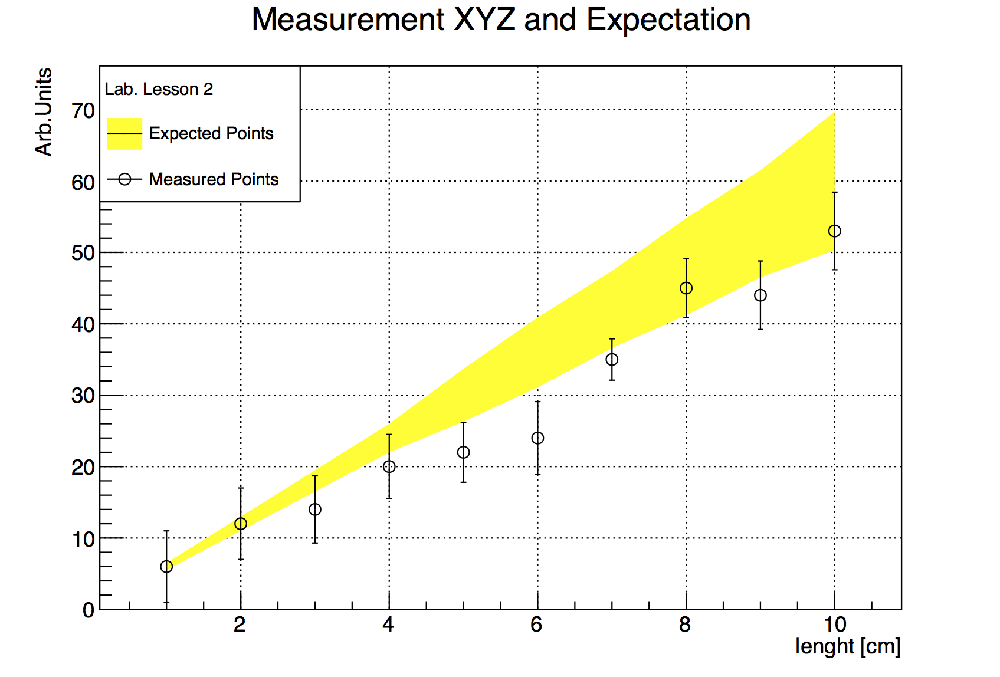

# Graphs #

In this Chapter we will learn how to exploit some of the functionalities
ROOT provides to display data exploiting the class `TGraphErrors`,
which you already got to know previously.

## Read Graph Points from File ##

The fastest way in which you can fill a graph with experimental data is
to use the constructor which reads data points and their errors from an
ASCII file (i.e. standard text) format:

``` {.cpp}
TGraphErrors(const char *filename,
const char *format="%lg %lg %lg %lg", Option_t *option="");
```

The format string can be:

-   `"%lg %lg"` read only 2 first columns into X,Y

-   `"%lg %lg %lg"` read only 3 first columns into X,Y and EY

-   `"%lg %lg %lg %lg"` read only 4 first columns into X,Y,EX,EY

This approach has the nice feature of allowing the user to reuse the
macro for many different data sets. Here is an example of an input file.
The nice graphic result shown is produced by the macro below, which
reads two such input files and uses different options to display the
data points.

```
# Measurement of Friday 26 March
# Experiment 2 Physics Lab

1   6   5
2   12  5
3   14  4.7
4   20  4.5
5   22  4.2
6   24  5.1
7   35  2.9
8   45  4.1
9   44  4.8
10  53  5.43
```
\newpage


``` {.cpp}
@ROOT_INCLUDE_FILE macros/macro2.C
```

In addition to the inspection of the plot, you can check the actual
contents of the graph with the `TGraph::Print()` method at any time,
obtaining a printout of the coordinates of data points on screen. The
macro also shows us how to print a coloured band around a graph instead
of error bars, quite useful for example to represent the errors of a
theoretical prediction.

## Polar Graphs ##

With ROOT you can profit from rather advanced plotting routines, like
the ones implemented in the `TPolarGraph`, a class to draw graphs in
polar coordinates. You can see the example macro in the following and the
resulting Figure is [4.2](#f42):

``` {.cpp .numberLines}
@ROOT_INCLUDE_FILE macros/macro3.C
```

A new element was added on line 4, the size of the canvas: it is
sometimes optically better to show plots in specific canvas sizes.

[f42]: figures/polar_graph.png "f42"
<a name="f42"></a>

![The graph of a fan obtained with ROOT.\label{f42}][f42]

## 2D Graphs ##

Under specific circumstances, it might be useful to plot some quantities
versus two variables, therefore creating a bi-dimensional graph. Of
course ROOT can help you in this task, with the `TGraph2DErrors` class.
The following macro produces a bi-dimensional graph representing a
hypothetical measurement, fits a bi-dimensional function to it and draws
it together with its x and y projections. Some points of the code will
be explained in detail. This time, the graph is populated with data
points using random numbers, introducing a new and very important
ingredient, the ROOT `TRandom3` random number generator using the
Mersenne Twister algorithm [@MersenneTwister].

``` {.cpp .numberLines}
@ROOT_INCLUDE_FILE macros/macro4.C
```

Let's go through the code, step by step to understand what is going on:

-   Line *3*: This sets the palette colour code to a much nicer one than
    the default. Comment this line to give it a try.
    [This article](https://root.cern.ch/drupal/content/rainbow-color-map)
    gives more details about colour map choice.

-   Line *7*: The instance of the random generator. You can then draw
    out of this instance random numbers distributed according to
    different probability density functions, like the Uniform one at
    lines *27-29*. See the on-line documentation to appreciate the full
    power of this ROOT feature.

-   Line *8*: You are already familiar with the `TF1` class. This is
    its two-dimensional version. At line *16* two random numbers
    distributed according to the `TF2` formula are drawn with the method
    `TF2::GetRandom2(double& a, double&b)`.

-   Line *27-29*: Fitting a 2-dimensional function just works like in
    the one-dimensional case, i.e. initialisation of parameters and
    calling of the `Fit()` method.

-   Line *34*: The *Surf1* option draws the `TF2` objects (but also
    bi-dimensional histograms) as coloured surfaces with a wire-frame on
    three-dimensional canvases. See Figure [4.3](#f43).

-   Line *35-40*: Retrieve the axis pointer and define the axis titles.

-   Line *41*: Draw the cloud of points on top of the coloured surface.

-   Line *43-49*: Here you learn how to create a canvas, partition it in
    two sub-pads and access them. It is very handy to show multiple
    plots in the same window or image.

[f43]: figures/fitted2dFunction.png "f43"
<a name="f43"></a>

![A dataset fitted with a bidimensional function visualised as a colored
surface.\label{f43}][f43]

\newpage

## Multiple graphs ##

The class `TMultigraph` allows to manipulate a set of graphs as a single entity.
It is a collection of `TGraph` (or derived) objects. When drawn, the X and Y axis
ranges are automatically computed such as all the graphs will be visible.

``` {.cpp .numberLines}
@ROOT_INCLUDE_FILE macros/multigraph.C
```
- Line *6* creates the multigraph.

- Line *9-28*: create two graphs with errors and add them in the multigraph.

- Line *30-32*: draw the multigraph. The axis limits are computed automatically
  to make sure all the graphs' points will be in range.

[f44]: figures/multigraph.png "f44"
<a name="f44"></a>

![A set of graphs grouped in a multigraph.\label{f44}][f44]

[^3] https://root.cern.ch/drupal/content/rainbow-color-map
