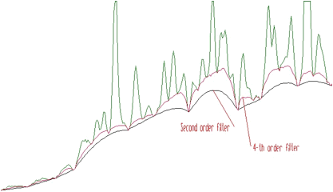
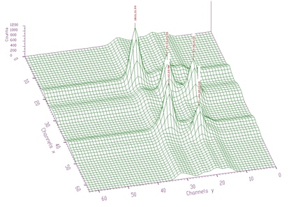
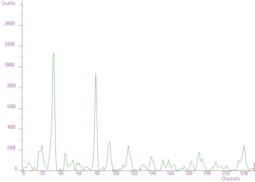
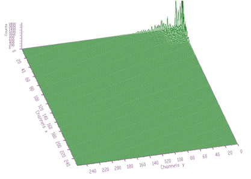
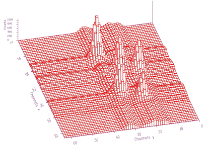

# BACKGROUND ELIMINATION

## 1-DIMENSIONAL SPECTRA

This function calculates background spectrum from the source spectrum. The
result is placed in the vector pointed by spectrum pointer. On
successful completion it returns 0. On error it returns pointer to the
string describing error.

``` {.cpp}
char *Background1(float *spectrum,
                  int size,
                  int number_of_iterations);
```

Function parameters:

-   **`spectrum`**: pointer to the vector of the source spectrum
-   **`size`**: length of spectrum
-   **`number_of_iterations`**: or width of the clipping window

The function allows to separate useless spectrum information (continuous
background) from peaks, based on Sensitive Nonlinear Iterative Peak
Clipping Algorithm. In fact, it represents the second order difference filter
(-1,2,-1). The basic algorithm is described in details in [1], [2].

$$ v_p(i)= min\left\{v_{p-1} , \frac{[v_{p-1}(i+p)+v_{p-1}(i-p)]}{2} \right\} $$

where `p` can be changed as follows:

a. from 1 up to a given parameter value `w` by incrementing it in each
iteration step by 1 - INCREASING CLIPPING WINDOW

b. from a given value `w` by decrementing it in each iteration step by
1 - DECREASING CLIPPING WINDOW

An example of the original spectrum and estimated background (INCREASING
CLIPPING WINDOW) is given in the Figure 1.1.


One can notice that on the edges of the peaks the estimated background
goes under the peaks. An alternative approach is to decrease the
clipping window from a given value to the value of one (DECREASING
CLIPPING WINDOW). Then the result obtained is given in the Figure 1.2.


The estimated background is smoother. The method does not deform the
shape of peaks.

However, sometimes the shape of the background is very complicated, and the
second order filter is insufficient. Let us illustrate such a case in
the Figure 1.3. The fourth order background estimation filter gives a better
estimate of complicated background (the clipping window `w=10`).



4-th order algorithm ignores linear as well as cubic component of the
background. In this case the filter is (1,-4,6,-4,1). In general, the
allowed values for the order of the filter are 2, 4, 6, 8. An example of
the same spectrum estimated with the clipping window `w=40` and with
filters of the orders 2, 4, 6, 8 is given in the Figure 1.4.


 Sometimes it is necessary to also include the Compton edges
into the estimate of the background. In Figure 1.5 we present the example of
the synthetic spectrum with Compton edges. The background was estimated
using the 8-th order filter with the estimation of the Compton edges and
decreasing clipping window. In the lower part of the Figure we present
the background, which was added to the synthetic spectrum. One can
observe good coincidence with the estimated background. The method of
the estimation of Compton edge is described in details in [3].


The generalized form of the algorithm is implemented in the following function.

``` {.cpp}
char *Background1General(float *spectrum,
                         int size,
                         int number_of_iterations,
                         int direction,
                         int filter_order,
                         bool compton);
```

The meaning of the parameters is as follows:

-   **`spectrum`**: pointer to the vector of the source spectrum
-   **`size`**: length of spectrum vector
-   **`number_of_iterations`**: maximal width of clipping window
-   **`direction`**:  direction of change of clipping window. Possible values:
    -   `BACK1_INCREASING_WINDOW`
    -   `BACK1_DECREASING_WINDOW`
-   **`filter_order`**: order of clipping filter. Possible values:
    -   `BACK1_ORDER2`
    -   `BACK1_ORDER4`
    -   `BACK1_ORDER6`
    -   `BACK1_ORDER8`
-   **`compton`**:  logical variable whether the estimation of Compton edge will be included. Possible values:
    -   `BACK1_EXCLUDE_COMPTON`
    -   `BACK1_INCLUDE_COMPTON`

## 2-DIMENSIONAL SPECTRA

This basic background estimation function allows to separate useless
spectrum information (2D-continuous background and coincidences of peaks
with background in both dimensions) from peaks. It calculates background
spectrum from the source spectrum. The result is placed in the array
pointed by spectrum pointer. On successful completion it returns 0. On
error it returns a pointer to the string describing error.

``` {.cpp}
char *Background2(float **spectrum,
                  int sizex,
                  int sizey,
                  int number_of_iterations);
```

Function parameters:

-   **`spectrum`**: pointer to the array of the source spectrum
-   **`sizex`**: x length of spectrum
-   **`sizey`**: y length of spectrum
-   **`number_of_iterations`**:  width of the clipping window

In Figure 1.6 we present an example of a 2-dimensional spectrum before background elimination.


Estimated background is shown in Figure 1.7. After subtraction we get pure
2-dimensional peaks.


Similarly to 1-dimensional case, we have generalized also the function
for 2-dimensional background estimation. Sometimes the widths of peaks in
both dimensions are different. As an example, we can introduce an n-gamma
2-dimensional spectra. Then it is necessary to set different widths of
clipping window in both dimensions. In Figure 1.8 we give an example of such
a spectrum.


Spectrum after background estimation (clipping window 10 for
x-direction, 20 for y-direction) and subtraction is given in Figure 1.9.


Background estimation can be carried out using the algorithm of
successive comparisons [1] or based on one-step filtering algorithm
given by formula:

$$
v_{p}(i) = min\left\{v_{p-1}(i) ,
   \frac{
         \left[\begin{array}{c}
         -v_{p-1}(i+p,j+p)+2*v_{p-1}(i+p,j)-v_{p-1}(i+p,j-p) \\
          +2*v_{p-1}(i,j+p)+2*v_{p-1}(i,j-p)  \\
         -v_{p-1}(i-p,j+p)+2*v_{p-1}(i-p,j)-v_{p-1}(i-p,j-p)
         \end{array}\right]
    }{4}
    \right\}
$$

Illustrating example is given in
the following 3 figures. In Figure 1.10 we present original (synthetic)
2-dimensional spectrum. In the Figure 1.11. we have spectrum after background
elimination using successive comparisons algorithm and in Figure 1.12 after
elimination using one-step filtering algorithm.


One can notice artificial ridges in the spectrum in Figure 1.11. In the
estimation using filtration algorithm this effect disappears. The
general function for estimation of 2-dimensional background with
rectangular ridges has the form of

``` {.cpp}
char *Background2RectangularRidges(float **spectrum,
                                   int sizex,
                                   int sizey,
                                   int number_of_iterations_x,
                                   int number_of_iterations_y,
                                   int direction,
                                   int filter_order,
                                   int filter_type);
```

This function calculates background spectrum from source spectrum. The
result is placed to the array pointed by spectrum pointer.

Function parameters:

-   **`spectrum`**: pointer to the array of the source spectrum
-   **`sizex`**: x length of spectrum
-   **`sizey`**: y length of spectrum
-   **`number_of_iterations_x_maximal`**: x width of clipping window
-   **`number_of_iterations_y_maximal`**: y width of clipping window
-   **`direction`**: direction of change of clipping window. Possible values:
    -   `BACK2_INCREASING_WINDOW`
    -   `BACK2_DECREASING_WINDOW`
-   **`filter_order`**: order of clipping filter. Possible values:
    -   `BACK2_ORDER2 BACK2_ORDER4`
    -   `BACK2_ORDER6 BACK2_ORDER8`
-   **`filter_type`**: determines the algorithm of the filtering. Possible values:
    -   `BACK2_SUCCESSIVE_FILTERING`
    -   `BACK2_ONE_STEP_FILTERING`

In what follows we describe a function to estimate a continuous
2-dimensional background together with rectangular and skew ridges. In
Figure 1.13 we present a spectrum of this type.


The goal is to remove rectangular as well as skew ridges from the
spectrum and to leave only 2-dimensional coincidence peaks. After
applying background elimination function and subtraction we get the two-dimensional peaks presented in Figure 1.14


In Figures 1.15 and 1.16 we present an experimental spectrum with skew ridges and estimated background, respectively.


The function for the estimation of background together with skew ridges
has the form of

``` {.cpp}
char *Background2SkewRidges(float **spectrum,
                            int sizex,
                            int sizey,
                            int number_of_iterations_x,
                            int number_of_iterations_y,
                            int direction,
                            int filter_order);
```

The result is placed to the array pointed by spectrum pointer.

Function parameters:

-   **`spectrum`**: pointer to the array of the source spectrum
-   **`sizex`**: x length of spectrum
-   **`sizey`**: y length of spectrum
-   **`number_of_iterations_x`**: maximal x width of clipping window
-   **`number_of_iterations_y`**: maximal y width of clipping window
-   **`direction`**: direction of change of clipping window. Possible values:
    -   `BACK2_INCREASING_WINDOW`
    -   `BACK2_DECREASING_WINDOW`
-   **`filter_order`**: order of clipping filter. Possible values:
    -   `BACK2_ORDER2`
    -   `BACK2_ORDER4`
    -   `BACK2_ORDER6`
    -   `BACK2_ORDER8`

 Next we present the function that estimates the continuous
background together with rectangular and nonlinear ridges. To
illustrate the data of such a form we present synthetic data shown in
Figure 1.17. The estimated background is given in Figure 1.18. Pure Gaussian
after subtracting the background from the original spectrum is shown in
Figure 1.19.


The function to estimate also the nonlinear ridges has the form of

``` {.cpp}
char *Background2NonlinearRidges(float **spectrum,
                                 int sizex,
                                 int sizey,
                                 int number_of_iterations_x,
                                 int number_of_iterations_y,
                                 int direction,
                                 int filter_order);
```

The result is placed to the array pointed by spectrum pointer.

Function parameters:

-   **`spectrum`**: pointer to the array of the source spectrum
-   **`sizex`**: x length of spectrum
-   **`sizey`**: y length of spectrum
-   **`number_of_iterations_x`**: maximal x width of clipping window
-   **`number_of_iterations_y`**: maximal y width of clipping window
-   **`direction`**:  direction of change of clipping window. Possible values:
    -   `BACK2_INCREASING_WINDOW`
    -   `BACK2_DECREASING_WINDOW`
-   **`filter_order`**: order of clipping filter. Possible values:
    -   `BACK2_ORDER2`
    -   `BACK2_ORDER4`
    -   `BACK2_ORDER6`
    -   `BACK2_ORDER8`

The information contained in the skew ridges and non-linear
ridges can be interesting and one may wish to separate it from the
rectangular ridges. Therefore we have also implemented two functions
allowing to estimate ridges only in the direction rectangular to x-axis
and y-axis. Let us have both rectangular and skew ridges from spectrum
given in Figure 1.13 estimated using above described function
`Background2SkewRidges` (Figure 1.20).


Now let us estimate ridges rectangular to x-axis and y-axis (Figures 1.21, 1.22)


After subtraction these data from spectrum in Figure 1.20, we get separated
skew ridge given in Figure 1.23.


The functions for estimation of 1-dimensional ridges in 2-dimensional
spectra have the forms of

``` {.cpp}
char *Background2RectangularRidgesX(float **spectrum,
                                    int sizex,
                                    int sizey,
                                    int number_of_iterations,
                                    int direction,
                                    int filter_order);
```

Function parameters:

-   **`spectrum`**: pointer to the array of the source spectrum
-   **`sizex`**: x length of spectrum
-   **`sizey`**: y length of spectrum
-   **`number_of_iterations`**: maximal x width of clipping window
-   **`direction`**: direction of change of clipping window. Possible values:
    -   `BACK2_INCREASING_WINDOW`
    -   `BACK2_DECREASING_WINDOW`
-   **`filter_order`**: order of clipping filter. Possible values:
    -   `BACK2_ORDER2`
    -   `BACK2_ORDER4`
    -   `BACK2_ORDER6`
    -   `BACK2_ORDER8`

and

``` {.cpp}
char *Background2RectangularRidgesY(float **spectrum,
                                    int sizex,
                                    int sizey,
                                    int number_of_iterations,
                                    int direction,
                                    int filter_order);
```

Function parameters:

-   **`spectrum`**: pointer to the array of source the spectrum
-   **`sizex`**: x length of spectrum
-   **`sizey`**: y length of spectrum
-   **`number_of_iterations`**: maximal width of clipping window
-   **`direction`**: direction of change of clipping window. Possible values:
    -   `BACK2_INCREASING_WINDOW`
    -   `BACK2_DECREASING_WINDOW`
-   **`filter_order`**: order of clipping filter. Possible values:
    -   `BACK2_ORDER2`
    -   `BACK2_ORDER4`
    -   `BACK2_ORDER6`
    -   `BACK2_ORDER8`

# SMOOTHING

## 1-DIMENSIONAL SPECTRA

The operation of the smoothing is based on the convolution of the
original data with the filter of the type:

(1,2,1)/4 - three points smoothing

(-3,12,17,12,-3)/35 - five points smoothing

(-2,3,6,7,6,3,-2)/21 - seven points smoothing

(-21,14,39,54,59,54,39,14,-21)/231 - nine points smoothing

(-36,9,44,69,84,89,84,69,44,9,-36)/429 - 11 points smoothing

(-11,0,9,16,21,24,25,24,21,16,9,0,-11)/143 - 13 points smoothing

(-78,-13,42,87,122,147,162,167,162,147,122,87,42,-13,-78)/1105 -15
points smoothing. The function for one-dimensional smoothing has the
form of

``` {.cpp}
char *Smooth1(float *spectrum,
              int size,
              int points);
```

This function calculates smoothed spectrum from the source spectrum. The
result is placed in the vector pointed by the spectrum pointer.

Function parameters:

-   **`spectrum`**: pointer to the vector of the source spectrum
-   **`size`**: length of spectrum
-   **`points`**: width of smoothing window. Possible values:
    -    `SMOOTH1_3POINTS`
    -    `SMOOTH1_5POINTS`
    -    `SMOOTH1_7POINTS`
    -    `SMOOTH1_9POINTS`
    -    `SMOOTH1_11POINTS`
    -    `SMOOTH1_13POINTS`
    -    `SMOOTH1_15POINTS`

An example of 1-dimensional spectra smoothing and the influence of the
filter width on the data is presented in Figure 2.1.


## 2-DIMENSIONAL SPECTRA

The smoothing of the two-dimensional data is similar to
the one-dimensional case. The width of the filter can be chosen
independently for each dimension. The form of the 2-D smoothing function
is as follows:

``` {.cpp}
char *Smooth2(float **spectrum,
              int sizex,
              int sizey,
              int pointsx,
              int pointsy);
```

This function calculates smoothed spectrum from the source spectrum. The
result is placed in the array pointed by the spectrum pointer.

Function parameters:

-   **`spectrum`**: pointer to the array of the source spectrum
-   **`sizex`**: x length of spectrum
-   **`sizey`**: y length of spectrum
-   **`pointsx, pointsy`**: width of smoothing window. Possible values:
    -   `SMOOTH2_3POINTS`
    -   `SMOOTH2_5POINTS`
    -   `SMOOTH2_7POINTS`
    -   `SMOOTH2_9POINTS`
    -   `SMOOTH2_11POINTS`
    -   `SMOOTH2_13POINTS`
    -   `SMOOTH2_15POINTS`

An example of 2-D original data and data after smoothing is given in Figures 2.2, 2.3.


# PEAK SEARCHING

## 1-DIMENSIONAL SPECTRA

 The basic function of the 1-dimensional peak searching is described in
details in [4], [5]. It allows to automatically identify the
peaks in a spectrum with the presence of the continuous background and
statistical fluctuations -- noise. The algorithm is based on smoothed
second differences that are compared to its standard deviations.
Therefore it is necessary to pass a parameter of sigma to the peak
searching function. The algorithm is selective to the peaks with a
given sigma. The form of the basic peak searching function is

```{.cpp}
Int_t Search1(const float *spectrum,
              int size,
              double sigma);
```

This function searches for peaks in the source spectrum. The number of found
peaks and their positions are written into structure pointed by
`one_dim_peak` structure pointer.

Function parameters:

-   **`source`**: pointer to the vector of the source spectrum
-   **`p`**: pointer to the `one_dim_peak` structure pointer
-   **`size`**: length of the source spectrum
-   **`sigma`**: sigma of searched peaks

The `one_dim_peak` structure has the form of

```{.cpp}
struct one_dim_peak{
   int number_of_peaks;
   double position[MAX_NUMBER_OF_PEAKS1];
 };
```

An example of simple one-dimensional spectrum with identified peaks is
given in Figure 3.1.


An example of 1-dimensional experimental spectrum with many identified
peaks is given in Figure 3.2.


However, when we have noisy data, the number of peaks can be enormous. One
such an example is given in Figure 3.3.


 Therefore it can be useful to have a possibility to set a threshold value and to consider only the peaks higher than this threshold (see Figure 3.4, only three peaks were identified, threshold=50). The value in the center of the peak (`value[i]`) minus the average value in two symmetrically positioned channels (channels `i-3*sigma`, `i+3*sigma`) must be greater than threshold.
Otherwise the peak is ignored.


An alternative approach was proposed in [6]. The algorithm generates
new invariant spectrum based on discrete Markov chains. In this spectrum
the noise is suppressed, the spectrum is smoother than the original one.
On the other hand it emphasizes peaks (depending on the averaging
window). The example of the part of original noisy spectrum and Markov
spectrum for `window=3` is given in Figure 3.5 Then the peaks can be found in
Markov spectrum using standard above-presented algorithm.


The form of the generalized peak searching function is as follows:

```{.cpp}
Int_t Search1General(float *spectrum,
                     int size,
                     float sigma,
                     int threshold,
                     bool markov,
                     int aver_window);
```

This function searches for peaks in the source spectrum. The number of found
peaks and their positions are written into the structure pointed by the
`one_dim_peak` structure pointer.

Function parameters:

-   **`spectrum`**: pointer to the vector of the source spectrum. This source spectrum is replaced by the new spectrum calculated using Markov chains method.
-   **`size`**: length of the source spectrum
-   **`sigma`**: sigma of searched peaks
-   **`threshold`**: threshold value for peaks selection
-   **`markov`**: logical variable. If it is set to `true`, then the source spectrum is first replaced by the new spectrum calculated using Markov chains method
-   **`aver_window`**: averaging window used in the calculation of Markov spectrum, applies only if the `markov` variable was set to `true`

The methods of peak searching are sensitive to the `sigma`. Usually the
`sigma` value is known beforehand. It also changes only slightly with the
energy. We have investigated as well the robustness of the proposed
algorithms to the spectrum with the peaks with `sigma` changing from 1 to
10 (see Figure 3.6).


We applied peak searching algorithm based on Markov approach. We changed
`sigma` in the interval from 1 to 10. The spectra for averaging windows 3,
5, 10 are shown in Figure 3.7.


When we applied peak searching function to the Markov spectrum averaged
with the `window=10`, we obtained correct estimate of all 10 peak
positions for `sigma=2,3,4,5,6,7,8`. It was not the case when we made the
same experiment with the original spectrum. For all sigmas some peaks
were not discovered.

## 2-DIMENSIONAL SPECTRA

 The basic function of the 2-dimensional peak searching is described in
details in [4]. It automatically identifies the peaks in a
spectrum with the presence of the continuous background, statistical
fluctuations as well as coincidences of background in one dimension and
peak in the other one-ridges. The form of the basic function of
2-dimensional peak searching is

```{.cpp}
Int_t Search2(const float **source,
              int sizex,
              int sizey,
              double sigma);
```

This function searches for peaks in the source spectrum. The number of found
peaks and their positions are written into the structure pointed by
`two_dim_peak` structure pointer.

Function parameters:

-   **`source`**: pointer to the vector of the source spectrum
-   **`sizex`**: x length of the source spectrum
-   **`sizey`**: y length of the source spectrum
-   **`sigma`**: sigma of searched peaks

An example of the two-dimensional spectrum with the identified peaks is
shown in Figure 3.8.



We have also generalized the peak searching function similarly to one-dimensional data. The generalized peak searching function for two-dimensional spectra has the form of

```{.cpp}
Int_t Search2General(float **source,
                     int sizex,
                     int sizey,
                     double sigma,
                     int threshold,
                     bool markov,
                     int aver_window);
```

This function searches for peaks in the source spectrum. The number of found
peaks and their positions are written into the structure pointed by
`two_dim_peak` structure pointer.

Function parameters:

-   **`source`**: pointer to the vector of the source spectrum
-   **`sizex`**: x length of the source spectrum
-   **`sizey`**: y length of the source spectrum
-   **`sigma`**: sigma of searched peaks
-   **`threshold`**: threshold value for peaks selection
-   **`markov`**: logical variable. If it is set to `true`, then the source spectrum is first replaced by the new spectrum calculated using Markov chains method
-   **`aver_window`** averaging window of searched peaks (applies only for the Markov method)

An example of experimental 2-dimensional spectrum is given in Figure 3.9.
The number of peaks identified by the function now is 295.


The function works even for very noisy data. In Figure 3.10 we present
synthetic 2-dimensional spectrum with 5 peaks. The method should
recognize what is the real 2-dimensional peak and what is the crossing of
two 1-dimensional ridges. The Markov spectrum with averaging window=3 is
given in Figure 3.11. One can observe that this spectrum is smoother than
the original one. After applying the general peak searching function to
the Markov spectrum with `sigma=2` and `threshold=600`, we get correctly
identified peaks.


# DECONVOLUTION - UNFOLDING

## 1-DIMENSIONAL SPECTRA

Mathematical formulation of the convolution system is:

$$ y(i) = \sum_{k=0}^{N-1}h(i-k)x(k), i=0,1,2,...,N-1 $$

where `h(i)` is the impulse response function, `x, y` are input and output
vectors, respectively, `N` is the length of `x` and `h` vectors. In matrix form we have:

$$
         \left[\begin{array}{c}
         y(0)\\
         y(1)\\
         .\\
         .\\
         .\\
         .\\
         .\\
         y(2N-2)\\
         y(2N-1)
         \end{array}\right] =
         \left[\begin{array}{cccccc}
         h(0) & 0 & 0 & 0 & ... & 0\\
         h(1) & h(0) & 0 & 0 & ... & 0\\
            . & h(1) & h(0) & 0 & ... & 0\\
         h(N-1) & . & h(1) & h(0) & ... & 0\\
            0 & h(N-1) & . & h(1) & ... & 0\\
            0 & 0 & h(N-1) & . & ... & h(0)\\
            0 & 0 & 0 & h(N-1) & ... & h(1)\\
          .   & . & . & . & ... & .\\
            0 & 0 & 0 & 0 & ... & h(N-1)
         \end{array}\right]
         \left[\begin{array}{c}
         x(0)\\
         x(1)\\
         x(2)\\
         .\\
         .\\
         y(N-1)
         \end{array}\right]
$$

Let us assume that we know the response and the output vector (spectrum)
of the above given system. The deconvolution represents solution of the
overdetermined system of linear equations, i.e., the calculation of the
vector `x`.

The goal of the deconvolution methods is to improve the
resolution in the spectrum and to decompose multiplets. From
mathematical point of view the operation of deconvolution is extremely
critical as well as time consuming. From all the studied methods, the Gold deconvolution (decomposition) proved to work best. It is suitable to process positive definite data (e.g., histograms). The method is described in details in [7], [8].

## Gold deconvolution algorithm

This algorithm proved to work best, other methods (Fourier, VanCittert etc.) oscillate.

$$ y = Hx $$
$$ H^T=H^THx $$
$$ y^{'} = H^{'}x $$
$$x_{i}^{(k+1)}=\frac{y_{i}^{'}}{\sum_{m=0}^{N-1}H_{im}^{'}x_{m}^{(k)}}x_{i}^{(k)}, i=0,1,...,N-1, $$
where:
$$ k=1,2,3,...,I $$
$$ x^{(0)} = [1,1,...,1]^T $$

The basic function has the form of

```{.cpp}
char *Deconvolution1(float *source,
                     const float *resp,
                     int size,
                     int number_of_iterations);
```


This function calculates deconvolution from the source spectrum according to the response spectrum.

Function parameters:

-   **`source`**: pointer to the vector of the source spectrum
-   **`resp`**: pointer to the vector of the response spectrum
-   **`size`**: length of source and the response spectra
-   **`number_of_iterations`**: for details see [8]

As an illustration of the method, let us introduce a small example. In
Figure 4.1 we present original 1-dimensional spectrum. It contains
multiplets that cannot be directly analyzed. The response function (one
peak) is given in Figure 4.2. We assume the same response function (not
changing the shape) along the entire energy scale. So the response
matrix is composed of mutually shifted response functions by one
channel, however of the same shape.




The result after deconvolution is given in Figure 4.3. It substantially
improves the resolution in the spectrum.


We have developed a new high resolution deconvolution algorithm. We have
observed that the Gold deconvolution converges to its stable state
(solution). It is useless to increase the number of iterations, the
result obtained does not change. To continue decreasing the width of
peaks, we have found that when the solution reaches its stable state, it
is necessary to stop iterations, then to change the vector in a way and
repeat again the Gold deconvolution. We have found that in order to change the
particular solution we need to apply a non-linear boosting function to it.
The power function proved to give the best results. At the beginning the
function calculates exact solution of the Toeplitz system of linear
equations.

$$ x^{(0)} = [x_e^2(0),x_e^2(1),...,x_e^2(N-1),]^T$$
where
$$ x_e=H^{'-1}y^{'}$$

Then it applies the Gold deconvolution algorithm to the solution and
carries out preset number of iterations. Then the power function with
the exponent equal to the boosting coefficient is applied to the
deconvolved data. These data are then used as initial estimate of the
solution of linear system of equations and again the Gold algorithm is
employed. The whole procedure is repeated `number_of_repetitions` times.

The form of the high-resolution deconvolution function is

```{.cpp}
char *Deconvolution1HighResolution(float *source,
                                   const float *resp,
                                   int size,
                                   int number_of_iterations,
                                   int number_of_repetitions,
                                   double boost);
```

This function calculates deconvolution from the source spectrum according
to the response spectrum.

The result is placed in the vector pointed by the source pointer.

Function parameters:

-   **`source`**: pointer to the vector of the source spectrum
-   **`resp`**: pointer to the vector of the response spectrum
-   **`size`**: length of source and the response spectra
-   **`number_of_iterations`**: for details we refer to manual
-   **`number_of_repetitions`**: for details we refer to manual
-   **`boost`**: boosting factor, for details we refer to manual

The result obtained using the data from Figures 4.1, 4.2 and applying the
high resolution deconvolution is given in Figure 4.4. It decomposes the
peaks even more (practically to 1, 2 channels).


Another example of synthetic data is given in Figure 4.5. We have
positioned the two peaks very close to each other (2 channels). The
method of high resolution deconvolution has decomposed these peaks
practically to one channel. The original data are shown as polyline, the
data after deconvolution as bars. The numbers at the bars denote the
heights of bars and the numbers in parenthesis the original area of
peaks. The area of original peaks is concentrated into one channel.


Up to now we assumed that the shape of the response is not changing.
However, the method of Gold decomposition can be utilized also for the
decomposition of input data (unfolding) with completely different
responses. The form of the unfolding function is as follows:

```{.cpp}
char *Deconvolution1Unfolding(float *source,
                              const float **resp,
                              int sizex,
                              int sizey,
                              int number_of_iterations);
```

This function unfolds the source spectrum according to response matrix
columns. The result is placed in the vector pointed by the source
pointer.

Function parameters:

-   **`source`**: pointer to the vector of the source spectrum
-   **`resp`**: pointer to the matrix of the response spectra
-   **`sizex`**: length of source spectrum and # of rows of response matrix
-   **`sizey`**: # of columns of response matrix
-   **`number_of_iterations`**

Note that `sizex` must be equal to or greater than `sizey`. After decomposition, the resulting channels are written back to the first `sizey` channels of the source spectrum.

An example of the response matrix composed of the responses of
different chemical elements is given in Figure 4.6.


The original spectrum before unfolding is given in Figure 4.7. The obtained
coefficients after unfolding, i.e., the contents of the responses in the
original spectrum, are presented in the Figure 4.8.


Another example where we have used the unfolding method is the
decomposition of continuum of gamma-ray spectra. Using simulation and
interpolation techniques, we have synthesized the response matrix (size
`3400x3400` channels) of Gammasphere spectrometer (Figure 4.9). Its details are
presented in Figure 4.10. The original spectrum of Co^56 before and after
continuum decomposition are presented in Figures 4.11, 4.12, respectively.


## 2-DIMENSIONAL SPECTRA

We have extended the method of Gold deconvolution also for
2-dimensional data. Again, the goal of the deconvolution methods is to
improve the resolution in the spectrum and to decompose multiplets. The method of optimized 2-dimensional deconvolution is described in details in [8].

Mathematical formulation of 2-dimensional convolution system is as
follows:

$$ y(i_1,i_2) = \sum_{k_1=0}^{N_1-1}\sum_{k_2=0}^{N_2-1}h(i_1-k_1,i_2-k_2)x(k_1,k_2), i_1=0,1,2,...,N_1-1, i_2=0,1,2,...,N_2-1 $$

Assuming we know the output
spectrum `y` and the response spectrum `h`, the task is to calculate the matrix `x`.

The basic function has the form of

``` {.cpp}
char *Deconvolution2(float **source,
                     const float **resp,
                     int sizex,
                     int sizey,
                     int niter);
```

This function calculates deconvolution from the source spectrum according to
the response spectrum. The result is placed in the matrix pointed by the source
pointer.

Function parameters:

-   **`source`**: pointer to the matrix of the source spectrum
-   **`resp`**: pointer to the matrix of the response spectrum
-   **`sizex`**: x length of source and the response spectra
-   **`sizey`**: y length of source and the response spectra
-   **`number_of_iterations`**: see [8] for details

The example of 2-dimensional spectrum before deconvolution is presented
in Figure 4.13. In the process of deconvolution we have used the response
matrix (one peak shifted to the beginning of the coordinate system)
given in Figure 4.14. Employing the Gold deconvolution algorithm implemented
in the `decon2` function, we get the result shown in Figure 4.15. One can
notice that the peaks became narrower, thus improving the resolution in
the spectrum.


Similarly to 1-dimensional case, we have developed
high-resolution 2-dimensional deconvolution. From the beginning the
exact solution of the cyclic convolution 2-dimensional system is
calculated. Then we apply the repeated deconvolution with boosting in
the same way like in 1-dimensional case. The form of the
high-resolution 2-dimensional deconvolution function is:

``` {.cpp}
char *Deconvolution2HighResolution(float **source,
                                   const float **resp,
                                   int sizex,
                                   int sizey,
                                   int number_of_iterations,
                                   int number_of_repetitions,
                                   double boost);
```

This function calculates deconvolution from source spectrum according to response spectrum. The result is placed in the matrix pointed by the source pointer.

Function parameters:

-   **`source`**: pointer to the matrix of the source spectrum
-   **`resp`**: pointer to the matrix of the response spectrum
-   **`sizex`**: x length of source and the response spectra
-   **`sizey`**: y length of source and the response spectra
-   **`number_of_iterations`**
-   **`number_of_repetitions`**
-   **`boost`**: boosting factor

When we apply this function to the data from Figure 4.13 using the response
matrix given in Figure 4.14, we get the result shown in Figure 4.16. It is
obvious that the high-resolution deconvolution decomposes the input
data even more than the original Gold deconvolution.


# FITTING

A lot of algorithms have been developed (Gauss-Newton, Levenber-Marquart
conjugate gradients, etc.) and more or less successfully implemented
into programs for analysis of complex spectra. They are based on matrix
inversion that can impose appreciable convergence difficulties mainly
for large number of fitted parameters. Peaks can be fitted separately,
each peak (or multiplets) in a region or together all peaks in a
spectrum. To fit separately each peak one needs to determine the fitted
region. However it can happen that the regions of neighboring peaks are
overlapping (mainly in 2-dimensional spectra). Then the results of
fitting are very poor. On the other hand, when fitting together all the
peaks found in a spectrum, one needs to have a method that is stable
(i.e., converges) and fast enough to carry out the fitting in a reasonable time. The
gradient methods based on the inversion of large matrices are not
applicable because of two reasons:

a. calculation of inverse matrix is extremely time consuming;

b. due to accumulation of truncation and rounding-off errors, the
result can become worthless.

We have implemented two kinds of fitting functions. The first approach
is based on the algorithm without matrix inversion [9] - awmi algorithm.
It allows to fit large blocks of data and large number of parameters.

The other one is based on a calculation of the system of linear equations
using Stiefel-Hestens method [10]. It converges faster than the awmi
algorithm, however, it is not suitable to fit large number of parameters.

## 1-DIMENSIONAL SPECTRA

The quantity to be minimized in the fitting procedure for one-dimensional spectrum is defined as

$$ \chi^2 = \frac{1}{N-M}\sum_{i=1}^{N}\frac{[y_i-f(i,a)]^2}{y_i} $$

where `i` is the channel in the fitted spectrum, `N` is the number of
channels in the fitting subregion, `M` is the number of free parameters,
`y_i` is the content of the `i`-th channel, `a` is a vector of the
parameters being fitted and `f(i,a)` is a fitting or peak shape function.

Instead of the weighting coefficient `y_i` in the denominator of the formula
given above, one can use also the value of `f(i,a)`. It is suitable for
data with poor statistics [11], [12].

The third statistic to be optimized, which is implemented in the fitting
functions, is the Maximum Likelihood Method. It is up to the user
to select a suitable statistic.

After differentiating chi^2 we obtain the following `M` simultaneous
equations:

$$ \sum_{i=1}^{N}
\frac{y_i-f(i,a^{(t)})}{y_i}
\frac{\partial f(i,a^t)}{\partial a_k}=
\sum_{j=1}^{M}\sum_{i=1}^{N}
\frac{\partial f(i,a^{(t)})}{\partial a_j}
\frac{\partial f(i,a^{(t)})}{\partial a_k}
\Delta a_j^{(t)} $$

- in gamma-ray spectra we have to fit together tens, hundreds of peaks
simultaneously that sometimes represent thousands of parameters.

- the calculation of the inversion matrix of such a size is
practically impossible.

- the awmi method is based on the assumption that the off-diagonal
terms in the matrix A are equal to zero.

$$
\Delta a_{k}^{(t+1)} = \alpha^{(t)}
\frac{
\sum_{i=1}^{N} \frac{e_{i}^{(t)}}{y_i}\frac{\partial f(i,a^{(t)})}{\partial a_k}
}{
\sum_{i=1}^{N} \left[ \frac{\partial f(i,a^{(t)})}{\partial a_k}\right]^2\frac{1}{y_i}
}
$$

where the error in the channel `i` is $e_{i}^{(t)} = y_i-f(i,a^{(t)}); k=1,2,...,M$ and
$\alpha^{(t)}=1$ if the process is convergent or $\alpha^{(t)}=0.5 \alpha^{(t-1)}$
if it is divergent. Another possibility is to optimize this coefficient.

The error of `k`-th parameter estimate is

$$
\Delta a_k^{(e)}=
\sqrt{\frac
{\sum_{i=1}^{N}\frac{e_i^2}{y_i}}
{\sum_{i=1}^{N} \left[ \frac{\partial f(i,a^{(t)})}{\partial a_k}\right]^2\frac{1}{y_i}}
}
$$

Algorithm with higher powers `w=1,2,3...`:

$$
\Delta a_{k,w}^{(t+1)}=
\alpha^{(t)}
\frac
{\sum_{i=1}^{N} \frac{e_i}{y_i}\left[ \frac{\partial f(i,a^{(t)})}{\partial a_k}\right]^{2w-1}}
{\sum_{i=1}^{N} \left[ \frac{\partial f(i,a^{(t)})}{\partial a_k}\right]^{2w}\frac{1}{y_i}}
$$

We have implemented the non-symmetrical semi-empirical peak shape function. It contains the symmetrical Gaussian as well as non-symmetrical terms:

$$
f(i,a) =
\sum_{i=1}^{M} A(j)
\left\{
exp\left[\frac{-(i-p(j))^2}{2\sigma^2}\right]
+\frac{1}{2}T.exp\left[\frac{(i-p(j))}{B\sigma}\right]
.erfc\left[\frac{(i-p(j))}{\sigma}+\frac{1}{2B}\right]
+\frac{1}{2}S.erfc\left[\frac{(i-p(j))}{\sigma}\right]
\right\}
$$


where `T, S` are relative amplitudes and `B` is a slope.

Detailed description of the algorithm is given in [13].

The fitting function implementing the algorithm without matrix inversion
has the form of

``` {.cpp}
char* Fit1Awmi(float *source,
               TSpectrumOneDimFit *p,
               int size);
```

This function fits the source spectrum. The calling program should fill
in the input parameters of the `one_dim_fit` structure. The fitted parameters
are written into structure pointed by `one_dim_fit` structure pointer
and fitted data are written into source spectrum.

Function parameters:

-   **`source`**: pointer to the vector of the source spectrum
-   **`p`**: pointer to the `one_dim_fit` structure pointer
-   **`size`**: length of the source spectrum

The `one_dim_fit` structure has the form of

``` {.cpp}
class TSpectrumOneDimFit{

public:

   int number_of_peaks;      // input parameter, should be >0
   int number_of_iterations; // input parameter, should be >0
   int xmin;                 // first fitted channel
   int xmax;                 // last fitted channel
   double alpha;             // convergence coefficient, input parameter, it should be a positive number and <=1
   double chi;               // here the function returns the resulting chi-square
   int statistic_type;       // type of statistics, possible values are:
                             // FIT1_OPTIM_CHI_COUNTS (chi square statistics with counts as weighting coefficients),
                             // FIT1_OPTIM_CHI_FUNC_VALUES (chi square statistics with function values as weighting coefficients)
                             // FIT1_OPTIM_MAX_LIKELIHOOD
   int alpha_optim;          // optimization of convergence coefficients, possible values are:
                             // FIT1_ALPHA_HALVING,
                             // FIT1_ALPHA_OPTIMAL
   int power;                // possible values FIT1_FIT_POWER2,4,6,8,10,12
   int fit_taylor;           // order of Taylor expansion, possible values
                             // FIT1_TAYLOR_ORDER_FIRST, FIT1_TAYLOR_ORDER_SECOND

   double position_init[MAX_NUMBER_OF_PEAKS1]; // initial values of peaks positions, input parameters
   double position_calc[MAX_NUMBER_OF_PEAKS1]; // calculated values of fitted positions, output parameters
   double position_err[MAX_NUMBER_OF_PEAKS1];  // position errors
   bool fix_position[MAX_NUMBER_OF_PEAKS1];    // logical vector which allows to fix appropriate positions (not fit). However they are present in the estimated functional
   double amp_init[MAX_NUMBER_OF_PEAKS1];      // initial values of peaks amplitudes, input parameters
   double amp_calc[MAX_NUMBER_OF_PEAKS1];      // calculated values of fitted amplitudes, output parameters
   double amp_err[MAX_NUMBER_OF_PEAKS1];       // amplitude errors
   bool fix_amp[MAX_NUMBER_OF_PEAKS1]i;        // logical vector, which allows to fix appropriate amplitudes (not fit). However they are present in the estimated functional
   double area[MAX_NUMBER_OF_PEAKS1];          // calculated areas of peaks
   double area_err[MAX_NUMBER_OF_PEAKS1];      // errors of peak areas
   double sigma_init; // sigma parameter, see peak shape function
   double sigma_calc;
   double sigma_err;
   bool fix_sigma;
   double t_init     // t parameter, see peak shape function
   double t_calc;
   double t_err;
   bool fix_t;
   double b_init     // b parameter, see peak shape function
   double b_calc;
   double b_err;
   bool fix_b;
   double s_init;    // s parameter, see peak shape function
   double s_calc;
   double s_err;
   bool fix_s;
   double a0_init;   // background is estimated as a0+a1*x+a2*x*x
   double a0_calc;
   double a0_err;
   bool fix_a0;
   double a1_init;
   double a1_calc;
   double a1_err;
   bool fix_a1;
   double a2_init;
   double a2_calc;
   double a2_err;
   bool fix_a2;
 };
```

As an example we present a simple 1-dimensional synthetic spectrum with 5
peaks. The fit (obtained using above-given awmi fitting function) is given
in Figure 5.1. The chi-square achieved in this fit was 0.76873. The input
value of the fit (positions of peaks and their amplitudes) were
estimated using peak searching function.


Let us go to a more complicated fit with a lot of overlapping peaks as in Figure 5.2.
The initial positions of peaks were determined from original data, using
peak searching function. The fit is not very good, as there are some
peaks missing.


However, in order to analyze the spectrum, we can proceed in a completely different way employing the sophisticated functions of background elimination and deconvolution. First, let us remove background from the original raw
data. We get spectrum given in Figure 5.3.


Then we can apply the Gold deconvolution function to these data. We
obtain the result presented in Figure 5.4.


Using peaks searching method, looking just for local maxima, (`sigma=0`)
with appropriate threshold (`threshold=50`), we can estimate initial positions of peaks for the fitting function. After the fit of the original experimental
spectrum (with background), we obtain the result shown in Figure 5.5. Now
the fitted function corresponds much better to the experimental values.


We have also implemented the fitting function with matrix inversion
based on Stiefel-Hestens method of the solution of the system of linear
equations. The form of the function is as follows:

```{.cpp}
char *Fit1Stiefel(float *source,
                  TSpectrumOneDimFit* p,
                  int size);
```

This function fits the source spectrum. The calling program should fill
in the input parameters of the `one_dim_fit` structure. The fitted parameters
are written into structure pointed by `one_dim_fit` structure pointer
and fitted data are written into source spectrum.

Function parameters:

-   **`source`**: pointer to the vector of the source spectrum
-   **`p`**: pointer to the `one_dim_fit` structure pointer
-   **`size`**: length of the source spectrum

The structure `one_dim_fit` is the same as in awmi function. The
parameters power, `fit_taylor`, are not applicable for this function.

The results for small number of fitted parameters are the same as with
awmi function. However, it converges faster. The example for data given
in Figure 5.1 is given in the following table:

| # of iterations  | Chi awmi |  Chi-Stiefel |
| ---------------- | ---------| ------------ |
| 1                | 924      | 89.042       |
| 5                | 773.15   | 0.96242      |
| 10               | 38.13    | 0.77041      |
| 50               | 0.90293  | 0.76873      |
| 100              | 0.76886  | 0.76873      |
| 500              | 0.76873  | 0.76873      |


## 2-DIMENSIONAL SPECTRA

It is straightforward that for two-dimensional spectra one can write

$$
\Delta a_k^{(t+1)}=\alpha^{(t)}
\frac
{\sum_{i_1=1}^{N_1}\sum_{i_2=1}^{N_2}\frac{e_{i_1,i_2}^{(t)}}{y_{i_1,i_2}}
\frac{\partial f(i_1,i_2,a^{(t)})}{\partial a_k}}
{\sum_{i_1=1}^{N_1}\sum_{i_2=1}^{N_2}
\left[\frac{\partial f(i_1,i_2,a^{(t)})}{\partial a_k} \right]^2
\frac{1}{y_{i_1,i_2}}}
$$

In a similar way, for two-dimensional peaks we have chosen the peak shape
function of the following form:

$$
f(i_1,i_2,a) = \sum_{j=1}^{M}\left\{
\begin{array}{l}
A_{xy}(j) exp\left\{-\frac{1}{2(1-\rho^2)}\left[
\frac{(i_1-p_x(j))^2}{\sigma_x^2}
-\frac{2\rho(i_1-p_x(j))(i_2-p_y(j))}{\sigma_x\sigma_y}
+\frac{(i_2-p_y(j))^2}{\sigma_y^2}
\right]\right\} \\
+A_x(j) exp\left[-\frac{(i_1-p_{x_1}(j))^2}{2\sigma_x^2} \right]
+A_y(j) exp\left[-\frac{(i_2-p_{y_1}(j))^2}{2\sigma_y^2} \right]
\end{array}
\right\}+b_0+b_1i_1+b_2i_2
$$

The meaning of the parameters is similar to 1-dimensional case. Again,
all the details can be found in [13].

The fitting function implementing the algorithm without matrix inversion
for 2-dimensional data has the form of

```{.cpp}
char* Fit2Awmi(float **source,
               TSpectrumTwoDimFit* p,
               int sizex,
               int sizey);
```

This function fits the source spectrum. The calling program should
fill in the input parameters of the `two_dim_fit` structure. The fitted
parameters are written into the structure pointed by `two_dim_fit` structure
pointer and fitted data are written back into the source spectrum.

Function parameters:

-   **`source`**: pointer to the matrix of the source spectrum
-   **`p`**: pointer to the `two_dim_fit` structure pointer, see manual
-   **`sizex`**: length x of the source spectrum
-   **`sizey`**: length y of the source spectrum

The `two_dim_fit` structure has the form of

``` {.cpp}
class TSpectrumTwoDimFit{

public:

   int number_of_peaks;      // input parameter, should be>0
   int number_of_iterations; // input parameter, should be >0
   int xmin;                 // first fitted channel in x direction
   int xmax;                 // last fitted channel in x direction
   int ymin;                 // first fitted channel in y direction
   int ymax;                 // last fitted channel in y direction
   double alpha;             // convergence coefficient, input parameter, it should be a positive number and <=1
   double chi;               // here the function returns resulting chi square
   int statistic_type;       // type of statistics, possible values are:
                             // FIT2_OPTIM_CHI_COUNTS (chi square statistics with counts as weighting coefficients),
                             // FIT2_OPTIM_CHI_FUNC_VALUES (chi square statistics with function values as weighting coefficients),
                             // FIT2_OPTIM_MAX_LIKELIHOOD
   int alpha_optim;          // optimization of convergence coefficients, possible values are:
                             // FIT2_ALPHA_HALVING, FIT2_ALPHA_OPTIMAL
   int power;                // possible values are: FIT21_FIT_POWER2,4,6,8,10,12
   int fit_taylor;           // order of Taylor expansion, possible values are:
                             // FIT2_TAYLOR_ORDER_FIRST,
                             // FIT2_TAYLOR_ORDER_SECOND
   double position_init_x[MAX_NUMBER_OF_PEAKS2];  // initial values of x positions of 2D peaks, input parameters
   double position_calc_x[MAX_NUMBER_OF_PEAKS2];  // calculated values  of fitted x positions of 2D peaks, output parameters
   double position_err_x[MAX_NUMBER_OF_PEAKS2];   // x position errors of 2D peaks
   bool fix_position_x[MAX_NUMBER_OF_PEAKS2];     // logical vector which allows to fix the appropriate x positions of 2D peaks (not fit). However, they are present in the estimated functional
   double position_init_y[MAX_NUMBER_OF_PEAKS2];  // initial values of y positions of 2D peaks, input parameters
   double position_calc_y[MAX_NUMBER_OF_PEAKS2];  // calculated values of fitted y positions of 2D peaks, output parameters
   double position_err_y[MAX_NUMBER_OF_PEAKS2];   // y position errors of 2D peaks
   bool fix_position_y[MAX_NUMBER_OF_PEAKS2];     // logical vector which allows to fix the appropriate y positions of 2D peaks (not fit). However, they are present in the estimated functional
   double position_init_x1[MAX_NUMBER_OF_PEAKS2]; // initial values of x  positions of 1D ridges, input parameters
   double position_calc_x1[MAX_NUMBER_OF_PEAKS2]; // calculated values of fitted x positions of 1D ridges, output parameters
   double position_err_x1[MAX_NUMBER_OF_PEAKS2];  // x position errors of 1D ridges
   bool fix_position_x1[MAX_NUMBER_OF_PEAKS2];    // logical vector which allows to fix appropriate x positions of 1D ridges (not fit). However, they are present in the estimated functional
   double position_init_y1[MAX_NUMBER_OF_PEAKS2]; // initial values of y positions of 1D ridges, input parameters
   double position_calc_y1[MAX_NUMBER_OF_PEAKS2]; // calculated values of fitted y positions of 1D ridges, output parameters
   double position_err_y1[MAX_NUMBER_OF_PEAKS2];  // y position errors of 1D ridges
   bool fix_position_y1[MAX_NUMBER_OF_PEAKS2];    // logical vector which allows to fix the appropriate y positions of 1D ridges (not fit). However, they are present in the estimated functional
   double amp_init[MAX_NUMBER_OF_PEAKS2];         // initial values of 2D peaks amplitudes, input parameters
   double amp_calc[MAX_NUMBER_OF_PEAKS2];         // calculated values of fitted amplitudes of 2D peaks, output parameters
   double amp_err[MAX_NUMBER_OF_PEAKS2];          // amplitude errors of 2D peaks
   bool fix_amp[MAX_NUMBER_OF_PEAKS2];            // logical vector which allows to fix appropriate amplitudes of 2D peaks (not fit). However, they are present in the estimated functional
   double amp_init_x1[MAX_NUMBER_OF_PEAKS2];      // initial values of 1D ridges amplitudes, input parameters
   double amp_calc_x1[MAX_NUMBER_OF_PEAKS2];      // calculated values of fitted amplitudes of 1D ridges, output parameters
   double amp_err_x1[MAX_NUMBER_OF_PEAKS2];       // amplitude errors of 1D ridges
   bool fix_amp_x1[MAX_NUMBER_OF_PEAKS2];         // logical vector which allows to fix the appropriate amplitudes of 1D ridges (not fit). However, they are present in the estimated functional
   double amp_init_y1[MAX_NUMBER_OF_PEAKS2];      // initial values of 1D ridges amplitudes, input parameters
   double amp_calc_y1[MAX_NUMBER_OF_PEAKS2];      // calculated values of fitted amplitudes of 1D ridges, output parameters
   double amp_err_y1[MAX_NUMBER_OF_PEAKS2];       // amplitude errors of 1D ridges
   bool fix_amp_y1[MAX_NUMBER_OF_PEAKS2];         // logical vector which allows to fix the appropriate amplitudes of 1D ridges (not fit). However, they are present in the estimated functional
   double volume[MAX_NUMBER_OF_PEAKS1];           // calculated volumes of peaks
   double volume_err[MAX_NUMBER_OF_PEAKS1];       // errors of peak volumes
   double sigma_init_x;                           // sigma x parameter
   double sigma_calc_x;
   double sigma_err_x;
   bool fix_sigma_x;
   double sigma_init_y;                           // sigma y parameter
   double sigma_calc_y;
   double sigma_err_y;
   bool fix_sigma_y;
   double ro_init;                                // correlation coefficient
   double ro_calc;
   double ro_err;
   bool fix_ro;
   double txy_init;                               // t parameter for 2D peaks
   double txy_calc;
   double txy_err;
   bool fix_txy;
   double sxy_init;                               // s parameter for 2D peaks
   double sxy_calc;
   double sxy_err;
   bool fix_sxy;
   double tx_init;                                // t parameter for 1D ridges (x direction)
   double tx_calc;
   double tx_err;
   bool fix_tx;
   double ty_init;                                // t parameter for 1D ridges (y direction)
   double ty_calc;
   double ty_err;
   bool fix_ty;
   double sx_init;                                // s parameter for 1D ridges (x direction)
   double sx_calc;
   double sx_err;
   bool fix_sx;
   double sy_init;                                // s parameter for 1D ridges (y direction)
   double sy_calc;
   double sy_err;
   bool fix_sy;
   double bx_init;                                // b parameter for 1D ridges (x direction)
   double bx_calc;
   double bx_err;
   bool fix_bx;
   double by_init;                                // b parameter for 1D ridges (y direction)
   double by_calc;
   double by_err;
   bool fix_by;
   double a0_init;                                // background is estimated as a0+ax*x+ay*y
   double a0_calc;
   double a0_err;
   bool fix_a0;
   double ax_init;
   double ax_calc;
   double ax_err;
   bool fix_ax;
   double ay_init;
   double ay_calc;
   double ay_err;
   bool fix_ay;
};
```

The example of the original spectrum and the fitted spectrum is given in
Figures 5.6 and 5.7, respectively. We have fitted 5 peaks. Each peak was
represented by 7 parameters, which together with `sigmax`, `sigmay` and `b0`
resulted in 38 parameters. The chi-square after 1000 iterations was
0.6571.


The awmi algorithm can also be applied to large blocks of data and large
number of peaks. In the next example we present spectrum with identified
295 peaks. Each peak is represented by 7 parameters, which together with
`sigmax`, `y` and `b0` resulted in 2068 fitted parameters. The original
spectrum and fitted function are given in Figures 5.8 and 5.9, respectively.
The obtained chi-square was 0.76732.


We have implemented the fitting function with matrix inversion based on
Stiefel-Hestens method of the solution of the system of linear equations
also for 2-dimensional data. The form of the function is as follows

```{.cpp}
char* Fit2Stiefel(float **source,
                  TSpectrumTwoDimFit* p,
                  int sizex,
                  int sizey);
```

This function fits the source spectrum. The calling program should
fill in the input parameters of the `two_dim_fit structure`. The fitted
parameters are written into structure pointed by `two_dim_fit` structure
pointer and fitted data are written back into the source spectrum.

Function parameters:

-   **`source`**: pointer to the matrix of the source spectrum
-   **`p`**: pointer to the `two_dim_fit` structure pointer, see manual
-   **`sizex`**: length x of the source spectrum
-   **`sizey`**: length y of the source spectrum

The structure `two_dim_fit` is the same as in the awmi function. The
parameters power, `fit_taylor` are not applicable for this function

The results for small number of fitted parameters are the same as with
awmi function. However, it converges faster. The example for data given
in Figure 5.6 (38 parameters) is presented in the following table:

| # of iterations  | Chi awmi |  Chi-Stiefel |
| ---------------- | ---------| ------------ |
| 1                | 24.989   | 10.415       |
| 5                | 20.546   | 1.0553       |
| 10               | 6.256    | 0.84383      |
| 50               | 1.0985   | 0.64297      |
| 100              | 0.6571   | 0.64297      |
| 500              | 0.65194  | 0.64297      |


Again, Stiefel-Hestens method converges faster. However, its calculation
is for this number of parameters takes approximately 3 times longer. For
larger number of parameters the time needed to calculate the inversion
grows with the cube of the number of fitted parameters. For example, the
fit of large number of parameters (2068) for data in Figure 5.8 using awmi
algorithm took about 12 hours (using 450 MHz PC). The calculation
using matrix inversion method is not realizable in any reasonable time.

# TRANSFORMS

## 1-DIMENSIONAL SPECTRA

Orthogonal transforms can be successfully used for the
processing of nuclear spectra. They can be used to remove high
frequency noise, to increase signal-to-background ratio as well as to
enhance low intensity components [14]. We have implemented also the
function for the calculation of the commonly used orthogonal transforms:

-   Haar
-   Walsh
-   Cos
-   Sin
-   Fourier
-   Hartley

Between these transform one can define so called generalized mixed
transforms that are also implemented in the transform function:

-   Fourier-Haar
-   Fourier-Walsh
-   Walsh-Haar
-   Cos-Walsh
-   Cos-Haar
-   Sin-Walsh
-   Sin-Haar

The suitability of the application of appropriate transform depends on
the character of the data, i.e., on the shape of dominant components
contained in the data. The form of the transform function is as follows:

```{.cpp}
char *Transform1(const float *source,
                 float *dest,
                 int size,
                 int type,
                 int direction,
                 int degree);
```

This function transforms the source spectrum. The calling program
should fill in the input parameters. Transformed data are written into the dest spectrum.

Function parameters:

-   **`source`**: pointer to the vector of the source spectrum, its length should be equal to the `size` parameter except for inverse FOURIER, FOUR-WALSH, FOUR-HAAR transform. These need 2*`size` length to supply real and imaginary coefficients
-   **`dest`**: pointer to the vector of the dest data, its length should be equal to the size parameter except for direct FOURIER, FOUR-WALSh, FOUR-HAAR. These need 2*`size` length to store real and imaginary coefficients
-   **`size`**: basic length of the source and dest spectra
-   **`type`**: type of transform
    -   `TRANSFORM1_HAAR`
    -   `TRANSFORM1_WALSH`
    -   `TRANSFORM1_COS`
    -   `TRANSFORM1_SIN`
    -   `TRANSFORM1_FOURIER`
    -   `TRANSFORM1_HARTLEY`
    -   `TRANSFORM1_FOURIER_WALSH`
    -   `TRANSFORM1_FOURIER_HAAR`
    -   `TRANSFORM1_WALSH_HAAR`
    -   `TRANSFORM1_COS_WALSH`
    -   `TRANSFORM1_COS_HAAR`
    -   `TRANSFORM1_SIN_WALSH`
    -   `TRANSFORM1_SIN_HAAR`
-   **`direction`**: transform direction (forward, inverse)
    -   `TRANSFORM1_FORWARD`
    -   `TRANSFORM1_INVERSE`
-   **`degree`**: applies only for mixed transforms


Let us illustrate the applications of the transform using an example. In Figure 6.1 we have spectrum with many peaks, complicated background and high level of noise.


In Figures 6.2, 6.3, 6.4 we present this spectrum transformed using Haar,
Walsh and Cosine transforms, respectively.


Haar transforms (Figure 6.2) creates clusters of data. These coefficients
can be analyzed and then filtered, enhanced, etc. On the other hand, the Walsh
transform (Figure 6.3) concentrates the dominant components near zero of
the coordinate system. It is more suitable to process data of a
rectangular shape (e.g., in the field of digital signal processing).
Finally, Cosine transform concentrates in the best way the transform
coefficients to the beginning of the coordinate system. From the point
of view of the variance distribution, it is sometimes called suboptimal.
One can notice that approximately one half of the coefficients are
negligible. This fact can be used to the compression purposes (in
two- or more dimensional data), filtering (smoothing), etc.

We have implemented several application functions exploiting
the properties of the orthogonal transforms. Let us start with zonal
filtration function. It has the following form:

```{.cpp}
char *Filter1Zonal(const float *source,
                   float *dest,
                   int size,
                   int type,
                   int degree,
                   int xmin,
                   int xmax,
                   float filter_coeff);
```

This function transforms the source spectrum. The calling program should
fill in the input parameters. Then it sets transformed coefficients in the
given region (`xmin`, `xmax`) to the given `filter_coeff` and transforms it
back. Filtered data are written into the dest spectrum.

Function parameters:

-   **`source`**: pointer to the vector of the source spectrum, its length should be equal to `size`
-   **`dest`**: pointer to the vector of dest data, its length should be equal to `size`
-   **`size`**: basic length of the source and dest spectra
-   **`type`**: type of transform
    -    `TRANSFORM1_HAAR`
    -    `TRANSFORM1_WALSH`
    -    `TRANSFORM1_COS`
    -    `TRANSFORM1_SIN`
    -    `TRANSFORM1_FOURIER`
    -    `TRANSFORM1_HARTLEY`
    -    `TRANSFORM1_FOURIER_WALSH`
    -    `TRANSFORM1_FOURIER_HAAR`
    -    `TRANSFORM1_WALSH_HAAR`
    -    `TRANSFORM1_COS_WALSH`
    -    `TRANSFORM1_COS_HAAR`
    -    `TRANSFORM1_SIN_WALSH`
    -    `TRANSFORM1_SIN_HAAR`
-   **`degree`**: applied only for mixed transforms
-   **`xmin`**: low limit of filtered region
-   **`xmax`**: high limit of filtered region
-   **`filter_coeff`**: value which is set in filtered region

An example of the filtration using Cosine transform is given in the Figure 6.5.
It illustrates a part of the spectrum from Figure 6.1 and two spectra
after filtration preserving 2048 coefficients and 1536 coefficients. One
can observe a very good fidelity of the overall shape of both spectra with
the original data. However, some distortion can be observed in details of
the second spectrum after filtration preserving only 1536 coefficients.
The useful information in the transform domain can be compressed into
one half of the original space.


In the transform domain one can also enhance (multiply with
the constant > 1) some regions. This way, one can change
peak-to-background ratio. This function has a form of

```{.cpp}
char *Enhance1(const float *source,
               float *dest,
               int size,
               int type,
               int degree,
               int xmin,
               int xmax,
               float enhance_coeff);
```

This function transforms the source spectrum. The calling program
should fill in the input parameters. Then it multiplies transformed
coefficients in the given region (`xmin`, `xmax`) by the given
`enhance_coeff` and transforms it back. Processed data are written into
the dest spectrum.

Function parameters:

-   **`source`**: pointer to the vector of the source spectrum, its length should be equal to `size`
-   **`dest`**: pointer to the vector of the dest data, its length should be equal to `size`
-   **`size`**: basic length of the source and dest spectra
-   **`type`**: type of transform
    -   `TRANSFORM1_HAAR`
    -   `TRANSFORM1_WALSH`
    -   `TRANSFORM1_COS`
    -   `TRANSFORM1_SIN`
    -   `TRANSFORM1_FOURIER`
    -   `TRANSFORM1_HARTLEY`
    -   `TRANSFORM1_FOURIER_WALSH`
    -   `TRANSFORM1_FOURIER_HAAR`
    -   `TRANSFORM1_WALSH_HAAR`
    -   `TRANSFORM1_COS_WALSH`
    -   `TRANSFORM1_COS_HAAR`
    -   `TRANSFORM1_SIN_WALSH`
    -   `TRANSFORM1_SIN_HAAR`
-   **`degree`**: applied only for mixed transforms
-   **`xmin`**: low limit of filtered region
-   **`xmax`**: high limit of filtered region
-   **`enhance_coeff`**: value by which the filtered region is multiplied

An example of enhancement of the coefficients from region 380-800 by the
constant 2 in the Cosine transform domain is given in the Figure 6.6. The
determination of the region is a matter of analysis in the appropriate
transform domain. We assumed that low frequency components are placed in
the low coefficients. As it can be observed, the enhancement changes the
peak-to-background ratio.


## 2-DIMENSIONAL SPECTRA ##

Similarly to 1-dimensional data, we have implemented the
transforms also for 2-dimensional data. Besides the classic
orthogonal transforms like

-   Haar
-   Walsh
-   Cos
-   Sin
-   Fourier
-   Hartley
-   Fourier-Haar
-   Fourier-Walsh
-   Walsh-Haar
-   Cos-Walsh
-   Cos-Haar
-   Sin-Walsh
-   Sin-Haar

```{.cpp}
char *Transform2(const float **source,
                 float **dest,
                 int sizex,
                 int sizey,
                 int type,
                 int direction,
                 int degree);
```

This function transforms the source spectrum. The calling program should
fill in the input parameters. Transformed data are written into the dest
spectrum.

Function parameters:

-   **`source`**: pointer to the matrix of the source spectrum, its size should
    be `sizex`*`sizey` except for inverse FOURIER, FOUR-WALSH, FOUR-HAAR
    transform. These need `sizex`\*2\*`sizey` length to supply real
    and imaginary coefficients.
-   **`dest`**: pointer to the matrix of destination data, its size should
    be `sizex`*`sizey` except for direct FOURIER, FOUR-WALSh, FOUR-HAAR.
    These need `sizex`\*2\*`sizey` length to store real and imaginary
    coefficients
-   **`sizex,sizey`**: basic dimensions of the source and dest spectra
-   **`type`**: type of transform
    -    `TRANSFORM2_HAAR`
    -    `TRANSFORM2_WALSH`
    -    `TRANSFORM2_COS`
    -    `TRANSFORM2_SIN`
    -    `TRANSFORM2_FOURIER`
    -    `TRANSFORM2_HARTLEY`
    -    `TRANSFORM2_FOURIER_WALSH`
    -    `TRANSFORM2_FOURIER_HAAR`
    -    `TRANSFORM2_WALSH_HAAR`
    -    `TRANSFORM2_COS_WALSH`
    -    `TRANSFORM2_COS_HAAR`
    -    `TRANSFORM2_SIN_WALSH`
    -    `TRANSFORM2_SIN_HAAR`
-   **`direction`**: transform direction (forward, inverse)
-   **`degree`**: applies only for mixed transforms

An example of the 2-dimensional Cosine transform of data from Figure 5.6 is
given in Figure 6.7. One can notice that the data are concentrated again
around the beginning of the coordinate system. This allows to apply
filtration, enhancement and compression techniques in the transform
domain.


In some cases, when the spectrum is smooth, the cosine transforms are very
efficient. In Figures 6.8, 6.9 we show original spectrum and transformed
coefficients using Cosine transform, respectively.




Similarly to 1-dimensional case we have also implemented the functions for zonal filtration, Gauss filtration and enhancement.
The zonal filtration function using classic transforms has the form of

```{.cpp}
char *Filter2Zonal(const float **source,
                   float **dest,
                   int sizex,
                   int sizey,
                   int type,
                   int degree,
                   int xmin,
                   int xmax,
                   int ymin,
                   int ymax,
                   float filter_coeff);
```

This function transforms the source spectrum. The calling program should
fill in the input parameters. Then it sets transformed coefficients in the
given region to the given
`filter_coeff` and transforms it back. Filtered data are written into the dest
spectrum.

Function parameters:

-   **`source`**: pointer to the matrix of source spectrum, its size should be `sizex`*`sizey`
-   **`dest`**: pointer to the matrix of destination data, its size should be `sizex`*`sizey`
-   **`sizex,sizey`**: basic dimensions of source and dest spectra
-   **`type`**: type of transform:
    -    `TRANSFORM2_HAAR`
    -    `TRANSFORM2_WALSH`
    -    `TRANSFORM2_COS`
    -    `TRANSFORM2_SIN`
    -    `TRANSFORM2_FOURIER`
    -    `TRANSFORM2_HARTLEY`
    -    `TRANSFORM2_FOURIER_WALSH`
    -    `TRANSFORM2_FOURIER_HAAR`
    -    `TRANSFORM2_WALSH_HAAR`
    -    `TRANSFORM2_COS_WALSH`
    -    `TRANSFORM2_COS_HAAR`
    -    `TRANSFORM2_SIN_WALSH`
    -    `TRANSFORM2_SIN_HAAR`
-   **`degree`**: applies only for mixed transforms
-   **`xmin`**: low limit x of filtered region
-   **`xmax`**: high limit x of filtered region
-   **`ymin`**: low limit y of filtered region
-   **`ymax`**: high limit y of filtered region
-   **`filter_coeff`**: value which is set in filtered region

The enhancement function using transforms has a form of

```{.cpp}
char *Enhance2(const float **source,
               float **dest,
               int sizex,
               int sizey,
               int type,
               int degree,
               int xmin,
               int xmax,
               int ymin,
               int ymax,
               float enhance_coeff);
```

This function transforms the source spectrum. The calling program should
fill in the input parameters. Then it multiplies transformed coefficients in
the given region by the given `enhance_coeff` and transforms it
back.

Function parameters:

-   **`source`**: pointer to the matrix of the source spectrum, its size should be `sizex`*`sizey`
-   **`dest`**: pointer to the matrix of the destination data, its size should be `sizex`*`sizey`
-   **`sizex,sizey`**: basic dimensions of the source and dest spectra
-   **`type`**: type of transform
    -    `TRANSFORM2_HAAR`
    -    `TRANSFORM2_WALSH`
    -    `TRANSFORM2_COS`
    -    `TRANSFORM2_SIN`
    -    `TRANSFORM2_FOURIER`
    -    `TRANSFORM2_HARTLEY`
    -    `TRANSFORM2_FOURIER_WALSH`
    -    `TRANSFORM2_FOURIER_HAAR`
    -    `TRANSFORM2_WALSH_HAAR`
    -    `TRANSFORM2_COS_WALSH`
    -    `TRANSFORM2_COS_HAAR`
    -    `TRANSFORM2_SIN_WALSH`
    -    `TRANSFORM2_SIN_HAAR`
-   **`degree`**: applies only for mixed transforms
-   **`xmin`**: low limit x of filtered region
-   **`xmax`**: high limit x of filtered region
-   **`ymin`**: low limit y of filtered region
-   **`ymax`**: high limit y of filtered region
-   **`enhance_coeff`**: value which is set in filtered region

# VISUALIZATION

## 1-DIMENSIONAL SPECTRA

The 1-dimensional visualization function displays spectrum
(or its part) on the Canvas of a form. Before calling the function, one
has to fill in the `one_dim_pic` structure containing all parameters of the
display. The function has a form of

```{.cpp}
char *display1(struct one_dim_pic* p);
```

This function displays the source spectrum on Canvas. All parameters are
grouped in `one_dim_pic` structure. Before calling the `display1` function, the
structure should be filled in and the address of `one_dim_pic` should be passed as a parameter to `display1` function. The meaning of the appropriate parameters is apparent from description of `one_dim_pic` structure. The constants, which can be used for appropriate parameters, are defined in `procfunc.h` header file.

``` {.cpp}
struct one_dim_pic {

   float *source; // spectrum to be displayed

   TCanvas *Canvas; // Canvas where the spectrum will be displayed

   int size; // size of source spectrum
   int xmin; // x-starting channel of spectrum
   int xmax; // x-end channel of spectrum
   int ymin; // base counts
   int ymax; // count full scale

   int bx1; // position of picture on Canvas, min x
   int bx2; // position of picture on Canvas, max x
   int by1; // position of picture on Canvas, min y
   int by2; // position of picture on Canvas, max y

   int display_mode;    // spectrum display mode (points, polyline, bars, rainbow, steps, bezier)
   int y_scale;         // y scale (linear, log, sqrt)
   int levels;          // # of color levels for rainbow display mode, it does not apply
                        // for other display modes
   float rainbow1_step; // determines the first color component step for neighboring
                        // color levels, applies only for rainbow display mode
   float rainbow2_step; // determines the second component color step for
                        // neighboring color levels, applies only for rainbow display mode
   float rainbow3_step; // determines the third component color step for
                        // neighboring color levels, applies only for rainbow display mode

   int color_alg; // applies only for rainbow display mode (rgb smooth algorithm, rgb
                  // modulo color component, cmy smooth algorithm, cmy modulo color
                  // component, cie smooth algorithm, cie modulo color component, yiq
                  // smooth algorithm, yiq modulo color component, hsv smooth
                  // algorithm, hsv modulo color component [15]

   int bar_thickness;          // applies only for bar display mode
   int bar_empty_flag;         // (empty bars, full bars) applies only for bar display mode
   int border_color;           // color of background of the picture
   int full_border;            // decides whether background is painted
   int raster_en_dis;          // decides whether the axes and rasters are shown
   int raster_long;            // decides whether the rasters are drawn as long lines
   int raster_color;           // color of the rasters
   char *raster_description_x; // x axis description
   char *raster_description_y; // y axis description

   int pen_color; // color of spectrum
   int pen_dash;  // style of pen
   int pen_width; // width of line

   int chanmark_style;  // style of channel marks
   int chanmark_width;  // width of channel marks
   int chanmark_height; // height of channel marks
   int chanmark_en_dis; // decides whether the channel marks are shown
   int chanmark_color;  // color of channel marks

   // auxiliary variables, transform coefficients, for internal use only
   double mx;
   double my;
   double px;
   double py;

   // auxiliary internal variables, working place
   double gbezx,gbezy;
   TPoint bz[4];
};
```

The examples using different display parameters are shown in the next
few Figures.


## 2-DIMENSIONAL SPECTRA

The 2-dimensional visualization function displays spectrum
(or its part) on the Canvas of a form. Before calling the function, one
has to fill in the `two_dim_pic` structure containing all parameters of the
display. The function has a form of

```{.cpp}
char *display2(struct two_dim_pic* p);
```

This function displays the source two-dimensional spectrum on Canvas.
All parameters are grouped in the `two_dim_pic` structure. Before calling the
`display2` function, the structure should be filled in and the address of
`two_dim_pic` should be passed as a parameter to `display2` function. The meaning of corresponding parameters is apparent from the description of `one_dim_pic` structure. The constants, which can be used for appropriate parameters, are defined in the `procfunc.h` header file.

``` {.cpp}
struct two_dim_pic {

   float **source;      // source spectrum to be displayed

   TCanvas *Canvas;     // Canvas where the spectrum will be displayed

   int sizex;           // x-size of source spectrum
   int sizey;           // y-size of source spectrum
   int xmin;            // x-starting channel of spectrum
   int xmax;            // x-end channel of spectrum
   int ymin;            // y-starting channel of spectrum
   int ymax;            // y-end channel of spectrum
   int zmin;            // base counts
   int zmax;            // counts full scale
   int bx1;             // position of picture on Canvas, min x
   int bx2;             // position of picture on Canvas, max x
   int by1;             // position of picture on Canvas, min y
   int by2;             // position of picture on Canvas, max y
   int mode_group;      // display mode algorithm group (simple modes-
                        // PICTURE2_MODE_GROUP_SIMPLE, modes with shading
                        // according to light-PICTURE2_MODE_GROUP_LIGHT, modes with
                        // shading according to channels counts-
                        // PICTURE2_MODE_GROUP_HEIGHT, modes of combination of
                        // shading according to light and to channels counts-
                        // PICTURE2_MODE_GROUP_LIGHT_HEIGHT)
   int display_mode;    // spectrum display mode (points, grid, contours, bars, x_lines,
                        // y_lines, bars_x, bars_y, needles, surface, triangles)
   int z_scale;         // z scale (linear, log, sqrt)
   int nodesx;          // number of nodes in x dimension of grid
   int nodesy;          // number of nodes in y dimension of grid
   int count_reg;       // width between contours, applies only for contours display mode
   int alfa;            // angles of display,alfa+beta must be less or equal to 90, alpha- angle
                        // between base line of Canvas and left lower edge of picture picture
                        // base plane
   int beta;            // angle between base line of Canvas and right lower edge of picture base plane
   int view_angle;      // rotation angle of the view, it can be 0, 90, 180, 270 degrees
   int levels;          // # of color levels for rainbowed display modes, it does not apply for
                        // simple display modes algorithm group
   float rainbow1_step; // determines the first component step for neighboring color
                        // levels, applies only for rainbowed display modes, it does not apply
                        // for simple display modes algorithm group
   float rainbow2_step; // determines the second component step for neighboring
                        // color levels, applies only for rainbowed display modes, it does not
                        // apply for simple display modes algorithm group
   float rainbow3_step; // determines the third component step for neighboring
                        // color levels, applies only for rainbowed display modes, it does not
                        // apply for simple display modes algorithm group
   int color_alg;       // applies only for rainbowed display modes (rgb smooth algorithm,
                        // rgb modulo color component, cmy smooth algorithm, cmy modulo
                        // color component, cie smooth algorithm, cie modulo color component,
                        // yiq smooth algorithm, yiq modulo color component, hsv smooth
                        // algorithm, hsv modulo color component, it does not apply for simple
                        // display modes algorithm group [15]
   float l_h_weight;    // weight between shading according to fictive light source and
                        // according to channels counts, applies only for
                        // PICTURE2_MODE_GROUP_LIGHT_HEIGHT modes group
   int xlight;          // x position of fictive light source, applies only for rainbowed display
                        // modes with shading according to light
   int ylight;          // y position of fictive light source, applies only for rainbowed display
                        // modes with shading according to light
   int zlight;          // z position of fictive light source, applies only for rainbowed display
                        // modes with shading according to light
   int shadow;          // determines whether shadow will be drawn (no shadow, shadow),
                        // for rainbowed display modes with shading according to light
   int shading;         // determines whether the picture will shaded, smoothed (no shading,
                        // shading), for rainbowed display modes only
   int bezier;          // determines Bezier interpolation (applies only for simple display
                        // modes group for grid, x_lines, y_lines display modes)
   int border_color;           // color of background of the picture
   int full_border;            // decides whether background is painted
   int raster_en_dis;          // decides whether the rasters are shown
   int raster_long;            // decides whether the rasters are drawn as long lines
   int raster_color;           // color of the rasters
   char *raster_description_x; // x axis description
   char *raster_description_y; // y axis description
   char *raster_description_z; // z axis description
   int pen_color;              // color of spectrum
   int pen_dash;               // style of pen
   int pen_width;              // width of line
   int chanmark_en_dis;        // decides whether the channel marks are shown
   int chanmark_style;         // style of channel marks
   int chanmark_width;         // width of channel marks
   int chanmark_height;        // height of channel marks
   int chanmark_color;         // color of channel marks
   int chanline_en_dis;        // decides whether the channel lines (grid) are shown

   // auxiliary variables, transformation coefficients for internal use only
   double kx;
   double ky;
   double mxx;
   double mxy;
   double myx;
   double myy;
   double txx;
   double txy;
   double tyx;
   double tyy;
   double tyz;
   double vx;
   double vy;
   double nu_sli;

   // auxiliary internal variables, working place
   double z,zeq,gbezx,gbezy,dxspline,dyspline;
   int xt,yt,xs,ys,xe,ye,priamka,z_preset_value;
   unsigned short obal[MAXIMUM_XSCREEN_RESOLUTION];
   unsigned short obal_cont[MAXIMUM_XSCREEN_RESOLUTION];
   TPoint bz[4];
};
```

The examples using different display parameters are shown in the next few Figures.




# References

[1] M. Morh, J. Kliman, V. Matouek, M. Veselsk, I. Turzo.:
Background elimination methods for multidimensional gamma-ray spectra.
NIM, A401 (1997) 113-132.

[2] C. G Ryan et al.: SNIP, a statistics-sensitive background treatment
for the quantitative analysis of PIXE spectra in geoscience
applications. NIM, B34 (1988), 396-402.

[3] D. D. Burgess, R. J. Tervo: Background estimation for gamma-ray
spectroscopy. NIM 214 (1983), 431-434.

[4] M. Morh, J. Kliman, V. Matouek, M. Veselsk, I.
Turzo.:Identification of peaks in multidimensional coincidence gamma-ray
spectra. NIM, A443 (2000) 108-125.

[5] M.A. Mariscotti: A method for identification of peaks in the
presence of background and its application to spectrum analysis. NIM 50
(1967), 309-320.

[6] Z.K. Silagadze, A new algorithm for automatic photopeak searches.
NIM A 376 (1996), 451.

[7] P. Banduch, M. Morh, J. Kritiak: Study of the VanCitter and Gold
iterative methods of deconvolution and their application in the
deconvolution of experimental spectra of positron annihilation, NIM A
384 (1997) 506-515.

[8] M. Morh, J. Kliman, V. Matouek, M. Veselsk, I. Turzo.:
Efficient one- and two-dimensional Gold deconvolution and its
application to gamma-ray spectra decomposition. NIM, A401 (1997)
385-408.

[9] I. A. Slavic: Nonlinear least-squares fitting without matrix
inversion applied to complex Gaussian spectra analysis. NIM 134 (1976)
285-289.

[10] B. Mihaila: Analysis of complex gamma spectra, Rom. Jorn. Phys.,
Vol. 39, No. 2, (1994), 139-148.

[11] T. Awaya: A new method for curve fitting to the data with low
statistics not using chi-square method. NIM 165 (1979) 317-323.

[12] T. Hauschild, M. Jentschel: Comparison of maximum likelihood
estimation and chi-square statistics applied to counting experiments.
NIM A 457 (2001) 384-401.

[13] M. Morh, J. Kliman, M. Jandel, . Krupa, V. Matouek: Study
of fitting algorithms applied to simultaneous analysis of large number
of peaks in $\gamma$-ray spectra. Applied Spectroscopy, Vol. 57, No. 7 (2003) 753-760.

[14] C.V. Hampton, B. Lian, Wm. C. McHarris: Fast-Fourier-transform
spectral enhancement techniques for gamma-ray spectroscopy. NIM A353
(1994) 280-284.

[15] D. Hearn, M. P. Baker: Computer Graphics, Prentice-Hall
International, Inc., 1994.
