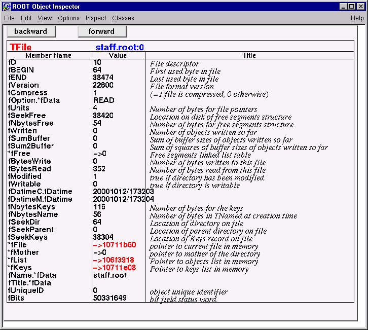

# The C++ Interpreter Cling
\index{cling}

ROOT has a C++ interpreter called *cling* built in. It is used for the prompt, both C++ and
Python. It also serves as a source of information to store C++ objects, and
provides the back-end for ROOT's signal/slot and plug-in mechanisms.

This chapter focuses on the parts of *cling* that you will encounter while
interacting with ROOT.

## The ROOT Prompt


Start up a ROOT session by typing `root` at the system prompt.

``` {.cpp}
$ root
   ------------------------------------------------------------
  | Welcome to ROOT 6.00/00                http://root.cern.ch |
  |                               (c) 1995-2014, The ROOT Team |
  | Built for linuxx8664gcc                                    |
  | From tag v6-00-00, 30 May 2014                             |
  | Try '.help', '.demo', '.license', '.credits', '.quit'/'.q' |
   ------------------------------------------------------------

root [0]
```

Now we create a `TLine` object:

``` {.cpp}
root [1] TLine l;
root [2] l.Print()
TLine  X1=0.000000 Y1=0.000000 X2=0.000000 Y2=0.000000
root [3] l.SetX1(10)
root [4] l.SetY1(11)
root [5] l.Print()
TLine  X1=10.000000 Y1=11.000000 X2=0.000000 Y2=0.000000
root [6] .g l
.g l
ROOT_prompt_0     1 (address: NA) class TLine l, size = 72
root [7] l.GetX1();
root [8] l.GetX1()
(Double_t) 1.000000e+01
```

Note some of the features of the ROOT prompt:
-   Terminating with ‘`;`‘ is not required, see "C++ Extensions To Ease
Scripting" below.
-   `Emacs` style command line editing.
-   Raw interpreter commands start with a dot; `.g l` for instance shows the
interpreter information on the global called `l`.
-   To show the result of an expression just do not type the trailing `;`.

For the further examples we will "abbreviate" `root [0]` etc by `root []`.

``` {.cpp}
root [] .class TLine
===========================================================================
class TLine
SIZE: 72 FILE: TLine.h LINE: 39
Base classes: --------------------------------------------------------
0x20       public TAttBBox2D
List of member variables --------------------------------------------------
TLine.h          42 0x28       protected: Double_t fX1
TLine.h          43 0x30       protected: Double_t fY1
TLine.h          44 0x38       protected: Double_t fX2
TLine.h          45 0x40       protected: Double_t fY2
TLine.h          50 0x0      public: enum TLine::<anonymous at /home/axel/build/root/trunk/obj/include/TLine.h:49:4> kLineNDC
TLine.h          51 0x0      public: enum TLine::<anonymous at /home/axel/build/root/trunk/obj/include/TLine.h:49:4> kVertical
TLine.h          52 0x0      public: enum TLine::<anonymous at /home/axel/build/root/trunk/obj/include/TLine.h:49:4> kHorizontal
TLine.h          94 0x0      private: static class TClass *fgIsA
List of member functions :---------------------------------------------------
filename     line:size busy function type and name
(compiled)     (NA):(NA) 0 public: TLine();
(compiled)     (NA):(NA) 0 public: TLine(Double_t x1, Double_t y1, Double_t x2, Double_t y2);
(compiled)     (NA):(NA) 0 public: TLine(const TLine &line);
(compiled)     (NA):(NA) 0 public: virtual ~TLine() noexcept;
(compiled)     (NA):(NA) 0 public: void Copy(class TObject &line) const;
(compiled)     (NA):(NA) 0 public: virtual Int_t DistancetoPrimitive(Int_t px, Int_t py);
(compiled)     (NA):(NA) 0 public: virtual class TLine *DrawLine(Double_t x1, Double_t y1, Double_t x2, Double_t y2);
(compiled)     (NA):(NA) 0 public: virtual class TLine *DrawLineNDC(Double_t x1, Double_t y1, Double_t x2, Double_t y2);
(compiled)     (NA):(NA) 0 public: virtual void ExecuteEvent(Int_t event, Int_t px, Int_t py);
(compiled)     (NA):(NA) 0 public: Double_t GetX1() const;
(compiled)     (NA):(NA) 0 public: Double_t GetX2() const;
(compiled)     (NA):(NA) 0 public: Double_t GetY1() const;
(compiled)     (NA):(NA) 0 public: Double_t GetY2() const;
(compiled)     (NA):(NA) 0 public: Bool_t IsHorizontal();
(compiled)     (NA):(NA) 0 public: Bool_t IsVertical();
(compiled)     (NA):(NA) 0 public: virtual void ls(Option_t *option = "") const;
(compiled)     (NA):(NA) 0 public: virtual void Paint(Option_t *option = "");
(compiled)     (NA):(NA) 0 public: virtual void PaintLine(Double_t x1, Double_t y1, Double_t x2, Double_t y2);
(compiled)     (NA):(NA) 0 public: virtual void PaintLineNDC(Double_t u1, Double_t v1, Double_t u2, Double_t v2);
(compiled)     (NA):(NA) 0 public: virtual void Print(Option_t *option = "") const;
(compiled)     (NA):(NA) 0 public: virtual void SavePrimitive(std::ostream &out, Option_t *option = "");
(compiled)     (NA):(NA) 0 public: virtual void SetNDC(Bool_t isNDC = kTRUE);
(compiled)     (NA):(NA) 0 public: void SetHorizontal(Bool_t set = kTRUE);
(compiled)     (NA):(NA) 0 public: void SetVertical(Bool_t set = kTRUE);
(compiled)     (NA):(NA) 0 public: virtual void SetX1(Double_t x1);
(compiled)     (NA):(NA) 0 public: virtual void SetX2(Double_t x2);
(compiled)     (NA):(NA) 0 public: virtual void SetY1(Double_t y1);
(compiled)     (NA):(NA) 0 public: virtual void SetY2(Double_t y2);
(compiled)     (NA):(NA) 0 public: virtual struct Rectangle_t GetBBox();
(compiled)     (NA):(NA) 0 public: virtual class TPoint GetBBoxCenter();
(compiled)     (NA):(NA) 0 public: virtual void SetBBoxCenter(const class TPoint &p);
(compiled)     (NA):(NA) 0 public: virtual void SetBBoxCenterX(const Int_t x);
(compiled)     (NA):(NA) 0 public: virtual void SetBBoxCenterY(const Int_t y);
(compiled)     (NA):(NA) 0 public: virtual void SetBBoxX1(const Int_t x);
(compiled)     (NA):(NA) 0 public: virtual void SetBBoxX2(const Int_t x);
(compiled)     (NA):(NA) 0 public: virtual void SetBBoxY1(const Int_t y);
(compiled)     (NA):(NA) 0 public: virtual void SetBBoxY2(const Int_t y);
(compiled)     (NA):(NA) 0 public: static class TClass *Class();
(compiled)     (NA):(NA) 0 public: static const char *Class_Name();
(compiled)     (NA):(NA) 0 public: static Version_t Class_Version();
(compiled)     (NA):(NA) 0 public: static void Dictionary();
(compiled)     (NA):(NA) 0 public: virtual class TClass *IsA() const;
(compiled)     (NA):(NA) 0 public: virtual void ShowMembers(class TMemberInspector &insp) const;
(compiled)     (NA):(NA) 0 public: virtual void Streamer(class TBuffer &);
(compiled)     (NA):(NA) 0 public: void StreamerNVirtual(class TBuffer &ClassDef_StreamerNVirtual_b);
(compiled)     (NA):(NA) 0 public: static const char *DeclFileName();
(compiled)     (NA):(NA) 0 public: static int ImplFileLine();
(compiled)     (NA):(NA) 0 public: static const char *ImplFileName();
(compiled)     (NA):(NA) 0 public: static int DeclFileLine();
root [] .> test.log
root [] l.Dump();
root [] .>
root [] ?
```

Here we see:

-   Use `.class` as quick help and reference
-   Unix like I/O redirection using `.> out.txt` and unredirection with `.>`
-   Use `?` to get help on all ‘‘raw'' interpreter commands
-   Use @ to abort a multi-line command

Now let us execute a multi-line command:

``` {.cpp}
root [] {
root [] ? TLine l;
root [] ? for (int i = 0; i < 5; i++) {
root [] ?    l.SetX1(i);
root [] ?    l.SetY1(i+1);
root [] ?    l.Print();
root [] ? }
root [] ? }
TLine  X1=0.000000 Y1=1.000000 X2=0.000000 Y2=0.000000
TLine  X1=1.000000 Y1=2.000000 X2=0.000000 Y2=0.000000
TLine  X1=2.000000 Y1=3.000000 X2=0.000000 Y2=0.000000
TLine  X1=3.000000 Y1=4.000000 X2=0.000000 Y2=0.000000
TLine  X1=4.000000 Y1=5.000000 X2=0.000000 Y2=0.000000
root [] .q
```

Here we note:

-   A multi-line command starts with a { and ends with a }.
-   Inside continuation, every line has to be correctly terminated with a ; (like in "real''
    C++).
-   All objects are created in *global* scope.
-   There is no way to back up; you are better off writing a script.
-   Use `.q` to exit root.


## Feeding Sources Files To ROOT: C++ Scripts


ROOT script files (often called "Macros") contain pure C++ code. They can contain a simple
sequence of statements like in the multi command line example given
above, but also arbitrarily complex class and function definitions.

The most frequent interaction with the ROOT prompt uses `.x` to "run" a file:

```
root [] .x myScript.C
```

This loads myScript.C into the interpreter and calls the function `myScript()`.
You can pass arguments using `.x myScript.C(12, "A String")`.

Alternatively you can load the script and then run a function explicitly:

```
root [] .L myScript.C
root [] myScript()
```

The above is equivalent to `.x myScript.C`.

In a named script, the objects created on the stack are deleted when
the function exits. In a common scenario you
create a histogram in a named script on the stack. You draw the
histogram, but when the function exits the canvas is empty and the
histogram has disappeared. To avoid the histogram from disappearing you can
create it on the heap (by using new). This will leave the histogram
object intact, but the pointer in the named script scope will be
"gone". Since histograms (and trees) are added to the list of objects
in the current directory, you can always retrieve them to delete them
if needed.

``` {.cpp}
root[] TH1F *h = (TH1F*)gDirectory->Get("myHist");              // or
root[] TH1F *h = (TH1F*)gDirectory->GetList()->FindObject("myHist");
```

In addition, histograms and trees are automatically deleted when the
current directory is closed. This will automatically take care of the
clean up. See "Input/Output".


### Executing a Script From a Script


You may want to execute a script conditionally inside another script.
To do it you need to call the interpreter and you can do that with
`TROOT::ProcessLine()`. The example
`$ROOTSYS/tutorials/tree/cernstaff.C` calls a script to build the root
file if it does not exist:

``` {.cpp}
void cernstaff() {
   if (gSystem->AccessPathName("cernstaff.root")) {
      gROOT->ProcessLine(".x cernbuild.C");
   }
```

`ProcessLine` takes a parameter, which is a pointer to an `int` or to
a `TInterpreter::EErrorCode` to let you access the interpreter error
code after an attempt to interpret. This will contain the error
as defined in `enum TInterpreter::EErrorCode` with `TInterpreter::kSuccess` being
the value for a successful execution.


### Executing a Script From the Invocation


Instead if starting ROOT and running a script on the prompt you can also pass
it to ROOT in its invocation:

```
$ root -l -b 'myCode.C("some String", 12)'
```

The exact kind of quoting depends on your shell; the one shown here works for
bash-like shells.

ROOT can evaluate any expression as part of the invocation; another version of
the previous example can be spelled like this:

```
$ root -l -b -e 'gROOT->ProcessLine(".x myCode.C(\"some String\", 12)");'
```


## C++ Extensions To Ease Scripting

In the next example, we demonstrate three of the most important
extensions ROOT and Cling make to C++. Start ROOT in the directory
`$ROOTSYS/tutorials` (make sure to have first run `.x hsimple.C`):

``` {.cpp}
root [0] f = new TFile("hsimple.root")
(class TFile *) 0x4045e690
root [1] f->ls()
TFile**         hsimple.root
TFile*         hsimple.root
KEY: TH1F     hpx;1   This is the px distribution
KEY: TH2F     hpxpy;1 py ps px
KEY: THProfile        hprof;1 Profile of pz versus px
KEY: TNtuple  ntuple;1        Demo ntuple
root [2] hpx->Draw()
Warning in <MakeDefCanvas>: creating a default canvas with name c1
root [3] .q
```

The `root [0]` command shows the first extension; the declaration of `f`
may be omitted as a shortcut for `auto`. Cling will correctly
create `f` as pointer to object of class `TFile`. Nonetheless we recommend
to use `auto f = new TFile("hsimple.root")`.

The second extension is more important. In case Cling cannot find an
object being referenced, it will ask ROOT to search for an object with
an identical name in the search path defined by `TROOT::FindObject()`.
If ROOT finds the object, it returns a pointer to this object to Cling and
a pointer to its class definition and Cling will execute the requested
member function. This shortcut is quite natural for an interactive
system and saves much typing. In this example, ROOT searches for `hpx`
and finds it in `hsimple.root.`

The next, fundamental extension is shown below. There is no need to put a semicolon at
the end of a line. When you leave it off the value of the expression will
be printed on the next line. For example:

``` {.cpp}
root[] 23+5
(int)28
root[] 23+5;
root[] TMath::Sin
(Double_t (*)(Double_t)) Function @0x7ffff7ebb090
  at include/TMath.h:418:
inline Double_t TMath::Sin(Double_t x)
   { return sin(x); }
```

Be aware that these extensions do not work when a compiler replaces
the interpreter. Your code will not compile, hence when writing large
scripts, it is best to stay away from these shortcuts. It will save
you from having problems compiling your scripts using a real C++
compiler.


## ACLiC: Compiling Scripts Into Libraries


Instead of having Cling interpret your script there is a way to have your
scripts compiled, linked and dynamically loaded using the C++ compiler
and linker. The advantage of this is that your scripts will run with the
speed of compiled C++ and that you can use language constructs that are
not fully supported by Cling. On the other hand, you cannot use any Cling
shortcuts (see "C++ Extensions To Ease Scripting" above) and for small scripts, the
overhead of the compile/link cycle might be larger than just executing
the script in the interpreter.

ACLiC will build a dictionary and a shared library from your C++
script, using the compiler and the compiler options that were used to
compile the ROOT executable. You do not have to write a Makefile
remembering the correct compiler options, and you do not have to exit
ROOT.

### Usage


Before you can compile your interpreted script you need to add include
statements for the classes used in the script. Once you did that, you
can build and load a shared library containing your script. To load it
use the command `.L` and append the file name with a `+`.

``` {.cpp}
root[] .L MyScript.C+
```

The + option generates the shared library and names it by taking
the name of the file "filename" but replacing the dot before the
extension by an underscore and by adding the shared library extension
for the current platform. For example on most platforms, `hsimple.cxx`
will generate `hsimple_cxx.so`.

The + command rebuild the library only if the script or any of the
files it includes are newer than the library. When checking the
timestamp, ACLiC generates a dependency file which name is the same as
the library name, just replacing the 'so' extension by the extension
'd'. For example on most platforms, `hsimple.cxx` will generate
`hsimple_cxx.d`.

To ensure that the shared library is rebuilt you can use the ++
syntax:

``` {.cpp}
root[] .L MyScript.C++
```

To build, load, and execute the function with the same name as the
file you can use the `.x` command. This is the same as executing a
named script; you can also provide parameters. The only
difference is you need to append a + or a ++.

``` {.cpp}
root[] .x MyScript.C+(4000)
Creating shared library /home/./MyScript_C.so
```

You can select whether the script in compiled with debug symbol or
with optimization by appending the letter 'g' or 'O' after the '+' or
'++'. Without the specification, the script is compiled with the same
level of debugging symbol and optimization as the currently running
ROOT executable. For example:

``` {.cpp}
root[] .L MyScript.C++g
```

will compile `MyScript.C` with debug symbols; usually this means
giving the `-g` option to compiler.

``` {.cpp}
root[] .L MyScript.C++O
```

will compile `MyScript.C` with optimizations; usually this means
giving the `-O` option to compiler. The syntax:

``` {.cpp}
root[] .L MyScript.C++
```

is using the default optimization level. The initial default is to
compile with the same level of optimization as the root executable
itself. The default can be changed by:

``` {.cpp}
root[] gSystem->SetAclicMode(TSystem::kDebug);
root[] gSystem->SetAclicMode(TSystem::kOpt);
```

Note that the commands:

``` {.cpp}
root[] .L MyScript.C+g
root[] .L MyScript.C+O
```

respectively compile `MyScript.C` with debug and optimization if the
library does not exist yet; they will not change the debug and the
optimization level if the library already exist and it is up to date.
To use ACLiC from compiled code or from inside another macro, we
recommend using `gROOT->ProcessLine()`. For
example, in one script you can use ACLiC to compile and load another
script.

``` {.cpp}
gROOT->ProcessLine(".L MyScript.C+")
gROOT->ProcessLine(".L MyScript.C++")
```

### Setting the Include Path


You can get the include path by typing:

``` {.cpp}
root[] .include
```

You can append to the include path by typing:

``` {.cpp}
root[] .include $HOME/mypackage/include
```

In a script you can append to the include path:

``` {.cpp}
gSystem->AddIncludePath(" -I$HOME/mypackage/include ")
```

You can also overwrite the existing include path:

``` {.cpp}
gSystem->SetIncludePath(" -I$HOME/mypackage/include ")
```

The `$ROOTSYS/include` directory is automatically appended to the
include path, so you do not have to worry about including it. To add
library that should be used during linking of the shared library use
something like:

``` {.cpp}
gSystem->AddLinkedLibs("-L/my/path -lanylib");
```

This is especially useful for static libraries. For shared ones you
can also simply load them before trying to compile the script:

``` {.cpp}
gSystem->Load("mydir/mylib");
```

ACLiC uses the directive `fMakeSharedLibs` to create the shared
library. If loading the shared library fails, it tries to output a
list of missing symbols by creating an executable (on some platforms
like OSF, this does not HAVE to be an executable) containing the
script. It uses the directive `fMakeExe` to do so. For both
directives, before passing them to `TSystem::Exec()`, it expands the
variables `$SourceFiles`, `$SharedLib`, `$LibName`, `$IncludePath`,
`$LinkedLibs`, `$ExeName `and` $ObjectFiles`. See `SetMakeSharedLib()`
for more information on those variables. When the file being passed to
ACLiC is on a read only file system, ACLiC warns the user and creates
the library in a temporary directory:

``` {.cpp}
root[] .L readonly/t.C++
Warning in <ACLiC>: /scratch/aclic/subs/./readonly is not writable!
Warning in <ACLiC>: Output will be written to /tmp
Info in <TUnixSystem::ACLiC>: creating shared library
/tmp//scratch/aclic/subs/./readonly/t_C.so
```

To select the temporary directory ACLiC looks at `$TEMP`, `$TEMP_DIR`,
`$TEMPDIR`, `$TMP`, `$TMPDIR`, `$TMP_DIR `or uses `/tmp (`or `C:/)`.
Also, a new interface `TSystem::Get/SetBuildDir` is introduced
to let users select an alternative 'root' for building of the ACLiC
libraries. For `filename/full/path/name/macro.C`, the library is
created as `fBuildDir/full/path/name/macro_C.so.`

### Dictionary Generation


You can direct what is added to the dictionary generated by ACLiC in
two ways. The simplest way is to add at the end of script (i.e. after
the symbols have been defined) something like:

``` {.cpp}
#if defined(__ROOTCLING__)
#pragma link C++ class MyOtherClass;
#endif
```

You can also write this portion of code in a file name
`MyScript_linkdef.h` where the suffix `'_linkdef' `is the prefix
defined by the key `‘ACLiC.Linkdef`‘ in the currently used resource
file (usually `.rootrc `or` $ROOTSYS/etc/system.rootrc`) and the
prefix is the name of your script.

The default behavior of `rootcling` is to
not link in (i.e. generate the dictionary for) any of the symbols. In
particular, this means that the following lines are, in the
general case, unnecessary.

``` {.cpp}
#pragma link off all globals;
#pragma link off all classes;
#pragma link off all functions;
```

This also means that linking the instantiation of a class template:

``` {.cpp}
#pragma link C++ class mytemplate<int>;
```

ONLY links this specific class. You need to
request the generation of the iterators explicitly.

See the documentation of `rootcling` for details how `pragma` can be
used.

NOTE: You should not call ACLiC with a script that has a function
called `main()`.

### Intermediate Steps and Files


ACLiC executes two steps and a third one if needed. These are:

-   Calling `rootcling` to create a dictionary using `rootcling`.
-   Calling the compiler to build the shared library from the script.
-   If there are errors, it calls the compiler to build a dummy
    executable to clearly report unresolved symbols.

ACLiC makes a shared library with a dictionary containing the
classes and functions declared in the script. It also adds the
classes and functions declared in included files with the same name
as the script file and any of the following extensions: `.h`, `.hh`,
`.hpp`, `.hxx`, `.hPP`, `.hXX`. This means that, by default, you
cannot combine scripts from different files into one library by using
`#include` statements; you will need to compile each script
separately. In a future release, we plan to add the global variables
declared in the script to the dictionary also. If you are curious
about the specific calls, you can raise the ROOT debug level: gDebug=3
and ACLiC will print these steps. If you need to keep the intermediate
files around, for example when debugging the script using gdb, use
gDebug=7.

### Moving between Interpreter and Compiler


The best way to develop portable scripts is to make sure you can
always run them with both, the interpreter and with ACLiC. To do so,
do not use the Cling extensions and program around the Cling
limitations. When it is not possible or desirable to program around
the Cling limitations, you can use the C preprocessor symbols defined
for Cling and `rootcling`.

The preprocessor symbol `__CLING__` is defined for both ROOT and
`rootcling`. The symbol `__ROOTCLING__` (and `__ROOTCLING__` for backward
compatibility) is only defined in `rootcling`.

Use `!defined(__CLING__) || defined(__ROOTCLING__)` to bracket code that
needs to be seen by the compiler and `rootcling`, but will be invisible
to the interpreter.

Use `!defined(__CLING__) `to bracket code that should be seen only by
the compiler and not by Cling nor `rootcling. `For example, the following
will hide the declaration and initialization of the array `gArray`
from both Cling and `rootcling`.

``` {.cpp}
#if !defined(__CLING__)
int gArray[] = { 2, 3, 4};
#endif
```

Because ACLiC calls `rootcling` to build a dictionary, the declaration
of `gArray` will not be included in the dictionary, and consequently,
`gArray` will not be available at the command line even if ACLiC is
used. Cling and `rootcling` will ignore all statements between the
`"#if !defined` `(__CLING__)"` and "`#endif"`. If you want to use
`gArray` in the same script as its declaration, you can do so.
However, if you want use the script in the interpreter you have to
bracket the usage of `gArray` between `#if's,` since the definition is
not visible. If you add the following preprocessor statements:

``` {.cpp}
#if !defined(__CLING__)
int gArray[] = { 2, 3, 4};
#elif defined(__ROOTCLING__)
int gArray[];
#endif
```

`gArray` will be visible to `rootcling` but still not visible to Cling.
If you use ACLiC, `gArray` will be available at the command line and
be initialized properly by the compiled code.

We recommend you always write scripts with the needed include
statements. In most cases, the script will still run with the
interpreter. However, a few header files are not handled very well by
Cling.

These types of headers can be included in interpreted and compiled
mode:

-   The subset of standard C/C++ headers defined in
    `$ROOTSYS/Cling/include.`

-   Headers of classes defined in a previously loaded library
    (including ROOT own). The defined class must have a name known to
    ROOT (i.e. a class with a `ClassDef`).

Hiding header files from `rootcling` that are necessary for the
compiler but optional for the interpreter can lead to a subtle but
fatal error. For example:

``` {.cpp}
#ifndef __CLING__
#include "TTree.h"
#else
class TTree;
#endif

class subTree : public TTree {
};
```

In this case, `rootcling` does not have enough information about the
`TTree` class to produce the correct dictionary file. If you try
this, `rootcling` and compiling will be error free, however,
instantiating a `subTree` object from the Cling command line will cause
a fatal error. In general, it is recommended to let `rootcling` see as
many header files as possible.


## Classes Defined By Scripts


Lets create a small class `TMyClass` and a derived class
`TChild`. The virtual method `TMyClass::Print() `is overridden in
`TChild`. Save this in file called `script4.C`.

``` {.cpp}
#include <iostream.h>

class TMyClass {
   private:
      float   fX;     //x position in centimeters
      float   fY;     //y position in centimeters
   public:
      TMyClass() { fX = fY = -1; }
      virtual void Print() const;
      void SetX(float x) { fX = x; }
      void SetY(float y) { fY = y; }
};
void TMyClass::Print() const  // parent print method
{
   cout << "fX = " << fX << ", fY = " << fY << endl;
}
class TChild : public TMyClass {
   public:
      void Print() const;
};
void TChild::Print() const  // child print metod
{
   cout << "This is TChild::Print()" << endl;
   TMyClass::Print();
}
```

To execute `script4.C` do:

``` {.cpp}
root[] .L script4.C
root[] TMyClass *a = new TChild
root[] a->Print()
This is TChild::Print()
fX = -1, fY = -1
root[] a->SetX(10)
root[] a->SetY(12)
root[] a->Print()
This is TChild::Print()
fX = 10, fY = 12
root[] .class TMyClass
=====================================================
class TMyClass
size=0x8 FILE:script4.C LINE:3
List of base class-----------------------------------
List of member variable------------------------------
Defined in TMyClass
0x0        private: float fX
0x4        private: float fY
List of member function------------------------------
Defined in TMyClass
filename       line:size busy function type and name
script4.C         16:5    0 public: class TMyClass TMyClass(void);
script4.C         22:4    0 public: void Print(void);
script4.C         12:1    0 public: void SetX(float x);
script4.C         13:1    0 public: void SetY(float y);
root[] .q
```

As you can see, an interpreted class behaves just like a compiled
class.
See "Adding a Class" for ways how to add a class with a shared library
and with ACLiC.


## Inspecting Objects


An object of a class inheriting from `TObject` can be inspected,
with the `Inspect()` method. The `TObject::Inspect` method creates a
window listing the current values of the objects members. For example,
the next picture is of `TFile`.

``` {.cpp}
root[] TFile f("staff.root")
root[] f.Inspect()
```

You can see the pointers are in red and can be clicked on to follow
the pointer to the object. If you clicked on `fList`, the list of
objects in memory and there were none, no new canvas would be shown.
On top of the page are the navigation buttons to see the previous and
next screen.




