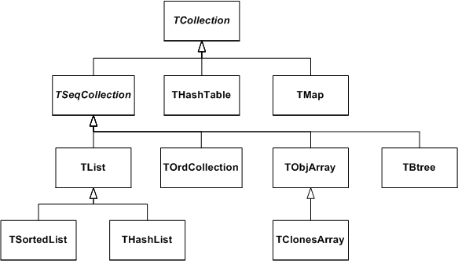
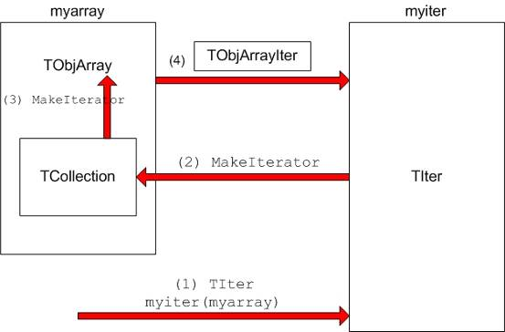
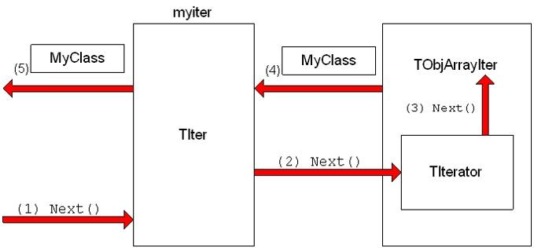
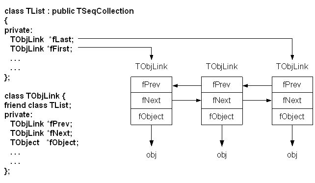
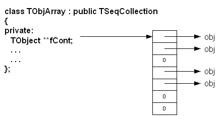
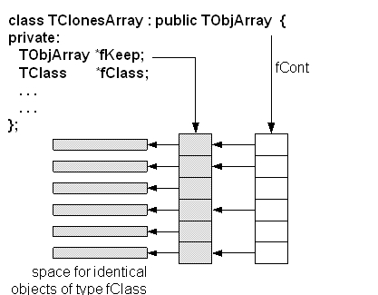

# Collection Classes


Collections are a key feature of the ROOT system. Many, if not most, of
the applications you write will use collections. If you have used
parameterized C++ collections or polymorphic collections before, some of
this material will be review. However, much of this chapter covers
aspects of collections specific to the ROOT system. When you have read
this chapter, you will know

-   How to create instances of collections

-   The difference between lists, arrays, hash tables, maps, etc.

-   How to add and remove elements of a collection

-   How to search a collection for a specific element

-   How to access and modify collection elements

-   How to iterate over a collection to access collection elements

-   How to manage memory for collections and collection elements

-   How collection elements are tested for equality (`IsEqual(`))

-   How collection elements are compared (`Compare())` in case of sorted
    collections

-   How collection elements are hashed (`Hash()`) in hash tables

## Understanding Collections


A collection is a group of related objects. You will find it easier to
manage a large number of items as a collection. For example, a diagram
editor might manage a collection of points and lines. A set of widgets
for a graphical user interface can be placed in a collection. A
geometrical model can be described by collections of shapes, materials
and rotation matrices. Collections can themselves be placed in
collections. Collections act as flexible alternatives to traditional
data structures of computers science such as arrays, lists and trees.

### General Characteristics


The ROOT collections are polymorphic containers that hold pointers to
`TObjects`, so:

-   They can only hold objects that inherit from **`TObject`**

-   They return pointers to `TObjects`, that have to be cast back to the
    correct subclass

Collections are dynamic; they can grow in size as required. Collections
themselves are descendants of **`TObject`** so can themselves be held in
collections. It is possible to nest one type of collection inside
another to any level to produce structures of arbitrary complexity.

Collections do not own the objects they hold for the very good reason
that the same object could be a member of more than one collection.
Object ownership is important when it comes to deleting objects; if
nobody owns the object it could end up as wasted memory (i.e. a memory
leak) when no longer needed. If a collection is deleted, its objects are
not. The user can force a collection to delete its objects, but that is
the user's choice.

### Determining the Class of Contained Objects


Most containers may hold heterogeneous collections of objects and then
it is left to the user to correctly cast the **`TObject`** pointer to
the right class. Casting to the wrong class will give wrong results and
may well crash the program! Therefore, the user has to be very careful.
Often a container only contains one class of objects, but if it really
contains a mixture, it is possible to ask each object about its class
using the `InheritsFrom` method.

For example if `myObject` is a **`TObject`** pointer:

``` {.cpp}
if (myObject->InheritsFrom("TParticle") {
   printf("myObject is a TParticlen");
}
```

As the name suggests, this test works even if the object is a subclass
of **`TParticle`**. The member function `IsA()` can be used instead of
`InheritsFrom` to make the test exact. The `InheritsFrom` and `IsA`
methods use the extensive Run Time Type Information (RTTI) available via
the ROOT meta-classes.

### Types of Collections


The ROOT system implements the following basic types of collections:
unordered collections, ordered collections and sorted collections. Next
figure shows the inheritance hierarchy for the primary collection
classes. All primary collection classes derive from the abstract base
class **`TCollection`**.



### Ordered Collections (Sequences)


Sequences are collections that are externally ordered because they
maintain internal elements according to the order in which they were
added. The following sequences are available:

-   **`TList`**

-   **`THashList`**

-   **`TOrdCollection`**

-   **`TObjArray`**

-   **`TClonesArray`**

The **`TOrdCollection`**, **`TObjArray`** as well as the
**`TClonesArray`** can be sorted using their Sort() member function (for
this, the stored objects must provide a comparison function by
overriding TObject::Compare() and also must enable sorting by overriding
TObject::IsSortable() to return true). Ordered collections all derive
from the abstract base class **`TSeqCollection`**. Sorted collections
are ordered by an internal (automatic) sorting mechanism. The following
sorted collections are available (the stored items must be sortable):

-   **`TSortedList`**

-   **`TBtree`**

Unordered collections don't maintain the order in which the elements
were added, i.e. when you iterate over an unordered collection, you are
not likely to retrieve elements in the same order they were added to the
collection. The following unordered collections are available:

-   **`THashTable`**

-   **`TMap`**

## Iterators: Processing a Collection


The concept of processing all the members of a collection is generic,
i.e. independent of any specific representation of a collection. To
process each object in a collection one needs some type of cursor that
is initialized and then steps over each member of the collection in
turn. Collection objects could provide this service but there is a snag:
as there is only one collection object per collection there would only
be one cursor. Instead, to permit the use of as many cursors as
required, they are made separate classes called iterator. For each
collection class there is an associated iterator class that knows how to
sequentially retrieve each member in turn. The relationship between a
collection and its iterator is very close and may require that the
iterator has full access to the collection (i.e. it is a friend class).
In general iterator will be used via the **`TIter`** wrapper class. For
example:

-   **`TList`** **`TListIter`**

-   **`TMap`** **`TMapIter`**

## Foundation Classes


All collections are based on the fundamental classes: **`TCollection`**
and **`TIterator`**. They are so generic that it is not possible to
create objects from them; they are only used as base classes for other
classes (i.e. they are abstract base classes).

The **`TCollection`** class provides the basic protocol (i.e. the
minimum set of member functions) that all collection classes have to
implement. These include:

-   `Add` `Adds another object to the collection.`

-   `GetSize` `Returns the number of objects in the collection.`

-   `Clear`
    `Clears out the collection, but does not delete the removed objects.`

-   `Delete`
    `Clears out the collection and deletes the removed objects. This should only `
    `be used if the collection owns its objects (which are not normally the case).`

-   `FindObject` `Finds an object given either its name or address.`

-   `MakeIterator` `Returns an iterator associated with the collection.`

-   `Remove` `Removes an object from the collection.`

The code example below shows a class containing three lists, where the
`fTracks` list is the owning collection and the other two lists are used
to store a sub-set of the track objects. In the destructor of the class,
the method `Delete` is called for the owning collection to delete
correctly its entire track objects. To delete the objects in the
container use `fTrack->Delete()`. To delete the container itself, do
'`delete fTracks'.`

``` {.cpp}
class TEvent : public TObject {
   private:
   TList *fTracks;  //list of all tracks
   TList *fVertex1; //subset of tracks part of vertex1
   TList *fVertex2; //subset of tracks part of vertex2
};
TEvent::~TEvent()
{
   fTracks->Delete();
   delete fTracks;
   delete fVertex1;
   delete fVertex2;
}
```

The **`TIterator`** class defines the minimum set of member functions
that all iterators must support. These include:

-   `Next`
    `Returns the next member of the collection or 0 if no more members.`

-   `Reset` `Resets the iterator so that ` `Next`
    ` returns the first object.`

## A Collectable Class


By default, all objects of **`TObject`** derived classes can be stored
in ROOT containers. However, the **`TObject`** class provides some
member functions that allow you to tune the behavior of objects in
containers. For example, by default two objects are considered equal if
their pointers point to the same address. This might be too strict for
some classes where equality is already achieved if some or all of the
data members are equal. By overriding the following **`TObject`** member
functions, you can change the behavior of objects in collections:

-   `IsEqual()`is used by the `FindObject() `collection method. By
    default, `IsEqual()` compares the two object pointers.

-   `Compare()`returns -1, 0 or 1 depending if the object is smaller,
    equal or larger than the other object. By default, a **`TObject`**
    has not a valid `Compare()` method.

-   `IsSortable() `returns true if the class is sort able (i.e. if it
    has a valid `Compare(`) method). By default, a **`TObject`** is not
    sort able.

-   `Hash() `returns a hash value. It needs to be implemented if an
    object has to be stored in a collection using a hashing technique,
    like **`THashTable`**, **`THashList`** and **`TMap`**. By default,
    `Hash(`) returns the address of the object. It is essential to
    choose a good hash function.

The example below shows how to use and override these member functions.

``` {.cpp}
class TObjNum : public TObject {
   private:
   Int_t  num;  // TObjNum is a simple container for an integer.
public:
   TObjNum(Int_t i = 0) : num(i) { }
   ~TObjNum() { }
   void     SetNum(Int_t i) { num = i; }
   Int_t    GetNum() const { return num; }
   void     Print(Option_t *) const
      { printf("num = %dn", num); }
   Bool_t   IsEqual(TObject *obj) const
      { return num == ((TObjNum*)obj)->num; }
   Bool_t   IsSortable() const { return kTRUE; }
   Int_t    Compare(const TObject *obj) const
      { if (num < ((TObjNum*)obj)->num) return -1;
        else if (num > ((TObjNum*)obj)->num) return 1;
        else return 0; }
   ULong_t  Hash() const { return num; }
};
```

## The TIter Generic Iterator


As stated above, the **`TIterator`** class is abstract; it is not
possible to create **`TIterator`** objects. However, it should be
possible to write generic code to process all members of a collection so
there is a need for a generic iterator object. A **`TIter`** object acts
as generic iterator. It provides the same `Next()` and `Reset()` methods
as **`TIterator`** although it has no idea how to support them! It works
as follows:

-   To create a **`TIter`** object its constructor must be passed an
    object that inherits from **`TCollection`**. The **`TIter`**
    constructor calls the `MakeIterator()` method of this collection to
    get the appropriate iterator object that inherits from
    **`TIterator`**.

-   The `Next()` and `Reset()` methods of **`TIter`** simply call the
    `Next()` and `Reset()` methods of the iterator object.

Therefore, **`TIter`** simply acts as a wrapper for an object of a
concrete class inheriting from **`TIterator`**.

To see this working in practice, consider the **`TObjArray`**
collection. Its associated iterator is **`TObjArrayIter`**. Suppose
`myarray` is a pointer to a **`TObjArray`** that contains `MyClass`
objects, i.e.

``` {.cpp}
TObjArray *myarray;
```

To create a **`TIter`** object called `myiter`:

``` {.cpp}
TIter myiter(myarray);
```



As shown in the diagram, this results in several methods being called:

-   The **`TIter`** constructor is passed a **`TObjArray`**

-   **`TIter`** asks embedded **`TCollection`** to make an iterator

-   **`TCollection`** asks **`TObjArray`** to make an iterator

-   **`TObjArray`** returns a **`TObjArrayIter`**.

Now define a pointer for `MyClass` objects and set it to each member of
the **`TObjArray`**:

``` {.cpp}
MyClass *myobject;
while ((myobject = (MyClass *)myiter.Next())) {
      // process myobject
}
```

The heart of this is the `myiter.Next()` expression which does the
following:

-   The `Next()` method of the **`TIter`** object `myiter` is called

-   The **`TIter`** forwards the call to the **`TIterator`** embedded in
    the **`TObjArrayIter`**

-   **`TIterator`** forwards the call to the **`TObjArrayIter`**

-   **`TObjArrayIter`** finds the next `MyClass` object and returns it

-   **`TIter`** passes the `MyClass` object back to the caller



Sometimes the **`TIter`** object is called next, and then instead of
writing: `next.Next() `which is legal, but looks rather odd, iteration
is written as `next()`. This works because the function `operator()` is
defined for the **`TIter`** class to be equivalent to the `Next()`
method.

## The TList Collection


A **`TList`** is a doubly linked list. Before being inserted into the
list the object pointer is wrapped in a **`TObjLink`** object that
contains, besides the object pointer also a previous and next pointer.

Objects are typically added using:

-   `Add()`

-   `AddFirst(), AddLast()`

-   `AddBefore(), AddAfter()`

**Main features of`TList`**: very low cost of adding/removing elements
anywhere in the list.

**Overhead per element**: 1 `TObjLink`, i.e. two 4 (or 8) byte pointers
+ pointer to `vtable` = 12 (or 24) bytes.

Next figure shows the internal data structure of a **`TList`**.



### Iterating Over a TList


There are four ways to iterate over a **`TList`**:

-   Using the `ForEach` script:

``` {.cpp}
GetListOfPrimitives()->ForEach(TObject,Draw)();
```

-   Using the **`TList`** iterator **`TListIter`** (via the wrapper
    class **`TIter`**):

``` {.cpp}
TIter next(GetListOfTracks());
while ((TTrack *obj = (TTrack *)next()))
   obj->Draw();
```

-   Using the **`TObjLink`** list entries (that wrap the
    **`TObject`**\*):

``` {.cpp}
TObjLink *lnk = GetListOfPrimitives()->FirstLink();
while (lnk) {
   lnk->GetObject()->Draw();
   lnk = lnk->Next();
}
```

-   Using the **`TList`**'s `After()` and `Before()` member functions:

``` {.cpp}
TFree *idcur = this;
while (idcur) {
   ...
   idcur = (TFree*)GetListOfFree()->After(idcur);
}
```

Method 1 uses internally method 2.

Method 2 works for all collection classes. **`TIter`** overloads
`operator()`.

Methods 3 and 4 are specific for **`TList`**.

Methods 2, 3 and 4 can also easily iterate backwards using either a
backward **`TIter`** (using argument `kIterBackward`) or by using
`LastLink()` and `lnk>Prev`() or by using the `Before()` method.

## The TObjArray Collection


A **`TObjArray`** is a collection which supports traditional array
semantics via the overloading of `operator[]`. Objects can be directly
accessed via an index. The array expands automatically when objects are
added. At creation time one specifies the default array size (default =
16) and lower bound (default = 0). Resizing involves a re-allocation and
a copy of the old array to the new. This can be costly if done too
often. If possible, set initial size close to expected final size. Index
validity is always checked (if you are 100% sure and maximum performance
is needed you can use `UnCheckedAt()` instead of `At()` or
`operator[]`). If the stored objects are sort able the array can be
sorted using `Sort()`. Once sorted, efficient searching is possible via
the `BinarySearch()` method. The figure shows the internal data
structure of a **`TObjArray`**:



Iterating can be done using a **`TIter`** iterator or via a simple for
loop:

``` {.cpp}
for (int i = 0; i <= fArr.GetLast(); i++)
if ((track = (TTrack*)fArr[i]))     // or fArr.At(i)
   track->Draw();
```

Main features of **`TObjArray`** are simple, well-known array semantics.
**Overhead per element**: none, except possible over sizing of `fCont`.

## TClonesArray An Array of Identical Objects


A **`TClonesArray`** is an array of identical (clone) objects. The
memory for the objects stored in the array is allocated only once in the
lifetime of the clones array. All objects must be of the same class. For
the rest this class has the same properties as a **`TObjArray`**.



The figure above shows the internal data structure of a
**`TClonesArray`**. The class is specially designed for repetitive data
analysis tasks, where in a loop many times the same objects, are created
and deleted. The only supported way to add objects to a
**`TClonesArray`** is via the `new` with placement method. The different
`Add()` methods of **`TObjArray`** and its base classes are not
supported.

### The Idea Behind TClonesArray


To reduce the very large number of new and delete calls in large loops
like this (O(100000) x O(10000) times new/delete):

``` {.cpp}
TObjArray a(10000);
while (TEvent *ev = (TEvent *)next()) {        // O(100000)
   for (int i = 0; i < ev->Ntracks; i++) {     // O(10000)
      a[i] = new TTrack(x,y,z,...);
      ...
   }
   ...
   a.Delete();
}
```

You better use a **`TClonesArray`** which reduces the number of
new/delete calls to only O(10000):

``` {.cpp}
TClonesArray a("TTrack", 10000);
while (TEvent *ev = (TEvent *)next()) {      // O(100000)
   for (int i = 0; i < ev->Ntracks; i++) {   // O(10000)
      TTrack *track = (Track*)a.ConstructedAt(i);
      track->Set(x,y,z,...);
      ...
   }
   ...
   a.Clear(); // Or Clear("C") if the track objects must be returned (via Track::Clear) to a default state.
}
```

Considering that a pair of new/delete calls on average cost about 70 ms,
O(109) new/deletes will save about 19 hours. For the other collections,
see the class reference guide on the web and the test program
`$ROOTSYS/test/tcollex.cxx.`

## Template Containers and STL


Some people dislike polymorphic containers because they are not truly
"type safe". In the end, the compiler leaves it the user to ensure that
the types are correct. This only leaves the other alternative: creating
a new class each time a new (container organization) / (contained
object) combination is needed. To say the least this could be very
tedious. Most people faced with this choice would, for each type of
container:

Define the class leaving a dummy name for the contained object type.
When a particular container was needed, copy the code and then do a
global search and replace for the contained class. C++ has a built in
template scheme that effectively does just this. For example:

``` {.cpp}
template<class T>
class ArrayContainer {
   private:
   T *member[10];
   ...
};
```

This is an array container with a 10-element array of pointers to T, it
could hold up to 10 T objects. This array is flawed because it is static
and hard-coded, it should be dynamic. However, the important point is
that the template statement indicates that T is a template, or
parameterized class. If we need an `ArrayContainer` for Track objects,
it can be created by:

``` {.cpp}
ArrayContainer<Track> MyTrackArrayContainer;
```

C++ takes the parameter list and substitutes Track for T throughout the
definition of the class `ArrayContainer`, then compiles the code so
generated, effectively doing the same we could do by hand, but with a
lot less effort.

This produces code that is type safe, but does have different drawbacks:

-   Templates make code harder to read.

-   At the time of writing this documentation, some compilers can be
    very slow when dealing with templates.

-   It does not solve the problem when a container has to hold a
    heterogeneous set of objects.

-   The system can end up generating a great deal of code; each
    container/object combination has its own code, a phenomenon that is
    sometimes referred to as *code bloat*.

-   The Standard Template Library (STL) is part on ANSI C++, and
    includes a set of template containers.

