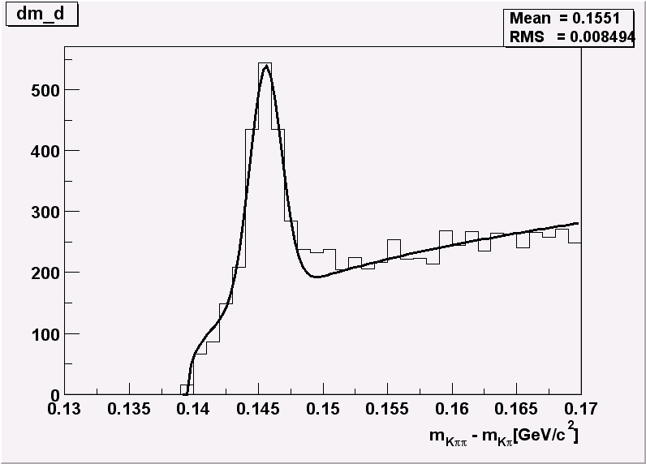
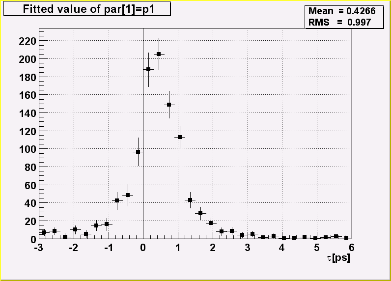

# Example Analysis


This chapter is an example of a typical physics analysis. Large data
files are chained together and analyzed using the **`TSelector`** class.

## Explanation


This script uses four large data sets from the H1 collaboration at DESY
Hamburg. One can access these data sets (277 Mbytes) from the ROOT web
site at: <ftp://root.cern.ch/root/h1analysis/>

The physics plots generated by this example cannot be produced using
smaller data sets.

There are several ways to analyze data stored in a ROOT Tree

-   Using `TTree::Draw`:

-   This is very convenient and efficient for small tasks. A
    **`TTree`**::Draw call produces one histogram at the time. The
    histogram is automatically generated. The selection expression may
    be specified in the command line.

-   Using the **`TTreeViewer`**:

-   This is a graphical interface to `TTree::Draw` with the same
    functionality.

-   Using the code generated by `TTree::MakeClass`:

-   In this case, the user creates an instance of the analysis class. They
    have the control over the event loop and can generate an unlimited
    number of histograms.

-   Using the code generated by `TTree::MakeSelector`: Like for the code
    generated by **`TTree::MakeClass`**, the user can do complex analysis.
    However, they cannot control the event loop. The event loop is
    controlled by `TTree::Process` called by the user. This solution is
    illustrated by the code below. The advantage of this method is that
    it can be run in a parallel environment using PROOF (the Parallel
    Root Facility).

A chain of four files (originally converted from PAW ntuples) is used to
illustrate the various ways to loop on ROOT data sets. Each contains a
ROOT Tree named "`h42`". The class definition in h1analysis.h has been
generated automatically by the ROOT utility **`TTree`**`::MakeSelector`
using one of the files with:

``` {.cpp}
h42->MakeSelector("h1analysis");
```

This produces two files: h1analysis.h and `h1analysis.C`. A skeleton of
`h1analysis.C` file is made for you to customize. The h1analysis class
is derived from the ROOT class **`TSelector`**. The following members
functions of h1analyhsis (i.e. **`TSelector`**) are called by the
`TTree::Process` method.

-   `Begin`: This function is called every time a loop over the tree
    starts. This is a convenient place to create your histograms.

-   `Notify():` This function is called at the first entry of a new tree
    in a chain.

-   `ProcessCut`: This function is called at the beginning of each entry
    to return a flag true if the entry must be analyzed.

-   `ProcessFill`: This function is called in the entry loop for all
    entries accepted by Select.

-   `Terminate`: This function is called at the end of a loop on a
    **`TTree`**. This is a convenient place to draw and fit your
    histograms.

To use this program, try the following session.

First, turn the timer on to show the real and CPU time per command.

``` {.cpp}
root[] gROOT->Time();
```

*Step A:* create a **`TChain`** with the four H1 data files. The chain
can be created by executed this short script `h1chain.C` below. \$H1 is
a system symbol pointing to the H1 data directory.

``` {.cpp}
{
   TChain chain("h42");
   chain.Add("$H1/dstarmb.root");
   //21330730 bytes, 21920 events
   chain.Add("$H1/dstarp1a.root");
   //71464503 bytes, 73243 events
   chain.Add("$H1/dstarp1b.root");
   //83827959 bytes, 85597 events
   chain.Add("$H1/dstarp2.root");
   //100675234 bytes, 103053 events
}
```

Run the above script from the command line:

``` {.cpp}
root[] .x h1chain.C
```

*Step B*: Now we have a directory containing the four data files. Since
a **`TChain`** is a descendent of `TTree` we can call
**`TChain::Process`** to loop on all events in the chain. The parameter to
the `TChain::Process` method is the name of the file containing the
created **`TSelector`** class (`h1analysis.C`).

``` {.cpp}
root[] chain.Process("h1analysis.C")
```

*Step C*: Same as step B, but in addition fill the event list with
selected entries. The event list is saved to a file "`elist.root`" by
the `TSelector::Terminate` method. To see the list of selected events,
you can do `elist->Print("all")`. The selection function has selected
7525 events out of the 283813 events in the chain of files. (2.65 per
cent)

``` {.cpp}
root[] chain.Process("h1analysis.C","fillList")
```

*Step D:* Process only entries in the event list. The event list is read
from the file in `elist.root` generated by step C.

``` {.cpp}
root[] chain.Process("h1analysis.C","useList")
```

*Step E*: The above steps have been executed with the interpreter. You
can repeat the steps B, C, and D using ACLiC by replacing
"`h1analysis.C`" by "`h1analysis.C+`" or "`h1analysis.C++`".

*Step F:* If you want to see the differences between the interpreter
speed and ACLiC speed start a new session, create the chain as in step
1, then execute

``` {.cpp}
root[] chain.Process("h1analysis.C+","useList")
```

The commands executed with the four different methods B, C, D and E
produce two canvases shown below:

 

## Script


This is the `h1analsysis.C` file that was generated by
`TTree::MakeSelector` and then modified to perform the analysis.

``` {.cpp}
#include "h1analysis.h"
#include "TH2.h"
#include "TF1.h"
#include "TStyle.h"
#include "TCanvas.h"
#include "TLine.h"
#include "TEventList.h"

const Double_t dxbin = (0.17-0.13)/40;   // Bin-width
const Double_t sigma = 0.0012;
TEventList *elist = 0;
Bool_t useList, fillList;
TH1F *hdmd;
TH2F *h2;

//_________________________________________________________
Double_t fdm5(Double_t *xx, Double_t *par)
{
   Double_t x = xx[0];
   if (x <= 0.13957) return 0;
   Double_t xp3 = (x-par[3])*(x-par[3]);
   Double_t res = dxbin*(par[0]*TMath::Power(x-0.13957,par[1])
   + par[2]/2.5066/par[4]*TMath::Exp(-xp3/2/par[4]/par[4]));
   return res;
}

//_________________________________________________________
Double_t fdm2(Double_t *xx, Double_t *par)
{
   Double_t x = xx[0];
   if (x <= 0.13957) return 0;
   Double_t xp3 = (x-0.1454)*(x-0.1454);
   Double_t res = dxbin*(par[0]*TMath::Power(x-0.13957,0.25)
   + par[1]/2.5066/sigma*TMath::Exp(-xp3/2/sigma/sigma));
   return res;
}

//_________________________________________________________
void h1analysis::Begin(TTree *tree)
{
// function called before starting the event loop
//  -it performs some cleanup
//  -it creates histograms
//  -it sets some initialization for the event list

   //initialize the Tree branch addresses
   Init(tree);

   //print the option specified in the Process function
   TString option = GetOption();
   printf("Starting h1analysis with process option: %sn",option.Data());

   //Some cleanup in case this function had already been executed
   //Delete any previously generated histograms or functions
   gDirectory->Delete("hdmd");
   gDirectory->Delete("h2*");
   delete gROOT->GetFunction("f5");
   delete gROOT->GetFunction("f2");

   //create histograms
   hdmd = new TH1F("hdmd","dm_d",40,0.13,0.17);
   h2   = new TH2F("h2","ptD0 vs dm_d",30,0.135,0.165,30,-3,6);

   //process cases with event list
   fillList = kFALSE;
   useList  = kFALSE;
   fChain->SetEventList(0);
   delete gDirectory->GetList()->FindObject("elist");

   // case when one creates/fills the event list
   if (option.Contains("fillList")) {
      fillList = kTRUE;
      elist = new TEventList("elist","selection from Cut",5000);
   }
   // case when one uses the event list generated in a previous call
   if (option.Contains("useList")) {
      useList  = kTRUE;
      TFile f("elist.root");
      elist = (TEventList*)f.Get("elist");
      if (elist) elist->SetDirectory(0);
      //otherwise the file destructor will delete elist
      fChain->SetEventList(elist);
   }
}
//_________________________________________________________
Bool_t h1analysis::ProcessCut(Int_t entry)
{ // Selection function to select D* and D0.

   //in case one event list is given in input,
   //the selection has already been done.
   if (useList) return kTRUE;
   // Read only the necessary branches to select entries.
   // return as soon as a bad entry is detected
   b_md0_d->GetEntry(entry);
   if (TMath::Abs(md0_d-1.8646) >= 0.04) return kFALSE;
   b_ptds_d->GetEntry(entry);
   if (ptds_d <= 2.5) return kFALSE;
   b_etads_d->GetEntry(entry);
   if (TMath::Abs(etads_d) >= 1.5) return kFALSE;
   b_ik->GetEntry(entry);  ik--;
   //original ik used f77 convention starting at 1
   b_ipi->GetEntry(entry);
   ipi--;
   b_ntracks->GetEntry(entry);
   b_nhitrp->GetEntry(entry);
   if (nhitrp[ik]*nhitrp[ipi] <= 1) return kFALSE;
   b_rend->GetEntry(entry);
   b_rstart->GetEntry(entry);
   if (rend[ik]-rstart[ik] <= 22)   return kFALSE;
   if (rend[ipi]-rstart[ipi] <= 22) return kFALSE;
   b_nlhk->GetEntry(entry);
   if (nlhk[ik] <= 0.1)    return kFALSE;
   b_nlhpi->GetEntry(entry);
   if (nlhpi[ipi] <= 0.1)  return kFALSE;
   b_ipis->GetEntry(entry);
   ipis--;
   if (nlhpi[ipis] <= 0.1) return kFALSE;
   b_njets->GetEntry(entry);
   if (njets < 1)          return kFALSE;

    // if option fillList, fill the event list
   if (fillList) elist->Enter(fChain->GetChainEntryNumber(entry));

   return kTRUE;
}

//_________________________________________________________
void h1analysis::ProcessFill(Int_t entry)
{ // Function called for selected entries only

   // read branches not processed in ProcessCut
   b_dm_d->GetEntry(entry);
   //read branch holding dm_d
   b_rpd0_t->GetEntry(entry);
   //read branch holding rpd0_t
   b_ptd0_d->GetEntry(entry);
   //read branch holding ptd0_d           //continued...
   //fill some histograms
   hdmd->Fill(dm_d);
   h2->Fill(dm_d,rpd0_t/0.029979*1.8646/ptd0_d);
}

//_________________________________________________________
void h1analysis::Terminate()
{ // Function called at the end of the event loop

   //create the canvas for the h1analysis fit
   gStyle->SetOptFit();
   TCanvas *c1 = new TCanvas("c1","h1analysis analysis",10,10,800,600);
   c1->SetBottomMargin(0.15);
   hdmd->GetXaxis()->SetTitle("m_{K#pi#pi}-m_{K#pi}[GeV/c^{2}]");
   hdmd->GetXaxis()->SetTitleOffset(1.4);

   //fit histogram hdmd with function f5 using
   //the loglikelihood option
   TF1 *f5 = new TF1("f5",fdm5,0.139,0.17,5);
   f5->SetParameters(1000000,.25,2000,.1454,.001);
   hdmd->Fit("f5","lr");

   //create the canvas for tau d0
   gStyle->SetOptFit(0);
   gStyle->SetOptStat(1100);
   TCanvas *c2 = new TCanvas("c2","tauD0",100,100,800,600);
   c2->SetGrid();
   c2->SetBottomMargin(0.15);

   // Project slices of 2-d histogram h2 along X ,
   // then fit each slice with function f2 and make a
   // histogram for each fit parameter.
   // Note that the generated histograms are added
   // to the list of objects in the current directory.

   TF1 *f2 = new TF1("f2",fdm2,0.139,0.17,2);
   f2->SetParameters(10000,10);
   h2->FitSlicesX(f2,0,0,1,"qln");
   TH1D *h2_1 = (TH1D*)gDirectory->Get("h2_1");
   h2_1->GetXaxis()->SetTitle("#tau[ps]");
   h2_1->SetMarkerStyle(21);
   h2_1->Draw();
   c2->Update();
   TLine *line = new TLine(0,0,0,c2->GetUymax());
   line->Draw();

   // save the event list to a Root file if one was produced
   if (fillList) {
      TFile efile("elist.root","recreate");
      elist->Write();
   }
}
```
