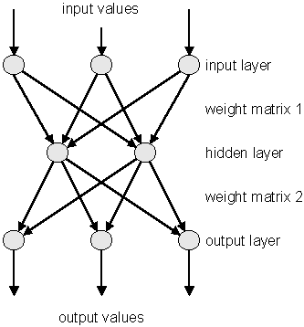

# Fitting Histograms


To fit a histogram you can use the Fit Panel on a visible histogram
via the context menu, or you can use the **`TH1`**`::Fit` method. The
Fit Panel, which is limited, is best for prototyping. The histogram
needs to be drawn in a pad before the Fit Panel is invoked. The method
`TH1::Fit` is more powerful and is used in scripts and programs.

## The Fit Method


To fit a histogram programmatically, you can use the `TH1::Fit`
method. Here is the signature of `TH1::Fit` and an explanation of the
parameters:

``` {.cpp}
   void Fit(const char *fname, Option_t *option, Option_t *goption,
            Axis_t xxmin, Axis_t  xxmax)
```

-   `*fname: `The name of the fitted function (the model) is passed as
    the first parameter. This name may be one of ROOT pre-defined
    function names or a user-defined function. The functions below are
    predefined, and can be used with the `TH1::Fit` method:

-   "`gaus`" Gaussian function with 3 parameters:
    `f(x) = p0*exp(-0.5*((x-p1)/p2)^2)`

-   "`expo`"An Exponential with 2 parameters: `f(x) = exp(p0+p1*x)`

-   "`pol`*`N`*" A polynomial of degree *N*:
    `f(x) = p0 + p1*x + p2*x2 +...`

-   "`landau`" Landau function with mean and sigma. This function has
    been adaptedfrom the `CERNLIB` routine `G110 denlan`.

-   `*option:`The second parameter is the fitting option. Here is the
    list of fitting options:

-   "`W`" Set all weights to 1 for non empty bins; ignore error bars

-   "`WW`" Set all weights to 1 including empty bins; ignore error
    bars

-   "`I`" Use integral of function in bin instead of value at bin
    center

-   "`L`" Use log likelihood method (default is chi-square method)

-   "`U`" Use a user specified fitting algorithm

-   "`Q`" Quiet mode (minimum printing)

-   "`V`" Verbose mode (default is between Q and V)

-   "`E`" Perform better errors estimation using the Minos technique

-   "`M`" Improve fit results

-   "`R`" Use the range specified in the function range

-   "`N`" Do not store the graphics function, do not draw

-   "`0`" Do not plot the result of the fit. By default the fitted
    function is drawn unless the option "`N`" above is specified.

-   "`+`" Add this new fitted function to the list of fitted functions
    (by default, the previous function is deleted and only the last
    one is kept)

-   "`B`"Use this option when you want to fix one or more parameters
    and the fitting function is like `polN`, `expo`, `landau`, `gaus`.

-   "`LL`"An improved Log Likelihood fit in case of very low
    statistics and when bincontentsare not integers. Do not use this
    option if bin contents are large (greater than 100).

-   "`C`"In case of linear fitting, don't calculate the chisquare
    (saves time).

-   "`F`"If fitting a `polN`, switch to `Minuit` fitter (by default,
    `polN` functions are fitted by the linear fitter).

-   `*goption: `The third parameter is the graphics option that is the
    same as in the **`TH1`**`::Draw` (see the chapter Draw Options).

-   `xxmin`, `xxmax:`Thee fourth and fifth parameters specify the
    range over which to apply the fit.

By default, the fitting function object is added to the histogram and
is drawn in the current pad.

## Fit with a Predefined Function


To fit a histogram with a predefined function, simply pass the name of
the function in the first parameter of **`TH1`**`::Fit`. For example,
this line fits histogram object `hist` with a Gaussian.

``` {.cpp}
root[] hist.Fit("gaus");
```

The initial parameter values for pre-defined functions are set
automatically.

## Fit with a User-Defined Function


You can create a **`TF1`** object and use it in the call the
**`TH1`**`::Fit`. The parameter in to the `Fit` method is the NAME of
the **`TF1`** object. There are three ways to create a **`TF1`**.

-   Using C++ expression using x with a fixed set of operators and
    functions defined in **`TFormula`**.

-   Same as first one, with parameters

-   Using a function that you have defined

### Creating a TF1 with a Formula


Let's look at the first case. Here we call the **`TF1`** constructor
by giving it the formula: `sin(x)/x`.

``` {.cpp}
root[] TF1  *f1 = new TF1("f1","sin(x)/x",0,10)
```

You can also use a **`TF1`** object in the constructor of another
**`TF1`**.

``` {.cpp}
root[] TF1  *f2 = new TF1("f2","f1*2",0,10)
```

### Creating a TF1 with Parameters


The second way to construct a **`TF1`** is to add parameters to the
expression. Here we use two parameters:

``` {.cpp}
root[] TF1 *f1 = new TF1("f1","[0]*x*sin([1]*x)",-3,3);
```


The parameter index is enclosed in square brackets. To set the initial
parameters explicitly you can use:

``` {.cpp}
root[] f1->SetParameter(0,10);
```

This sets parameter 0 to 10. You can also use `SetParameters` to set
multiple parameters at once.

``` {.cpp}
root[] f1->SetParameters(10,5);
```

This sets parameter 0 to 10 and parameter 1 to 5. We can now draw the
`TF1:`

``` {.cpp}
root[] f1->Draw()
```

### Creating a TF1 with a User Function


The third way to build a **`TF1`** is to define a function yourself
and then give its name to the constructor. A function for a **`TF1`**
constructor needs to have this exact signature:

``` {.cpp}
Double_t fitf(Double_t *x,Double_t *par)
```

The two parameters are:

-   `x ` a pointer to the dimension array. Each element contains a
    dimension. For a 1D histogram only `x[0]` is used, for a 2D
    histogram `x[0]` and `x[1]` is used, and for a 3D histogram
    `x[0]`, `x[1]`, and `x[2]` are used. For histograms, only 3
    dimensions apply, but this method is also used to fit other
    objects, for example an ntuple could have 10 dimensions.

-   `par` a pointer to the parameters array. This array contains the
    current values of parameters when it is called by the fitting
    function.

The following script `$ROOTSYS/tutorials/fit/myfit.C` illustrates how
to fit a 1D histogram with a user-defined function. First we declare
the function.

``` {.cpp}
   // define a function with 3 parameters
   Double_t fitf(Double_t *x,Double_t *par) {
      Double_t arg = 0;
      if (par[2]!=0) arg = (x[0] - par[1])/par[2];
      Double_t fitval = par[0]*TMath::Exp(-0.5*arg*arg);
      return fitval;
   }
```

Now we use the function:

``` {.cpp}
   // this function used fitf to fit a histogram
   void fitexample() {

      // open a file and get a histogram
      TFile *f = new TFile("hsimple.root");
      TH1F *hpx = (TH1F*)f->Get("hpx");

      // Create a TF1 object using the function defined above.
      // The last three parameters specify the number of parameters
      // for the function.
      TF1 *func = new TF1("fit",fitf,-3,3,3);
      // set the parameters to the mean and RMS of the histogram
      func->SetParameters(500,hpx->GetMean(),hpx->GetRMS());

      // give the parameters meaningful names
      func->SetParNames ("Constant","Mean_value","Sigma");

      // call TH1::Fit with the name of the TF1 object
      hpx->Fit("fit");
   }
```

## Fixing and Setting Parameters' Bounds


Parameters must be initialized before invoking the `Fit` method. The
setting of the parameter initial values is automatic for the
predefined functions: `poln`, `exp`, `gaus`, and `landau`. You can fix
one or more parameters by specifying the "B" option when calling the
`Fit` method. When a function is not predefined, the fit parameters
must be initialized to some value as close as possible to the expected
values before calling the fit function.

To set bounds for one parameter, use `TF1::SetParLimits`:

``` {.cpp}
   func->SetParLimits(0,-1,1);
```

When the lower and upper limits are equal, the parameter is fixed.
Next two statements fix parameter 4 at 10.

``` {.cpp}
   func->SetParameter(4,10);
   func->SetParLimits(4,10,10);
```

However, to fix a parameter to 0, one must call the `FixParameter`
function:

``` {.cpp}
   func->SetParameter(4,0);
   func->FixParameter(4,0);
```

Note that you are not forced to set the limits for all parameters. For
example, if you fit a function with 6 parameters, you can:

``` {.cpp}
   func->SetParameters(0,3.1,1.e-6,-1.5,0,100);
   func->SetParLimits(3,-10,4);
   func->FixParameter(4,0);
```

With this setup, parameters 0`->`2 can vary freely, parameter 3 has
boundaries [-10, 4] with initial value -1.5, and parameter 4 is fixed
to 0.

## Fitting Sub Ranges


By default, `TH1::Fit` will fit the function on the defined histogram
range. You can specify the option "`R`" in the second parameter of
`TH1::Fit` to restrict the fit to the range specified in the **`TF1`**
constructor. In this example, the fit will be limited to -3 to 3, the
range specified in the **`TF1`** constructor.

``` {.cpp}
root[] TF1 *f1 = new TF1("f1","[0]*x*sin([1]*x)",-3,3);
root[] hist->Fit("f1","R");
```

You can also specify a range in the call to `TH1::Fit`:

``` {.cpp}
root[] hist->Fit("f1","","",-2,2)
```

See macros `$ROOTSYS/tutorials/fit/myfit.C` and `multifit.C` as more
completed examples.

## The Fit Panel


To display the Fit Panel right click on a histogram to pop up the
context menu, and then select the menu entry Fit Panel.

The new Fit Panel GUI is available in ROOT v5.14. Its goal is to
replace the old Fit Panel and to provide more user friendly way for
performing, exploring and comparing fits.

By design, this user interface is planned to contain two tabs:
"General" and "Minimization". Currently, the "General" tab provides
user interface elements for setting the fit function, fit method and
different fit, draw, print options.

The new fit panel is a modeless dialog, i.e. when opened, it does not
prevent users from interacting with other windows. Its first prototype
is a singleton application. When the Fit Panel is activated, users can
select an object for fitting in the usual way, i.e. by left-mouse
click on it. If the selected object is suitable for fitting, the fit
panel is connected with this object and users can perform fits by
setting different parameters and options.

### Function Choice and Settings


*‘Predefined' combo box* - contains a list of predefined functions in
ROOT. You have a choice of several polynomials, a Gaussian, a Landau,
and an Exponential function. The default one is Gaussian.

*‘Operation' radio button group* defines the selected operational mode
between functions:

*Nop* - no operation (default);

*Add* - addition;

*Conv* - convolution (will be implemented in the future).

Users can enter the function expression into the text entry field
below the ‘Predefined' combo box. The entered string is checked after
the Enter key was pressed and an error message shows up, if the
function string is not accepted.

‘*Set Parameters*' button opens a dialog for parameters settings,
which will be explaned later.

### Fitter Settings


*‘Method' combo box* currently provides only two fit model choices:
Chi-square and Binned Likelihood. The default one is Chi-square. The
Binned Likelihood is recomended for bins with low statistics.

*‘Linear Fit' check button* sets the use of Linear fitter when is
selected. Otherwise the minimization is done by Minuit, i.e. fit
option "`F`" is applied. The Linear fitter can be selected only for
functions linears in parameters (for example - `polN)`.

*‘Robust' number entry* sets the robust value when fitting graphs.

*‘No Chi-square' check button* switch On/Off the fit option "`C`" -
do not calculate Chi-square (for Linear fitter).

*‘Integral' check button* switch On/Off the option "`I`" - use
integral of function instead of value in bin center.

*‘Best Errors'* sets On/Off the option "`E`" - better errors
estimation by using Minos technique.

*‘All weights = 1'* sets On/Off the option "`W`"- all weights set to 1
excluding empty bins; error bars ignored.

*‘Empty bins, weights=1'* sets On/Off the option "`WW`" - all weights
equal to 1 including empty bins; error bars ignored.

*‘Use range'* sets On/Off the option "`R`" - fit only data within the
specified function range. Sliders settings are used if this option is
set to On. Users can change the function range values by pressing the
left mouse button near to the left/right slider edges. It is possible
to change both values simultaneously by pressing the left mouse button
near to the slider center and moving it to a new position.

*‘Improve fit results'* sets On/Off the option "`M`"- after minimum is
found, search for a new one.

*‘Add to list'* sets On/Off the option "`+`"- add function to the list
without deleting the previous one. When fitting a histogram, the
function is attached to the histogram's list of functions. By default,
the previously fitted function is deleted and replaced with the most
recent one, so the list only contains one function. Setting this
option to On will add the newly fitted function to the existing list
of functions for the histogram. Note that the fitted functions are
saved with the histogram when it is written to a ROOT file. By
default, the function is drawn on the pad displaying the histogram.

### Draw Options


*‘SAME'* sets On/Off function drawing on the same pad. When a fit is
executed, the image of the function is drawn on the current pad.

*‘No drawing'* sets On/Off the option "`0`"- do not draw the fit
results.

*‘Do not store/draw'* sets On/Off option "`N`"- do not store the
function and do not draw it.

### Print Options


This set of options specifies the amount of feedback printed on the
root command line after performed fits.

*‘Verbose'* - prints fit results after each iteration.

*‘Quiet'* - no fit information is printed.

*‘Default'* - between Verbose and Quiet.

### Command Buttons


*Fit button* - performs a fit taking different option settings via the
Fit Panel interface.

*Reset* - sets the GUI elements and related fit settings to the
default ones.

*Close* - closes the Fit panel window.

## Fitting Multiple Sub Ranges


The script for this example is `$ROOTSYS/tutorials/fit/multifit.C`. It
shows how to use several Gaussian functions with different parameters
on separate sub ranges of the same histogram. To use a Gaussian, or
any other ROOT built in function, on a sub range you need to define a
new **`TF1`**. Each is 'derived' from the canned function `gaus`.


First, four TF1 objects are created - one for each sub-range:

``` {.cpp}
   g1 = new TF1("m1","gaus",85,95);
   g2 = new TF1("m2","gaus",98,108);
   g3 = new TF1("m3","gaus",110,121);
   // The total is the sum of the three, each has 3 parameters
   total = new TF1("mstotal","gaus(0)+gaus(3)+gaus(6)",85,125);
```

Next, we fill a histogram with bins defined in the array x.

``` {.cpp}
   // Create a histogram and set it's contents
   h = new TH1F("g1","Example of several fits in subranges",
                 np,85,134);
   h->SetMaximum(7);
   for (int i=0; i<np; i++) {
      h->SetBinContent(i+1,x[i]);
   }
   // Define the parameter array for the total function
   Double_t par[9];
```

When fitting simple functions, such as a Gaussian, the initial values
of the parameters are automatically computed by ROOT. In the more
complicated case of the sum of 3 Gaussian functions, the initial
values of parameters must be set. In this particular case, the initial
values are taken from the result of the individual fits. The use of
the "+" sign is explained below:

``` {.cpp}
   // Fit each function and add it to the list of functions
   h->Fit(g1,"R");
   h->Fit(g2,"R+");
   h->Fit(g3,"R+");

   // Get the parameters from the fit
   g1->GetParameters(&par[0]);
   g2->GetParameters(&par[3]);
   g3->GetParameters(&par[6]);

   // Use the parameters on the sum
   total->SetParameters(par);
   h->Fit(total,"R+");
```

## Adding Functions to the List


The example `$ROOTSYS/tutorials/fit/multifit.C` also illustrates how
to fit several functions on the same histogram. By default a Fit
command deletes the previously fitted function in the histogram
object. You can specify the option "+" in the second parameter to add
the newly fitted function to the existing list of functions for the
histogram.

``` {.cpp}
root[] hist->Fit("f1","+","",-2,2)
```

Note that the fitted function(s) are saved with the histogram when it
is written to a ROOT file.

## Combining Functions


You can combine functions to fit a histogram with their sum as it is
illustrated in the macro `FitDemo.C`
(`$ROOTSYS/tutorials/fit/FittingDemo.C)`. We have a function that is
the combination of a background and Lorentzian peak. Each function
contributes 3 parameters:

$$
y(E) = a_{1} + a_{2}E + a_{3}E^{2} + \frac{A_{p}(\frac{G}{2p})}
{(E-m)^{2} + (\frac{G}{2})^2 }
$$


BackgroundLorentzian Peak

`par[0]` = $a_{1}$ `par[0]` = $A_{p}$

`par[1]` = $a_{2}$ `par[1]` = $G$

`par[2]` = $a_{3}$ `par[2]` = $m$

The combination function (`fitFunction`) has six parameters:

`fitFunction = background(x,par) + LorentzianPeak(x,&par[3])`

`par[0]=`$a_{1}$ `par[1]=`$a_{2}$ `par[2]=`$a_{3}$ `par[3]=`$A_{p}$
`par[4]=`$G$ `par[5]=`$m$

This script creates a histogram and fits it with the combination of two
functions. First we define the two functions and the combination
function:

``` {.cpp}
   // Quadratic background function
   Double_t background(Double_t *x, Double_t *par) {
      return par[0] + par[1]*x[0] + par[2]*x[0]*x[0];
   }

   // Lorentzian Peak function
   Double_t lorentzianPeak(Double_t *x, Double_t *par) {
      return (0.5*par[0]*par[1]/TMath::Pi()) / TMath::Max(1.e-10,
      (x[0]-par[2])*(x[0]-par[2])+ .25*par[1]*par[1]);
   }

   // Sum of background and peak function
   Double_t fitFunction(Double_t *x, Double_t *par) {
      return background(x,par) + lorentzianPeak(x,&par[3]);
   }

   void FittingDemo() {
   // bevington exercise by P. Malzacher, modified by R. Brun
   const int nBins = 60;
   Stat_t data[nBins] = {  6, 1,10,12, 6,13,23,22,15,21,
   23,26,36,25,27,35,40,44,66,81,
   75,57,48,45,46,41,35,36,53,32,
   40,37,38,31,36,44,42,37,32,32,
   43,44,35,33,33,39,29,41,32,44,
   26,39,29,35,32,21,21,15,25,15};
   TH1F *histo = new TH1F("example_9_1",
   "Lorentzian Peak on Quadratic Background",60,0,3);

   for(int i=0; i < nBins;  i++) {
      // we use these methods to explicitly set the content
      // and error instead of using the fill method.
      histo->SetBinContent(i+1,data[i]);
      histo->SetBinError(i+1,TMath::Sqrt(data[i]));
   }
   // create a TF1 with the range from 0 to 3 and 6 parameters
   TF1 *fitFcn = new TF1("fitFcn",fitFunction,0,3,6);

   // first try without starting values for the parameters
   // this defaults to 1 for each param.
   histo->Fit("fitFcn");
   // this results in an ok fit for the polynomial function however
   // the non-linear part (Lorentzian
```


## Associated Function


One or more objects (typically a **`TF1`**\*) can be added to the list
of functions (`fFunctions`) associated to each histogram. A call to
`TH1::Fit` adds the fitted function to this list. Given a histogram
`h`, one can retrieve the associated function with:

``` {.cpp}
   TF1 *myfunc = h->GetFunction("myfunc");
```

## Access to the Fit Parameters and Results


If the histogram (or graph) is made persistent, the list of associated
functions is also persistent. Retrieve a pointer to the function with
the **`TH1`**::GetFunction()` method. Then you can retrieve the fit
parameters from the function (**`TF1`**) with calls such as:

``` {.cpp}
root[] TF1 *fit = hist->GetFunction(function_name);
root[] Double_t chi2 = fit->GetChisquare();
// value of the first parameter
root[] Double_t p1 = fit->GetParameter(0);
// error of the first parameter
root[] Double_t e1 = fit->GetParError(0);
```

## Associated Errors


By default, for each bin, the sum of weights is computed at fill time.
One can also call `TH1::Sumw2` to force the storage and computation of
the sum of the square of weights per bin. If Sumw2 has been called,
the error per bin is computed as the `sqrt(sum of squares of
weights)`; otherwise, the error is set equal to the
`sqrt(bin content)`. To return the error for a given bin number, do:

``` {.cpp}
   Double_t error = h->GetBinError(bin);
```

Empty bins are excluded in the fit when using the Chi-square fit method.
When fitting the histogram with the low statistics, it is recommended to
use the Log-Likelihood method (option ‘`L`' or "`LL`").

## Fit Statistics


You can change the statistics box to display the fit parameters with the
`TStyle::SetOptFit(mode)` method. This parameter has four digits:
`mode = pcev` (`default = 0111`)

-   `p` = 1 print probability
-   `c` = 1 print Chi-square/number of degrees of freedom
-   `e` = 1 print errors (if `e=1`, `v` must be 1)
-   `v` = 1 print name/values of parameters

For example, to print the fit probability, parameter names/values, and
errors, use:

``` {.cpp}
   gStyle->SetOptFit(1011);
```

## The Minimization Package


This package was originally written in FORTRAN by Fred James and part
of `PACKLIB` (patch D506). It has been converted to a C++ class by
René Brun. The current implementation in C++ is a straightforward
conversion of the original FORTRAN version. The main changes are:

-   The variables in the various `Minuit` labeled common blocks have
    been changed to the **`TMinuit`** class data members

-   The internal arrays with a maximum dimension depending on the
    maximum number of parameters are now data members' arrays with a
    dynamic dimension such that one can fit very large problems by
    simply initializing the **`TMinuit`** constructor with the maximum
    number of parameters

-   The include file `Minuit.h` has been commented as much as possible
    using existing comments in the code or the printed documentation

-   The original `Minuit` subroutines are now member functions

-   Constructors and destructor have been added

-   Instead of passing the `FCN` function in the argument list, the
    addresses of this function is stored as pointer in the data
    members of the class. This is by far more elegant and flexible in
    an interactive environment. The member function `SetFCN` can be
    used to define this pointer

-   The ROOT static function `Printf` is provided to replace all
    format statements and to print on currently defined output file

-   The derived class **`TMinuitOld`** contains obsolete routines from
    the FORTRAN based version

-   The functions `SetObjectFit/GetObjectFit` can be used inside the
    `FCN` function to set/get a referenced object instead of using
    global variables

-   By default `fGraphicsMode` is true. When calling the `Minuit`
    functions such as `mncont`, `mnscan`, or any `Minuit` command
    invoking `mnplot`, `TMinuit::mnplot()` produces a **`TGraph`**
    object pointed by `fPlot`. One can retrieve this object with
    **`TMinuit`**`::GetPlot().` For example:

``` {.cpp}
   h->Fit("gaus");
   gMinuit->Command("SCAn 1");
   TGraph *gr = (TGraph*)gMinuit->GetPlot();
   gr->SetMarkerStyle(21);
   gr->Draw("alp");
```

-   To set `Minuit` in no graphics mode, call

``` {.cpp}
   gMinuit->SetGraphicsMode(kFALSE);
```

### Basic Concepts of Minuit


The `Minuit` package acts on a multi parameter FORTRAN function to
which one must give the generic name `FCN`. In the ROOT
implementation, the function `FCN` is defined via the `Minuit`
`SetFCN` member function when a `HistogramFit` command is invoked. The
value of `FCN` will in general depend on one or more variable
parameters.

To take a simple example, in case of ROOT histograms (classes
**`TH1C`**, **`TH1S`**, **`TH1F`**, **`TH1D`**) the `Fit` function
defines the `Minuit` fitting function as being `H1FitChisquare` or
`H1FitLikelihood` depending on the options selected. `H1FitChisquare`
calculates the chi-square between the user fitting function (Gaussian,
polynomial, user defined, etc) and the data for given values of the
parameters. It is the task of `Minuit` to find those values of the
parameters which give the lowest value of chi-square.

### The Transformation of Limited Parameters


For variable parameters with limits, `Minuit` uses the following
transformation:

`Pint = arcsin(2((Pext-a)/(b-a))-1) `

`Pext = a+((b-a)/(2))(sinPint+1)`

so that the internal value `Pint` can take on any value, while the
external value Pext can take on values only between the lower limit a
and the ext upper limit b. Since the transformation is necessarily
non-linear, it would transform a nice linear problem into a nasty
non-linear one, which is the reason why limits should be avoided if
not necessary. In addition, the transformation does require some
computer time, so it slows down the computation a little bit, and more
importantly, it introduces additional numerical inaccuracy into the
problem in addition to what is introduced in the numerical calculation
of the FCN value. The effects of non-linearity and numerical round off
both become more important as the external value gets closer to one of
the limits (expressed as the distance to nearest limit divided by
distance between limits). The user must therefore be aware of the fact
that, for example, if he puts limits of (0, 1010) on a parameter, then
the values 0.0 and 1. 0 will be indistinguishable to the accuracy of
most machines.

The transformation also affects the parameter error matrix, of course,
so Minuit does a transformation of the error matrix (and the
''parabolic'' parameter errors) when there are parameter limits. Users
should however realize that the transformation is only a linear
approximation, and that it cannot give a meaningful result if one or
more parameters is very close to a limit, where
$\frac{\partial Pext}{\partial Pint} \neq 0$. Therefore, it is
recommended that:

-   Limits on variable parameters should be used only when needed in
    order to prevent the parameter from taking on unphysical values

-   When a satisfactory minimum has been found using limits, the
    limits should then be removed if possible, in order to perform or
    re-perform the error analysis without limits

### How to Get the Right Answer from Minuit


`Minuit` offers the user a choice of several minimization algorithms.
The `MIGRAD` algorithm is in general the best minimized for nearly all
functions. It is a variable-metric method with inexact line search, a
stable metric updating scheme, and checks for positive-definiteness.
Its main weakness is that it depends heavily on knowledge of the first
derivatives, and fails miserably if they are very inaccurate.

If parameter limits are needed, in spite of the side effects, then the
user should be aware of the following techniques to alleviate problems
caused by limits:

#### Getting the Right Minimum with Limits

If MIGRAD converges normally to a point where no parameter is near one
of its limits, then the existence of limits has probably not prevented
`Minuit` from finding the right minimum. On the other hand, if one or
more parameters is near its limit at the minimum, this may be because
the true minimum is indeed at a limit, or it may be because the
minimized has become ''blocked'' at a limit. This may normally happen
only if the parameter is so close to a limit (internal value at an odd
multiple of $\pm \frac{\pi}{2}$ that `Minuit` prints a warning to this
effect when it prints the parameter values. The minimized can become
blocked at a limit, because at a limit the derivative seen by the
minimized $\frac{\partial F}{\partial Pint}$ is zero no matter what the real
derivative $\frac{\partial F}{\partial Pext}$ is.

$$
\left(\frac{\partial F}{\partial Pint}\right) =
\left(\frac{\partial F}{\partial Pext}\right)
\left(\frac{\partial Pext}{\partial Pint}\right) =
\left(\frac{\partial F}{\partial Pext}\right) = 0
$$

#### Getting the Right Parameter Errors with Limits

In the best case, where the minimum is far from any limits, `Minuit`
will correctly transform the error matrix, and the parameter errors it
reports should be accurate and very close to those you would have got
without limits. In other cases (which should be more common, since
otherwise you would not need limits), the very meaning of parameter
errors becomes problematic. Mathematically, since the limit is an
absolute constraint on the parameter, a parameter at its limit has no
error, at least in one direction. The error matrix, which can assign
only symmetric errors, then becomes essentially meaningless.

#### Interpretation of Parameter Errors

There are two kinds of problems that can arise: the reliability of
`Minuit`'s error estimates, and their statistical interpretation,
assuming they are accurate.

#### Statistical Interpretation

For discussion of basic concepts, such as the meaning of the elements
of the error matrix, or setting of exact confidence levels see the
articles:

-   F.James. Determining the statistical Significance of experimental
    Results. Technical Report DD/81/02 and CERN Report 81-03, CERN,
    1981

-   W.T.Eadie, D.Drijard, F.James, M.Roos, and B.Sadoulet.
    *Statistical Methods in Experimental Physics. North-Holland, 1971*

### Reliability of Minuit Error Estimates


`Minuit` always carries around its own current estimates of the
parameter errors, which it will print out on request, no matter how
accurate they are at any given point in the execution. For example, at
initialization, these estimates are just the starting step sizes as
specified by the user. After a `HESSE` step, the errors are usually
quite accurate, unless there has been a problem. `Minuit`, when it
prints out error values, also gives some indication of how reliable it
thinks they are. For example, those marked `CURRENT GUESS ERROR` are
only working values not to be believed, and `APPROXIMATE ERROR` means
that they have been calculated but there is reason to believe that
they may not be accurate.

If no mitigating adjective is given, then at least `Minuit` believes
the errors are accurate, although there is always a small chance that
`Minuit` has been fooled. Some visible signs that `Minuit` may have
been fooled:

-   Warning messages produced during the minimization or error
    analysis

-   Failure to find new minimum

-   Value of EDM too big (estimated Distance to Minimum)

-   Correlation coefficients exactly equal to zero, unless some
    parameters are known to be uncorrelated with the others

-   Correlation coefficients very close to one (greater than 0.99).
    This indicates both an exceptionally difficult problem, and one
    which has been badly parameterized so that individual errors are
    not very meaningful because they are so highly correlated

-   Parameter at limit. This condition, signaled by a `Minuit` warning
    message, may make both the function minimum and parameter errors
    unreliable. See the discussion above ‘Getting the right parameter
    errors with limits'

The best way to be absolutely sure of the errors is to use
''independent'' calculations and compare them, or compare the
calculated errors with a picture of the function. Theoretically, the
covariance matrix for a ''physical'' function must be
positive-definite at the minimum, although it may not be so for all
points far away from the minimum, even for a well-determined physical
problem. Therefore, if `MIGRAD` reports that it has found a
non-positive-definite covariance matrix, this may be a sign of one or
more of the following:

#### A Non-physical Region

On its way to the minimum, `MIGRAD` may have traversed a region that
has unphysical behavior, which is of course not a serious problem as
long as it recovers and leaves such a region.

#### An Underdetermined Problem

If the matrix is not positive-definite even at the minimum, this may
mean that the solution is not well defined, for example that there are
more unknowns than there are data points, or that the parameterization
of the fit contains a linear dependence. If this is the case, then
`Minuit` (or any other program) cannot solve your problem uniquely.
The error matrix will necessarily be largely meaningless, so the user
must remove the under determinedness by reformulating the
parameterization. `Minuit` cannot do this itself.

#### Numerical Inaccuracies

It is possible that the apparent lack of positive-definiteness is due
to excessive round off errors in numerical calculations (in the user
function), or not enough precision. This is unlikely in general, but
becomes more likely if the number of free parameters is very large, or
if the parameters are badly scaled (not all of the same order of
magnitude), and correlations are large. In any case, whether the
non-positive-definiteness is real or only numerical is largely
irrelevant, since in both cases the error matrix will be unreliable
and the minimum suspicious.

#### An Ill-posed Problem

For questions of parameter dependence, see the discussion above on
positive-definiteness. Possible other mathematical problems are the
following:

-   Excessive numerical round off - be especially careful of
    exponential and factorial functions which get big very quickly and
    lose accuracy.

-   Starting too far from the solution - the function may have
    unphysical local minima, especially at infinity in some variables.

## FUMILI Minimization Package


FUMILI is used to minimize Chi-square function or to search maximum of
likelihood function. Experimentally measured values $F_{i}$ are fitted
with theoretical
functions $f_{i}(\vec{x_{i}},\vec{\theta})$, where $\vec{x_{i}}$ are
coordinates, and $\vec{\theta}$ - vector of parameters.
For better convergence Chi-square function has to be the following form

$$
\frac{\chi^2}{2} = \frac{1}{2} \sum_{i=1}^{n}
\left(\frac{f_{i}(\vec{x_{i}},\vec{\theta}) - F_{i}}
{\sigma_{i}}\right)^{2}
$$

where $\sigma_{i}$ are errors of the measured function. The minimum
condition is:

$$
\frac{\partial \chi^{2}}{\partial \theta_{i}} =
\sum_{j=1}^{n}
\frac{1}{\sigma_{j}^{2}} . \frac{\partial f_{i}}{\partial \theta_{i}}
\left[ (\vec{x_{j}},\vec{\theta})
 - F_{j}\right] = 0, i = 1 ... m
$$

where $m$ is the quantity of parameters. Expanding left part of this
equation over parameter increments and retaining only linear terms one
gets

$$
\left(\frac{\partial \chi^{2}}{\theta_{i}}\right)
_{\theta = \vec{\theta}^{0}} +
\sum_{k}
\left(\frac{\partial^{2} \chi^{2}}{\partial \theta_{i}
\partial \theta_{k}}\right)
_{\theta = \vec{\theta}^{0}} . (\theta_{k} - \theta_{k}^{0}) = 0
$$

here $\vec{\theta}^{0}$ is some initial value of parameters. In
general case:

$$
{\partial^2\chi^2\over\partial\theta_i\partial\theta_k}=
\sum^n_{j=1}{1\over\sigma^2_j}
{\partial f_j\over\theta_i} {\partial f_j\over\theta_k} +
\sum^n_{j=1}{(f_j - F_j)\over\sigma^2_j}\cdot
{\partial^2f_j\over\partial\theta_i\partial\theta_k}
$$

In FUMILI algorithm for second derivatives of Chi-square approximate
expression is used when last term in previous equation is discarded.
It is often done, not always wittingly, and sometimes causes troubles,
for example, if user wants to limit parameters with positive values by
writing down $\theta_i^2$ instead of $\theta_i$. FUMILI will fail if
one tries minimize $\chi^2 = g^2(\vec\theta)$ where g is arbitrary
function.

Approximate value is:

$$
{\partial^2\chi^2\over\partial\theta_i\partial\theta_k}\approx Z_{ik}=
\sum^n_{j=1}{1\over\sigma^2_j}{\partial f_j\over\theta_i}
{\partial f_j\over\theta_k}
$$

Then the equations for parameter increments are:

$$
\left(\partial\chi^2\over\partial\theta_i\right)_
{\vec\theta={\vec\theta}^0} +\sum_k Z_{ik}\cdot(\theta_k-\theta^0_k) =
 0, \qquad i=1\ldots m
$$

Remarkable feature of algorithm is the technique for step restriction.
For an initial value of parameter ${\vec\theta}^0$ a parallelepiped
$P_0$ is built with the center at ${\vec\theta}^0$ and axes parallel
to coordinate axes $\theta_i$. The lengths of parallelepiped sides
along i-th axis is $2b_i$, where $b_i$ is such a value that the
functions $f_j(\vec\theta)$ are quasi-linear all over the
parallelepiped.

FUMILI takes into account simple linear inequalities in the form:

$$ \theta_i^{\rm min}\le\theta_i\le\theta^{\rm max}_i$$

They form parallelepiped $P$ ($P_0$ may be deformed by $P$). Very
similar step formulae are used in FUMILI for negative logarithm of
the likelihood function with the same idea - linearization of function
argument.

## Neural Networks


### Introduction


Neural Networks are used in various fields for data analysis and
classification, both for research and commercial institutions. Some
randomly chosen examples are image analysis, financial movements'
predictions and analysis, or sales forecast and product shipping
optimization. In particles physics neural networks are mainly used for
classification tasks (signal over background discrimination). A vast
majority of commonly used neural networks are multilayer perceptrons.
This implementation of multilayer perceptrons is inspired from the
`MLPfit` package, which remains one of the fastest tools for neural
networks studies.

### The MLP


The multilayer perceptron is a simple feed-forward network with the
following structure showed on the left.



It is made of neurons characterized by a bias and weighted links in
between - let's call those links synapses. The input neurons receive
the inputs, normalize them and forward them to the first hidden layer.
Each neuron in any subsequent layer first computes a linear
combination of the outputs of the previous layer. The output of the
neuron is then function of that combination with f being linear for
output neurons or a sigmoid for hidden layers.

Such a structure is very useful because of two theorems:

1- A linear combination of `sigmoids` can approximate any continuous
function.

2- Trained with `output=1` for the signal and 0 for the background,
the approximated function of inputs `X` is the probability of signal,
knowing `X`.

### Learning Methods


The aim of all learning methods is to minimize the total error on a
set of weighted examples. The error is defined as the sum in quadrate,
divided by two, of the error on each individual output neuron. In all
methods implemented in this library, one needs to compute the first
derivative of that error with respect to the weights. Exploiting the
well-known properties of the derivative, one can express this
derivative as the product of the local partial derivative by the
weighted sum of the outputs derivatives (for a neuron) or as the
product of the input value with the local partial derivative of the
output neuron (for a synapse). This computation is called
"back-propagation of the errors". Six learning methods are
implemented.

#### Stochastic Minimization

This is the most trivial learning method. The Robbins-Monro stochastic
approximation is applied to multilayer perceptrons. The weights are
updated after each example according to the formula:

$$
w_{ij}(t+1) = w_{ij}(t) + \Delta w_{ij}(t)
$$

with:

$$
\Delta w_{ij}(t) = - \eta \left(
\frac{\partial e_p}{\partial w_{ij}} + \delta \right) +
\epsilon \Delta w_{ij}(t-1)
$$

The parameters for this method are `Eta`, `EtaDecay`, `Delta` and
`Epsilon`.

#### Steepest Descent With Fixed Step Size (Batch Learning)

It is the same as the stochastic minimization, but the weights are
updated after considering all the examples, with the total derivative
`dEdw`. The parameters for this method are `Eta`, `EtaDecay`, `Delta`
and `Epsilon`.

#### Steepest Descent Algorithm

Weights are set to the minimum along the line defined by the gradient.
The only parameter for this method is `Tau`. Lower `Tau` = higher
precision = slower search. A value `Tau=3` seems reasonable.

#### Conjugate Gradients With the Polak-Ribiere Updating Formula

Weights are set to the minimum along the line defined by the conjugate
gradient. Parameters are `Tau` and `Reset`, which defines the epochs
where the direction is reset to the steepest descent (estimated by
using the Polak-Ribiere formula).

#### Conjugate Gradients With the Fletcher-Reeves Updating Formula

Weights are set to the minimum along the line defined by the conjugate
gradient. Parameters are `Tau` and `Reset`, which defines the epochs
where the direction is reset to the steepest descent (estimated by
using the Fletcher-Reeves formula).

#### The Broyden, Fletcher, Goldfarb, Shanno (BFGS) Method

It implies the computation of a `NxN` matrix, but seems more powerful
at least for less than 300 weights. Parameters are `Tau` and `Reset`,
which defines the epochs where the direction is reset to the steepest
descent.

### Using the Network


Neural network are build from a set of "samples". A sample is a set of
values defining the inputs and the corresponding output that the
network should ideally provide. In ROOT this is a **`TTree`** entry.
The first thing to be decided is the network layout. This layout is
described in a string where the layers are separated by semicolons.
The input/output layers are defined by giving the expression for each
neuron, separated by comas. Hidden layers are just described by the
number of neurons.

In addition, input and output layer formulas can be preceded by '@'
(e.g. "@out") if one wants to normalize the corresponding value. Also,
if the string ends with '`!`', output neurons are set up for
classification, i.e. with a sigmoid (1 neuron) or softmax (more
neurons) activation function.

Many questions on the good usage of neural network, including rules of
dumb to determine the best network topology are addressed at
<ftp://ftp.sas.com/pub/neural/FAQ.html>

``` {.cpp}
   // a simple network: 2 inputs, 10 hidden and 1 normalized
   // output neuron
   TMultiLayerPerceptron network("r,z:10:@Br",tree);
```

Expressions are evaluated as for `TTree::Draw()`. Input and outputs
are taken from the **`TTree`** associated with the network. This
**`TTree`** can be given as argument of the constructor or defined
later with `TMultiLayerPerceptron::SetData()`. Events can also be
weighted. The weight expression can be given in the constructor or set
later with the method `SetWeight()` of the class
**`TMultiLayerPerceptron`**. Two datasets must be defined before
learning the network: a training dataset that is used when minimizing
the error, and a test dataset that will avoid bias. Those two datasets
can be build aside and then given to the network, or can be build from
a standard expression. By default, half of the events are put in both
datasets.

``` {.cpp}
   // a more complex 4:8:1 network
   // the ptsumf branch is used as weigh;
   // default event lists are explicit
   TMultiLayerPerceptron  network("m,pt,acol,acopl:8:type","pt",tree,
                                  "Entry$%2","Entry$/2");
```

The method `TMultiLayerPerceptron::SetLearningMethod()` defines the
learning method. Learning methods are:

```
TMultiLayerPerceptron::kStochastic,
TMultiLayerPerceptron::kBatch,
TMultiLayerPerceptron::kSteepestDescent,
TMultiLayerPerceptron::kRibierePolak,
TMultiLayerPerceptron::kFletcherReeves,
TMultiLayerPerceptron::kBFGS      // default
```

The training can start with
`TMultiLayerPerceptron::Train(Int_t nepoch,Option_t* options).` The
first argument is the number of epochs while option is a string that
can contain "`text`" (simple text output), "`graph`" (evaluating
graphical training curves), "`update` `=` `X`" (step for the
text/graph output update) or "`+`" (will skip the randomization and
start from the previous values). All combinations are available.

``` {.cpp}
   network.Train(1000,"text,graph,update=10"); // full output every
                                               // 10 epochs
   network.Train(100,"text,+");                // 100 more epochs
   //starts with existing weights
```

The weights can be saved to a file (`DumpWeights`) and then reloaded
(`LoadWeights`) to a new compatible network. The output can also be
evaluated (`Evaluate`) for a given output neuron and an array of
double input parameters or the network can be exported (`Export`) as a
standalone code. Up to now, this is only as a C++ or PYTHON class, but
other languages could be implemented.

### Examples


An example of how to use **`TMultiLayerPerceptron`** is the macro
`mlpHiggs.C` in \$ROOTSYS/tutorials. Using some standard simulated
information that could have been obtained at `LEP`, a neural network
is build, which can make the difference between `WW` events and events
containing a Higgs boson. Starting with a **`TFile`** containing two
**`TTree`**s: one for the signal, the other for the background, a
simple script is used:

``` {.cpp}
   void mlpHiggs(Int_t ntrain=100) {
      if (!gROOT->GetClass("TMultiLayerPerceptron"))
      gSystem->Load("libMLP");
      // prepare inputs - the 2 trees are merged into one, and a
      // "type" branch, equal to 1 for the signal and 0 for the
      // background is added
      TFile input("mlpHiggs.root");
      TTree *signal = (TTree *)input.Get("sig_filtered");
      TTree *background = (TTree *)input.Get("bg_filtered");
      TTree *simu = new TTree("MonteCarlo",
                              "Filtered Monte Carlo Events");
      ...
```

Since the input is a **`TTree`** and we are starting from two
different **`TTree`**s (with different names), they are first merged
into one, and a "`type`" branch is added, that says whether there is
a signal or a background event. Those irrelevant details are skipped
here.

``` {.cpp}
      ...
      TMultiLayerPerceptron *mlp = new TMultiLayerPerceptron(
            "msumf,ptsumf, acolin, acopl:8:type","ptsumf",simu,
            "Entry$%2","Entry$/2");
      mlp->Train(ntrain, "text,graph,update=10");
```

The neural network is instantiated and trained. "`ptsumf`" is used as
a weight, and the standard event lists are explicit. The network that
is then build has four input neurons, eight additional ones in the
only hidden layer and one single output neuron.

``` {.cpp}
      // Use the NN to plot the results for each sample
      TH1F *bg = new TH1F("bgh","NN output",50,-.5,1.5);
      TH1F *sig = new TH1F("sigh","NN output",50,-.5,1.5);
      bg->SetDirectory(0);
      sig->SetDirectory(0);
      Double_t params[4];
      for (i = 0; i < background->GetEntries(); i++) {
         background->GetEntry(i);
         params[0] = msumf;    params[1] = ptsumf;
         params[2] = acolin;   params[3] = acopl;
         bg->Fill(mlp->Evaluate(0,params));
      }
      for (i = 0; i < signal->GetEntries(); i++) {
         signal->GetEntry(i);
         params[0] = msumf;
         params[1] = ptsumf;
         params[2] = acolin;
         params[3] = acopl;
         sig->Fill(mlp->Evaluate(0,params));
      }
      TCanvas *cv = new TCanvas("NNout_cv","Neural net output");
      bg->SetFillStyle(3008);
      bg->SetFillColor(kBlue);
      sig->SetFillStyle(3003);
      sig->SetFillColor(kRed);
      bg->SetStats(0);
      sig->SetStats(0);
      bg->Draw();
      sig->Draw("same");
      TLegend *legend = new TLegend(.75,.80,.95,.95);
      legend->AddEntry(bg,"Background(WW)");
      legend->AddEntry(sig,"Signal(Higgs)");
      legend->Draw();
```

The neural net output is then used to display the final difference
between background and signal events. The figure "The neural net
output" shows this plot.


As it can be seen, this is a quite efficient technique. As mentioned
earlier, neural networks are also used for fitting function. For some
application with a cylindrical symmetry, a magnetic field simulation
gives as output the angular component of the potential vector `A`, as
well as the radial and `z` components of the `B` field.

One wants to fit those distributions with a function in order to plug
them into the `Geant` simulation code. Polynomial fits could be tried,
but it seems difficult to reach the desired precision over the full
range. One could also use a `spline` interpolation between known
points. In all cases, the resulting field would not be `C`-infinite.

An example of output (for Br) is shown. First the initial function can
be seen as the target. Then, the resulting (normalized) neural net
output. In order to ease the learning, the "normalize output" was used
here. The initial amplitude can be recovered by multiplying by the
original RMS and then shifting by the original mean.


