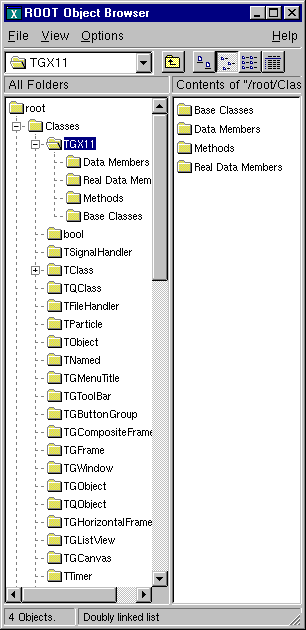
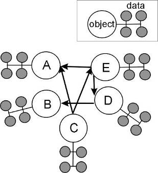
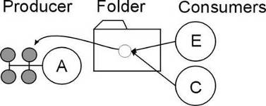
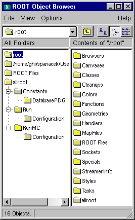
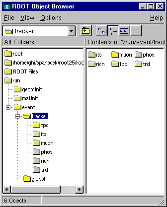

# Folders and Tasks


## Folders




A **`TFolder`** is a collection of objects
visible and expandable in the ROOT object browser. Folders have a name
and a title and are identified in the folder hierarchy by an "UNIX-like"
naming convention. The base of all folders is `//root`. It is visible at
the top of the left panel in the browser. The browser shows several
folders under `//root`.

New folders can be added and removed to/from a folder.

## Why Use Folders?


One reason to use folders is to reduce class dependencies and improve
modularity. Each set of data has a producer class and one or many
consumer classes. When using folders, the producer class places a
pointer to the data into a folder, and the consumer class retrieves a
reference to the folder.

The consumer can access the objects in a folder by specifying the path
name of the folder.

Here is an example of a folder's path name:

`//root/Event/Hits/TCP`

One does not have to specify the full path name. If the partial path
name is unique, it will find it; otherwise it will return the first
occurrence of the path.

The first diagram shows a system without folders. The objects have
pointers to each other to access each other's data. Pointers are an
efficient way to share data between classes. However, a direct pointer
creates a direct coupling between classes. This design can become a very
tangled web of dependencies in a system with a large number of classes.



In the second diagram, a reference to the data is in the folder and the
consumers refer to the folder rather than each other to access the data.
The naming and search service provided by the ROOT folders hierarchy
provides an alternative. It loosely couples the classes and greatly
enhances I/O operations. In this way, folders separate the data from the
algorithms and greatly improve the modularity of an application by
minimizing the class dependencies.



In addition, the folder hierarchy creates a picture of the data
organization. This is useful when discussing data design issues or when
learning the data organization. The example below illustrates this
point.

## How to Use Folders


Using folders means to build a hierarchy of folders, posting the
reference to the data in the folder by the producer, and creating a
reference to the folder by the user.

### Creating a Folder Hierarchy


To create a folder hierarchy you add the top folder of your hierarchy to
`//root`. Then you add a folder to an existing folder with the
**`TFolder::AddFolder`** method. This method takes two parameters: the
name and title of the folder to be added. It returns a pointer of the
newly created folder.

The code below creates the folder hierarchy shown in the browser. In
this macro, the folder is also added to the list of browsable. This way,
it is visible in the browser on the top level.

``` {.cpp}
{
   // Add the top folder of my hierary to //root
   TFolder *aliroot=gROOT->GetRootFolder()->AddFolder("aliroot",
                                   "aliroot top level folders");
   // Add the hierarchy to the list of browsables
   gROOT->GetListOfBrowsables()->Add(aliroot,"aliroot");

   // Create and add the constants folder
   TFolder *constants=aliroot->AddFolder("Constants",
                                         "Detector constants");

   // Create and add the pdg folder to pdg
   TFolder *pdg = constants->AddFolder("DatabasePDG","PDG database");

   // Create and add the run folder
   TFolder *run = aliroot->AddFolder("Run","Run dependent folders");

   // Create and add the configuration folder to run
   TFolder *configuration = run->AddFolder("Configuration",
                                           "Run configuration");

   // Create and add the run_mc folder
   TFolder *run_mc = aliroot->AddFolder("RunMC",
                     "MonteCarlo run dependent folders");

   // Create and add the configuration_mc folder to run_mc
   TFolder *configuration_mc = run_mc->AddFolder("Configuration",
                                    "MonteCarlo run configuration");
}
```

### Posting Data to a Folder (Producer)




A **`TFolder`** can contain other folders as shown above or any
**`TObject`** descendents. In general, users will not post a single
object to a folder; they will store a collection or multiple collections
in a folder. For example, to add an array to a folder:

``` {.cpp}
TObjArray *array;
run_mc->Add(array);
```

### Reading Data from a Folder (Consumer)


One can search for a folder or an object in a folder using the
`TROOT::FindObjectAny` method. It analyzes the string passed as its
argument and searches in the hierarchy until it finds an object or
folder matching the name. With `FindObjectAny`, you can give the full
path name, or the name of the folder. If only the name of the folder is
given, it will return the first instance of that name. A string-based
search is time consuming. If the retrieved object is used frequently or
inside a loop, you should save a pointer to the object as a class data
member. Use the naming service only in the initialization of the
consumer class. When a folder is deleted, any reference to it in the
parent or other folder is deleted also.

``` {.cpp}
   conf=(TFolder*)gROOT->FindObjectAny("/aliroot/Run/Configuration");
   // or ...
   conf=(TFolder*)gROOT->FindObjectAny("Configuration");
```

By default, a folder does not own the object it contains. You can
overwrite that with `TFolder::SetOwner`. Once the folder is the owner of
its contents, the contents are deleted when the folder is deleted. Some
ROOT objects are automatically added to the folder hierarchy. For
example, the following folders exist on start up:

`//root/ROOT Files` with the list of open Root files

`//root/Classes` with the list of active classes

`//root/Geometries` with active geometries

`//root/Canvases` with the list of active canvases

`//root/Styles` with the list of graphics styles

`//root/Colors` with the list of active colors

For example, if a file `myFile.root` is added to the list of files, one
can retrieve a pointer to the corresponding **`TFile`** object with a
statement like:

``` {.cpp}
   TFile *myFile = (TFile*)gROOT->FindObjectAny(
      "/ROOTFiles/myFile.root");
   //or...
   TFile *myFile = (TFile*)gROOT->FindObjectAny("myFile.root");
```

## Tasks


Tasks can be organized into a hierarchy and displayed in the browser.
The **`TTask`** class is the base class from which the tasks are
derived. To give task functionality, you need to subclass the
**`TTask`** class and override the `Exec` method. An example of
**`TTask`** subclasses` is $ROOTSYS/tutorials/MyTasks.cxx`. The script
that creates a task hierarchy and adds it to the browser is
\$`ROOTSYS/tutorials/tasks.C`. Here is a part of `MyTasks.cxx` that
shows how to subclass from **`TTask`**.

``` {.cpp}
// A set of classes deriving from TTask see macro tasks.C. The Exec
// function of each class prints one line when it is called.
#include "TTask.h"
class MyRun : public TTask {
public:
   MyRun() { ; }
   MyRun(const char *name,const char *title);
   virtual ~MyRun() { ; }
   void Exec(Option_t *option="");
   ClassDef(MyRun,1)         // Run Reconstruction task
};

class MyEvent : public TTask {
public:
   MyEvent() { ; }
   MyEvent(const char *name,const char *title);
   virtual ~MyEvent() { ; }
   void Exec(Option_t *option="");
   ClassDef(MyEvent,1)   // Event Reconstruction task
};
```

Later in `MyTasks.cxx`, we can see examples of the constructor and
overridden `Exec()` method:

``` {.cpp}
ClassImp(MyRun)
MyRun::MyRun(const char *name,const char *title):TTask(name,title)
{
...
}
void MyRun::Exec(Option_t *option)
{
   printf("MyRun executingn");
}
```

Each **`TTask`** derived class may contain other **`TTasks`** that can
be executed recursively. In this way, a complex program can be
dynamically built and executed by invoking the services of the top level
task or one of its subtasks. The constructor of **`TTask`** has two
arguments: the name and the title. This script creates the task defined
above, and creates a hierarchy of tasks.

``` {.cpp}
// Show the tasks in a browser. To execute a Task, select
// "ExecuteTask" in the context menu see also other functions in the
// TTask context menu, such as:
//           -setting a breakpoint in one or more tasks
//           -enabling/disabling one task, etc
void tasks() {
   gROOT->ProcessLine(".L MyTasks.cxx+");

   TTask *run = new MyRun("run","Process one run");
   TTask *event = new MyEvent("event","Process one event");
   TTask *geomInit = new MyGeomInit("geomInit",
                         "Geometry Initialisation");
   TTask *matInit    = new MyMaterialInit("matInit",
                         "MaterialsInitialisation");
   TTask *tracker = new MyTracker("tracker","Tracker manager");
   TTask *tpc     = new MyRecTPC("tpc","TPC Reconstruction");
   TTask *its     = new MyRecITS("its","ITS Reconstruction");
   TTask *muon    = new MyRecMUON("muon","MUON Reconstruction");
   TTask *phos    = new MyRecPHOS("phos","PHOS Reconstruction");
   TTask *rich    = new MyRecRICH("rich","RICH Reconstruction");
   TTask *trd     = new MyRecTRD("trd","TRD Reconstruction");
   TTask *global  = new MyRecGlobal("global","Global Reconstruction");

   // Create a hierarchy by adding sub tasks
   run->Add(geomInit);
   run->Add(matInit);
   run->Add(event);
   event->Add(tracker);
   event->Add(global);
   tracker->Add(tpc);
   tracker->Add(its);
   tracker->Add(muon);
   tracker->Add(phos);
   tracker->Add(rich);
   tracker->Add(trd);

   // Add the top level task
   gROOT->GetListOfTasks()->Add(run);

   // Add the task to the browser
   gROOT->GetListOfBrowsables()->Add(run);
   new TBrowser;
}
```



Note that the first line loads the class definitions in `MyTasks.cxx`
with ACLiC. ACLiC builds a shared library and adds the classes to the
Cling dictionary. See "Adding a Class with ACLiC".

To execute a **`TTask`**, you call the `ExecuteTask` method.
`ExecuteTask` will recursively call:

- the `TTask::Exec `method of the derived class;

- the `TTask::ExecuteTasks` to execute for each task the list of its
subtasks;

If the top level task is added to the list of ROOT browsable objects,
the tree of tasks can be seen in the ROOT browser. To add it to the
browser, get the list of browsable objects first and add it to the
collection.

``` {.cpp}
   gROOT->GetListOfBrowsables()->Add(run);
```

The first parameter of the `Add` method is a pointer to a **`TTask`**,
the second parameter is the string to show in the browser. If the string
is left out, the name of the task is used.

After executing, the script above the browser will look like in this
figure.

## Execute and Debug Tasks


The browser can be used to start a task, set break points at the
beginning of a task or when the task has completed. At a breakpoint,
data structures generated by the execution up this point may be
inspected asynchronously and then the execution can be resumed by
selecting the "`Continue`" function of a task.

A task may be active or inactive (controlled by `TTask::SetActive`).
When a task is inactive, its sub tasks are not executed. A task tree may
be made persistent, saving the status of all the tasks.
