# The Geometry Package
\index{Geometry}

The new ROOT geometry package is a tool for building, browsing,
navigating and visualizing detector geometries. The code works
standalone with respect to any tracking Monte-Carlo engine; therefore,
it does not contain any constraints related to physics. However, the
navigation features provided by the package are designed to optimize
particle transport through complex geometries, working in correlation
with simulation packages such as GEANT3, GEANT4 and FLUKA.

## Quick Start: Creating the "world"

This chapter will provide a detailed description on how to build valid
geometries as well as the ways to optimize them. There are several
components gluing together the geometrical model, but for the time being
let us get used with the most basic concepts.

The basic bricks for building-up the model are called
`volumes`**.**These represent the un-positioned pieces of the geometry
puzzle. The difference is just that the relationship between the pieces
is not defined by neighbors, but by `containment`. In other words,
volumes are put one inside another making an in-depth hierarchy. From
outside, the whole thing looks like a big pack that you can open finding
out other smaller packs nicely arranged waiting to be opened at their
turn. The biggest one containing all others defines the "`world`" of the
model. We will often call this `master reference system (MARS)`. Going
on and opening our packs, we will obviously find out some empty ones,
otherwise, something is very wrong... We will call these leaves (by
analogy with a tree structure).

On the other hand, any volume is a small world by itself - what we need
to do is to take it out and to ignore all the rest since it is a
self-contained object. In fact, the modeller can act like this,
considering a given volume as temporary MARS, but we will describe this
feature later on. Let us focus on the biggest pack - it is mandatory to
define one. Consider the simplest geometry that is made of a single box.
Here is an example on how to build it:

### Example 1: Creating the World

We first need to load the geometry library. This is not needed if one
does `make map` in root folder.

``` {.cpp}
root[] gSystem->Load("libGeom");
```

Second, we have to create an instance of the geometry manager class.
This takes care of all the modeller components, performing several tasks
to insure geometry validity and containing the user interface for
building and interacting with the geometry. After its creation, the
geometry manager class can be accessed with the global
***`gGeoManager`***:

``` {.cpp}
root[] new TGeoManager("world", "the simplest geometry");
```

We want to create a single volume in our geometry, but since any volume
needs to have an associated medium, we will create a dummy one. You can
safely ignore the following lines for the time being, since materials
and media will be explained in detail later on.

``` {.cpp}
root[] TGeoMaterial *mat = new TGeoMaterial("Vacuum",0,0,0);
root[] TGeoMedium   *med = new TGeoMedium("Vacuum",1,mat);
```

We can finally make our volume having a box shape. Note that the world
volume does not need to be a box - it can be any other shape. Generally,
boxes and tubes are the most recommendable shapes for this purpose due
to their fast navigation algorithms.

``` {.cpp}
root[] TGeoVolume *top=gGeoManager->MakeBox("Top",med,10.,10.,10.);
```

The default units are in centimeters. Now we want to make this volume
our world. We have to do this operation **before** closing the geometry.

``` {.cpp}
root[] gGeoManager->SetTopVolume(top);
```

This should be enough, but it is not since always after defining some
geometry hierarchy, **`TGeo`** needs to build some optimization
structures and perform some checks. Note the messages posted after the
statement is executed. We will describe the corresponding operations
later.

``` {.cpp}
root[] gGeoManager->CloseGeometry();
```

Now we are really done with geometry building stage, but we would like
to see our simple world:

``` {.cpp}
root[] top->SetLineColor(kMagenta);
root[] gGeoManager->SetTopVisible(); // the TOP is invisible
root[] top->Draw();
```

### Example 2: A Geometrical Hierarchy Look and Feel

Before going further, let us get a look and feel of interacting with the
modeller. For this, we will use one of the examples illustrating the
geometry package. To get an idea on the geometry structure created in
this example, just look at the link:
<http://root.cern.ch/root/html/tutorials/geom/rootgeom.C.html>. You will
notice that this is a bit more complex that just creating the "world"
since several other volumes are created and put together in a hierarchy.
The purpose here is just to learn how to interact with a geometry that
is already built, but just few hints on the building steps in this
example might be useful. The geometry here represents the word ROOT that
is replicated in some symmetric manner. You might for instance ask some
questions after having a first look:

***`Q:`*** "OK, I understand the first lines that load the libGeom library and create
a geometry manager object. I also recognize from the previous example the following
lines creating some materials and media, but what about the geometrical transformations below?"

***`A:`*** As explained before, the model that we are trying to create
is a hierarchy of volumes based on ***`containment`***. This is
accomplished by ***`positioning`*** some volumes ***`inside`*** others.
Any volume is an un-positioned object in the sense that it defines only
a ***`local frame`*** (matching the one of its ***`shape`***). In order
to fully define the mother-daughter relationship between two volumes one
has to specify how the daughter will be positioned inside. This is
accomplished by defining a ***`local geometrical transformation`*** of
the daughter with respect to the mother coordinate system. These
transformations will be subsequently used in the example.

***`Q:`*** "I see the lines defining the top level volume as in the previous example,
but what about the other volumes named REPLICA and ROOT?"

***`A:`*** You will also notice that several other volumes are created
by using lines like:

``` {.cpp}
TGeoVolume *someVolume = gGeoManager->MakeXXX("someName",
ptrMedium, /* parameters coresponding to XXX ...*/)
```

In the method above **`XXX`** represent some shape name (Box, Tube,
etc.). This is just a simple way of creating a volume having a given
shape in one-step (see also section: "Creating and Positioning
Volumes"). As for REPLICA and ROOT volumes, they are just some
***`virtual volumes`*** used for grouping and positioning together other
***`real volumes`***. See "Positioned Volumes (Nodes)". The same
structure represented by (a real or) a virtual volume can be
***`replicated`*** several times in the geometry.

***`Q:`*** "Fine, so probably the real volumes are the ones composing the letters R,
O and T. Why one have to define so many volumes to make an R?"

***`A:`*** Well, in real life some objects have much more complex shapes
that an ***`R`***. The modeller cannot just know all of them; the idea
is to make a complex object by using elementary building blocks that
have known shapes (called ***`primitive shapes`***). Gluing these
together in the appropriate way is the user responsibility.

***`Q:`*** "I am getting the global picture but not making much out of it... There
are also a lot of calls to TGeoVolume::AddNode() that I do not understand."

***`A:`*** A volume is positioned inside another one by using this
method. The relative geometrical transformation as well as a copy number
must be specified. When positioned, a volume becomes a ***`node`*** of
its container and a new object of the class **`TGeoNode`** is
automatically created. This method is therefore the key element for the
creation of a hierarchical link between two volumes. As it will be
described further on in this document, there are few other methods
performing similar actions, but let us keep things simple for the time
being. In addition, notice that there are some visualization-related
calls in the example followed by a final `TGeoVolume::Draw() `call for
the top volume. These are explained in details in the section
"Visualization Settings and Attributes". At this point, you will
probably like to see how this geometry looks like. You just need to run
the example and you will get the following picture that you can rotate
using the mouse; or you can zoom / move it around (see what the Help
menu of the GL window displays).

``` {.cpp}
% root rootgeom.C
```

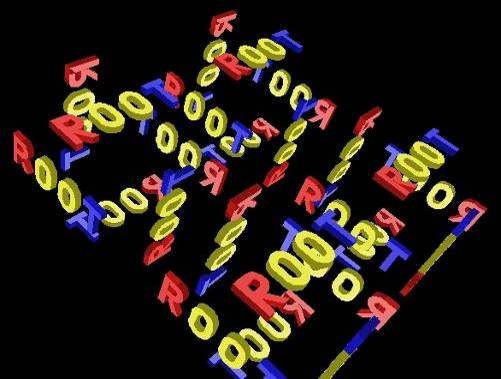

Now let us browse the hierarchy that was just created. Start a browser
and double-click on the item simple1 representing the
***`gGeoManager`*** object. Note that right click opens the context menu
of the manager class where several global methods are available.

``` {.cpp}
root[] new TBrowser;
```

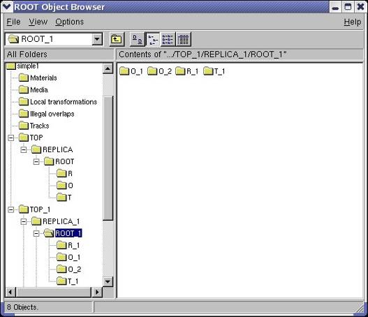

The folders `Materials`, `Media` and `Local transformations` are in fact
the containers where the geometry manager stores the corresponding
objects. The `Illegal overlaps` folder is empty but can be filled after
performing a geometry validity check (see section: "Checking the
Geometry"). If tracking is performed using **`TGeo`**, the folder
`Tracks` might contain user-defined tracks that can be
visualized/animated in the geometry context (see section: "Creating and
Visualizing Tracks"). Since for the time being we are interested more in
the geometrical hierarchy, we will focus on the last two displayed items
`TOP `and `TOP_1`. These are the top volume and the corresponding top
node in the hierarchy.

Double clicking on the `TOP` volume will unfold all different volumes
contained by the top volume. In the right panel, we will see all the
volumes contained by `TOP` (if the same is positioned 4 times we will
get 4 identical items). This rule will apply to any clicked volume in
the hierarchy. Note that right clicking a volume item activates the
volume context menu containing several specific methods. We will call
the volume hierarchy developed in this way as the
`logical geometry graph`. The volume objects are nodes inside this graph
and the same volume can be accessed starting from different branches.

On the other hand, the real geometrical objects that are seen when
visualizing or tracking the geometry are depicted in the `TOP_1` branch.
These are the nodes of the `physical` `tree` of positioned volumes
represented by **`TGeoNode`** objects. This hierarchy is a tree since a
node can have only one parent and several daughters. For a better
understanding of the hierarchy, have a look at
<http://root.cern.ch/root/htmldoc/TGeoManager.html>.

Just close now the `X3D` window and focus at the wire frame picture
drawn in a pad. Activate Options/Event Status. Moving the mouse in the
pad, you will notice that objects are sometimes changing color to red.
Volumes are highlighted in this way whenever the mouse pointer is close
enough to one of its vertices. When this happens, the corresponding
volume is selected and you will see in the bottom right size of the ROOT
canvas its name, shape type and corresponding path in the physical tree.
Right clicking on the screen when a volume is selected will also open
its context menu (picking). Note that there are several actions that can
be performed both at view (no volume selected) and volume level.

**`TView`** (mouse not selecting any volume):

-   Click-and-drag rotates the view.
-   Pressing some keys perform different actions:
-   J/K - zoom / unzoom
-   H, L, U, I - move the viewpoint
-   Right click + `SetParallel` `()/SetPerspective` `()` - switch from
    parallel to perspective view.
-   Right click + `ShowAxis()` - show coordinate axes.
-   Right click + `Centered/Left/Side/Top` - change view direction.

**`TGeoVolume`** (mouse selecting a volume):

-   Double click will focus the corresponding volume.
-   Right click + `CheckOverlaps()` - run overlap checker on current
    volume.
-   Right click + `Draw` `()` - draw that volume according current
    global visualization options
-   Right click + `DrawOnly()`***` - `***draw only the selected volume.
-   Right click + `InspectShape/Material()` - print info about shape or
    material.
-   Right click + `Raytrace()` - initiate a ray tracing algorithm on
    current view.
-   Right click + `RandomPoints/Rays()` - shoot random points or rays
    inside the bounding box of the clicked volume and display only those
    inside visible volumes.
-   Right click + `Weight()` - estimates the weight of a volume within a
    given precision.

Note that there are several additional methods for visibility and line
attributes settings.

## Materials and Tracking Media

We have mentioned that volumes are the building blocks for geometry, but
they describe real objects having well defined properties. In fact,
there are just two of them: the material they are made from and their
geometrical `shape`. These have to be created before creating the volume
itself, so we will describe the bits and pieces needed for making the
geometry before moving to an architectural point of view.

As far as materials are concerned, they represent the physical
properties of the solid from which a volume is made. Materials are just
a support for the data that has to be provided to the tracking engine
that uses this geometry package. Due to this fact, the
**`TGeoMaterial`** class is more like a thin data structure needed for
building the corresponding native materials of the Monte-Carlo tracking
code that uses **`TGeo`**.

### Elements, Materials and Mixtures

In order to make easier material and mixture creation, one can use the
pre-built table of elements owned by **`TGeoManager`** class:

``` {.cpp}
TGeoElementTable *table = gGeoManager->GetElementTable();
TGeoElement *element1 = table->GetElement(Int_t Z);
TGeoElement *element2 = table->FindElement("Copper");
```

Materials made of single elements can be defined by their atomic mass
(`A`), charge (`Z`) and density (`rh`o). One can also create a material
by specifying the element that it is made of. Optionally the radiation
and absorption lengths can be also provided; otherwise they can be
computed on-demand [`G3`]. The class representing them is
**`TGeoMaterial`**:

``` {.cpp}
TGeoMaterial(const char *name,Double_t a,Double_t z,
    Double_t density, Double_t radlen=0,Double_t intlen=0);
TGeoMaterial(const char *name, TGeoElement *elem,
    Double_t density);
TGeoMaterial(const char* name, Double_t a, Double_t z,
    Double_t rho,
    TGeoMaterial::EGeoMaterialState state,
    Double_t temperature = STP_temperature,
    Double_t pressure = STP_pressure)
```

Any material or derived class is automatically indexed after creation.
The assigned index is corresponding to the last entry in the list of
materials owned by **`TGeoManager`** class. This can be changed using
the **`TGeoMaterial`**`::SetIndex()` method, however it is not
recommended while using the geometry package interfaced with a transport
MC. Radiation and absorption lengths can be set using:

``` {.cpp}
TGeoMaterial::SetRadLen(Double_t radlen, Double_t intlen);
```

-   `radlen:` radiation length. If `radlen<=0` the value is computed
    using GSMATE algorithm in GEANT3
-   `intlen:` absorption length

Material state, temperature and pressure can be changed via setters.
Another material property is transparency. It can be defined and used
while viewing the geometry with OpenGL.

``` {.cpp}
void SetTransparency (Char_t transparency = 0)
```

-   `transparency:` between 0 (opaque default) to 100 (fully
    transparent)

One can attach to a material a user-defined object storing Cerenkov
properties. Another hook for material shading properties is currently
not in use. Mixtures are materials made of several elements. They are
represented by the class **`TGeoMixture`**, deriving from
**`TGeoMaterial`** and defined by their number of components and the
density:

``` {.cpp}
TGeoMixture(const char *name,Int_t nel,Double_t rho);
```

Elements have to be further defined one by one:

``` {.cpp}
void TGeoMixture::DefineElement(Int_t iel,Double_t a,Double_t z,
    Double_t weigth);
void TGeoMixture::DefineElement(Int_t iel, TGeoElement *elem,
    Double_t weight);
void TGeoMixture::DefineElement(Int_t iel, Int_t z, Int_t natoms);
```

or:

``` {.cpp}
void AddElement(TGeoMaterial* mat, Double_t weight);
void AddElement(TGeoElement* elem, Double_t weight);
void AddElement(TGeoElement* elem, Int_t natoms);
void AddElement(Double_t a, Double_t z, Double_t weight)
```

-   `iel:` index of the element` [0,nel-1]`
-   `a` and `z:` the atomic mass and charge
-   `weight:` proportion by mass of the elements
-   `natoms`: number of atoms of the element in the molecule making the
    mixture

The radiation length is automatically computed when all elements are
defined. Since tracking MC provide several other ways to create
materials/mixtures, the materials classes are likely to evolve as the
interfaces to these engines are being developed. Generally in the
process of tracking material properties are not enough and more specific
media properties have to be defined. These highly depend on the MC
performing tracking and sometimes allow the definition of different
media properties (e.g. energy or range cuts) for the same material.

### Radionuclides

A new class **`TGeoElementRN`** was introduced in this version to
provide support for radioactive nuclides and their decays. A database of
3162 radionuclides can be loaded on demand via the table of elements
(**`TGeoElementTable`** class). One can make then materials/mixtures
based on these radionuclides and use them in a geometry

``` {.cpp}
root[] TGeoManager *geom = new TGeoManager("geom","radionuclides");
root[] TGeoElementTable *table = geom->GetElementTable();
root[] TGeoElementRN *c14 = table->GetElementRN(14,6);  // A,Z
root[] c14->Print();
6-C-014 ENDF=60140; A=14; Z=6; Iso=0; Level=0[MeV]; Dmass=3.0199[MeV];
Hlife=1.81e+11[s]  J/P=0+; Abund=0; Htox=5.8e-10; Itox=5.8e-10; Stat=0
Decay modes:
BetaMinus            Diso:   0 BR:   100.000% Qval: 0.1565
```

One can make materials or mixtures from radionuclides:

``` {.cpp}
root[] TGeoMaterial *mat = new TGeoMaterial("C14", c14, 2.0);
```

The following properties of radionuclides can be currently accessed via
getters in the **`TGeoElementRN`** class:

Atomic number and charge (from the base class **`TGeoElement`**)

-   Isomeric number (`ISO`)
-   ENDF code - following the convention: `ENDF=10000*Z+100*A+ISO`
-   Isomeric energy level [`MeV`]
-   Mass excess [`MeV`]
-   Half life [`s`]
-   Spin/Parity - can be retrieved with: `TGeoElementRN::GetTitle()`
-   Hynalation and ingestion toxicities
-   List of decays - `TGeoElementRN::GetDecays()`

The radioactive decays of a radionuclide are represented by the class
**`TGeoDecayChannel`** and they are stored in a **`TObjArray`**. Decay
provides:

-   Decay mode
-   Variation of isomeric number
-   `Q` value for the decay [`GeV`]
-   Parent element
-   Daughter element

Radionuclides are linked one to each other via their decays, until the
last element in the decay chain which must be stable. One can iterate
decay chains using the iterator **`TGeoElemIter`**:

``` {.cpp}
root[] TGeoElemIter next(c14);
root[] TGeoElementRN *elem;
root[] while ((elem=next())) next.Print();
6-C-014 (100% BetaMinus) T1/2=1.81e+11
7-N-014 stable
```

To create a radioactive material based on a radionuclide, one should
use the constructor:

``` {.cpp}
TGeoMaterial(const char *name, TGeoElement *elem, Double_t density)
```

To create a radioactive mixture, one can use radionuclides as well as
stable elements:

``` {.cpp}
TGeoMixture(const char *name, Int_t nelements, Double_t density);
TGeoMixture::AddElement(TGeoElement *elem,
    Double_t weight_fraction);
```

Once defined, one can retrieve the time evolution for the radioactive
materials/mixtures by using one of the next two methods:

1. `TGeoMaterial::FillMaterialEvolution(TObjArray *population,`
`                                      Double_t   precision=0.001)`

To use this method, one has to provide an empty **`TObjArray`** object
that will be filled with all elements coming from the decay chain of the
initial radionuclides contained by the material/mixture. The precision
represent the cumulative branching ratio for which decay products are
still considered.

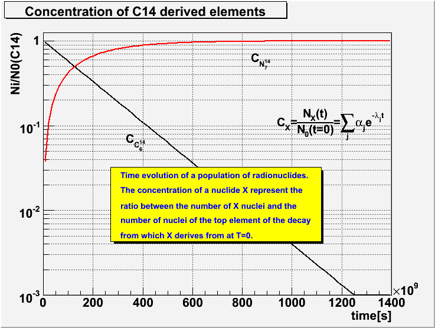

The population list may contain stable elements as well as
radionuclides, depending on the initial elements. To test if an element
is a radionuclide:

``` {.cpp}
Bool_t TGeoElement::IsRadioNuclide() const
```

All radionuclides in the output population list have attached objects
that represent the time evolution of their fraction of nuclei with
respect to the top radionuclide in the decay chain. These objects
(Bateman solutions) can be retrieved and drawn:

``` {.cpp}
TGeoBatemanSol *TGeoElementRN::Ratio();
void TGeoBatemanSol::Draw();
```

Another method allows to create the evolution of a given radioactive
material/mixture at a given moment in time:

2. `TGeoMaterial::DecayMaterial(Double_t time, Double_t precision=0.001)`

The method will create the mixture that result from the decay of a
initial material/mixture at time, while all resulting elements having a
fractional weight less than precision are excluded.

A demo macro for radioactive material features is
`$ROOTSYS/tutorials/geom/RadioNuclides.C` It demonstrates also the decay
of a mixture made of radionuclides.


### Tracking Media

The class **`TGeoMedium`** describes tracking media properties. This has
a pointer to a material and the additional data members representing the
properties related to tracking.

``` {.cpp}
TGeoMedium(const char *name,Int_t numed,TGeoMaterial *mat,
           Double_t *params=0);
```

-   `name:` name assigned to the medium
-   `mat:` pointer to a material
-   `params:` array of additional parameters

Another constructor allows effectively defining tracking parameters in
GEANT3 style:

``` {.cpp}
TGeoMedium(const char *name,Int_t numed,Int_t imat,Int_t ifield,
Double_t fieldm,Double_t tmaxfd,Double_t stemax,
Double_t deemax,Double_t epsil,Double_t stmin);
```

This constructor is reserved for creating tracking media from the VMC
interface [...]:

-   `numed:` user-defined medium index
-   `imat:` unique ID of the material
-   `others:` see G3 documentation

Looking at our simple world example, one can see that for creating
volumes one needs to create tracking media before. The way to proceed
for those not interested in performing tracking with external MC's is to
define and use only one `dummy tracking medium` as in the example (or a
`NULL` pointer).

### User Interface for Handling Materials and Media

The **`TGeoManager`** class contains the API for accessing and handling
defined materials:

``` {.cpp}
TGeoManager::GetMaterial(name);
```

## Shapes

Shapes are geometrical objects that provide the basic modeling
functionality. They provide the definition of the `local` coordinate
system of the volume. Any volume must have a shape. Any shape recognized
by the modeller has to derive from the base **`TGeoShape`** class,
providing methods for:

-   Finding out if a point defined in their local frame is contained or
    not by the shape;
-   Computing the distance to enter/exit the shape from a local point,
    given a known direction;
-   Computing the maximum distance in any direction from a local point
    that does NOT result in a boundary crossing of the shape (safe
    distance);
-   Computing the cosines of the normal vector to the crossed shape
    surface, given a starting local point and an ongoing direction.

All the features above are globally managed by the modeller in order to
provide navigation functionality. In addition to those, shapes have also
to implement additional specific abstract methods:

-   Computation of the minimal box bounding the shape, given that this
    box have to be aligned with the local coordinates;
-   Algorithms for dividing the shape along a given axis.

The modeller currently provides a set of 20 basic shapes, which we will
call `primitives`. It also provides a special class allowing the
creation of shapes as a result of Boolean operations between primitives.
These are called `composite shapes` and the composition operation can be
recursive (combined composites). This allows the creation of a quite
large number of different shape topologies and combinations. You can
have a look and run the tutorial:
<http://root.cern.ch/root/html/examples/geodemo.C.html>

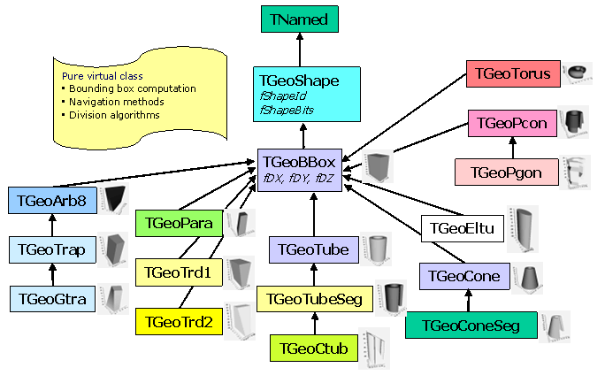

Shapes are named objects and all primitives have constructors like:

``` {.cpp}
TGeoXXX(const char *name,<type> param1,<type> param2, ...);
TGeoXXX(<type> param1,<type> param2, ...);
```

Naming shape primitive is mandatory only for the primitives used in
Boolean composites (see "Composite Shapes"). For the sake of simplicity,
we will describe only the constructors in the second form.

### Units

The length units used in the geometry are **arbitrary**. However, there
are certain functionalities that work with the assumption that the used
lengths are expressed in centimeters. This is the case for shape
capacity or volume weight computation. The same is valid when using the
ROOT geometry as navigator for an external transport MC package (e.g.
GEANT) via the VMC interface.

Other units in use: All angles used for defining rotation matrices or
some shape parameters are expressed in **degrees**. Material density is
expressed in [**g/cm3**].

### Primitive Shapes

#### Boxes - TGeoBBox Class

Normally a box has to be build only with 3 parameters: `DX,DY,DZ`
representing the half-lengths on X, Y and Z-axes. In this case, the
origin of the box will match the one of its reference frame and the box
will range from: `-DX` to `DX` on X-axis, from `-DY` to `DY` on Y and
from `-DZ` to `DZ` on Z. On the other hand, any other shape needs to
compute and store the parameters of their minimal bounding box. The
bounding boxes are essential to optimize navigation algorithms.
Therefore all other primitives derive from **`TGeoBBox`**. Since the
minimal bounding box is not necessary centered in the origin, any box
allows an origin translation `(Ox`,`Oy`,`Oz)`. All primitive
constructors automatically compute the bounding box parameters. Users
should be aware that building a translated box that will represent a
primitive shape by itself would affect any further positioning of other
shapes inside. Therefore it is highly recommendable to build
non-translated boxes as primitives and translate/rotate their
corresponding volumes only during positioning stage.

``` {.cpp}
TGeoBBox(Double_t dx,Double_t dy,Double_t dz,Double_t *origin=0);
```


#### Parallelepiped - TGeoPara class

A parallelepiped is a shape having 3 pairs of parallel faces out of
which one is parallel with the XY plane (Z faces). All faces are
parallelograms in the general case. The Z faces have 2 edges parallel
with the X-axis.

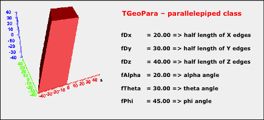

The shape has the center in the origin and it is defined by:

-   `dX, dY, dZ:` half-lengths of the projections of the edges on X, Y
    and Z. The lower Z face is positioned at `-dZ`, while the upper at
    `+dZ`.
-   `alpha:` angle between the segment defined by the centers of the
    X-parallel edges and Y axis `[-90,90]` in degrees
-   `theta:` theta angle of the segment defined by the centers of the Z
    faces;
-   `phi:` phi angle of the same segment

``` {.cpp}
TGeoPara(dX,dY,dZ,alpha,theta,phi);
```

A box is a particular parallelepiped having the parameters:
`(dX,dY,dZ,0.,0.,0.)`.

#### Trapezoids

In general, we will call trapezoidal shapes having 8 vertices and up to
6 trapezoid faces. Besides that, two of the opposite faces are parallel
to XY plane and are positioned at ` dZ`. Since general trapezoids are
seldom used in detector geometry descriptions, there are several
primitives implemented in the modeller for particular cases.

`Trd1` is a trapezoid with only X varying with Z. It is defined by the
half-length in Z, the half-length in X at the lowest and highest Z
planes and the half-length in Y:

``` {.cpp}
TGeoTrd1(Double_t dx1,Double_t dx2,Double_t dy,Double_t dz);
```


`Trd2` is a trapezoid with both X and Y varying with Z. It is defined by
the half-length in Z, the half-length in X at the lowest and highest Z
planes and the half-length in Y at these planes:

``` {.cpp}
TGeoTrd2(Double_t dx1,Double_t dx2,Double_t dy1,Double_t dy2, Double_t dz);
```

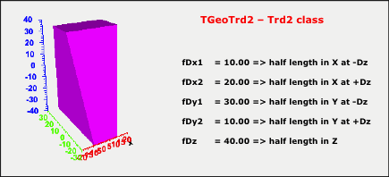

#### General Trapezoid - TGeoTrap Class

A general trapezoid is one for which the faces perpendicular to z are
trapezes but their centers are not necessary at the same x, y
coordinates.

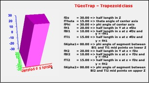

It has eleven parameters: the half length in z, the polar angles from
the center of the face at low z to that at high z, `H1` the half length
in y at low z, `LB1` the half length in x at low z and y low edge, `LB2`
the half length in x at low z and y high edge, **`TH1`** the angle with
respect to the y axis from the center of low y edge to the center of the
high y edge, and `H2,LB2,LH2,TH2`, the corresponding quantities at high
z.

``` {.cpp}
TGeoTrap(Double_t dz,Double_t theta,Double_t phi,
Double_t h1,Double_t bl1,Double_t tl1,Double_t alpha1,
Double_t h2,Double_t bl2,Double_t tl2,Double_t alpha2);
```

#### Twisted Trapezoid - TGeoGtra class

A twisted trapezoid is a general trapezoid defined in the same way but
that is twisted along the Z-axis. The twist is defined as the rotation
angle between the lower and the higher Z faces.

``` {.cpp}
TGeoGtra(Double_t dz,Double_t theta,Double_t phi,Double_t twist,
Double_t h1,Double_t bl1,Double_t tl1,Double_t alpha1,
Double_t h2,Double_t bl2,Double_t tl2,Double_t alpha2 );
```

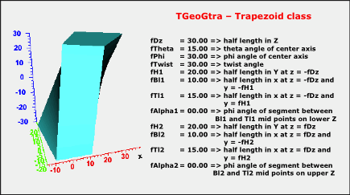

#### Arbitrary 8 vertices shapes - TGeoArb8 class

An `Arb8` is defined by two quadrilaterals sitting on parallel planes,
at `dZ`. These are defined each by 4 vertices having the coordinates
`(Xi,Yi,+/-dZ)`,` i=0`,` 3`. The lateral surface of the `Arb8` is
defined by the 4 pairs of edges corresponding to vertices (`i,i+1`) on
both `-dZ` and `+dZ`. If M and M' are the middles of the segments
`(i,i+1)` at `-dZ` and `+dZ`, a lateral surface is obtained by sweeping
the edge at `-dZ` along MM' so that it will match the corresponding one
at `+dZ`. Since the points defining the edges are arbitrary, the lateral
surfaces are not necessary planes - but twisted planes having a twist
angle linear-dependent on Z.

``` {.cpp}
TGeoArb8::TGeoArb8(Double_t dz,Double_t ivert);
```

-   `dz:` half-length in Z;
-   `ivert = [0,7]`

Vertices have to be defined clockwise in the XY pane, both at `+dz` and
`-dz`. The quadrilateral at `-dz` is defined by indices [0,3], whereas
the one at `+dz` by vertices [4,7]. The vertex with `index=7` has to be
defined last, since it triggers the computation of the bounding box of
the shape. Any two or more vertices in each Z plane can have the same
(X,Y) coordinates. It this case, the top and bottom quadrilaterals
become triangles, segments or points. The lateral surfaces are not
necessary defined by a pair of segments, but by pair segment-point
(making a triangle) or point-point (making a line). Any choice is valid
as long as at one of the end-caps is at least a triangle.

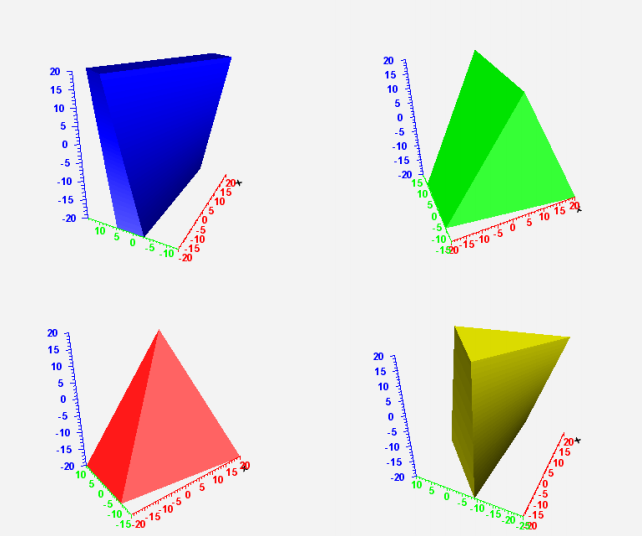

#### Tubes - TGeoTube Class

Tubes have Z as their symmetry axis. They have a range in Z, a minimum
and a maximum radius:

``` {.cpp}
TGeoTube(Double_t rmin,Double_t rmax,Double_t dz);
```

The full Z range is from `-dz` to `+dz`.

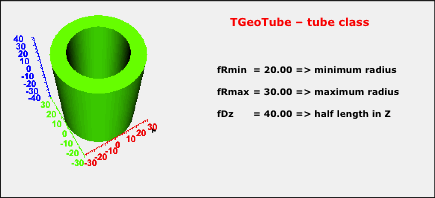

#### Tube Segments - TGeoTubeSeg Class

A tube segment is a tube having a range in phi. The tube segment class
derives from **`TGeoTube`**, having 2 extra parameters: `phi1` and
`phi2`.

``` {.cpp}
TGeoTubeSeg(Double_t rmin,Double_t rmax,Double_t dz,
Double_t phi1,Double_t phi2);
```

Here `phi1` and `phi2 `are the starting and ending `phi `values in
degrees. The `general phi convention` is that the shape ranges from
`phi1` to `phi2` going counterclockwise. The angles can be defined with
either negative or positive values. They are stored such that `phi1` is
converted to `[0,360]` and `phi2 > phi1`.

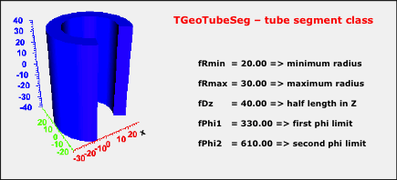

#### Cut Tubes - TGeoCtub Class

The cut tubes constructor has the form:

``` {.cpp}
TGeoCtub(Double_t rmin,Double_t rmax,Double_t dz,
Double_t phi1,Double_t phi2,
Double_t nxlow,Double_t nylow,Double_t nzlow, Double_t nxhi,
Double_t nyhi,Double_t nzhi);
```


A cut tube is a tube segment cut with two planes. The centers of the 2
sections are positioned at `dZ`. Each cut plane is therefore defined by
a point `(0,0,dZ)` and its normal unit vector pointing outside the
shape:

`Nlow=(Nx,Ny,Nz<0)`, `Nhigh=(Nx',Ny',Nz'>0)`.

#### Elliptical Tubes - TGeoEltu Class

An elliptical tube is defined by the two semi-axes A and B. It ranges
from `-dZ` to `+dZ` as all other tubes:

``` {.cpp}
TGeoEltu(Double_t a,Double_t b,Double_t dz);
```


#### Hyperboloids - TGeoHype Class

A hyperboloid is represented as a solid limited by two planes
perpendicular to the Z axis (top and bottom planes) and two hyperbolic
surfaces of revolution about Z axis (inner and outer surfaces). The
class describing hyperboloids is **`TGeoHype`** has 5 input parameters:

``` {.cpp}
TGeoHype(Double_t rin,Double_t stin,Double_t rout,
Double_t stout,Double_t dz);
```

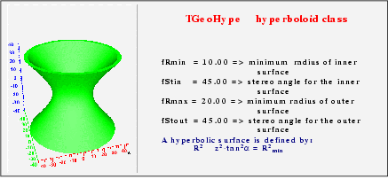

The hyperbolic surface equation is taken in the form:

``` {.cpp}
r2 - z2tan2() = r2min
```

-   `r,z:` cylindrical coordinates for a point on the surface
-   `:` stereo angle between the hyperbola asymptotic lines and Z axis
-   `r2min:` minimum distance between hyperbola and Z axis (at `z=0`)

The input parameters represent:

-   `rin, stin:` minimum radius and tangent of stereo angle for inner
    surface
-   `rout, stout:` minimum radius and tangent of stereo angle for outer
    surface
-   `dz:` half length in Z (bounding planes positions at `+/-dz`)

The following conditions are mandatory in order to avoid intersections
between the inner and outer hyperbolic surfaces in the range `+/-dz`:

-   `rin<rout`
-   `rout>0`
-   `rin2 + dz2*stin2 > rout2 + dz2*stout2`

Particular cases:

-   `rin=0, stin0:` the inner surface is conical
-   `stin=0 / stout=0:` cylindrical surface(s)

#### Cones - TGeoCone Class

The cones are defined by 5 parameters:

``` {.cpp}
TGeoCone(Double_t dz,Double_t rmin1,Double_t rmax1,
Double_t rmin2,Double_t rmax2);
```

-   `rmin1:` internal radius at Z is `-dz`
-   `rmax1:` external radius at Z is `-dz`
-   `rmin2:` internal radius at Z is `+dz`
-   `rmax2:` external radius at Z is `+dz`
-   `dz:` half length in Z (a cone ranges from `-dz` to +`dz`)

A cone has Z-axis as its symmetry axis.

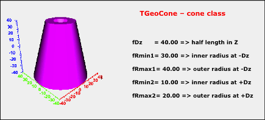

#### Cone Segments - TGeoConeSeg Class

A cone segment is a cone having a range in `phi.` The cone segment class
derives from **`TGeoCone`**, having two extra parameters: `phi1` and
`phi2`.

``` {.cpp}
TGeoConeSeg(Double_t dz,Double_t rmin1,Double_t rmax1,
Double_t rmin2,Double_t rmax2,Double_t phi1,Double_t phi2);
```

Parameters` phi1` and `phi2` have the same meaning and convention as for
tube segments.

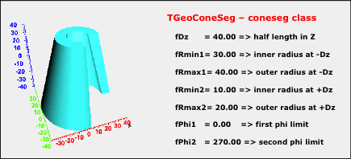

#### Sphere - TGeoSphere Class

Spheres in **`TGeo`** are not just balls having internal and external
radii, but sectors of a sphere having defined theta and phi ranges. The
**`TGeoSphere`** class has the following constructor.

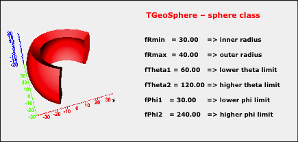

``` {.cpp}
TGeoSphere(Double_t rmin,Double_t rmax,Double_t theta1,
Double_t theta2,Double_t phi1, Double_t phi2);
```

-   `rmin: ` internal radius of the spherical sector
-   `rmax:` external radius
-   `theta1:` starting theta value [0, 180) in degrees
-   `theta2:` ending theta value (0, 180] in degrees (`theta1<theta2`)

#### Torus : TGeoTorus Class

The torus is defined by its axial radius, its inner and outer radius.


It may have a `phi `range:

``` {.cpp}
TGeoTorus(Double_t R,Double_t Rmin,Double_t Rmax,Double_t Phi1,
Double_t Dphi);
```

-   `R:` axial radius of the torus
-   `Rmin:` inner radius
-   `Rmax:` outer radius
-   `Phi1:` starting phi angle
-   `Dphi:` total phi range

#### Paraboloid : TGeoParaboloid Class

A paraboloid is defined by the revolution surface generated by a
parabola and is bounded by two planes perpendicular to Z axis. The
parabola equation is taken in the form: `z = a·r2 + b`, where:
`r2 = x2 + y2`. Note the missing linear term (parabola symmetric with
respect to Z axis).

The coefficients a and b are computed from the input values which are
the radii of the circular sections cut by the planes at `+/-dz`:

-   `-dz = a*r2low  + b`
-   ` dz = a*r2high + b`

``` {.cpp}
TGeoParaboloid(Double_t rlo,Double_t rhi,Double_t dz);
```

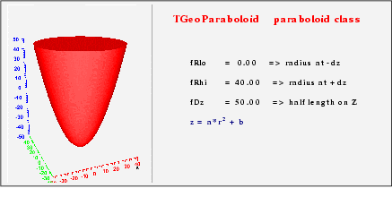

#### Polycone : TGeoPcon Class

A polycone is represented by a sequence of tubes/cones, glued together
at defined Z planes. The polycone might have a phi segmentation, which
globally applies to all the pieces. It has to be defined in two steps:

1. First call the **`TGeoPcon`** constructor to define a polycone:

``` {.cpp}
TGeoPcon(Double_t phi1,Double_t dphi,Int_t nz
```

-   `phi1:` starting phi angle in degrees
-   `dphi:` total phi range
-   `nz:` number of Z planes defining polycone sections (minimum 2)

2. Define one by one all sections [0, nz-1]

``` {.cpp}
void TGeoPcon::DefineSection(Int_t i,Double_t z,
Double_t rmin, Double_t rmax);
```

-   `i:` section index [0, nz-1]
-   `z:` z coordinate of the section
-   `rmin:` minimum radius corresponding too this section
-   `rmax:` maximum radius.

The first section (`i=0`) has to be positioned always the lowest Z
coordinate. It defines the radii of the first cone/tube segment at its
lower Z. The next section defines the end-cap of the first segment, but
it can represent also the beginning of the next one. Any discontinuity
in the radius has to be represented by a section defined at the same Z
coordinate as the previous one. The Z coordinates of all sections must
be sorted in increasing order. Any radius or Z coordinate of a given
plane have corresponding getters:

``` {.cpp}
Double_t TGeoPcon::GetRmin(Int_t i);
Double_t TGeoPcon::GetRmax(Int_t i);
Double_t TGeoPcon::GetZ(Int_t i);
```

Note that the last section should be defined last, since it triggers the
computation of the bounding box of the polycone.

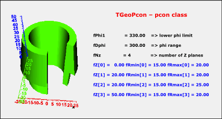

#### Polygon: TGeoPgon Class

Polygons are defined in the same way as polycones, the difference being
just that the segments between consecutive Z planes are regular
polygons. The phi segmentation is preserved and the shape is defined in
a similar manner, just that `rmin` and `rmax` represent the radii of the
circles inscribed in the inner/outer polygon.

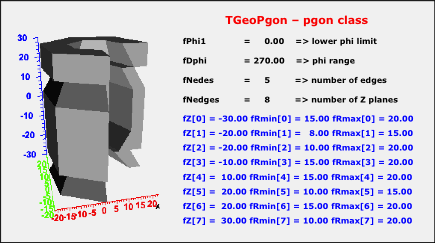

The constructor of a polygon has the form:

``` {.cpp}
TGeoPgon(Double_t phi1,Double_t dphi,Int_t nedges,Int_t nz);
```

The extra parameter `nedges` represent the number of equal edges of the
polygons, between `phi1` and `phi1+dphi.`

#### Polygonal extrusion: TGeoXtru Class

A **`TGeoXtru`** shape is represented by the extrusion of an arbitrary
polygon with fixed outline between several Z sections. Each Z section is
a scaled version of the same "blueprint" polygon. Different global XY
translations are allowed from section to section. Corresponding polygon
vertices from consecutive sections are connected.

An extruded polygon can be created using the constructor:

``` {.cpp}
TGeoXtru::TGeoXtru(Int_t nplanes);
```

-   `nplanes:  `number of Z sections (minimum 2)

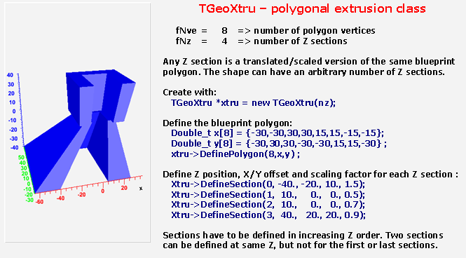

The lists of X and Y positions for all vertices have to be provided for
the "blueprint" polygon:

``` {.cpp}
TGeoXtru::DefinePolygon (Int_t nvertices, Double_t *xv,
Double_t *yv);
```

-   `nvertices:  `number of vertices of the polygon
-   `xv,yv:  `arrays of X and Y coordinates for polygon vertices

The method creates an object of the class **`TGeoPolygon`** for which
the convexity is automatically determined . The polygon is decomposed
into convex polygons if needed.

Next step is to define the Z positions for each section plane as well as
the XY offset and scaling for the corresponding polygons.

``` {.cpp}
TGeoXtru::DefineSection(Int_t snum,Double_t zsection,Double_t x0,
Double_t y0, Double_t scale);
```

-   `snum: `Z section index (0, nplanes-1). The section with
    `snum = nplanes-1` must be defined last and triggers the computation
    of the bounding box for the whole shape
-   `zsection: `Z position of section `snum`. Sections must be defined
    in increasing order of Z (e.g. `snum=0` correspond to the minimum Z
    and `snum=nplanes-1` to the maximum one).
-   `x0,y0: `offset of section `snum` with respect to the local shape
    reference frame `T`
-   `scale: `factor that multiplies the X/Y coordinates of each vertex
    of the polygon at section `snum`:
-   `x[ivert] = x0 + scale*xv[ivert]`
-   `y[ivert] = y0 + scale*yv[ivert]`

#### Half Spaces: TGeoHalfSpace Class

-   A half space is limited just by a plane, defined by a point and the
    normal direction. The point lies on the plane and the normal vector
    points outside the half space. The half space is the only shape
    which is infinite and can be used only in Boolean operations that
    result in non-infinite composite shapes (see also "Composite Shapes"
    below). A half space has to be defined using the constructor:

``` {.cpp}
TGeoHalfSpace (const char *name, Double_t *point[3],
Double_t *norm[3]);
```

### Composite Shapes

Composite shapes are Boolean combinations of two or more shape
components. The supported Boolean operations are union (+), intersection
(\*) and subtraction(-). Composite shapes derive from the base
**`TGeoShape`** class, therefore providing all shape features:
computation of bounding box, finding if a given point is inside or
outside the combination, as well as computing the distance to
entering/exiting. They can be directly used for creating volumes or used
in the definition of other composite shapes.

Composite shapes are provided in order to complement and extend the set
of basic shape primitives. They have a binary tree internal structure,
therefore all shape-related geometry queries are signals propagated from
top level down to the final leaves, while the provided answers are
assembled and interpreted back at top. This `CSG`
`(composite solid geometry)` hierarchy is effective for small number of
components, while performance drops dramatically for large structures.
Building a complete geometry in this style is virtually possible but
highly not recommended.

#### The Structure of Composite Shapes

A composite shape can always be looked as the result of a Boolean
operation between only two shape components. All information identifying
these two components as well as their positions with respect to the
frame of the composite is represented by an object called Boolean node.
A composite shape has a pointer to such a Boolean node. Since the shape
components may also be composites, they will also contain binary Boolean
nodes branching out other two shapes in the hierarchy. Any such branch
ends-up when the final leaves are no longer composite shapes, but basic
primitives. The figure shows the composite shapes structure.

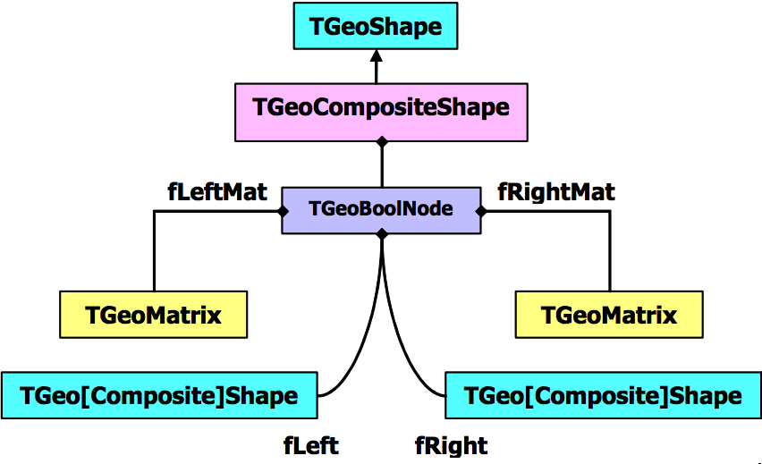

Suppose that A, B, C and D represent basic shapes, we will illustrate
how the internal representation of few combinations look like. We do
this only for understanding how to create them in a proper way, since
the user interface for this purpose is in fact very simple. We will
ignore for the time being the positioning of components. The definition
of a composite shape takes an expression where the identifiers are shape
names. The expression is parsed and decomposed in 2 sub-expressions and
the top-level Boolean operator.

1. Union: `A+B+C`

Just to illustrate the Boolean expression parsing and the composite
shape structure, let's take a simple example. We will describe the union
of A, B and C. Both union operators are at the same level. Since:

`A+B+C = (A+B)+C = A+(B+C)`

The first` (+)` is taken as separator, hence the expression split in:
`A` and `(B+C)`. A Boolean node of type **`TGeoUnion`**`("A","B+C")` is
created. This tries to replace the 2 expressions by actual pointers to
corresponding shapes. The first expression (A) contains no operators
therefore is interpreted as representing a shape. The shape named "A" is
searched into the list of shapes handled by the manager class and stored
as the "left" shape in the Boolean union node. Since the second
expression is not yet fully decomposed, the "right" shape in the
combination is created as a new composite shape. This will split at its
turn B+C into B and C and create a **`TGeoUnion`**`("B","C")`. The B and
C identifiers will be looked for and replaced by the pointers to the
actual shapes into the new node. Finally, the composite "`A+B+C`" will
be represented as shown in Fig.17-23.**

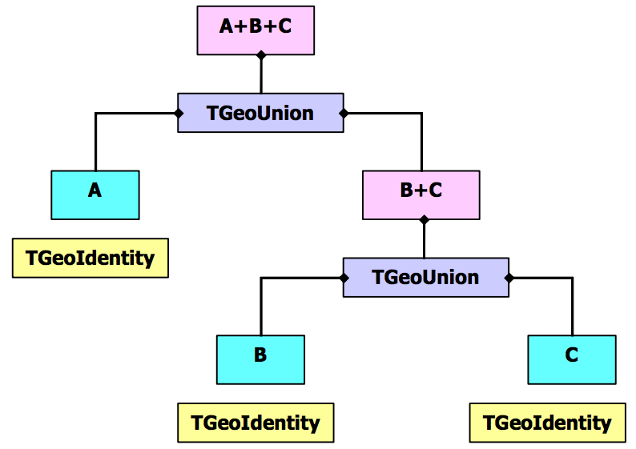

To build this composite shape:

``` {.cpp}
TGeoCompositeShape *cs1 = new TGeoCompositeShape("CS1","A+B+C");
```

Any shape entering a Boolean combination can be prior positioned. In
order to do so, one has to attach a matrix name to the shape name by
using a colon (:). As for shapes, the named matrix has to be prior
defined:

``` {.cpp}
TGeoMatrix *mat;
// ... code creating some geometrical transformation
mat->SetName("mat1");
mat->RegisterYourself();  // see Geometrical transformations
```

An identifier `shape:matrix` have the meaning: `shape` is translated or
rotated with `matrix` with respect to the Boolean combination it enters
as operand. Note that in the expression A+B+C no matrix identifier was
provided, therefore the identity matrix was used for positioning the
shape components. The next example will illustrate a more complex case.

2. `(A:m1+B):m2-(C:m3*D:m4):m5`

Let's try to understand the expression above. This expression means:
subtract the intersection of **C** and **D** from the union of **A** and
**B**. The usage of parenthesis to force the desired precedence is
always recommended. One can see that not only the primitive shapes have
some geometrical transformations, but also their intermediate
compositions.

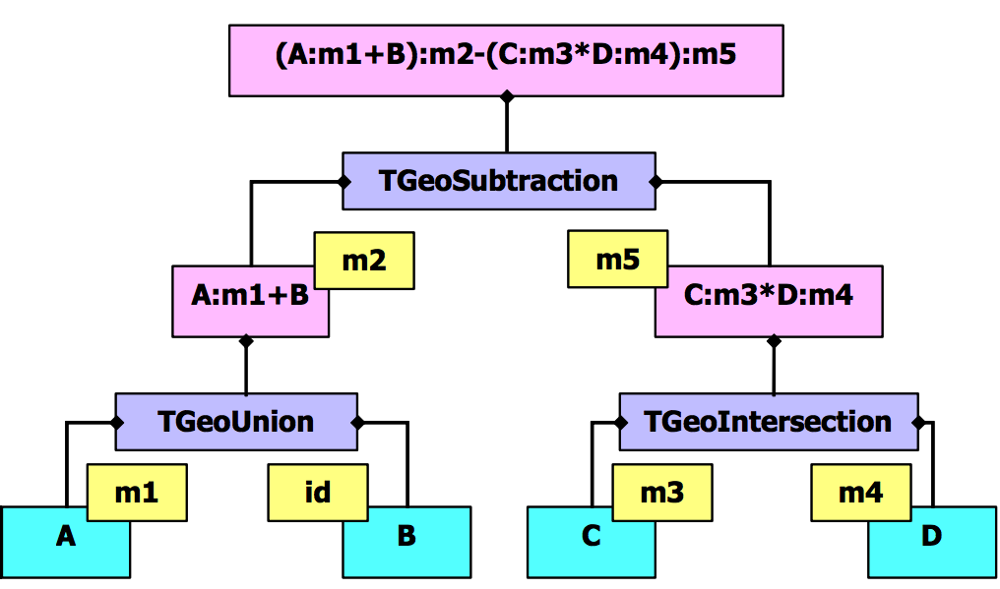

``` {.cpp}
TGeoCompositeShape *cs2 = new TGeoCompositeShape("CS2",
"(A:m1+B):m2-(C:m3*D:m4):m5");
```

Building composite shapes as in the first example is not always quite
useful since we were using un-positioned shapes. When supplying just
shape names as identifiers, the created Boolean nodes will assume that
the shapes are positioned with an identity transformation with respect
to the frame of the created composite. In order to provide some
positioning of the combination components, we have to attach after each
shape identifier the name of an existing transformation, separated by a
colon. Obviously all transformations created for this purpose have to be
objects with unique names in order to be properly substituted during
parsing.

#### Composite Shape Example

One should have in mind that the same shape or matrix identifiers can be
used many times in the same expression, as in the following example:

``` {.cpp}
const Double_t sq2 = TMath::Sqrt(2.);
gSystem->Load("libGeom");
TGeoManager *mgr =
   new TGeoManager("Geom","composite shape example");
TGeoMedium *medium = 0;
TGeoVolume *top = mgr->MakeBox("TOP",medium,100,250,250);
mgr->SetTopVolume(top);

// make shape components
TGeoBBox *sbox  = new TGeoBBox("B",100,125*sq2,125*sq2);
TGeoTube *stub  = new TGeoTube("T",0,100,250);
TGeoPgon *spgon = new TGeoPgon("P",0.,360.,6,2);
spgon->DefineSection(0,-250,0,80);
spgon->DefineSection(1,250,0,80);

// define some rotations
TGeoRotation *r1 = new TGeoRotation("r1",90,0,0,180,90,90);
r1->RegisterYourself();
TGeoRotation *r2 = new TGeoRotation("r2",90,0,45,90,45,270);
r2->RegisterYourself();
// create a composite
TGeoCompositeShape *cs = new TGeoCompositeShape("cs",
"((T+T:r1)-(P+P:r1))*B:r2");
TGeoVolume *comp = new TGeoVolume("COMP",cs);
comp->SetLineColor(5);

// put it in the top volume
top->AddNode(comp,1);
mgr->CloseGeometry();
// visualize it with ray tracing
top->Raytrace();
```

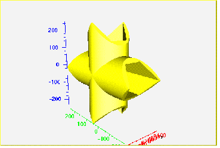

Composite shapes can be subsequently used for defining volumes.
Moreover, these volumes contain other volumes, following the general
criteria. Volumes created based on composite shapes cannot be divided.

### Navigation Methods Performed By Shapes

Shapes are named objects and register themselves to the `manager class`
at creation time. This is responsible for their final deletion. Shapes
can be created without name if their retrieval by name is no needed.
Generally shapes are objects that are useful only at geometry creation
stage. The pointer to a shape is in fact needed only when referring to a
given volume and it is always accessible at that level. Several volumes
may reference a single shape; therefore its deletion is not possible
once volumes were defined based on it.

The navigation features related for instance to tracking particles are
performed in the following way: Each shape implement its specific
algorithms for all required tasks in its local reference system. Note
that the manager class handles global queries related to geometry.
However, shape-related queries might be sometimes useful:

``` {.cpp}
Bool_t TGeoShape::Contains(Double_t *point[3]);
```

The method above returns `kTRUE` if the point \*point is actually inside
the shape. The point has to be defined in the local shape reference. For
instance, for a box having `DX,DY` and `DZ `half-lengths a point will be
considered inside if:

`-DX <= point[0] <= DX`

`-DY <= point[1] <= DY`

`-DZ <= point[2] <= DZ`

``` {.cpp}
Double_t TGeoShape::DistFromInside(Double_t *point[3],
Double_t *dir[3], Int_t iact,Double_t step,Double_t *safe);
```

The method computes the distance to exiting a shape from a given point
`inside`, along a given direction. This direction is given by its
director cosines with respect to the local shape coordinate system. This
method provides additional information according the value of `iact`
input parameter:

-   `iact = 0`computes only safe distance and fill it at the location
    given by SAFE;
-   `iact = 1`a proposed STEP is supplied. The safe distance is computed
    first. If this is bigger than STEP than the proposed step is
    approved and returned by the method since it does not cross the
    shape boundaries. Otherwise, the distance to exiting the shape is
    computed and returned;
-   `iact = 2`computes both safe distance and distance to exiting,
    ignoring the proposed step;
-   `iact > 2`computes only the distance to exiting, ignoring anything
    else

``` {.cpp}
Double_t TGeoShape::DistFromOutside(Double_t *point[3],
Double_t *dir[3],Int_t iact,Double_t step,Double_t *safe);
```

This method computes the distance to entering a shape from a given point
`outside`. It acts in the same way as the previous method.

``` {.cpp}
Double_t TGeoShape::Safety(Double_t *point[3],Bool_t inside);
```

This computes the maximum shift of a point in any direction that does
not change its `inside/outside `state (does not cross shape boundaries).
The state of the point has to be properly supplied.

``` {.cpp}
Double_t *TGeoShape::ComputeNormal(Double_t *point[3],
Double_t *dir[3],Double_t *norm[3]);
```

The method above computes the director cosines of normal to the crossed
shape surface from a given point towards direction. This is filled into
the `norm` array, supplied by the user. The normal vector is always
chosen such that its dot product with the direction is positive defined.

### Creating Shapes

Shape objects embeds only the minimum set of parameters that are fully
describing a valid physical shape. For instance, the half-length, the
minimum and maximum radius represent a tube. Shapes are used together
with media in order to create volumes, which in their turn are the main
components of the geometrical tree. A specific shape can be created
stand-alone:

``` {.cpp}
TGeoBBox *box = new TGeoBBox("s_box",halfX,halfY,halfZ); // named
TGeoTube *tub = new TGeoTube(rmin,rmax,halfZ); // no name
//...  (See all specific shape constructors)
```

Sometimes it is much easier to create a volume having a given shape in
one step, since shapes are not directly linked in the geometrical tree
but volumes are:

``` {.cpp}
TGeoVolume *vol_box = gGeoManager->MakeBox("BOX_VOL",pmed,halfX,
halfY,halfZ);
TGeoVolume *vol_tub = gGeoManager->MakeTube("TUB_VOL",pmed,rmin,
rmax,halfZ);
// ...(See MakeXXX() utilities in TGeoManager class)
```

### Dividing Shapes

Shapes can generally be divided along a given axis. Supported axes are:
`X`, `Y`, `Z`, `Rxy`, `Phi`, `Rxyz`. A given shape cannot be divided
however on any axis. The general rule is that that divisions are
possible on whatever axis that produces still known shapes as slices.
The division of shapes are performed by the call `TGeoShape::Divide()`,
but this operation can be done only via `TGeoVolume::Divide()` method.
In other words, the algorithm for dividing a specific shape is known by
the shape object, but is always invoked in a generic way from the volume
level. Details on how to do that can be found in the paragraph ‘Dividing
volumes'. One can see how all division options are interpreted and which
their result inside specific shape classes is.

### Parametric Shapes

Shapes generally have a set of parameters that is well defined at build
time. In fact, when the final geometrical hierarchy is assembled and the
geometry is closed, all constituent shapes `MUST`**have well defined and
valid parameters. In order to ease-up geometry creation, some
parameterizations are however allowed.

For instance let's suppose that we need to define several volumes having
exactly the same properties but different sizes. A way to do this would
be to create as many different volumes and shapes. The modeller allows
however the definition of a single volume having undefined shape
parameters.

``` {.cpp}
TGeoManager::Volume(const char *name,const char *shape,Int_t nmed);
```

-   `name:` the name of the newly created volume;
-   `shape:`the type of the associated shape. This has to contain the
    case-insensitive first 4 letters of the corresponding class name
    (e.g. "`tubs`" will match **`TGeoTubeSeg`**, "`bbox`" will match
    **`TGeoBBox`**)
-   `nmed:` the medium number.

This will create a special volume that will not be directly used in the
geometry, but whenever positioned will require a list of actual
parameters for the current shape that will be created in this process.
Such volumes having shape parameters known only when used have to be
positioned only with **`TGeoManager::Node()` method (see ‘Creating and
Positioning Volumes').**

Other case when shape parameterizations are quite useful is scaling
geometry structures. Imagine that we would like to enlarge/shrink a
detector structure on one or more axes. This happens quite often in real
life and is handled by "fitting mother" parameters. This is accomplished
by defining shapes with one or more invalid (negative) parameters. For
instance, defining a box having `dx=10.`, `dy=10.`, and `dz=-1` will not
generate an error but will be interpreted in a different way: A special
volume **`TGeoVolumeMulti`** will be created. Whenever positioned inside
a mother volume, this will create a normal **`TGeoVolume`** object
having as shape a box with `dz` fitting the corresponding `dz `of the
mother shape. Generally, this type of parameterization is used when
positioning volumes in containers having a matching shape, but it works
also for most reasonable combinations.

## Geometry Creation

A given geometry can be built in various ways, but one has to follow
some mandatory steps. Even if we might use some terms that will be
explained later, here are few general rules:

-   Volumes need media and shapes in order to be created.
-   Both containers and contained volumes must be created before linking
    them together, and the relative transformation matrix must be
    provided.
-   Any volume have to be positioned somewhere otherwise it will not be
    considered as part of the geometry.
-   Visibility or tracking properties of volumes can be provided both at
    build time or after geometry is closed, but global visualization
    settings (see section: "The Drawing Package") should not be provided
    at build time, otherwise the drawing package will be loaded.

There is also a list of specific rules:

-   Positioned volumes should not extrude their container or intersect
    with others within this unless it is specified (see section:
    Overlapping Volumes).
-   The top volume (containing all geometry trees) must be specified
    before closing the geometry and must not be positioned - it
    represents the global reference frame.
-   After building the full geometry tree, the geometry must be closed
    (see the method **`TGeoManager`**`::CloseGeometry()`). Voxelization
    can be redone per volume after this process.

The list is much bigger and we will describe in more detail the geometry
creation procedure in the following sections. Provided that geometry was
successfully built and closed, the **`TGeoManager`** class will register
itself to ROOT and the logical/physical structures will become
immediately browsable.

### The Volume Hierarchy

The basic components used for building the logical hierarchy of the
geometry are the positioned volumes called `nodes`. Volumes are fully
defined geometrical objects having a given shape and medium and possibly
containing a list of nodes. Nodes represent just positioned instances of
volumes inside a container volume but users do not directly create them.
They are automatically created as a result of adding one volume inside
other or dividing a volume. The geometrical transformation held by nodes
is always defined with respect to their mother (relative positioning).
Reflection matrices are allowed.

A hierarchical element is not fully defined by a node since nodes are
not directly linked to each other, but through volumes (a node points to
a volume, which at its turn points to a list of nodes):

`NodeTop ` ` VolTop ` ` NodeA ` ` VolA ` `...`

One can therefore talk about "the node or volume hierarchy", but in
fact, an element is made by a pair volume-node. In the line above is
represented just a single branch, but of course from any volume other
branches can also emerge. The index of a node in such a branch (counting
only nodes) is called `depth`. The top node have always `depth=0`.

Volumes need to have their daughter nodes defined when the geometry is
closed. They will build additional structures (called `voxels` ) in
order to fasten-up the search algorithms. Finally, nodes can be regarded
as bi-directional links between containers and contained volumes.

The structure defined in this way is a graph structure since volumes are
replicable (same volume can become daughter node of several other
volumes), every volume becoming a branch in this graph. Any volume in
the logical graph can become the actual top volume at run time (see
**`TGeoManager::SetTopVolume()`). All functionalities of the modeller
will behave in this case as if only the corresponding branch starting
from this volume is the active geometry.**

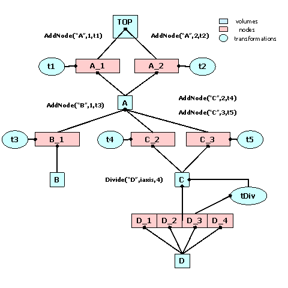

Nodes are never instantiated directly by users, but created as a result
of volume operations. Adding a volume named A with a given `user id`
inside a volume B will create a node named `A_id.` This will be added to
the list of nodes stored by B. In addition, when applying a division
operation in N slices to a volume A, a list of nodes `B_1`, `B_2`, ... ,
`B_N` is also created. A node `B_i` does not represent a unique object
in the geometry because its container A might be at its turn positioned
as node inside several other volumes. Only when a complete branch of
nodes is fully defined up to the top node in the geometry, a given
path:` /TOP_1/`...`/A_3/B_7` will represent a unique object. Its global
transformation matrix can be computed as the pile-up of all local
transformations in its branch. We will therefore call `logical graph`
the hierarchy defined by nodes and volumes. The expansion of the logical
graph by all possible paths defines a tree structure where all nodes are
unique "touchable" objects. We will call this the "physical tree".
Unlike the logical graph, the physical tree can become a huge structure
with several millions of nodes in case of complex geometries; therefore,
it is not always a good idea to keep it transient in memory. Since the
logical and physical structures are correlated, the modeller rather
keeps track only of the current branch, updating the current global
matrix at each change of the level in geometry. The current physical
node is not an object that can be asked for at a given moment, but
rather represented by the combination: current node/current global
matrix. However, physical nodes have unique ID's that can be retrieved
for a given modeller state. These can be fed back to the modeller in
order to force a physical node to become current. The advantage of this
comes from the fact that all navigation queries check first the current
node; therefore the location of a point in the geometry can be saved as
a starting state for later use.

Nodes can be declared as `overlapping` in case they do overlap with
other nodes inside the same container or extrude this container (see
also ‘Checking the Geometry'). Non-overlapping nodes can be created
with:

``` {.cpp}
TGeoVolume::AddNode(TGeoVolume *daughter,Int_t copy_No,
TGeoMatrix *matr);
```

The creation of overlapping nodes can be done with a similar prototype:

``` {.cpp}
TGeoVolume::AddNodeOverlap(/*same arguments*/);
```

When closing the geometry, overlapping nodes perform a check of possible
overlaps with their neighbors. These are stored and checked all the time
during navigation; therefore, navigation is slower when embedding such
nodes into geometry. Nodes have visualization attributes as the volume
has. When undefined by users, painting a node on a pad will take the
corresponding volume attributes.

### Creating and Positioning Volumes

#### Making Volumes

As mentioned before, volumes are the basic objects used in building the
geometrical hierarchy. They represent objects that are not positioned,
but store all information about the placement of the other volumes they
may contain. Therefore a volume can be replicated several times in the
geometry. As it was explained, in order to create a volume, one has to
put together a shape and a medium, which are already defined.

Volumes have to be named by users at creation time. Every different name
may represent a unique volume object, but may also represent more
general a family (class) of volume objects having the same shape type
and medium, but possibly different shape parameters. It is the user's
task to provide different names for different volume families in order
to avoid ambiguities at tracking time.

A generic family rather than a single volume is created only in two
cases: when a parametric shape is used or when a division operation is
applied. Each volume in the geometry stores a unique ID corresponding to
its family. In order to ease-up their creation, the manager class is
providing an API that allows making a shape and a volume in a single
step.

#### Example of Volume Creation

``` {.cpp}
// Making a volume out of a shape and a medium.
TGeoVolume *vol = new TGeoVolume("VNAME",ptrShape,ptrMed);

// Making a volume out of a shape but without a defined medium.
TGeoVolume *vol = new TGeoVolume("VNAME",ptrShape);

// Making a volume with a given shape in one step
TGeoVolume *vol = gGeoManager->MakeBox("VNAME",ptrMed,dx,dy,dz);
TGeoVolume *vol = gGeoManager->MakeTubs("VNAME",ptrMed,rmin,rmax,
dz,phi1,phi2);

// See class TGeoManager for the rest of shapes.
// Making a volume with a given shape with a unique prototype
TGeoVolume *vol = gGeoManager->Volume("VNAME","XXXX",nmed,upar,
npar);

// Where XXXX stands for the first 4 letters of the specific shape
// classes, nmed is the medium number, upar is an Double_t * array
// of the shape parameters and npar is the number of parameters.
// This prototype allows (npar = 0) to define volumes with shape
// defined only at positioning time (volumes defined in this way
// need to be positioned using TGeoManager::Node() method)
```

#### Positioned Volumes (Nodes)

Geometrical modeling is a difficult task when the number of different
geometrical objects is 106-108. This is more or less the case for
detector geometries of complex experiments, where a ‘flat' CSG model
description cannot scale with the current CPU performances. This is the
reason why models like GEANT [1] introduced an additional dimension
(depth) in order to reduce the complexity of the problem. This concept
is also preserved by the ROOT modeller and introduces a pure geometrical
constraint between objects (volumes in our case) - containment. This
means in fact that any positioned volume has to be contained by another.
Now what means contained and positioned?

-   We will say that a volume `contains` a point if this is inside the
    shape associated to the volume. For instance, a volume having a box
    shape will contain all points `P=(X,Y,Z)` verifying the conditions:
    `Abs(Pi)dXi`. The points on the shape boundaries are considered as
    inside the volume. The volume contains a daughter if it contains all
    the points contained by the daughter.
-   The definition of containment works of course only with points
    defined in the local coordinate system of the considered volume.
    `Positioning` a volume inside another have to introduce a
    geometrical transformation between the two. If `M` defines this
    transformation, any point in the daughter reference can be converted
    to the mother reference by: `Pmother = MPdaughter`

When creating a volume one does not specify if this will contain or not
other volumes. Adding daughters to a volume implies creating those and
adding them one by one to the list of daughters. Since the volume has to
know the position of all its daughters, we will have to supply at the
same time a geometrical transformation with respect to its local
reference frame for each of them.

``` {.cpp}
TGeoVolume::AddNode(TGeoVolume *daughter,Int_t usernumber,
TGeoMatrix *matrix=gGeoIdentity)
```

The objects referencing a volume and a transformation are called `NODES`
and their creation is fully handled by the modeller. They represent the
link elements in the hierarchy of volumes. Nodes are unique and distinct
geometrical objects ONLY from their container point of view. Since
volumes can be replicated in the geometry, the same node may be found on
different branches.

In order to provide navigation features, volumes have to be able to find
the proper container of any point defined in the local reference frame.
This can be the volume itself, one of its positioned daughter volumes or
none if the point is actually outside. On the other hand, volumes have
to provide also other navigation methods such as finding the distances
to its shape boundaries or which daughter will be crossed first. The
implementation of these features is done at shape level, but the local
mother-daughters management is handled by volumes. These build
additional optimization structures upon geometry closure. In order to
have navigation features properly working one has to follow some rules
for building a valid geometry.

-   The daughter volume(s) must not extrude the mother shape. They are
    allowed however to have a common boundaries.
-   The volumes positioned in the same container must not overlap with
    each other. They may touch on one boundaries or shape vertex.

The daughter nodes of a volume can be also removed or replaced with
other nodes:

``` {.cpp}
void RemoveNode(TGeoNode* node)
TGeoNode*ReplaceNode(TGeoNode* nodeorig, TGeoShape* newshape = 0,
TGeoMatrix* newpos = 0, TGeoMedium* newmed = 0)
```

The last method allows replacing an existing daughter of a volume with
another one. Providing only the node to be replaced will just create a
new volume for the node but having exactly the same parameters as the
old one. This helps in case of divisions for decoupling a node from the
logical hierarchy so getting new content/properties. For non-divided
volumes, one can change the shape and/or the position of the daughter.

#### Virtual Containers and Assemblies of Volumes

Virtual containers are volumes that do not represent real objects, but
they are needed for grouping and positioning together other volumes.
Such grouping helps not only geometry creation, but also optimizes
tracking performance; therefore, it is highly recommended. Virtual
volumes need to inherit material/medium properties from the volume they
are placed into in order to be "invisible" at tracking time.

Let us suppose that we need to group together two volumes `A` and `B`
into a structure and position this into several other volumes `D,E,` and
`F`. What we need to do is to create a virtual container volume `C`
holding `A` and `B`, then position `C` in the other volumes.

Note that `C` is a volume having a determined medium. Since it is not a
real volume, we need to manually set its medium the same as that of
`D,E` or `F` in order to make it ‘invisible' (same physics properties).
In other words, the limitation in proceeding this way is that `D,E,` and
`F` must point to the same medium. If this was not the case, we would
have to define different virtual volumes for each placement: `C`, `C'`
and `C"`, having the same shape but different media matching the
corresponding containers. This might not happen so often, but when it
does, it forces the creation of several extra virtual volumes. Other
limitation comes from the fact that any container is directly used by
navigation algorithms to optimize tracking. These must geometrically
contain their belongings (positioned volumes) so that these do not
extrude its shape boundaries. Not respecting this rule generally leads
to unpredictable results. Therefore `A` and `B` together must fit into
`C` that has to fit also into `D,E,` and `F`. This is not always
straightforward to accomplish, especially when instead of `A` and `B` we
have many more volumes.

In order to avoid these problems, one can use for the difficult cases
the class **`TGeoVolumeAssembly`**, representing an assembly of volumes.
This behaves like a normal container volume supporting other volumes
positioned inside, but it has neither shape nor medium. It cannot be
used directly as a piece of the geometry, but just as a temporary
structure helping temporary assembling and positioning volumes.

If we define now `C` as an assembly containing `A` and `B`, positioning
the assembly into `D,E` and `F` will actually position only `A` and
`B `directly into these volumes, taking into account their combined
transformations `A/B` to `C` and `C` to `D/E/F`. This looks much nicer,
is it? In fact, it is and it is not. Of course, we managed to get rid of
the ‘unnecessary' volume `C` in our geometry, but we end-up with a more
flat structure for `D,E` and `F` (more daughters inside). This can get
much worse when extensively used, as in the case: assemblies of
assemblies.

For deciding what to choose between using virtual containers or
assemblies for a specific case, one can use for both cases, after the
geometry was closed:

``` {.cpp}
gGeoManager->SetTopVolume(ptr_D);
gGeoManager->Test();
gGeoManager->RestoreMasterVolume();
```

The `ptr_D` is a pointer to volume `D` containing the interesting
structure. The test will provide the timing for classifying 1 million
random points inside `D`.

#### Examples of Volume Positioning

Now let us make a simple volume representing a copper wire. We suppose
that a medium is already created (see **`TGeoMedium`** class on how to
create media).

We will create a `TUBE` shape for our wire, having `Rmin=0cm`,
`Rmax=0.01cm` and a half-length `dZ=1cm`:

``` {.cpp}
TGeoTube *tube = new TGeoTube("wire_tube",0,0.01,1);
```

One may omit the name for the shape `wire_tube,` if no retrieving by
name is further needed during geometry building. Different volumes
having different names and materials can share the same shape.

Now let's make the volume for our wire:

``` {.cpp}
TGeoVolume *wire_co = new TGeoVolume("WIRE_CO",tube,
ptrCOPPER); //(*)
```

**(\*)** Do not bother to delete the media, shapes or volumes that you
have created since all will be automatically cleaned on exit by the
manager class.

If we would have taken a look inside `TGeoManager::MakeTube()` method,
we would have been able to create our wire with a single line:

``` {.cpp}
TGeoVolume *wire_co = gGeoManager->MakeTube("WIRE_CO",ptrCOPPER,
0,0.01,1); //(*)
```

**(\*)** The same applies for all primitive shapes, for which there can
be found corresponding `MakeSHAPE()` methods. Their usage is much more
convenient unless a shape has to be shared between more volumes.

Let us make now an aluminum wire having the same shape, supposing that
we have created the copper wire with the line above:

``` {.cpp}
TGeoVolume *wire_al = new TGeoVolume("WIRE_AL",wire_co>GetShape(),
ptrAL);
```

We would like now to position our wire in the middle of a gas chamber.
We need first to define the gas chamber:

``` {.cpp}
TGeoVolume *chamber = gGeoManager->MakeTube("CHAMBER",ptrGAS,
0,1,1);
```

Now we can put the wire inside:

``` {.cpp}
chamber->AddNode(wire_co,1);
```

If we inspect now the chamber volume in a browser, we will notice that
it has one daughter. Of course, the gas has some container also, but let
us keeps it like that for the sake of simplicity. Since we did not
supply the third argument, the wire will be positioned with an identity
transformation inside the chamber.

#### Overlapping Volumes

Positioning volumes that does not overlap their neighbors nor extrude
their container is sometimes quite strong constraint. Having a limited
set of geometric shapes might force sometimes overlaps. Since
overlapping is contradictory to containment, a point belonging to an
overlapping region will naturally belong to all overlapping partners.
The answer provided by the modeller to "Where am I?" is no longer
deterministic if there is no priority assigned.

There are two ways out provided by the modeller in such cases and we
will illustrate them by examples.

-   Suppose we have 2 crossing tubes that we have to describe. Such a
    structure cannot be decomposed in a containment schema. This is a
    typical example of simple structure that can be handled by using
    composite shapes. What we have to do is to define as shapes the
    inner and outer parts of the tubes (tubes having
    `Rmin=0`,` Rmax=`inner/outer radius), then to make a composite:
-   `C = (Tub1out+Tub2out)-(Tub1in+Tub2in)`
-   On the other hand, if we have an EM calorimeter having a honeycomb
    structure, Boolean combinations do not help anymore. Here the
    problem is that we usually have a very large number of cells that
    are naturally belonging to the same container. This result in a very
    flat and slow structure for that particular container, which we
    would very much want to avoid by introducing additional levels in
    depth. We can describe the basic cell as a hexahedron that we can
    represent by using a polygon primitive shape. Instead of putting one
    by one all cells in the same container, we can define rows of such
    elements, fitting in box-shaped containers. Then we can put
    row-beside-row inside the container, making life much easier for its
    navigation algorithms. The problem is that in order to reproduce the
    honeycomb structure out of rows of cells, we have to overlap row
    containers. Whoops - we have not obeyed rule No. 2 in positioning.
    The way out is to position our rows with a special prototype:

``` {.cpp}
ptrCAL->AddNodeOverlap("ROW",nRow,matrixRow);
```

This will instruct the modeller that the daughter ROW inside CAL
overlaps with something else. The modeller will check this at closure
time and build a list of possibly overlapping candidates. This option is
equivalent with the option MANY in GEANT3.

The modeller supports such cases only if user declares the overlapping
nodes. In order to do that, one should use
**`TGeoVolume`**`::AddNodeOverlap()` instead of `TGeoVolume::AddNode()`.
When two or more positioned volumes are overlapping, not all of them
have to be declared so, but at least one. A point inside an overlapping
region equally belongs to all overlapping nodes, but the way these are
defined can enforce the modeller to give priorities.

The general rule is that the deepest node in the hierarchy containing a
point has the highest priority. For the same geometry level,
non-overlapping is prioritized over overlapping. In order to illustrate
this, we will consider few examples. We will designate non-overlapping
nodes as ONLY and the others MANY as in GEANT3, where this concept was
introduced:

1. The part of a MANY node B extruding its container A will never be
"seen" during navigation, as if B was in fact the result of the
intersection of A and B.

2. If we have two nodes A (ONLY) and B (MANY) inside the same container,
all points in the overlapping region of A and B will be designated as
belonging to A.

3. If A an B in the above case were both MANY, points in the overlapping
part will be designated to the one defined first. Both nodes must have
the same medium.

4. The slices of a divided MANY will be as well MANY.

One needs to know that navigation inside geometry parts MANY nodes is
much slower. Any overlapping part can be defined based on composite
shapes - might be in some cases a better way out.

#### Replicating Volumes

What can we do if our chamber contains two identical wires instead of
one? What if then we would need 1000 chambers in our detector? Should we
create 2000 wires and 1000 chamber volumes? No, we will just need to
replicate the ones that we have already created.

``` {.cpp}
chamber->AddNode(wire_co,1,new TGeoTranslation(0.2,0,0));
chamber->AddNode(wire_co,2,new TGeoTranslation(0.2,0,0));
```

The 2 nodes that we have created inside chamber will both point to a
`wire_co` object, but will be completely distinct: `WIRE_CO_1` and
`WIRE_CO_2`. We will want now to place symmetrically 1000 chambers on a
pad, following a pattern of 20 rows and 50 columns. One way to do this
will be to replicate our chamber by positioning it 1000 times in
different positions of the pad. Unfortunately, this is far from being
the optimal way of doing what we want. Imagine that we would like to
find out which of the 1000 chambers is containing a `(x,y,z)` point
defined in the pad reference. You will never have to do that, since the
modeller will take care of it for you, but let's guess what it has to
do. The most simple algorithm will just loop over all daughters, convert
the point from mother to local reference and check if the current
chamber contains the point or not. This might be efficient for pads with
few chambers, but definitely not for 1000. Fortunately the modeller is
smarter than that and creates for each volume some optimization
structures called `voxels` to minimize the penalty having too many
daughters, but if you have 100 pads like this in your geometry you will
anyway lose a lot in your tracking performance. The way out when
volumes can be arranged according to simple patterns is the usage of
divisions. We will describe them in detail later on. Let's think now at
a different situation: instead of 1000 chambers of the same type, we may
have several types of chambers. Let's say all chambers are cylindrical
and have a wire inside, but their dimensions are different. However, we
would like all to be represented by a single volume family, since they
have the same properties.

#### Volume Families

A volume family is represented by the class **`TGeoVolumeMulti`**. It
represents a class of volumes having the same shape type and each member
will be identified by the same name and volume ID. Any operation applied
to a **`TGeoVolumeMulti`** equally affects all volumes in that family.
The creation of a family is generally not a user task, but can be forced
in particular cases:

``` {.cpp}
TGeoManager::Volume(const char *vname,const char *shape,
Int_t nmed);
```

Where: `vname` is the family name, `nmed` is the medium number and
`shape` is the shape type that can be:

-   `box`for **`TGeoBBox`**
-   `trd1`for **`TGeoTrd1`**
-   `trd2`for **`TGeoTrd2`**
-   `trap`for **`TGeoTrap`**
-   `gtra`for **`TGeoGtra`**
-   `para`for **`TGeoPara`**
-   `tube`, `tubs `for **`TGeoTube`**, **`TGeoTubeSeg`**
-   ` cone`, `cons `for **`TGeoCone`**, **`TGeoCons`**
-   `eltu`for **`TGeoEltu`**
-   `ctub`for **`TGeoCtub`**
-   `pcon`for **`TGeoPcon`**
-   `pgon`for **`TGeoPgon`**

Volumes are then added to a given family upon adding the generic name as
node inside other volume:

``` {.cpp}
TGeoVolume *box_family = gGeoManager->Volume("BOXES","box",nmed);
//   ...
gGeoManager->Node("BOXES",Int_t copy_no,"mother_name",Double_t x,
Double_t y,Double_t z,Int_t rot_index,Bool_t is_only,
Double_t *upar,Int_t npar);
```

-   `BOXES`- name of the family of boxes
-   `copy_no`- user node number for the created node
-   `mother_name`- name of the volume to which we want to add the node
-   `x,y,z`- translation components
-   `rot_index`- index of a rotation matrix in the list of matrices
-   `upar`- array of actual shape parameters
-   `npar`- number of parameters

The parameters order and number are the same as in the corresponding
shape constructors. Another particular case where volume families are
used is when we want that a volume positioned inside a container to
match one ore more container limits. Suppose we want to position the
same box inside 2 different volumes and we want the Z size to match the
one of each container:

``` {.cpp}
TGeoVolume *container1 = gGeoManager->MakeBox("C1",imed,10,10,30);
TGeoVolume *container2 = gGeoManager->MakeBox("C2",imed,10,10,20);
TGeoVolume *pvol       = gGeoManager->MakeBox("PVOL",jmed,3,3,-1);
container1->AddNode(pvol,1);
container2->AddNode(pvol,1);
```

Note that the third parameter of `PVOL` is negative, which does not make
sense as half-length on Z. This is interpreted as: when positioned,
create a box replacing all invalid parameters with the corresponding
dimensions of the container. This is also internally handled by the
**`TGeoVolumeMulti`** class, which does not need to be instantiated by
users.

#### Dividing Volumes

Volumes can be divided according a pattern. The simplest division can be
done along one axis that can be: `X,Y,Z,Phi,Rxy or Rxyz`. Let's take a
simple case: we would like to divide a box in N equal slices along X
coordinate, representing a new volume family. Supposing we already have
created the initial box, this can be done like:

``` {.cpp}
TGeoVolume *slicex = box->Divide("SLICEX",1,N);
```

Here `SLICEX` is the name of the new family representing all slices and
1 is the slicing axis. The meaning of the axis index is the following:
for all volumes having shapes like `box`, `trd1`, `trd2`, `trap`,
`gtra `or` para - `1, 2, 3 mean X, Y, Z; for `tube`, `tubs`, `cone`,
`cons - `1 means `Rxy`, 2 means `phi` and 3 means Z; for `pcon` and
`pgon` - 2 means `phi` and 3 means Z; for spheres 1 means `R `and 2
means `phi.`

In fact, the division operation has the same effect as positioning
volumes in a given order inside the divided container - the advantage
being that the navigation in such a structure is much faster. When a
volume is divided, a volume family corresponding to the slices is
created. In case all slices can be represented by a single shape, only
one volume is added to the family and positioned N times inside the
divided volume, otherwise, each slice will be represented by a distinct
volume in the family.

Divisions can be also performed in a given range of one axis. For that,
one has to specify also the starting coordinate value and the step:

``` {.cpp}
TGeoVolume *slicex = box->Divide("SLICEX",1,N,start,step);
```

A check is always done on the resulting division range: if not fitting
into the container limits, an error message is posted. If we will browse
the divided volume we will notice that it will contain N nodes starting
with index 1 up to N. The first one has the lower X limit at `START`
position, while the last one will have the upper X limit at
`START+N*STEP`. The resulting slices cannot be positioned inside another
volume (they are by default positioned inside the divided one) but can
be further divided and may contain other volumes:

``` {.cpp}
TGeoVolume *slicey = slicex->Divide("SLICEY",2,N1);
slicey->AddNode(other_vol,index,some_matrix);
```

When doing that, we have to remember that `SLICEY` represents a family,
therefore all members of the family will be divided on Y and the other
volume will be added as node inside all.

In the example above all the resulting slices had the same shape as the
divided volume (box). This is not always the case. For instance,
dividing a volume with `TUBE` shape on `PHI `axis will create equal
slices having `TUBESEG` shape. Other divisions can also create slices
having shapes with different dimensions, e.g. the division of a `TRD1`
volume on Z.

When positioning volumes inside slices, one can do it using the generic
volume family (e.g. `slicey`). This should be done as if the coordinate
system of the generic slice was the same as the one of the divided
volume. The generic slice in case of `PHI` division is centered with
respect to X-axis. If the family contains slices of different sizes, any
volume positioned inside should fit into the smallest one.

Examples for specific divisions according to shape types can be found
inside shape classes.

``` {.cpp}
TGeoVolume::Divide(N,Xmin,Xmax,"X");
```

Create a new volume by dividing an existing one (GEANT3 like).

Divides `MOTHER` into `NDIV` divisions called `NAME` along axis `IAXIS`
starting at coordinate value `START` and having size `STEP`. The created
volumes will have tracking media `ID=NUMED` (if `NUMED=0` -\> same media
as `MOTHER`).

The behavior of the division operation can be triggered using `OPTION`
(case insensitive):

-   `N`divide all range in `NDIV` cells (same effect as `STEP<=0`)
    (GSDVN in G3)
-   `NX`divide range starting with `START` in `NDIV` cells (GSDVN2 in
    G3)
-   `S`divide all range with given `STEP`; `NDIV` is computed and
    divisions will be centered in full range (same effect as `NDIV<=0`)
    (GSDVS, GSDVT in G3)
-   `SX`same as `DVS`, but from `START` position (GSDVS2, GSDVT2 in G3)

#### Volume Assemblies

In general, geometry contains structures of positioned volumes that have
to be grouped and handled together, for different possible reasons. One
of these is that the structure has to be replicated in several parts of
the geometry, or it may simply happen that they really represent a
single object, too complex to be described by a primitive shape.

Usually handling structures like these can be easily done by positioning
all components in the same container volume, then positioning the
container itself. However, there are many practical cases when defining
such a container is not straightforward or even possible without
generating overlaps with the rest of the geometry. There are few ways
out of this:

-   Defining the container for the structure as "overlapping" (see also
    " Overlapping Volumes **"**)
-   Representing the container as a composite shape - the Boolean union
    of all components (see also " Composite Shapes ")
-   Using an assembly volume - this will be described in the following.

The first two approaches have the disadvantage of penalizing the
navigation performance with a factor increasing more than linear of the
number of components in the structure. The best solution is the third
one because it uses all volume-related navigation optimizations. The
class **`TGeoVolumeAssembly`** represents an assembly volume. Its shape
is represented by **`TGeoShapeAssembly`** class that is the union of all
components. It uses volume voxelization to perform navigation tasks.

An assembly volume creates a hierarchical level and it geometrically
insulates the structure from the rest (as a normal volume). Physically,
a point that is INSIDE a **`TGeoShapeAssembly`** is always inside one of
the components, so a **`TGeoVolumeAssembly`** does not need to have a
medium. Due to the self-containment of assemblies, they are very
practical to use when a container is hard to define due to possible
overlaps during positioning. For instance, it is very easy creating
honeycomb structures. A very useful example for creating and using
assemblies can be found at:
<http://root.cern.ch/root/html/examples/assembly.C.html>`.`

Creation of an assembly is very easy: one has just to create a
**`TGeoVolumeAssembly`** object and position the components inside as
for any volume:

``` {.cpp}
TGeoVolume *vol = new TGeoVolumeAssembly(name);
vol->AddNode(vdaughter1, cpy1, matrix1);
vol->AddNode(vdaughter2, cpy2, matrix2);
```

Note that components cannot be declared as "overlapping" and that a
component can be an assembly volume. For existing flat volume
structures, one can define assemblies to force a hierarchical structure
therefore optimizing the performance. Usage of assemblies does NOT imply
penalties in performance, but in some cases, it can be observed that it
is not as performing as bounding the structure in a container volume
with a simple shape. Choosing a normal container is therefore
recommended whenever possible.

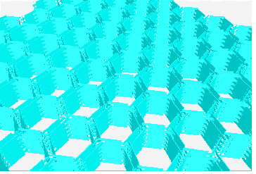

### Geometrical Transformations

All geometrical transformations handled by the modeller are provided as
a built-in package. This was designed to minimize memory requirements
and optimize performance of point/vector master-to-local and
local-to-master computation. We need to have in mind that a
transformation in **`TGeo`** has two major use-cases. The first one is
for defining the placement of a volume with respect to its container
reference frame. This frame will be called 'master' and the frame of the
positioned volume - 'local'. If `T` is a transformation used for
positioning volume daughters, then: `MASTER = T * LOCAL`

Therefore `T `is used to perform a local to master conversion, while
`T-1` for a master to local conversion. The second use case is the
computation of the global transformation of a given object in the
geometry. Since the geometry is built as 'volumes-inside-volumes', the
global transformation represents the pile-up of all local
transformations in the corresponding branch. Once a given object in the
hierarchy becomes the current one, the conversion from master to local
coordinates or the other way around can be done from the manager class.

A general homogenous transformation is defined as a 4x4 matrix embedding
a rotation, a translation and a scale. The advantage of this description
is that each basic transformation can be represented as a homogenous
matrix, composition being performed as simple matrix multiplication.

Rotation:
$\left|\begin{array}{cccc}
         r_{11}  &  r_{12}  & r_{13} & 0 \\
         r_{21}  &  r_{22}  & r_{23} & 0 \\
         r_{31}  &  r_{32}  & r_{33} & 0 \\
              0  &       0  &      0 & 1
\end{array}
\right|$
Translation:
$\left|\begin{array}{cccc}
         1    &  0    & 0   & 0 \\
         0    &  1    & 0   & 0 \\
         0    &  0    & 1   & 0 \\
         t_x  &  t_y  & t_z & 1
\end{array}
\right|$
Scale:
$\left|\begin{array}{cccc}
         s_x &  0   & 0   & 0 \\
         0   &  s_y & 0   & 0 \\
         0   &  0   & s_z & 0 \\
         0   &  0   & 0   & 1
\end{array}
\right|$

Inverse rotation:
$\left|\begin{array}{cccc}
         r_{11}  &  r_{21}  & r_{31} & 0 \\
         r_{12}  &  r_{22}  & r_{32} & 0 \\
         r_{13}  &  r_{23}  & r_{33} & 0 \\
              0  &       0  &      0 & 1
\end{array}
\right|$
Inverse translation:
$\left|\begin{array}{cccc}
         1    &  0    & 0   & 0 \\
         0    &  1    & 0   & 0 \\
         0    &  0    & 1   & 0 \\
         -t_x  &  -t_y  & -t_z & 1
\end{array}
\right|$
Inverse scale:
$\left|\begin{array}{cccc}
         \frac{1}{s_x} &  0   & 0   & 0 \\
         0   &  \frac{1}{s_y} & 0   & 0 \\
         0   &  0   & \frac{1}{s_z} & 0 \\
         0   &  0   & 0   & 1
\end{array}
\right|$

-   $r_{ij}$ are the 3x3 rotation matrix components
-   $t_x$,$t_y$,$t_z$ are the translation components
-   $s_x$, $s_y$, $s_z$ are arbitrary scale constants on each axis

The disadvantage in using this approach is that computation for 4x4
matrices is expensive. Even combining two translations would become a
multiplication of their corresponding matrices, which is quite an
undesired effect. On the other hand, it is not a good idea to store a
translation as a block of 16 numbers. We have therefore chosen to
implement each basic transformation type as a class deriving from the
same basic abstract class and handling its specific data and
point/vector transformation algorithms.

The base class **`TGeoMatrix`** defines abstract methods for:

-   Translation, rotation and scale getters. Every derived class stores
    only its specific data, e.g. a translation stores an array of 3
    doubles and a rotation an array of 9. However, getting the
    **`TGeoTranslation`** rotation array through the base
    **`TGeoMatrix`** interface is a legal operation. The answer in this
    case is a pointer to a global constant array representing an
    identity rotation.

``` {.cpp}
Double_t *TGeoMatrix::GetTranslation() const;
Double_t *TGeoMatrix::GetRotation() const;
Double_t *TGeoMatrix::GetScale() const;
```

-   Master-to-local and local-to-master point and vector transformations
    :

``` {.cpp}
void TGeoMatrix::MasterToLocal(const Double_t *master,
Double_t *local)
void TGeoMatrix::LocalToMaster(const Double_t *local,
Double_t *master)
void TGeoMatrix::MasterToLocalVect(const Double_t *master,
Double_t *local)
void TGeoMatrix::LocalToMasterVect(const Double_t *local,
Double_t *master)
```

Here `master` and `local` are arrays of size 3. These methods allow
correct conversion also for reflections.

-   Transformation type finding:

``` {.cpp}
Bool_t TGeoMatrix::IsIdentity() const;
Bool_t TGeoMatrix::IsTranslation() const;
Bool_t TGeoMatrix::IsRotation() const;
Bool_t TGeoMatrix::IsScale() const;
Bool_t TGeoMatrix::IsCombi() const;   // (tr. + rot.)
Bool_t TGeoMatrix::IsGeneral() const; // (tr. + rot. + scale)
```

Specific classes deriving from **`TGeoMatrix`** represent combinations
of basic transformations. In order to define a matrix as a combination
of several others, a special class **`TGeoHMatrix`** is provided. Here
is an example of matrix creation:

#### Matrix Creation Example

``` {.cpp}
TGeoRotation r1,r2;
r1.SetAngles(90,0,30);          //rotation defined by Euler angles
r2.SetAngles(90,90,90,180,0,0); //rotation defined by GEANT3 angles
TGeoTranslation t1(-10,10,0);
TGeoTranslation t2(10,-10,5);
TGeoCombiTrans c1(t1,r1);
TGeoCombiTrans c2(t2,r2);
TGeoHMatrix h = c1 * c2; // composition is done via TGeoHMatrix
TGeoHMatrix *ph = new TGeoHMatrix(hm); // class it is what we want
                                       // to use for positioning
                                       // a volume
ph->Print();
...
pVolume->AddNode(pVolDaughter,id,ph) // now ph is owned by
                   the manager
```

#### Rule for Creation of Transformations

Unless explicitly used for positioning nodes `(TGeoVolume::AddNode())`
all matrices deletion have to be managed by users. Matrices passed to
geometry have to be created by using `new()` operator and
**`TGeoManager`** class is responsible for their deletion. Matrices that
are used for the creation of composite shapes have to be named and
registered to the manager class:

``` {.cpp}
transf->SetName(name); // if not already named in the constructor
transf->RegisterYourself();
```

Generally, it is advisable to create all intermediate transformations
used for making the final combined one on the heap:

``` {.cpp}
TGeoRotation r1(...);
TGeoRotation r2(...);
TGeoHMatrix *mat = new TGeoHMatrix("name"); // we want to use only
                        // this one in geometry
*mat = r1 * r2;
```

#### Available Geometrical Transformations

-   Translations (**`TGeoTranslation`** class) represent a `(dx,dy,dz)`
    translation. The only data member is: `Double_t fTranslation[3]`.
    Translations can be added or subtracted.

``` {.cpp}
TGeoTranslation t1;
t1->SetTranslation(-5,10,4);
TGeoTranslation *t2 = new TGeoTranslation(4,3,10);
t2->Subtract(&t1);
```

-   Rotations (**`TGeoRotation`** class) represent a pure rotation. Data
    members are `Double_t fRotationMatrix[3*3]`. Rotations can be
    defined either by Euler angles, either, by GEANT3 angles:

``` {.cpp}
TGeoRotation *r1 = new TGeoRotation();
r1->SetAngles(phi,theta,psi);        // all angles in degrees
```

This represents the composition of: first a rotation about Z axis with
angle phi, then a rotation with theta about the rotated X axis, and
finally a rotation with `psi `about the new Z axis.

``` {.cpp}
r1->SetAngles(th1,phi1,th2,phi2,th3,phi3)
```

This is a rotation defined in GEANT3 style. Theta and phi are the
spherical angles of each axis of the rotated coordinate system with
respect to the initial one. This construction allows definition of
malformed rotations, e.g. not orthogonal. A check is performed and an
error message is issued in this case.

Specific utilities: determinant, inverse.

-   Scale transformations (**`TGeoScale`** class) - represent a scaled
    shrinking/enlargement, possibly different on all axes. Data members:
    `Double_t fScale[3]`. Not implemented yet.
-   Combined transformations - represent a rotation followed by a
    translation. Data members:
    `Double_t fTranslation[3], `**`TGeoRotation *fRotation`.**

``` {.cpp}
TGeoRotation *rot = new TGeoRotation("rot",10,20,30);
TGeoTranslation trans;
...
TGeoCombiTrans *c1 = new TGeoCombiTrans(trans,rot);
TGeoCombiTrans *c2 = new TGeoCombiTrans("somename",10,20,30,rot)
```

-   General transformations: (**`TGeoHMatrix`** class) represent
    combined transformations in any order.
-   Identity transformation: (**`TGeoIdentity`** class) is a generic
    identity transformation represented by a singleton class object
    **`gGeoIdentity`**.

### Ownership of Geometry Objects

The class **`TGeoManager`** class contains the entire API needed for
building and tracking geometry. It defines a global pointer
***`gGeoManager`*** in order to be fully accessible from external code.
The manager class is the owner of all geometry objects defined in a
session; therefore, users must not try to control their deletion. It
contains lists of media, materials, transformations, shapes and volumes.
A special case is the one of geometrical transformations. When creating
a matrix or a translation, this is by default owned by external objects.
The manager class becomes owner of all transformations used for
positioning volumes. In order to force the ownership for other
transformations, one can use `TGeoMatrix::RegisterYourself()` method. Do
not be therefore surprised that some transformations cannot be found by
name when creating a composite shape for instance if you did not
register them after creation.

Logical nodes (positioned volumes) are created and destroyed by the
**`TGeoVolume`** class. Physical nodes and their global transformations
are subjected to a caching mechanism due to the sometimes very large
memory requirements of logical graph expansion. The total number of
physical instances of volumes triggers the caching mechanism and the
cache manager is a client of **`TGeoManager`**. The manager class also
controls the drawing/checking package (**`TGeoPainter`** client). This
is linked with ROOT graphical libraries loaded on demand in order to
control visualization actions.

## Navigation and Tracking

Tracking is the feature allowing the transport of a given particle
knowing its kinematics. A state is determined by any combination of the
position $\vec{r}$ and direction $\vec{n}$  with respect to the world
reference frame. The direction $\vec{n}$  must be a unit vector having as
components the director cosines. The full classification of a given
state will provide the following information: the deepest physical node
containing the position vector, the distance to the closest boundary
along the direction vector, the next physical node after propagating the
current point with this distance and the safety distance to the nearest
boundary. This information allows the propagation of particles inside a
detector geometry by taking into account both geometrical and physical
constraints.

We will hereby describe the user interface of **`TGeo`** to access
tracking functionality. This allows either developing a tracker for
simple navigation within a given geometry, either interfacing to an
external tracking engine such as GEANT. Note that the abstract interface
for external trackers can be found in `$ROOTSYS/vmc` folder and it can
be used to run GEANT3, GEANT4 and FLUKA-based simulations (\*) by using
directly a geometry described with ROOT.

The interface methods related to tracking are incorporated into
**`TGeoManager`** class and implemented in the navigator class
**`TGeoNavigator`**. In order to be able to start tracking, one has to
define the initial state providing the starting point $\vec{r_0}$
 and direction $\vec{n_0}$ .
There are several ways of doing that.

### TGeoNavigator Class

One geometry may have several independent navigators to query to
localize points or compute distances. The geometry manager holds a list
of active navigators accessible via:

``` {.cpp}
TObjArray *navigators = gGeoManager->GetListOfNavigators();
```

Upon closing the geometry a default navigator is provided as first one
in this list, but one may add its own via:

``` {.cpp}
TGeoNavigator *navig = new TGeoNavigator(gGeoManager);
// Store the index of the user navigator
Int_t inav = gGeoManager->AddNavigator(navig);
// Make its own navigator the active one
gGeoManager->SetCurrentNavigator(inav);
// Switch between navigators
gGeoManager->SetCurrentNavigator(0);
```

A navigator holds several variables describing the current navigation
state: current point position, current direction distance to next
boundary, isotropic safety, pointer to current and next nods as well as
several tracking flags related to volume boundary conditions or other
properties required for track propagation in geometry. Each geometry
query affects these variables, so the only way in testing several
navigation alternatives and remembering the active navigation state is
to use parallel navigation. The following paragraphs will describe the
usage of a single navigator. All setters/getters for navigation state
parameters as well as navigation queries provided by **`TGeoNavigator`**
are interfaced by **`TGeoManager`** and will act on the current
navigator.

### Initializing the Starting Point

The current point (`x,y,z`) known by the modeller is stored as
`Double_t fCurrentPoint[3]` by the navigator class. This array of the
three coordinates is defined in the current global reference system and
can be retrieved any time:

``` {.cpp}
Const Double_t *cpoint = gGeoManager->GetCurrentPoint();
```

Initializing this point can be done like:

``` {.cpp}
gGeoManager->SetCurrentPoint(x,y,z);
// or:
gGeoManager->SetCurrentPoint(Double_t *point[3]);
```

### Initializing the Direction

In order to move inside geometry starting with the current point, the
modeller needs to know the current direction `(nx,ny,nz)`. This
direction is stored as `Double_t fCurrentDirection[3]` by the navigator
and it represents a direction in the global frame. It can be retrieved
with:

``` {.cpp}
Const Double_t *cdir = gGeoManager->GetCurrentDirection();
```

The direction can be initialized in a similar manner as the current
point:

``` {.cpp}
gGeoManager->SetCurrentDirection(nx,ny,nz);
// or:
gGeoManager->SetCurrentDirection(Double_t *dir);
```

### Initializing the State

Setting the initial point and direction is not enough for initializing
tracking. The modeller needs to find out where the initial point is
located in the geometrical hierarchy. Due to the containment based
architecture of the model, this is the deepest positioned object
containing the point. For illustrating this, imagine that we have a
simple structure with a top volume `A` and another one `B `positioned
inside. Since `A `is a top volume, its associated node `A_1` will define
`MARS` and our simple hierarchy of nodes (positioned volumes) will be:
`/A_1/B_1`. Suppose now that the initial point is contained by `B_1`.
This implies by default that the point is also contained by `A_1`, since
`B_1` have to be fully contained by this. After searching the point
location, the modeller will consider that the point is located inside
`B_1`, which will be considered as the representative object (node) for
the current state. This is stored as: **`TGeoNode`**
\*`TGeoManager::fCurrentNode `and can be asked from the manager class
only after the `'Where am I?'` was completed:

``` {.cpp}
TGeoNode *current = gGeoManager->GetCurrentNode();
```

In order to find the location of the current point inside the hierarchy
of nodes, after setting this point it is mandatory to call the
`‘Where am I?'` method:

``` {.cpp}
gGeoManager->FindNode();
```

In order to have more flexibility, there are in fact several alternative
ways of initializing a modeller state:

``` {.cpp}
// Setting the point and finding the state in one step:
gGeoManager->FindNode(Double_t x,Double_t y,Double_t z);
gGeoManager->FindNode(Double_t *point[3]);
// Setting both initial point and direction and finding the state:
gGeoManager->InitTrack(Double_t x,Double_t y,Double_t z,
Double_t nx, Double_t ny, Double_t nz);
gGeoManager->InitTrack(Double_t *point[3],Double_t *dir[3]);
```

Note that the current point coordinates can be changed and the state
re-initialized at any time. This represents the `‘Where am I?'`
geometrical query representing the basic navigation functionality
provided by the modeller.

### Checking the Current State

The current state and all variables related to this are essential during
tracking and have to be checked several times. Besides the current point
and direction, the following additional information can be retrieved
from **`TGeoManager`** interface:

-   The `current path`. This represents a string containing the names
    and copy numbers of all positioned objects in the current `branch`
    written in the /folder/folder/.../folder/file fashion. The final node
    pointed by the path is the deepest object containing the current
    point and is representative for the current state. All intermediate
    `folders` in the path are in fact also nodes "touched" by the
    current point, but having some "touched" containment. The current
    path can be retrieved only after the state was initialized and is
    useful for getting an idea of the current point location.

``` {.cpp}
const char *path = gGeoManager->GetPath();
cout << "Current path is: " << path << endl;
/A_1/B_34/C_3/D_1
```

-   The `current node`***`, `***`volume` and `material`. In order to
    take decisions on post-step or further stepping actions, one has to
    know these. In order to get a pointer to the current node one can
    do:

``` {.cpp}
TGeoNode *cnode = gGeoManager->GetCurrentNode();
// then:
TGeoVolume *cvol = gGeoManager->GetCurrentVolume();
// or:
cvol = cnode->GetVolume();    // (*)
// then:
TGeoMaterial *cmat = cvol->GetMedium()->GetMaterial();
```

(\*) Note: If the current point is in fact outside the geometry, the
current node pointer will not be NULL, but pointing to the top node.

In order to take decisions in such case one needs always to test:

``` {.cpp}
if (gGeoManager->IsOutside()) {
   // current point is actually outside
   ... // corresponding action
}
```

Specific information related to the current volume/node like ID's or
shape can be then retrieved from the corresponding objects.

-   Current state `index`. The number of possible different states of
    the modeller corresponds to the number of different objects/paths in
    the geometry. This has nothing to do with the number of nodes, since
    the same node can be found on different branches. In other words,
    the number of states corresponds to the number of nodes in the
    `expanded geometry tree`. Since unfortunately this expansion from
    logical to physical hierarchy cannot be stored on regular basis due
    to the large size of the latter, one cannot directly assign state
    numbers. If the size of the expansion proves however to be small
    enough (less than about 50 million objects), a parallel structure
    storing these state indices is built and stored in memory. In such
    case each state automatically gets an index that can be retrieved
    after any state initialization. These indices can prove to be quite
    useful for being able to keep track of the navigation history and
    force certain states. Let's illustrate how this works with a simple
    example:
-   Suppose we have a simple geometry with a volume B positioned twice
    inside a container A. Then A is positioned twice in a top container
    T. The complete list of logical nodes is: `T_1`, `A_1`, `A_2`,
    `B_1`, `B_2`. On the other hand we will have more states than
    logical nodes:
-   `/T_1`- 1 state at level = 0
-   `/T_1/A_1,/T_1/A_2`- 2 states at level = 1
-   `/T_1/A_1/B_1,/T_1/A_1/B_2,/T_1/A_2/B_1,/T_1/A_2/B_2` - 4 states at
    level = 2
-   All these states will get automatic numbers, starting with 0
    corresponding to the top-level state and ending with an integer
    corresponding to Ntotal\_states-1. The mapping from a given logical
    node to a state number is generally not possible, as for the node
    B\_1 that appears as current node for 2 different states. The
    numbering order of states is therefore not important, but it can be
    used as in the following lines:

``` {.cpp}
gGeoManager->InitTrack(pt,dir); // anything to initialize a state
Int_t istate = gGeoManager->GetCurrentNodeId(); // in fact state Id
{
   //... code changing the current state
}
gGeoManager->CdNode(istate); // forces state's re-initialization
```

-   Current `global transformation`. This represents the transformation
    from `MARS` to the local reference of the current node, being the
    product of all local mother-daughter transformations in the branch.
    The global transformation can be referenced or copied:

``` {.cpp}
const TGeoHMatrix *global = gGeoManager->GetCurrentMatrix();
TGeoHMatrix *copy = new TGeoHMatrix(*global);
```

-   One often needs to perform `master-to-local` and `local-to-master`
    point and vector conversions to get from `MARS` to the local node
    coordinates. This can be done by using the global transformation or
    directly the **`TGeoManager`** corresponding interfaces:

``` {.cpp}
Double_t *glob_pt = gGeoManager->GetCurrentPoint();
Double_t *glob_dir = gGeoManager->GetCurrentDirection();
Double_t loc_pt[3], loc_dir[3];
// Go from MARS to local coordinates:
gGeoManager->MasterToLocal(glob_pt,loc_pt); // or:
global->MasterToLocal(glob_pt,loc_pt); // will be omitted from now
```

### Saving and Restoring the Current State

As we already described, saving and restoring modeller states can be
quite useful during tracking and is a feature extensively used by
external tracking engines. We will call this navigation history
management, which in most of the cases can be performed by handling the
state identifiers. For quite big geometries, state indexing is not
possible anymore and will be automatically disabled by the modeller.
Fortunately there is a backup solution working in any condition: the
modeller maintains a stack of states that is internally used by its own
navigation algorithms, but user code is also allowed to access it. This
works on any stack principle by using PUSH and POP calls and user code
is responsible for popping the pushed states in order to keep the stack
clean.

``` {.cpp}
// push the current state in the stack
Int_t index = gGeoManager->PushPath();
// push state and current point
Int_t index = gGeoManager->PushPoint();
// retrieves the last pushed state (decrements stack index)
gGeoManager->PopPath();
// the same but retrieves also the point location
gGeoManager->PopPoint();
// just decrement stack index without changing state
gGeoManager->PopDummy();
// retrieves a state at given index without changing stack index
gGeoManager->PopPath(Int_t index);
```

### Navigation Queries

After initializing the current state related to a given point and
direction defined in `MARS` `(‘Where am I?')`, one can query for several
geometrical quantities. All the related algorithms work in the
assumption that the current point has been localized inside the geometry
(by the methods `TGeoManager::FindNode()` or
**`TGeoManager`**`::InitTrack()`) and the current node or path has not
been changed by the user.

#### Finding If Current State Is Changed For a New Point

One can find fast if a point different from the current one has or not
the same location inside the geometry tree. To do that, the new point
should not be introduced by using `TGeoManager::SetCurrentPoint()`
method, but rather by calling the specific method:

``` {.cpp}
Bool_t TGeoManager::IsSameLocation(Double_t x,Double_t y,
Double_t z,Bool_t change=kFALSE);
```

In the prototype above, `x, y` and `z` are the coordinates of the new
point. The modeller will check whether the current volume still contains
the new point or its location has changed in the geometry hierarchy. If
the new location is different, two actions are possible according to the
value of `change`:

-   `change = kFALSE` (default) - the modeller does not change the
    current state but just inform the caller about this change.
-   `change = kTRUE` - the modeller will actually perform a new
    `‘Where am I?' `search after finding out that the location has
    changed. The current state will be actualized accordingly.

Note that even when performing a normal search on the current state
after changing the current point coordinates (e.g.
`gGeoManager->FindNode(newX,newY,newZ)`), users can always query if the
previous state has changed by using a method having the same name but
without parameters:

``` {.cpp}
Bool_t TGeoManager::IsSameLocation();
```

#### Finding the Distance to the Next Boundary

All tracking engines need to compare the currently proposed physical
step with the maximum allowed distance in the current material. The
modeller provides this information by computing the distance to the
first boundary starting from the current point along a straight line.
The starting point and direction for this procedure are the ones
corresponding to the current state. The boundary search is initialized
inside the current volume and the crossed boundary can belong either to
the current node or to one of its daughters. The full prototype of the
method is:

``` {.cpp}
TGeoNode *TGeoManager::FindNextBoundary(Double_t step=kBig);
```

In the prototype above, besides the current point and direction that are
supposed already initialized, the only input parameter is `step`. This
represents the maximum step allowed by the tracking algorithm or the
`physical step`. The modeller will search for a boundary crossing only
up to a distance equal to this value. If a boundary is found, a pointer
to the object (node) having it is returned; otherwise the method returns
`NULL`.

The computed value for the computed distance can be subsequently
retrieved from the manager class:

``` {.cpp}
Double_t snext  = gGeoManager->GetStep();
Double_t safety = gGeoManager->GetSafeDistance();
```

According the step value, two use cases are possible:

-   `step =` `TGeoShape::kBig `(default behavior; `kBig = 1030`). In
    this case, there is no limitation on the search algorithm, the first
    crossed node is returned and the corresponding distance computed. If
    the current point is outside geometry and the top node is not
    crossed, the corresponding distance will be set to `kBig` and a
    `NULL` pointer returned. No additional quantity will be computed.
-   `step < kBig`. In this case, the progressive search starting from
    the current point will be stopped after a distance equal with the
    supplied step. In addition to the distance to the first crossed
    boundary, the `safety radius` is also computed. Whenever the
    information regarding the maximum required step is known it is
    recommended to be provided as input parameter in order to speed-up
    the search.

In addition to the distance computation, the method sets an additional
flag telling if the current track will enter inside some daughter of the
current volume or it will exit inside its container:

``` {.cpp}
Bool_t TGeoManager::IsStepEntering() const;
```

A combined task is to first find the distance to the next boundary and
then extrapolate the current point/direction with this distance making
sure that the boundary was crossed. Finally the goal would be to find
the next state after crossing the boundary. The problem can be solved in
principle using FindNextBoundary, but the boundary crossing can give
unpredictable results due to numerical roundings. The manager class
provides a method that allows this combined task and ensures boundary
crossing. This should be used instead of the method `FindNextBoundary()`
whenever the tracking is not imposed in association with an external MC
transport engine (which provide their own algorithms for boundary
crossing).

``` {.cpp}
TGeoNode *TGeoManager::FindNextBoundaryAndStep(Double_t stepmax,
Bool_t comp_safe=kFALSE);
```

The meaning of the parameters here is the same as for FindNextBoundary,
but the safety value is triggered by an input flag. The output is the
node after the boundary crossing.

#### Computing the Safe Radius

Other important navigation query for tracking is the computation of the
safe distance. This represents the `maximum` step that can be made from
the current point in `any direction` that assures that no boundary will
be crossed. Knowing this value gives additional freedom to the stepping
algorithm to propagate the current track on the corresponding range
`without checking` if the current state has changed. In other words, the
modeller insures that the current state does not change in any point
within the safety radius around the current point.

The computation of the safe radius is `automatically` computed any time
when the next boundary is queried within a `limited step:`

``` {.cpp}
TGeoNode *crossed = gGeoManager->FindNextBoundary(pstep);
Double_t safety = gGeoManager->GetSafeDistance();
```

Otherwise, the computation of safety can always be forced:

``` {.cpp}
Double_t safety = gGeoManager->Safety();
```

#### Making a Step

The modeller is able to make steps starting from the current point along
the current direction and having the current step length. The new point
and its corresponding state will be automatically computed:

``` {.cpp}
TGeoNode *TGeoManager::Step(Bool_t is_geom = kTRUE,
Bool_t cross = kTRUE);
```

We will explain the method above by its use cases. The input flag
`is_geom` allows specifying if the step is limited by geometrical
reasons (a boundary crossing) or is an arbitrary step. The flag cross
can be used in case the step is made on a boundary and specifies if user
wants to cross or not the boundary. The returned node represents the new
current node after the step was made.

-   Making a geometrically contained step with boundary crossing
    (`is_geom=kTRUE`, `cross=kTRUE`) - This is the default method
    behavior. In this case, the step size is supposed to be already set
    by a previous `TGeoManager::FindNextBoundary()` call. Due to
    floating-point boundary uncertainties, making a step corresponding
    `exactly` to the distance to next boundary does not insure boundary
    crossing. If the method is called with this purpose, an extra small
    step will be made in order to make the crossing the most probable
    event (`epsil=10-6cm`). Even with this extra small step cannot
    insure 100% boundary crossing for specific crossed shapes at big
    incident angles. After such a step is made, additional cross-checks
    become available:

``` {.cpp}
gGeoManager->FindNextBoundary(pstep);
Double_t snext = gGeoManager->GetStep();
// The geometrical step is taken
TGeoNode *newNode = gGeoManager->Step();
// The step=snext+epsil is made
Bool_t hasCrossed = gGeoManager->IsEntering();
// Is the boundary crossed or not?
Bool_t isOnBoundary = gGeoManager->IsOnBoundary(); // The proposed
// geometrically limited step to be made was smaller
// than epsil value.
Bool_t isOutside = gGeoManager->IsOutside();
//Did we exit geometry ?
```

In case the desired end-point of the step should be in the same starting
volume, the input flag `cross` should be set to `kFALSE`. In this case,
the `epsil` value will be subtracted from the current step.

-   Making a step of arbitrary value (`is_geom=kFALSE`, `cross=`no
    matter). In this case, the step to be made can be either resulting
    from a `next` computation, either set by hand:

``` {.cpp}
gGeoManager->SetStep(stepvalue);
gGeoManager->Step(kFALSE);
```

The step value in this case will `exactly` match the desired step. In
case a boundary crossing failed after geometrically limited stepping,
one can force as many small steps as required to really cross the
boundary. This is not what generally happens during the stepping, but
sometimes small rounding of boundary positions may occur and cause
problems. These have to be properly handled by the stepping code.

#### The Normal Vector to the Next Crossed Surface at Crossing Point

Supposing we have found out that a particle will cross a boundary during
the next step, it is sometimes useful to compute the normal to the
crossed surface. The modeller uses the following convention: we define
as `normal` ($\vec{n}$) the unit vector perpendicular
to a surface in the `next crossing point`, having the orientation such
that: $\vec{n}.\vec{d}>0$. Here $\vec{d}$
represents the current direction. The next crossing point represents the
point where a ray shot from the current point along the current
direction crosses the surface.

``` {.cpp}
Double_t *TGeoManager::FindNormal(Bool_t forward=kTRUE);
```

The method above computes the normal to the next crossed surface in
forward or backward direction (i.e. the current one), assuming the state
corresponding to a current arbitrary point is initialized. An example of
usage of normal computation is ray tracing.

The two most important features of the geometrical modeller concerning
tracking are scalability and performance as function of the total number
of physical nodes. The first refers to the possibility to make use of
the available memory resources and at the same time be able to resolve
any geometrical query, while the second defines the capability of the
modeller to respond quickly even for huge geometries. These parameters
can become critical when simulating big experiments like those at LHC.

### Creating and Visualizing Tracks

In case the modeller is interfaced with a tracking engine, one might
consider quite useful being able to store and visualize at least a part
of the tracks in the context of the geometry. The base class
**`TVirtualGeoTrack`** provides this functionality. It currently has one
implementation inside the drawing package (**`TGeoTrack`** class). A
track can be defined like:

``` {.cpp}
TVirtualGeoTrack(Int_t id,Int_t pdg,TVirtualGeoTrack *parent=0,
TObject *particle=0);
```

Where: `id` is user-defined id of the track, `pdg` - `pdg` code,
`parent` - a pointer to parent track, `particle` - a pointer to an
arbitrary particle object (may be a **`TParticle`**).

A track has a list of daughters that have to be filled using the
following method:

``` {.cpp}
TVirtualGeoTrack *TVirtualGeoTrack::AddDaughter(Int_t id,Int_t pdg,
TObject *particle=0);
```

The method above is pure virtual and have to create a track daughter
object. Tracks are fully customizable objects when inheriting from
**`TVirtualGeoTrack`** class. We will describe the structure and
functionality provided by the default implementation of these, which are
**`TGeoTrack`** objects.

A **`TGeoTrack`** is storing a list of `control points` `(x,y,z)`
belonging to the track, having also time information `(t)`. The painting
algorithm of such tracks allows drawing them in any time interval after
their creation. The track position at a given time is computed by
interpolation between control points.

``` {.cpp}
myTrack->AddPoint(x,y,z,t);
```

The creation and management of tracks is in fact fully controlled by the
**`TGeoManager`** class. This holds a list of `primary tracks` that is
also visible during browsing as `Tracks` folder. Primary tracks are
tracks having no parent in the tracking history (for instance the output
of particle generators may be considered as primaries from tracking
point of view). The manager class holds
in**` TGeoManager::fCurrentTrack` a pointer to the current track. When
starting tracking a particle, one can create a track object like:**

``` {.cpp}
Int_t track_index = gGeoManager->AddTrack(id,pdg,ptrParticle);
```

Here `track_index` is the index of the newly created track in the array
of primaries. One can get the pointer of this track and make it known as
current track by the manager class:

``` {.cpp}
TVirtualGeoTrack *track = gGeoManager->GetTrack(track_index);
gGeoManager->SetCurrentTrack(track);
// or directly
gGeoManager->SetCurrentTrack(track_index);
TVirtualGeoTrack *current = gGeoManager->GetCurrentTrack();
```

One can also look for a track by `user id` or `track index`:

``` {.cpp}
ptrTrack = gGeoManager->GetTrackOfId(user_id);
ptrParent = gGeoManager->GetParentTrackOfId(user_id);
ptrTrack = gGeoManager->GetTrack(index);
```

Supposing a particle represented by a primary track decays or interacts,
one should not create new primaries as described before, but rather add
them as secondary:

``` {.cpp}
TVirtualGeoTrack *secondary =
ptrTrack->AddTrack(secondId,pdg,secondParticle);
```

At any step made by the current track, one is able to add control points
to either primary or secondary:

``` {.cpp}
track->AddPoint(x,y,z,t);
```

After tracks were defined and filled during tracking, one will be able
to browse directly the list of tracks held by the manager class. Any
track can be drawn using its `Draw()` and `Animate()` methods, but there
are also global methods for drawing or animation that can be accessed
from **`TGeoManager`** context menu:

``` {.cpp}
TGeoManager::DrawTracks(Option_t *option);
TGeoManager::AnimateTracks(Double_t tmin=0.,Double_t tmax=1E-8,
Int_t nframes=200,Option_t *option="");
```

The drawing/animation time range is a global variable that can be
directly set:

``` {.cpp}
gGeoManager->SetTminTmax(tmin, tmax);
// without arguments resets the time range to the maximum value
```

Once set, the time range will be active both for individual or global
track drawing. For animation, this range is divided to the desired
number of frames and will be automatically updated at each frame in
order to get the animation effect.

The option provided to all track-drawing methods can trigger different
track selections:

`default: `A track (or all primary tracks) drawn without daughters

`/D:` Track and first level descendents only are drawn

`/*: ` Track and all descendents are drawn

`/Ntype:` All tracks having `name=type` are drawn

Generally several options can be concatenated in the same string (E.g.
`"/D /Npion-"`).

For animating tracks, additional options can be added:

`/G:`Geometry animate. Generally when drawing or animating tracks, one
has to first perform a normal drawing of the geometry as convenient. The
tracks will be drawn over the geometry. The geometry itself will be
animated (camera moving and rotating in order to "catch" the majority of
current track segments.)

`/S:`Save all frames in gif format in the current folder. This option
allows creating a movie based on individual frames.

## Checking the Geometry

Several checking methods are accessible from the context menu of volume
objects or of the manager class. They generally apply only to the
visible parts of the drawn geometry in order to ease geometry checking,
and their implementation is in the **`TGeoChecker`** class. The checking
package contains an overlap checker and several utility methods that
generally have visualization outputs.

### The Overlap Checker

An overlap is any region in the Euclidian space being contained by more
than one positioned volume. Due to the containment scheme used by the
modeller, all points inside a volume have to be also contained by the
mother therefore are overlapping in that sense. This category of
overlaps is ignored due to the fact that any such point is treated as
belonging to the deepest node in the hierarchy.

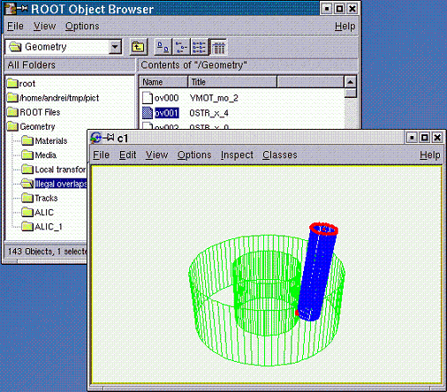

A volume containment region is in fact the result of the subtraction of
all daughters. On the other hand, there are two other categories of
overlaps that are considered illegal since they lead to unpredictable
results during tracking.

A) If a positioned volume contains points that are not also contained
by its mother, we will call the corresponding region as an `extrusion`.
When navigating from outside to inside (trying to enter such a node)
these regions are invisible since the current track has not yet reached
its mother. This is not the case when going the other way since the
track has first to exit the extruding node before checking the mother.
In other words, an extrusion behavior is dependent on the track
parameters, which is a highly undesirable effect.

B) We will call ***`overlaps`*** only the regions in space contained by
more than one node inside the same container. The owner of such regions
cannot be determined based on hierarchical considerations; therefore
they will be considered as belonging to the node from which the current
track is coming from.

When coming from their container, the ownership is totally
unpredictable. Again, the ownership of overlapping regions highly
depends on the current track parameters.

We must say that even the overlaps of type A) and B) are allowed in case
the corresponding nodes are created using
**`TGeoVolume`**`::AddNodeOverlap()` method. Navigation is performed in such
cases by giving priority to the non-overlapping nodes. The modeller has
to perform an additional search through the overlapping candidates.
These are detected automatically during the geometry closing procedure
in order to optimize the algorithm, but we will stress that extensive
usage of this feature leads to a drastic deterioration of performance.
In the following we will focus on the non-declared overlaps of type A)
and B) since this is the main source of errors during tracking. These
are generally non-intended overlaps due to coding mistakes or bad
geometry design. The checking package is loaded together with the
painter classes and contains an automated overlap checker.**

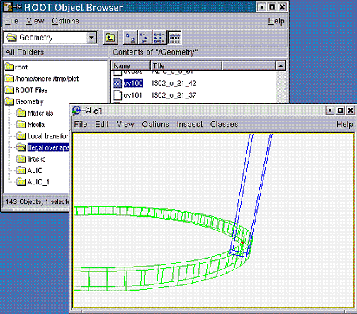

This can be activated both at volume level (checking for illegal
overlaps only one level inside a given volume) and from the geometry
manager level (checking full geometry):

``` {.cpp}
myVolume->CheckOverlaps(precision, option);
gGeoManager->CheckOverlaps(precision);
myNode->CheckOverlaps(precision);
```

Here precision represents the desired maximum accepted overlap value in
centimeters (default value is 0.1). This tool checks all possible
significant pairs of candidates inside a given volume (not declared as
overlapping or division volumes). The check is performed by verifying
the mesh representation of one candidate against the shape of the other.
This sort of check cannot identify all possible overlapping topologies,
but it works for more than 95% and is much faster than the usual
shape-to-shape comparison. For a 100% reliability, one can perform the
check at the level of a single volume by using `option`="`d`" or
`option`="`d<number>`" to perform overlap checking by sampling the
volume with \<`number`\> random points (default 1 million). This
produces also a picture showing in red the overlapping region and
estimates the volume of the overlaps.

An extrusion A) is declared in any of the following cases:

-   At least one of the vertices of the daughter mesh representation is
    outside the mother volume (in fact its shape) and having a safety
    distance to the mother greater than the desired value;
-   At least one of the mother vertices is contained also by one of its
    daughters, in the same conditions.

An overlap B) is declared if:

-   At least one vertex of a positioned volume mesh is contained (having
    a safety bigger than the accepted maximum value) by other positioned
    volume inside the same container. The check is performed also by
    inverting the candidates.

The code is highly optimized to avoid checking candidates that are far
away in space by performing a fast check on their bounding boxes. Once
the checking tool is fired-up inside a volume or at top level, the list
of overlaps (visible as Illegal overlaps inside a **`TBrowser`**) held
by the manager class will be filled with **`TGeoOverlap`** objects
containing a full description of the detected overlaps. The list is
sorted in the decreasing order of the overlapping distance, extrusions
coming first. An overlap object name represents the full description of
the overlap, containing both candidate node names and a letter
(x-extrusion, o-overlap) representing the type. Double-clicking an
overlap item in a **`TBrowser`** produces a picture of the overlap
containing only the two overlapping nodes (one in blue and one in green)
and having the critical vertices represented by red points. The picture
can be rotated/zoomed or drawn in X3d as any other view. Calling
`gGeoManager->PrintOverlaps()` prints the list of overlaps.

### Graphical Checking Methods

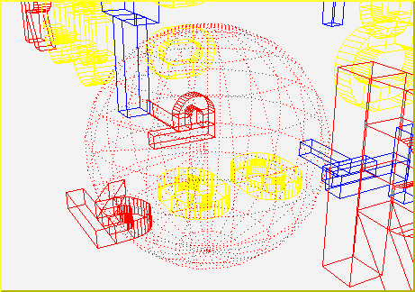

In order to check a given point, `CheckPoint(x,y,z)` method of
**`TGeoManager`** draws the daughters of the volume containing the point
one level down, printing the path to the deepest physical node holding
this point. It also computes the closest distance to any boundary.


A method to check the validity of a given geometry is shooting random
points. This can be called with the method
**`TGeoVolume`**`::RandomPoints()` and it draws a volume with the current
visualization settings. Random points are generated in the bounding box
of the drawn volume. The points are drawn with the color of their
deepest container. Only points inside visible nodes are drawn.

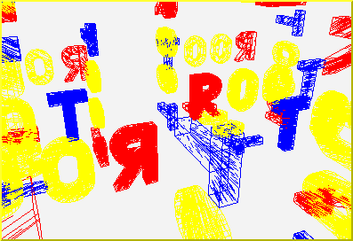

A ray tracing method can be called `TGeoVolume::RandomRays()`. This
shoots rays from a given point in the local reference frame with random
directions. The intersections with displayed nodes appear as segments
having the color of the touched node.

## The Drawing Package

The modeller provides a powerful drawing
package, supporting several different options of visualization. A
library separated from the main one provides all functionality being
linked with the underlying ROOT visualization system. This library is
dynamically loaded by the plug-in manager only when drawing features are
requested. The geometrical structures that can be visualized are volumes
and volume hierarchies.

The main component of the visualization system is volume primitive
painting in a ROOT pad. Starting from this one, several specific options
or subsystems are available, like: X3D viewing using hidden line and
surface removal algorithms, OpenGL viewing\* or ray tracing.

The method `TGeoManager::GetGeomPainter()`loads the painting library in
memory.

This is generally not needed since it is called automatically by
`TGeoVolume::Draw()` as well as by few other methods setting
visualization attributes.

### Drawing Volumes and Hierarchies of Volumes

The first thing one would like to do after building some geometry is to
visualize the volume tree. This provides the fastest validation check
for most common coding or design mistakes. As soon as the geometry is
successfully closed, one should draw it starting from the top-level
volume:

``` {.cpp}
//... code for geometry building
root[] gGeoManager->CloseGeometry();
root[] gGeoManager->GetMasterVolume()->Draw();
```

Doing this ensures that the original top-level volume of the geometry is
drawn, even if another volume is currently the geometry `root`. OK, I
suppose you already did that with your simple geometry and immediately
noticed a new ROOT canvas popping-up and having some more or less
strange picture inside. Here are few questions that might come:

-   ***`Q: "The picture is strangely rotated; where are the coordinate axes?"`***

***`A:`*** If drawn in a new canvas, any view has some default
viewpoint, center of view and size. One can then perform mouse/keyboard
actions to change them:

- Mouse left-click and drag will rotate the view;

- Some keys can be pressed when the view canvas is selected: J/K
zoom/un-zoom, U/I move up/down, L/H move left/right. The coordinate axes
display as well as changing top or side viewpoints can be activated from
the **`TView`** context menu: right-click on the picture when no object
is selected;

-   ***`Q: "Every line is black! I cannot figure out what is what..."`***

***`A:`*** Volumes can have different colors (those known by ROOT of
course). Think at using them after each volume creation:
`myvolume->SetLineColor(Int_t color);` otherwise everything is by
default black.

-   ***`Q: "The top volume of my geometry is a box but I see only its content."`***

***`A:`*** By default the drawn volume is not displayed just because we
do not want to hide its content when changing the view to HLR or solid
mode. In order to see it in the default wire frame picture one has to
call **`TGeoManager::SetTopVisible()`.**

-   ***`Q: "I do not see all volumes in my tree but just something inside."`***

***`A:`*** By default, **`TGeoVolume`**`::Draw()` paints the content of
a given volume three levels down. You can change this by using:
***`gGeoManager`***`::SetVisLevel(n);`

Not only that, but none of the volumes at intermediate levels (0-2) are
visible on the drawing unless they are final ‘leaves' on their branch
(e.g. have no other volumes positioned inside). This behavior is the
default one and corresponds to ‘leaves' global visualization mode
(**`TGeoManager::fVisOption = 1`). In order to see on the screen the
intermediate containers, one can change this mode:
`gGeoManager->SetVisOption(0)`.**

-   ***`Q: "Volumes are highlighted when moving the mouse over their vertices. What does it mean?"`***

***`A:`*** Indeed, moving the mouse close to some volume vertices
selects it. By checking the `Event Status` entry in the root canvas
`Options` menu, you will see exactly which is the selected node in the
bottom right. Right-clicking when a volume is selected will open its
context menu where several actions can be performed (e.g. drawing it).

-   ***`Q: "OK, but now I do not want to see all the geometry, but just a particular volume and its content. How can I do this?"`***

***`A:`*** Once you have set a convenient global visualization option
and level, what you need is just call the `Draw()` method of your
interesting volume. You can do this either by interacting with the
expanded tree of volumes in a ROOT browser (where the context menu of
any volume is available), either by getting a pointer to it (e.g. by
name): `gGeoManager->GetVolume("vol_name")->Draw();`

### Visualization Settings and Attributes

Supposing you now understand the basic things to do for drawing the
geometry or parts of it, you still might be not happy and wishing to
have more control on it. We will describe below how you can fine-tune some
 settings. Since the corresponding attributes are flags belonging to
volume and node objects, you can change them at any time (even when the
picture is already drawn) and see immediately the result.

#### Colors and Line Styles

We have already described how to change the line colors for volumes. In
fact, volume objects inherit from TAttLine class so the line style or
width can also be changed:

``` {.cpp}
myVolume->SetLineColor(kRed);
myVolume->SetLineWith(2);
myVolume->SetLineStyle(kDotted);
```

When drawing in solid mode, the color of the drawn volume corresponds to
the line color.

#### Visibility Settings

The way geometry is build forces the definition of several volumes that
does not represent real objects, but just virtual containers used for
grouping and positioning volumes together. One would not want to see
them in the picture. Since every volume is by default visible, one has
to do this sort of tuning by its own:

``` {.cpp}
myVolumeContainer->SetVisibility(kFALSE);
```

As described before, the drawing package supports two main global
options: 1 (default) - only final volume leaves; 0 - all volumes down
the drawn one appear on the screen. The global visible level put a
limitation on the maximum applied depth. Combined with visibility
settings per volume, these can tune quite well what should appear on the
screen. However, there are situations when users want to see a volume
branch displayed down to the maximum depth, keeping at the same time a
limitation or even suppressing others. In order to accomplish that, one
should use the volume attribute: `Visible daughters`. By default, all
daughters of all volumes are displayed if there is no limitation related
with their level depth with respect to the top drawn volume.

### Ray Tracing

Ray tracing is a quite known drawing technique based on tracking rays
from the eye position through all pixels of a view port device. The
pixel color is derived from the properties of the first crossed surface,
according some illumination model and material optical properties. While
there are currently existing quite sophisticated ray tracing models,
**`TGeo`** is currently using a very simple approach where the light
source is matching the eye position (no shadows or back-tracing of the
reflected ray). In future we are considering providing a base class in
order to be able to derive more complex models.

Due to the fact that the number of rays that have to be tracked matches
the size in pixels of the pad, the time required by this algorithm is
proportional to the pad size. On the other hand, the speed is quite
acceptable for the default ROOT pad size and the images produced by
using this technique have high quality. Since the algorithm is
practically using all navigation features, producing ray-traced pictures
is also a geometry validation check. Ray tracing can be activated at
volume level as the normal `Draw()`.

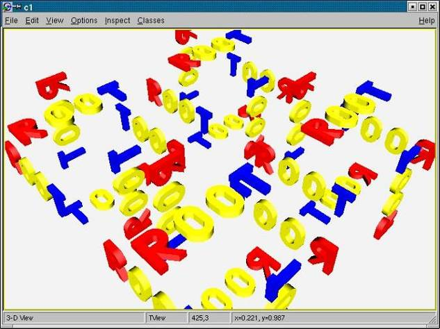

``` {.cpp}
myVolume->Raytrace()
```

Once ray-tracing a view, this can be zoomed or rotated as a usual one.
Objects on the screen are no longer highlighted when picking the
vertices but the corresponding volumes is still accessible.

#### Clipping Ray-traced Images

A ray-traced view can be `clipped` with any shape known by the modeller.
This means that the region inside the clipping shape is subtracted from
the current drawn geometry (become invisible). In order to activate
clipping, one has to first define the clipping shape(s):

`1. TGeoShape *clip1, *clip2, ...`

One might switch between several clipping shapes. Note that these shapes
are considered defined in the current `MARS`. Composite shapes may be
used.

2`. gGeoManager->SetClippingShape(clip1);`

One can activate or deactivate clipping at any time:
`gGeoManager->SetClipping(flag);`

3. Perform ray-tracing:` gGeoManager->GetTopVolume()->Raytrace();`

One can redo the steps 2-3 as many times as needed. Let us look how the
***`rootgeom`*** example looks clipped with a tube.

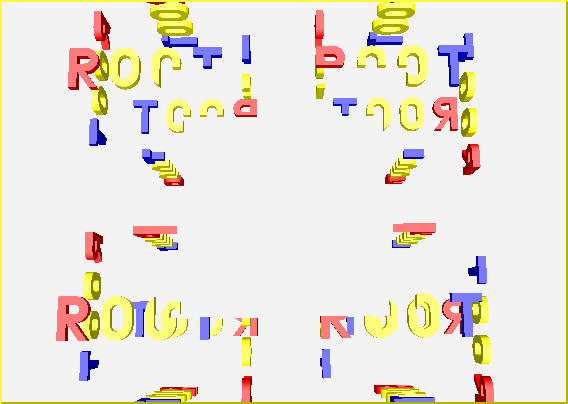

## Representing Misalignments of the Ideal Geometry

The ideal positioning of a detector does not match its position in the
experimental hall. This generally happens not only for the detector
modules, but also for their components. The accurate knowledge of the
detector real misalignments can be extremely important for getting close
to its designed resolution and the expected tracking efficiency.
**`TGeo`** offers tools for representing positioning misalignments,
applying them to the ideal geometry and performing navigation under
these conditions. Detector tracking algorithms can then directly query
the geometry for navigation purposes or for retrieving actual
misalignment information.

### Physical Nodes

Physical nodes are the actual "touchable" objects in the geometry,
representing actually a path of positioned volumes starting with the
top node: `path=/TOP/A_1/B_4/C_3` , where `A`, `B`, `C` represent names
of volumes. The number of physical nodes is given by the total number of
possible of branches in the geometry hierarchy. In case of detector
geometries and specially for calorimeters this number can be of the
order 106-109, therefore it is impossible to create all physical nodes
as objects in memory. In **`TGeo`**, physical nodes are represented by
the class **`TGeoPhysicalNode`** and can be created on demand for
alignment purposes:

``` {.cpp}
TGeoPhysicalNode(const char* path)
```

The knowledge of the path to the objects that need to be misaligned is
essential since there is no other way of identifying them. One can
however create "symbolic links" to any complex path to make it more
representable for the object it designates:

``` {.cpp}
TGeoPNEntry(const char* unique_name, const char* path)
void TGeoPNEntry::SetPhysicalNode(TGeoPhysicalNode *node)
```

Such a symbolic link hides the complexity of the path to the align
object and replaces it with a more meaningful name. In addition,
**`TGeoPNEntry`** objects are faster to search by name and they may
optionally store an additional user matrix.

``` {.cpp}
// Creating a symlink object.
TGeoPNEntry *TGeoManager::SetAlignableEntry(const char *unique_n,
const char*path)
// Retrieving an existing alignable object.
TGeoPNEntry *TGeoManager::GetAlignableEntry(const char *name)
// Retrieving an existing alignable object at a given index.
TGeoPNEntry *GetAlignableEntry(Int_t index)
```

Physical nodes store internally the full list of logical nodes
corresponding to the elements from the string path, as well as the
global transformation matrix for each of them. The top node corresponds
to the level 0 in the stored array, while the last node will correspond
to level `n`. For each level, the node, volume and global matrix can be
retrieved using corresponding getters:

``` {.cpp}
TGeoHMatrix *GetMatrix(Int_t level=-1) const
TGeoNode    *GetNode(Int_t level=-1) const
TGeoShape   *GetShape(Int_t level=-1) const
TGeoVolume  *GetVolume(Int_t level=-1) const
```

By default the object at level n is retrieved (the align-able object).

Once created, a physical node can be misaligned, meaning that its
positioning matrix or even the shape.:

``` {.cpp}
void Align(TGeoMatrix* newmat=0, TGeoShape* newshape=0,
Bool_t check=kFALSE)
```

The convention used is that newmat represents the new local matrix of
the last node in the branch with respect to its mother volume. The
`Align()` method will actually duplicate the corresponding branch within
the logical hierarchy, creating new volumes and nodes. This is mandatory
in order to avoid problems due to replicated volumes and can create
exhaustive memory consumption if used abusively.

Once aligned, a physical node is ready to be tracked. The operation can
be done only after the geometry was closed.

Important NOTE: Calling the `Align()` method for a physical node changes
the node pointers for the stored node branch in the active geometry, Due
to this the other defined physical nodes containing elements of this
path will be invalid. Example:

``` {.cpp}
TGeoPhysicalNode *pn1 =
gGeoManager->MakePhysicalNode("/A_1/B_1/C_2");
TGeoPhysicalNode *pn2 =
gGeoManager->MakePhysicalNode("/A_1/B_1/C_3");
...
pn1->Align(...);
```

The call to `pn1->Align()` will invalidate the pointer to the node `B_1`
in `pn2` object.. The way out is to either call `pn1->Align()` before
the creation of `pn2`, either to use a global method that will correct
all existing physical nodes:

``` {.cpp}
void RefreshPhysicalNodes(Bool_t lock = kTRUE)
```

The method above will optionally lock the possibility of doing any
further misalignment.

## Geometry I/O

Once geometry is successfully built, it can be saved in a root file, as
C++ macro or as GDML file by calling:

``` {.cpp}
TGeoManager::Export(const char *filename,const char*keyname="",
Option_t *opt="vg")
```

-   `Filename`is the name of the file to be written (mandatory).
    Depending on the extension of the file, the geometry is exported
    either as ,root file or .C(.cxx) macro or GDML file in case
    extension is .gdml.
-   `keyname`is the name of the key in the file (default "")
-   `opt` = `"v"` is an export voxelization (default), otherwise
    voxelization is recomputed after loading the geometry, `"g"` this
    option (default) is taken into account only for exporting to gdml
    file and it ensures compatibility with Geant4 (e.g. it adds extra
    plane to incorrectly set polycone, it checks whether offset of Phi
    division is in (-360;0\> range, ...), for this gdml export there are
    two more option, that are not set by default: `"f"` and `"n"`. If
    none of this two options are set, then names of solids and volumes
    in resulting gdml file will have incremental suffix (e.g.
    TGeoBBox\_0x1, TGeoBBox\_0x2, ...). If `"f"` option is set then then
    suffix will contain pointer of object (e.g. TGeoBBox\_0xAAAAA01,
    ...). Finally if option `"n"` is set then no suffix will be added,
    though in this case uniqueness of the names is not ensured and it can
    cause that file will be invalid.

Loading geometry from a root file can be done in the same way as for any
other ROOT object, but a static method is also provided:

``` {.cpp}
TGeoManager::Import(const char *filename,const char *keyname="",
Option_t *opt="")
```

Example:

``` {.cpp}
// Writing to a file geometry definition ending with:
root[] gGeoManager->CloseGeometry();
// geometry is ready
root[] gGeoManager->Export("MyGeom.root");
// file MyGeom.root produced
root[] gGeoManager->Export("MyGeom.C");
 // C++ macro MyGeom.C produced
root[] gGeoManager->Export("MyGeom.gdml");
 // GDML file MyGeom.gdml produced
root[] myVolume->SaveAs("MyVolume.C");
 // C++ macro for the branch starting
 // with MyVolume
// Reading from a file
root[] gSystem->Load("libGeom");
root[] TGeoManager::Import("MyGeom.root");  // geometry is ready
```

Note that not all-current information held by the modeller is written on
the file. For instance, the painter and checker objects are not written,
as well as the temporary current navigation properties: current node
path, point or direction. On the other hand, all objects belonging to
the geometrical hierarchy will always be written. The idea is to be able
to retrieve the geometry in a ready state, ignoring what the state
variables that can be always re-initialized. When the code is generated
for a given **`TGeoVolume`** in the geometry, just the branch starting
with that volume will be saved in the file. Executing the generated code
will create a geometry that has `MyVolume` as top volume. In this case,
only the materials/media/matrices used effectively in the `MyVolume`
branch are exported to file.

Volumes can be made persistent in the same way the full geometry is.
Exporting is straightforward (module1, 2 are pointers to
**`TGeoVolume`** objects):

``` {.cpp}
module1->Export("file.root");
// by default file is overwritten
module2->Export("file.root","","update");
// to the same file
```

Importing will append the volume to the current TGeoManager or will
create one:

``` {.cpp}
TGeoManager *geom = new TGeoManager("myGeom", "");
TGeoVolume *top = geom->MakeBox(...);
geom->SetTopVolume(top);
//name of volume or key (depending on export usage)
TGeoVolume *module1 = TGeoVolume::Import("file.root", "MOD1");
TGeoVolume *module2 = TGeoVolume::Import("file.root", "MOD2");
top->AddNode(module1, 1, new TGeoTranslation(0,0,100));
top->AddNode(module2, 1, new TGeoTranslation(0,0,-100));
// One should close oneself the geometry
geom->CloseGeometry();
```

### GDML

Few lines above word GDML was used. GDML stands for **G**eometry
**D**escription **M**arkup **L**anguage. It is an application-independent
geometry description format based on XML. It is mainly used for geometry
interchange between ROOT and Geant4 framework. More details about this
project can be found http://gdml.web.cern.ch. This feature
(importing/exporting from/to gdml file format) is disabled by default in
ROOT installation. To enable this feature add `--enable-gdml` option to
`./configure` script call.

## Navigation Algorithms

This section will describe the main methods and algorithms used for
implementing the navigation features within the geometrical modeller.
This includes navigation queries at shape level, global geometrical
queries and optimization mechanisms.

### Finding the State Corresponding to a Location (x,y,z)

For reminder, a geometry state is a ‘touchable' object in the geometry
hierarchy. It is represented by a path like: **/TOP\_1/A\_1/B\_3/C\_1**,
where **B\_3** for instance is a copy of volume **B** positioned inside
volume **A**. A state is always associated to a transformation matrix
**M** of the touchable with respect to the global reference frame
(obtained by piling-up all local transformations of nodes in the branch
with respect to their containers). The current state and the
corresponding global matrix are updated whenever the geometry depth is
modified. The global transformations corresponding to all nodes in the
current branch are kept in an array: (**MTOP\_1, MA\_1, MB\_3, ...**).

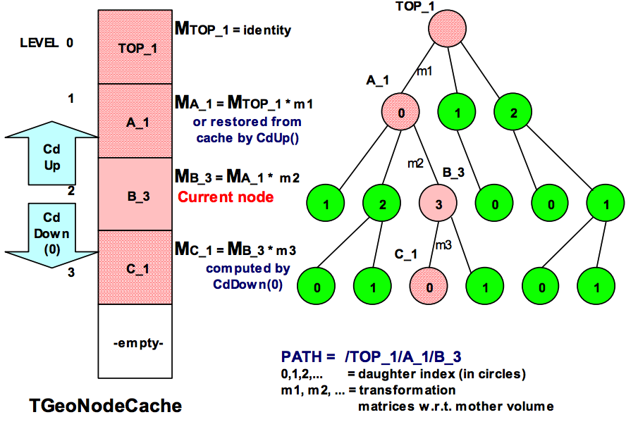

The elementary operations for changing the state are:

``` {.cpp}
TGeoManager::CdUp();
TGeoManager::CdDown(i);
TGeoManager::CdTop()
```

The current state accounting and global matrix handling after these
operations are depicted in the figure below. Now let us suppose that we
have a particle at position *P(x,y,z)*. The first thing needed for
transporting it is the current object our particle is into, so that we
can retrieve its material properties. This task is done by:

``` {.cpp}
TGeoNode *TGeoManager::FindNode(x,y,z)
```

Note that the current particle position can be set using
**`SetCurrentPosition(x,y,z)`** method of the manager class, in which
case **`FindNode()`** can be called without arguments. The method
returns a pointer to the *deepest node* that geometrically contains *P*
(in our case let us suppose it is *B\_3*). Since a node is just a
positioned volume, we can then get a pointer to the volume, medium or
material objects related to it. *Deepest* means that *B\_3* still
contains point *P* (as well as *A\_1* and *TOP\_1*), but none of the
daughters of volume **B** does. After finding out the node containing
the particle, one can check if the geometry state is different compared
to the last located point:

``` {.cpp}
Bool_t *TGeoManager::IsSameLocation()
```

The algorithm for finding where a point is located in geometry is
presented in the figure 17-36.

It always starts by checking if the last computed modeller state is the
answer. This optimizes the search when continuously tracking a particle.
The main actions performed are:

-   moving up and down in the logical node tree while updating the
    current node and its global matrix
-   converting the global position into the local frame of the current
    node/volume
-   checking whether the local position lies within the geometrical
    shape of the current volume - if this is the case continue the
    search downwards for the daughters of the current node, otherwise
    search upwards its containers until the top level is reached.
-   the number of candidate nodes to be checked at a given level is
    minimized by an additional optimization structure: voxels. This is
    effective even in case there is only one daughter of the current
    volume.
-   in case the current node is declared as possibly overlapping, the
    method FindInCluster() is invoked. This method checks all different
    possibilities within the cluster of overlapping candidates. One of
    the candidates is prioritized if one of the following conditions id
    fulfilled (in order):
-   Is declared as non-overlapping (these are anyway searched first)
-   Has at least one daughter that contains the current point
-   Was already declared as containing the point at a previous step

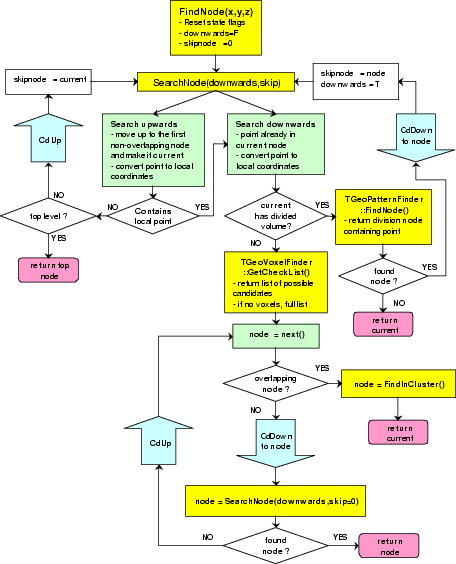

### Finding the Distance to Next Crossed Boundary

The most important feature provided by the modeller related to track
propagation is the computation of the distance to the next boundary
along a straight line.

The relevant state parameters used for this task are:

-   Current particle position and direction `(x,y,z,nx,ny,nz)`, where ni
    is the direction cosine with axis (`i`).
-   Current node (and path) in geometry must be set by calling
    `TGeoManager::FindNode(x,y,z) `beforehand The method computing the
    distance to next boundary is:

``` {.cpp}
TGeoNode *TGeoManager::FindNextBoundary(stepmax, path)
```

The output node returned by the method is the object which shape
boundary will be crossed first. The distance to the next crossing can be
retrieved after the call:

``` {.cpp}
Double_t TGeoManager::GetStep()
```

-   The main input parameter is `stepmax,` which act as a trigger for
    different features. The absolute value of this parameter represents
    the step value proposed by the user. The algorithm will never try o
    search for boundaries further than this distance. In case no
    boundary is found the returned node will be the current one and the
    computed step to boundary will be equal to abs (`stepmax`) having
    the meaning *"step approved"*. The default value for `stepmax` is
    `TGeoShape::Big `with the meaning that boundaries are looked for
    without limitation.


According the values of the input parameters the method will perform
additional optional tasks:

**`|stepmax| < `** ***`TGeoShape::Big()`*** **` `**

The safe distance in the current volume is also computed. Moving the
particle from its current location with this distance in any direction
is safe in the sense that will never change the current state.

**`stepmax < 0`**

The global matrix for the object that will have the next crossed
boundary is also computed. This can be retrieved for masterlocal point
or vector conversions: **`TGeoManager`**::`GetNextMatrix`()

In case the computation of the normal vector to the next crossed surface
is required, using a negative stepmax value is recommended. In this case
one can subsequently call a method for fast normal computation:

``` {.cpp}
Double_t *TGeoManager::FindNormalFast()
```

**`path `** **` 0`**

In case a path to a given physical object is specified, the distance to
its boundary is computed ignoring the rest of the geometry

#### Output Values

`TGeoManager::GetStep()`: distance to next boundary.

`TGeoManager::GetSafeDistance()`: safe distance (in case it was
computed).

`TGeoManager::IsOnBoundary()`: the initial point `(x,y,z)` was (or was
not) on a boundary within `TGeoShape::Tolerance()`.

The algorithm checks first if the computation of safety was required. If
this is the case and the global point coordinates did not change from
the last query, the last computed safety is taken. Otherwise, the method
**`TGeoManager`**`::Safety ()` is invoked. A safety value less than
**`TGeoShape`**`::Tolerance()` will set the flag IsOnBoundary to true.
On the other hand, a safety value bigger than the proposed step will
stop the computation of the distance to next boundary, returning the
current geometry location with the meaning that the proposed step is
safe.

The next stage is to check if computation of the distance to a give
physical object specified by a path was required. If this is the case,
the modeller changes the state to point to the required object, converts
the current point and direction coordinates to the local frame of this
object and computes the distance to its shape. The node returned is the
one pointed by the input path in case the shape is crossed; otherwise
the returned value is NULL. In case the distance to next crossed
boundary is required, the current point has to be physically INSIDE the
shape pointed by the current volume. This is only insured in case a call
to `TGeoManager::FindNode()` was performed for the current point.
Therefore, the first step is to convert the global current point and
direction in the local reference frame of the current volume and to
compute the distance to exit its shape from inside. The returned value
is again compared to the maximum allowed step (the proposed one) and in
case the distance is safe no other action is performed and the proposed
step is approved. In case the boundary is closer, the computed distance
is taken as maximum allowed step. For optimization purposed, for
particles starting very close to the current volume boundary (less than
0.01 microns) and exiting the algorithm stops here.

After computing the distance to exit the current node, the distance to
the daughter of the current volume which is crossed next is computed by
**`TGeoManager`**`::FindNextDaughterBoundary().` This computes the
distance to all daughter candidates that can be possibly crossed by
using volume voxelization. The algorithm is efficient in average only in
case the number of daughters is greater than 4. For fewer nodes, a
simple loop is performed and the minimum distance (from a point outside
each shape) is taken and compared to the maximum allowed step. The step
value is again updated if `step<stepmax` .

A special case is when the current node is declared as possibly
overlapping with something else. If this is the case, the distance is
computed for all possibly overlapping candidates, taking into account
the overlapping priorities (see also: " Overlapping volumes ").

The global matrix describing the next crossed physical node is
systematically computed in case the value of the proposed step is
negative. In this case, one can subsequently call
`TGeoManager::ComputeNormalFast()` to get the normal vector to the
crossed surface, after propagating the current point with the
`TGeoManager::GetStep()` value. This propagation can be done like:

``` {.cpp}
Double_t *current_point = gGeoManager->GetCurrentPoint();
Double_t *current_dir = gGeoManager->GetCurrentDirection();
for (Int_t i=0; i<3; i++)
    current_point[i] += step * current_dir[I];
```

Note: The method `TGeoManager::FindNextBoundary()` does not modify the
current point/direction nor the current volume/state. The returned node
is the next crossed one, but the physical path (state) AFTER crossing
the boundary is not determined. In order to find out this new state, one
has to propagate the point with a distance slightly bigger that the
computed step value (which is accurate within numerical precision). A
method that performs this task finding the next location is
`TGeoManager::Step()`, described in " Making a Step ", but users may
implement more precise methods to insure post-step boundary crossing.

## Geometry Graphical User Interface

The geombuilder package allows you to create and edit geometries. The
package provides a library of all GUI classes related to geometry. Each
editable geometry class **`TGeoXXX`** have a correspondent editor
**`TGeoXXXEditor`** that provides a graphics user interface allowing to
edit some (or all) parameters of a geometry object. The editable objects
are geometry manager, volumes, nodes, shapes, media, materials and
matrices. The interfaces provide also access to specific functionality
of geometry objects. The editing mechanism is based on ROOT GED
(Graphics Editors) functionality and the library is loaded using the
plug-in mechanism.

### Editing a Geometry

There are two different use cases having different ways of invoking the
geometry editors. The first one applies when starting with geometry from
scratch and using the builder functionality to create new geometry
objects. In this case, one should use the sequence:

``` {.cpp}
root[] TGeoManager *geom = new TGeoManager("MyGeom",
"Test builder");
root[] geom->Edit(Option_t *option="");
```

The lines above will create a new **`TGeoManager`** class, create an
empty canvas and start the editor in the left-sided editor frame
attached to the canvas. To open the editor in a separate frame one
should provide a non-empty string as option to the `Edit()` method.

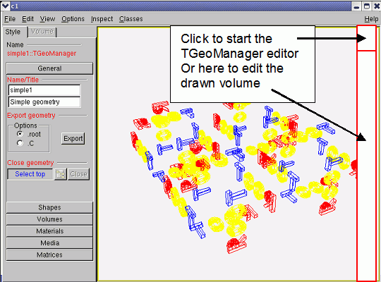

### The Geometry Manager Editor

 
 


The second use case applies when starting to edit an existing geometry.
Supposing the geometry was loaded into memory, besides the first method
that still applies one can also edit drawn geometry objects. For this,
the menu entry View/Editor of the canvas containing for instance a drawn
volume must be activated. For starting the volume editor one can click
on a volume. The GUI of the **`TGeoManager`** class can be started by
clicking on the top-right `40x40` pixels corner of the pad with a drawn
geometry.

This is the main entry point for editing the geometry or creating new
objects. Once the interface is created (using one of the methods
described above), several categories can be accessed via a shutter GUI
widget:

-   *General.* This allows changing the name/title of the geometry,
    setting the top volume, closing the geometry and saving the geometry
    in a file. The file name is formed by `geometry_name.C` or `.root`
    depending if the geometry need to be saved as a `C` macro or a
    `.root` file.
-   *Shapes.* The category provides buttons for creation of all
    supported shapes. The new shape name is chosen by the interface, but
    can be changed from the shape editor GUI. Existing shapes can be
    browsed and edited from the same category.
-   *Volumes.* The category allows the creation of a new volume having a
    given name, shape and medium. For creating a volume assembly only
    the name is relevant. Existing volumes can be browsed or edited from
    this category.
-   *Materials.* Allows creation of new materials/mixtures or editing
    existing ones.
-   *Media.* The same for creation/editing of tracking media (materials
    having a set of properties related to tracking)
-   *Matrices.* Allows creation of translations, rotations or combined
    transformations. Existing matrices can also be browser/edited.

### Editing Existing Objects

For editing an existing object from one of the categories described
above, the interface imposes first a selection among all objects of the
corresponding type stored in the geometry. This can be done by clicking
the button next to the blue label *Select \<object\>*. The dialog
interfaces are generally different for different types of objects. The
volume selection dialog offers the possibility to select either a volume
already connected to the geometry hierarchy or non-connected ones.
Selection for shapes and matrices is split into categories represented
by top-level list tree items for: boxes, tubes, translations, rotations,
etc.

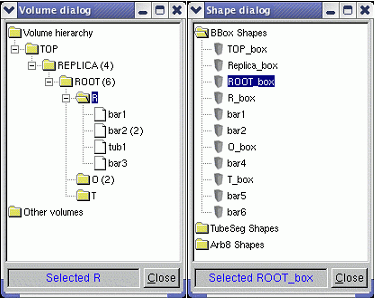

Once a selection is made and the dialog is closed, the selected item
name will appear in the corresponding label and the button Edit will
start the object editor in a transient frame. Closing these transient
frames will not delete, but just hide existing opened editors for later
reuse. Their lifetime is determined by the canvas to which the manager
editor is attached to, since these will be destroyed together.

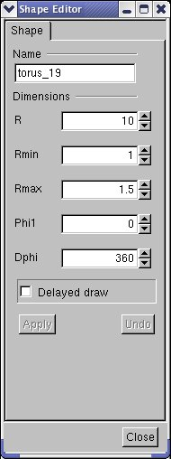
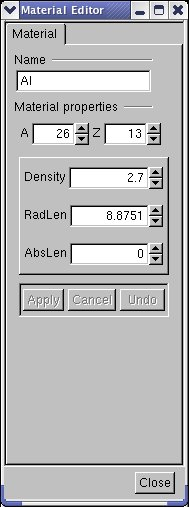
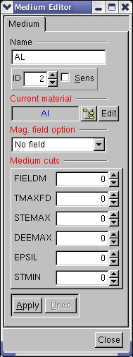
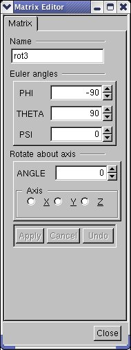
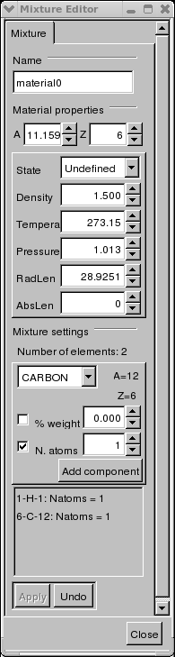

For most editors, the functionalities Apply and Undo are provided.

For shapes, changing any of the shape parameters will activate the
"*Apply*" button only if the check button "*Delayed draw*" is checked,
otherwise the changes are immediately applied. Once the apply button is
pressed, the changes are applied to the edited shape and drawn. The
"*Undo*" button becomes active after the first modification has been
applied. It allows restoring the initial parameters of the shape.

NOTE: In this version the "*Undo*" does not allow restoring an
intermediate state of the parameters that was applied - it will always
restore the parameters at the moment the shape was edited.

All material properties changes are undoable. The mixture editor
currently allows adding elements one by one in the mixture composition.
This can be done either by element weight fraction or by number of
atoms. Once an element was added using one method the other method is not
selectable anymore. Summing component fractions up to 1 in the final
mixture is the user responsibility. Adding materials as components of a
mixture is not supported in this version.

The elements that were added to the mixture appear in the bottom of the
mixture editor. The operations performed on mixture are not undoable.

### Creation of New Objects

As described above, all geometry object creators are accessible within
the geometry manager editor frame. Generally, if the new object that
needs to be created does not depend on other objects, it will be built
with a set of default parameters. This is the case for all shapes
(except composite shapes) and matrices. For all the other objects the
interface forces the selection of components before creating the object.

### Editing Volumes

Volumes are hierarchical components in the geometry, therefore their
editor is more complex. It provides the following functionalities:

-   *General*. This category allows changing the name of the volume and
    selecting other shape or medium among existing ones.

-   *Daughters*. The category allows removing existing daughter nodes or
    adding new ones. The button "*Position*" allows editing the
    positioning matrix of a given node.

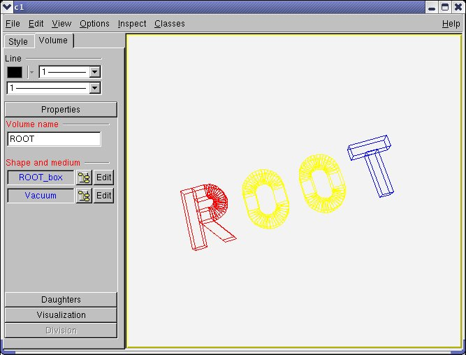
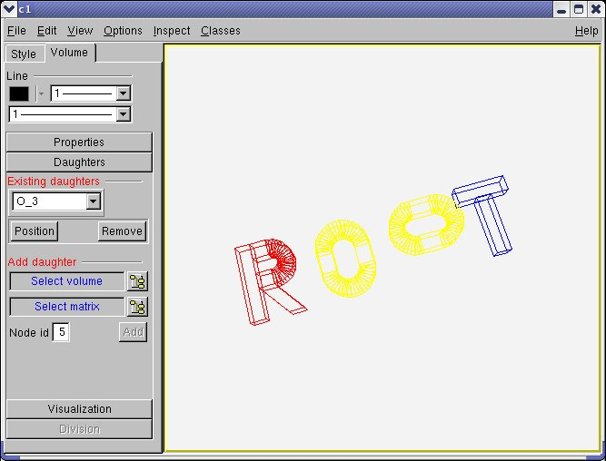

-   *Visualization*. This category allows changing the visibility of the
    edited volume or for its daughters, as well as other visualization
    settings. The radio button "*All*" allows viewing all volumes down
    to the selected depth. "*Leaves*" will draw only the deepest nodes
    that have the selected depth or lower level ones that have no
    daughters inside. "*Only*" will allow drawing only the edited
    volume. The check button "*Raytrace*" will just draw the current
    selection in solid mode using the ray-tracing algorithm provided by
    TGeo.

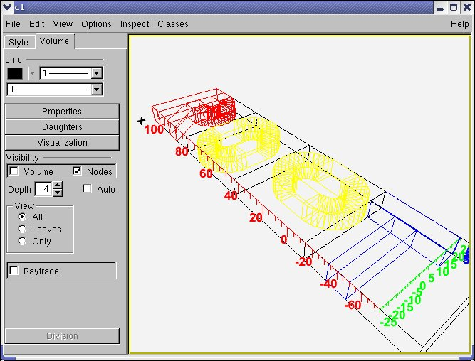
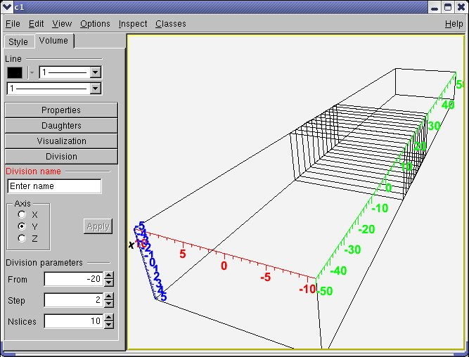

-   *Division*. Allows dividing the edited volume according a given
    pattern. The division axes that are allowed are presented in a
    radio-button group. The number entries labeled "*From*", "*Step*"
    and "*Nslices*" correspond to the divisioning parameters on the
    selected axis. The range of the division is between `start` and
    `start+ndiv*step` values and its validity is checked upon changing
    one of the values.

NOTE: When changing a value in a number entry by typing a number, press
ENTER at the end to validate. This applies for taking into account and
validation of any number change in the geometry editors.

### How to Create a Valid Geometry with Geometry Editors

1. Create a new geometry manager and start the editor as described at
the beginning.

2. Create at least one material from the "*Materials*" shutter item
category. Generally, for creating objects, the interface is always in
the **`TGeoManagerEditor`** in different categories - one should just
provide a name and requested parameters.

3. Create a shape that will be used for the top volume within the
"*Shapes*" category. For the moment, the shapes that have editors are
Box, Para, Trd1, Trd2, Tube, Tube segment, Cone, Cone segment, Hype,
Pcon, Torus and Sphere.

4. Create a medium from one of the existing materials from the
"*Medium*" category. You will notice that some categories as "*Volume*"
and "*Medium*" are inactive at the beginning because at that time there
is no material yet (for making a medium) and no shape (for making a
volume). These categories are dynamically activated once all the
required components are defined.

5. Create a volume from the "*Volumes*" category. You will notice that
contrary to the other editors, the volume editor is opened in a tab, not
transient - this is because it is more complex.

6. Go back to "*General*" category and select the newly created volume
as the top one (you can do it also from the volume category). This is
just for starting. To create some hierarchy, one has to create several
other volumes and the matrices to position them. Once this is done, use
the volume editor interface to:
    - add/remove daughters, change shape, edit position of daughters
    - change visualization settings
    - divide the volume (only if there are no daughters yet)

7. Close the geometry from the "*General*" category.
