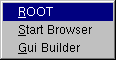
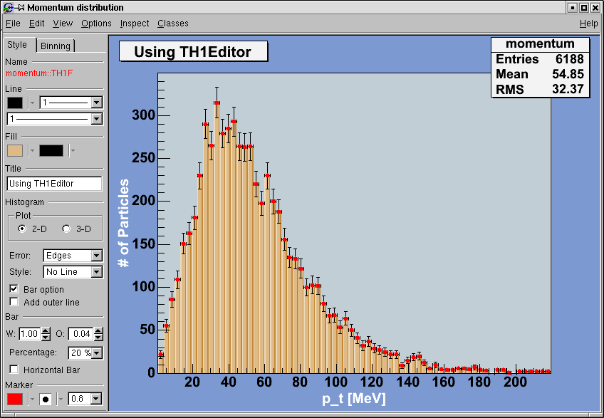

# Getting Started


We begin by showing you how to use ROOT interactively. There are two
examples to click through and learn how to use the GUI. We continue by
using the command line, and explaining the coding conventions, global
variables and the environment setup. If you have not installed ROOT,
you can do so by following the instructions in the appendix, or on the
ROOT web site: <http://root.cern.ch/root/Availability.html>

## Setting the Environment Variables


Before you can run ROOT you need to set the environment variable
`ROOTSYS` and change your path to include `root/bin` and library path
variables to include `root/lib`. Please note: the syntax is for
`bash`, if you are running `tcsh` you will have to use `setenv`
instead of `export`.

1. Define the variable \$ROOTSYS to the directory where you unpacked
the ROOT:

```
$ export ROOTSYS=$HOME/root
```

2. Add ROOTSYS/bin to your PATH:

```
$ export PATH=$PATH:$ROOTSYS/bin
```

3. Setting the Library Path

On HP-UX, before executing the interactive module, you must set the
library path:

```
$ export SHLIB_PATH=$SHLIB_PATH:$ROOTSYS/lib
```

On AIX, before executing the interactive module, you must set the
library path:

```
$ [ -z "$LIBPATH" ] && export LIBPATH=/lib:/usr/lib
$ export LIBPATH=$LIBPATH:$ROOTSYS/lib
```

On Linux, Solaris, Alpha OSF and SGI, before executing the interactive
module, you must set the library path:

```
$ export LD_LIBRARY_PATH=$LD_LIBRARY_PATH:$ROOTSYS/lib
```

On Solaris, in case your LD\_LIBRARY\_PATH is empty, you should set
it:

```
$ export LD_LIBRARY_PATH=$LD_LIBRARY_PATH:$ROOTSYS/lib:/usr/dt/lib
```

If you use the `afs` version you should set (*vers* = version number,
*arch* = architecture):

```
$ export ROOTSYS=/afs/cern.ch/sw/lcg/external/root/vers/arch/root
```

If ROOT was installed in `$HOME/myroot` directory on a local machine,
one can do:

```
cd $HOME/myroot
. bin/thisroot.sh       // or source bin/thisroot.sh
```

The new `$ROOTSYS/bin/thisroot.[c]sh` scripts will set correctly the
`ROOTSYS`, `LD_LIBRARY_PATH` or other paths depending on the platform
and the `MANPATH`. To run the program just type: `root`.

## Start and Quit a ROOT Session


```
$ root
   -------------------------------------------------------------------------
  | Welcome to ROOT 6.10/01                             http://root.cern.ch |
  |                                            (c) 1995-2017, The ROOT Team |
  | Built for macosx64                                                      |
  | From heads/v6-10-00-patches@v6-10-00-25-g9f78c3a, Jul 03 2017, 11:39:44 |
  | Try '.help', '.demo', '.license', '.credits', '.quit'/'.q'              |
   -------------------------------------------------------------------------

root [0]
```

To start ROOT you can type `root` at the system prompt. This starts up
Cling, the ROOT command line C/C++ interpreter, and it gives you the
ROOT prompt (`root[0]`).

It is possible to launch ROOT with some command line options, as shown
below:

```
%  root -?
Usage: root [-l] [-b] [-n] [-q] [dir] [[file:]data.root]
                                                [file1.C ... fileN.C]
Options:
  -b : run in batch mode without graphics
  -n : do not execute logon and logoff macros as specified in .rootrc
  -q : exit after processing command line macro files
  -l : do not show splash screen
  -x : exit on exception
 dir : if dir is a valid directory cd to it before executing

  -?       : print usage
  -h       : print usage
  --help   : print usage
  -config  : print ./configure options
```

-   -b ROOT session runs in batch mode, without graphics display. This
    mode is useful in case one does not want to set the DISPLAY or
    cannot do it for some reason.

-   -n usually, launching a ROOT session will execute a logon script
    and quitting will execute a logoff script. This option prevents
    the execution of these two scripts.

-   it is also possible to execute a script without entering a ROOT
    session. One simply adds the name of the script(s) after the ROOT
    command. Be warned: after finishing the execution of the script,
    ROOT will normally enter a new session.

-   -q process command line script files and exit.

For example if you would like to run a script `myMacro.C` in the
background, redirect the output into a file `myMacro.log`, and exit
after the script execution, use the following syntax:

```
root -b -q myMacro.C > myMacro.log
```

If you need to pass a parameter to the script use:

```
root -b -q 'myMacro.C(3)' > myMacro.log
```

Be mindful of the quotes, i.e. if you need to pass a string as a
parameter, the syntax is:

```
root -b -q 'myMacro.C("text")' > myMacro.log
```

You can build a shared library with ACLiC and then use this shared
library on the command line for a quicker execution (i.e. the compiled
speed rather than the interpreted speed). See also "Cling the C++
Interpreter".

```
root -b -q myMacro.so > myMacro.log
```

ROOT has a powerful C/C++ interpreter giving you access to all available
ROOT classes, global variables, and functions via the command line. By
typing C++ statements at the prompt, you can create objects, call
functions, execute scripts, etc. For example:

``` {.cpp}
root[] 1+sqrt(9)
(const double)4.00000000000000000e+00
root[] for (int i = 0; i<4; i++) cout << "Hello" << i << endl
Hello 0
Hello 1
Hello 2
Hello 3
root[] .q
```

To exit the ROOT session, type `.q`.

``` {.cpp}
root[] .q
```

## Using the GUI


The basic whiteboard on which an object is drawn in ROOT is called a
canvas (defined by the class **`TCanvas`**). Every object in the
canvas is a graphical object in the sense that you can grab it, resize
it, and change some characteristics using the mouse. The canvas area
can be divided in several sub areas, so-called pads
(the class **`TPad`**). A pad is a canvas sub area that can contain
other pads or graphical objects. At any one time, just one pad is the
so-called active pad. Any object at the moment of drawing will be
drawn in the active pad. The obvious question is: what is the relation
between a canvas and a pad? In fact, a canvas is a pad that spans
through an entire window. This is nothing else than the notion of
inheritance. The **`TPad`** class is the parent of the **`TCanvas`**
class. In ROOT, most objects derive from a base class **`TObject`**.
This class has a virtual method `Draw()` such as all objects are
supposed to be able to be "drawn". If several canvases are defined,
there is only one active at a time. One draws an object in the active
canvas by using the statement:

``` {.cpp}
object.Draw()
```

This instructs the object "`object`" to draw itself. If no canvas is
opened, a default one (named "`c1`") is created. In the next example,
the first statement defines a function and the second one draws it. A
default canvas is created since there was no opened one. You should
see the picture as shown in the next figure.

``` {.cpp}
root[] TF1 f1("func1","sin(x)/x",0,10)
root[] f1.Draw()
<TCanvas::MakeDefCanvas>: created default TCanvas with name c1
```


The following components comprise the canvas window:

-   Menu bar - contains main menus for global operations with files,
    print, clear canvas, inspect, etc.

-   Tool bar - has buttons for global and drawing operations; such as
    arrow, ellipse, latex, pad, etc.

-   Canvas - an area to draw objects.

-   Status bar - displays descriptive messages about the selected
    object.

-   Editor frame - responds dynamically and presents the user
    interface according to the selected object in the canvas.

### Main Menus and Toolbar


At the top of the canvas window are File, Edit, View, Options,
Inspect, Classes and Help menus.

#### File Menu


-   *New Canvas*: creates a new canvas window in the current ROOT
    session.

-   *Open...*: popup a dialog to open a file.

-   *Close Canvas*: close the canvas window.

-   *Save*: save the drawing of the current canvas in a format
    selectable from the submenu. The current canvas name is used as a
    file name for various formats such as PostScript, GIF, JPEG, C
   macro file, root file.

-   *Save As...*: popup a dialog for saving the current canvas drawing
    in a new filename.

-   *Print*: popup a dialog to print the current canvas drawing

-   *Quit ROOT*: exit the ROOT session


#### Edit Menu

There is only one active menu entry in the Edit menu. The others menu
entries will be implemented and will become active in the near future.

-   *Clear:* delete all objects in the canvas
    or in the selected pad according to the selected entry in the
    submenu.

#### View Menu


-   *Editor*: toggles the view of the editor. If it is selected
    activates and shows up the editor on the left side of the canvas
    window. According to the selected object, the editor loads the
    corresponding user interface for easy change of the object's
    attributes.

-   *Toolbar*: toggles the view of the toolbar. If it is selected
    activates and shows up the toolbar. It contains buttons for easy
    and fast access to most frequently used commands and for graphics
    primitive drawing. Tool tips are provided for helping users.

-   *Status Bar*: toggles the view of the status bar. If it is
    selected, the status bar below the canvas window shows up. There
    the identification of the objects is displayed when moving the
    mouse (such as the object's name, the object's type, its
    coordinates, etc.).

-   *Colors*: creates a new canvas showing the color palette.

-   *Markers*: creates a new canvas showing the various marker styles.

-   *Iconify*: create the canvas window icon, does not close the
    canvas

-   *View With...*: If the last selected pad contains a 3-d structure,
    a new canvas is created with a 3-D picture according to the
    selection made from the cascaded menu: X3D or OpenGL. The 3-D
    image can be interactively rotated, zoomed in wire-frame, solid,
    hidden line or stereo mode.


#### Options Menu


-   *Auto Resize Canvas*: turns auto-resize of the canvas *on/off*:

    -   *on* - the canvas fits to the window when changing the window
               size;
    -   *off* - the canvas stays fixed when changing the window size.

-   *Resize Canvas*: resizes and fits the canvas to the window size.

-   *Move Opaque*: if selected, graphics objects are moved in opaque
    mode; otherwise, only the outline of objects is drawn when moving
    them. The option opaque produces the best effect but it requires a
    reasonably fast workstation or response time.

-   *Resize Opaque*: if selected, graphics objects are resized in
    opaque mode; otherwise, only the outline of objects is drawn when
    resizing them.

-   *Interrupt*: interrupts the current drawing process.

-   *Refresh*: redraws the canvas contents.

-   *Pad Auto Exec*: executes the list of **`TExecs`** in the current
    pad.

-   *Statistics*: toggles the display of the histogram statistics box.

-   *Histogram Title*: toggles the display of the histogram title.

-   *Fit Parameters*: toggles the display of the histogram or graph
    fit parameters.

-   *Can Edit Histogram*: enables/disables the possibility to edit
    histogram bin contents.


#### Inspect Menu


-   *ROOT*: inspects the top-level ***`gROOT`*** object (in a new
    canvas).

-   *Start Browser*: starts a new object browser (in a separate
    window).

-   *GUI Builder*: starts the GUI builder application (in a separate
    window).




#### Help Menu


-   *Canvas:* help on canvas as a whiteboard area for drawing.

-   *Menus*: help on canvas menus.

-   *Graphics Editor*: help on primitives' drawing and objects'
    editor.

-   *Browser*: help on the ROOT objects' and files' browser.

-   *Objects*: help on DrawClass, Inspect and Dump context menu items.

-   *PostScript*: help on how to print a canvas to a PostScript file
    format.

-   *About ROOT*: pops up the ROOT Logo with the version number.


#### Classes Menu

-   *Classes*: starts the ClassTree viewer that draws inheritance tree
    for a list of classes.


#### Toolbar

The following menu shortcuts and utilities are available from the
toolbar:

 Create a new canvas window.

 Popup the Open File dialog.

 Popup the Save As... dialog.

 Popup the Print dialog.

 Interrupts the current drawing process.

 Redraw the canvas.

 Inspect the ***`gROOT`*** object.

 Create a new objects' browser.

You can create the following graphical objects using the toolbar
buttons for primitive drawing. Tool tips are provided for helping
your choice.

 **An Arc or circle**: Click on the center
of the arc, and then move the mouse. A rubber band circle is shown.
Click again with the left button to freeze the arc.

 **A Line**: Click with the left button at
the point where you want to start the line, then move the mouse and
click again with the left button to freeze the line.

 **An Arrow:**Click with the left button at
the point where you want to start the arrow, then move the mouse and
click again with the left button to freeze the arrow.

 **A Diamond**: Click with the left button
and freeze again with the left button. The editor draws a rubber band
box to suggest the outline of the diamond.

 **An Ellipse**: Proceed like for an arc.
You can grow/shrink the ellipse by pointing to the sensitive points.
They are highlighted. You can move the ellipse by clicking on the
ellipse, but not on the sensitive points. If, with the ellipse context
menu, you have selected a fill area color, you can move a
filled-ellipse by pointing inside the ellipse and dragging it to its
new position.

 **A Pad**: Click with the left button and
freeze again with the left button. The editor draws a rubber band box
to suggest the outline of the pad.

 **A PaveLabel**: Proceed like for a pad.
Type the text of label and finish with a carriage return. The text
will appear in the box.

 **A Pave Text**: Proceed like for a pad.
You can then click on the **`TPaveText`** object with the right mouse
button and select the option `InsertText`.

 **Paves Text**: Proceed like for a
**`TPaveText`**.

 **A Poly Line**: Click with the left button
for the first point, move the moose, click again with the left button
for a new point. Close the poly-line with a double click. To edit one
vertex point, pick it with the left button and drag to the new point
position.

 **A Curly Line**: Proceed as for the arrow
or line. Once done, click with the third button to change the
characteristics of the curly line, like transform it to wave, change
the wavelength, etc.

 **A Curly Arc**: Proceed like for an
ellipse. The first click is located at the position of the center, the
second click at the position of the arc beginning. Once done, one
obtains a curly ellipse, for which one can click with the third button
to change the characteristics, like transform it to wavy, change the
wavelength, set the minimum and maximum angle to make an arc that is
not closed, etc.

 **A Text/Latex string**: Click with the
left button where you want to draw the text and then type in the text
terminated by carriage return. All **`TLatex`** expressions are valid.
To move the text or formula, point on it keeping the left mouse button
pressed and drag the text to its new position. You can grow/shrink the
text if you position the mouse to the first top-third part of the
string, then move the mouse up or down to grow or shrink the text
respectively. If you position the mouse near the bottom-end of the
text, you can rotate it.

 **A Marker**: Click with the left button
where to place the marker. The marker can be modified by using the
method `SetMarkerStyle()` of **`TSystem`**.

 **A Graphical Cut**: Click with the left
button on each point of a polygon delimiting the selected area. Close
the cut by double clicking on the last point. A **`TCutG`** object is
created. It can be used as a selection for a **`TTree`**`::Draw`. You
can get a pointer to this object with:

``` {.cpp}
TCutG cut = (TCutG*)gPad->GetPrimitive("CUTG")
```

Once you are happy with your picture, you can select the
`Save as canvas.C` item in the canvas File menu. This will
automatically generate a script with the C++ statements corresponding
to the picture. This facility also works if you have other objects not
drawn with the graphics editor (histograms for example).

### The Editor Frame


The ROOT graphics editor loads the corresponding object editor
`objEditor` according to the selected object `obj` in the canvas
respecting the class inheritance. An object in the canvas is selected
after the left mouse click on it. For example, if the selected object
is **`TAxis`**, the **`TAxisEditor`** will shows up in the editor
frame giving the possibility for changing different axis attributes.
The graphics editor can be:

Embedded - connected only with the canvas in the application window
that appears on the left of the canvas window after been activated via
View menu / Editor. It appears on the left side if the canvas window
allowing users to edit the attributes of the selected object via
provided user interface. The name of the selected object is displayed
on the top of the editor frame in red color. If the user interface
needs more space then the height of the canvas window, a vertical
scroll bar appears for easer navigation.



Global - has own application window and can be connected to any
created canvas in a ROOT session. It can be activated via the context
menu entries for setting line, fill, text and marker attributes for
backward compatibility, but there will be a unique entry in the near
future.


The user interface for the following classes is available since ROOT
v.4.04: **`TAttLine`**, **`TAttFill`**, **`TAttMarker`**,
**`TAttText`**, **`TArrow`**, **`TAxis`**, **`TCurlyArc`**,
**`TCurlyLine`**, **`TFrame`**, **`TH1`**, **`TH2`**, **`TGraph`**,
**`TPad`**, **`TCanvas`**, **`TPaveStats`**. For more details, see
"The Graphics Editor", "The User Interface for Histograms", "The User
Interface for Graphs".

### Classes, Methods and Constructors


Object oriented programming introduces objects, which have data
members and methods. The next line creates an object named `f1` of the
class **`TF1`** that is a one-dimensional function. The type of an
object is called a class. The object itself is called an instance of a
class. When a method builds an object, it is called a constructor.

``` {.cpp}
TF1 f1("func1","sin(x)/x",0,10)
```

In our constructor the function sin(x)/x is defined for use, and 0 and
10 are the limits. The first parameter, `func1` is the name of the
object `f1`. Most objects in ROOT have a name. ROOT maintains a list
of objects that can be searched to find any object by its given name
(in our example `func1`).

The syntax to call an object's method, or if one prefers, to make an
object to do something is:

``` {.cpp}
object.method_name(parameters)
```

The dot can be replaced by "`->`" if `object` is a pointer. In
compiled code, the dot MUST be replaced by a "`->`" if object is a
pointer.

``` {.cpp}
object_ptr->method_name(parameters)
```

So now, we understand the two lines of code that allowed us to draw
our function. `f1.Draw()` stands for "call the method `Draw()`
associated with the object `f1` of the class **`TF1`**". Other methods
can be applied to the object `f1` of the class **`TF1`**. For example,
the evaluating and calculating the derivative and the integral are
what one would expect from a function.

``` {.cpp}
root[] f1.Eval(3)
(Double_t)4.70400026866224020e-02
root[] f1.Derivative(3)
(Double_t)(-3.45675056671992330e-01)
root[] f1.Integral(0,3)
(Double_t)1.84865252799946810e+00
root[] f1.Draw()
```

By default the method `TF1::Paint()`, that draws the function,
computes 100 equidistant points to draw it. The number of points can
be set to a higher value with:

``` {.cpp}
root[] f1.SetNpx(2000);
```

Note that while the ROOT framework is an object-oriented framework,
this does not prevent the user from calling plain functions.

### User Interaction


Now we will look at some interactive capabilities. Try to draw the
function `sin(x)/x` again. Every object in a window (which is called a
canvas) is, in fact, a graphical object in the sense that you can grab
it, resize it, and change its characteristics with a mouse click. For
example, bring the cursor over the x-axis. The cursor changes to a
hand with a pointing finger when it is over the axis. Now, left click
and drag the mouse along the axis to the right. You have a very simple
zoom.

When you move the mouse over any object, you can get access to
selected methods by pressing the right mouse button and obtaining a
context menu. If you try this on the function **`TF1`**, you will get
a menu showing available methods. The other objects on this canvas are
the title, a **`TPaveText`** object`;` the x and y-axis, **`TAxis`**
objects, the frame, a **`TFrame`** object, and the canvas a
**`TCanvas `** object. Try clicking on these and observe the context
menu with their methods.


For example try selecting the `SetRange()` method and putting `-10`,
`10` in the dialog box fields. This is equivalent to executing
`f1.SetRange(-10,10)` from the command line, followed by `f1.Draw()`.
Here are some other options you can try.

Once the picture suits your wishes, you may want to see the code you
should put in a script to obtain the same result. To do that, choose
Save / `canvas.C` entry of the File menu. This will generate a script
showing the options set in the current canvas. Notice that you can
also save the picture into various file formats such as PostScript,
GIF, etc. Another interesting possibility is to save your canvas into
the native ROOT format (`.root `file). This will enable you to open it
again and to change whatever you like. All objects associated to the
canvas (histograms, graphs) are saved at the same time.

### Building a Multi-pad Canvas


Let us now try to build a canvas with several pads.

``` {.cpp}
root[] TCanvas *MyC = new TCanvas("MyC","Test canvas",1)
root[] MyC->Divide(2,2)
```

Once again, we call the constructor of a class, this time the class
**`TCanvas`**. The difference between this and the previous
constructor call (**`TF1`**) is that here we are creating a pointer to
an object. Next, we call the method `Divide()` of the **`TCanvas`**
class (that is `TCanvas::Divide())`, which divides the canvas into
four zones and sets up a pad in each of them. We set the first pad as
the active one and than draw the function` f1 `there.

``` {.cpp}
root[] MyC->cd(1)
root[] f1->Draw()
```

All objects will be drawn in that pad because it is the active one.
The ways for changing the active pad are:

-   Click the middle mouse button on a pad will set this pad as the
    active one.

-   Use the method `TCanvas::cd()` with the pad number, as was done in
    the example above:

``` {.cpp}
root[] MyC->cd(3)
```

Pads are numbered from left to right and from top to bottom. Each new
pad created by `TCanvas::Divide()` has a name, which is the name of
the canvas followed by \_1, \_2, etc. To apply the method `cd()` to
the third pad, you would write:

``` {.cpp}
root[] MyC_3->cd()
```

-   Third pad will be selected since you called `TPad::cd()` for the
    object `MyC_3`. ROOT will find the pad that was named` MyC_3 `when
    you typed it on the command line (see ROOT/Cling Extensions to
    C++).

### Saving the Canvas


Using the File menu / Save cascade menu users can save the canvas as
one of the files from the list. Please note that saving the canvas
this way will overwrite the file with the same name without a warning.

All supported file types can be saved via File menu / SaveAs... This
dialog gives a choice to show or suppress the confirmation message for
overwriting an existing file.

If the Overwrite check box is not selected, a message dialog appears
asking the user to overwrite the file (Yes/No). The user choice is
saved for the next time the Save As... dialog shows up.

### Printing the Canvas


The Print command in the canvas File menu pops-up a print dialog where
the user can specify a preferred print command and the printer name.


Both print parameters can be set via the new Print.Command and
Print.Printer rootrc resources as follows:

```
# Printer settings.
WinNT.*.Print.Command:    AcroRd32.exe
Unix.*.Print.Command:     xprint -P%p %f
Print.Printer:            32-rb205-hp
Print.Directory:          .
```

If the `%p` and `%f` are specified as a part of the print command,
they will be replaced by the specified printer name and the file name.
All other parameters will be kept as they are written. A print button
is available in the canvas toolbar (activated via View menu/Toolbar).

## The ROOT Command Line


We have briefly touched on how to use the command line. There are
different types of commands.

1. Cling commands start with "`.`"

``` {.cpp}
root[] .?  //this command will list all the Cling commands
root[] .L <filename>  //load [filename]
root[] .x <filename>  //load and execute [filename]
```

2. SHELL commands start with "`.!`" for example:

``` {.cpp}
root[] .! ls
```

3. C++ commands follow C++ syntax (almost)

``` {.cpp}
root[] TBrowser *b = new TBrowser()
```

### Multi-line Commands


You can use the command line to execute multi-line commands. To begin
a multi-line command you must type a single left curly bracket `{`,
and to end it you must type a single right curly bracket `}`.
For example:

``` {.cpp}
root[] {
end with '}'> Int_t j = 0;
end with '}'> for (Int_t i = 0; i < 3; i++)
end with '}'> {
end with '}'> j= j + i;
end with '}'> cout << "i = " << i << ", j = " << j << endl;
end with '}'> }
end with '}'> }
i = 0, j = 0
i = 1, j = 1
i = 2, j = 3
```

It is more convenient to edit a script than the command line, and if
your multi line commands are getting unmanageable, you may want to
start with a script instead.

### Cling Extensions


We should say that some things are not standard C++. The Cling
interpreter has several extensions. See "ROOT/Cling Extensions to C++".

### Helpful Hints for Command Line Typing


The interpreter knows all the classes, functions, variables, and user
defined types. This enables ROOT to help users to complete the command
line. For example, if we do not know anything about the **`TLine`**
class, the Tab feature helps us to get a list of all classes starting
with **`TL`**(where `<TAB>` means type the Tab key).

``` {.cpp}
root[] l = new TLi<TAB>
TList
TListIter
TLink
TLine
TLimitDataSource
TLimit
```

To list the different constructors and parameters for **`TLine`** use
the `<TAB>` key as follows:

``` {.cpp}
root[] l = new TLine(<TAB>
TLine TLine()
TLine TLine(Double_t x1,Double_t y1,Double_t x2,Double_t y2)
TLine TLine(const TLine& line)
```

### Regular Expression


The meta-characters below can be used in a regular expression:

-   '`^`' start-of-line anchor

-   '`$`' end-of-line anchor

-   '`.`' matches any character

-   '`[`' start a character class

-   '`]`'end a character class

-   '`^`'negates character class if first character

-   '`*`'`Kleene` closure (matches 0 or more)

-   '`+`'Positive closure (1 or more)

-   '`?`' Optional closure (0 or 1)

When using wildcards the regular expression is assumed to be preceded
by a '`^`' (BOL) and terminated by '`$`' (EOL). All '`*`' (closures)
are assumed to be preceded by a '`.`', i.e. any character, except
slash \_`/_`. Its special treatment allows the easy matching of
pathnames. For example, `_*.root_` will match `_aap.root_`, but not
`_pipo/aap.root_`.

The escape characters are:

-   `\` backslash

-   `b` backspace

-   `f` form feed

-   `n` new line

-   `r` carriage return

-   `s` space

-   `t` tab

-   `e` ASCII ESC character ('033')

-   `DDD` number formed of 1-3 octal digits

-   `xDD` number formed of 1-2 hex digits

-   `^C` C = any letter. Control code

The class **`TRegexp`** can be used to create a regular expression
from an input string. If `wildcard` is true then the input string
contains a wildcard expression.

``` {.cpp}
TRegexp(const char *re, Bool_t wildcard)
```

Regular expression and wildcards can be easily used in methods like:

``` {.cpp}
Ssiz_t Index(const TString& string,Ssiz_t* len,Ssiz_t i) const
```

The method finds the first occurrence of the regular expression in the
`string` and returns its position.

## Conventions


In this paragraph, we will explain some of the conventions used in
ROOT source and examples.

### Coding Conventions


From the first days of ROOT development, it was decided to use a set
of coding conventions. This allows a consistency throughout the source
code. Learning these will help you identify what type of information
you are dealing with and enable you to understand the code better and
quicker. Of course, you can use whatever convention you want but if
you are going to submit some code for inclusion into the ROOT sources,
you will need to use these.

These are the coding conventions:

-   Classes begin with **`T`**: **`TLine`**, **`TTree`**

-   Non-class types end with **`_t`**: `Int_t`

-   Data members begin with **`f`**: `fTree`

-   Member functions begin with a capital: `Loop()`

-   Constants begin with **`k`**: `kInitialSize`, `kRed `

-   Global variables begin with **`g`**: ***`gEnv`***

-   Static data members begin with **`fg`**: `fgTokenClient `

-   Enumeration types begin with **`E`**: `EColorLevel`

-   Locals and parameters begin with a lower case: `nbytes`

-   Getters and setters begin with **`Get`** and **`Set`**:
    `SetLast`(), `GetFirst`()

### Machine Independent Types


Different machines may have different lengths for the same type. The
most famous example is the `int` type. It may be 16 bits on some old
machines and 32 bits on some newer ones. To ensure the size of your
variables, use these pre defined types in ROOT:

-   **`Char_t`** Signed Character 1 byte

-   **`UChar_t`** Unsigned Character 1 byte

-   **`Short_t`** Signed Short integer 2 bytes

-   **`UShort_t`** Unsigned Short integer 2 bytes

-   **`Int_t`** Signed integer 4 bytes

-   **`UInt_t `**Unsigned integer 4 bytes

-   **`Long64_t`** Portable signed long integer 8 bytes

-   **`ULong64_t`** Portable unsigned long integer 8 bytes

-   **`Float_t`** Float 4 bytes

-   **`Double_t`** Float 8 bytes

-   **`Double32_t`** Double 8 bytes in memory, written as a Float 4
    bytes

-   **`Bool_t`** Boolean (0=false, 1=true)

If you do not want to save a variable on disk, you can use `int` or
`Int_t`, the result will be the same and the interpreter or the
compiler will treat them in exactly the same way.

### TObject


In ROOT, almost all classes inherit from a common base class called
**`TObject`**. This kind of architecture is also used in the Java
language. The **`TObject`** class provides default behavior and
protocol for all objects in the ROOT system. The main advantage of
this approach is that it enforces the common behavior of the derived
classes and consequently it ensures the consistency of the whole
system. See "The Role of TObject".

**`TObject`** provides protocol, i.e. (abstract) member functions,
for:

-   Object I/O (`Read()`, `Write())`

-   Error handling (`Warning()`, `Error()`, `SysError()`, `Fatal())`

-   Sorting (`IsSortable()`, `Compare()`, `IsEqual()`, `Hash())`

-   Inspection (`Dump()`, `Inspect()`)

-   Printing (`Print())`

-   Drawing (`Draw()`, `Paint()`, `ExecuteEvent())`

-   Bit handling (`SetBit()`, `TestBit()`)

-   Memory allocation (operator` new and delete`, `IsOnHeap())`

-   Access to meta information (`IsA()`, `InheritsFrom())`

-   Object browsing (`Browse()`, `IsFolder())`

## Global Variables


ROOT has a set of global variables that apply to the session. For
example,
***`gDirectory`*** always holds the current directory, and
***`gStyle`*** holds the current style.

All global variables begin with "*g*" followed by a capital letter.


### gROOT


The single instance of **`TROOT`** is accessible via the global
***`gROOT`*** and holds information relative to the current session.
By using the ***`gROOT`*** pointer, you get the access to every object
created in a ROOT program. The **`TROOT`** object has several lists
pointing to the main ROOT objects. During a ROOT session, the
***`gROOT`*** keeps a series of collections to manage objects. They
can be accessed via ***`gROOT`***`::GetListOf...` methods.

``` {.cpp}
gROOT->GetListOfClasses()
gROOT->GetListOfColors()
gROOT->GetListOfTypes()
gROOT->GetListOfGlobals()
gROOT->GetListOfGlobalFunctions()
gROOT->GetListOfFiles()
gROOT->GetListOfMappedFiles()
gROOT->GetListOfSockets()
gROOT->GetListOfCanvases()
gROOT->GetListOfStyles()
gROOT->GetListOfFunctions()
gROOT->GetListOfSpecials()
gROOT->GetListOfGeometries()
gROOT->GetListOfBrowsers()
gROOT->GetListOfMessageHandlers()
```

These methods return a **`TSeqCollection`**, meaning a collection of
objects, and they can be used to do list operations such as finding an
object, or traversing the list and calling a method for each of the
members. See the **`TCollection`** class description for the full set
of methods supported for a collection. For example, to find a canvas
called `c1 `you can do`:`

``` {.cpp}
root[] gROOT->GetListOfCanvases()->FindObject("c1")
```

This returns a pointer to a **`TObject`**, and before you can use it
as a canvas you need to cast it to a **`TCanvas*`.**

### gFile


***`gFile`*** is the pointer to the current opened file in the ROOT
session.

### gDirectory


***`gDirectory`*** is a pointer to the current directory. The concept
and role of a directory is explained in the chapter "Input/Output".

### gPad


A graphic object is always drawn on the active pad. It is convenient
to access the active pad, no matter what it is. For that, we have
***`gPad`*** that is always pointing to the active pad. For example,
if you want to change the fill color of the active pad to blue, but
you do not know its name, you can use ***`gPad`***.

``` {.cpp}
root[] gPad->SetFillColor(38)
```

To get the list of colors, if you have an open canvas, click in the
"View" menu, selecting the "Colors" entry.

### gRandom


***`gRandom`*** is a pointer to the current random number generator.
By default, it points to a **`TRandom3`** object, based on the
"Mersenne-Twister" generator. This generator is very fast and has very
good random proprieties (a very long period of 10^600^). Setting the
seed to 0 implies that the seed will be uniquely generated using the
**`TUUID`**. Any other value will be used as a constant. The following
basic random distributions are provided: `Rndm()` or
`Uniform(min,max)`, `Gaus(mean,sigma)`, `Exp(tau)`,
`BreitWigner(mean,sigma)`, `Landau(mean,sigma)`, `Poisson(mean)`,
`Binomial(ntot,prob)`. You can customize your ROOT session by
replacing the random number generator.
You can delete ***`gRandom `*** and recreate it with your own. For
example:

``` {.cpp}
root[] delete gRandom;
root[] gRandom = new TRandom2(0); //seed=0
```

**`TRandom2`** is another generator, which is also very fast and uses
only three words for its state.

### gEnv


**`gEnv`** is the global variable (of type **`TEnv`**) with all the
environment settings for the current session. This variable is set by
reading the contents of a `.rootrc` file (or
`$ROOTSYS/etc/system.rootrc`) at the beginning of the root session.
See Environment Setup below for more information.

## Environment Setup


The behavior of a ROOT session can be tailored with the options in the
.`rootrc` file. At start-up, ROOT looks for a .`rootrc` file in the
following order:

-   `./.rootrc` *`//local directory`*

-   `$HOME/.rootrc ` *`//user directory`*

-   `$ROOTSYS/etc/system.rootrc ` *`//global ROOT directory`*

If more than one `.rootrc` files are found in the search paths above,
the options are merged, with precedence local, user, global. While in
a session, to see current settings, you can do:

``` {.cpp}
root[] gEnv->Print()
```

The `rootrc` file typically looks like:

```
# Path used by dynamic loader to find shared libraries
Unix.*.Root.DynamicPath:  .:~/rootlibs:$(ROOTSYS)/lib
Unix.*.Root.MacroPath:    .:~/rootmacros:$(ROOTSYS)/macros

# Path where to look for TrueType fonts
Unix.*.Root.UseTTFonts:     true
Unix.*.Root.TTFontPath:
...
# Activate memory statistics
Rint.Load:               rootalias.C
Rint.Logon:              rootlogon.C
Rint.Logoff:             rootlogoff.C
...
Rint.Canvas.MoveOpaque:  false
Rint.Canvas.HighLightColor: 5
```

The various options are explained in `$ROOTSYS/etc/system.rootrc`. The
`.rootrc` file contents are combined. For example, if the flag to use
true type fonts is set to true in the `system.rootrc` file, you have
to set explicitly it false in your local `.rootrc` file if you do not
want to use true type fonts. Removing the `UseTTFonts `statement in
the local `.rootrc` file will not disable true fonts. The value of the
environment variable `ROOTDEBUG` overrides the value in the `.rootrc`
file at startup. Its value is used to set ***`gDebug`*** and helps for
quick turn on debug mode in **`TROOT`** startup.

ROOT looks for scripts in the path specified in the `.rootrc` file in
the `Root.Macro.Path` variable. You can expand this path to hold your
own directories.

### Logon and Logoff Scripts


The `rootlogon.C` and `rootlogoff.C` files are scripts loaded and
executed at start-up and shutdown. The `rootalias.C` file is loaded
but not executed. It typically contains small utility functions. For
example, the `rootalias.C` script that comes with the ROOT
distributions (located in `$ROOTSYS/tutorials)` defines the function
`edit(char *file)`. This allows the user to call the editor from the
command line. This particular function will start the VI editor if the
environment variable `EDITOR` is not set.

``` {.cpp}
root[0] edit("c1.C")
```

For more details, see `$ROOTSYS/tutorials/rootalias.C`.

### History File


You can use the up and down arrow at the command line, to access the
previous and next command. The commands are recorded in the history
file `$HOME/.root_hist`. It is a text file, and you can edit, cut, and
paste from it. You can specify the history file in the `system.rootrc`
file, by setting the `Rint.History `option. You can also turn off the
command logging in the `system.rootrc` file with the option:
`Rint.History: -`

The number of history lines to be kept can be set also in `.rootrc`
by:

```
Rint.HistSize:         500
Rint.HistSave:         400
```

The first value defines the maximum of lines kept; once it is reached
all, the last `HistSave` lines will be removed. One can set `HistSize`
to 0 to disable history line management. There is also implemented an
environment variable called `ROOT_HIST`. By setting
`ROOT_HIST=300:200` the above values can be overriden - the first
value corresponds to `HistSize`, the (optional) second one to
`HistSave`. You can set `ROOT_HIST=0` to disable the history.

### Tracking Memory Leaks


You can track memory usage and detect leaks by monitoring the number
of objects that are created and deleted (see **`TObjectTable`**). To
use this facility, edit the file `$ROOTSYS/etc/system.rootrc` or
`.rootrc` if you have this file and add the two following lines:

```
Root.ObjectStat:         1
```

In your code or on the command line you can type the line:

``` {.cpp}
gObjectTable->Print();
```

This line will print the list of all active classes and the number of
instances for each class. By comparing consecutive print outs, you can
see objects that you forgot to delete. Note that this method cannot
show leaks coming from the allocation of non-objects or classes
unknown to ROOT.

## Converting from PAW to ROOT


The web page at:
<http://root.cern.ch/root/HowtoConvertFromPAW.html#TABLE> gives the
"translation" table of some commonly used PAW commands into ROOT. If
you move the mouse cursor over the picture at:
<http://root.cern.ch/root/HowtoConvertFromPAW.html#SET>, you will get
the corresponding ROOT commands as tooltips.

### Converting HBOOK/PAW Files


ROOT has a utility called `h2root` that you can use to convert your
HBOOK/PAW histograms or ntuple files into ROOT files. To use this
program, you type the shell script command:

```
h2root  <hbookfile>  <rootfile>
```

If you do not specify the second parameter, a file name is
automatically generated for you. If `hbookfile` is of the form
`file.hbook`, then the ROOT file will be called `file.root`. This
utility converts HBOOK histograms into ROOT histograms of the class
**`TH1F`**. HBOOK profile histograms are converted into ROOT profile
histograms (see class **`TProfile`**). HBOOK row-wise and column-wise
ntuples are automatically converted to ROOT Trees. See "Trees". Some
HBOOK column-wise ntuples may not be fully converted if the columns
are an array of fixed dimension (e.g. `var[6]`) or if they are a
multi-dimensional array.

HBOOK integer identifiers are converted into ROOT named objects by
prefixing the integer identifier with the letter "`h`" if the
identifier is a positive integer and by `"h_"` if it is a negative
integer identifier. In case of row-wise or column-wise ntuples, each
column is converted to a branch of a tree. Note that `h2root` is able
to convert HBOOK files containing several levels of sub-directories.
Once you have converted your file, you can look at it and draw
histograms or process ntuples using the ROOT command line. An example
of session is shown below:

``` {.cpp}
// this connects the file hbookconverted.root
root[] TFile f("hbookconverted.root");

// display histogram named h10 (was HBBOK id 10)
root[] h10.Draw();

// display column "var" from ntuple h30
root[] h30.Draw("var");
```

You can also use the ROOT browser (see **`TBrowser`**) to inspect this
file.

The chapter on trees explains how to read a tree. ROOT includes a
function **`TTree`**`::MakeClass` to generate automatically the code
for a skeleton analysis function. See "Example Analysis".

In case one of the ntuple columns has a variable length (e.g.
`px(ntrack)`), `h.Draw("px")` will histogram the `px` column for all
tracks in the same histogram. Use the script quoted above to generate
the skeleton function and create/fill the relevant histogram yourself.
