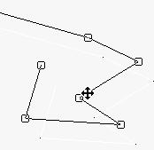
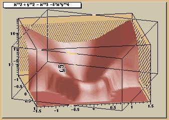
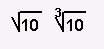
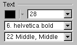
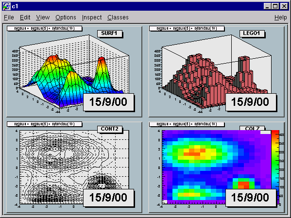

# Graphics and the Graphical User Interface


Graphical capabilities of ROOT range from 2D objects (lines, polygons,
arrows) to various plots, histograms, and 3D graphical objects. In this
chapter, we are going to focus on principals of graphics and 2D objects.
Plots and histograms are discussed in a chapter of their own.


## Drawing Objects


In ROOT, most objects derive from a base class **`TObject`**. This class
has a virtual method `Draw()` so all objects are supposed to be able to
be "drawn". The basic whiteboard on which an object is drawn is called a
canvas (defined by the class **`TCanvas`**). If several canvases are
defined, there is only one active at a time. One draws an object in the
active canvas by using the statement:

``` {.cpp}
object.Draw()
```

This instructs the object "`object`" to draw itself. If no canvas is
opened, a default one (named "`c1`") is instantiated and is drawn.

``` {.cpp}
root[] TLine a(0.1,0.1,0.6,0.6)
root[] a.Draw()
<TCanvas::MakeDefCanvas>: created default TCanvas with name c1
```

The first statement defines a line and the second one draws it. A
default canvas is drawn since there was no opened one.

## Interacting with Graphical Objects


When an object is drawn, one can interact with it. For example, the line
drawn in the previous paragraph may be moved or transformed. One very
important characteristic of ROOT is that transforming an object on the
screen will also transform it in memory. One actually interacts with the
real object, not with a copy of it on the screen. You can try for
instance to look at the starting X coordinate of the line:

``` {.cpp}
root[] a.GetX1()
(double)1.000000000e-1
```

`X1` is the `x` value of the starting coordinate given in the definition
above. Now move it interactively by clicking with the left mouse button
in the line's middle and try to do again:

``` {.cpp}
root[] a.GetX1()
(Double_t)1.31175468483816005e-01
```

You do not obtain the same result as before, the coordinates of '`a`'
have changed. As said, interacting with an object on the screen changes
the object in memory.

### Moving, Resizing and Modifying Objects


Changing the graphic objects attributes can be done with the GUI or
programmatically. First, let's see how it is done in the GUI.

#### The Left Mouse Button

As was just seen moving or resizing an object is done with the left
mouse button. The cursor changes its shape to indicate what may be done:

Point the object or one part of it: 


Rotate: 

Resize (exists also for the other directions):
 

Enlarge (used for text): 

Move: 

Here are some examples of:

Moving:  Resizing: 

Rotating:  

#### With C++ Statements (Programmatically)

How would one move an object in a script? Since there is a tight
correspondence between what is seen on the screen and the object in
memory, changing the object changes it on the screen. For example, try
to do:

``` {.cpp}
root[] a.SetX1(0.9)
```

This should change one of the coordinates of our line, but nothing
happens on the screen. Why is that? In short, the canvas is not updated
with each change for performance reasons. See "Updating the Pad".

### Selecting Objects


#### The Middle Mouse Button

Objects in a canvas, as well as in a pad, are stacked on top of each
other in the order they were drawn. Some objects may become "active"
objects, which mean they are reordered to be on top of the others. To
interactively make an object "active", you can use the middle mouse
button. In case of canvases or pads, the border becomes highlighted when
it is active.

#### With C++ Statements (Programmatically)

Frequently we want to draw in different canvases or pads. By default,
the objects are drawn in the active canvas. To activate a canvas you can
use the `TPad::cd()` method.

``` {.cpp}
root[] c1->cd()
```

### Context Menus: the Right Mouse Button


The context menus are a way to interactively call certain methods of an
object. When designing a class, the programmer can add methods to the
context menu of the object by making minor changes to the header file.

#### Using Context Menus

On a ROOT canvas, you can right-click on any object and see the context
menu for it. The script `hsimple.C` draws a histogram. The image below
shows the context menus for some of the objects on the canvas. Next
picture shows that drawing a simple histogram involves as many as seven
objects. When selecting a method from the context menu and that method
has options, the user will be asked for numerical values or strings to
fill in the option. For example, `TAxis::SetTitle` will prompt you for a
string to use for the axis title.


#### Structure of the Context Menus

The curious reader will have noticed that each entry in the context menu
corresponds to a method of the class. Look for example to the menu named
`TAxis::xaxis`. `xaxis` is the name of the object and **`TAxis`** the
name of its class. If we look at the list of **`TAxis`** methods, for
example in <http://root.cern.ch/root/htmldoc/TAxis.html>, we see the
methods `SetTimeDisplay()` and` UnZoom()`, which appear also in the
context menu.

There are several divisions in the context menu, separated by lines. The
top division is a list of the class methods; the second division is a
list of the parent class methods. The subsequent divisions are the
methods other parent classes in case of multiple inheritance. For
example, see the `TPaveText::title context
menu.` A **`TPaveText`** inherits from **`TAttLine`**, which has the
method `SetLineAttributes()`.

#### Adding Context Menus for a Class

For a method to appear in the context menu of the object it has to be
marked by `// *MENU*` in the header file. Below is the line from
`TAttLine.h` that adds the `SetLineAttribute` method to the context
menu.

``` {.cpp}
virtual void  SetLineAttributes(); // *MENU*
```

Nothing else is needed, since Cling knows the classes and their methods.
It takes advantage of that to create the context menu on the fly when
the object is clicking on. If you click on an axis, ROOT will ask the
interpreter what are the methods of the **`TAxis`** and which ones are
set for being displayed in a context menu.

Now, how does the interpreter know this? Remember, when you build a
class that you want to use in the ROOT environment, you use `rootcling`
that builds the so-called stub functions and the dictionary. These
functions and the dictionary contain the knowledge of the used classes.
To do this, `rootcling` parses all the header files. ROOT has defined
some special syntax to inform Cling of certain things, this is done in
the comments so that the code still compiles with a C++ compiler.

For example, you have a class with a `Draw()` method, which will display
itself. You would like a context menu to appear when on clicks on the
image of an object of this class. The recipe is the following:

-   The class has to contain the `ClassDef/ClassImp` macros

-   For each method you want to appear in the context menu, put a
    comment after the declaration containing `*MENU*` or `*TOGGLE*`
    depending on the behavior you expect. One usually uses Set methods
    (setters). The `*TOGGLE*` comment is used to toggle a `boolean` data
    field. In that case, it is safe to call the data field `fMyBool`
    where `MyBool` is the name of the setter `SetMyBool`. Replace
    `MyBool` with your own `boolean` variable.

-   You can specify arguments and the data members in which to store the
    arguments.

For example:

``` {.cpp}
class MyClass : public TObject {
private:
   int      fV1;   // first variable
   double   fV2;   // second variable
public:
   int    GetV1() {return fV1;}
   double GetV2() {return fV2;}
   void   SetV1(int x1) { fV1 = x1;}     // *MENU*
   void   SetV2(double d2) { fV2 = d2;}  // *MENU*
   void   SetBoth(int x1, double d2) {fV1 = x1; fV2 = d2;}

   ClassDef (MyClass,1)
}
```

To specify arguments:

``` {.cpp}
void SetXXX(Int_t x1, Float_t y2); //*MENU* *ARGS={x1=>fV1}
```

This statement is in the comment field, after the \*MENU\*. If there is
more than one argument, these arguments are separated by commas, where
fX1 and fY2 are data fields in the same class.

``` {.cpp}
void SetXXX(Int_t x1, Float_t y2); //*MENU* *ARGS={x1=>fX1,y2=>fY2}
```

If the arguments statement is present, the option dialog displayed when
selecting `SetXXX field` will show the values of variables. We indicate
to the system which argument corresponds to which data member of the
class.

### Executing Events when a Cursor Passes on Top of an Object


This paragraph is for class designers. When a class is designed, it is
often desirable to include drawing methods for it. We will have a more
extensive discussion about this, but drawing an object in a canvas or a
pad consists in "attaching" the object to that pad. When one uses
`object.Draw()`, the object is NOT painted at this moment. It is only
attached to the active pad or canvas.

Another method should be provided for the object to be painted, the
`Paint()` method. This is all explained in the next paragraph. As well
as `Draw()` and `Paint()`, other methods may be provided by the designer
of the class. When the mouse is moved or a button pressed/released, the
**`TCanvas`** function named `HandleInput()` scans the list of objects
in all it's pads and for each object calls some standard methods to make
the object react to the event (mouse movement, click or whatever).

The second one is `DistanceToPrimitive(px,py)`. This function computes a
"distance" to an object from the mouse position at the pixel position
(`px`, `py`, see definition at the end of this paragraph) and returns
this distance in pixel units. The selected object will be the one with
the shortest computed distance. To see how this works, select the
"`Event Status`" item in the canvas "`Options`" menu. ROOT will display
one status line showing the picked object. If the picked object is, for
example, a histogram, the status line indicates the name of the
histogram, the position `x,y` in histogram coordinates, the channel
number and the channel content.

It is nice for the canvas to know what the closest object from the mouse
is, but it's even nicer to be able to make this object react. The third
standard method to be provided is `ExecuteEvent()`. This method actually
does the event reaction. Its prototype is where `px` and `py` are the
coordinates at which the event occurred, except if the event is a key
press, in which case `px` contains the key code.

``` {.cpp}
void ExecuteEvent(Int_t event, Int_t px, Int_t py);
```

Where `event` is the event that occurs and is one of the following
(defined in `Buttons.h`):

``` {.cpp}
kNoEvent,          kButton1Down,      kButton2Down,
kButton3Down,      kKeyDown,          kButton1Up,
kButton2Up,        kButton3Up,        kButton1Motion,
kButton2Motion,    kButton3Motion,    kKeyPress,
kButton1Locate,    kButton2Locate,    kButton3Locate,
kKeyUp,            kButton1Double,    kButton2Double,
kButton3Double,    kMouseMotion,      kMouseEnter,
kMouseLeave
```

We hope the names are self-explanatory.

Designing an `ExecuteEvent` method is not very easy, except if one wants
very basic treatment. We will not go into that and let the reader refer
to the sources of classes like **`TLine`** or **`TBox`**. Go and look at
their `ExecuteEvent` method! We can nevertheless give some reference to
the various actions that may be performed. For example, one often wants
to change the shape of the cursor when passing on top of an object. This
is done with the `SetCursor` method:

``` {.cpp}
gPad->SetCursor(cursor)
```

The argument `cursor` is the type of cursor. It may be:

``` {.cpp}
kBottomLeft,  kBottomRight,  kTopLeft,
kTopRight,    kBottomSide,   kLeftSide,
kTopSide,     kRightSide,    kMove,
kCross,       kArrowHor,     kArrowVer,
kHand,        kRotate,       kPointer,
kArrowRight,  kCaret,        kWatch
```

They are defined in `TVirtualX.h` and again we hope the names are
self-explanatory. If not, try them by designing a small class. It may
derive from something already known like **`TLine`**.

Note that the `ExecuteEvent()` functions may in turn; invoke such
functions for other objects, in case an object is drawn using other
objects. You can also exploit at best the virtues of inheritance. See
for example how the class **`TArrow`** (derived from **`TLine`**) use or
redefine the picking functions in its base class.

The last comment is that mouse position is always given in pixel units
in all these standard functions. `px=0` and `py=0` corresponds to the
top-left corner of the canvas. Here, we have followed the standard
convention in windowing systems. Note that user coordinates in a canvas
(pad) have the origin at the bottom-left corner of the canvas (pad).
This is all explained in the paragraph "The Coordinate Systems of a
Pad".

## Graphical Containers: Canvas and Pad
\index{TPad}


We have talked a lot about canvases, which may be seen as windows. More
generally, a graphical entity that contains graphical objects is called
a Pad. A Canvas is a special kind of Pad. From now on, when we say
something about pads, this also applies to canvases. A pad (class
**`TPad`**) is a graphical container in the sense it contains other
graphical objects like histograms and arrows. It may contain other pads
(sub-pads) as well. A Pad is a linked list of primitives of any type
(graphs, histograms, shapes, tracks, etc.). It is a kind of display list.


Drawing an object is nothing more than adding its pointer to this list.
Look for example at the code of `TH1::Draw()`. It is merely ten lines of
code. The last statement is `AppendPad()`. This statement calls method
of **`TObject`** that just adds the pointer of the object, here a
histogram, to the list of objects attached to the current pad. Since
this is a **`TObject`**'s method, every object may be "drawn", which
means attached to a pad.

When is the painting done then ? The answer is: when needed. Every object
that derives from **`TObject`** has a `Paint()` method. It may be empty,
but for graphical objects, this routine contains all the instructions to
paint effectively it in the active pad. Since a Pad has the list of
objects it owns, it will call successively the `Paint()` method of each
object, thus re-painting the whole pad on the screen. If the object is a
sub-pad, its `Paint()` method will call the `Paint()` method of the
objects attached, recursively calling `Paint()` for all the objects.


In some cases a pad need to be painted during a macro execution. To
force the pad painting `gPad->Update()` (see next section) should be performed.

The list of primitives stored in the pad is also used to pick objects
and to interact with them.

### The Global Pad: gPad


When an object is drawn, it is always in the so-called active pad. For
every day use, it is comfortable to be able to access the active pad,
whatever it is. For that purpose, there is a global pointer, called
***`gPad`***. It is always pointing to the active pad. If you want to
change the fill color of the active pad to blue but you do not know its
name, do this.

``` {.cpp}
root[] gPad->SetFillColor(38)
```

To get the list of colors, go to the paragraph "Color and color
palettes" or if you have an opened canvas, click on the `View` menu,
selecting the `Colors` item.

#### Finding an Object in a Pad

Now that we have a pointer to the active pad, ***`gPad`*** and that we
know this pad contains some objects, it is sometimes interesting to
access one of those objects. The method `GetPrimitive()` of **`TPad`**,
i.e. `TPad::GetPrimitive(const char* name)` does exactly this. Since
most of the objects that a pad contains derive from **`TObject`**, they
have a name. The following statement will return a pointer to the object
`myobjectname` and put that pointer into the variable `obj`. As you can
see, the type of returned pointer is `TObject*`.

``` {.cpp}
root[] obj = gPad->GetPrimitive("myobjectname")
(class TObject*)0x1063cba8
```

Even if your object is something more complicated, like a histogram
**`TH1F`**, this is normal. A function cannot return more than one type.
So the one chosen was the lowest common denominator to all possible
classes, the class from which everything derives, **`TObject`**. How do
we get the right pointer then? Simply do a cast of the function output
that will transform the output (pointer) into the right type. For
example if the object is a **`TPaveLabel`**:

``` {.cpp}
root[] obj = (TPaveLabel*)(gPad->GetPrimitive("myobjectname"))
(class TPaveLabel*)0x1063cba8
```

This works for all objects deriving from **`TObject`**. However, a
question remains. An object has a name if it derives from **`TNamed`**,
not from **`TObject`**. For example, an arrow (**`TArrow`**) doesn't
have a name. In that case, the "name" is the name of the class. To know
the name of an object, just click with the right button on it. The name
appears at the top of the context menu. In case of multiple unnamed
objects, a call to `GetPrimitive("className")` returns the instance of
the class that was first created. To retrieve a later instance you can
use `GetListOfPrimitives()`, which returns a list of all the objects on
the pad. From the list you can select the object you need.

#### Hiding an Object

Hiding an object in a pad can be made by removing it from the list of
objects owned by that pad. This list is accessible by the
`GetListOfPrimitives()` method of **`TPad`**. This method returns a
pointer to a **`TList`**. Suppose we get the pointer to the object, we
want to hide, call it `obj` (see paragraph above). We get the pointer to
the list:

``` {.cpp}
root[] li = gPad->GetListOfPrimitives()
```

Then remove the object from this list:

``` {.cpp}
root[] li->Remove(obj)
```

The object will disappear from the pad as soon as the pad is updated
(try to resize it for example). If one wants to make the object
reappear:

``` {.cpp}
root[] obj->Draw()
```

Caution, this will not work with composed objects, for example many
histograms drawn on the same plot (with the option "`same`"). There are
other ways! Try to use the method described here for simple objects.

### The Coordinate Systems of a Pad


There are coordinate systems in a **`TPad`**: user coordinates,
normalized coordinates (NDC), and pixel coordinates.


#### The User Coordinate System

The most common is the user coordinate system. Most methods of
**`TPad`** use the user coordinates, and all graphic primitives have
their parameters defined in terms of user coordinates. By default, when
an empty pad is drawn, the user coordinates are set to a range from 0 to
1 starting at the lower left corner. At this point they are equivalent
of the NDC coordinates (see below). If you draw a high level graphical
object, such as a histogram or a function, the user coordinates are set
to the coordinates of the histogram. Therefore, when you set a point it
will be in the histogram coordinates.

For a newly created blank pad, one may use `TPad::Range` to set the user
coordinate system. This function is defined as:

``` {.cpp}
void Range(float x1,float y1,float x2,float y2)
```

The arguments `x1`, `x2` defines the new range in the x direction, and
the `y1`, `y2` define the new range in the y-direction.

``` {.cpp}
root[] TCanvas MyCanvas ("MyCanvas")
root[] gPad->Range(-100,-100,100,100)
```

This will set the active pad to have both coordinates to go from -100 to
100, with the center of the pad at (0,0). You can visually check the
coordinates by viewing the status bar in the canvas. To display the
status bar select Event Status entry in the View canvas menu.


#### The Normalized Coordinate System (NDC)

Normalized coordinates are independent of the window size and of the
user system. The coordinates range from 0 to 1 and (0, 0) corresponds to
the bottom-left corner of the pad. Several internal ROOT functions use
the NDC system (3D primitives, PostScript, log scale mapping to linear
scale). You may want to use this system if the user coordinates are not
known ahead of time.

#### The Pixel Coordinate System

The least common is the pixel coordinate system, used by functions such
as `DistanceToPrimitive()` and `ExecuteEvent()`. Its primary use is for
cursor position, which is always given in pixel coordinates. If
(`px,py`) is the cursor position, `px=0` and `py=0` corresponds to the
top-left corner of the pad, which is the standard convention in
windowing systems.

#### Using NDC for a particular Object

Most of the time, you will be using the user coordinate system. But
sometimes, you will want to use NDC. For example, if you want to draw
text always at the same place over a histogram, no matter what the
histogram coordinates are. There are two ways to do this. You can set
the NDC for one object or may convert NDC to user coordinates. Most
graphical objects offer an option to be drawn in NDC. For instance, a
line (**`TLine`**) may be drawn in NDC by using `DrawLineNDC()`. A latex
formula or a text may use `TText::SetNDC()` to be drawn in NDC
coordinates.

### Converting between Coordinate Systems


There are a few utility functions in **`TPad`** to convert from one
system of coordinates to another. In the following table, a point is
defined by `(px,py)` in pixel coordinates, `(ux,uy)` in user
coordinates, `(ndcx,ndcy)` in normalized coordinates, (`apx`, `apy`) are
in absolute pixel coordinates.

+-----------------------+----------------------------------+--------------------+
| Conversion            | TPad's Methods                   | Returns            |
+-----------------------+----------------------------------+--------------------+
| NDC to Pixel          | `UtoPixel(ndcx)`                 | Int\_t             |
|                       |                                  |                    |
|                       | `VtoPixel(ndcy)`                 | Int\_t             |
+-----------------------+----------------------------------+--------------------+
| Pixel to User         | `PixeltoX(px)`                   | Double\_t          |
|                       |                                  |                    |
|                       | `PixeltoY(py)`                   | Double\_t          |
|                       |                                  |                    |
|                       | `PixeltoXY(px,py,&ux,&uy)`       | Double\_t ux,uy    |
+-----------------------+----------------------------------+--------------------+
| User to Pixel         | `XtoPixel(ux)`                   | Int\_t             |
|                       |                                  |                    |
|                       | `YtoPixel(uy)`                   | Int\_t             |
|                       |                                  |                    |
|                       | `XYtoPixel(ux,uy,&px,&py)`       | Int\_t px,py       |
+-----------------------+----------------------------------+--------------------+
| User to absolute      | `XtoAbsPixel(ux)`                | Int\_t             |
| pixel                 |                                  |                    |
|                       | `YtoAbsPixel(uy)`                | Int\_t             |
|                       |                                  |                    |
|                       | `XYtoAbsPixel(ux,uy,&apx,&apy)`  | Int\_t apx,apy     |
+-----------------------+----------------------------------+--------------------+
| Absolute pixel to     | `AbsPixeltoX(apx)`               | Double\_t          |
| user                  |                                  |                    |
|                       | `AbsPixeltoY(apy)`               | Double\_t          |
|                       |                                  |                    |
|                       | `AbsPixeltoXY(apx,apy,&ux,&uy)`  | Double\_t ux,uy    |
+-----------------------+----------------------------------+--------------------+

Note: all the pixel conversion functions along the Y axis consider that
`py=0` is at the top of the pad except `PixeltoY()` which assume that
the position `py=0` is at the bottom of the pad. To make `PixeltoY()`
converting the same way as the other conversion functions, it should be
used the following way (`p` is a pointer to a **`TPad`**):

``` {.cpp}
p->PixeltoY(py - p->GetWh());
```

### Dividing a Pad into Sub-pads


Dividing a pad into sub pads in order for instance to draw a few
histograms, may be done in two ways. The first is to build pad objects
and to draw them into a parent pad, which may be a canvas. The second is
to automatically divide a pad into horizontal and vertical sub pads.

#### Creating a Single Sub-pad

The simplest way to divide a pad is to build sub-pads in it. However,
this forces the user to explicitly indicate the size and position of
those sub-pads. Suppose we want to build a sub-pad in the active pad
(pointed by ***`gPad`***). First, we build it, using a **`TPad`**
constructor:

``` {.cpp}
root[] spad1 = new TPad("spad1","The first subpad",.1,.1,.5,.5)
```

One gives the coordinates of the lower left point (0.1, 0.1) and of the
upper right one (0.5, 0.5). These coordinates are in NDC. This means
that they are independent of the user coordinates system, in particular
if you have already drawn for example a histogram in the mother pad. The
only thing left is to draw the pad:

``` {.cpp}
root[] spad1->Draw()
```

If you want more sub-pads, you have to repeat this procedure as many
times as necessary.

#### Dividing a Canvas into Sub-Pads

The manual way of dividing a pad into sub-pads is sometimes very
tedious. There is a way to automatically generate horizontal and
vertical sub-pads inside a given pad.

``` {.cpp}
root[] pad1->Divide(3,2)
```


If `pad1` is a pad then, it will divide the pad into 3 columns of 2
sub-pads. The generated sub-pads get names `pad1_i` where the index
`i=1` to `nxm` (in our case `pad1_1`, `pad1_2`...`pad1_6)`. The names
`pad1_1 `etc... correspond to new variables in Cling, so you may use them
as soon as the executed method was `pad->Divide()`. However, in a
compiled program, one has to access these objects. Remember that a pad
contains other objects and that these objects may themselves be pads. So
we can use the `GetPrimitive()` method:

``` {.cpp}
TPad* pad1_1 = (TPad*)(pad1->GetPrimitive("pad1_1"))
```

One question remains. In case one does an automatic divide, how one can
set the default margins between pads? This is done by adding two
parameters to `Divide()`, which are the margins in `x` and `y`:

``` {.cpp}
root[] pad1->Divide(3,2,0.1,0.1)
```

The margins are here set to 10% of the parent pad width.

### Updating the Pad


For performance reasons, a pad is not updated with every change. For
example, changing the coordinates of the pad does not automatically
redraw it. Instead, the pad has a "bit-modified" that triggers a redraw.
This bit is automatically set by:

-   Touching the pad with the mouse - for example resizing it with the
    mouse.

-   Finishing the execution of a script.

-   Adding a new primitive or modifying some primitives for example the
    name and title of an object.

-   You can also set the "bit-modified" explicitly with the `Modified`
    method:

    ``` {.cpp}
    // the pad has changed
    root[] pad1->Modified()
    // recursively update all modified pads:
    root[] c1->Update()
    ```

    A subsequent call to `TCanvas::Update()` scans the list of sub-pads
    and repaints the pads declared modified.

In compiled code or in a long macro, you may want to access an object
created during the paint process. To do so, you can force the painting
with a `TCanvas::Update()`. For example, a **`TGraph`** creates a
histogram (**`TH1`**) to paint itself. In this case the internal
histogram obtained with `TGraph::GetHistogram()` is created only after
the pad is painted. The pad is painted automatically after the script is
finished executing or if you force the painting with `TPad::Modified()`
followed by a `TCanvas::Update()`. Note that it is not necessary to call
`TPad::Modified()` after a call to `Draw()`. The "bit-modified" is set
automatically by `Draw()`. A note about the "bit-modified" in sub pads:
when you want to update a sub pad in your canvas, you need to call
`pad->Modified()` rather than `canvas->Modified()`, and follow it with a
`canvas->Update()`. If you use `canvas->Modified()`, followed by a call
to `canvas->Update()`, the sub pad has not been declared modified and it
will not be updated. Also note that a call to `pad->Update()` where pad
is a sub pad of canvas, calls `canvas->Update()` and recursively updates
all the pads on the canvas.

### Making a Pad Transparent


As we will see in the paragraph "Fill Attributes", a fill style (type of
hatching) may be set for a pad.

``` {.cpp}
root[] pad1->SetFillStyle(istyle)
```

This is done with the `SetFillStyle` method where `istyle` is a style
number, defined in "Fill Attributes". A special set of styles allows
handling of various levels of transparency. These are styles number 4000
to 4100, 4000 being fully transparent and 4100 fully opaque. So, suppose
you have an existing canvas with several pads. You create a new pad
(transparent) covering for example the entire canvas. Then you draw your
primitives in this pad. The same can be achieved with the graphics
editor. For example:

``` {.cpp}
root[] .x tutorials/hist/h1draw.C
root[] TPad *newpad=new TPad("newpad","Transparent pad",0,0,1,1);
root[] newpad->SetFillStyle(4000);
root[] newpad->Draw();
root[] newpad->cd();
root[] // create some primitives, etc
```

### Setting the Log Scale


Setting the scale to logarithmic or linear is an attribute of the pad,
not the axis or the histogram. The scale is an attribute of the pad
because you may want to draw the same histogram in linear scale in one
pad and in log scale in another pad. Frequently, we see several
histograms on top of each other in the same pad. It would be very
inconvenient to set the scale attribute for each histogram in a pad.

Furthermore, if the logic was set in the histogram class (or each
object) the scale setting in each `Paint` method of all objects should
be tested.

If you have a pad with a histogram, a right-click on the pad, outside of
the histograms frame will convince you. The `SetLogx()`, `SetLogy()` and
`SetLogz()` methods are there. As you see, **`TPad`** defines log scale
for the two directions `x` and `y` plus `z` if you want to draw a 3D
representation of some function or histogram.

The way to set log scale in the x direction for the active pad is:

``` {.cpp}
root[] gPad->SetLogx(1)
```

To reset log in the z direction:

``` {.cpp}
root[] gPad->SetLogz(0)
```

If you have a divided pad, you need to set the scale on each of the
sub-pads. Setting it on the containing pad does not automatically
propagate to the sub-pads. Here is an example of how to set the log
scale for the x-axis on a canvas with four sub-pads:

``` {.cpp}
root[] TCanvas MyCanvas("MyCanvas","My Canvas")
root[] MyCanvas->Divide(2,2)
root[] MyCanvas->cd(1)
root[] gPad->SetLogx()
root[] MyCanvas->cd(2)
root[] gPad->SetLogx()
root[] MyCanvas->cd(3)
root[] gPad->SetLogx()
```

### WaitPrimitive method


When the `TPad::WaitPrimitive()` method is called with no arguments, it
will wait until a double click or any key pressed is executed in the
canvas. A call to `gSystem->Sleep(10)` has been added in the loop to
avoid consuming at all the CPU. This new option is convenient when
executing a macro. By adding statements like:

``` {.cpp}
canvas->WaitPrimitive();
```

You can monitor the progress of a running macro, stop it at convenient
places with the possibility to interact with the canvas and resume the
execution with a double click or a key press.

### Locking the Pad


You can make the **`TPad`** non-editable. Then no new objects can be
added, and the existing objects and the pad can not be changed with the
mouse or programmatically. By default the **`TPad`** is editable.

``` {.cpp}
TPad::SetEditable(kFALSE)
```

## Graphical Objects


In this paragraph, we describe the various simple 2D graphical objects
defined in ROOT. Usually, one defines these objects with their
constructor and draws them with their `Draw()` method. Therefore, the
examples will be very brief. Most graphical objects have line and fill
attributes (color, width) that will be described in "Graphical objects
attributes". If the user wants more information, the class names are
given and they may refer to the online developer documentation. This is
especially true for functions and methods that set and get internal
values of the objects described here. By default 2D graphical objects
are created in User Coordinates with (0, 0) in the lower left corner.

### Lines, Arrows and Polylines


The simplest graphical object is a line. It is implemented in the
**`TLine`** class. The line constructor is:

``` {.cpp}
TLine(Double_t x1,Double_t y1,Double_t x2,Double_t y2)
```

The arguments `x1`, `y1`, `x2`, `y2` are the coordinates of the first
and second point. It can be used:

``` {.cpp}
root[] l = new TLine(0.2,0.2,0.8,0.3)
root[] l->Draw()
```

The arrow constructor is:

``` {.cpp}
TArrow(Double_t x1, Double_t y1,
       Double_t x2, Double_t y2,
       Float_t arrowsize, Option_t *option)
```

It defines an arrow between points `x1,y1` and `x2,y2`. The arrow size
is in percentage of the pad height. The `option` parameter has the
following meanings:

 "\>"

 "\<|"

 "\<"

 "|\>"

 "\<\>"

 "\<|\>"

Once an arrow is drawn on the screen, one can:

-   click on one of the edges and move this edge.

-   click on any other arrow part to move the entire arrow.


If `FillColor` is 0, an open triangle is drawn; else a full triangle is
filled with the set fill color. If `ar` is an arrow object, fill color
is set with:

``` {.cpp}
ar.SetFillColor(icolor);
```

Where `icolor` is the color defined in "Color and Color Palettes".

The default-opening angle between the two sides of the arrow is 60
degrees. It can be changed with the method `ar->SetAngle(angle)`, where
angle is expressed in degrees.

A poly-line is a set of joint segments. It is defined by a set of N
points in a 2D space. Its constructor is:

``` {.cpp}
TPolyLine(Int_t n,Double_t* x,Double_t* y,Option_t* option)
```

Where `n` is the number of points, and `x` and `y` are arrays of `n`
elements with the coordinates of the points. **`TPolyLine`** can be used
by it self, but is also a base class for other objects, such as curly
arcs.

### Circles and Ellipses


An ellipse can be truncated and rotated. It is defined by its center
`(x1,y1)` and two radii `r1` and `r2`. A minimum and maximum angle may
be specified `(phimin,phimax)`. The ellipse may be rotated with an angle
`theta`. All these angles are in degrees. The attributes of the outline
line are set via **`TAttLine`**, of the fill area - via **`TAttFill`**
class. They are described in "Graphical Objects Attributes".


When an ellipse sector is drawn only, the lines between the center and
the end points of the sector are drawn by default. By specifying the
drawn option "`only`", these lines can be avoided. Alternatively, the
method `SetNoEdges()` can be called. To remove completely the ellipse
outline, specify zero (0) as a line style.

The **`TEllipse`** constructor is:

``` {.cpp}
TEllipse(Double_t x1, Double_t y1, Double_t r1, Double_t r2,
         Double_t phimin, Double_t phimax, Double_t theta)
```

An ellipse may be created with:

``` {.cpp}
root[] e = new TEllipse(0.2,0.2,0.8,0.3)
root[] e->Draw()
```

### Rectangles


The class **`TBox`** defines a rectangle. It is a base class for many
different higher-level graphical primitives. Its bottom left coordinates
`x1`, `y1` and its top right coordinates `x2`, `y2`, defines a box. The
constructor is:

``` {.cpp}
TBox(Double_t x1,Double_t y1,Double_t x2,Double_t y2)
```

It may be used as in:

``` {.cpp}
root[] b = new TBox(0.2,0.2,0.8,0.3)
root[] b->SetFillColor(5)
root[] b->Draw()
```


A **`TWbox`** is a rectangle (**`TBox`**) with a border size and a
border mode. The attributes of the outline line and of the fill area are
described in "Graphical Objects Attributes"

### Markers


A marker is a point with a fancy shape! The possible markers are shown
in the next figure.


The marker constructor is:

``` {.cpp}
TMarker(Double_t x,Double_t y,Int_t marker)
```

The parameters `x` and `y` are the marker coordinates and `marker` is
the marker type, shown in the previous figure. Suppose the pointer `ma`
is a valid marker. The marker size is set via `ma->SetMarkerSize(size)`,
where `size` is the desired size. Note, that the marker types 1, 6 and 7
(the dots) cannot be scaled. They are always drawn with the same number
of pixels. `SetMarkerSize` does not apply on them. To have a "scalable
dot" a circle shape should be used instead, for example, the marker type
20. The default marker type is 1, if `SetMarkerStyle` is not specified.
It is the most common one to draw scatter plots.


The user interface for changing the marker color, style and size looks
like shown in this picture. It takes place in the editor frame anytime
the selected object inherits the class **`TAttMarker`**.

Non-symmetric symbols should be used carefully in plotting. The next two
graphs show how the misleading a careless use of symbols can be. The two
plots represent the same data sets but because of a bad symbol choice,
the two on the top appear further apart from the next example.


A **`TPolyMaker`** is defined by an array on N points in a 2D space. At
each point `x[i]`, `y[i]` a marker is drawn. The list of marker types is
shown in the previous paragraph. The marker attributes are managed by
the class **`TAttMarker`** and are described in "Graphical Objects
Attributes". The **`TPolyMarker`** constructor is:

``` {.cpp}
TPolyMarker(Int_t n,Double_t *x,Double_t *y,Option_t *option)
```

Where `x` and `y` are arrays of coordinates for the `n` points that form
the poly-marker.

### Curly and Wavy Lines for Feynman Diagrams


This is a peculiarity of particle physics, but we do need sometimes to
draw Feynman diagrams. Our friends working in banking can skip this
part. A set of classes implements curly or wavy poly-lines typically
used to draw Feynman diagrams. Amplitudes and wavelengths may be
specified in the constructors, via commands or interactively from
context menus. These classes are **`TCurlyLine`** and **`TCurlyArc`**.
These classes make use of **`TPolyLine`** by inheritance; `ExecuteEvent`
methods are highly inspired from the methods used in **`TPolyLine`** and
**`TArc`**.


The **`TCurlyLine`** constructor is:

``` {.cpp}
TCurlyLine(Double_t x1, Double_t y1, Double_t x2, Double_t y2,
           Double_t wavelength, Double_t amplitude)
```

The coordinates `(x1`, `y1)` define the starting point, `(x2`, `y2)` -
the end-point. The `wavelength` and the `amplitude` are given in percent
of the pad height.

The **`TCurlyArc`** constructor is:

``` {.cpp}
TCurlyArc(Double_t x1, Double_t y1, Double_t rad,
          Double_t phimin, Double_t phimax,
          Double_t wavelength, Double_t amplitude)
```

The curly arc center is `(x1`, `y1)` and the radius is `rad`. The
wavelength and the amplitude are given in percent of the line length.
The parameters `phimin` and `phimax` are the starting and ending angle
of the arc (given in degrees). Refer to
`$ROOTSYS/tutorials/graphics/feynman.C` for the script that built the
figure above.

### Text and Latex Mathematical Expressions


Text displayed in a pad may be embedded into boxes, called paves
(**`TPaveLabel`**), or titles of graphs or many other objects but it can
live a life of its own. All text displayed in ROOT graphics is an object
of class **`TText`**. For a physicist, it will be most of the time a
**`TLatex`** expression (which derives from **`TText`**). **`TLatex`**
has been conceived to draw mathematical formulas or equations. Its
syntax is very similar to the Latex in mathematical mode.

#### Subscripts and Superscripts

Subscripts and superscripts are made with the `_` and `^` commands.
These commands can be combined to make complex subscript and superscript
expressions. You may choose how to display subscripts and superscripts
using the 2 functions `SetIndiceSize(Double_t)` and
`SetLimitIndiceSize(Int_t)`. Examples of what can be obtained using
subscripts and superscripts:

+-----------------+---------+------------------+-----------+---------------------+----------------+
| The expression  | Gives   | The expression   | Gives     | The expression      | Gives          |
+-----------------+---------+------------------+-----------+---------------------+----------------+
| **`x^{2y}`**    |$x^{2y}$ | **`x^{y^{2}}`**  |$x^{y^{2}}$| **`x_{1}^{y_{1}}`** | $x_{1}^{y_{1}}$|
+-----------------+---------+------------------+-----------+---------------------+----------------+
| **`x_{2y}`**    |$x_{2y}$ | **`x^{y_{1}}`**  |$x^{y_{1}}$| **`x_{1}^{y}`**     | $x_{1}^{y}$    |
+-----------------+---------+------------------+-----------+---------------------+----------------+

#### Fractions

Fractions denoted by the / symbol are made in the obvious way. The
`#frac` command is used for large fractions in displayed formula; it has
two arguments: the numerator and the denominator. For example, the
equation x = y + z 2 y 2 + 1 is obtained by following expression
`x=#frac{y+z/2}{y^{2}+1}`.

#### Roots

The `#sqrt` command produces the square ROOT of its argument; it has an
optional first argument for other roots.

Example: `#sqrt{10}  #sqrt[3]{10}` 

#### Delimiters

You can produce three kinds of proportional delimiters.

`#[]{....}` or "à la" Latex

`#left[.....#right] `big square brackets

`#{}{....} or #left{.....#right}`big curly brackets

`#||{....} or #left|.....#right|`big absolute value symbol

`#(){....} or #left(.....#right)`big parenthesis

#### Changing Style in Math Mode

You can change the font and the text color at any moment using:

`#font[font-number]{...}` and `#color[color-number]{...}`

#### Line Splitting

A **`TLatex`** string may be split in two with the following command:
`#splitline{top}{bottom}`. **`TAxis`** and **`TGaxis`** objects can take
advantage of this feature. For example, the date and time could be shown
in the time axis over two lines with:
`#splitline{21 April 2003}{14:23:56}`

### Greek Letters


The command to produce a lowercase Greek letter is obtained by adding
`#` to the name of the letter. For an uppercase Greek letter, just
capitalize the first letter of the command name.

``` {.cpp}
#alpha     #beta    #chi      #delta     #varepsilon  #phi
#gamma     #eta     #iota     #varphi    #kappa       #lambda
#mu        #nu      #omicron  #pi        #theta       #rho
#sigma     #tau     #upsilon  #varomega  #omega       #xi
#psi       #zeta    #Alpha    #Beta      #Chi         #Delta
#Epsilon   #Phi     #Gamma    #Eta       #Iota        #Kappa
#vartheta  #Lambda  #Mu       #Nu        #Omicron     #Pi
#Theta     #Rho     #Sigma    #Tau       #Upsilon     #Omega
#varsigma  #Xi      #Psi      #epsilon   #varUpsilon  #Zeta
```


### Mathematical Symbols


**`TLatex`** can make mathematical and other symbols. A few of them,
such as `+` and `>`, are produced by typing the corresponding keyboard
character. Others are obtained with the commands as shown in the table
above.

#### Accents, Arrows and Bars

Symbols in a formula are sometimes placed one above another.
**`TLatex`** provides special commands for that.

`#hat{a} = `hat

`#check  = `inverted hat

`#acute  = `acute

`#grave  = `accent grave

`#dot    = `derivative

`#ddot   = `double derivative

`#tilde  = `tilde

`#slash  = `special sign. Draw a slash on top of the text between
brackets for example

`#slash{E}_{T} `generates "Missing ET"

a \_ is obtained with `#bar{a}`

a -\> is obtained with `#vec{a}`

#### Example 1

The script `$ROOTSYS/tutorials/graphics/latex.C:`

``` {.cpp}
{
  TCanvas c1("c1","Latex",600,700);
  TLatex l;
  l.SetTextAlign(12);
  l.SetTextSize(0.04);

  l.DrawLatex(0.1,0.8,"1) C(x) = d #sqrt{#frac{2}{#lambdaD}}
  #int^{x}_{0}cos(#frac{#pi}{2}t^{2})dt");
  l.DrawLatex(0.1,0.6,"2) C(x) = d #sqrt{#frac{2}{#lambdaD}}
  #int^{x}cos(#frac{#pi}{2}t^{2})dt");
  l.DrawLatex(0.1,0.4,"3) R = |A|^{2} =
  #frac{1}{2}(#[]{#frac{1}{2}+C(V)}^{2}+
  #[]{#frac{1}{2}+S(V)}^{2})");
  l.DrawLatex(0.1,0.2,"4) F(t) = #sum_{i=
  -#infty}^{#infty}A(i)cos#[]{#frac{i}{t+i}}");
}
```


#### Example 2

The script `$ROOTSYS/tutorials/graphics/latex2.C:`

``` {.cpp}
{
  TCanvas c1("c1","Latex",600,700);
  TLatex l;
  l.SetTextAlign(23);
  l.SetTextSize(0.1);
  l.DrawLatex(0.5,0.95,"e^{+}e^{-}#rightarrowZ^{0}
  #rightarrowI#bar{I}, q#bar{q}");
  l.DrawLatex(0.5,0.75,"|#vec{a}#bullet#vec{b}|=
  #Sigmaa^{i}_{jk}+b^{bj}_{i}");
  l.DrawLatex(0.5,0.5,"i(#partial_{#mu}#bar{#psi}#gamma^{#mu}
  +m#bar{#psi}=0
  #Leftrightarrow(#Box+m^{2})#psi=0");
  l.DrawLatex(0.5,0.3,"L_{em}=eJ^{#mu}_{em}A_{#mu} ,
  J^{#mu}_{em}=#bar{I}#gamma_{#mu}I
  M^{j}_{i}=#SigmaA_{#alpha}#tau^{#alphaj}_{i}");
}
```


#### Example 3

The script `$ROOTSYS/tutorials/graphics/latex3.C`:

``` {.cpp}
{
  TCanvas c1("c1");
  TPaveText pt(.1,.5,.9,.9);
  pt.AddText("#frac{2s}{#pi#alpha^{2}}
  #frac{d#sigma}{dcos#theta} (e^{+}e^{-}
  #rightarrow f#bar{f} ) = ");
  pt.AddText("#left| #frac{1}{1 - #Delta#alpha} #right|^{2}
  (1+cos^{2}#theta");
  pt.AddText("+ 4 Re #left{ #frac{2}{1 - #Delta#alpha} #chi(s)
  #[]{#hat{g}_{#nu}^{e}#hat{g}_{#nu}^{f}
  (1 + cos^{2}#theta) + 2 #hat{g}_{a}^{e}
  #hat{g}_{a}^{f} cos#theta) } #right}");
  pt.SetLabel("Born equation");
  pt.Draw();
}
```


### Text in a Pad


Text displayed in a pad may be embedded into boxes, called paves, or may
be drawn alone. In any case, it is recommended to use a Latex
expression, which is covered in the previous paragraph. Using
**`TLatex`** is valid whether the text is embedded or not. In fact, you
will use Latex expressions without knowing it since it is the standard
for all the embedded text. A pave is just a box with a border size and a
shadow option. The options common to all types of paves and used when
building those objects are the following:

`option = "T"` top frame

`option = "B"` bottom frame

`option = "R"` right frame

`option = "L"` left frame

`option = "NDC" x1,y1,x2,y2` are given in NDC

`option = "ARC"` corners are rounded

We will see the practical use of these options in the description of the
more functional objects like `TPaveLabels`. There are several categories
of paves containing text: **`TPaveLabel`**, **`TPaveText`** and
**`TPavesText`**. `TPaveLabels` are panels containing one line of text.
They are used for labeling.

``` {.cpp}
TPaveLabel(Double_t x1, Double_t y1, Double_t x2, Double_t y2,
           const char *label, Option_t *option)
```

Where (`x1`, `y1`) are the coordinates of the bottom left corner,
`(x2,y2)` - coordinates of the upper right corner. "`label`" is the text
to be displayed and "`option`" is the drawing option, described above.
By default, the border size is 5 and the option is "`br`". If one wants
to set the border size to some other value, one may use the method
`SetBorderSize()`. For example, suppose we have a histogram, which
limits are (-100,100) in the x direction and (0, 1000) in the y
direction. The following lines will draw a label in the center of the
histogram, with no border. If one wants the label position to be
independent of the histogram coordinates, or user coordinates, one can
use the option "`NDC`". See "The Coordinate Systems of a Pad".

``` {.cpp}
root[] pl = new TPaveLabel(-50,0,50,200,"Some text")
root[] pl->SetBorderSize(0)
root[] pl->Draw()
```


A **`TPaveLabel`** can contain only one line of text. A **`TPaveText`**
may contain several lines. This is the only difference. This picture
illustrates and explains some of the points of **`TPaveText`**. Once a
**`TPaveText`** is drawn, a line can be added or removed by brining up
the context menu with the mouse.


A **`TPavesText`** is a stack of text panels (see **`TPaveText`**). One
can set the number of stacked panels at building time. It has the
following constructor: By default, the number of stacked panels is 5,
`option=`"`br`".

``` {.cpp}
TPavesText(Double_t x1, Double_t y1, Double_t x2, Double_t y2,
Int_t npaves, Option_t* option)
```


### The TeX Processor TMathText


TMathText's purpose is to write mathematical equations, exactly as TeX
would do it. The syntax is the same as the TeX's one.

The script `$ROOTSYS/tutorials/graphics/tmathtex.C`:

gives the following output:


`TMathText` uses plain TeX syntax and uses "\\" as control instead of
"\#". If a piece of text containing "\\" is given to `TLatex` then
`TMathText` is automatically invoked. Therefore, as histograms' titles,
axis titles, labels etc ... are drawn using `TLatex`, the `TMathText`
syntax can be used for them also.

## Axis


The axis objects are automatically built by various high level objects
such as histograms or graphs. Once build, one may access them and change
their characteristics. It is also possible, for some particular purposes
to build axis on their own. This may be useful for example in the case
one wants to draw two axis for the same plot, one on the left and one on
the right.

For historical reasons, there are two classes representing axis.
**`TAxis`** \* `axis` is the axis object, which will be returned when
calling the `TH1::GetAxis()` method.

``` {.cpp}
TAxis *axis = histo->GetXaxis()
```

Of course, you may do the same for `Y` and `Z`-axis. The graphical
representation of an axis is done with the **`TGaxis`** class. The
histogram classes and **`TGraph`** generate instances of this class.
This is internal and the user should not have to see it.

### Axis Title


The axis title is set, as with all named objects, by

``` {.cpp}
axis->SetTitle("Whatever title you want");
```

When the axis is embedded into a histogram or a graph, one has to first
extract the axis object:

``` {.cpp}
h->GetXaxis()->SetTitle("Whatever title you want")
```

### Axis Options and Characteristics


The axis options are most simply set with the styles. The available
style options controlling specific axis options are the following:

``` {.cpp}
TAxis *axis = histo->GetXaxis();
axis->SetAxisColor(Color_t color = 1);
axis->SetLabelColor(Color_t color = 1);
axis->SetLabelFont(Style_t font = 62);
axis->SetLabelOffset(Float_t offset = 0.005);
axis->SetLabelSize(Float_t size = 0.04);
axis->SetNdivisions(Int_t n = 510, Bool_t optim = kTRUE);
axis->SetNoExponent(Bool_t noExponent = kTRUE);
axis->SetTickLength(Float_t length = 0.03);
axis->SetTitleOffset(Float_t offset = 1);
axis->SetTitleSize(Float_t size = 0.02);
```

The getters corresponding to the described setters are also available.
The general options, not specific to axis, as for instance
`SetTitleTextColor()` are valid and do have an effect on axis
characteristics.

### Setting the Number of Divisions


Use `TAxis::SetNdivisions(ndiv,optim)` to set the number of divisions
for an axis. The `ndiv` and `optim` are as follows:

-   `ndiv = N1 + 100*N2 + 10000*N3`

-   `N1 =` number of first divisions.

-   `N2 =` number of secondary divisions.

-   `N3 =` number of tertiary divisions.

-   `optim = kTRUE ` (default), the divisions' number will be optimized
    around the specified value.

-   `optim = kFALSE, ` or n \< 0, the axis will be forced to use exactly
    n divisions.

For example:

`ndiv = 0`: no tick marks.

`ndiv = 2`: 2 divisions, one tick mark in the middle of the axis.

`ndiv = 510`: 10 primary divisions, 5 secondary divisions

`ndiv = -10`: exactly 10 primary divisions

### Zooming the Axis


You can use `TAxis::SetRange` or `TAxis::SetRangeUser` to zoom the axis.

``` {.cpp}
TAxis::SetRange(Int_t binfirst,Int_t binlast)
```

The `SetRange` method parameters are bin numbers. They are not axis. For
example if a histogram plots the values from 0 to 500 and has 100 bins,
`SetRange(0,10)` will cover the values 0 to 50. The parameters for
`SetRangeUser` are user coordinates. If the start or end is in the
middle of a bin the resulting range is approximation. It finds the low
edge bin for the start and the high edge bin for the high.

``` {.cpp}
TAxis::SetRangeUser(Axis_t ufirst,Axis_t ulast)
```

Both methods, `SetRange` and `SetRangeUser`, are in the context menu of
any axis and can be used interactively. In addition, you can zoom an
axis interactively: click on the axis on the start, drag the cursor to
the end, and release the mouse button.

### Drawing Axis Independently of Graphs or Histograms


An axis may be drawn independently of a histogram or a graph. This may
be useful to draw for example a supplementary axis for a graph. In this
case, one has to use the **`TGaxis`** class, the graphical
representation of an axis. One may use the standard constructor for this
kind of objects:

``` {.cpp}
TGaxis(Double_t xmin, Double_t ymin, Double_t xmax, Double_t ymax,
       Double_t wmin, Double_t wmax, Int_t ndiv = 510,
       Option_t* chopt,Double_t gridlength = 0)
```

The arguments `xmin, ymin` are the coordinates of the axis' start in the
user coordinates system, `and xmax, ymax` are the end coordinates. The
arguments `wmin` and `wmax` are the minimum (at the start) and maximum
(at the end) values to be represented on the axis; `ndiv` is the number
of divisions. The options, given by the "`chopt`" string are the
following:

-   `chopt = 'G'`: logarithmic scale, default is linear.

-   `chopt = 'B'`: Blank axis (it is useful to superpose the axis).

Instead of the `wmin,wmax` arguments of the normal constructor, i.e. the
limits of the axis, the name of a **`TF1`** function can be specified.
This function will be used to map the user coordinates to the axis
values and ticks.

The constructor is the following:

``` {.cpp}
TGaxis(Double_t xmin, Double_t ymin, Double_t xmax, Double_t ymax,
       const char* funcname, Int_t ndiv=510,
       Option_t* chopt, Double_t gridlength=0)
```

In such a way, it is possible to obtain exponential evolution of the
tick marks position, or even decreasing. In fact, anything you like.

### Orientation of Tick Marks on Axis


Tick marks are normally drawn on the positive side of the axis, however,
if `xmin = xmax`, then negative.

-   `chopt = '+': ` tick marks are drawn on Positive side. (Default)

-   `chopt = '-': ` tick marks are drawn on the negative side.

-   `chopt = '+-':` tick marks are drawn on both sides of the axis.

-   `chopt = ‘U': ` unlabeled axis, default is labeled.

### Labels


#### Position

Labels are normally drawn on side opposite to tick marks. However,
`chopt = '='`: on Equal side. The function `TAxis::CenterLabels()` sets
the bit `kCenterLabels` and it is visible from **`TAxis`** context menu.
It centers the bin labels and it makes sense only when the number of
bins is equal to the number of tick marks. The class responsible for
drawing the axis **`TGaxis`** inherits this property.

#### Orientation

Labels are normally drawn parallel to the axis. However, if
`xmin = xmax`, then they are drawn orthogonal, and if `ymin=ymax` they
are drawn parallel.

#### Labels for Exponents

By default, an exponent of the form 10\^N is used when the label values
are either all very small or very large. One can disable the exponent by
calling:

``` {.cpp}
TAxis::SetNoExponent(kTRUE)
```

Note that this option is implicitly selected if the number of digits to
draw a label is less than the `fgMaxDigits` global member. If the
property `SetNoExponent` was set in **`TAxis`** (via
`TAxis::SetNoExponent)`, the **`TGaxis`** will inherit this property.
**`TGaxis`** is the class responsible for drawing the axis. The method
`SetNoExponent` is also available from the axis context menu.


#### Number of Digits in Labels

`TGaxis::fgMaxDigits` is the maximum number of digits permitted for the
axis labels above which the notation with 10\^N is used. It must be
greater than 0. By default `fgMaxDigits` is 5 and to change it use the
`TGaxis::SetMaxDigits` method. For example to set `fgMaxDigits` to
accept 6 digits and accept numbers like 900000 on an axis call:

``` {.cpp}
TGaxis::SetMaxDigits(6)
```

#### Tick Mark Positions

Labels are centered on tick marks. However, if `xmin = xmax`, then they
are right adjusted.

-   `chopt = 'R'`: labels are right adjusted on tick mark (default is
    centered)

-   `chopt = 'L'`: labels are left adjusted on tick mark.

-   `chopt = 'C'`: labels are centered on tick mark.

-   `chopt = 'M'`: In the Middle of the divisions.

#### Label Formatting

Blank characters are stripped, and then the label is correctly aligned.
The dot, if last character of the string, is also stripped. In the
following, we have some parameters, like tick marks length and
characters height (in percentage of the length of the axis, in user
coordinates). The default values are as follows:

-   Primary tick marks: 3.0 %

-   Secondary tick marks: 1.5 %

-   Third order tick marks: .75 %

-   Characters height for labels: 4%

-   Labels offset: 1.0 %

#### Stripping Decimals

Use the `TStyle::SetStripDecimals` to strip decimals when drawing axis
labels. By default, the option is set to true, and `TGaxis::PaintAxis`
removes trailing zeros after the dot in the axis labels, e.g. {0, 0.5,
1, 1.5, 2, 2.5, etc.}

``` {.cpp}
TStyle::SetStripDecimals (Bool_t strip=kTRUE)
```

If this function is called with `strip=kFALSE`, `TGaxis::PaintAxis()`
will draw labels with the same number of digits after the dot, e.g.
{0.0, 0.5, 1.0, 1.5, 2.0, 2.5, etc.}

#### Optional Grid

`chopt = 'W'`: cross-Wire

#### Axis Binning Optimization

By default, the axis binning is optimized.

-   `chopt = 'N'`: No binning optimization

-   `chopt = 'I'`: Integer labeling

### Axis with Time Units


Histograms' axis can be defined as "time axis". To do that it is enough
to activate the `SetTimeDisplay` attribute on a given axis. If `h` is a
histogram, it is done the following way:

``` {.cpp}
h->GetXaxis()->SetTimeDisplay(1);    // X axis is a time axis
```

Two parameters can be adjusted in order to define time axis: the time
format and the time offset.

#### Time Format

It defines the format of the labels along the time axis. It can be
changed using the **`TAxis`** method `SetTimeFormat`. The time format is
the one used by the C function `strftime()`. It is a string containing
the following formatting characters:

+-----------------+----------------------------------------------------------+
| For the date:   | %a abbreviated weekday name                              |
|                 |                                                          |
|                 | %b abbreviated month name                                |
|                 |                                                          |
|                 | %d day of the month (01-31)                              |
|                 |                                                          |
|                 | %m month (01-12)                                         |
|                 |                                                          |
|                 | %y year without century                                  |
|                 |                                                          |
|                 | %Y year with century                                     |
+-----------------+----------------------------------------------------------+
| For the time:   | %H hour (24-hour clock)                                  |
|                 |                                                          |
|                 | %I hour (12-hour clock)                                  |
|                 |                                                          |
|                 | %p local equivalent of AM or PM                          |
|                 |                                                          |
|                 | %M minute (00-59)                                        |
|                 |                                                          |
|                 | %S seconds (00-61)                                       |
|                 |                                                          |
|                 | %% %                                                     |
+-----------------+----------------------------------------------------------+

The other characters are output as is. For example to have a format like
`dd/mm/yyyy` one should do:

``` {.cpp}
h->GetXaxis()->SetTimeFormat("%d/%m/%Y");
```

If the time format is not defined, a default one will be computed
automatically.

#### Time Offset

This is a time in seconds in the UNIX standard UTC format (the universal
time, not the local one), defining the starting date of a histogram
axis. This date should be greater than 01/01/95 and is given in seconds.
There are three ways to define the time offset:

1- By setting the global default time offset:

``` {.cpp}
TDatime da(2003,02,28,12,00,00);
gStyle->SetTimeOffset(da.Convert());
```

If no time offset is defined for a particular axis, the default time
offset will be used. In the example above, notice the usage of
**`TDatime`** to translate an explicit date into the time in seconds
required by `SetTimeFormat`.

2- By setting a time offset to a particular axis:

``` {.cpp}
TDatime dh(2001,09,23,15,00,00);
h->GetXaxis()->SetTimeOffset(dh.Convert());
```

3- Together with the time format using `SetTimeFormat`. The time offset
can be specified using the control character %F after the normal time
format. `%F` is followed by the date in the format:
`yyyy-mm-dd hh:mm:ss`.

``` {.cpp}
h->GetXaxis()->SetTimeFormat("%d/%m/%y%F2000-02-28 13:00:01");
```

Notice that this date format is the same used by the **`TDatime`**
function `AsSQLString`. If needed, this function can be used to
translate a time in seconds into a character string which can be
appended after `%F`. If the time format is not specified (before `%F`)
the automatic one will be used. The following example illustrates the
various possibilities.

``` {.cpp}
{
  gStyle->SetTitleH(0.08);
  TDatime da(2003,02,28,12,00,00);
  gStyle->SetTimeOffset(da.Convert());
  ct = new TCanvas("ct","Time on axis",0,0,600,600);
  ct->Divide(1,3);
  ht1 = new TH1F("ht1","ht1",30000,0.,200000.);
  ht2 = new TH1F("ht2","ht2",30000,0.,200000.);
  ht3 = new TH1F("ht3","ht3",30000,0.,200000.);
  for (Int_t i=1;i<30000;i++) {
    Float_t noise = gRandom->Gaus(0,120);
    ht1->SetBinContent(i,noise);
    ht2->SetBinContent(i,noise*noise);
    ht3->SetBinContent(i,noise*noise*noise);
  }
  ct->cd(1);
  ht1->GetXaxis()->SetLabelSize(0.06);
  ht1->GetXaxis()->SetTimeDisplay(1);
  ht1->GetXaxis()->SetTimeFormat("%d/%m/%y%F2000-02-2813:00:01");
  ht1->Draw();
  ct->cd(2);
  ht2->GetXaxis()->SetLabelSize(0.06);
  ht2->GetXaxis()->SetTimeDisplay(1);
  ht2->GetXaxis()->SetTimeFormat("%d/%m/%y");
  ht2->Draw();
  ct->cd(3);
  ht3->GetXaxis()->SetLabelSize(0.06);
  TDatime dh(2001,09,23,15,00,00);
  ht3->GetXaxis()->SetTimeDisplay(1);
  ht3->GetXaxis()->SetTimeOffset(dh.Convert());
  ht3->Draw();
}
```

The output is shown in the figure below. If a time axis has no specified
time offset, the global time offset will be stored in the axis data
structure. The histogram limits are in seconds. If `wmin` and `wmax` are
the histogram limits, the time axis will spread around the time offset
value from `TimeOffset+wmin` to `TimeOffset+wmax`. Until now all
examples had a lowest value equal to 0. The following example
demonstrates how to define the histogram limits relatively to the time
offset value.


``` {.cpp}
{
  // Define the time offset as 2003, January 1st
  TDatime T0(2003,01,01,00,00,00);
  int X0 = T0.Convert();
  gStyle->SetTimeOffset(X0);

  // Define the lowest histogram limit as 2002,September 23rd
   TDatime T1(2002,09,23,00,00,00);
   int X1 = T1.Convert()-X0;

  // Define the highest histogram limit as 2003, March 7th
  TDatime T2(2003,03,07,00,00,00);
  int X2 = T2.Convert(1)-X0;

  TH1F * h1 = new TH1F("h1","test",100,X1,X2);

  TRandom r;
  for (Int_t i=0;i<30000;i++) {
    Double_t noise = r.Gaus(0.5*(X1+X2),0.1*(X2-X1));
    h1->Fill(noise);
  }

  h1->GetXaxis()->SetTimeDisplay(1);
  h1->GetXaxis()->SetLabelSize(0.03);
  h1->GetXaxis()->SetTimeFormat("%Y/%m/%d");
  h1->Draw();
}
```

The output is shown in the next figure. Usually time axes are created
automatically via histograms, but one may also want to draw a time axis
outside a "histogram context". Therefore, it is useful to understand how
**`TGaxis`** works for such axis. The time offset can be defined using
one of the three methods described before. The time axis will spread
around the time offset value. Actually, it will go from
`TimeOffset+wmin` to `TimeOffset+wmax` where `wmin` and `wmax` are the
minimum and maximum values (in seconds) of the axis. Let us take again
an example. Having defined "2003, February 28 at 12h", we would like to
see the axis a day before and a day after.


A **`TGaxis`** can be created the following way (a day has 86400
seconds):

``` {.cpp}
TGaxis *axis = new TGaxis(x1,y1,x2,y2,-100000,150000,2405,"t");
```

the "`t`" option (in lower case) means it is a "time axis". The axis
goes form 100000 seconds before `TimeOffset` and 150000 seconds after.
So the complete macro is:

``` {.cpp}
{
  c1 = new TCanvas("c1","Examples of TGaxis",10,10,700,500);
  c1->Range(-10,-1,10,1);
  TGaxis *axis = new TGaxis(-8,-0.6,8,-0.6,-100000,150000,2405,"t");
  axis->SetLabelSize(0.03);

  TDatime da(2003,02,28,12,00,00);
  axis->SetTimeOffset(da.Convert());
  axis->SetTimeFormat("%d/%m/%Y");
  axis->Draw();
}
```

The time format is specified with:

``` {.cpp}
axis->SetTimeFormat("%d/%m/%Y");
```

The macro gives the following output:


Thanks to the **`TLatex`** directive `#splitline` it is possible to
write the time labels on two lines. In the previous example changing the
`SetTimeFormat` line by:

``` {.cpp}
axis->SetLabelOffset(0.02);
axis->SetTimeFormat("#splitline{%Y}{%d/%m}");
```

will produce the following axis:


### Axis Examples


To illustrate what was said, we provide two scripts. The first one
creates the picture shown in the next figure.


The first script is:

``` {.cpp}
{
  c1 = new TCanvas("c1","Examples of Gaxis",10,10,700,500);
  c1->Range(-10,-1,10,1);

  TGaxis *axis1 = new TGaxis(-4.5,-0.2,5.5,-0.2,-6,8,510,"");
  axis1->SetName("axis1");
  axis1->Draw();
  TGaxis *axis2 = new TGaxis(4.5,0.2,5.5,0.2,0.001,10000,510,"G");
  axis2->SetName("axis2");
  axis2->Draw();

  TGaxis *axis3 = new TGaxis(-9,-0.8,-9,0.8,-8,8,50510,"");
  axis3->SetName("axis3");
  axis3->Draw();
  TGaxis *axis4 = new TGaxis(-7,-0.8,7,0.8,1,10000,50510,"G");
  axis4->SetName("axis4");
  axis4->Draw();

  TGaxis *axis5 = new TGaxis(-4.5,-6,5.5,-6,1.2,1.32,80506,"-+");
  axis5->SetName("axis5");
  axis5->SetLabelSize(0.03);
  axis5->SetTextFont(72);
  axis5->SetLabelOffset(0.025);
  axis5->Draw();

  TGaxis *axis6 = new TGaxis(-4.5,0.6,5.5,0.6,100,900,50510,"-");
  axis6->SetName("axis6");
  axis6->Draw();
  TGaxis *axis7 = new TGaxis(8,-0.8,8,0.8,0,9000,50510,"+L");
  axis7->SetName("axis7");
  axis7->SetLabelOffset(0.01);
  axis7->Draw();

  // one can make axis top->bottom. However because of a problem,
  // the two x values should not be equal
  TGaxis *axis8 = new TGaxis(6.5,0.8,6.499,-0.8,0,90,50510,"-");
  axis8->SetName("axis8");
  axis8->Draw();
}
```


The second example shows the use of the second form of the constructor,
with axis ticks position determined by a function **`TF1`**:

``` {.cpp}
void gaxis3a()
{
  gStyle->SetOptStat(0);

  TH2F *h2 = new TH2F("h","Axes",2,0,10,2,-2,2);
  h2->Draw();
  TF1 *f1=new TF1("f1","-x",-10,10);
  TGaxis *A1 = new TGaxis(0,2,10,2,"f1",510,"-");
  A1->SetTitle("axis with decreasing values");
  A1->Draw();

  TF1 *f2=new TF1("f2","exp(x)",0,2);
  TGaxis *A2 = new TGaxis(1,1,9,1,"f2");
  A2->SetTitle("exponential axis");
  A2->SetLabelSize(0.03);
  A2->SetTitleSize(0.03);
  A2->SetTitleOffset(1.2);
  A2->Draw();

  TF1 *f3=new TF1("f3","log10(x)",0,800);
  TGaxis *A3 = new TGaxis(2,-2,2,0,"f3",505);
  A3->SetTitle("logarithmic axis");
  A3->SetLabelSize(0.03);
  A3->SetTitleSize(0.03);
  A3->SetTitleOffset(1.2);
  A3->Draw();
}
```


``` {.cpp}
// strip chart example
void seism() {

  TStopwatch sw; sw.Start();
  //set time offset
  TDatime dtime;
  gStyle->SetTimeOffset(dtime.Convert());
  TCanvas *c1 = new TCanvas("c1","Time on axis",10,10,1000,500);
  c1->SetFillColor(42);
  c1->SetFrameFillColor(33);
  c1->SetGrid();

  Float_t bintime = 1;
  // one bin = 1 second. change it to set the time scale
  TH1F *ht = new TH1F("ht","The ROOT seism",10,0,10*bintime);
  Float_t signal = 1000;
  ht->SetMaximum(signal);
  ht->SetMinimum(-signal);
  ht->SetStats(0);
  ht->SetLineColor(2);
  ht->GetXaxis()->SetTimeDisplay(1);
  ht->GetYaxis()->SetNdivisions(520);
  ht->Draw();

  for (Int_t i=1;i<2300;i++) {
    // Build a signal : noisy damped sine
    Float_t noise  = gRandom->Gaus(0,120);
    if (i > 700)
      noise += signal*sin((i-700.)*6.28/30)*exp((700.-i)/300.);
    ht->SetBinContent(i,noise);
    c1->Modified();
    c1->Update();
    gSystem->ProcessEvents();
    //canvas can be edited during the loop
   }
   printf("Real Time = %8.3fs,Cpu Time = %8.3fsn",sw.RealTime(),
          sw.CpuTime());
}
```

## Graphical Objects Attributes


### Text Attributes


When a class contains text or derives from a text class, it needs to be
able to set text attributes like font type, size, and color. To do so,
the class inherits from the **`TAttText`** class (a secondary
inheritance), which defines text attributes. **`TLatex`** and
**`TText`** inherit from **`TAttText`**.

#### Setting Text Alignment

Text alignment may be set by a method call. What is said here applies to
all objects deriving from **`TAttText`**, and there are many. We will
take an example that may be transposed to other types. Suppose "`la`" is
a **`TLatex`** object. The alignment is set with:

``` {.cpp}
root[] la->SetTextAlign(align)
```

The parameter `align` is a `short` describing the alignment:

`align  = 10*HorizontalAlign + VerticalAlign`

For horizontal alignment, the following convention applies:

-   1 = left

-   2 = centered

-   3 = right

For vertical alignment, the following convention applies:

-   1 = bottom

-   2 = centered

-   3 = top

For example, align: 11 = left adjusted and bottom adjusted; 32 = right
adjusted and vertically centered.

#### Setting Text Angle

Use `TAttText::SetTextAngle` to set the text angle. The `angle` is the
degrees of the horizontal.

``` {.cpp}
root[] la->SetTextAngle(angle)
```

#### Setting Text Color

Use `TAttText::SetTextColor` to set the text color. The `color` is the
color index. The colors are described in "Color and Color Palettes".

``` {.cpp}
root[] la->SetTextColor(color)
```

#### Setting Text Font

Use `TAttText::SetTextFont` to set the font. The parameter font is the
font code, combining the font and precision:
`font = 10 * fontID + precision`

``` {.cpp}
root[] la->SetTextFont(font)
```

The table below lists the available fonts. The font IDs must be between
1 and 14. The precision can be:

-   Precision = 0 fast hardware fonts (steps in the size)

-   Precision = 1 scalable and rotate-able hardware fonts (see below)

-   Precision = 2 scalable and rotate-able hardware fonts

When precision 0 is used, only the original non-scaled system fonts are
used. The fonts have a minimum (4) and maximum (37) size in pixels.
These fonts are fast and are of good quality. Their size varies with
large steps and they cannot be rotated. Precision 1 and 2 fonts have a
different behavior depending if True Type Fonts (TTF) are used or not.
If TTF are used, you always get very good quality scalable and
rotate-able fonts. However, TTF are slow. Precision 1 and 2 fonts have a
different behavior for PostScript in case of **`TLatex`** objects:

-   With precision 1, the PostScript text uses the old convention (see
    **`TPostScript`**) for some special characters to draw sub and
    superscripts or Greek text.

-   With precision 2, the "PostScript" special characters are drawn as
    such. To draw sub and superscripts it is highly recommended to use
    **`TLatex`** objects instead.

For example: `font = 62` is the font with ID `6` and precision `2`.


The available fonts are:

+-----------+--------------------------+-----------------------+---------+------------+
| Font ID   | X11                      | True Type name        | Is      | "boldness" |
|           |                          |                       | italic  |            |
+-----------+--------------------------+-----------------------+---------+------------+
| 1         | times-medium-i-normal    | "Times New Roman"     | Yes     | 4          |
+-----------+--------------------------+-----------------------+---------+------------+
| 2         | times-bold-r-normal      | "Times New Roman"     | No      | 7          |
+-----------+--------------------------+-----------------------+---------+------------+
| 3         | times-bold-i-normal      | "Times New Roman"     | Yes     | 7          |
+-----------+--------------------------+-----------------------+---------+------------+
| 4         | helvetica-medium-r-norma | "Arial"               | No      | 4          |
|           | l                        |                       |         |            |
+-----------+--------------------------+-----------------------+---------+------------+
| 5         | helvetica-medium-o-norma | "Arial"               | Yes     | 4          |
|           | l                        |                       |         |            |
+-----------+--------------------------+-----------------------+---------+------------+
| 6         | helvetica-bold-r-normal  | "Arial"               | No      | 7          |
+-----------+--------------------------+-----------------------+---------+------------+
| 7         | helvetica-bold-o-normal  | "Arial"               | Yes     | 7          |
+-----------+--------------------------+-----------------------+---------+------------+
| 8         | courier-medium-r-normal  | "Courier New"         | No      | 4          |
+-----------+--------------------------+-----------------------+---------+------------+
| 9         | courier-medium-o-normal  | "Courier New"         | Yes     | 4          |
+-----------+--------------------------+-----------------------+---------+------------+
| 10        | courier-bold-r-normal    | "Courier New"         | No      | 7          |
+-----------+--------------------------+-----------------------+---------+------------+
| 11        | courier-bold-o-normal    | "Courier New"         | Yes     | 7          |
+-----------+--------------------------+-----------------------+---------+------------+
| 12        | symbol-medium-r-normal   | "Symbol"              | No      | 6          |
+-----------+--------------------------+-----------------------+---------+------------+
| 13        | times-medium-r-normal    | "Times New Roman"     | No      | 4          |
+-----------+--------------------------+-----------------------+---------+------------+
| 14        |                          | "Wingdings"           | No      | 4          |
+-----------+--------------------------+-----------------------+---------+------------+

This script makes the image of the different fonts:

``` {.cpp}
{
  textc = new TCanvas("textc","Example of text",1);
  for (int i=1;i<15;i++) {
    cid = new char[8];
    sprintf(cid,"ID %d :",i);
    cid[7] = 0;
    lid = new TLatex(0.1,1-(double)i/15,cid);
    lid->SetTextFont(62);
    lid->Draw();
    l = new TLatex(.2,1-(double)i/15,
                   "The quick brown fox is not here anymore")
    l->SetTextFont(i*10+2);
    l->Draw();
  }
}
```

#### How to use True Type Fonts

You can activate the True Type Fonts by adding the following line in
your `.rootrc` file.

``` {.cpp}
Unix.*.Root.UseTTFonts:     true
```

You can check that you indeed use the `TTF` in your Root session. When
the `TTF` is active, you get the following message at the start of a
session: "Free Type Engine v1.x used to render TrueType fonts." You can
also check with the command:

``` {.cpp}
gEnv->Print()
```

#### Setting Text Size

Use `TAttText::SetTextSize` to set the text size.

``` {.cpp}
root[] la->SetTextSize(size)
```

The `size` is the text size expressed in percentage of the current pad
size.

The text size in pixels will be:

-   If current pad is horizontal, the size in pixels =
    `textsize * canvas_height`

-   If current pad is vertical, the size in pixels =
    `textsize * canvas_width`

 The user interface for changing the text
color, size, font and allignment looks like shown in this picture. It
takes place in the editor frame anytime the selected object inherits the
class **`TAttText`**.

### Line Attributes


All classes manipulating lines have to deal with line attributes: color,
style and width. This is done by using secondary inheritance of the
class **`TAttLine`**. The line color may be set by a method call. What
is said here applies to all objects deriving from **`TAttLine`**, and
there are many (histograms, plots). We will take an example that may be
transposed to other types. Suppose "`li`" is a **`TLine`** object. The
line color is set with:

``` {.cpp}
root[] li->SetLineColor(color)
```

The argument `color` is a color number. The colors are described in
"Color and Color Palettes"

The line style may be set by a method call. What is said here applies to
all objects deriving from **`TAttLine`**, and there are many
(histograms, plots). We will take an example that may be transposed to
other types. Suppose "`li`" is a **`TLine`** object. The line style is
set with:

``` {.cpp}
root[] li->SetLineStyle(style)
```

The argument style is one of: 1=solid, 2=dash, 3=dot, 4=dash-dot.

The line width may be set by a method call. What is said here applies to
all objects deriving from **`TAttLine`**, and there are many
(histograms, plots). We will take an example that may be transposed to
other types. Suppose "`li`" is a **`TLine`** object. The line width is
set with:

``` {.cpp}
root[] li->SetLineWidth(width)
```

The `width` is the width expressed in pixel units.

 The user interface for changing the line
color, line width and style looks like shown in this picture. It takes
place in the editor frame anytime the selected object inherits the class
**`TAttLine`**.

### Fill Attributes


Almost all graphics classes have a fill area somewhere. These classes
have to deal with fill attributes. This is done by using secondary
inheritance of the class **`TAttFill`**. Fill color may be set by a
method call. What is said here applies to all objects deriving from
**`TAttFill`**, and there are many (histograms, plots). We will take an
example that may be transposed to other types. Suppose "`h`" is a
**`TH1F`** (1 dim histogram) object. The histogram fill color is set
with:

``` {.cpp}
root[] h->SetFillColor(color)
```

The color is a color number. The colors are described in "Color and
color palettes"

Fill style may be set by a method call. What is said here applies to all
objects deriving from `TAttFill`, and there are many (histograms,
plots). We will take an example that may be transposed to other types.
Suppose "`h`" is a **TH1F** (1 dim histogram) object. The histogram fill
style is set with:

``` {.cpp}
root[] h->SetFillStyle(style)
```

The convention for style is: 0:hollow, 1001:solid, 2001:hatch style,
3000+pattern number:patterns, 4000 to 4100:transparency, 4000:fully
transparent, 4100: fully opaque.

Fill styles \>3100 and \<3999 are hatches. They are defined according to
the `FillStyle=3ijk` value as follows:

-   `i(1-9)` specifies the space between each hatch `(1=minimum space`,
    `9=maximum)`. The final spacing is set by `SetHatchesSpacing()`
    method and it is`*GetHatchesSpacing()`.

-   `j(0-9)` specifies the angle between 0 and 90 degres as follows:
    `0=0`, `1=10`, `2=20`, `3=30`, `4=45`, `5=not drawn`, `6=60`,
    `7=70`, `8=80` and `9=90`.

-   `k(0-9)` specifies the angle between 0 and 90 degres as follows:
    `0=180`, `1=170`, `2=160`, `3=150`, `4=135`, `5=not drawn`, `6=120`,
    `7=110`, `8=100` and `9=90`.


### Color and Color Palettes


At initialization time, a table of basic colors is generated when the
first Canvas constructor is called. This table is a linked list, which
can be accessed from the ***`gROOT`*** object (see
`TROOT::GetListOfColors()`). Each color has an index and when a basic
color is defined, two "companion" colors are defined:

-   the dark version (color index + 100)

-   the bright version (color index + 150)

The dark and bright colors are used to give 3-D effects when drawing
various boxes (see **`TWbox`**, **`TPave`**, **`TPaveText`**,
**`TPaveLabel`**, etc). If you have a black and white copy of the
manual, here are the basic colors and their indices.


The list of currently supported basic colors (here dark and bright
colors are not shown) are shown. The color numbers specified in the
basic palette, and the picture above, can be viewed by selecting the
menu entry Colors in the View canvas menu. The user may define other
colors. To do this, one has to build a new **`TColor`**:

``` {.cpp}
TColor(Int_t color,Float_t r,Float_t g,Float_t b,const char* name)
```

One has to give the color number and the three Red, Green, Blue values,
each being defined from 0 (min) to 1(max). An optional name may be
given. When built, this color is automatically added to the existing
list of colors. If the color number already exists, one has to extract
it from the list and redefine the RGB values. This may be done for
example with:

``` {.cpp}
root[] color=(TColor*)(gROOT->GetListOfColors()->At(index_color))
root[] color->SetRGB(r,g,b)
```

Where `r`, `g` and `b` go from 0 to 1 and `index_color` is the color
number you wish to change.

 The user interface for changing the fill
color and style looks like shown in this picture. It takes place in the
editor frame anytime the selected object inherits the class
**`TAttFill`**.

#### Color Palette (for Histograms)

Defining one color at a time may be tedious. The histogram classes (see
Draw Options) use the color palette. For example, `TH1::Draw("col")`
draws a 2-D histogram with cells represented by a box filled with a
color `CI` function of the cell content. If the cell content is `N`, the
color `CI` used will be the color number in `colors[N]`. If the maximum
cell content is `>ncolors`, all cell contents are scaled to `ncolors`.
The current color palette does not have a class or global object of its
own. It is defined in the current style as an array of color numbers.
The current palette can be changed with:

``` {.cpp}
TStyle::SetPalette(Int_t ncolors,Int_t*color_indexes).
```

By default, or if `ncolors <= 0`, a default palette (see above) of 50
colors is defined. The colors defined in this palette are good for
coloring pads, labels, and other graphic objects. If `ncolors > 0` and
`colors = 0`, the default palette is used with a maximum of `ncolors`.
If `ncolors == 1 && colors == 0`, then a pretty palette with a spectrum
`Violet->Red` is created. It is recommended to use this pretty palette
when drawing lego(s), surfaces or contours. For example, to set the
current palette to the "`pretty`" one, do:

``` {.cpp}
root[] gStyle->SetPalette(1)
```

A more complete example is shown below. It illustrates the definition of
a custom palette. You can adapt it to suit your needs. In case you use
it for contour coloring, with the current color/contour algorithm,
always define two more colors than the number of contours.

``` {.cpp}
void palette() {
  // Example of creating new colors (purples)
  const Int_t colNum = 10;    // and defining of a new palette
  Int_t palette[colNum];
  for (Int_t i=0; i<colNum; i++) {
    // get the color and if it does not exist create it
    if (! gROOT->GetColor(230+i) ){
      TColor *color =
         new TColor(230+i,1-(i/((colNum)*1.0)),0.3,0.5,"");
    } else {
      TColor *color = gROOT->GetColor(230+i);
      color->SetRGB(1-(i/((colNum)*1.0)),0.3,0.5);
    }
    palette[i] = 230+i;
  }
  gStyle->SetPalette(colNum,palette);
  TF2 *f2 = new TF2("f2","exp(-(x^2)-(y^2))",-3,3,-3,3);
  // two contours less than the number of colors in palette
  f2->SetContour(colNum-2);
  f2->Draw("cont");
}
```

## The Graphics Editor


A new graphics editor took place in ROOT v4.0. The editor can be
activated by selecting the Editor menu entry in the canvas View menu or
one of the context menu entries for setting line, fill, marker or text
attributes. The following object editors are available for the current
ROOT version.

### TAxisEditor


This user interface gives the possibility for changing the following
axis attributes:

-   color of the selected axis, the axis' title and labels;

-   the length of thick parameters and the possibility to set them on
    both axis sides (if `+-` is selected);

-   to set logarithmic or linear scale along the selected axis with a
    choice for optimized or more logarithmic labels;

-   primary, secondary and tertiary axis divisions can be set via the
    three number fields;

-   the axis title can be added or edited and the title's color,
    position, offset, size and font can be set interactively;

-   the color, size, and offset of axis labels can be set similarly. In
    addition, there is a check box for no exponent choice, and another
    one for setting the same decimal part for all labels.

### TPadEditor


-   It provides the following user interface:

-   Fixed aspect ratio - can be set for pad resizing.

-   Edit - sets pad or canvas as editable.

-   Cross-hair - sets a cross hair on the pad.

-   TickX - set ticks along the X axis.

-   TickY - set ticks along the Y axis.

-   GridX - set a grid along the X axis.

-   GridY - set a grid along the Y axis.

-   The pad or canvas border size can be set if a sunken or a raised
    border mode is

-   selected; no border mode can be set too.

## Copy and Paste


You can make a copy of a canvas using `TCanvas::DrawClonePad`. This
method is unique to **`TCanvas`**. It clones the entire canvas to the
active pad. There is a more general method `TObject::DrawClone`, which
all objects descendent of **`TObject`**, specifically all graphic
objects inherit. Below are two examples, one to show the use of
`DrawClonePad` and the other to show the use of `DrawClone`.

### Using the GUI


In this example we will copy an entire canvas to a new one with
`DrawClonePad`. Run the script `draw2dopt.C`.

``` {.cpp}
root[] .x tutorials/hist/draw2dopt.C
```

This creates a canvas with 2D histograms. To make a copy of the canvas
follow the steps:

-   Right-click on it to bring up the context menu

-   Select `DrawClonePad`

This copies the entire canvas and all its sub-pads to a new canvas. The
copied canvas is a deep clone, and all the objects on it are copies and
independent of the original objects. For instance, change the fill on
one of the original histograms, and the cloned histogram retains its
attributes. `DrawClonePad` will copy the canvas to the active pad; the
target does not have to be a canvas. It can also be a pad on a canvas.



If you want to copy and paste a graphic object from one canvas or pad to
another canvas or pad, you can do so with `DrawClone` method inherited
from **`TObject`**. All graphics objects inherit the
`TObject::DrawClone` method. In this example, we create a new canvas
with one histogram from each of the canvases from the script
`draw2dopt.C`.

-   Start a new ROOT session and execute the script `draw2dopt.C`

-   Select a canvas displayed by the script, and create a new canvas
    `c1` from the File menu.

-   Make sure that the target canvas (`c1`) is the active one by middle
    clicking on it. If you do this step right after step 2, c1 will be
    active.

-   Select the pad with the first histogram you want to copy and paste.

-   Right click on it to show the context menu, and select `DrawClone`.

-   Leave the option blank and hit OK.

Repeat these steps for one histogram on each of the canvases created by
the script, until you have one pad from each type. If you wanted to put
the same annotation on each of the sub pads in the new canvas, you could
use `DrawClone` to do so. Here we added the date to each pad. The steps
to this are:

-   Create the label in on of the pads with the graphics editor.

-   Middle-click on the target pad to make it the active pad

-   Use `DrawClone` method of the label to draw it in each of the other
    panels.

The option in the `DrawClone` method argument is the Draw option for a
histogram or graph. A call to `TH1::DrawClone` can clone the histogram
with a different draw option.

### Programmatically


To copy and paste the four pads from the command line or in a script you
would execute the following statements:

``` {.cpp}
root[] .x tutorials/hist/draw2dopt.C
root[] TCanvas c1("c1","Copy Paste",200,200,800,600);
root[] surfaces->cd(1); // get the first pad
root[] TPad *p1 = gPad;
root[] lego->cd(2);// get the next pad
root[] TPad *p2 = gPad;
root[] cont->cd(3);// get the next pad
root[] TPad *p3 = gPad;
root[] c2h->cd(4);// get the next pad
root[] TPad *p4 = gPad;
root[] // to draw the four clones
root[] c1->cd();
root[] p1->DrawClone();
root[] p2->DrawClone();
root[] p3->DrawClone();
root[] p4->DrawClone();
```

Note that the pad is copied to the new canvas in the same location as in
the old canvas. For example if you were to copy the third pad of `surf`
to the top left corner of the target canvas you would have to reset the
coordinates of the cloned pad.

## Legends


Legends for a graph are obtained with a **`TLegend`** object. This
object points to markers, lines, boxes, histograms, graphs and represent
their marker, line, fill attributes. Any object that has a marker or
line or fill attribute may have an associated legend. A **`TLegend`** is
a panel with several entries (class **`TLegendEntry`**) and is created
by the constructor

``` {.cpp}
TLegend(Double_t x1, Double_t y1, Double_t x2, Double_t y2,
        const char *header, Option_t *option)
```

The legend is defined with default coordinates, border size and option.
The legend coordinates (NDC) in the current pad are `x1`, `y1`, `x2`,
`y2`. The default text attributes for the legend are:

-   Alignment = 12 left adjusted and vertically centered

-   Angle = 0 (degrees)

-   Color = 1 (black)

-   Size = calculate when number of entries is known

-   Font = helvetica-medium-r-normal scalable font = 42, and bold = 62
    for title

The title is a regular entry and supports **`TLatex`**. The default is
no title (`header = 0`). The options are the same as for **`TPave`**; by
default, they are "`brand`". Once the legend box is created, one has to
add the text with the `AddEntry()` method:

``` {.cpp}
TLegendEntry* TLegend::AddEntry(TObject *obj,
                                const char *label,
                                Option_t *option)
```

The parameters are:

-   `*obj `is a pointer to an object having marker, line, or fill
    attributes (a histogram, or a graph)

-   `label` is the label to be associated to the object

-   `option`:

-   "L" draw line associated with line attributes of `obj`, if `obj`
    inherits from **`TAttLine`**.

-   "P" draw poly-marker associated with marker attributes of `obj`, if
    `obj` inherits **`TAttMarker`**.

-   "F" draw a box with fill associated with fill attributes of `obj`,
    if `obj` inherits **`TAttFill`**.

One may also use the other form of the method `AddEntry`:

``` {.cpp}
TLegendEntry* TLegend::AddEntry(const char *name,
                                const char *label,
                                Option_t *option)
```

Here `name` is the name of the object in the pad. Other parameters are
as in the previous case. Next example shows how to create a legend:

``` {.cpp}
leg = new TLegend(0.4,0.6,0.89,0.89);
leg->AddEntry(fun1,"One Theory","l");
leg->AddEntry(fun3,"Another Theory","f");
leg->AddEntry(gr,"The Data","p");
leg->Draw();
// oops we forgot the blue line... add it after
leg->AddEntry(fun2,
              "#sqrt{2#pi} P_{T} (#gamma) latex  formula","f");
// and add a header (or "title") for the legend
leg->SetHeader("The Legend Title");
leg->Draw();
```

Here `fun1`, `fun2`, `fun3` and `gr` are pre-existing functions and
graphs. You can edit the **`TLegend`** by right clicking on it.


## The PostScript Interface


To generate a PostScript (or encapsulated PostScript) file for a single
image in a canvas, you can:

-   Select to print the canvas in the PostScript file format from the
    File menu / Save or Save As menu entries. By default, a PostScript
    file is generated, if you do not specify the file format.

-   Click in the canvas area, near the edges, with the right mouse
    button and select the Print context menu entry. This will generate a
    file of canvas pointed to by c1. You can select the name of the
    PostScript file. If the file name is `xxx.ps`, you will generate a
    PostScript file named `xxx.ps`. If the file name is `xxx.eps`, you
    generate an encapsulated Postscript file instead. In your program
    (or script), you can type:

``` {.cpp}
c1->Print("xxx.ps") // or
c1->Print("xxx.eps")
```

Next example prints the picture in the pad pointed by `pad1`.

``` {.cpp}
pad1->Print("xxx.ps")
```

The `TPad::Print` method has a second parameter called option. Its value
can be:

-   ` 0` which is the default and is the same as "`ps`"

-   "`ps`" a Postscript file is produced

-   "`Portrait`" a Postscript file is produced with Portrait orientation

-   "`Landscape`" a Postscript file is produced with Landscape orientation

-   "`eps`"an Encapsulated Postscript file

-   "`Preview`"an Encapsulated Postscript file with preview is produced

-   "`gif`" a Graphics Interchange Format file

-   "`cxx`" a C++ macro file is generated

-   "`pdf`"a Portable Document Format file

-   "`xml`" a eXtensible Mark-up Language file

-   "`jpg`"a Joint Photographic Experts Group file

-   "`png`" a Portable Network Graphics Format (PNG file)

-   "`xpm`" a X11 Pixel Map Format

-   "`svg`" a Scalable Vector Graphics file

-   "`tiff`" a Tagged-Image File Format

-   "`root`"a ROOT binary file is produced

You do not need to specify this second parameter; you can indicate by
the filename extension what format you want to save a canvas in (i.e.
`canvas.ps`, `canvas.gif`, `canvas.C`, etc).

The size of the PostScript picture, by default, is computed to keep the
aspect ratio of the picture on the screen, where the size along `x` is
always 20 cm. You can set the size of the PostScript picture before
generating the picture with a command such as:

``` {.cpp}
TPostScript myps("myfile.ps",111)
myps.Range(xsize,ysize);
object->Draw();
myps.Close();
```

The first parameter in the **`TPostScript`** constructor is the name of
the file; the second one is the format option:

-   111 - `ps portrait`

-   112 - `ps landscape`

-   113 - `eps`

You can set the default paper size with:

``` {.cpp}
gStyle->SetPaperSize(xsize,ysize);
```

You can resume writing again in this file with `myps.Open()`. Note that
you may have several Post Script files opened simultaneously. Use
`TPostScript::Text(x,y,"string")` to add text to a postscript file. This
method writes the string in quotes into a PostScript file at position
`x, y` in world coordinates.

### Special Characters


The following characters have a special action on the PostScript file:

-   `` ` `` - go to Greek

-   `'` - go to special

-   `~` - go to Zapf Dingbats

-   `?` - go to subscript

-   `^` - go to superscript

-   `!` - go to normal level of script

-   `&` - backspace one character

-   `#` - end of Greek or end of ZapfDingbats

These special characters are printed as such on the screen. To generate
one of these characters on the PostScript file, you must escape it with
the escape character "@". The use of these special characters is
illustrated in several scripts referenced by the **`TPostScript`**
constructor.

### Writing Several Canvases to the Same PostScript File


The following sequence writes the canvas to "`c1.ps`" and closes the
postscript file:

``` {.cpp}
TCanvas c1("c1");
h1.Draw();
c1.Print("c1.ps");
```

If the Postscript file name finishes with "`(`", the file remains opened
(it is not closed). If the Postscript file name finishes with "`)`" and
the file has been opened with "`(`", the file is closed.

``` {.cpp}
{
   TCanvas c1("c1");
   h1.Draw();
   c1.Print("c1.ps("); // write canvas and keep the ps file open
   h2.Draw();
   c1.Print("c1.ps");  // canvas is added to "c1.ps"
   h3.Draw();
   c1.Print("c1.ps)"); // canvas is added to "c1.ps"
                       // and ps file is closed
}
```

The `TCanvas::Print("file.ps(")` mechanism is very useful, but it can be
a little inconvenient to have the action of opening/closing a file being
atomic with printing a page. Particularly if pages are being generated
in some loop, one needs to detect the special cases of first and last
page. The "`[`" and "`]`" can be used instead of "`(`" and "`)`" as
shown in the next example.

``` {.cpp}
c1.Print("file.ps[");      // no actual print; just open file.ps
for (i=0; i<10; ++i) {
   // fill canvas for context i
   ...
   c1.Print("file.ps");   // actually print canvas to file.ps
}  // end loop
c1.Print("file.ps]");     // no actual print; just close file.ps
```

The following script illustrates how to open a postscript file and draw
several pictures. The generation of a new postscript page is automatic
when **`TCanvas::Clear` is called by `object->Draw()`.**

``` {.cpp}
{
   TFile f("hsimple.root");
   TCanvas c1("c1","canvas",800,600);

   //select PostScript  output type
   Int_t type = 111;         //portrait  ps
   // Int_t type = 112;      //landscape ps
   // Int_t type = 113;      //eps

   //create a PostScript  file and set the paper size
   TPostScript ps("test.ps",type);
   ps.Range(16,24);          //set x,y of printed page

   //draw 3 histograms from file hsimple.root on separate pages
   hpx->Draw();
   c1.Update();              //force drawing in a script
   hprof->Draw();
   c1.Update();
   hpx->Draw("lego1");
   c1.Update();
   ps.Close();
}
```

The next example does the same:

``` {.cpp}
{
   TFile f("hsimple.root");
   TCanvas c1("c1","canvas",800,600);

   //set x,y of printed page
   gStyle->SetPaperSize(16,24);

   //draw 3 histograms from file hsimple.root on separate pages
   hpx->Draw();
   c1->Print("test1.ps(", "Portrait");
   hprof->Draw();
   c1->Print("test1.ps");
   hpx->Draw("lego1");
   c1->Print("test1.ps)");
}
```

This following example shows two pages. The canvas is divided.
`TPostScript::NewPage` must be called before starting a new picture.
`object->Draw` does not clear the canvas in this case because we clear
only the pads and not the main canvas. Note that `c1->Update` must be
called at the end of the first picture.

``` {.cpp}
{
   TFile *f1 = new TFile("hsimple.root");
   TCanvas *c1 = new TCanvas("c1");
   TPostScript *ps = new TPostScript("file.ps",112);

   // picture 1
   c1->Divide(2,1);
   ps->NewPage();
   c1->cd(1);
   hpx->Draw();
   c1->cd(2);
   hprof->Draw();

   // picture 2
   c1->Update();
   ps->NewPage();
   c1->cd(1);
   hpxpy->Draw();
   c1->cd(2);
   ntuple->Draw("px");
   c1->Update();
   ps->Close();

   // invoke PostScript  viewer
   gSystem->Exec("gs file.ps");
}
```

The next one does the same:

``` {.cpp}
{
   TFile *f1 = new TFile("hsimple.root");
   TCanvas *c1 = new TCanvas("c1");
   c1->Divide(2,1);

   // picture 1
   c1->cd(1);
   hpx->Draw();
   c1->cd(2);
   hprof->Draw();
   c1->Print("test2.ps(", "Landscape");

   // picture 2
   c1->cd(1);
   hpxpy->Draw();
   c1->cd(2);
   ntuple->Draw("px");
   c1->Print("test2.ps)");
   gSystem->Exec("gs file.ps");  // invoke PostScript  viewer
}
```
### The Color Models

`TPostScript` (and `TPDF`) support two color models: RGB and CMYK.
CMY and CMYK models are subtractive color models unlike RGB which is an
additive. They are mainly used for printing purposes. CMY means Cyan
Magenta Yellow to convert RGB to CMY it is enough to do:
`C=1-R`, `M=1-G` and `Y=1-B`. CMYK has one more component K
(black). The conversion from RGB to CMYK is:

``` {.cpp}
 Double_t Black   = TMath::Min(TMath::Min(1-Red,1-Green),1-Blue);
 Double_t Cyan    = (1-Red-Black)/(1-Black);
 Double_t Magenta = (1-Green-Black)/(1-Black);
 Double_t Yellow  = (1-Blue-Black)/(1-Black);
```

``CMYK`` add the black component which allows to have a better quality
for black printing. `TPostScript` (and `TPDF`) support the ``CMYK`` model.
To change the color model use:

``` {.cpp}
 gStyle->SetColorModelPS(c);
```

-   `c = 0` means TPostScript will use RGB color model (default)
-   `c = 1` means TPostScript will use CMYK color model

## The PDF Interface

Like PostScript, PDF is a vector graphics output format allowing a very
high graphics output quality. The functionnalities provided by this class
are very similar to those provided by TPostScript`.

Compare to PostScript output, the PDF files are usually smaller because
some parts of them can be compressed.

PDF also allows to define table of contents. This facility can be used
in ROOT. The following example shows how to proceed:

``` {.cpp}
{
   TCanvas* canvas = new TCanvas("canvas");
   TH1F* histo = new TH1F("histo","test 1",10,0.,10.);
   histo->SetFillColor(2);
   histo->Fill(2.);
   histo->Draw();
   canvas->Print("plots.pdf(","Title:One bin filled");
   histo->Fill(4.);
   histo->Draw();
   canvas->Print("plots.pdf","Title:Two bins filled");
   histo->Fill(6.);
   histo->Draw();
   canvas->Print("plots.pdf","Title:Three bins filled");
   histo->Fill(8.);
   histo->Draw();
   canvas->Print("plots.pdf","Title:Four bins filled");
   histo->Fill(8.);
   histo->Draw();
   canvas->Print("plots.pdf)","Title:The fourth bin content is 2");
}
```

Each character string following the keyword "Title:" makes a new entry
in the table of contents.

## Create or Modify a Style


All objects that can be drawn in a pad inherit from one or more
attribute classes like **`TAttLine`**, **`TAttFill`**, **`TAttText`**,
**`TAttMarker`**. When objects are created, their default attributes are
taken from the current style. The current style is an object of the
class **`TStyle`** and can be referenced via the global variable
***`gStyle`*** (in `TStyle.h`). See the class **`TStyle`** for a
complete list of the attributes that can be set in one style.

ROOT provides several styles called:

-   "`Default`" - the default style

-   "`Plain`" - the simple style (black and white)

-   "`Bold`" - bolder lines

-   "`Video`" - suitable for html output or screen viewing

The "`Default`" style is created by:

``` {.cpp}
TStyle *default = new TStyle("Default","Default Style");
```

The "`Plain`" style can be used if you want to get a "conventional"
PostScript output or if you are working on a monochrome display. The
following example shows how to create it.

``` {.cpp}
TStyle *plain  = new TStyle("Plain",
                            "Plain Style(no colors/fill areas)");
plain->SetCanvasBorderMode(0);
plain->SetPadBorderMode(0);
plain->SetPadColor(0);
plain->SetCanvasColor(0);
plain->SetTitleColor(0);
plain->SetStatColor(0);
```

You can set the current style by:

``` {.cpp}
gROOT->SetStyle(style_name);
```

You can get a pointer to an existing style by:

``` {.cpp}
TStyle *style = gROOT->GetStyle(style_name);
```

You can create additional styles by:

``` {.cpp}
TStyle *st1 = new TStyle("st1","my style");
st1->Set...
st1->cd();  // this becomes now the current style gStyle
```

In your `rootlogon.C` file, you can redefine the default parameters via
statements like:

``` {.cpp}
gStyle->SetStatX(0.7);
gStyle->SetStatW(0.2);
gStyle->SetLabelOffset(1.2);
gStyle->SetLabelFont(72);
```

Note that when an object is created, its attributes are taken from the
current style. For example, you may have created a histogram in a
previous session and saved it in a file. Meanwhile, if you have changed
the style, the histogram will be drawn with the old attributes. You can
force the current style attributes to be set when you read an object
from a file by calling `ForceStyle` before reading the objects from the
file.

``` {.cpp}
gROOT->ForceStyle();
```

When you call `gROOT->ForceStyle()` and read an object from a ROOT file,
the object's method `UseCurrentStyle` is called. The attributes saved
with the object are replaced by the current style attributes. You call
also call `myObject->UseCurrentStyle()` directly. For example if you
have a canvas or pad with your histogram or any other object, you can
force these objects to get the attributes of the current style by:

``` {.cpp}
canvas->UseCurrentStyle();
```

The description of the style functions should be clear from the name of
the **`TStyle`** setters or getters. Some functions have an extended
description, in particular:

-   `TStyle::SetLabelFont`

-   `TStyle::SetLineStyleString`: set the format of dashed lines.

-   `TStyle::SetOptStat`

-   `TStyle::SetPalette` to change the colors palette

-   `TStyle::SetTitleOffset`

-   `TStyle::SetOptDate(Int_t optdate)` to support several date formats.
    If `optdate` is non-null, the current date/time will be printed in
    the canvas. The position of the date string can be controlled by:
    `optdate = 10*format `+` mode`

-   `mode = 1` the date is printed in the bottom/left corner

-   `mode = 2` date is printed in the bottom/right corner

-   `mode = 3` date is printed in the top/right corner

-   `format = 0` (default) date format is like: "Wed Sep 25 17:10:35
    2002"

-   `format = 1` date format is: "2002-09-25"

-   `format = 2` date format is: "2002-09-25 17:10:35"

## 3D Viewers


ROOT provides several viewers capable of displaying 3D content:

-   the Pad - simple line drawing using **`TPad`** and associated
    projection class **`TView`**;

-   GL Viewer - high quality and performance viewer(See "The GL
    Viewer");

-   X3D viewer - simple legacy viewer (See "The X3D Viewer");

-   GL-in-pad - combination of basic GL viewer in **`TPad`**, with no
    hardware acceleration.

The X3D and GL viewers are created as external windows, associated with
a pad, and displaying the same content as it. Only these external
viewers are detailed here - for Pad (**`TPad`**, **`TView`** classes)
you should refer to "Graphical Containers: Canvas and Pad" and the class
definitions.

All viewers use a common architecture to publish 3D objects to the
viewer - described in "Common 3D Viewer Architecture" below. In most
cases, you will **not** need to use this, working instead with a
package, such as the "The Geometry Package", which provides
comprehensive, high level functionality to create and place objects into
complex 3D scenes, and uses the viewer architecture internally to show
the result in your chosen viewer.

### Invoking a 3D viewer


A 3D viewer can be created in a script by passing the appropriate option
to `Draw() `when attaching the drawn object(s) to a pad. For a fuller
explanation of pads, attaching objects with `Draw()` etc. refer to
"Graphical Containers: Canvas and Pad".

``` {.cpp}
root[] myShapes->Draw("ogl");
```

Valid option strings are:

-   "`ogl`" : external GL viewer

-   "`x3d`": external X3D viewer

-   "`pad`": pad viewer

If no option is passed to `Draw()` then the "`pad`" is used by default.
If you already have content in a pad, which you would like to display in
one of the external viewers you can select from the canvas View menu /
View With, and pick the viewer type.


Note: A current limitation means that when an external viewer is created
the pad is no longer redrawn. When the external viewer is closed,
clicking in the pad will refresh.

### The GL Viewer


The GL Viewer uses <OpenGL®> (or compliant libraries such as <Mesa3D>)
to generate high quality, high-performance 3D renderings, with
sophisticated lighting, materials and rendering styles for 3D scenes.
Many users will be able to take advantage of hardware acceleration of
the underlying OpenGL commands by their computer's video card, resulting
is considerable performance gains - up to interactive manipulation of
1000's of complex shapes in real-time.

The GL Viewer is supported on all official ROOT platforms (assuming you
have suitable <OpenGL®> libraries), and is the main 3D viewer, which
development effort is concentrated upon. As OpenGL® is a trademark we
refer to our viewer built on this technology as the ‘GL Viewer'. The
code for it can be found under `$ROOTSYS/gl`.


You can manipulate the viewer via the GUI or via the base
**`TGLViewer`** object behind the interface. These are detailed below -
see also `$ROOTSYS/tutorials/gl/glViewerExercise.C`.

#### Projections Modes (Cameras)

The GL Viewer supports two basic types of camera, which affect how the
3D world is projected onto the 2D render area:

-   Perspective: Objects are drawn with characteristic ‘foreshortening'
    effect, where distant objects appear smaller than near ones. This is
    useful for obtaining a ‘real world' views. The degree of
    foreshortening is affected by the current camera field of view
    (focal length of its ‘lens') - see "Adjusting Cameras".

-   Orthographic: Distance from camera does not affect object size.
    These projections are useful for measurement or checking alignments,
    as the sizes and angles between objects are preserved.

You can select the active camera from the viewer's Camera menu on the
top menu bar. There are three perspective camera choices:

-   Perspective (Floor XOZ) Default

-   Perspective (Floor YOZ)

-   Perspective (Floor XOY)

In each case the perspective camera is constrained to keep the chosen
floor plane, defined by a pair of world axes, appearing level at all
times - i.e. there is no banking of the ‘horizon' that you experience
when a plane rolls. There are also three orthographic camera choices:

-   Orthographic (XOY)

-   Orthographic (XOZ)

-   Orthographic (ZOY)

Orthographic projections are generally constrained to look down one of
the global axes of the world, with the other two axes lying
horizontal/vertical on the viewer window. Therefore, XOY has the X-axis
horizontal, the Y-axis vertical. You can always confirm the orientation
and constraints of the camera in the world by enabling axis drawing in
the "Guides" tab - see sections "Guides" and "Clipping" below. For
orthographic camera a ruler-depicting current scene units is also
available.

You can also pick the current camera by obtaining a handle to the GL
Viewer object behind the interface:

``` {.cpp}
TGLViewer * v = (TGLViewer *)gPad->GetViewer3D();
```

calling the method `TGLViewer::SetCurrentCamera` with one of the
**`TGLViewer::ECameraType` types:**

``` {.cpp}
v->SetCurrentCamera(TGLViewer::kCameraPerspXOZ);
```

See also `$ROOTSYS/tutorials/gl/glViewerExercise.C`.

#### Adjusting Cameras

The interactions with the camera are summarized above. In each case the
interaction is listed, along with description and user actions required
to achieve it. For all cameras you can reset the original default view,
framing the entire scene, by double clicking any mouse button.


For the Zoom interaction you can use the following modifiers
combinations to adjust the sensitivity:

-   Shiftx 10

-   Ctrlx 0.1

-   Shift + Ctrlx 0.01

The modifiers must be applied after the zoom action has started (right
mouse button is down).

Note for orthographic cameras:

-   There is no field of view of view/focal length - dollying and
    zooming producing an identical scaling action.

-   There is a fixed eye direction - so the ‘Orbit' action is disabled.

Note for perspective cameras:

-   Dollying (moving the camera backwards/forwards) and zooming are
    often confused, and may appear very similar.

-   When you dolly the camera the lens focal length does not change,
    hence the distortions associated with the projections are
    unaffected. However the movement can result in objects coming
    ‘through the front' of the camera and disappearing.

-   When you zoom, the camera does not move - hence clipping of near
    objects is unaffected. However with extremely small zooms (FOV
    large/focal length short) noticeable distortions, causing straight
    lines to become curved, can be seen with objects near the camera -
    the ‘fisheye' lens effect.

-   Generally dollying is more ‘natural', but you may need to use both
    to achieve the desired perspective and eye position - particularly
    when you are working inside or very close to 3D objects.

Configure the camera by calling the methods `SetPerspectiveCamera(`) or
`SetOrthographicCamera()` of **`TGLViewer`**:

``` {.cpp}
TGLViewer * v = (TGLViewer *)gPad->GetViewer3D();
v->SetOrthoCamera(TGLViewer::kCameraOrthoXOY,
                  left,right,top,bottom);
...
v->SetPerspectiveCamera (camera,fov,dolly,center,hRotate,vRotate);
```

Note - you can configure any of the six cameras in the viewer at any
time, but you will not see the result until the camera is made current.

#### Draw Styles

The GL Viewer supports three different rendering modes, which are
applied to all the objects in your scene, but not Clip Shapes and Guides
(See "Clipping" and "Manipulators"). These are shown below, along with
the key used to activate the style.


**Filled Polygons** **Wireframe** **Outline** Enable with ‘r' key Enable
with ‘w' key Enable with ‘t' key Solid polygons, with hidden surface
Object edges in color, with Combination of Filled Polygons removal,
color surface materials, no surface filling/hiding. and Outline styles.
Solid opacity, specular reflection etc. shapes with edges. Black
background. Black background. White background.

Call method `TGLViewer::SetStyle` with one of
**`TGLRnrCtx::EDrawStyle `flags `kFill`, `kOutline`, `kWireFrame`:**

``` {.cpp}
v->SetStyle(TGLRnrCtx::kFill);
```

#### Lighting / Style

The GL viewer creates five diffuse lights (left, right, top, bottom, and
front) arranged around the 3D scene. These lights are carried with the
camera - that is they are always in same position relative to your eye -
the left light always shines from the left.

Light controls are located: Viewer Controls Pane ‘Style'.

Each light has a checkbox to enable/disable it. Set lights on/off with
**`TGLLightSet::SetLight` e.g.**

``` {.cpp}
v->GetLightSet()->SetLight(TGLLightSet::kLightBottom, kFALSE);
```

#### Clipping

The GL viewer supports interactive clipping, enabling you to remove
sections of your 3D scene and the shapes, revealing internal details.


The controls for clipping can be found under: Viewer Controls Pane
‘Clipping' tab.

Two clipping ‘shapes' are currently supported:

-   Single plane

-   Box

Pick the type from the radio buttons - only one (or none) may be active
at one time.

The clip object can be adjusted by:

-   Adjusting the values in the properties panel GUI

-   Directly manipulating the clip object in the viewer

To show and/or directly manipulate the object check the ‘Show / Edit in
Viewer' checkbox. The clip object is drawn in semi-transparent light
brown. The current manipulator is attached to it, allowing you direct
control over its position, scale and rotation. See "Manipulators"
section below for details on using viewer manipulators.

The clip plane is described by the standard plane equation:
**`ax+by+cz+d=0`**, where the factors **`a`**, **`b`**, **`c`**,
**`d`** are entered into the edit boxes, and applied using the ‘Apply'
button.

The clip box is described by its center position, entered in the ‘Center
X', ‘Center Y' and ‘Center Z' edit boxes, and its lengths (extents)
entered in the ‘Length X', ‘Length Y' and ‘Length Z' edit boxes.

This clipping is achieved using OpenGL clip plane support; as such,
there are certain limitations:

-   Solid shapes are not capped - they appear hollow.

-   Only shapes, which can be described with combination of planes, can
    be rendered in this fashion - e.g. a clipping tube is not possible.

-   Each additional clipping plane requires an additional render pass -
    so the more active planes the more time the render will take.

Set the current clip object with **`TGLClipSet::SetClipType`**

``` {.cpp}
v->GetClipSet()->SetClipType(TGLClipSet::kClipPlane);
```

Configure the clip object with **`TGLClipSet::SetClipState`**

``` {.cpp}
Double_t planeEq[4] = {0.5,1.0,-1.0, 2.0};
v->GetClipSet()->SetClipState(TGLClipSet::kClipPlane, planeEq);
```

As with cameras, any clip can be configured at any time, but you must
set the clip current to see the effect.

#### Manipulators

*Manipulators* are GUI ‘widgets' or controls attached to a 3D object in
the viewer, allowing a direct manipulation of the object's geometry.
There are three manipulators for the three basic geometries
transformations. In each case, the *manipulator* consists of three
components, one for each local axis of the object, shown in standard
colors: red (X), green (Y) and blue (Z).


Activate the *manipulator* by moving the mouse over one of these
components (which turns yellow to indicate active state). Click with
left mouse and drag this active component to perform the manipulation.
Toggle between the *manipulator* types using the ‘x', ‘c', ‘v' keys
while the mouse cursoris above the manipulator. Note: Manipulators
cannot be controlled via the API at present.

#### Guides

Guides are visual aids drawn into the viewer world. Controls for these
are under the "Guides" tab:

Viewer Controls Pane Guides Tab

Axes show the world (global) frame *coordinate*directions: X (red), Y
(green) and Z (blue). The negative portion of the *axis* line is shown
in dark color, the positive in bright. The *axis* name and minimum /
maximum values are labeled in the same color. There are three options
for *axes* drawing - selected by radio buttons:

-   None - not drawn (default).

-   Edge - draw axes on the (minimum) edge of the scene extents box.

-   Origin - drawn axes through the origin.

For *edge axes*, the zero value for each axis is marked on the axis line
with a colored sphere. For *origin axes,* a single white sphere is shown
at the origin.

*Edge axes* are depth clipped - i.e. are obscured by 3D objects in front
of them. *Origin axes* (which generally pass through the middle of the
3D scene) are not depth clipped - so always visible.

A single orange sphere of fixed view port (window) size can be shown at
any arbitrary position. Enable / disable the drawing with ‘*Show'*
checkbox. Enter X/Y/Z position in the edit boxes to set position.
Initial position is at the center of the scene.

Set the guides using `TGLViewer::SetGuideState` e.g. to enable edge
axes, and enable a reference marker at world position 50, 60, 100:

``` {.cpp}
Double_t refPos[3] = {50.0,60.0,100.0};
v->SetGuideState(TGLUtil::kAxesEdge, kTRUE, refPos);
```

#### Selecting Scene Shapes

You can select a single shape from your scene by pressing ‘Shift' key,
pointing and left clicking anywhere on the shape in the viewer.
Selection is currently shown by drawing the shape-bounding box (not
depth clipped) in white (polygon or wire frame render styles) or red
(outline render style). Manipulators supported by the shape are drawn in
red, green and blue while the non-supported ones are drawn in grey. To
deselect a shape, either select another, or shift/click anywhere on the
background (empty space) in the viewer. You cannot select Manipulators
or Guides (Axes / Reference Marker).

#### Editing Shapes

When a shape is selected, the viewer's control pane shows the user
interface that allows you to review and adjust the color and geometry
properties of the shape.

Note: At present modifications to the shapes are local to the viewer -
they are not propagated back to external objects/client that published
to the viewer. The changes are preserved only until the viewer is
closed. In some cases, this will never be feasible as there is not a
one-to-one correspondence between a shape in the viewer and a single
external object in which the modification could be stored.

#### Colors / Style

Viewer Controls Pane ‘Style' tab.

A full description of OpenGL materials, colors and lighting is beyond
the scope of this document. You should refer to the OpenGL programming
manual (Red Book) for a full discussion. In most cases adjustment of the
Diffuse color material + Opacity/Shine properties is sufficient to
achieve desired results.

A shape has four-color materials (components):

-   Diffuse

-   Ambient

-   Specular

-   Emissive

For each of these you can select the component via the radio buttons.
Each component can have the red, green and blue values for the component
adjusted via the sliders. You can apply this adjustment to the shape
itself, or to all shapes sharing a common ‘family'. Shapes of the same
family have external objects with the same **`TObject`** name string.
You can also adjust the ‘Opacity' and ‘Shine' for the shapes materials
via the sliders.

#### Geometry

Viewer Controls Pane ‘Geometry' tab.

Review and modify the shapes X/Y/Z center and scaling factors via the
edit boxes. Selection and editing of shapes is not available via the API
at present.

#### Outputting Viewer Contents

The current viewer rendering can be output to an external `EPS` or
`PDF`, using the options under the ‘File' menu on the top menu bar. The
file is named ‘`viewer.eps`' or ‘`viewer.pdf`' and written to the
current ROOT directory.

### The X3D Viewer


The X3D viewer is a fairly simple and limited viewer, capable of showing
basic lines and polygons. It lacks the quality, performance and more
advanced features of the GL Viewer, and additionally is not supported on
Windows. It is not actively developed and you are encouraged to use the
GL Viewer out of preference. The below table presents the main
interactions - these are repeated in the Help dialog of the viewer.

Action KeyActionKey

Wireframe Mode wRotate about xx a

Hidden Line Mode eRotate about yy b

Hidden Surface Mode rRotate about zz c

Move object down uAuto-rotate about x1 2 3

Move object up iAuto-rotate about y4 5 6

Move object left lAuto-rotate about z7 8 9

Move object right hToggle controls styleo

Move object forward jToggle stereo displays

Move object backward kToggle blue stereo viewd

Adjust focus (stereo mode) [ ] { }Toggle double bufferf

Rotate object Left mouse button down + move.

### Common 3D Viewer Architecture


The 3D Viewer Architecture provides a common mechanism for viewer
clients to publish 3D objects to it. It enables:

-   Decoupling of producers (geometry packages etc) who model collection
    of 3D objects from consumers (viewers) which display them.

-   Producer code free of explicit drawing commands & viewer specific
    branching.

-   Support differing viewers and clients capabilities, e.g.

-   Mix of native (in viewer) shapes and generic client side
    tessellation.

-   Local/global frame object description

-   Bounding boxes

-   Placing copies sharing common geometry (logical/physical shapes).

The architecture consists of:

-   **`TVirtualViewer3D`** interface: An abstract handle to the viewer,
    allowing client to add objects, test preferences etc.

-   **`TBuffer3D`** class hierarchy: Used to describe 3D objects
    ("shapes") - filled /added by negotiation with viewer via
    **`TVirtualViewer3D`**.

A typical interaction between viewer and client using these, taken from
**`TGeoPainter`** is:

``` {.cpp}
TVirtualViewer3D * viewer = gPad->GetViewer3D();
// Does viewer prefer local frame positions?
Bool_t localFrame = viewer->PreferLocalFrame();
// Perform first fetch of buffer from the shape and try adding it to the viewer
const TBuffer3D &buffer = shape.GetBuffer3D(TBuffer3D::kCore |
TBuffer3D::kBoundingBox |
TBuffer3D::kShapeSpecific,
localFrame);
Int_t reqSections = viewer->AddObject(buffer, &addDaughters);

// If the viewer requires additional sections fetch from the shape
// (if possible) and add again
if (reqSections != TBuffer3D::kNone)
shape.GetBuffer3D(reqSections, localFrame);
```

Together these allow clients to publish objects to any one of the 3D
viewers free of viewer specific drawing code. They allow our simple x3d
viewer, and considerably more sophisticated OpenGL one to both work with
both geometry libraries (`g3d` and `geom`) efficiently.

In addition to external viewers, created in separate windows, this
architecture is also used by internal **`TPad`** drawing when it
requires 3D projections. Publishing to a viewer consists of the
following steps:

1- Create / obtain viewer handle.

2- Begin scene on viewer.

3- Fill mandatory parts of TBuffer3D describing object.

4- Add to viewer.

5- Fill optional parts of TBuffer3D as requested by viewer.

[ .... repeat 3/4/5 as required for other/child objects]

6- End scene on viewer.

You should attach the top-level node of your external geometry (or the
manager) to a **`TPad`** object using **`TObject::Draw()`, and perform
the publishing to the viewer in your object's `TObject::Paint()`
overloaded method. See "Scene Rebuilds", and example scripts, for more
details.**

#### Creating / Obtaining Viewer Handle

External viewers are bound to a **`TPad`** object (this may be removed
as a requirement in the future). You can create or obtain the current
viewer handle via the method:

``` {.cpp}
TVirtualViewer3D * v = gPad->GetViewer3D("type");
```

Here the "type" string defines the viewer type - currently one of:

-   "`ogl`" : External GL viewer

-   "`x3d`": External X3D viewer

-   "`pad`": Pad viewer

If no type is passed (null string), and there is no current viewer, then
the type is defaulted to "`pad`". If no type is passed and there is a
current viewer, then this is returned - hence once a viewer is created
it can be obtained elsewhere by:

``` {.cpp}
TVirtualViewer3D * v = gPad->GetViewer3D();
```

#### Opening / Closing Scenes

Objects must be added to viewer between `BeginScene()` and `EndScene()`
calls e.g.

``` {.cpp}
viewer->BeginScene();
// Add objects
viewer ->EndScene();
```

These calls enable the viewer to suspend redraws, and perform internal
caching/setup. If the object you attach to the pad derives from
**`TAtt3D`**, then the pad will take responsibility for calling
`BeginScene()` and `EndScene()` for you. You can always test if the
scene is already open for object addition with:

``` {.cpp}
viewer->BuildingScene();
```


Note: the x3d viewer does not support rebuilding of scenes - objects
added after the first Open/Close Scene pair will be ignored.

#### Describing Objects - Filling TBuffer3D

The viewers behind the **`TVirtualViewer3D`** interface differ greatly
in their capabilities e.g.

-   Some support native shape (e.g. spheres/tubes in OpenGL) and can
    draw these based on an abstract description. Others always require a
    tessellation description based on **`TBuffer3D`**'s `kRaw` /
    `kRawSizes` points/lines/segments sections.

-   Some need the 3D object positions in the master (world) frame,
    others can cope with local frames and a translation matrix to place
    the object.

-   Some require bounding boxes for objects - others do not.

Similarly some viewer clients are only capable of providing positions in
master frame, cannot provide bounding boxes etc. Additionally we do not
want to incur the cost of expensive tessellation operations if the
viewer does not require them. To cope with these variations the
**`TBuffer3D`** objects are filled by negotiation with the viewer.


**`TBuffer3D`** classes are conceptually divided into enumerated
sections: `kCore`, `kBoundingBox`, `kRaw` - see the class diagram and
the file `TBuffer3D.h` for more details. The **`TBuffer3D`** methods
`SectionsValid()`, `SetSectionsValid()`, `ClearSectionsValid()` are used
to test, set, clear these section validity flags e.g.

``` {.cpp}
buffer.SetSectionsValid(TBuffer3D::kShapeSpecific);
...
if (buffer.SectionsValid(TBuffer3D:: kShapeSpecific)) {
   ...
}
```

The sections found in the base **`TBuffer3D`**
(`kCore/kBoundingBox/kRawSizes/kRaw`) are sufficient to describe any
tessellated shape in a generic fashion. An additional `kShapeSpecific`
section is added in **`TBuffer3D`** derived classes, allowing a more
abstract shape description ("a sphere of inner radius x, outer radius
y"). This enables a viewer, which knows how to draw (tessellate) the
shape itself to do so, while providing a generic fallback suitable for
all viewers. The rules for client negotiation with the viewer are:

-   If suitable specialized **`TBuffer3D`** class exists, use it,
    otherwise use **`TBuffer3D`**.

-   Complete the mandatory `kCore` section.

-   Complete the `kShapeSpecific` section if applicable.

-   Complete the `kBoundingBox` if you can.

-   Pass this buffer to the viewer using one of the
    `TBuffer3D::AddObject()` methods.

If the viewer requires more sections to be completed (`kRaw/kRawSizes`)
`TBuffer3D::AddObject()` will return flags indicating which ones,
otherwise it returns `kNone`. If requested, you must fill the buffer,
mark these sections valid, and call `TBuffer3D::AddObject` again, to
complete adding the object. For example, in out **`TGeo`** geometry
package, in `TGeoPainter::PaintShape`, we perform the negotiation with
viewer:

``` {.cpp}
TVirtualViewer3D * viewer = gPad->GetViewer3D();
if (shape.IsA() != TGeoCompositeShape::Class()) {
   // Does viewer prefer local frame positions?
   Bool_t localFrame = viewer->PreferLocalFrame();
   // Perform first fetch of buffer from the shape and adding
   // it to the viewer
   const TBuffer3D &buffer = shape.GetBuffer3D(TBuffer3D::kCore |
   TBuffer3D::kBoundingBox |
   TBuffer3D::kShapeSpecific, localFrame);
   Int_t reqSections = viewer->AddObject(buffer, &addDaughters);
   // If the viewer requires additional sections fetch from the
   // shape (if possible) and add again
   if (reqSections != TBuffer3D::kNone) {
      shape.GetBuffer3D(reqSections, localFrame);
      viewer->AddObject(buffer, &addDaughters);
   }
}
```

The buffer is supplied/filled by the appropriate `TShape::GetBuffer3D()`
and **`TShape::FillBuffer3D` overloads e.g. for a sphere in
`TGeoSphere`**.

``` {.cpp}
const TBuffer3D &TGeoSphere::GetBuffer3D(Int_t reqSections,
Bool_t localFrame) const {
   // Fills a static 3D buffer and returns a reference.
   static TBuffer3DSphere buffer;
   // Filling of kBoundingBox is defered to TGeoBBox, and
   // kCore on up to TGeoShape
   TGeoBBox::FillBuffer3D(buffer, reqSections, localFrame);
   // Complete kShapeSpecific section for sphere
   if (reqSections & TBuffer3D::kShapeSpecific) {
      buffer.fRadiusInner  = fRmin;
      buffer.fRadiusOuter  = fRmax;
      ...
      buffer.SetSectionsValid(TBuffer3D::kShapeSpecific);
   }
   // Complete kRawSizes section
   if (reqSections & TBuffer3D::kRawSizes) {
      ...
      buffer.SetSectionsValid(TBuffer3D::kRawSizes);
   }
}
   // Complete kRaw tesselation section
   if ((reqSections & TBuffer3D::kRaw) &&
        buffer.SectionsValid(TBuffer3D::kRawSizes)) {
      SetPoints(buffer.fPnts);
      // Transform points to master frame if viewer requires it
      // The fLocalFrame flag and translation matrix will have
      // already been set in TGeoShape::FillBuffer3D() as required
      if (!buffer.fLocalFrame)
         TransformPoints(buffer.fPnts, buffer.NbPnts());
      SetSegsAndPols(buffer);
      buffer.SetSectionsValid(TBuffer3D::kRaw);
   }
   return buffer;
}
```

Note:

-   we use a static **`TBuffer3D`** derived object for efficiency - once
    the object is added the buffer can be reused.

-   `kRawSize` (the calculation of tessellation sizing required in
    buffer) and `kRaw` (the actual filling of tessellation) is split, as
    the X3D viewer requires two publication passes - one to establish
    the full tessellation capacity for all shapes, and another to
    actually add them. Splitting avoids having to do the expensive
    tessellation on the first pass.

#### Shape Specific TBuffer3D Derived Classes

Currently we provide the following shape specific classes, which the GL
Viewer can take advantage of (see `TBuffer3D.h` and `TBuffer3DTypes.h`)

-   **`TBuffer3DSphere`** - solid, hollow and cut spheres (GL Viewer
    only supports solid spheres at present - cut / hollow ones will be
    requested as tessellated objects by client.)

-   **`TBuffer3DTube`** - basic tube with inner/outer radius and length.

-   **`TBuffer3DTubeSeg`** - angle tube segment.

-   **`TBuffer3DCutTube`** - angle tube segment with plane cut ends.

See the above example from `TGeoSphere::GetBuffer3D` and also equivalent
functions in **`TGeoTube`**, **`TGeoTubeSeg`** and **`TGeoCtub`**.
Anyone is free to add new **`TBuffer3D`** classes, but it should be
clear that one or more viewers will require updating to be able to take
advantage of them. Hence we only provide classes which existing viewers
can benefit from. The number of native shapes in GL Viewer will be
expanded in the future.

#### Master / Local Reference Frames

The Core section of **`TBuffer3D`** contains two members relating to
reference frames:

-   `fLocalFrame`: indicates if any positions in the buffer (bounding
    box and tessellation vertexes) are in local or master (world frame).

-   `fLocalMaster`: is a standard 4x4 translation matrix (OpenGL column
    major ordering) for placing the object into the 3D master frame.

If `fLocalFrame` is false, `fLocalMaster` should contain an identity
matrix. This is set by default, and can be reset using the
**`TBuffer3D::SetLocalMasterIdentity()` method.**

#### Bounding Boxes

You are not obliged to complete the `kBoundingBox` section, as any
viewer requiring one internally (GL Viewer) will build it if you do not
provide. However to do this the viewer will force you to provide the
(expensive) raw tessellation, and the resulting box will be axis aligned
with the overall scene, which is non-ideal for rotated shapes. As we
need to support orientated (rotated) bounding boxes, **`TBuffer3D`**
requires the 6 vertices of the box. We also provide a convenience
function, `TBuffer::SetAABoundingBox()`, for simpler case of setting an
axis aligned bounding box. The bounding box should be filled in same
frame (local / master) as the rest of the **`TBuffer3D`**, and
inaccordance with `fLocalFrame` flag.

A typical example from TGeoBBox::FillBuffer3D:

``` {.cpp}
   if (reqSections & TBuffer3D::kBoundingBox) {
      Double_t halfLengths[3] = { fDX, fDY, fDZ };
      buffer.SetAABoundingBox(fOrigin, halfLengths);
      if (!buffer.fLocalFrame) {
         TransformPoints(buffer.fBBVertex[0], 8);
      }
      buffer.SetSectionsValid(TBuffer3D::kBoundingBox);
   }
```

#### Logical and Physical Objects

Some viewers can support two types of object placement:

-   Add object as a single independent entity in the world reference
    frame - e.g. a sphere, radius `r`, at `x`, `y`, `z`.

-   Repeated placement (copying) in world frame of this locally unique
    piece of geometry (described in local reference frame) e.g. define a
    sphere `S` (radius `r`), place copy at `x1`, `y1`, `z1`, another
    copy at `x2`, `y2`, `z2` etc.

The second case is very typical in geometry packages, e.g. ROOT's
**`TGeo`** package, GEANT4 etc, where we have very large number repeated
placements of relatively few unique "shapes".

Some viewers (GL Viewer only at present) are able to take advantage of
this by identifying unique logical shapes from the `fID` logical ID
member of **`TBuffer3D`**. If repeated addition of the same `fID` is
found, the shape is cached already - and the costly tessellation does
not need to be sent again. The viewer can also perform internal GL
specific caching (display lists) with considerable performance gains in
these cases. For this to work correctly the logical object in must be
described in **`TBuffer3D`** in the local reference frame, complete with
the local`/`master translation. In some cases you will not have a real
object you can reasonably set **`TBuffer3D::fID` to, or the object is
recycled or temporary. To suppress internal caching in the GL Viewer in
these cases, set `TBuffer3D::fID` to 0 (null).**

The viewer indicates it can support local frame objects through the
**`TVirtualViewer3D`** interface method: `PreferLocalFrame()`. If this
returns `kTRUE` you can make repeated calls to `AddObject()`, with
**`TBuffer3D`** containing the same `fID`, and different `fLocalMaster`
placements.

For viewers supporting logical/physical objects, the TBuffer3D content
refers to the properties of the logical object, with the exception of:

-   `fLocalMaster` transform

-   `fColor `

-   `fTransparency`

attributes, which can be varied for **each** physical object.

As **a minimum requirement** all clients must be capable of filling the
raw tessellation of the object buffer, in the master reference frame.
Conversely viewers must always be capable of displaying the object
described by this buffer. If either does not meet this requirement the
object may not be displayed.

#### Scene Rebuilds

`TBuffer3D::AddObject` is not an explicit command to the viewer - it may
for various reasons decide to ignore it:

-   It already has the object internally cached.

-   The object falls outside some 'interest' limits of the viewer
    camera.

-   The object is too small to be worth drawing.

In all these cases `TBuffer3D::AddObject()` returns kNone, as it does
for successful addition, indicating it does not require further
information about this object. Hence you should not try to make any
assumptions about what the viewer did with the object. The viewer may
decide to force the client to rebuild (republish) the scene, obtaining a
different collection of objects, if the internal viewer state changes
.e.g. significant camera move. It does this presently by forcing a
repaint on the attached **`TPad`** object - hence you should attach you
master geometry object to the pad (via `TObject::Draw()`), and perform
the publishing to the viewer in response to **`TObject::Paint()`**.

#### Physical IDs

TVirtualViewer3D provides for two methods of object addition:

``` {.cpp}
virtual Int_t AddObject(const TBuffer3D &buffer,
                        Bool_t * addChildren = 0)
virtual Int_t AddObject(UInt_t physicalID,
                        const TBuffer3D & buffer,
                        Bool_t *addChildren = 0)
```

If you use the first (simple) case a viewer using logical/physical pairs
will generate sequential IDs for each physical object internally. Scene
rebuilds will require destruction and recreation of all physical
objects. For the second you can specify an identifier from the client
side, which must be unique and stable - i.e. the IDs of a published
object is consistent, regardless of changes in termination of contained
child geometry branches. In this case the viewer can safely cache the
physical objects across scene rebuilds, discarding those no longer of
interest.

#### Child Objects

In many geometries there is a rigid containment hierarchy, and so if the
viewer is not interested in a certain object due to limits/size then it
will also not be interest in any of the contained branch of siblings.
Both `TBuffer3D::AddObject()` methods have an `addChildren` return
parameter. The viewer will complete this (if passed) indicating if
children of the object just sent are worth sending.

#### Recycling TBuffer3D

Once add `TBuffer3D::AddObject()` has been called, the contents are
copied to the viewer's internal data structures. You are free to destroy
this **`TBuffer3D`**, or recycle it for the next object if suitable.

#### Examples

For an example of a simple geometry, working in master reference frame
examine the code under `$ROOTSYS/g3d`. For a more complex example, which
works in both master and local frames, and uses logical`/`physical
division of shape geometry and placement, examine the code under
`$ROOTSYS/geom` - in particular **`TGeoShape`** hierarchy, and the
painter object **`TGeoPainter`** (under geopainter) where the
negotiation with the viewer is performed.
