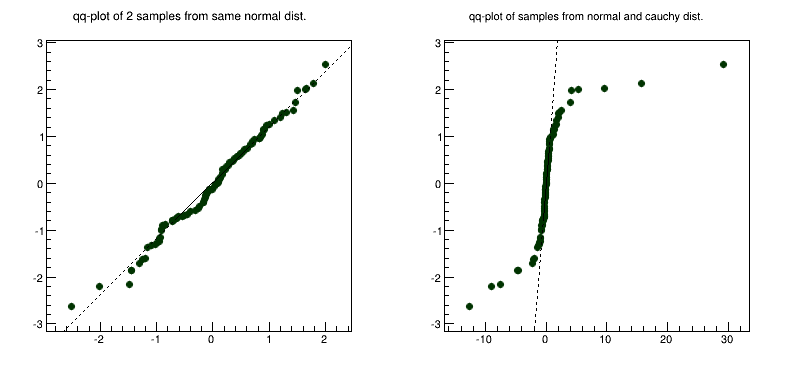
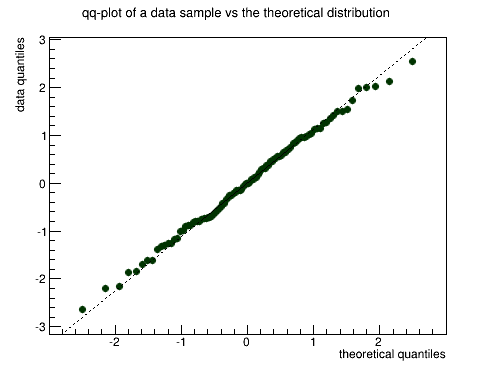
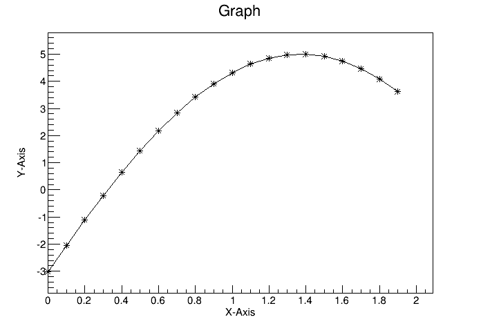
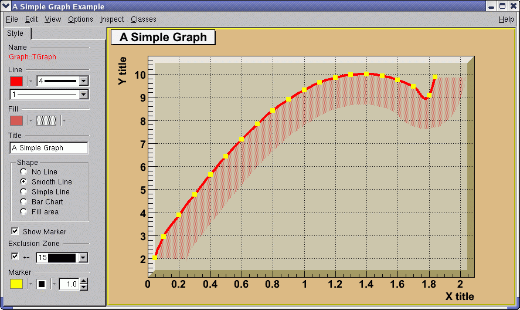

# Graphs


A graph is a graphics object made of two arrays X and Y, holding the
x,y coordinates of `n` points. There are several graph classes; they
are **`TGraph`**, **`TGraphErrors`**, **`TGraphAsymmErrors`**, and
**`TMultiGraph`**.

## TGraph


The **`TGraph`** class supports the general case with non-equidistant
points, and the special case with equidistant points. Graphs are
created with the **`TGraph`** constructor. First, we define the arrays
of coordinates and then create the graph. The coordinates can be
arrays of doubles or floats.

``` {.cpp}
   Int_t n = 20;
   Double_t x[n], y[n];
   for (Int_t i=0; i<n; i++) {
      x[i] = i*0.1;
      y[i] = 10*sin(x[i]+0.2);
   }
   TGraph *gr1 = new TGraph (n, x, y);
```

An alternative constructor takes only the number of points `n`. It is
expected that the coordinates will be set later.

``` {.cpp}
TGraph *gr2 = new TGraph(n);
```

The default constructor can also be used. Further calls to
`SetPoint()` will extend the internal vectors.

``` {.cpp}
TGraph *gr3 = new TGraph();
```

### Graph Draw Options


The various drawing options for a graph are explained in
`TGraph::PaintGraph`. They are:

-   "`L`" A simple poly-line between every points is drawn

-   "`F`" A fill area is drawn

-   "`F1`" Idem as "`F`" but fill area is no more repartee around
    X=0 or Y=0

-   "`F2`" draw a fill area poly line connecting the center of bins

-   "`A`" Axis are drawn around the graph

-   "`C`" A smooth curve is drawn

-   "`*`" A star is plotted at each point

-   "`P`" The current marker of the graph is plotted at each point

-   "`B`" A bar chart is drawn at each point

-   "`[]` " Only the end vertical/horizontal lines of the error bars
    are drawn. This option only applies to the
   **`TGraphAsymmErrors`**.

-   "`1`" `ylow` `=` `rwymin`

The options are not case sensitive and they can be concatenated in
most cases. Let us look at some examples.

#### Continuous Line, Axis and Stars (AC\*)


``` {.cpp}
{
   Int_t n = 20;
   Double_t x[n], y[n];
   for (Int_t i=0;i<n;i++) {
      x[i] = i*0.1;
      y[i] = 10*sin(x[i]+0.2);
   }

   // create graph
   TGraph *gr  = new TGraph(n,x,y);
   TCanvas *c1 = new TCanvas("c1","Graph Draw Options",
                             200,10,600,400);

   // draw the graph with axis, continuous line, and put
   // a * at each point
   gr->Draw("AC*");
}
```

#### Bar Graphs (AB)


``` {.cpp}
root[] TGraph *gr1 = new TGraph(n,x,y);
root[] gr1->SetFillColor(40);
root[] gr1->Draw("AB");
```

This code will only work if n, x, and y is defined. The previous
example defines these. You need to set the fill color, because by
default the fill color is white and will not be visible on a white
canvas. You also need to give it an axis, or the bar chart will not be
displayed properly.

#### Filled Graphs (AF)


``` {.cpp}
root[] TGraph *gr3 = new TGraph(n,x,y);
root[] gr3->SetFillColor(45);
root[] gr3->Draw("AF")
```

This code will only work if `n`, `x`, `y `are defined. The first
example defines them. You need to set the fill color, because by
default the fill color is white and will not be visible on a white
canvas. You also need to give it an axis, or the filled polygon will
not be displayed properly.

#### Marker Options


``` {.cpp}
{
   Int_t n = 20;
   Double_t x[n], y[n];

   // build the arrays with the coordinate of points
   for (Int_t i=0; i<n; i++) {
      x[i] = i*0.1;
      y[i] = 10*sin(x[i]+0.2);
   }

   // create graphs
   TGraph *gr3  = new TGraph(n,x,y);
   TCanvas *c1 = new TCanvas ("c1","Graph Draw Options",
                               200,10,600,400);

   // draw the graph with the axis,contineous line, and put
   // a marker using the graph's marker style at each point
   gr3->SetMarkerStyle(21);
   c1->cd(4);
   gr3->Draw("APL");

   // get the points in the graph and put them into an array
   Double_t *nx = gr3->GetX();
   Double_t *ny = gr3->GetY();

   // create markers of different colors
   for (Int_t j=2; j<n-1; j++) {
      TMarker *m = new TMarker(nx[j], 0.5*ny[j], 22);
      m->SetMarkerSize(2);
      m->SetMarkerColor(31+j);
      m->Draw();
   }
}
```

## Superimposing Two Graphs


To super impose two graphs you need to draw the axis only once, and
leave out the "A" in the draw options for the second graph. Next is an
example:


``` {.cpp}
{
   Int_t n = 20;
   Double_t x[n], y[n], x1[n], y1[n];

   // create a blue graph with a cos function
   gr1->SetLineColor(4);
   gr1->Draw("AC*");

   // superimpose the second graph by leaving out the axis option "A"
   gr2->SetLineWidth(3);
   gr2->SetMarkerStyle(21);
   gr2->SetLineColor(2);
   gr2->Draw("CP");
}
```

## Graphs with Error Bars


A **`TGraphErrors`** is a **`TGraph`** with error bars. The various
draw format options of `TGraphErrors::Paint()` are derived from
**`TGraph`**.

``` {.cpp}
void TGraphErrors::Paint(Option_t *option)
```


In addition, it can be drawn with the "`Z`" option to leave off the
small lines at the end of the error bars. If option contains "`>`", an
arrow is drawn at the end of the error bars. If option contains
"`|>`", a full arrow is drawn at the end of the error bars. The size
of the arrow is set to 2/3 of the marker size.

The option "`[]`" is interesting to superimpose systematic errors on
top of the graph with the statistical errors. When it is specified,
only the end vertical/horizontal lines of the error bars are drawn.

To control the size of the lines at the end of the error bars (when
option 1 is chosen) use `SetEndErrorSize(np)`. By default `np=1`; `np`
represents the number of pixels.

``` {.cpp}
gStyle->SetEndErrorSize(np);
```

The four parameters of **`TGraphErrors`** are: `X, Y` (as in
**`TGraph`**), `X`-errors, and `Y`-errors - the size of the errors
in the `x` and `y` direction. Next example is
`$ROOTSYS/tutorials/graphs/gerrors.C.`

``` {.cpp}
{
   c1 = new TCanvas("c1","A Simple Graph with error bars",200,10,700,500);
   c1->SetGrid();

   // create the coordinate arrays
   Int_t n = 10;
   Float_t x[n]  = {-.22,.05,.25,.35,.5,.61,.7,.85,.89,.95};
   Float_t y[n]  = {1,2.9,5.6,7.4,9,9.6,8.7,6.3,4.5,1};

   // create the error arrays
   Float_t ex[n] = {.05,.1,.07,.07,.04,.05,.06,.07,.08,.05};
   Float_t ey[n] = {.8,.7,.6,.5,.4,.4,.5,.6,.7,.8};

   // create the TGraphErrors and draw it
   gr = new TGraphErrors(n,x,y,ex,ey);
   gr->SetTitle("TGraphErrors Example");
   gr->SetMarkerColor(4);
   gr->SetMarkerStyle(21);
   gr->Draw("ALP");
   c1->Update();
}
```

## Graphs with Asymmetric Error Bars


A **`TGraphAsymmErrors`** is a **`TGraph`** with asymmetric error
bars. It inherits the various draw format options from **`TGraph`**.
Its method `Paint(Option_t *option)` paints the
**`TGraphAsymmErrors`** with the current attributes. You can set the
following additional options for drawing:

-   "`z`" or "`Z`"the horizontal and vertical small lines are not
    drawn at the end of error bars

-   "`>`"an arrow is drawn at the end of the error bars

-   "`|>`"a full arrow is drawn at the end of the error bar; its size
    is $\frac{2}{3}$ of the marker size

-   "`[]`"only the end vertical/horizontal lines of the error bars are
    drawn; this option is interesting to superimpose systematic errors
    on top of a graph with statistical errors.

The constructor has six arrays as parameters: X and Y as **TGraph**
and low X-errors and high X-errors, low Y-errors and high Y-errors.
The low value is the length of the error bar to the left and down,
the high value is the length of the error bar to the right and up.

``` {.cpp}
{
   c1 = new TCanvas("c1","A Simple Graph with error bars",
                    200,10,700,500);
   c1->SetGrid();

   // create the arrays for the points
   Int_t n = 10;
   Double_t x[n]  = {-.22,.05,.25,.35,.5, .61,.7,.85,.89,.95};
   Double_t y[n]  = {1,2.9,5.6,7.4,9,9.6,8.7,6.3,4.5,1};

   // create the arrays with high and low errors
   Double_t exl[n] = {.05,.1,.07,.07,.04,.05,.06,.07,.08,.05};
   Double_t eyl[n] = {.8,.7,.6,.5,.4,.4,.5,.6,.7,.8};
   Double_t exh[n] = {.02,.08,.05,.05,.03,.03,.04,.05,.06,.03};
   Double_t eyh[n] = {.6,.5,.4,.3,.2,.2,.3,.4,.5,.6};

   // create TGraphAsymmErrors with the arrays
   gr = new TGraphAsymmErrors(n,x,y,exl,exh,eyl,eyh);
   gr->SetTitle("TGraphAsymmErrors Example");
   gr->SetMarkerColor(4);
   gr->SetMarkerStyle(21);
   gr->Draw("ALP");
}
```

## Graphs with Asymmetric Bent Errors


A **`TGraphBentErrors`** is a **`TGraph`** with bent, asymmetric error
bars. The various format options to draw a **`TGraphBentErrors`** are
explained in **`TGraphBentErrors::Paint` method. The
`TGraphBentErrors`** is drawn by default with error bars and small
horizontal and vertical lines at the end of the error bars. If option
"`z`" or "`Z`" is specified, these small lines are not drawn. If the
option "`X`" is specified, the errors are not drawn
(the `TGraph::Paint` method equivalent).

-   if option contains "`>`", an arrow is drawn at the end of the
    error bars

-   if option contains "`|>`", a full arrow is drawn at the end of the
    error bars

-   the size of the arrow is set to 2/3 of the marker size

-   if option "`[]`" is specified, only the end vertical/horizontal
    lines of the error bars are drawn. This option is interesting to
    superimpose systematic errors on top of a graph with statistical
    errors.


This figure has been generated by the following macro:

``` {.cpp}
{
   Int_t n = 10;
   Double_t x[n] = {-0.22,0.05,0.25,0.35,0.5,0.61,0.7,0.85,0.89,0.95};
   Double_t y[n] = {1,2.9,5.6,7.4,9,9.6,8.7,6.3,4.5,1};
   Double_t exl[n] = {.05,.1,.07,.07,.04,.05,.06,.07,.08,.05};
   Double_t eyl[n] = {.8,.7,.6,.5,.4,.4,.5,.6,.7,.8};
   Double_t exh[n] = {.02,.08,.05,.05,.03,.03,.04,.05,.06,.03};
   Double_t eyh[n] = {.6,.5,.4,.3,.2,.2,.3,.4,.5,.6};
   Double_t exld[n] = {.0,.0,.0,.0,.0,.0,.0,.0,.0,.0};
   Double_t eyld[n] = {.0,.0,.0,.0,.0,.0,.0,.0,.0,.0};
   Double_t exhd[n] = {.0,.0,.0,.0,.0,.0,.0,.0,.0,.0};
   Double_t eyhd[n] = {.0,.0,.0,.0,.0,.0,.0,.0,.05,.0};
   gr = new TGraphBentErrors(n,x,y,
                             exl,exh,eyl,eyh,exld,exhd,eyld,eyhd);
   gr->SetTitle("TGraphBentErrors Example");
   gr->SetMarkerColor(4);
   gr->SetMarkerStyle(21);
   gr->Draw("ALP");
}
```

## TGraphPolar


The **`TGraphPolar`** class creates a polar graph (including error
bars). A **`TGraphPolar`** is a **`TGraphErrors`** represented in
polar coordinates. It uses the class **`TGraphPolargram`** to draw the
polar axis.

``` {.cpp}
{
   TCanvas *CPol = new TCanvas("CPol","TGraphPolar Examples",700,700);
   Double_t rmin=0;
   Double_t rmax=TMath::Pi()*2;
   Double_t r[1000];
   Double_t theta[1000];
   TF1 * fp1 = new TF1("fplot","cos(x)",rmin,rmax);
   for (Int_t ipt = 0; ipt < 1000; ipt++) {
      r[ipt] = ipt*(rmax-rmin)/1000+rmin;
      theta[ipt] = fp1->Eval(r[ipt]);
   }
   TGraphPolar * grP1 = new TGraphPolar(1000,r,theta);
   grP1->SetLineColor(2);
   grP1->Draw("AOL");
}
```

The TGraphPolar drawing options are:

"O" Polar labels are paint orthogonally to the polargram radius.

"P" Polymarker are paint at each point position.

"E" Paint error bars.

"F" Paint fill area (closed polygon).

"A"Force axis redrawing even if a polagram already exists.


## TGraph Exclusion Zone


When a graph is painted with the option "`C`" or "`L`", it is possible
to draw a filled area on one side of the line. This is useful to show
exclusion zones. This drawing mode is activated when the absolute
value of the graph line width (set thanks to `SetLineWidth`) is
greater than 99. In that case the line width number is interpreted as
`100*ff+ll = ffll`. The two-digit numbers "`ll`" represent the normal
line width whereas "`ff`" is the filled area width. The sign of
"`ffll`" allows flipping the filled area from one side of the line to
the other. The current fill area attributes are used to draw the
hatched zone.


``` {.cpp}
{
   c1 = new TCanvas("c1","Exclusion graphs examples",200,10,700,500);
   c1->SetGrid();

   // create the multigraph
   TMultiGraph *mg = new TMultiGraph();
   mg->SetTitle("Exclusion graphs");

   // create the graphs points
   const Int_t n = 35;
   Double_t x1[n], x2[n], x3[n], y1[n], y2[n], y3[n];
   for (Int_t i=0;i<n;i++) {
      x1[i] = i*0.1; y1[i] = 10*sin(x1[i]);
      x2[i] = x1[i]; y2[i] = 10*cos(x1[i]);
      x3[i] = x1[i]+.5; y3[i] = 10*sin(x1[i])-2;
   }

   // create the 1st TGraph
   gr1 = new TGraph(n,x1,y1);
   gr1->SetLineColor(2);
   gr1->SetLineWidth(1504);
   gr1->SetFillStyle(3005);

   // create the 2nd TGraph
   gr2 = new TGraph(n,x2,y2);
   gr2->SetLineColor(4);
   gr2->SetLineWidth(-2002);
   gr2->SetFillStyle(3004);
   gr2->SetFillColor(9);

   // create the 3rd TGraph
   gr3 = new TGraph(n,x3,y3);
   gr3->SetLineColor(5);
   gr3->SetLineWidth(-802);
   gr3->SetFillStyle(3002);
   gr3->SetFillColor(2);

   // put the graphs in the multigraph
   mg->Add(gr1);
   mg->Add(gr2);
   mg->Add(gr3);

   // draw the multigraph
   mg->Draw("AC");
}
```

## TGraphQQ


A **`TGraphQQ`** allows drawing quantile-quantile plots. Such plots
can be drawn for two datasets, or for one dataset and a theoretical
distribution function.

### Two Datasets



Quantile-quantile plots are used to determine whether two samples come
from the same distribution. A qq-plot draws the quantiles of one
dataset against the quantile of the other. The quantiles of the
dataset with fewer entries are on Y-axis, with more entries - on
X-axis. A straight line, going through 0.25 and 0.75 quantiles is also
plotted for reference. It represents a robust linear fit, not
sensitive to the extremes of the datasets. If the datasets come from
the same distribution, points of the plot should fall approximately on
the 45 degrees line. If they have the same distribution function, but
different parameters of location or scale, they should still fall on
the straight line, but not the 45 degrees one.

The greater their departure from the straight line, the more evidence
there is that the datasets come from different distributions. The
advantage of qq-plot is that it not only shows that the underlying
distributions are different, but, unlike the analytical methods, it
also gives information on the nature of this difference: heavier
tails, different location/scale, different shape, etc.

### One Dataset



Quantile-quantile plots are used to determine if the dataset comes
from the specified theoretical distribution, such as normal. A qq-plot
draws quantiles of the dataset against quantiles of the specified
theoretical distribution. Note, that density, not CDF should be
specified a straight line, going through 0.25 and 0.75 quantiles could
also be plotted for reference. It represents a robust linear fit, not
sensitive to the extremes of the dataset. As in the two datasets case,
departures from straight line indicate departures from the specified
distribution. Next picture shows an example of a qq-plot of a dataset
from N(3, 2) distribution and TMath::Gaus(0, 1) theoretical function.
Fitting parameters are estimates of the distribution mean and sigma.


## TMultiGraph


A **`TMultiGraph`** is a collection of **`TGraph`** (or derived)
objects. Use `TMultiGraph::Add `to add a new graph to the list. The
**`TMultiGraph`** owns the objects in the list. The drawing and
fitting options are the same as for **`TGraph`**.

``` {.cpp}
{
   // create the points
   Int_t n = 10;
   Double_t x[n]  = {-.22,.05,.25,.35,.5,.61,.7,.85,.89,.95};
   Double_t y[n]  = {1,2.9,5.6,7.4,9,9.6,8.7,6.3,4.5,1};
   Double_t x2[n]  = {-.12,.15,.35,.45,.6,.71,.8,.95,.99,1.05};
   Double_t y2[n]  = {1,2.9,5.6,7.4,9,9.6,8.7,6.3,4.5,1};

   // create the width of errors in x and y direction
   Double_t ex[n] = {.05,.1,.07,.07,.04,.05,.06,.07,.08,.05};
   Double_t ey[n] = {.8,.7,.6,.5,.4,.4,.5,.6,.7,.8};

   // create two graphs
   TGraph *gr1 = new TGraph(n,x2,y2);
   TGraphErrors *gr2 = new TGraphErrors(n,x,y,ex,ey);

   // create a multigraph and draw it
   TMultiGraph  *mg  = new TMultiGraph();
   mg->Add(gr1);
   mg->Add(gr2);
   mg->Draw("ALP");
}
```

## TGraph2D


This class is a set of `N` points `x[i]`, `y[i]`, `z[i]` in a
non-uniform grid. Several visualization techniques are implemented,
including Delaunay triangulation. Delaunay triangulation is defined as
follow: ‘for a set `S` of points in the Euclidean plane, the unique
triangulation `DT(S)` of `S` such that no point in `S` is inside the
circum-circle of any triangle in `DT(S)`. `DT(S)` is the dual of the
Voronoi diagram of `S`. If n is the number of points in `S`, the
Voronoi diagram of S is the partitioning of the plane containing `S`
points into n convex polygons such that each polygon contains exactly
one point and every point in a given polygon is closer to its central
point than to any other. A Voronoi diagram is sometimes also known as
a Dirichlet tessellation.

The **`TGraph2D`** class has the following constructors:

-   With an arrays' dimension `n` and three arrays `x`, `y`, and `z`
    (can be arrays of doubles, floats, or integers):

``` {.cpp}
   TGraph2D *g = new TGraph2D(n,x,y,z);
```

-   With an array dimension only:

``` {.cpp}
   TGraph2D *g = new TGraph2D(n);
```

-   Internal arrays are filled with the method `SetPoint` at the
    position "`i`" with the values `x`, `y`, `z`:

``` {.cpp}
   g->SetPoint(i,x,y,z);
```

-   Without parameters; the method `SetPoint` must be used to fill the
    internal arrays.

``` {.cpp}
   TGraph2D *g = new TGraph2D();
```

-   From a file:

``` {.cpp}
   TGraph2D *g = new TGraph2D("graph.dat");
```

The arrays are read from the ASCII file "`graph.dat`" according to a
specified format. The format's default value is "`%lg %lg %lg`". Note
that in any of last three cases, the `SetPoint` method can be used to
change a data point or to add a new one. If the data point index (`i`)
is greater than the size of the internal arrays, they are
automatically extended.

Specific drawing options can be used to paint a **`TGraph2D`**:

-   "`TRI`" the Delaunay triangles are drawn using filled area. A
    hidden surface drawing technique is used. The surface is painted
    with the current fill area color. The edges of the triangles are
    painted with the current line color;

-   "`TRIW`"the Delaunay triangles are drawn as wire frame;

-   "`TRI1`" the Delaunay triangles are painted with color levels. The
    edges of the triangles are painted with the current line color;

-   "`TRI2`" the Delaunay triangles are painted with color levels;

-   "`P`"draws a marker at each vertex;

-   "`P0`" draws a circle at each vertex. Each circle background is
    white.

A **`TGraph2D`** can be also drawn with ANY options valid for 2D
histogram drawing. In this case, an intermediate 2D histogram is
filled using the Delaunay triangles technique to interpolate the data
set. **`TGraph2D`** linearly interpolate a `Z` value for any `(X,Y)`
point given some existing `(X,Y,Z)` points. The existing `(X,Y,Z)`
points can be randomly scattered. The algorithm works by joining the
existing points to make Delaunay triangles in `(X,Y)`. These are then
used to define flat planes in `(X,Y,Z)` over which to interpolate. The
interpolated surface thus takes the form of tessellating triangles at
various angles. Output can take the form of a 2D histogram or a
vector. The triangles found can be drawn in 3D. This software cannot
be guaranteed to work under all circumstances. It was originally
written to work with a few hundred points in an` XY` space with
similar `X` and `Y` ranges.


``` {.cpp}
{
   TCanvas *c = new TCanvas("c","Graph2D example",0,0,700,600);
   Double_t x, y, z, P = 6.;
   Int_t np = 200;
   TGraph2D *dt = new TGraph2D();
   TRandom *r = new TRandom();

   for (Int_t N=0; N<np; N++) {
      x = 2*P*(r->Rndm(N))-P;
      y = 2*P*(r->Rndm(N))-P;
      z = (sin(x)/x)*(sin(y)/y)+0.2;
      dt->SetPoint(N,x,y,z);
   }
   gStyle->SetPalette(55);
   dt->Draw("surf1");       // use "surf1" to generate the left picture
}                           // use "tri1 p0" to generate the right one
```

A more complete example is `$ROOTSYS/tutorials/fit/graph2dfit.C` that
produces the next figure.


## TGraph2DErrors


A **`TGraph2DErrors`** is a **`TGraph2D`** with errors. It is useful to
perform fits with errors on a 2D graph. An example is the macro
`$ROOTSYS/tutorials/graphs/graph2derrorsfit.C`.

## Fitting a Graph


The graph `Fit` method in general works the same way as the `TH1::Fit`.
See "Fitting Histograms".

## Setting the Graph's Axis Title


To give the axis of a graph a title you need to draw the graph first,
only then does it actually have an axis object. Once drawn, you set the
title by getting the axis and calling the `TAxis::SetTitle` method, and
if you want to center it, you can call the `TAxis::CenterTitle` method.

Assuming that `n, x,` and `y` are defined. Next code sets the titles of
the `x` and `y` axes.

``` {.cpp}
root[] gr5 = new TGraph(n,x,y)
root[] gr5->Draw()
<TCanvas::MakeDefCanvas>: created default TCanvas with name c1
root[] gr5->Draw("ALP")
root[] gr5->GetXaxis()->SetTitle("X-Axis")
root[] gr5->GetYaxis()->SetTitle("Y-Axis")
root[] gr5->GetXaxis()->CenterTitle()
root[] gr5->GetYaxis()->CenterTitle()
root[] gr5->Draw("ALP")
```

For more graph examples see the scripts: `$ROOTSYS/tutorials` directory
`graph.C`, `gerrors.C`, `zdemo.C`, and `gerrors2.C`.



## Zooming a Graph


To zoom a graph you can create a histogram with the desired axis range
first. Draw the empty histogram and then draw the graph using the
existing axis from the histogram.

``` {.cpp}
{
   c1 = new TCanvas("c1","A Zoomed Graph",200,10,700,500);
   hpx = new TH2F("hpx","Zoomed Graph Example",10,0,0.5,10,1.0,8.0);
   hpx->SetStats(kFALSE);   // no statistics
   hpx->Draw();
   Int_t n = 10;
   Double_t x[n] = {-.22,.05,.25,.35,.5,.61,.7,.85,.89,.95};
   Double_t y[n] = {1,2.9,5.6,7.4,9,9.6,8.7,6.3,4.5,1};
   gr = new TGraph(n,x,y);
   gr->SetMarkerColor(4);
   gr->SetMarkerStyle(20);
   gr->Draw("LP");// and draw it without an axis
}
```

The next example is the same graph as above with a zoom in the x and y
directions.


## The User Interface for Graphs


The class **`TGraphEditor`** provides the user interface for setting
the following graph attributes interactively:

- Title text entry field ... sets the title of the graph.

- Shape radio button group - sets the graph shapes:

    - *No Line*: draw unconnected points;
    - *Smooth Line*: a smooth curve;
    - *Simple Line*: a simple poly-line;
    - *Bart Chart*: a bar chart at each point.
    - *Fill Area*: a fill area is drawn.

- Show Marker - sets markers as visible or invisible.

- Exclusion Zone - specifies the exclusion zone parameters :

    - *'+-‘ check button*: sets on which side of the line the
      exclusion zone will be drawn;
    - *Width combo box*: defines the width of the zone.



