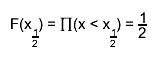

# Automatic HTML Documentation
\index{documentation!class}


**`THtml`** is ROOT's documentation engine. It can be used to document
your classes in a reference guide, and to convert your text or source
files to HTML.

## Reference Guide


The Reference Guide for the ROOT classes at
<http://root.cern.ch/root/html/> has been generated by ROOT's
**`THtml`** class. Just as for ROOT's classes, it can generate (and
update) a reference guide for your classes, too. You document your
classes using source code comments. All comments will be automatically
put into a `<pre></pre>` environment to keep the indentation and line
length. You can write "raw" HTML by enclosing comments in the keywords
`Begin_Html` and `End_Html`.

To generate documentation for the class **`TObject`** you could run the
following commands:

``` {.cpp}
root[] THtml h
root[] h.SetInputDir("$(ROOTSYS)");
root[] h.MakeClass("TObject");
root[] h.CreateJavascript();
root[] h.CreateStylesheet();
```

The comments following the first comment of the form
//\_\_\_\_\_\_\_\_\_\_\_\_\_\_\_\_\_\_\_\_, before any method, is
assumed to be the **class description**. As with any other documentation
part, it has to be a continuous block of comments.

Any documented class will have an **class index entry** in the
`ClassIndex.html`, showing their name with a link to their documentation
page and a miniature description. This description for e.g. the class
`MyClass` has to be given in `MyClass's` header file as documentation.

A **method description** block starts immediately after '`{`' and looks
like this:

``` {.cpp}
void TWorld::HelloWorldFunc(string *text)
{
// This is a documentation example of the function TWorld::HelloWorldFunc
helloWorld.Print(text);
}
```

Like in a class description block, everything until the first
non-commented line is considered as a valid member function description
block.

**Data members** are documented by putting a C++ comment behind their
declaration in the header file, e.g.

``` {.cpp}
Int_t fIAmADataMember; // this is a data member
```

When documenting a class, **`THtml`** creates both a "beautified"
version of the source file and a web page containing the class
documentation. The documentation also shows the **author** and a
**copyright statement**. This information is extracted from the source
file. The author can be in the format

``` {.cpp}
// Author: Enrico Fermi
```

for people that have an entry in CERN's XWho database, and for those who
have not:

``` {.cpp}
// Author: Enrico Fermi <mailto:enrico@fnal.gov>
```

The copyright statement is introduced by the string "`* Copyright`"
inside a comment.

You should read the class reference page at
<http://root.cern.ch/root/html/THtml.html> to learn about all of
**`THtml`**'s features.

### Product and Module Documentation


For **`THtml`**, a product like ROOT is a combination of several
modules. It can include user-provided document for both products and
modules. The name of the product can be set by calling
`THtml::SetProductName()`. By default, the documentation is searched for
in the `doc/` subdirectory of the source tree, and in the
`../doc `directory, relative to the directory of first source file of a
module. This can be set by calls to `THtml::SetProductDocDir()` and
`THtml::SetModuleDocPath()`.

The documentation is generated as an index page with links to further
files. This index page includes the file `index.txt` converted to HTML
(via `THtml::Convert()`) or the file index.html (without conversion to
HTML, of course), if any of these files exist. The index page will also
contain a list of links to all files in the directory that end on
`.html` or `.txt`. Files ending on `.txt` will be converted to HTML
before they are copied to the output directory. For each file, the
link's text will be the file name without extension, with underscores
replaced by spaces.

You can see an example of the module documentation including links, the
corresponding `index.html`, and the module class index at
<http://root.cern.ch/root/html/HIST_Index.html>.

## Converting Sources (and Other Files) to HTML


**`THtml`** can take a file (C++ or text) and convert it to HTML. There
are two main use cases:

The output of a **macro** converted to HTML will almost look like the
beautified source file of a class reference. The `Begin_Html/End_Html`
keywords are supported; comments, strings, and keywords are colored like
in **`THtml`**'s output for source code.

The macro `Event.cxx` in `$ROOTSYS/test` can be seen as an example of
documented ROOT macros at
<http://root.cern.ch/root/html/examples/Event.cxx.html>

`THtml::Convert()`converts a single text file to HTML. For example, it
can be run on a change log. Each known class name will be linked to its
documentation page. An example is ROOT's change log at
<http://root.cern.ch/root/html/examples/V5.16.txt.html>

To convert the source file MyCode.C to HTML, you can run

``` {.cpp}
root[] THtml h
root[] h.Convert("MyCode.C", "Look At My Code", "htmlout/");
```

This will create the file `htmlout/MyCode.C.html`. The HTML page will
have the title "Look At My Code".

## Special Documentation Elements: Directives


A common documentation problem is the inclusion of images. They are
usually generated externally, which poses problems with where to keep
the images, and how to keep them up to date. **`THtml`** solves this by
offering a few special documentation elements: macro and latex
directives.

### Latex Directive


Documentation surrounded by the keywords `BEGIN_LATEX / END_LATEX` will
be passed to ROOT Latex engine **`TLatex`**. The keywords can be written
with small or capital letters (case insensitive). The output will be
stored to an image file, which gets automatically included in the
documentation.

``` {.cpp}
// This function calculates BEGIN_LATEX
//   F(x_{#frac{1}{2}}) = #prod(x < x_{#frac{1}{2}}) = #frac{1}{2}
// END_LATEX
```

THtml will inject the following picture:



The image file name is generated from the formula and will be unique for
all the documentation. It is stored along-side the documentation, and it
will be automatically regenerated when the documentation is updated. The
handling of the Latex directive is done by the class
**`TDocLatexDirective`**.

The `BEGIN_LATEX` keyword can take the following parameters:

-   `fontsize`: sets the **`TLatex`** font size. The default value is 16.

-   `separator`: sets a list of characters for which a new column will
    be started. This allows aligned, multi-line, multi-column layout,
    which can be useful for e.g. mathematical derivations. It is unset
    by default, meaning the Latex directive will only generate one
    column.

-   `rseparator`: like separator, but a regular expression. Columns
    start with a match of this regular expression. Only one of separator
    or rseparator can be given.

-   `align`: defines the alignment of the columns. Note that the column
    delimiter counts as a column itself!

Example invocation, where the font size is set to 10, new columns are
started by the characters '`=`' and '`,`', and the two columns are left
aligned with the separator column centered:

`Begin_Latex(fontsize=10, separator='=,', align=lcl)`

### Macro Directive


A more general approach is offered by the Macro directive, enclosed in
the keywords `BEGIN_MACRO /` `END_MACRO`. The keywords can be written
with small or capital letters (case insensitive). If the text enclosed
by these keywords contains the character '`{`' the text is assumed to be
source code. Otherwise it is assumed to be a file name relative to the
current file's path, and taking into account the paths specified by
**`THtml::AddMacroPath()`. The macro file or the C++ source is executed
when generating the documentation. It is expected to return a
**`TObject*`**, which will be saved to a GIF file, by calling the
virtual function **`TObject::SaveAs()`.****

The `BEGIN_MACRO` keyword can take the following parameters:

-   `GUI`: will end batch mode. This is needed e.g. for creating screen
    shots of GUI elements, where the call to **`TObject::SaveAs()` will
    invoke `TGObject`**`::SaveAs()` which needs the graphics system to
    be initialized.

-   `source`: requests the source of the macro to be shown in a second
    tab on the HTML page. This is useful e.g. for example macros,
    showing how the image was generated. Lines that should be executed
    but not shown in the source tab can be hidden by ending them with
    `*HIDE*` (most probably as a comment). Lines may be hidden because
    they are not needed for the understanding of the macro or because
    they only make sense in the context of the documentation, like the
    statement returning the **`TObject*`**.

Example invocation, with enabled ROOT graphics system and a source tab:

`Begin_Macro(gui, source)`

## Customizing HTML


**`THtml`** allows a vast amount of customizations, from a custom style
to custom links, to customized java scripts. By default, the style sheet
is taken from `$ROOTSYS/etc/html/ROOT.css` when the documentation is
generated. The path for `ROOT.css` can be changed by calling
`THtml::SetEtcDir()`; it should contain the same CSS classes and entity
IDs as the original `ROOT.css`. This style sheet is an easy means of
customizing the layout and appearance of the documentation pages. Many
of **`THtml`** setting can be customized by calls to **`THtml`** member
functions or by settings in .rootrc, as documented in the **`THtml`**
class reference page <http://root.cern.ch/root/html/THtml>. The
following will enumerate some of the highlights.

### Referencing Documentation for other Libraries


When **`THtml`** generates documentation for classes it recognizes all
class names known to ROOT. If **`THtml`** does not have sources for a
class it determines the class's library name. This has to be set by
means of `rootmap` files, see Library AutoLoading of this User's Guide.
Given the library name, **`THtml`** searches for an entry in its map of
libraries to documentation URLs. If it finds it, it will create a link
to the documentation at that URL for all occurrences of a given class
name. One can set the URL `../mylib/` for a library name `MyLib` by
setting `Root.Html.MyLib:` `../mylib/` or by calling
`THtml::SetLibURL("MyLib", "../mylib/")`. Occurrences of class `MyClass`
of `MyLib` will now be referenced as `../mylib/MyClass.html`.

### Search Engine


**`THtml`** can invoke external search engines. The ROOT reference guide
sets `Root.Html.Search` to <http://www.google.com/search?q=%s+site%3A%u>.
Calling **`THtml::SetSearchStemURL()`** will set the same. If this URL stem is
set, `THtml` will create search fields in the index pages. It will
send the words entered in these search fields as %s in the URL; %u will
be replaced by the current document's path, allowing a site- and
directory-specific search.

### ViewCVS


Most code is managed in a version control system like CVS. ViewCVS is a
WWW reader interface to the versioning control system that allows e.g.
tracking a file's changes. **`THtml`** will reference these pages
automatically if the `.rootrc` variable `Root.Html.ViewCVS` is set to
the URL stem of the ViewCVS. installation. Alternatively, one can call
THtml::SetViewCVS().

### Wiki Pages


In some contexts it might be desirable to let users comment on classes,
e.g. for suggestions of use or alternatives, details of behavior, and
cross references to other relevant classes. A successful example of this
is the PHP.net documentation with its user annotations. **`THtml`** can
include a link to a class's Wiki page by setting the Wiki base URL via
`Root.Html.WikiURL` or **`THtml`**`::SetWikiURL()`.

## Tutorial


You can run the tutorial `htmlex.C` to see how **`THtml`** converts a
script to HTML and how it creates the corresponding class reference:

``` {.cpp}
root[] .x $(ROOTSYS)/tutorials/htmlex.C+
```

Have a look at the HTML version of the macro in
`htmldoc/htmlex.C.html `(which should be the same as the one at
<http://root.cern.ch/root/html/examples/htmlex.C.html>).

It demonstrates how to generate documentation for your classes and for
ROOT classes and how to "beautify" a macro.
