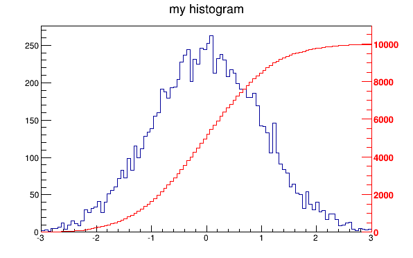
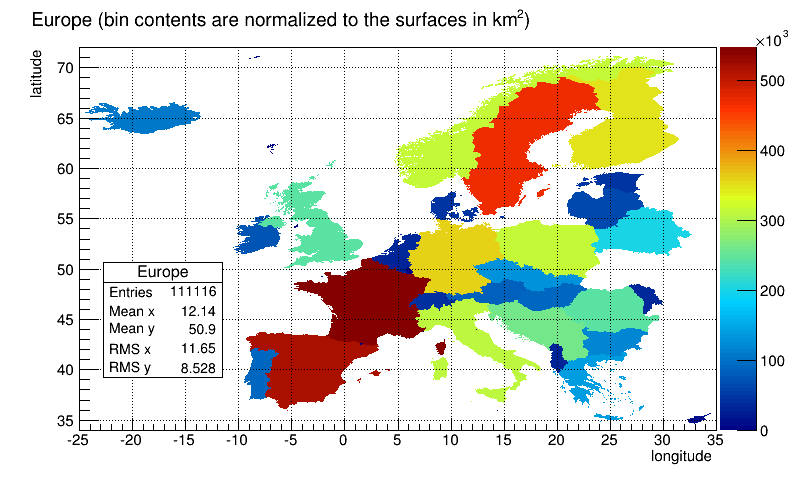
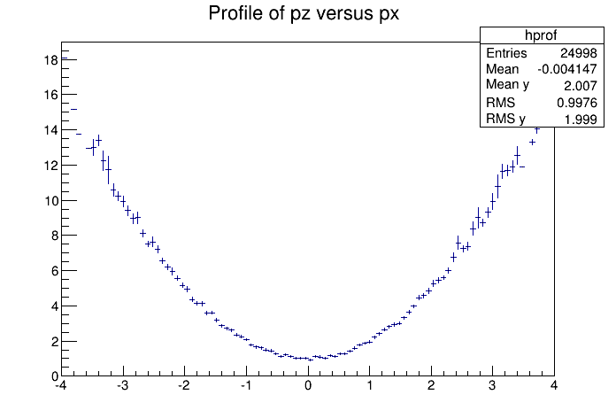
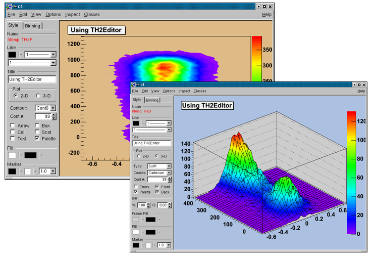

# Histograms


This chapter covers the functionality of the histogram classes. We
begin with an overview of the histogram classes, after which we
provide instructions and examples on the histogram features.

We have put this chapter ahead of the graphics chapter so that you can
begin working with histograms as soon as possible. Some of the
examples have graphics commands that may look unfamiliar to you. These
are covered in the chapter "Input/Output".

## The Histogram Classes
\index{histogram}

ROOT supports histograms up to three dimensions. Separate concrete
classes are provided for one-dimensional, two-dimensional and
three-dimensional classes. The histogram classes are split into
further categories, depending on the set of possible bin values:

-   **`TH1C, TH2C and TH3C`** contain one byte per bin (maximum bin
    content = 255)

-   **`TH1S, TH2S and TH3S`** contain one short per bin (maximum bin
    content = 65 535).

-   **`TH1I, TH2I and TH3I`** contain one integer per bin (maximum bin
    content = 2 147 483 647).

-   **`TH1F, TH2F and TH3F`** contain one float per bin (maximum
    precision = 7 digits).

-   **`TH1D, TH2D and TH3D`** contain one double per bin (maximum
    precision = 14 digits).

ROOT also supports profile histograms, which constitute an elegant
replacement of two-dimensional histograms in many cases. The
inter-relation of two measured quantities X and Y can always be
visualized with a two-dimensional histogram or scatter-plot. Profile
histograms, on the other hand, are used to display the mean value of Y
and its RMS for each bin in X. If Y is an unknown but single-valued
approximate function of X, it will have greater precision in a profile
histogram than in a scatter plot.

-   **`TProfile`** : one dimensional profiles

-   **`TProfile2D`** : two dimensional profiles


All ROOT histogram classes are derived from the base class **`TH1`**
(see figure above). This means that two-dimensional and
three-dimensional histograms are seen as a type of a one-dimensional
histogram, in the same way in which multidimensional C arrays are just
an abstraction of a one-dimensional contiguous block of memory.

## Creating Histograms


There are several ways in which you can create a histogram object in
ROOT. The straightforward method is to use one of the several
constructors provided for each concrete class in the histogram
hierarchy. For more details on the constructor parameters, see the
subsection ["Constant or Variable Bin
Width"](#Fixed.or.Variable.Bin.Width) below. Histograms may also be
created by:

-   Calling the Clone() method of an existing histogram

-   Making a projection from a 2-D or 3-D histogram

-   Reading a histogram from a file (see Input/Output chapter)

``` {.cpp}
   // using various constructors
   TH1* h1 = new TH1I("h1", "h1 title", 100, 0.0, 4.0);
   TH2* h2 = new TH2F("h2", "h2 title", 40, 0.0, 2.0, 30, -1.5, 3.5);
   TH3* h3 = new TH3D("h3", "h3 title", 80, 0.0, 1.0, 100, -2.0, 2.0,
                       50, 0.0, 3.0);

   // cloning a histogram
   TH1* hc = (TH1*)h1->Clone();

   // projecting histograms
   // the projections always contain double values !
   TH1* hx = h2->ProjectionX(); // ! TH1D, not TH1F
   TH1* hy = h2->ProjectionY(); // ! TH1D, not TH1F
```

### Constant or Variable Bin Width


The histogram classes provide a variety of ways to construct a
histogram, but the most common way is to provide the name and title of
histogram and for each dimension: the number of bins, the minimum x
(lower edge of the first bin) and the maximum x (upper edge of the
last bin).

``` {.cpp}
   TH2* h = new TH2D(
      /* name */ "h2",
      /* title */ "Hist with constant bin width",
      /* X-dimension */ 100, 0.0, 4.0,
      /* Y-dimension */ 200, -3.0, 1.5);
```

When employing this constructor, you will create a histogram with
constant (fixed) bin width on each axis. For the example above, the
interval `[0.0, 4.0]` is divided into 100 bins of the same width `w`
`X = 4.0 - 0.0 100 = 0.04` for the X axis (dimension). Likewise, for
the Y axis (dimension), we have bins of equal width `w`
`Y = 1.5 - (-3.0) 200 = 0.0225`.

If you want to create histograms with variable bin widths, ROOT
provides another constructor suited for this purpose. Instead of
passing the data interval and the number of bins, you have to pass an
array (single or double precision) of bin edges. When the histogram
has `n` bins, then there are `n+1` distinct edges, so the array you
pass must be of size `n+1`.

``` {.cpp}
   const Int_t NBINS = 5;
   Double_t edges[NBINS + 1] = {0.0, 0.2, 0.3, 0.6, 0.8, 1.0};
   // Bin 1 corresponds to range [0.0, 0.2]
   // Bin 2 corresponds to range [0.2, 0.3] etc...

   TH1* h = new TH1D(
      /* name */ "h1",
      /* title */ "Hist with variable bin width",
      /* number of bins */ NBINS,
      /* edge array */ edges
    );
```

Each histogram object contains three **`TAxis`** objects: `fXaxis` ,
`fYaxis,` and `fZaxis`, but for one-dimensional histograms only the
X-axis is relevant, while for two-dimensional histograms the X-axis
and Y-axis are relevant. See the class **` TAxis`** for a description
of all the access methods. The bin edges are always stored internally
in double precision.

You can examine the actual edges / limits of the histogram bins by
accessing the axis parameters, like in the example below:

``` {.cpp}
   const Int_t XBINS = 5; const Int_t YBINS = 5;
   Double_t xEdges[XBINS + 1] = {0.0, 0.2, 0.3, 0.6, 0.8, 1.0};
   Double_t yEdges[YBINS + 1] = {-1.0, -0.4, -0.2, 0.5, 0.7, 1.0};

   TH2* h = new TH2D("h2", "h2", XBINS, xEdges, YBINS, yEdges);
   TAxis* xAxis = h->GetXaxis(); TAxis* yAxis = h->GetYaxis();

   cout << "Third bin on Y-dimension: " << endl; // corresponds to
                                                 // [-0.2, 0.5]
   cout << "\tLower edge: " << yAxis->GetBinLowEdge(3) << endl;
   cout << "\tCenter: " << yAxis->GetBinCenter(3) << endl;
   cout << "\tUpper edge: " << yAxis->GetBinUpEdge(3) << endl;
```

## Bin Numbering


All histogram types support fixed or variable bin sizes. 2-D
histograms may have fixed size bins along X and variable size bins
along Y or vice-versa. The functions to fill, manipulate, draw, or
access histograms are identical in both cases.

### Convention


For all histogram types: `nbins` , `xlow` , `xup`

Bin\# 0 contains the underflow.

Bin\# 1 contains the first bin with low-edge ( `xlow` INCLUDED).

The second to last bin (bin\# `nbins`) contains the upper-edge
(`xup` EXCLUDED).

The Last bin (bin\# `nbins+1)` contains the overflow.

In case of 2-D or 3-D histograms, a "global bin" number is defined.
For example, assuming a 3-D histogram `h` with `binx`, `biny`, `binz`,
the function  returns a global/linear bin number.

``` {.cpp}
   Int_t bin = h->GetBin(binx, biny, binz);
```

This global bin is useful to access the bin information independently
of the dimension.

### Re-binning
\index{histogram!rebin}

At any time, a histogram can be re-binned via the **`TH1`**`::Rebin()`
method. It returns a new histogram with the re-binned contents. If bin
errors were stored, they are recomputed during the re-binning.

## Filling Histograms


A histogram is typically filled with statements like:

``` {.cpp}
   h1->Fill(x);
   h1->Fill(x,w); // with weight
   h2->Fill(x,y);
   h2->Fill(x,y,w);
   h3->Fill(x,y,z);
   h3->Fill(x,y,z,w);
```

The `Fill` method computes the bin number corresponding to the given
x, y or z argument and increments this bin by the given weight. The
`Fill()` method returns the bin number for 1-D histograms or global
bin number for 2-D and 3-D histograms. If **`TH1`**`::Sumw2()` has
been called before filling, the sum of squares is also stored. One can
increment a bin number directly by calling
**`TH1`**`::AddBinContent()`, replace the existing content via
**`TH1`**`::SetBinContent()` , and access the bin content of a given
bin via **`TH1`**`::GetBinContent()` .

``` {.cpp}
   Double_t binContent = h->GetBinContent(bin);
```

### Automatic Re-binning Option


By default, the number of bins is computed using the range of the
axis. You can change this to re-bin automatically by setting the
automatic re-binning option:

``` {.cpp}
   h->SetBit(TH1::kCanRebin);
```
\index{histogram!rebin}


Once this is set, the `Fill()` method will automatically extend the
axis range to accommodate the new value specified in the `Fill()`
argument. The used method is to double the bin size until the new
value fits in the range, merging bins two by two. The
**`TTree`**`::Draw()` method extensively uses this automatic binning
option when drawing histograms of variables in **`TTree`** with an
unknown range. The automatic binning option is supported for 1-D, 2-D
and 3-D histograms. During filling, some statistics parameters are
incremented to compute the mean value and root mean square with the
maximum precision. In case of histograms of type **`TH1C`**,
**`TH1S`**, **`TH2C`**, **`TH2S`**, **`TH3C`**, **`TH3S`** a check is
made that the bin contents do not exceed the maximum positive capacity
(127 or 65 535). Histograms of all types may have positive or/and
negative bin contents.

## Random Numbers and Histograms


**`TH1`**`::FillRandom()` can be used to randomly fill a histogram
using the contents of an existing **`TF1`** function or another
**`TH1`** histogram (for all dimensions). For example, the following
two statements create and fill a histogram 10 000 times with a default
Gaussian distribution of `mean` `0` and `sigma` `1` :

``` {.cpp}
root[] TH1F h1("h1","Histo from a Gaussian",100,-3,3);
root[] h1.FillRandom("gaus",10000);
```

**`TH1`**`::GetRandom()` can be used to get a random number
distributed according the contents of a histogram. To fill a histogram
following the distribution in an existing histogram you can use the
second signature of **`TH1`**`::FillRandom()`. Next code snipped
assumes that `h` is an existing histogram (**`TH1`** ).

``` {.cpp}
root[] TH1F h2("h2","Histo from existing histo",100,-3,3);
root[] h2.FillRandom(&h1, 1000);
```

The distribution contained in the histogram `h1` ( **`TH1`** ) is
integrated over the channel contents. It is normalized to one. The
second parameter (1000) indicates how many random numbers are
generated.

Getting 1 random number implies:

-   Generating a random number between 0 and 1 (say `r1` )

-   Find the bin in the normalized integral for `r1`

-   Fill histogram channel

You can see below an example of the **`TH1`**`::GetRandom()` method
which can be used to get a random number distributed according
the contents of a histogram.

``` {.cpp}
void getrandomh() {
   TH1F *source = new TH1F("source","source hist",100,-3,3);
   source->FillRandom("gaus",1000);
   TH1F *final = new TH1F("final","final hist",100,-3,3);

             // continued...

   for (Int_t i=0;i<10000;i++) {
      final->Fill(source->GetRandom());
   }
   TCanvas *c1 = new TCanvas("c1","c1",800,1000);
   c1->Divide(1,2);
   c1->cd(1);
   source->Draw();
   c1->cd(2);
   final->Draw();
   c1->cd();
}
```

## Adding, Dividing, and Multiplying


Many types of operations are supported on histograms or between
histograms:

-   Addition of a histogram to the current histogram

-   Additions of two histograms with coefficients and storage into the
    current histogram

-   Multiplications and divisions are supported in the same way as
    additions.

-   The `Add` , `Divide` and ` Multiply` methods also exist to add,
    divide or multiply a histogram by a function.

Histograms objects (not pointers) **`TH1F`** `h1` can be multiplied by
a constant using:

``` {.cpp}
   h1.Scale(const)
```

A new histogram can be created without changing the original one by
doing:

``` {.cpp}
   TH1F h3 = 8*h1;
```

To multiply two histogram objects and put the result in a 3rd one do:

``` {.cpp}
   TH1F h3 = h1*h2;
```

The same operations can be done with histogram pointers
**`TH1F`** `*h1`, **`*h2`** following way:

``` {.cpp}
   h1->Scale(const) TH1F h3 = 8*(*h1); TH1F h3 = (*h1)*(*h2);
```

Of course, the **`TH1`** methods `Add` , `Multiply` and `Divide` can
be used instead of these operators.

If a histogram has associated error bars ( **`TH1`**`::Sumw2()` has
been called), the resulting error bars are also computed assuming
independent histograms. In case of divisions, binomial errors are also
supported.

## Projections


One can make:

-   a 1-D projection of a 2-D histogram or profile. See
    **`TH2`**`::ProfileX`,
    **`TH2`**`::ProfileY, `**`TProfile`**`::ProjectionX`,
    **`TProfile2D`**`::ProjectionXY`, **`TH2`**`::ProjectionX`,
    **`TH2`**`::ProjectionY` .

-   a 1-D, 2-D or profile out of a 3-D histogram see
    **`TH3`**`::ProjectionZ`, **`TH3`**`::Project3D`.

These projections can be fit via: **`TH2`**`::FitSlicesX`,
**`TH2`**`::FitSlicesY`, **`TH3`**`::FitSlicesZ`.

## Drawing Histograms


When you call the `Draw` method of a histogram ( **`TH1`**` ::Draw` )
for the first time, it creates a **`THistPainter`** object and saves a
pointer to painter as a data member of the histogram. The
**`THistPainter`** class specializes in the drawing of histograms. It
allows logarithmic axes (x, y, z) when the CONT drawing option is
using. The **`THistPainter`** class is separated from the histogram so
that one can have histograms without the graphics overhead, for
example in a batch program. The choice to give each histogram has its
own painter rather than a central singleton painter, allows two
histograms to be drawn in two threads without overwriting the
painter's values. When a displayed histogram is filled again, you do
not have to call the `Draw` method again. The image is refreshed the
next time the pad is updated. A pad is updated after one of these
three actions:

-   A carriage control on the ROOT command line

-   A click inside the pad

-   A call to **`TPad`**`::Update()`

By default, the **`TH1`**`::Draw` clears the pad before drawing the
new image of the histogram. You can use the `"SAME"` option to leave
thevprevious display in tact and superimpose the new histogram. The
same histogram can be drawn with different graphics options in
different pads. When a displayed histogram is deleted, its image is
automatically removed from the pad. To create a copy of the histogram
when drawing it, you can use **`TH1`**`::DrawClone()`. This will clone
the histogram and allow you to change and delete the original one
without affecting the clone. You can use **`TH1`**`::DrawNormalized()`
to draw a normalized copy of a histogram.

``` {.cpp}
TH1 *TH1::DrawNormalized(Option_t *option,Double_t norm) const
```

A clone of this histogram is normalized to norm and drawn with option.
A pointer to the normalized histogram is returned. The contents of the
histogram copy are scaled such that the new sum of weights (excluding
under and overflow) is equal to `norm` .

Note that the returned normalized histogram is not added to the list
of histograms in the current directory in memory. It is the user's
responsibility to delete this histogram. The `kCanDelete` bit is set
for the returned object. If a pad containing this copy is cleared, the
histogram will be automatically deleted. See "Draw Options" for the
list of options.

### Setting the Style


Histograms use the current style ***`gStyle`***, which is the global
object of class **`TStyle`**. To change the current style for
histograms, the **`TStyle`** class provides a multitude of methods
ranging from setting the fill color to the axis tick marks. Here are
a few examples:

``` {.cpp}
   void SetHistFillColor(Color_t color = 1)
   void SetHistFillStyle(Style_t styl = 0)
   void SetHistLineColor(Color_t color = 1)
   void SetHistLineStyle(Style_t styl = 0)
   void SetHistLineWidth(Width_t width = 1)
```

When you change the current style and would like to propagate the
change to a previously created histogram you can call
**`TH1`**`::UseCurrentStyle()`. You will need to call
`UseCurrentStyle()` on each histogram. When reading many histograms
from a file and you wish to update them to the current style, you can
use ***`gROOT`***`::ForceStyle` and all histograms read after this
call will be updated to use the current style. See "Graphics and the
Graphical User Interface". When a histogram is automatically created
as a result of a **`TTree`**`::Draw` , the style of the histogram is
inherited from the tree attributes and the current style is ignored.
The tree attributes are the ones set in the current **`TStyle`** at
the time the tree was created. You can change the existing tree to use
the current style, by calling **`TTree`**`::UseCurrentStyle()` .

### Draw Options


The following draw options are supported on all histogram classes:

-   "`AXIS`": Draw only the axis.

-   "`HIST`": When a histogram has errors, it is visualized by default
    with error bars. To visualize it without errors use `HIST`
    together with the required option (e.g. "`HIST SAME C`").

-   "`SAME`": Superimpose on previous picture in the same pad.

-   "`CYL`": Use cylindrical coordinates.

-   "`POL`": Use polar coordinates.

-   "`SPH`": Use spherical coordinates.

-   "`PSR`": Use pseudo-rapidity/phi coordinates.

-   "`LEGO`": Draw a lego plot with hidden line removal.

-   "`LEGO1`": Draw a lego plot with hidden surface removal.

-   "`LEGO2`": Draw a lego plot using colors to show the cell
               contents.

-   "`SURF`": Draw a surface plot with hidden line removal.

-   "`SURF1`": Draw a surface plot with hidden surface removal.

-   "`SURF2`": Draw a surface plot using colors to show the cell
               contents.

-   "`SURF3`": Same as `SURF` with a contour view on the top.

-   "`SURF4`": Draw a surface plot using `Gouraud` shading.

-   "`SURF5`": Same as `SURF3` but only the colored contour is drawn.
    Used with option `CYL` , `SPH` or `PSR` it allows to draw colored
    contours on a sphere, a cylinder or in a pseudo rapidly space. In
    Cartesian or polar coordinates, option `SURF3` is used.

The following options are supported for 1-D histogram classes:

-   "`AH`": Draw the histogram, but not the axis labels and tick marks

-   "`B`": Draw a bar chart

-   "`C`": Draw a smooth curve through the histogram bins

-   "`E`": Draw the error bars

-   "`E0`": Draw the error bars including bins with 0 contents

-   "`E1`": Draw the error bars with perpendicular lines at the edges

-   "`E2`": Draw the error bars with rectangles

-   "`E3`": Draw a fill area through the end points of the vertical
            error bars

-   "`E4`": Draw a smoothed filled area through the end points of the
    error bars

-   "`L`": Draw a line through the bin contents

-   "`P`": Draw a (poly)marker at each bin using the histogram's
    current marker style

-   "`P0`": Draw current marker at each bin including empty bins

-   "`PIE`": Draw a Pie Chart

-   "`*H`": Draw histogram with a \* at each bin

-   "`LF2`": Draw histogram as with option "`L`" but with a fill
    area. Note that "`L`" also draws a fill area if the histogram fill
    color is set but the fill area corresponds to the histogram
    contour.

-   "`9`": Force histogram to be drawn in high resolution mode. By
    default, the histogram is drawn in low resolution in case the
    number of bins is greater than the number of pixels in the current
    pad

-   "`][`": Draw histogram without the vertical lines for the first
    and the last bin. Use it when superposing many histograms on the
    same picture.

The following options are supported for 2-D histogram classes:

-   "`ARR`": Arrow mode. Shows gradient between adjacent cells

-   "`BOX`": Draw a box for each cell with surface proportional to
    contents

-   "`BOX1`": A sunken button is drawn for negative values, a raised
    one for positive values

-   "`COL`": Draw a box for each cell with a color scale varying with
    contents

-   "`COLZ`": Same as "`COL`" with a drawn color palette

-   "`CONT`": Draw a contour plot (same as `CONT0` )

-   "`CONTZ`": Same as "`CONT`" with a drawn color palette

-   "`CONT0`": Draw a contour plot using surface colors to distinguish
    contours

-   "`CONT1`": Draw a contour plot using line styles to distinguish
    contours

-   "`CONT2`": Draw a contour plot using the same line style for all
    contours

-   "`CONT3`": Draw a contour plot using fill area colors

-   "`CONT4`": Draw a contour plot using surface colors
    (`SURF2` option at theta = 0)

-   `"CONT5":` Use Delaunay triangles to compute the contours

-   "`LIST`": Generate a list of **`TGraph`** objects for each contour

-   "`FB`": To be used with `LEGO` or `SURFACE` , suppress the
    Front-Box

-   "`BB`": To be used with `LEGO` or `SURFACE` , suppress the
    Back-Box

-   "`A`": To be used with `LEGO` or `SURFACE` , suppress the axis

-   "`SCAT`": Draw a scatter-plot (default)

-   "`SPEC`": Use **`TSpectrum2Painter`** tool for drawing

-   "`TEXT`": Draw bin contents as text
    (format set via `gStyle->SetPaintTextFormat)` .

-   "`TEXTnn`": Draw bin contents as text at angle `nn` ( `0<nn<90` ).

-   "`[cutg]`": Draw only the sub-range selected by the **`TCutG`**
    name "`cutg`".

-   "`Z`": The "`Z`" option can be specified with the options: `BOX`,
    `COL`, `CONT`, `SURF`, and `LEGO` to display the color palette
    with an axis indicating the value of the corresponding color on
    the right side ofthe picture.

The following options are supported for 3-D histogram classes:

-   " " : Draw a 3D scatter plot.

-   "`BOX`": Draw a box for each cell with volume proportional to
    contents

-   "`LEGO`": Same as "`BOX`"

-   "`ISO`": Draw an iso surface

-   "`FB`": Suppress the Front-Box

-   "`BB`": Suppress the Back-Box

-   "`A`": Suppress the axis

Most options can be concatenated without spaces or commas, for example,
if `h` is a histogram pointer:

``` {.cpp}
  h->Draw("E1SAME");
  h->Draw("e1same");
```

The options are not case sensitive. The options `BOX` , `COL` and
`COLZ` use the color palette defined in the current style (see
**`TStyle`**`::SetPalette`). The options `CONT` , `SURF` , and `LEGO`
have by default 20 equidistant contour levels, you can change the
number of levels with **`TH1`**`::SetContour`. You can also set the
default drawing option with **`TH1`**`::SetOption` . To see the
current option use **`TH1`**`::GetOption` . For example:

``` {.cpp}
   h->SetOption("lego");
   h->Draw(); // will use the lego option
   h->Draw("scat") // will use the scatter plot option
```

#### The SCATter Plot Option

By default, 2D histograms are drawn as scatter plots. For each cell
`(i,j)` a number of points proportional to the cell content are drawn.
A maximum of 500 points per cell are drawn. If the maximum is above
500 contents are normalized to 500.

#### The ARRow Option

The `ARR` option shows the gradient between adjacent cells. For each
cell `(i,j)` an arrow is drawn. The orientation of the arrow follows
the cell gradient.

#### The BOX Option

For each cell `(i,j)` a box is drawn with surface proportional to
contents. The size of the box is proportional to the absolute value of
the cell contents. The cells with negative contents are drawn with an
X on top of the boxes. With option `BOX1` a button is drawn for each
cell with surface proportional to contents' absolute value. A sunken
button is drawn for negative values, a raised one for positive values.

#### The ERRor Bars Options

-   `"E"` Default. Draw only error bars, without markers

-   `"E0"` Draw also bins with 0 contents (turn off the symbols
    clipping).

-   `"E1"` Draw small lines at the end of error bars

-   `"E2"` Draw error rectangles

-   `"E3"` Draw a fill area through the end points of vertical error
    bars

-   `"E4"` Draw a smoothed filled area through the end points of error
    bars


Note that for all options, the line and fill attributes of the
histogram are used for the errors or errors contours. Use
`gStyle->SetErrorX(dx)` to control the size of the error along x. The
parameter `dx` is a percentage of bin width for errors along `X`. Set
`dx=0` to suppress the error along `X`. Use
`gStyle->SetEndErrorSize(np)` to control the size of the lines at the
end of the error bars (when option 1 is used). By default `np=1`
(`np` represents the number of pixels).

#### The Color Option

For each cell `(i,j)` a box is drawn with a color proportional to the
cell content. The color table used is defined in the current style
(***`gStyle`*** ). The color palette in **`TStyle`** can be modified
with **`TStyle`**`::SetPalette` .


#### The TEXT Option

For each cell `(i,j)` the cell content is printed. The text attributes
are:

-   Text font = current font set by **`TStyle`**

-   Text size= 0.02 \* pad-height \* marker-size

-   Text color= marker color


#### The CONTour Options

The following contour options are supported:

-   `"CONT":` Draw a contour plot (same as CONT0)

-   `"CONT0":` Draw a contour plot using surface colors to distinguish
    contours

-   `"CONT1":` Draw a contour plot using line styles to distinguish
    contours

-   `"CONT2":` Draw a contour plot using the same line style for all
    contours

-   `"CONT3":` Draw a contour plot using fill area colors

-   `"CONT4":`Draw a contour plot using surface colors (SURF2 option
    at theta = 0); see also options "`AITOFF`", "`MERCATOR`", etc.
    below

-   `"CONT5":` Use Delaunay triangles to compute the contours


The default number of contour levels is 20 equidistant levels. It can
be changed with **`TH1`**`::SetContour`. When option "`LIST`" is
specified together with option "`CONT`", all points used for contour
drawing, are saved in the **`TGraph`** object and are accessible in
the following way:

``` {.cpp}
   TObjArray *contours =
      gROOT->GetListOfSpecials()->FindObject("contours");
   Int_t ncontours = contours->GetSize(); TList *list =
   (TList*)contours->At(i);
```

Where "`i`" is a contour number and list contains a list of
**`TGraph`** objects. For one given contour, more than one disjoint
poly-line may be generated. The **`TGraph`** numbers per contour are
given by `list->GetSize()`. Here we show how to access the first graph
in the list.

``` {.cpp}
   TGraph *gr1 = (TGraph*)list->First();
```

-   "`AITOFF`": Draw a contour via an AITOFF projection

-   "`MERCATOR`": Draw a contour via a Mercator projection

-   "`SINUSOIDAL`": Draw a contour via a Sinusoidal projection

-   "`PARABOLIC`": Draw a contour via a Parabolic projection

The tutorial macro `earth.C` uses these four options and produces the
following picture:


#### The LEGO Options

In a lego plot, the cell contents are drawn as 3D boxes, with the
height of the box proportional to the cell content.


-   "`LEGO`": Draw a lego plot with hidden line removal

-   "`LEGO1`": Draw a lego plot with hidden surface removal

-   "`LEGO2`": Draw a lego plot using colors to show the cell contents

A lego plot can be represented in several coordinate systems; the
default system is Cartesian coordinates. Other possible coordinate
systems are `CYL` , `POL` , `SPH` , and `PSR` .

-   "`CYL`": Cylindrical coordinates: x-coordinate is mapped on the
    angle; y-coordinate - on the cylinder length.

-   "`POL`": Polar coordinates: x-coordinate is mapped on the angle;
    y-coordinate - on the radius.

-   "`SPH`": Spherical coordinates: x-coordinate is mapped on the
    latitude; y-coordinate - on the longitude.

-   "`PSR`": PseudoRapidity/Phi coordinates: x-coordinate is mapped on
    Phi.

With **`TStyle`**`::SetPalette` the color palette can be changed. We
suggest you use palette 1 with the call:

``` {.cpp}
   gStyle->SetPalette(1);
```

#### The SURFace Options

In a surface plot, cell contents are represented as a mesh. The height
of the mesh is proportional to the cell content. A surface plot can be
represented in several coordinate systems. The default is Cartesian
coordinates, and the other possible systems are `CYL`, `POL`, `SPH`,
and `PSR` . The following picture uses `SURF1` . With
**`TStyle`**`::SetPalette` the color palette can be changed.
We suggest you use palette 1 with the call:

``` {.cpp}
   gStyle->SetPalette(1);
```


-   "`SURF`": Draw a surface plot with hidden line removal

-   "`SURF1`": Draw a surface plot with hidden surface removal

-   "`SURF2`": Draw a surface plot using colors to show the cell
    contents

-   "`SURF3`": Same as `SURF` with a contour view on the top

-   "`SURF4`": Draw a surface plot using `Gouraud` shading

-   "`SURF5`": Same as `SURF3` but only the colored contour is drawn.
    Used with options `CYL` , `SPH` or `PSR` it allows to draw colored
    contours on a sphere, a cylinder or in a pseudo rapidly space. In
    Cartesian or polar coordinates, option `SURF3` is used.

#### The BAR Options

When the option "`bar`" or "`hbar`" is specified, a bar chart is
drawn.

The options for vertical bar chart are "`bar`", "`bar0`", "`
bar1`", "`bar2`", "`bar3`", "`bar4`".


-   The bar is filled with the histogram fill color.
-   The left side of the bar is drawn with a light fill color.
-   The right side of the bar is drawn with a dark fill color.
-   The percentage of the bar drawn with either the light or dark
    color is:
    -   0 per cent for option `"bar"` or `"bar0"`
    -   10 per cent for option `"bar1"`
    -   20 per cent for option `"bar2"`
    -   30 per cent for option `"bar3"`
    -   40 per cent for option `"bar4"`

Use **`TH1`**`::SetBarWidth()` to control the bar width (default is
the bin width). Use **`TH1`**`::SetBarOffset` to control the bar
offset (default is 0). See the example
`$ROOTSYS/tutorials/hist/hbars.C`

The options for the horizontal bar chart are "`hbar`", "`hbar0`",
"`hbar1`", "`hbar2`", "`hbar3`", and "`hbar4`".

-   A horizontal bar is drawn for each bin.
-   The bar is filled with the histogram fill color.
-   The bottom side of the bar is drawn with a light fill color.
-   The top side of the bar is drawn with a dark fill color.
-   The percentage of the bar drawn with either the light or dark
    color is:
    -   0 per cent for option "`hbar`" or "`hbar0`"
    -   10 per cent for option "`hbar1`"
    -   20 per cent for option "`hbar2`"
    -   30 per cent for option "`hbar3`"
    -   40 per cent for option "`hbar4`"

Use **`TH1`**`::SetBarWidth` to control the bar width (default is the
bin width). Use **`TH1`**`::SetBarOffset` to control the bar offset
(default is 0). See the example `$ROOTSYS/tutorials/hist/hbars.C`


#### The Z Option: Display the Color Palette on the Pad

The "`Z`" option can be specified with the options: `COL`, `CONT`,
`SURF`, and `LEGO` to display the color palette with an axis
indicating the value of the corresponding color on the right side of
the picture. If there is not enough space on the right side, you can
increase the size of the right margin by calling
**`TPad`**`::SetRightMargin()`. The attributes used to display the
palette axis values are taken from the Z axis of the object. For
example, you can set the labels size on the palette axis with:

``` {.cpp}
   hist->GetZaxis()->SetLabelSize();
```

#### Setting the Color Palette

You can set the color palette with **`TStyle`**`::SetPalette` , e.g.

``` {.cpp}
   gStyle->SetPalette(ncolors,colors);
```

For example, the option `COL` draws a 2-D histogram with cells
represented by a box filled with a color index, which is a function of
the cell content. If the cell content is N, the color index used will
be the color number in `colors[N]` . If the maximum cell content is
greater than `ncolors` , all cell contents are scaled to `ncolors`. If
`ncolors<=0`, a default palette of 50 colors is defined. This palette
is recommended for pads, labels. It defines:

-   Index 0 to 9: shades of gray
-   Index 10 to 19:shades of brown
-   Index 20 to 29:shades of blue
-   Index 30 to 39: shades of red
-   Index 40 to 49:basic colors

The color numbers specified in this palette can be viewed by selecting
the menu entry Colors in the View menu of the canvas menu bar. The
color's red, green, and blue values can be changed via
**`TColor`**`::SetRGB`.

If `ncolors == 1 && colors == 0`, then a Pretty Palette with a
spectrum violet to red is created with 50 colors. That's the default
rain bow palette.

Other prefined palettes with 255 colors are available when
`colors == 0`. The following value of `ncolors` (with `colors = 0`)
give access to:

- `ncolors = 51` : Deep Sea palette.
- `ncolors = 52` : Grey Scale palette.
- `ncolors = 53` : Dark Body Radiator palette.
- `ncolors = 54` : Two-color hue palette palette. (dark blue through
   neutral gray to bright yellow)
- `ncolors = 55` : Rain Bow palette.
- `ncolors = 56` : Inverted Dark Body Radiator palette.

The color numbers specified in the palette can be viewed by selecting
the item "colors" in the "VIEW" menu of the canvas toolbar.
The color parameters can be changed via `TColor::SetRGB`.

Note that when drawing a 2D histogram `h2` with the option "`COL`" or
"`COLZ`" or with any "`CONT`" options using the color map, the number
of colors used is defined by the number of contours `n` specified
with: `h2->SetContour(n)`

#### TPaletteAxis

A **`TPaletteAxis`**object is used to display
the color palette when drawing 2D histograms. The object is
automatically created when drawing a 2D histogram when the option
"`z`" is specified. It is added to the histogram list of functions.
It can be retrieved and its attributes can be changed with:

``` {.cpp}
   TPaletteAxis *palette=(TPaletteAxis*)h->FindObject("palette");
```

The palette can be interactively moved and resized. The context menu
can be used to set the axis attributes. It is possible to select a
range on the axis, to set the min/max in z.

#### The SPEC Option

The "SPEC" option offers a large set of options/attributes to
visualize 2D histograms thanks to "operators" following the "SPEC"
keyword. For example, to draw the 2-D histogram `h2` using all default
attributes except the viewing angles, one can do:

``` {.cpp}
   h2->Draw("SPEC a(30,30,0)");
```

The operators' names are case unsensitive (i.e. one can use "a" or
"A") and their parameters are seperated by coma ",". Operators can be
put in any order in the option and must be separated by a space " ".
No space characters should be put in an operator. All the available
operators are described below.

The way how a 2D histogram will be painted is controled by two
parameters: the "Display modes groups" and the "Display Modes".
"Display modes groups" can take the following values:

-   0 = Simple - simple display modes using one color only
-   1 = Light - the shading is carried out according to the position
    of the fictive light source
-   2 = Height - the shading is carried out according to the channel
    contents
-   3 = LightHeight - combination of two previous shading algorithms
    (one can control the weight between both algorithms).

"Display modes" can take the following values:

- 1 = Points
- 2 = Grid
- 3 = Contours
- 4 = Bars
- 5 = LinesX
- 6 = LinesY
- 7 = BarsX
- 8 = BarsY
- 9 = Needles
- 10 = Surface
- 11 = Triangles

These parameters can be set by using the "`dm`" operator in the
option.

``` {.cpp}
   h2->Draw("SPEC dm(1,2)");
```

The above example draws the histogram using the "Light Display mode
group" and the "Grid Display mode". The following tables summarize all
the possible combinations of both groups:

+-----------+------+----+--------+----+------+------+
|           |Points|Grid|Contours|Bars|LinesX|LinesY|
+-----------+------+----+--------+----+------+------+
|Simple     | x    | x  | x      |x   |x     |x     |
+-----------+------+----+--------+----+------+------+
|Light      | x    | x  | -      |-   |x     |x     |
+-----------+------+----+--------+----+------+------+
|Height     | x    | x  | x      |x   |x     |x     |
+-----------+------+----+--------+----+------+------+
|LightHeight| x    | x  | -      |-   |x     |x     |
+-----------+------+----+--------+----+------+------+


+------------+-----+-----+-------+-------+----------+
|            |BarsX|BarsY|Needles|Surface|Triangles |
+------------+-----+-----+-------+-------+----------+
|Simple      |x    |x    |x      |-      |x         |
+------------+-----+-----+-------+-------+----------+
|Light       |-    |-    |-      |x      |x         |
+------------+-----+-----+-------+-------+----------+
|Height      |x    |x    |-      |x      |x         |
+------------+-----+-----+-------+-------+----------+
|LightHeight |-    |-    |-      |x      |x         |
+------------+-----+-----+-------+-------+----------+

The "Pen Attributes" can be changed using `pa(color,style,width)`.
Next example sets line color to 2, line type to 1 and line width to 2.
Note that if `pa()` is not specified, the histogram line attributes
are used:

``` {.cpp}
   h2->Draw("SPEC dm(1,2) pa(2,1,2)");
```

The number of "Nodes" can be changed with `n(nodesx,nodesy)`. Example:

``` {.cpp}
   h2->Draw("SPEC n(40,40)");
```

Sometimes the displayed region is rather large. When displaying all
channels the pictures become very dense and complicated. It is very
difficult to understand the overall shape of data. "`n(nx,ny)`" allows
to change the density of displayed channels. Only the channels
coinciding with given nodes are displayed.

The visualization "Angles" can be changed with "`a(alpha,beta,view)`":
"`alpha`" is the angle between the bottom horizontal screen line and
the displayed space on the right side of the picture and "`beta`" on
the left side, respectively. One can rotate the 3-d space around the
vertical axis using the "`view`" parameter. Allowed values are 0, 90,
180 and 270 degrees.

``` {.cpp}
   h2->Draw("SPEC n(40,40) dm(0,1) a(30,30,0)");
```

The operator "`zs(scale)`" changes the scale of the Z-axis. The
possible values are:

- 0 = Linear (default),
- 1 = Log,
- 2 = Sqrt.

If `gPad->SetLogz()` has been set, the log scale on Z-axis is set
automatically, i.e. there is no need for using the `zs()` operator.
Note that the X and Y axis are always linear.

The operator "`ci(r,g,b`)" defines the colors increments (`r`, `g`
and `b` are floats). For sophisticated shading (Light, Height and
LightHeight Display Modes Groups) the color palette starts from the
basic pen color (see `pa()` function). There is a predefined number of
color levels (256). Color in every level is calculated by adding the
increments of the `r` , `g` , `b` components to the previous level.
Using this function one can change the color increments between two
neighboring color levels. The function does not apply on the Simple
Display Modes Group. The default values are: (1,1,1).

The operator "`ca(color_algorithm)`" allows to choose the Color
Algorithm. To define the colors one can use one of the following color
algorithms (RGB, CMY, CIE, YIQ, HVS models). When the level of a
component reaches the limit value one can choose either smooth
transition (by decreasing the limit value) or a sharp modulo
transition (continuing with 0 value). This allows various visual
effects. One can choose from the following set of the algorithms:

- 0 = RGB Smooth,
- 1 = RGB Modulo,
- 2 = CMY Smooth,
- 3 = CMY Modulo,
- 4 = CIE Smooth
- 5 = CIE Modulo,
- 6 = YIQ Smooth,
- 7 = YIQ Modulo,
- 8 = HVS Smooth,
- 9 = HVS Modulo

This function does not apply on Simple display modes group. Default
value is 0. Example choosing CMY Modulo to paint the 2D histogram:

``` {.cpp}
   h2->Draw("SPEC c1(3) dm(0,1) a(30,30,0)");
```

The operator "`lp(x,y,z)`" sets the light position. In Light and
LightHeight display modes groups the color palette is calculated
according to the fictive light source position in 3-d space. Using
this function one can change the source's position and thus achieve
various graphical effects. This function does not apply for Simple and
Height display modes groups. Default is: `lp(1000,1000,100)` .

The operator "`s(shading,shadow)`" allows to set the shading. The
surface picture is composed of triangles. The edges of the neighboring
triangles can be smoothed (shaded). The shadow can be painted as well.
The function does not apply on Simple display modes group. The
possible values for shading are:

- 0 = Not Shaded,
- 1 = Shaded.

The possible values for shadow are:

- 0 = Shadows are not painted,
- 1 = Shadows are painted.

Default values: `s(1,0)` .

The operator "`b(bezier)`" sets the Bezier smoothing. For Simple
display modes group and for Grid, LinesX and LinesY display modes one
can smooth data using Bezier smoothing algorithm. The function does
not apply on other display modes groups and display modes. Possible
values are: 0 = No bezier smoothing, 1 = Bezier smoothing. Default
value is: `b(0)`.

The operator "`cw(width)`" sets the contour width. This function
applies only on for the Contours display mode. One can change the
width between horizontal slices and thus their density. Default value:
`cw(50)` .

The operator "`lhw(weight)`" sets the light height weight. For
LightHeight display modes group one can change the weight between both
shading algorithms. The function does not apply on other display modes
groups. Default value is `lhw(0.5)` .

The operator "`cm(enable,color,width,height,style)`" allows to
draw a marker on each node. In addition to the surface drawn using any
above given algorithm one can display channel marks. One can control
the color as well as the width, height (in pixels) and the style of
the marks. The parameter `enable` can be set to 0 = Channel marks are
not drawn or 1 = Channel marks drawn. The possible styles are:

- 1 = Dot,
- 2 = Cross,
- 3 = Star,
- 4 = Rectangle,
- 5 = X,
- 6 = Diamond,
- 7 = Triangle.

The operator "`cg(enable,color)`" channel grid. In addition to the
surface drawn using any above given algorithm one can display grid
using the color parameter. The parameter enable can be set to:

- 0 = Grid not drawn,
- 1 = Grid drawn.

See the example in `$ROOTSYS/tutorials/spectrum/spectrumpainter.C` .


#### 3-D Histograms

By default a 3D scatter plot is drawn. If the "BOX" option is
specified, a 3D box with a volume proportional to the cell content is
drawn.

### Drawing a Sub-range of a 2-D Histogram


Using a **`TCutG`** object, it is possible to draw a 2D
histogram sub-range. One must create a graphical cut (mouse or C++)
and specify the name of the cut between "`[`" and "`]`" in the Draw
option.

For example, with a **`TCutG`**named "`cutg`", one can call:

``` {.cpp}
   myhist->Draw("surf1 [cutg]");
```

Or, assuming two graphical cuts with name "`cut1`" and "`cut2`", one
can do:

``` {.cpp}
   h1.Draw("lego");
   h2.Draw("[cut1,-cut2],surf,same");
```

The second `Draw` will superimpose on top of the first lego plot a
subset of `h2`using the "`surf`" option with:

-   all the bins inside `cut1`
-   all the bins outside `cut2`

Up to 16 cuts may be specified in the cut string delimited by
`"[..]"`. Currently only the following drawing options are sensitive
to the cuts option: `col` , `box` , `scat` , `hist` , `lego` , `surf`
and `cartesian` coordinates only. See a complete example in the
tutorial `$ROOTSYS/tutorials/fit/fit2a.C` .

### Superimposing Histograms with Different Scales


The following script creates two histograms; the second histogram is
the bins integral of the first one. It shows a procedure to draw the
two histograms in the same pad and it draws the scale of the second
histogram using a new vertical axis on the right side.



``` {.cpp}
void twoscales() {
   TCanvas *c1 = new TCanvas("c1","different scales hists",600,400);
   //create, fill and draw h1
   gStyle->SetOptStat(kFALSE);
   TH1F *h1 = new TH1F("h1","my histogram",100,-3,3);
   for (Int_t i=0;i<10000;i++) h1->Fill(gRandom->Gaus(0,1));
   h1->Draw();
   c1->Update();
   //create hint1 filled with the bins integral of h1
   TH1F *hint1 = new TH1F("hint1","h1 bins integral",100,-3,3);
   Float_t sum = 0;
   for (Int_t i=1;i<=100;i++) {
      sum += h1->GetBinContent(i);
      hint1->SetBinContent(i,sum);
   }
   //scale hint1 to the pad coordinates
   Float_t rightmax = 1.1*hint1->GetMaximum();
   Float_t scale    = gPad->GetUymax()/rightmax;
   hint1->SetLineColor(kRed);
   hint1->Scale(scale);
   hint1->Draw("same");
   //draw an axis on the right side
   TGaxis*axis = new TGaxis(gPad->GetUxmax(),gPad->GetUymin(),
                            gPad->GetUxmax(),gPad->GetUymax(),
                            0,rightmax,510,"+L");
   axis->SetLineColor(kRed);
   axis->SetLabelColor(kRed);
   axis->Draw();
}
```

### Statistics Display


By default, a histogram drawing includes the statistics box. Use
**`TH1`**`::SetStats(kFALSE)` to eliminate the statistics box. If the
statistics box is drawn, `gStyle->SetOptStat(mode)` allow you to
select the type of displayed information `.` The parameter `mode` has
up to nine digits that can be set OFF (0) or ON as follows:

`mode = ksiourmen` (`default =000001111`)

-   `n` = 1 the name of histogram is printed
-   `e` = 1 the number of entries
-   `m` = 1 the mean value
-   `m` = 2 the mean and mean error values
-   `r` = 1 the root mean square (RMS)
-   `r` = 2 the RMS and RMS error
-   `u` = 1 the number of underflows
-   `o` = 1 the number of overflows
-   `i` = 1 the integral of bins
-   `s` = 1 the skewness
-   `s` = 2 the skewness and the skewness error
-   `k` = 1 the kurtosis
-   `k` = 2 the kurtosis and the kurtosis error

Never call `SetOptStat(0001111)` , but `SetOptStat(1111)` , because
`0001111` will be taken as an octal number.

The method **`TStyle`**`::SetOptStat(Option_t*option)` can also be
called with a character string as a parameter. The parameter `option`
can contain:

-   `n` for printing the name of histogram
-   `e` the number of entries
-   `m` the mean value
-   `M` the mean and mean error values
-   `r` the root mean square (RMS)
-   `R` the RMS and RMS error
-   `u` the number of underflows
-   `o` the number of overflows
-   `i` the integral of bins
-   `s` the skewness
-   `S` the skewness and the skewness error
-   `k` the kurtosis
-   `K` the kurtosis and the kurtosis error

``` {.cpp}
   gStyle->SetOptStat("ne");   // prints the histogram name and number
                               // of entries
   gStyle->SetOptStat("n");    // prints the histogram name
   gStyle->SetOptStat("nemr"); // the default value
```

With the option `"same"`, the statistic box is not redrawn. With the
option `"sames"`, it is re-drawn. If it hides the previous statistics
box, you can change its position with the next lines (where `h` is the
histogram pointer):

``` {.cpp}
root[] TPaveStats *s =
            (TPaveStats*)h->GetListOfFunctions()->FindObject("stats");
root[] s->SetX1NDC (newx1); // new x start position
root[] s->SetX2NDC (newx2); // new x end position
```

### Setting Line, Fill, Marker, and Text Attributes


The histogram classes inherit from the attribute classes:
**`TAttLine`**, **`TAttFill`**, **`TAttMarker`** and **`TAttText`**.
See the description of these classes for the list of options.

### Setting Tick Marks on the Axis


The **`TPad`**`::SetTicks()` method specifies the type of tick
marks on the axis. Let `tx=gPad->GetTickx()` and
`ty=gPad->GetTicky()`.

-   `tx` = 1; tick marks on top side are drawn (inside)
-   `tx` = 2; tick marks and labels on top side are drawn
-   `ty` = 1; tick marks on right side are drawn (inside)
-   `ty` = 2; tick marks and labels on right side are drawn
-   `tx=ty=0` by default only the left Y axis and X bottom axis are
     drawn

Use **`TPad`**`::SetTicks(tx,ty)` to set these options. See also
the methods of **`TAxis`** that set specific axis attributes. If
multiple color-filled histograms are drawn on the same pad, the fill
area may hide the axis tick marks. One can force the axis redrawing
over all the histograms by calling:

``` {.cpp}
   gPad->RedrawAxis();
```

### Giving Titles to the X, Y and Z Axis


Because the axis title is an attribute of the axis, you have to get
the axis first and then call **`TAxis`**`::SetTitle`.

``` {.cpp}
   h->GetXaxis()->SetTitle("X axis title");
   h->GetYaxis()->SetTitle("Y axis title");
   h->GetZaxis()->SetTitle("Z axis title");
```

The histogram title and the axis titles can be any **`TLatex`**
string. The titles are part of the persistent histogram. For example
if you wanted to write E with a subscript (T) you could use this:

``` {.cpp}
   h->GetXaxis()->SetTitle("E_{T}");
```

For a complete explanation of the Latex mathematical expressions, see
"Graphics and the Graphical User Interface". It is also possible to
specify the histogram title and the axis titles at creation time.
These titles can be given in the "title" parameter. They must be
separated by "**;**":

``` {.cpp}
   TH1F* h=new TH1F("h","Histogram title;X Axis;Y Axis;Z Axis",
                    100,0,1);
```

Any title can be omitted:

``` {.cpp}
   TH1F* h=new TH1F("h","Histogram title;;Y Axis",100,0,1);
   TH1F* h=new TH1F("h",";;Y Axis",100,0,1);
```

The method `SetTitle` has the same syntax:

``` {.cpp}
   h->SetTitle("Histogram title;An other X title Axis");
```

## Making a Copy of an Histogram


Like for any other ROOT object derived from **`TObject`** , the
`Clone` method can be used. This makes an identical copy of the
original histogram including all associated errors and functions:

``` {.cpp}
   TH1F *hnew = (TH1F*)h->Clone(); // renaming is recommended,
   hnew->SetName("hnew");          // because otherwise you will have
                                   // two histograms with the same
                                   // name
```

## Normalizing Histograms


You can scale a histogram ( **`TH1`** `*h` ) such that the bins
integral is equal to the normalization parameter norm:

``` {.cpp}
   Double_t scale = norm/h->Integral();
   h->Scale(scale);
```

## Saving/Reading Histograms to/from a File


The following statements create a ROOT file and store a histogram on
the file. Because **`TH1`** derives from **`TNamed`** , the key
identifier on the file is the histogram name:

``` {.cpp}
   TFile f("histos.root","new");
   TH1F h1("hgaus","histo from a gaussian",100,-3,3);
   h1.FillRandom("gaus",10000);
   h1->Write();
```

To read this histogram in another ROOT session, do:

``` {.cpp}
   TFile f("histos.root");
   TH1F *h = (TH1F*)f.Get("hgaus");
```

One can save all histograms in memory to the file by:

``` {.cpp}
   file->Write();
```

For a more detailed explanation, see "Input/Output".

## Miscellaneous Operations


-   **`TH1`**`::KolmogorovTest(` **`TH1`**`* h2,Option_t *option)` is
    statistical test of compatibility in shape between two histograms.
    The parameter `option` is a character string that specifies:

-   "`U`" include Underflows in test (also for 2-dim)

-   "`O`" include Overflows (also valid for 2-dim)

-   "`N`" include comparison of normalizations

-   "`D`" put out a line of "Debug" printout

-   "`M`" return the maximum Kolmogorov distance instead of `prob`

-   "`X`" run the pseudo experiments post-processor with the following
    procedure: it makes pseudo experiments based on random values from
    the parent distribution and compare the KS distance of the pseudo
    experiment to the parent distribution. Bin the KS distances in a
    histogram, and then take the integral of all the KS values above
    the value obtained from the original data to Monte Carlo
    distribution. The number of pseudo-experiments NEXPT is currently
    fixed at 1000. The function returns the integral. Note that this
    option "`X`" is much slower.

-   **`TH1`**`::Smooth` - smoothes the bin contents of a 1D histogram.

-   **`TH1`**`::Integral(Option_t *opt)-`returns the integral of bin
    contents in a given bin range. If the option "`width`" is
    specified, the integral is the sum of the bin contents multiplied
    by the bin width in `x` .

-   **`TH1`**`::GetMean(int axis)` - returns the mean value along axis.

-   **`TH1`**`::GetRMS(int axis)` - returns the Root Mean Square
    along axis.

-   **`TH1`**`::GetEntries()` - returns the number of entries.

-   **`TH1`**`::GetAsymmetry(`**`TH1`** `*h2,Double_t c2,Double_tdc2)`
    - returns an histogram containing the asymmetry of this histogram
    with `h2`, where the asymmetry is defined as:

``` {.cpp}
   Asymmetry = (h1 - h2)/(h1 + h2); //where h1 = this
```

-   It works for `1D` , `2D` , etc. histograms. The parameter `c2` is
    an optional argument that gives a relative weight between the two
    histograms, and `dc` `2` is the error on this weight. This is
    useful, for example, when forming an asymmetry between two
    histograms from two different data sets that need to be normalized
    to each other in some way. The function calculates the errors
    assuming Poisson statistics on `h1` and `h2`
    (that is, `dh=sqrt(h)`). In the next example we assume that `h1`
    and `h2` are already filled:

``` {.cpp}
   h3 = h1->GetAsymmetry(h2);
```

-   Then `h3` is created and filled with the asymmetry between `h1`
    and `h2` ; `h1` and `h2` are left intact.

-   Note that the user's responsibility is to manage the created
    histograms.

-   **`TH1`**`::Reset()` - resets the bin contents and errors of a
    histogram

## Alphanumeric Bin Labels


By default, a histogram axis is drawn with its numeric bin labels. One
can specify alphanumeric labels instead.

### Option 1: SetBinLabel


To set an alphanumeric bin label call:

``` {.cpp}
   TAxis::SetBinLabel(bin,label);
```

This can always be done before or after filling. Bin labels will be
automatically drawn with the histogram.


See example in `$ROOTSYS/tutorials/hist/hlabels1.C` , `hlabels2.C`

### Option 2: Fill


You can also call a `Fill()` function with one of the arguments being
a string:

``` {.cpp}
   hist1->Fill(somename,weigth);
   hist2->Fill(x,somename,weight);
   hist2->Fill(somename,y,weight);
   hist2->Fill(somenamex,somenamey,weight);
```

### Option 3: TTree::Draw


You can use a char\* variable type to histogram strings with
**`TTree`**`::Draw()`.

``` {.cpp}
   // here "Nation" and "Division" are two char* branches of a Tree
   tree.Draw("Nation::Division", "", "text");
```


There is an example in `$ROOTSYS/tutorials/tree/cernstaff.C.`

If a variable is defined as `char*` it is drawn as a string by default.
You change that and draw the value of `char[0]` as an integer by
adding an arithmetic operation to the expression as shown below.

``` {.cpp}
   // draw the integer value of MyChar[0] where "MyChar" is char[5]
   tree.Draw("MyChar + 0");
```

### Sort Options


When using the options 2 or 3 above, the labels are automatically
added to the list (**`THashList`**) of labels for a given axis. By
default, an axis is drawn with the order of bins corresponding to the
filling sequence. It is possible to reorder the axis alphabetically or
by increasing or decreasing values. The reordering can be triggered
via the **`TAxis`** context menu by selecting the menu item
"`LabelsOption` " or by calling directly.

``` {.cpp}
   TH1::LabelsOption(option,axis);
```

Here `axis` may be X, Y, or Z. The parameter `option` may be:

-   "`a`" sort by alphabetic order
-   "`>`" sort by decreasing values
-   "`<`" sort by increasing values
-   "`h`" draw labels horizontal
-   "`v`" draw labels vertical
-   "`u`" draw labels up (end of label right adjusted)
-   "`d`" draw labels down (start of label left adjusted)

When using the option second above, new labels are added by doubling
the current number of bins in case one label does not exist yet. When
the filling is terminated, it is possible to trim the number of bins
to match the number of active labels by calling:

``` {.cpp}
   TH1::LabelsDeflate(axis);
```

Here `axis` may be X, Y, or Z. This operation is automatic when using
**`TTree`**`::Draw` . Once bin labels have been created, they become
persistent if the histogram is written to a file or when generating
the C++ code via `SavePrimitive` .

## Histogram Stacks


A **`THStack`** is a collection of **`TH1`** (or derived) objects. Use
**`THStack`**`::Add(` **`TH1`** `*h)` to add a histogram to the stack.
The **`THStack`** does not own the objects in the list.


By default, **`THStack`**`::Draw` draws the histograms stacked as
shown in the left pad in the picture above. If the option `"nostack"`
is used, the histograms are superimposed as if they were drawn one at
a time using the `"same"` draw option `.` The right pad in this
picture illustrates the **`THStack`** drawn with the `"nostack"`
option.

``` {.cpp}
   hs->Draw("nostack");
```

Next is a simple example, for a more complex one see
`$ROOTSYS/tutorials/hist/hstack.C.`

``` {.cpp}
{
   THStack hs("hs","test stacked histograms");
   TH1F *h1 = new TH1F("h1","test hstack",100,-4,4);
   h1->FillRandom("gaus",20000);
   h1->SetFillColor(kRed);
   hs.Add(h1);
   TH1F *h2 = new TH1F("h2","test hstack",100,-4,4);
   h2->FillRandom("gaus",15000);
   h2->SetFillColor(kBlue);
   hs.Add(h2);
   TH1F *h3 = new TH1F("h3","test hstack",100,-4,4);
   h3->FillRandom("gaus",10000);
   h3->SetFillColor(kGreen);
   hs.Add(h3);
   TCanvas c1("c1","stacked hists",10,10,700,900);
   c1.Divide (1,2);
   c1.cd(1);
   hs.Draw();
   c1.cd(2);
   hs->Draw("nostack");
}
```

## TH2Poly


`TH2Poly` is a 2D Histogram class allowing to define polygonal bins of
arbitary shape.

Each bin in the `TH2Poly` histogram is a `TH2PolyBin` object.
`TH2PolyBin` is a very simple class containing the vertices and
contents of the polygonal bin as well as several related functions.

Bins are defined using one of the `AddBin()` methods. The bin
definition should be done before filling.

The following very simple macro shows how to build and fill a
`TH2Poly`:

``` {.cpp}
{
   TH2Poly *h2p = new TH2Poly();
   Double_t x1[] = {0, 5, 5};
   Double_t y1[] = {0, 0, 5};
   Double_t x2[] = {0, -1, -1, 0};
   Double_t y2[] = {0, 0, -1, -1};
   Double_t x3[] = {4, 3, 0, 1, 2.4};
   Double_t y3[] = {4, 3.7, 1, 4.7, 3.5};
   h2p->AddBin(3, x1, y1);
   h2p->AddBin(3, x2, y2);
   h2p->AddBin(3, x3, y3);
   h2p->Fill( 3, 1, 3);      // fill bin 1
   h2p->Fill(-0.5, -0.5, 7); // fill bin 2
   h2p->Fill(-0.7, -0.5, 1); // fill bin 2
   h2p->Fill( 1, 3, 5);      // fill bin 3
}
```

More examples can bin found in `$ROOTSYS/tutorials/hist/th2poly*.C`



## Profile Histograms


Profile histograms are in many cases an elegant replacement of
two-dimensional histograms. The relationship of two quantities X and Y
can be visualized by a two-dimensional histogram or a scatter-plot;
its representation is not particularly satisfactory, except for sparse
data. If Y is an unknown [but single-valued] function of X, it can be
displayed by a profile histogram with much better precision than by a
scatter-plot. Profile histograms display the mean value of Y and its
RMS for each bin in X. The following shows the contents
[capital letters] and the values shown in the graphics [small letters]
of the elements for bin j. When you fill a profile histogram with
**`TProfile`**`.Fill(x,y)` :

-   `H[j]` will contain for each bin `j` the sum of the y values for
    this bin

-   `L[j]` contains the number of entries in the bin `j`

-   `e[j]` or `s[j]` will be the resulting error depending on the
    selected option. See "Build Options".

``` {.cpp}
E[j] = sum Y**2
L[j] = number of entries in bin J
H[j] = sum Y
h[j] = H[j] / L[j]
s[j] = sqrt[E[j] / L[j] - h[j]**2]
e[j] = s[j] / sqrt[L[j]]
```

In the special case where `s[j]` is zero, when there is only one entry
per bin, `e[j]` is computed from the average of the `s[j]` for all
bins. This approximation is used to keep the bin during a fit
operation. The **`TProfile`** constructor takes up to eight arguments.
The first five parameters are similar to **`TH1D`** constructor.

``` {.cpp}
TProfile(const char *name,const char *title,Int_t nbinsx,
         Double_t xlow, Double_t xup, Double_t ylow, Double_t yup,
         Option_t *option)
```

All values of `y` are accepted at filling time. To fill a profile
histogram, you must use **`TProfile`**`::Fill` function. Note that
when filling the profile histogram the method **`TProfile`**`::Fill`
checks if the variable `y` is between `fYmin` and `fYmax`. If a
minimum or maximum value is set for the Y scale before filling, then
all values below `ylow` or above `yup` will be discarded. Setting the
minimum or maximum value for the Y scale before filling has the same
effect as calling the special **`TProfile`** constructor above where
`ylow` and `yup` are specified.

### Build Options


The last parameter is the build option. If a bin has N data points all
with the same value Y, which is the case when dealing with integers,
the spread in Y for that bin is zero, and the uncertainty assigned is
also zero, and the bin is ignored in making subsequent fits. If
`SQRT(Y)` was the correct error in the case above, then
`SQRT(Y)/SQRT(N)` would be the correct error here. In fact, any bin
with non-zero number of entries N but with zero spread
(`spread = s[j]`) should have an uncertainty `SQRT(Y)/SQRT(N)`. Now,
is `SQRT(Y)/SQRT(N)` really the correct uncertainty ? That it is only
in the case where the Y variable is some sort of counting statistics,
following a Poisson distribution. This is the default case. However, Y
can be any variable from an original `NTUPLE`, and does not
necessarily follow a Poisson distribution. The computation of errors
is based on Y = values of data points; N = number of data points.

-   `' '` - the default is blank, the errors are:

-   `spread/SQRT(N)` for a non-zero spread

-   `SQRT(Y)/SQRT(N)` for a spread of zero and some data points

-   `0` for no data points

-   ‘ `s` ' - errors are:

-   `spread` for a non-zero spread

-   `SQRT(Y)` for a Spread of zero and some data points

-   `0` for no data points

-   ‘ `i` ' - errors are:

-   `spread/SQRT(N)` for a non-zero spread

-   `1/SQRT(12*N)` for a Spread of zero and some data points

-   `0` for no data points

-   ‘ `G` ' - errors are:

-   `spread/SQRT(N)` for a non-zero spread

-   `sigma/SQRT(N)` for a spread of zero and some data points

-   `0` for no data points

The option ' `i` ' is used for integer Y values with the uncertainty
of $\pm 0.5$, assuming the probability that Y takes any value between Y-0.5
and Y+0.5 is uniform (the same argument for Y uniformly distributed
between Y and Y+1). An example is an ADC measurement. The '`G`' option
is useful, if all Y variables are distributed according to some known
Gaussian of standard deviation Sigma. For example when all Y's are
experimental quantities measured with the same instrument with
precision Sigma. The next figure shows the graphic output of this
simple example of a profile histogram.

``` {.cpp}
{
   // Create a canvas giving the coordinates and the size
   TCanvas *c1 = new TCanvas("c1", "Profile example",200,10,700,500);

   // Create a profile with the name, title, the number of bins,
   // the low and high limit of the x-axis and the low and high
   // limit of the y-axis.
   // No option is given so the default is used.
   hprof = new TProfile("hprof",
                        "Profile of pz versus px",100,-4,4,0,20);

   // Fill the profile 25000 times with random numbers
   Float_t px, py, pz;
   for ( Int_t i=0; i<25000; i++) {
      // Use the random number generator to get two numbers following
      // a gaussian distribution with mean=0 and sigma=1
      gRandom->Rannor(px,py);
      pz = px*px + py*py;
      hprof->Fill(px,pz,1);
   }
   hprof->Draw();
}
```



### Drawing a Profile without Error Bars


To draw a profile histogram and not show the error bars use the
"`HIST`" option in the **`TProfile`**`::Draw` method. This will draw
the outline of the **`TProfile`**.

### Create a Profile from a 2D Histogram


You can make a profile from a histogram using the methods
**`TH2`**`::ProfileX` and **`TH2`**`::ProfileY`.

### Create a Histogram from a Profile


To create a regular histogram from a profile histogram, use the method
**`TProfile`**`::ProjectionX` .This example instantiates a **`TH1D`**
object by copying the `TH1D` piece of **`TProfile`**.

``` {.cpp}
   TH1D *sum = myProfile.ProjectionX();
```

You can do the same with a 2D profile using the method
**`TProfile2D`**`::ProjectionXY` .

### Generating a Profile from a TTree


The `'prof'` and `'profs'` options in the **`TTree`**`::Draw` method
generate a profile histogram ( **`TProfile`** ), given a two
dimensional expression in the tree, or a **`TProfile2D`** given a
three dimensional expression. See "Trees". Note that you can specify
`'prof'` or `'profs'` : `'prof'` generates a **`TProfile`** with error
on the mean, `'profs'` generates a **`TProfile`** with error on the
spread.

### 2D Profiles


The class for a 2D Profile is called **`TProfile2D`** . It is in many
cases an elegant replacement of a three-dimensional histogram. The
relationship of three measured quantities X, Y and Z can be visualized
by a three-dimensional histogram or scatter-plot; its representation
is not particularly satisfactory, except for sparse data. If Z is an
unknown (but single-valued) function of (X,Y), it can be displayed
with a **`TProfile2D`** with better precision than by a scatter-plot.
A **`TProfile2D`** displays the mean value of Z and its RMS for each
cell in X, Y. The following shows the cumulated contents (capital
letters) and the values displayed (small letters) of the elements for
cell `i,j`.

When you fill a profile histogram with **`TProfile2D`**`.Fill(x,y,z)`:

-   `E[i,j]` contains for each bin `i,j` the sum of the z values for
    this bin

-   `L[i,j]` contains the number of entries in the bin j

-   `e[j]` or `s[j]` will be the resulting error depending on the
     selected option. See "Build Options".

``` {.cpp}
E[i,j] = sum z
L[i,j] = sum l
h[i,j] = H[i,j ] / L[i,j]
s[i,j] = sqrt[E[i,j] / L[i,j]- h[i,j]**2]
e[i,j] = s[i,j] / sqrt[L[i,j]]
```

In the special case where `s[i,j]` is zero, when there is only one
entry per cell, `e[i,j]` is computed from the average of the `s[i,j]`
for all cells. This approximation is used to keep the cell during a
fit operation.


``` {.cpp}
{
   // Creating a Canvas and a TProfile2D
   TCanvas *c1 = new TCanvas("c1",
                             "Profile histogram example",
                              200, 10,700,500);
   hprof2d = new TProfile2D("hprof2d",
                            "Profile of pz versus px and py",
                             40,-4,4,40,-4,4,0,20);

   // Filling the TProfile2D with 25000 points
   Float_t px, py, pz;
   for (Int_t i=0; i<25000; i++) {
      gRandom->Rannor(px,py);
      pz = px*px + py*py;
      hprof2d->Fill(px,py,pz,1);
   }
   hprof2d->Draw();
}
```

## Iso Surfaces


Paint one Gouraud shaded 3d iso surface though a 3d histogram at the
value computed as follow: `SumOfWeights/(NbinsX*NbinsY*NbinsZ)`.

``` {.cpp}
void hist3d() {
   TH3D *h3 = new TH3D("h3", "h3", 20, -2, 2, 20, -2, 2, 20, 0, 4);
   Double_t x,y,z;
   for (Int_t i=0; i<10000; i++) {
      gRandom->
      Rannor(x,y);
      z=x*x+y*y;
      h3->Fill(x,y,z);
   }
   h3->Draw("iso");
}
```


## 3D Implicit Functions


``` {.cpp}
   TF3 *fun3 = new TF3("fun3","sin(x*x+y*y+z*z-36)",-2,2,-2,2,-2,2);
   fun3->Draw();
```


## TPie


The **`TPie`** class allows to create a Pie Chart representation of a
one dimensional data set. The data can come from an array of
`Double_t` (or `Float_t` ) or from a 1D-histogram. The possible
options to draw a **`TPie`** are:

-   "`R`" Paint the labels along the central "`R`"adius of slices.

-   "`T`" Paint the labels in a direction "`T`"angent to circle that
    describes the TPie.

-   "`3D`" Draw the pie-chart with a pseudo 3D effect.

-   "`NOL`" No OutLine: do not draw the slices' outlines; any property
    over the slices' line is ignored.

The method `SetLabelFormat()` is used to customize the label format.
The format string must contain one of these modifiers:

-   - `%txt` : to print the text label associated with the slice

-   - `%val` : to print the numeric value of the slice

-   - `%frac` : to print the relative fraction of this slice

-   - `%perc` : to print the % of this slice

``` {.cpp}
   mypie->SetLabelFormat("%txt (%frac)");
```

See the macro `$ROOTSYS/tutorials/graphics/piechart.C` .


## The User Interface for Histograms


The classes **`T`** **`H1`** **`Editor`** and **`T`** **`H2`**
**`Editor`** provides the user interface for setting histogram's
attributes and rebinning interactively.

### TH1Editor


#### The Style Tab

##### Title

sets the title of the histogram.

##### Plot

draw a 2D or 3D plot; according to the dimension, different drawing
possibilities can be set.

##### Error
add different error bars to the histogram (no errors, simple, etc.).

##### Add
further things which can be added to the histogram (None,
simple/smooth line, fill area, etc.)

#### 2-D Plot

##### Simple Drawing
draw a simple histogram without errors (= "HIST" draw
option). In combination with some other draw options an outer line is
drawn on top of the histogram

##### Show markers
draw a marker on to of each bin (="P" draw option).

##### Draw bar chart
draw a bar chart (="B" draw option).

##### Bar option
draw a bar chart (="BAR" draw option); if selected, it will
show an additional interface elements for bars: width, offset,
percentage and the possibility to draw horizontal bars.

#### 3-D Plot

##### Add
set histogram type Lego-Plot or Surface draw (Lego, Lego1.2, Surf,
Surf1...5).

##### Coords
set the coordinate system (Cartesian, Spheric, etc.).

##### Error
same as for 2D plot.

##### Bar
set the bar attributes: width and offset.

##### Horizontal Bar
draw a horizontal bar chart.

#### The Binning tab
The binning tab has two different layouts. One is for a histogram,
which is not drawn from an ntuple. The other one is available for a
histogram, which is drawn from an ntuple. In this case, the rebin
algorithm can create a rebinned histogram from the original data i.e.
the ntuple.


To see the differences do:

``` {.cpp}
   TFile f("hsimple.root");
   hpx->Draw("BAR1"); // non ntuple histogram
   ntuple->Draw("px");// ntuple histogram
```

#### Non ntuple histogram

Rebin with a slider and the number of bins (shown in the field below
the slider). The number of bins can be changed to any number, which
divides the number of bins of the original histogram. A click on the
Apply button will delete the origin histogram and will replace it by
the rebinned one on the screen. A click on the Ignore button will
restore the origin histogram.

#### Histogram drawn from an ntuple

##### Rebin
\index{histogram!rebin}
with the slider, the number of bins can be enlarged by a factor
of 2, 3, 4, 5 (moving to the right) or reduced by a factor of
$\frac{1}{2}$, $\frac{1}{3}$, $\frac{1}{4}$, $\frac{1}{5}$.

##### BinOffset with a BinOffset slider
the origin of the histogram can be
changed within one binwidth. Using this slider the effect of binning
the data into bins can be made visible (statistical fluctuations).

##### Axis Range
with a double slider it is possible to zoom into the
specified axis range. It is also possible to set the upper and lower
limit in fields below the slider.

##### Delayed drawing
all the Binning sliders can set to delay draw mode.
Then the changes on the histogram are only updated, when the Slider is
released. This should be activated if the redrawing of the histogram
is time consuming.

### TH2Editor




#### Style Tab:

##### Title
set the title of the histogram

##### Histogram
change the draw options of the histogram.

##### Plot
draw a 2D or 3D plot of the histogram; according to the dimension,
the drawing possibilities are different.

#### 2-D Plot

##### Contour
draw a contour plot (None, Cont0...5)

##### Cont \#
set the number of Contours;

##### Arrow
set the arrow mode and shows the gradient between adjacent cells;

##### Col
a box is drawn for each cell with a color scale varying with contents;

##### Text
draw bin contents as text;

##### Box
a box is drawn for each cell with surface proportional to contents;

##### Scat
draw a scatter-plot (default);

##### Palette
the color palette is drawn.

#### 3-D Plot

##### Type
set histogram type to Lego or surface plot; draw (Lego, Lego1.2, Surf,
Surf1...5)

##### Coords
set the coordinate system (Cartesian, Spheric, etc.);

##### Cont \#
set the number of Contours (for e.g. Lego2 draw option);

##### Errors
draw errors in a Cartesian lego plot;

##### Palette
draw the color palette;

##### Front
draw the front box of a Cartesian lego plot;

##### Back
draw the back box of a Cartesian lego plot;

##### Bar
change the bar attributes: the width and offset.

#### Rebinning Tab

The Rebinning tab has two different layouts. One is for a histogram
that is not drawn from an ntuple; the other one is available for a
histogram, which is drawn from an ntuple. In this case, the rebin
algorithm can create a rebinned histogram from the original data i.e.
the ntuple. To see the differences do for example:

``` {.cpp}
   TFile f ("hsimple.root");
   hpxpy->Draw("Lego2"); // non ntuple histogram
   ntuple->Draw("px:py","","Lego2"); // ntuple histogram
```

#### Non-ntuple histogram:

Rebin with sliders (one for the x, one for the y-axis) and the number
of bins (shown in the field below them can be changed to any number,
which divides the number of bins of the original histogram. Selecting
the Apply button will delete the origin histogram and will replace it
by the rebinned one on the screen. Selecting the Ignore the origin
histogram will be restored.


#### Histogram drawn from an ntuple

##### Rebin
\index{histogram!rebin}
with the sliders the number of bins can be enlarged by a factor of
2,3,4,5 (moving to the right) or reduced by a factor of $\frac{1}{2}$,
$\frac{1}{3}$, $\frac{1}{4}$, $\frac{1}{5}$.

##### BinOffset
with the BinOffset slider the origin of the histogram can
be changed within one binwidth. Using this slider the effect of
binning the data into bins can be made visible (=\> statistical
fluctuations).

##### Axis Range
with a double slider that gives the possibility for
zooming. It is also possible to set the upper and lower limit in
fields below the slider.

##### Delayed drawing
all the binning sliders can be set to delay draw mode.
Then the changes on the histogram are only updated, when the Slider is
released. This should be activated if the redrawing of the histogram
is too time consuming.
