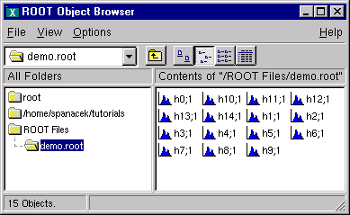
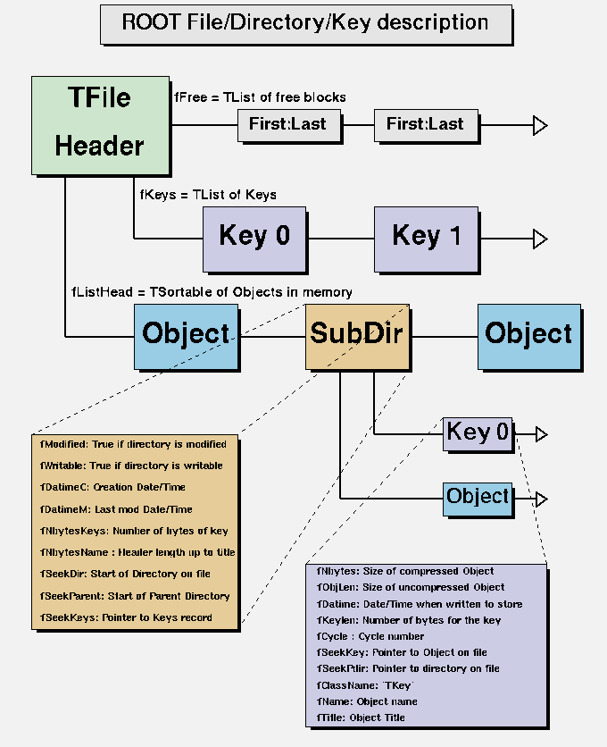
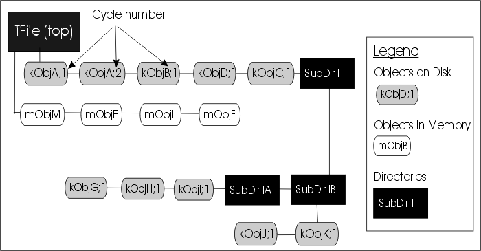
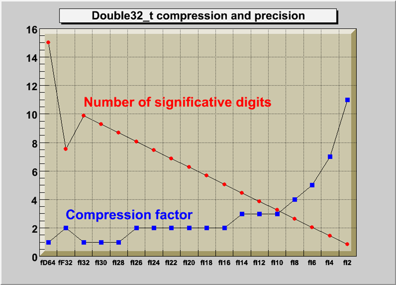
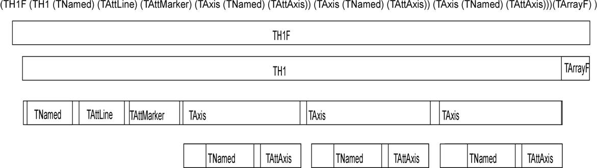
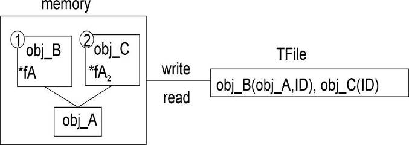
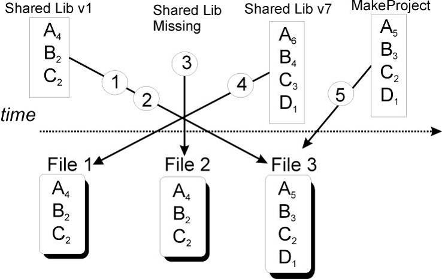
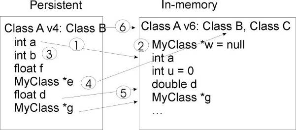

# Input/Output
\index{I/O}

This chapter covers the saving and reading of objects to and from ROOT
files. It begins with an explanation of the physical layout of a ROOT
file. It includes a discussion on compression, and file recovery. Then
we explain the logical file, the class **`TFile`** and its methods. We
show how to navigate in a file, how to save objects and read them back.
We also include a discussion on `Streamers`. `Streamers` are the methods
responsible to capture an objects current state to save it to disk or
send it over the network. At the end of the chapter is a discussion on
the two specialized ROOT files: **`TNetFile`** and **`TWebFile`**.

## The Physical Layout of ROOT Files


A ROOT file is like a UNIX file directory. It can contain directories
and objects organized in unlimited number of levels. It also is stored
in machine independent format (ASCII, IEEE floating point, Big Endian
byte ordering). To look at the physical layout of a ROOT file, we first
create one. This example creates a ROOT file and 15 histograms, fills
each histogram with 1000 entries from a Gaussian distribution, and
writes them to the file.

``` {.cpp}
{
   char name[10], title[20];
   TObjArray Hlist(0);      // create an array of Histograms
   TH1F* h;                 // create a pointer to a histogram
   // make and fill 15 histograms and add them to the object array
   for (Int_t i = 0; i < 15; i++) {
      sprintf(name,"h%d",i);
      sprintf(title,"histo nr:%d",i);
      h = new TH1F(name,title,100,-4,4);
      Hlist.Add(h);
      h->FillRandom("gaus",1000);
   }
   // open a file and write the array to the file
   TFile f("demo.root","recreate");
   Hlist.Write();
   f.Close();
}
```

The example begins with a call to the **`TFile`** constructor. This
class is describing the ROOT file (that has the extension "`.root`"). In
the next section, we will cover **`TFile`** in details. The last line of
the example closes the file. To view its contents we need to open it
again, and to create a **`TBrowser`** object by:

``` {.cpp}
root[] TFile f("demo.root")
root[] TBrowser browser;
```



You can check if the file is correctly opened by:

``` {.cpp}
   TFile f("demo.root");
   if (f.IsZombie()) {
      cout << "Error opening file" << endl;
      exit(-1);
   } else {
      ...
   }
```

Once we have the `TFile` object, we can call the
**`TFile::Map()`** method to view the physical layout. The output prints
the date/time, the start record address, the number of bytes in the
record, the class name of the record and the compression factor.

``` {.cpp}
root[] f.Map()
20051208/124502  At:100    N=114       TFile
20051208/124502  At:214    N=413       TH1F           CX =  2.35
20051208/124502  At:627    N=410       TH1F           CX =  2.36
20051208/124502  At:1037   N=396       TH1F           CX =  2.45
20051208/124502  At:1433   N=400       TH1F           CX =  2.42
20051208/124502  At:1833   N=402       TH1F           CX =  2.41
20051208/124502  At:2235   N=416       TH1F           CX =  2.33
20051208/124502  At:2651   N=406       TH1F           CX =  2.39
20051208/124502  At:3057   N=403       TH1F           CX =  2.40
20051208/124502  At:3460   N=411       TH1F           CX =  2.36
20051208/124502  At:3871   N=400       TH1F           CX =  2.42
20051208/124502  At:4271   N=409       TH1F           CX =  2.38
20051208/124502  At:4680   N=409       TH1F           CX =  2.38
20051208/124502  At:5089   N=420       TH1F           CX =  2.32
20051208/124502  At:5509   N=406       TH1F           CX =  2.40
20051208/124502  At:5915   N=405       TH1F           CX =  2.40
20051208/124503  At:6320   N=3052      StreamerInfo   CX =  3.16
20051208/124503  At:9372   N=732       KeysList
20051208/124503  At:10104  N=53        FreeSegments
20051208/124503  At:10157  N=1         END
```

Here we see the fifteen histograms (**`TH1F`**'s) with the first one
starting at byte 148. We also see an entry **`TFile`**. You may notice
that the first entry starts at byte 100. The first 100 bytes are taken
by the file header.

### The File Header


This table shows the file header information. When fVersion is greater
than 1000000, the file is a large file (\> 2 GB) and the offsets will be
8 bytes long. The location in brackets are the location in the case of a
large file.

+-------------------+------------------+---------------------------------------+
| Byte              | Value Name       | Description                           |
+-------------------+------------------+---------------------------------------+
| 1 `->` 4          | "`root`"         | Root file identifier                  |
+-------------------+------------------+---------------------------------------+
| 5 `->` 8          | `fVersion`       | File format version                   |
+-------------------+------------------+---------------------------------------+
| 9 `->` 12         | `fBEGIN`         | Pointer to first data record          |
+-------------------+------------------+---------------------------------------+
| 13 `->` 16        | `fEND`           | Pointer to first free word at the EOF |
| [13-\>20]         |                  |                                       |
+-------------------+------------------+---------------------------------------+
| 17 `->` 20        | `fSeekFree`      | Pointer to FREE data record           |
| [21-\>28]         |                  |                                       |
+-------------------+------------------+---------------------------------------+
| 21 `->` 24        | `fNbytesFree`    | Number of bytes in FREE data record   |
| [29-\>32]         |                  |                                       |
+-------------------+------------------+---------------------------------------+
| 25 `->` 28        | `nfree`          | Number of free data records           |
| [33-\>36]         |                  |                                       |
+-------------------+------------------+---------------------------------------+
| 29 `->` 32        | `fNbytesName`    | Number of bytes in **`TNamed`** at    |
| [37-\>40]         |                  | creation time                         |
+-------------------+------------------+---------------------------------------+
| 33 `->` 33        | `fUnits`         | Number of bytes for file pointers     |
| [41-\>41]         |                  |                                       |
+-------------------+------------------+---------------------------------------+
| 34 `->` 37        | `fCompress`      | Zip compression level                 |
| [42-\>45]         |                  |                                       |
+-------------------+------------------+---------------------------------------+
| 34 `->` 37        | `fSeekInfo`      | Pointer to **`TStreamerInfo`** record |
| [46-\>53]         |                  |                                       |
+-------------------+------------------+---------------------------------------+
| 34 `->` 37        | `fNBytesInfo`    | Number of bytes in                    |
| [54-\>57]         |                  | **`TStreamerInfo`** record            |
+-------------------+------------------+---------------------------------------+
| 34 `->` 37        | `fCompress`      | Universal Unique ID                   |
| [58-\>75]         |                  |                                       |
+-------------------+------------------+---------------------------------------+

The first four bytes of the file header contain the string "root" which
identifies a file as a ROOT file. Because of this identifier, ROOT is
not dependent on the "`.root`" extension. It is still a good idea to use
the extension, just for us to recognize them easier. The `nfree` and
value is the number of free records. This variable along with
`FNBytesFree` keeps track of the free space in terms of records and
bytes. This count also includes the deleted records, which are available
again.

### The Top Directory Description


The 84 bytes after the file header contain the top directory
description, including the name, the date and time it was created, and
the date and time of the last modification.

``` {.cpp}
20010404/092347  At:64        N=84        TFile
```

### The Histogram Records


What follows are the 15 histograms, in records of variable length.

``` {.cpp}
20010404/092347  At:148       N=380       TH1F           CX =  2.49
20010404/092347  At:528       N=377       TH1F           CX =  2.51
```

The first 4 bytes of each record is an integer holding the number of
bytes in this record. A negative number flags the record as deleted, and
makes the space available for recycling in the next writing. The rest of
bytes in the header contain all the information to identify uniquely a
data block on the file. It is followed by the object data.

The next table explains the values in each individual record. If the key
is located past the 32 bit file limit (\> 2 GB) then some fields will be
8 bytes instead of 4 bytes (values between the brackets):

+--------------------+-------------------+--------------------------------------+
| Byte               | Value Name        | Description                          |
+--------------------+-------------------+--------------------------------------+
| 1 `->` 4           | `Nbytes`          | Length of compressed object (in      |
|                    |                   | bytes)                               |
+--------------------+-------------------+--------------------------------------+
| 5 `->` 6           | `Version`         | **`TKey`** version identifier        |
+--------------------+-------------------+--------------------------------------+
| 7 `->` 10          | `ObjLen`          | Length of uncompressed object        |
+--------------------+-------------------+--------------------------------------+
| 11 `->` 14         | `Datime`          | Date and time when object was        |
|                    |                   | written to file                      |
+--------------------+-------------------+--------------------------------------+
| 15 `->` 16         | `KeyLen`          | Length of the key structure (in      |
|                    |                   | bytes)                               |
+--------------------+-------------------+--------------------------------------+
| 17 `->` 18         | `Cycle`           | Cycle of key                         |
+--------------------+-------------------+--------------------------------------+
| 19 `->` 22         | `SeekKey`         | Pointer to record itself             |
| [19-\>26]          |                   | (consistency check)                  |
+--------------------+-------------------+--------------------------------------+
| 23 `->` 26         | `SeekPdir`        | Pointer to directory header          |
| [27-\>34]          |                   |                                      |
+--------------------+-------------------+--------------------------------------+
| 27 `->` 27         | `lname`           | Number of bytes in the class name    |
| [35-\>35]          |                   |                                      |
+--------------------+-------------------+--------------------------------------+
| 28 `->` ... [36-\>...] | `ClassName`       | Object Class Name                    |
+--------------------+-------------------+--------------------------------------+
| ... `->` ...           | `lname`           | Number of bytes in the object name   |
+--------------------+-------------------+--------------------------------------+
| ... `->` ...           | `Name`            | `lName` bytes with the name of the   |
|                    |                   | object                               |
+--------------------+-------------------+--------------------------------------+
| ... `->` ...           | `lTitle`          | Number of bytes in the object title  |
+--------------------+-------------------+--------------------------------------+
| ... `->` ...           | `Title`           | Title of the object                  |
+--------------------+-------------------+--------------------------------------+
| ... `->` ...           | `DATA`            | Data bytes associated to the object  |
+--------------------+-------------------+--------------------------------------+

You see a reference to **`TKey`**. It is explained in detail in the next
section.

### The Class Description List (StreamerInfo List)


The histogram records are followed by the `StreamerInfo` list of class
descriptions. The list contains the description of each class that has
been written to file.

``` {.cpp}
20010404/092347  At:5854   N=2390   StreamerInfo   CX =  3.41
```

The class description is recursive, because to fully describe a class,
its ancestors and object data members have to be described also. In
`demo.root`, the class description list contains the description for:

-   **`TH1F`**

-   all classes in the **`TH1F`** inheritance tree

-   all classes of the object data members

-   all classes in the object data members' inheritance tree.

This description is implemented by the **`TStreamerInfo`** class`,` and
is often referred to as simply `StreamerInfo`. You can print a file's
`StreamerInfo`list with the `TFile::ShowStreamerInfo` method. Below is
an example of the output. Only the first line of each class description
is shown. The `demo.root` example contains only **`TH1F`** objects. Here
we see the recursive nature of the class description; it contains the
`StreamerInfo`of all the classes needed to describe **`TH1F`**.

``` {.cpp}
root[] f.ShowStreamerInfo()
StreamerInfo for class: TH1F, version=1
  BASE     TH1         offset=0 type= 0 1-Dim histogram base class
  BASE     TArrayF     offset=0 type= 0 Array of floats

StreamerInfo for class: TH1, version=3
  BASE     TNamed      offset=0 type=67 The basis for named object(name,title)
  BASE     TAttLine    offset=0 type=0  Line attributes
  BASE     TAttFill    offset=0 type=0  Fill area attributes
  BASE     TAttMarker  offset=0 type=0  Marker attributes
  Int_t    fNcells     offset=0 type=3  number bins(1D),cells(2D)+U/Overflows
  TAxis    fXaxis      offset=0 type=61 X axis descriptor
  TAxis    fYaxis      offset=0 type=61 Y axis descriptor
  TAxis    fZaxis      offset=0 type=61 Z axis descriptor
  Short_t  fBarOffset  offset=0 type=2  (1000*offset) for barcharts or legos
  Short_t  fBarWidth   offset=0 type=2  (1000*width) for bar charts or legos
  Stat_t   fEntries    offset=0 type=8  Number of entries//continued...
  Stat_t   fTsumw      offset=0 type=8  Total Sum of weights
  Stat_t   fTsumw2     offset=0 type=8  Total Sum of squares of weights
  Stat_t   fTsumwx     offset=0 type=8  Total Sum of weight*X
  Stat_t   fTsumwx2    offset=0 type=8  Total Sum of weight*X*X
  Double_t fMaximum    offset=0 type=8  Maximum value for plotting
  Double_t fMinimum    offset=0 type=8  Minimum value for plotting
  Double_t fNormFactor offset=0 type=8  Normalization factor
  TArrayD  fContour    offset=0 type=62 Array to display contour levels
  TArrayD  fSumw2      offset=0 type=62 Array of sum of squares of weights
  TString  fOption     offset=0 type=65 histogram options
  TList*   fFunctions  offset=0 type=63 ->Pointer to list of functions(fits,user)

StreamerInfo for class: TNamed, version=1
...
StreamerInfo for class: TAttLine, version=1
...
StreamerInfo for class: TAttFill, version=1
...
StreamerInfo for class: TAttMarker, version=1
...
StreamerInfo for class: TArrayF, version=1
...
StreamerInfo for class: TArray, version=1
...
StreamerInfo for class: TAxis, version=6
...
StreamerInfo for class: TAttAxis, version=4
...
```

ROOT allows a class to have multiple versions, and each version has its
own description in form of a `StreamerInfo`. Above you see the class
name and version number. The `StreamerInfo`list has only one description
for each class/version combination it encountered. The file can have
multiple versions of the same class, for example objects of old and new
versions of a class can be in the same file. The `StreamerInfo`is
described in detail in the section on Streamers.

### The List of Keys and the List of Free Blocks


The last three entries on the output of `TFile::Map()` are the list of
keys, the list of free segments, and the address where the data ends..
When a file is closed, it writes a linked list of keys at the end of the
file. This is what we see in the third to the last entry. In our
example, the list of keys is stored in 732 bytes beginning at byte\#
8244.

``` {.cpp}
20010404/092347    At:8244      N=732       KeysList
20010404/092347    At:8976      N=53        FreeSegments
20010404/092347    At:9029      N=1         END
```

The second to last entry is a list of free segments. In our case, this
starts 8976 and is not very long, only 53 bytes, since we have not
deleted any objects. The last entry is the address of the last byte in
the file.

### File Recovery


A file may become corrupted or it may be impossible to write it to disk
and close it properly. For example if the file is too large and exceeds
the disk quota, or the job crashes or a batch job reaches its time limit
before the file can be closed. In these cases, it is imperative to
recover and retain as much information as possible. ROOT provides an
intelligent and elegant file recovery mechanism using the redundant
directory information in the record header.

If a file that has been not properly closed is opened again, it is
scanned and rebuilt according to the information in the record header.
The recovery algorithm reads the file and creates the saved objects in
memory according to the header information. It then rebuilds the
directory and file structure. If the file is opened in write mode, the
recovery makes the correction on disk when the file is closed; however
if the file is opened in read mode, the correction can not be written to
disk. You can also explicitly invoke the recovery procedure by calling
the `TFile::Recover()` method. You can recover the directory structure,
but you cannot save what you recovered to the file on disk. In the
following example, we interrupted and aborted the previous ROOT session,
causing the file not to be closed. When we start a new session and
attempt to open the file, it gives us an explanation and status on the
recovery attempt.

``` {.cpp}
root[] TFile f("demo.root")
Warning in <TFile::TFile>: file demo.root probably not closed, trying to recover successfully recovered 15 keys
```

## The Logical ROOT File: TFile and TKey


We saw that the `TFile::Map()` method reads the file sequentially and
prints information about each record while scanning the file. It is not
feasible to support only sequential access and hence ROOT provides
random or direct access, i.e. reading a specified object at a time. To
do so, `TFile` keeps a list of **`TKeys`**, which is
essentially an index to the objects in the file. The **`TKey`** class
describes the record headers of objects in the file. For example, we can
get the list of keys and print them. To find a specific object on the
file we can use the **`TFile::Get()` method.**

``` {.cpp}
root[] TFile f("demo.root")
root[] f.GetListOfKeys()->Print()
TKey Name = h0, Title = histo nr:0, Cycle = 1
TKey Name = h1, Title = histo nr:1, Cycle = 1
TKey Name = h2, Title = histo nr:2, Cycle = 1
TKey Name = h3, Title = histo nr:3, Cycle = 1
TKey Name = h4, Title = histo nr:4, Cycle = 1
TKey Name = h5, Title = histo nr:5, Cycle = 1
TKey Name = h6, Title = histo nr:6, Cycle = 1
TKey Name = h7, Title = histo nr:7, Cycle = 1
TKey Name = h8, Title = histo nr:8, Cycle = 1
TKey Name = h9, Title = histo nr:9, Cycle = 1
TKey Name = h10, Title = histo nr:10, Cycle = 1
TKey Name = h11, Title = histo nr:11, Cycle = 1
TKey Name = h12, Title = histo nr:12, Cycle = 1
TKey Name = h13, Title = histo nr:13, Cycle = 1
TKey Name = h14, Title = histo nr:14, Cycle = 1
root[] TH1F *h9 = (TH1F*)f.Get("h9");
```

The `TFile::Get()` finds the **`TKey`** object with name "`h9`". Using
the **`TKey`** info it will import in memory the object in the file at
the file address \#3352 (see the output from the `TFile::Map` above).
This is done by the `Streamer` method that is covered in detail in a
later section. Since the keys are available in a **`TList`** of
**`TKeys` we can iterate over the list of keys:**

``` {.cpp}
{
   TFile f("demo.root");
   TIter next(f.GetListOfKeys());
   TKey *key;
   while ((key=(TKey*)next())) {
      printf("key: %s points to an object of class: %s at %dn",
      key->GetName(),
      key->GetClassName(),key->GetSeekKey());
   }
}
```

The output of this script is:

``` {.cpp}
root[] .x iterate.C
key: h0 points to an object of class: TH1F at 150
key: h1 points to an object of class: TH1F at 503
key: h2 points to an object of class: TH1F at 854
key: h3 points to an object of class: TH1F at 1194
key: h4 points to an object of class: TH1F at 1539
key: h5 points to an object of class: TH1F at 1882
key: h6 points to an object of class: TH1F at 2240
key: h7 points to an object of class: TH1F at 2582
key: h8 points to an object of class: TH1F at 2937
key: h9 points to an object of class: TH1F at 3293
key: h10 points to an object of class: TH1F at 3639
key: h11 points to an object of class: TH1F at 3986
key: h12 points to an object of class: TH1F at 4339
key: h13 points to an object of class: TH1F at 4694
key: h14 points to an object of class: TH1F at 5038
```

In addition to the list of keys, **`TFile`** also keeps two other lists:
**`TFile`**`::fFree` is a **`TList`** of free blocks used to recycle
freed up space in the file. ROOT tries to find the best free block. If a
free block matches the size of the new object to be stored, the object
is written in the free block and this free block is deleted from the
list. If not, the first free block bigger than the object is used.
`TFile::fListHead` contains a sorted list (**`TSortedList`**) of objects
in memory. The diagram below illustrates the logical view of the
**`TFile`** and **`TKey`**.



### Viewing the Logical File Contents


**`TFile`** is a descendent of **`TDirectory`**, which means it behaves
like a **`TDirectory`**. We can list the contents, print the name, and
create subdirectories. In a ROOT session, you are always in a directory
and the directory you are in is called the current directory and is
stored in the global variable ***`gDirectory`***. Let us look at a more
detailed example of a ROOT file and its role as the current directory.
First, we create a ROOT file by executing a sample script.

``` {.cpp}
root[] .x $ROOTSYS/tutorials/hsimple.C
```

Now you should have `hsimple.root` in your directory. The file was
closed by the script so we have to open it again to work with it. We
open the file with the intent to update it, and list its contents.

``` {.cpp}
root[] TFile f ("hsimple.root","UPDATE")
root[] f.ls()
TFile** hsimple.root
TFile* hsimple.root
KEY: TH1F hpx;1 This is the px distribution
KEY: TH2F hpxpy;1 py vs px
KEY: TProfile hprof;1 Profile of pz versus px
KEY: TNtuple ntuple;1 Demo ntuple
```

It shows the two lines starting with **`TFile`** followed by four lines
starting with the word "`KEY`". The four keys tell us that there are
four objects on disk in this file. The syntax of the listing is:

``` {.cpp}
KEY: <class> <variable>;<cycle number> <title>
```

For example, the first line in the list means there is an object in the
file on disk, called `hpx`. It is of the class **`TH1F`**
(one-dimensional histogram of floating numbers). The object's title is
"This is the `px` distribution". If the line starts with `OBJ`, the
object is in memory. The \<class\> is the name of the ROOT class
(T-something). The \<variable\> is the name of the object. The cycle
number along with the variable name uniquely identifies the object. The
\<title\> is the string given in the constructor of the object as title.



The figure shows a **`TFile`** with five objects in the top directory
`(kObjA;1, kObjA;2, kObjB;1, kObjC;1` and `kObjD;1)`. `ObjA` is on file
twice with two different cycle numbers. It also shows four objects in
memory (`mObjE`, `mObjeF`, `mObjM`, `mObjL`). It also shows several
subdirectories.

### The Current Directory


When you create a **`TFile`** object, it becomes the current directory.
Therefore, the last file to be opened is always the current directory.
To check your current directory you can type:

``` {.cpp}
root[] gDirectory->pwd()
Rint:/
```

This means that the current directory is the ROOT session (`Rint`). When
you create a file, and repeat the command the file becomes the current
directory.

``` {.cpp}
root[] TFile f1("AFile1.root");
root[] gDirectory->pwd()
AFile1.root:/
```

If you create two files, the last becomes the current directory.

``` {.cpp}
root[] TFile f2("AFile2.root");
root[] gDirectory->pwd()
AFile2.root:/
```

To switch back to the first file, or to switch to any file in general,
you can use the `TDirectory::cd` method. The next command changes the
current directory back to the first file.

``` {.cpp}
root[] f1.cd();
root[] gDirectory->pwd()
AFile1.root:/
```

Note that even if you open the file in "READ" mode, it still becomes the
current directory. Cling also offers a shortcut for `gDirectory->pwd()`
and `gDirectory->ls()`, you can type:

``` {.cpp}
root[] .pwd
AFile1.root:/
root[] .ls
TFile**        AFile1.root
TFile*         AFile1.root
```

To return to the home directory where we were before:

``` {.cpp}
root[] gROOT->cd()
(unsigned char)1
root[] gROOT->pwd()
Rint:/
```

### Objects in Memory and Objects on Disk


The `TFile::ls()` method has an option to list the objects on disk
("`-d`") or the objects in memory ("`-m`"). If no option is given it
lists both, first the objects in memory, then the objects on disk. For
example:

``` {.cpp}
root[] TFile *f = new TFile("hsimple.root");
root[] gDirectory->ls("-m")
TFile**         hsimple.root
TFile*         hsimple.root
```

Remember that ***`gDirectory`*** is the current directory and at this
time is equivalent to "`f`". This correctly states that no objects are
in memory.

The next command lists the objects on disk in the current directory.

``` {.cpp}
root[] gDirectory->ls("-d")
TFile**         hsimple.root
TFile*         hsimple.root
KEY: TH1F     hpx;1    This is the px distribution
KEY: TH2F     hpxpy;1  py vs px
KEY: TProfile hprof;1  Profile of pz versus px
KEY: TNtuple  ntuple;1 Demo ntuple
```

To bring an object from disk into memory, we have to use it or "Get" it
explicitly. When we use the object, ROOT gets it for us. Any reference
to `hprof` will read it from the file. For example drawing `hprof` will
read it from the file and create an object in memory. Here we draw the
profile histogram, and then we list the contents.

``` {.cpp}
root[] hprof->Draw()
<TCanvas::MakeDefCanvas>: created default TCanvas with name c1
root[] f->ls()
TFile** hsimple.root
TFile* hsimple.root
OBJ: TProfile hprof Profile of pz versus px : 0
KEY: TH1F hpx;1 This is the px distribution
KEY: TH2F hpxpy;1 py vs px
KEY: TProfile hprof;1 Profile of pz versus px
KEY: TNtuple ntuple;1 Demo ntuple
```

We now see a new line that starts with OBJ. This means that an object of
class **`TProfile`**, called `hprof` has been added in memory to this
directory. This new `hprof` in memory is independent from the `hprof` on
disk. If we make changes to the `hprof` in memory, they are not
propagated to the `hprof` on disk. A new version of `hprof` will be
saved once we call `Write`.

You may wonder why `hprof` is added to the objects in the current
directory. `hprof` is of the class **`TProfile`** that inherits from
**`TH1D`**, which inherits from **`TH1`**. **`TH1`** is the basic
histogram. All histograms and trees are created in the current directory
(also see "Histograms and the Current Directory"). The reference to "all
histograms" includes objects of any class descending directly or
indirectly from **`TH1`**. Hence, our **`TProfile`** `hprof` is created
in the current directory `f.`There was another side effect when we
called the `TH1::Draw` method. ROOT printed this statement:

``` {.cpp}
<TCanvas::MakeDefCanvas>: created default TCanvas with name c1
```

It tells us that a **`TCanvas`** was created and it named it `c1`. This
is where ROOT is being nice, and it creates a canvas for drawing the
histogram if no canvas was named in the draw command, and if no active
canvas exists. The newly created canvas, however, is NOT listed in the
contents of the current directory. Why is that? The canvas is not added
to the current directory, because by default ONLY histograms and trees
are added to the object list of the current directory. Actually,
**`TEventList`** objects are also added to the current directory, but at
this time, we don't have to worry about those. If the canvas is not in
the current directory then where is it? Because it is a canvas, it was
added to the list of canvases.

This list can be obtained by the command
`gROOT->GetListOfCanvases()->ls()`. The `ls()` will print the contents
of the list. In our list, we have one canvas called `c1`. It has a
**`TFrame`**, a **`TProfile`**, and a **`TPaveStats`**.

``` {.cpp}
root[] gROOT->GetListOfCanvases()->ls()
Canvas Name=c1 Title=c1
Option=TCanvas fXlowNDC=0 fYlowNDC=0 fWNDC=1 fHNDC=1
Name= c1 Title= c1
Option=TFrame  X1= -4.000000 Y1=0.000000 X2=4.000000 Y2=19.384882
OBJ: TProfile hprof   Profile of pz versus px : 0
TPaveText  X1=-4.900000 Y1=20.475282 X2=-0.950000 Y2=21.686837 title
TPaveStats X1=2.800000  Y1=17.446395 X2=4.800000  Y2=21.323371 stats
```

Lets proceed with our example and draw one more histogram, and we see
one more OBJ entry.

``` {.cpp}
root[] hpx->Draw()
root[] f->ls()
TFile**         hsimple.root
TFile*         hsimple.root
OBJ: TProfile hprof    Profile of pz versus px : 0
OBJ: TH1F     hpx      This is the px distribution : 0
KEY: TH1F     hpx;1    This is the px distribution
KEY: TH2F     hpxpy;1  py vs px
KEY: TProfile hprof;1  Profile of pz versus px
KEY: TNtuple  ntuple;1 Demo ntuple
```

`TFile::ls()` loops over the list of objects in memory and the list of
objects on disk. In both cases, it calls the `ls()` method of each
object. The implementation of the `ls` method is specific to the class
of the object, all of these objects are descendants of **`TObject`** and
inherit the **`TObject`**`::ls()` implementation. The histogram classes
are descendants of **`TNamed`** that in turn is a descent of
`TObject`. In this case, **`TNamed::ls()`** is executed, and
it prints the name of the class, and the name and title of the object.
Each directory keeps a list of its objects in the memory. You can get
this list by **`TDirectory::GetList()`**. To see the lists in memory
contents you can do:

``` {.cpp}
root[]f->GetList()->ls()
OBJ: TProfile   hprof   Profile of pz versus px : 0
OBJ: TH1F       hpx     This is the px distribution : 0
```

Since the file `f` is the current directory (***`gDirectory`***), this
will yield the same result:

``` {.cpp}
root[] gDirectory->GetList()->ls()
OBJ: TProfile   hprof   Profile of pz versus px : 0
OBJ: TH1F       hpx     This is the px distribution : 0
```

### Saving Histograms to Disk


At this time, the objects in memory (OBJ) are identical to the objects
on disk (KEY). Let's change that by adding a fill to the `hpx` we have
in memory.

``` {.cpp}
root[] hpx->Fill(0)
```

Now the `hpx` in memory is different from the histogram (`hpx`) on disk.
Only one version of the object can be in memory, however, on disk we can
store multiple versions of the object. The `TFile::Write` method will
write the list of objects in the current directory to disk. It will add
a new version of `hpx` and `hprof`.

``` {.cpp}
root[] f->Write()
root[] f->ls()
TFile**         hsimple.root
TFile*         hsimple.root
OBJ: TProfile hprof  Profile of pz versus px : 0
OBJ: TH1F     hpx    This is the px distribution : 0
KEY: TH1F     hpx;2  This is the px distribution
KEY: TH1F     hpx;1  This is the px distribution
KEY: TH2F     hpxpy;1 py vs px
KEY: TProfile hprof;2 Profile of pz versus px
KEY: TProfile hprof;1 Profile of pz versus px
KEY: TNtuple  ntuple;1        Demo ntuple
```


The `TFile::Write` method wrote the entire list of objects in the
current directory to the file. You see that it added two new keys:
`hpx;2` and `hprof;2` to the file. Unlike memory, a file is capable of
storing multiple objects with the same name. Their cycle number, the
number after the semicolon, differentiates objects on disk with the same
name. If you wanted to save only `hpx` to the file, but not the entire
list of objects, you could use the `TH1::Write `method of `hpx`:

``` {.cpp}
root[] hpx->Write()
```

A call to `obj->Write` without any parameters will call `obj->GetName()`
to find the name of the object and use it to create a key with the same
name. You can specify a new name by giving it as a parameter to the
`Write` method.

``` {.cpp}
root[] hpx->Write("newName")
```

If you want to re-write the same object, with the same key, use the
overwrite option.

``` {.cpp}
root[] hpx->Write("",TObject::kOverwrite)
```

If you give a new name and use the `kOverwrite`, the object on disk with
the matching name is overwritten if such an object exists. If not, a new
object with the new name will be created.

``` {.cpp}
root[] hpx->Write("newName",TObject::kOverwrite)
```

The `Write` method did not affect the objects in memory at all. However,
if the file is closed, the directory is emptied and the objects on the
list are deleted.

``` {.cpp}
root[] f->Close()
root[] f->ls()
TFile**     hsimple.root
TFile*      hsimple.root
```

In the code snipped above, you can see that the directory is now empty.
If you followed along so far, you can see that `c1` which was displaying
`hpx` is now blank. Furthermore, `hpx` no longer exists.

``` {.cpp}
root[] hpx->Draw()
Error: No symbol hpx in current scope
```

This is important to remember, do not close the file until you are done
with the objects or any attempt to reference the objects will fail.

### Histograms and the Current Directory


When a histogram is created, it is added by default to the list of
objects in the current directory. You can get the list of histograms in
a directory and retrieve a pointer to a specific histogram.

``` {.cpp}
   TH1F *h = (TH1F*)gDirectory->Get("myHist"); // or
   TH1F *h = (TH1F*)gDirectory->GetList()->FindObject("myHist");
```

The method `TDirectory::GetList()` returns a **`TList`** of objects in
the directory. You can change the directory of a histogram with the
`SetDirectory` method.

``` {.cpp}
   h->SetDirectory(newDir);
```

If the parameter is 0, the histogram is no longer associated with a
directory.

``` {.cpp}
   h->SetDirectory(0);
```

Once a histogram is removed from the directory, it will no longer be
deleted when the directory is closed. It is now your responsibility to
delete this histogram object once you are finished with it. To change
the default that automatically adds the histogram to the current
directory, you can call the static function:

``` {.cpp}
   TH1::AddDirectory(kFALSE);
```

In this case, you will need to do all the bookkeeping for all the
created histograms.

### Saving Objects to Disk


In addition to histograms and trees, you can save any object in a ROOT
file. For example to save a canvas to the ROOT file you can use either
**`TObject::Write()` or `TDirectory`**`::WriteTObject()`. The example:

``` {.cpp}
root[] c1->Write()
```

This is equivalent to:

``` {.cpp}
root[] f->WriteTObject(c1)
```

For objects that do not inherit from **`TObject`** use:

``` {.cpp}
root[] f->WriteObject(ptr,"nameofobject")
```

***`Another example:`***

``` {.cpp}
root[] TFile *f = new TFile("hsimple.root","UPDATE")
root[] hpx->Draw()
<TCanvas::MakeDefCanvas>: created default TCanvas with name c1
root[] c1->Write()
root[] f->ls()
TFile**        hsimple.root
TFile*         hsimple.root
OBJ: TH1F      hpx      This is the px distribution : 0
KEY: TH1F     hpx;2   This is the px distribution
KEY: TH1F     hpx;1   This is the px distribution
KEY: TH2F     hpxpy;1 py vs px
KEY: TProfile hprof;2 Profile of pz versus px
KEY: TProfile hprof;1 Profile of pz versus px
KEY: TNtuple  ntuple;1   Demo ntuple
KEY: TCanvas  c1;1    c1
```

### Saving Collections to Disk


All collection classes inherit from **`TCollection`** and hence inherit
the **`TCollection::Write()` method. When you call
`TCollection`**`::Write()` each object in the container is written
individually into its own key in the file. To write all objects into one
key you can specify the name of the key and use the
option` TObject::kSingleKey`. For example:

``` {.cpp}
root[] TList * list = new TList;
root[] TNamed * n1, * n2;
root[] n1 = new TNamed("name1","title1");
root[] n2 = new TNamed("name2","title2");
root[] list->Add(n1);
root[] list->Add(n2);
root[] gFile->WriteObject(list,"list",TObject::kSingleKey);
```

### A TFile Object Going Out of Scope


There is another important point to remember about `TFile::Close` and
**`TFile::Write`**. When a variable is declared on the stack in a function
such as in the code below, it will be deleted when it goes out of
scope.

``` {.cpp}
void foo() {
   TFile f("AFile.root","RECREATE");
}
```

As soon as the function `foo `has finished executing, the variable `f`
is deleted. When a **`TFile`** object is deleted an implicit call to
`TFile::Close` is made. This will save only the file descriptor to disk.
It contains the file header, the `StreamerInfo `list, the key list, the
free segment list, and the end address. See "The Physical Layout of ROOT
Files". The `TFile::Close` does not make a call to `Write()`, which
means that the objects in memory will not be saved in the file. You need
to explicitly call `TFile::Write()` to save the object in memory to file
before the exit of the function.

``` {.cpp}
void foo() {
   TFile f("AFile.root","RECREATE");
   ... stuff ...
   f.Write();
}
```

To prevent an object in a function from being deleted when it goes out
of scope, you can create it on the heap instead of on the stack. This
will create a **`TFile`** object `f`, that is available on a global
scope, and it will still be available when exiting the function.

``` {.cpp}
void foo() {
   TFile *f = new TFile("AFile.root","RECREATE");
}
```

### Retrieving Objects from Disk


If you have a ROOT session running, please quit and start fresh.

We saw that multiple versions of an object with the same name could be
in a ROOT file. In our example, we saved a modified histogram `hpx` to
the file, which resulted in two `hpx's` uniquely identified by the cycle
number: `hpx;1` and `hpx;2`. The question is how we can retrieve the
right version of `hpx`. When opening the file and using `hpx`, Cling
retrieves the one with the highest cycle number. To read the `hpx;1`
into memory, rather than the `hpx:2` we would get by default, we have to
explicitly get it and assign it to a variable.

``` {.cpp}
root[] TFile *f1 = new TFile("hsimple.root")
root[] TH1F *hpx1; f1->GetObject("hpx;1",hpx)
root[] hpx1->Draw()
```

### Subdirectories and Navigation


The **`TDirectory`** class lets you organize its contents into
subdirectories, and **`TFile`** being a descendent of **`TDirectory`**
inherits this ability. Here is an example of a ROOT file with multiple
subdirectories as seen in the ROOT browser. To add a subdirectory to a
file use `TDirectory::mkdir`. The example below opens the file for
writing and creates a subdirectory called "Wed011003". Listing the
contents of the file shows the new directory in the file and the
**`TDirectory`** object in memory.

``` {.cpp}
root[] TFile *f = new TFile("AFile.root","RECREATE")
root[] f->mkdir("Wed011003")
(class TDirectory*)0x1072b5c8
```

``` {.cpp}
root[] f->ls()
TFile**         AFile.root
TFile*          AFile.root
TDirectory*           Wed011003       Wed011003
KEY: TDirectory       Wed011003;1     Wed011003
```

We can change the current directory by navigating into the subdirectory,
and after changing directory; we can see that ***`gDirectory`*** is now
"`Wed011003`".

``` {.cpp}
root[] f->cd("Wed011003")
root[] gDirectory->pwd()
AFile.root:/Wed011003
```

In addition to ***`gDirectory`*** we have ***`gFile`***, another global
that points to the current file. In our example, ***`gDirectory`***
points to the subdirectory, and ***`gFile`*** points to the file (i.e.
the files' top directory).

``` {.cpp}
root[] gFile->pwd()
AFile.root:/
```

Use `cd()` without any arguments to return to the file's top directory.

``` {.cpp}
root[] f->cd()
AFile.root:/
```

Change to the subdirectory again, and create a histogram. It is added to
the current directory, which is the subdirectory "`Wed011003`".

``` {.cpp}
root[] f->cd("Wed011003")
root[] TH1F *histo = new TH1F("histo","histo",10,0,10)
root[] gDirectory->ls()
TDirectory* Wed011003   Wed011003
OBJ: TH1F      histo   histo : 0
```

If you are in a subdirectory and you want to have a pointer to the file
containing the subdirectory, you can do:

``` {.cpp}
root[] gDirectory->GetFile()
```

If you are in the top directory ***`gDirectory`*** is the same as
***`gFile`***. We write the file to save the histogram on disk, to show
you how to retrieve it later.

``` {.cpp}
root[] f->Write()
root[] gDirectory->ls()
TDirectory*             Wed011003       Wed011003
OBJ: TH1F      histo   histo : 0
KEY: TH1F      histo;1 histo
```

When retrieving an object from a subdirectory, you can navigate to the
subdirectory first or give it the path name relative to the file. The
read object is created in memory in the current directory. In this first
example, we get `histo` from the top directory and the object will be in
the top directory.

``` {.cpp}
root[] TH1 *h; f->GetObject("Wed011003/histo;1",h)
```

If file is written, a copy of `histo` will be in the top directory. This
is an effective way to copy an object from one directory to another. In
contrast, in the code box below, `histo` will be in memory in the
subdirectory because we changed the current directory.

``` {.cpp}
root[] f->cd("Wed011003")
root[] TH1 *h; gDirectory->GetObject("histo;1",h)
```

Note that there is no warning if the retrieving was not successful. You
need to explicitly check the value of h, and if it is null, the object
could not be found. For example, if you did not give the path name the
histogram cannot be found and the pointer to h is null:

``` {.cpp}
root[] TH1 *h; gDirectory->GetObject("Wed011003/histo;1",h)
root[] h
(class TH1*)0x10767de0
root[] TH1 *h; gDirectory->GetObject("histo;1",h)
root[] h
(class TH1*)0x0
```

To remove a subdirectory you need to use `TDirectory::Delete`. There is
no **`TDirectory::rmdir`**. The Delete method takes a string containing
the variable name and cycle number as a parameter.

``` {.cpp}
void Delete(const char *namecycle)
```

The `namecycle` string has the format `name;cycle`. The next are some
rules to remember:

-   `name` = \* means all, but don't remove the subdirectories

-   `cycle` =\* means all cycles (memory and file)

-   `cycle` ="" means apply to a memory object

-   `cycle` = 9999 also means apply to a memory object

-   `namecycle` = "" means the same as `namecycle` ="T\*"

-   `namecycle` = `T*` delete subdirectories

For example to delete a directory from a file, you must specify the
directory cycle:

``` {.cpp}
root[] f->Delete("Wed011003;1")
```

Some other examples of `namecycle` format are:

-   `foo`:delete the object named `foo` from memory

-   `foo;1`: delete the cycle 1 of the object named `foo` from the file

-   `foo;*`: delete all cycles of `foo` from the file and also from
    memory

-   `*;2`: delete all objects with cycle number 2 from the file

-   `*;*:  delete` all objects from memory and from the file

-   `T*;*`: delete all objects from memory and from the file including
    all subdirectories

## Streamers


To follow the discussion on `Streamers`, you need to know what a
*simple* data type is. A variable is of a simple data type if it cannot
be decomposed into other types. Examples of simple data types are longs,
shorts, floats, and chars. In contrast, a variable is of a *composite*
data type if it can be decomposed. For example, classes, structures, and
arrays are composite types. Simple types are also called primitive
types, basic types, and Cling sometimes calls them fundamental types.

When we say, "writing an object to a file", we actually mean writing the
current values of the data members. The most common way to do this is to
decompose (also called the serialization of) the object into its data
members and write them to disk. The decomposition is the job of the
`Streamer`. Every class with ambitions to be stored in a file has a
`Streamer `that decomposes it and "streams" its members into a buffer.

The methods of the class are not written to the file, it contains only
the persistent data members. To decompose the parent classes, the
`Streamer `calls the `Streamer `of the parent classes. It moves up the
inheritance tree until it reaches an ancestor without a parent. To
serialize the object data members it calls their `Streamer`. They in
turn move up their own inheritance tree and so forth. The simple data
members are written to the buffer directly. Eventually the buffer
contains all simple data members of all the classes that make up this
particular object. Data members that are references (as
`MyClass &fObj;`) are never saved, it is always the responsibility of
the object's constructor to set them properly.

### Automatically Generated Streamers


A `Streamer `usually calls other `Streamers`: the `Streamer `of its
parents and data members. This architecture depends on all classes
having `Streamers`, because eventually they will be called. To ensure
that a class has a `Streamer`, `rootcling` automatically creates one in
the `ClassDef` macro that is defined in `$ROOTSYS/include/Rtypes.h`.
`ClassDef` defines several methods for any class, and one of them is the
`Streamer`. The automatically generated `Streamer `is complete and can
be used as long as no customization is needed.

The `Event` class is defined in `$ROOTSYS/test/Event.h`. Looking at the
class definition, we find that it inherits from **`TObject`**. It is a
simple example of a class with diverse data members.

``` {.cpp}
class Event : public TObject {
private:
   TDirectory    *fTransient;            //! current directory
   Float_t     fPt;                   //! transient value
char           fType[20];
Int_t          fNtrack;
Int_t          fNseg;
Int_t          fNvertex;
UInt_t         fFlag;
Float_t        fTemperature;
EventHeader    fEvtHdr;           //|| don't split
TClonesArray  *fTracks;           //->
TH1F          *fH;                //->
Int_t          fMeasures[10];
Float_t        fMatrix[4][4];
Float_t       *fClosestDistance;  //[fNvertex]
...
```

The Event class is added to the dictionary by the `rootcling`
utility. This is the `rootcling` statement in the
`$ROOTSYS/test/Makefile`:

``` {.cpp}
@rootcling -f EventDict.cxx -c Event.h EventLinkDef.h
```

The `EventDict.cxx` file contains the automatically generated
`Streamer `for Event:

``` {.cpp}
void Event::Streamer(TBuffer &R__b){
   // Stream an object of class Event.
   if (R__b.IsReading()) {
      Event::Class()->ReadBuffer(R__b, this);
   } else {
      Event::Class()->WriteBuffer(R__b, this);
   }
}
```

When writing an `Event` object, `TClass::WriteBuffer` is called.
`WriteBuffer` writes the current version number of the `Event class,`
and its contents into the buffer `R__b`. The `Streamer `calls
**`TClass::ReadBuffer`** when reading an `Event` object. The `ReadBuffer`
method reads the information from buffer `R__b` into the `Event`
object.

### Transient Data Members (//!)


To prevent a data member from being written to the file, insert a "`!`"
as the first character after the comment marks. It tells ROOT not to
save that data member in a root file when saving the class. For example,
in this version of Event, the `fPt` and `fTransient` data members are
not persistent.

``` {.cpp}
class Event : public TObject {
private:
   TDirectory    *fTransient; //! current directory
   Float_t fPt;               //! transient value
...
```

### The Pointer to Objects (//-\>)


The string "`->`" in the comment field of the members `*fH` and
`*fTracks` instruct the automatic `Streamer` to assume these will point
to valid objects and the `Streamer `of the objects can be called rather
than the more expensive `R__b << fH`. It is important to note that no
check is done on the validity of the pointer value. In particular if the
pointer points, directly or indirectly, back to the current object, this
will result in an infinite recursion and the abrupt end of the process.

``` {.cpp}
TClonesArray  *fTracks;            //->
TH1F          *fH;                 //->
```

### Variable Length Array


When the `Streamer `comes across a pointer to a simple type, it assumes
it is an array. Somehow, it has to know how many elements are in the
array to reserve enough space in the buffer and write out the
appropriate number of elements. This is done in the class definition.
For example:

``` {.cpp}
class Event : public TObject {
private:
   char           fType[20];
   Int_t          fNtrack;
   Int_t          fNseg;
   Int_t          fNvertex;
...
   Float_t       *fClosestDistance;   //[fNvertex]
```

The array `fClosestDistance` is defined as a pointer of floating point
numbers. A comment mark (//), and the number in square brackets tell the
`Streamer `the length of the array for this object. In general the
syntax is:

``` {.cpp}
<simple type> *<name>//[<length>]
```

The length cannot be an expression. If a variable is used, it needs to
be an integer data member of the class. It must be defined ahead of its
use, or in a base class.

The same notation also applies to variable length array of object and
variable length array of pointer to objects.

``` {.cpp}
MyObject *obj; //[fNojbs]
MyObject **objs; //[fDatas]
```

### Double32\_t


Math operations very often require double precision, but on saving
single usually precision is sufficient. For this purpose we support the
typedef Double32\_t which is stored in memory as a double and on disk as
a float or interger. The actual size of disk (before compression) is
determined by the parameter next to the data member declartion. For
example:

``` {.cpp}
Double32_t m_data;     //[min,max<,nbits>]
```

If the comment is absent or does not contain `min`, `max`,
`nbit, the member is` `saved as a float.`

`If min` and `max` are present, they are saved as a 32 bits precision.
`min` and `max` can be explicit values or be expressions of values known
to Cling (e.g. "`pi"). `

`If nbits` is present, the member is saved as `int` with '`nbit`'. For
more details see the io tutorials `double32.C`.



### Prevent Splitting (//|| )


If you want to prevent a data member from being split when writing it to
a tree, append the characters || right after the comment string. This
only makes sense for object data members. For example:

``` {.cpp}
EventHeader    fEvtHdr;       //|| do not split the header
```

### Streamers with Special Additions


Most of the time you can let `rootcling` generate a `Streamer` for you.
However if you want to write your own `Streamer `you can do so. For some
classes, it may be necessary to execute some code before or after the
read or write block in the automatic `Streamer`. For example after the
execution of the read block, one can initialize some non persistent
members. There are two reasons why you would need to write your own
Streamer: 1) if you have a non-persistent data member that you want to
initialize to a value depending on the read data members; 2) if you want
or need to handle the schema evolution on your own. In addition, the
automatic `Streamer `does not support C-structures. It is best to
convert the structure to a class definition.

First, you need to tell `rootcling` not to build a `Streamer `for you.
The input to the `rootcling` command (in the `makefile`) is a list of
classes in a `LinkDef.h` file. For example, the list of classes for
`Event` is listed in `$ROOTSYS/test/EventLinkDef.h`. The "`-`" at the
end of the class name tells `rootcling` not to generate a `Streamer`. In
the example, you can see the `Event` class is the only one for which
`rootcling` is instructed not to generate a `Streamer`.

``` {.cpp}
#ifdef __ROOTCLING__

#pragma link off all globals;
#pragma link off all classes;
#pragma link off all functions;
#pragma link C++ class EventHeader+;
#pragma link C++ class Event-;
#pragma link C++ class HistogramManager+;
#pragma link C++ class Track+;

#endif
#pragma link C++ class EventHeader+;
```

The "`+`" sign tells `rootcling` to use the new `Streamer `system
introduced in ROOT 3.0. The following is an example of a customized
`Streamer `for `Event`. The `Streamer` takes a **`TBuffer`** as a
parameter, and first checks to see if this is a case of reading or
writing the buffer.

``` {.cpp}
void Event::Streamer(TBuffer &R__b) {
   if (R__b.IsReading()) {
      Event::Class()->ReadBuffer(R__b, this);
      fTransient = gDirectory;       //save current directory
      fPt= TMath::Sqrt(fPx*fPx + fPy*fPy + fPz*fPz);
   } else {
      Event::Class()->WriteBuffer(R__b, this);
   }
}
```

### Writing Objects


The `Streamer` decomposes the objects into data members and writes them
to a buffer. It does not write the buffer to a file, it simply populates
a buffer with bytes representing the object. This allows us to write the
buffer to a file or do anything else we could do with the buffer. For
example, we can write it to a socket to send it over the network. This
is beyond the scope of this chapter, but it is worthwhile to emphasize
the need and advantage of separating the creation of the buffer from its
use. Let us look how a buffer is written to a file. The dictionary for a
class needs to be loaded before any object of that type can be saved.

The `TObject::Write` method does the following:

-   Creates a **`TKey`** object in the current directory

-   Creates a **`TBuffer`** object which is part of the newly created
    **`TKey`**

-   Fills the **`TBuffer`** with a call to the `class::Streamer` method

-   Creates a second buffer for compression, if needed

-   Reserves space by scanning the **`TFree`** list. At this point, the
    size of the buffer is known.

-   Writes the buffer to the file

-   Releases the **`TBuffer`** part of the key

In other words, the `TObject::Write` calls the `Streamer` method of the
class to build the buffer. The buffer is in the key and the key is
written to disk. Once written to disk the memory consumed by the buffer
part is released. The key part of the **`TKey`** is kept.



The key consumes about 60 bytes, whereas the buffer, since it contains
the object data, can be very large.

### Ignore Object Streamers


Your class can ignore the **`TObject`** `Streamer `with the
`MyClass->Class::IgnoreObjectStreamer()` method. When the class
`kIgnoreTObjectStreamer `bit is set (by calling the
`IgnoreTObjectStreamer `method`)`, the automatically generated
`Streamer `will not call `TObject::Streamer`, and the **`TObject`** part
of the class is not streamed to the file. This is useful in case you do
not use the **`TObject`** `fBits` and `fUniqueID `data members. You gain
space on the file, and you do not loose functionality if you do not use
the `fBits` and `fUniqueID. `See "The Role of TObject" on the use of
`fBits` and `fUniqueID`.

### Streaming a TClonesArray


When writing a **`TClonesArray`** it bypasses by default the
`Streamer `of the member class and uses a more efficient internal
mechanism to write the members to the file. You can override the default
and specify that the member class `Streamer `is used by setting the
`TClonesArray::BypassStreamer` bit to false:

``` {.cpp}
   TClonesArray *fTracks;
   fTracks->BypassStreamer(kFALSE);    // use the member Streamer
```

When the `kBypassStreamer` bit is set, the automatically generated
`Streamer `can call directly the method **`TClass::WriteBuffer`**.
Bypassing the `Streamer` improves the performance when writing/reading
the objects in the **`TClonesArray`**. However, the drawback is when a
**`TClonesArray`** is written with `split=0` bypassing the `Streamer`,
the `StreamerInfo `of the class in the array being optimized, one cannot
later use the **`TClonesArray`** with `split > 0`. For example, there is
a problem with the following scenario: a class `Foo` has a
**`TClonesArray`** of `Bar` objects the `Foo` object is written with
`split=0` to `Tree` `T1`. In this case the `StreamerInfo` for the class
`Bar` is created in optimized mode in such a way that data members of
the same type are written as an array improving the I/O performance. In
a new program, `T1` is read and a new `Tree` `T2` is created with the
object `Foo` in `split > 1`.

When the `T2 `branch is created, the `StreamerInfo` for the class `Bar`
is created with no optimization (mandatory for the split mode). The
optimized Bar `StreamerInfo` is going to be used to read the
**`TClonesArray`** in `T1`. The result will be `Bar` objects with data
member values not in the right sequence. The solution to this problem is
to call `BypassStreamer(kFALSE)` for the **`TClonesArray`**. In this
case, the normal `Bar::Streamer` function will be called. The
`Bar::Streamer` function works OK independently if the `Bar`
`StreamerInfo `had been generated in optimized mode or not.

## Pointers and References in Persistency


An object pointer as a data member presents a challenge to the streaming
software. If the object pointed to is saved every time, it could create
circular dependencies and consume a large amount of disk space. The
network of references must be preserved on disk and recreated upon
reading the file.

If you use independent I/O operations for pointers and their referenced
objects you can use the **`TRef`** class. Later in this section is an
example that compares disk space, memory usage, and I/O times of C++
pointers and **`TRef`**`s`. In general, a **`TRef`** is faster than C++
but the advantage of a C++ pointer is that it is already C++.

### Streaming C++ Pointers


When ROOT encounters a pointer data member it calls the `Streamer` of
the object and labels it with a unique object identifier. The object
identifier is unique for one I/O operation. If there is another pointer
to the object in the same I/O operation, the first object is referenced
i.e. it is not saved again. When reading the file, the object is rebuilt
and the references recalculated.



In this way, the network of pointers and their objects is rebuilt and
ready to use the same way it was used before it was persistent. If the
pointer hold the address of an object which in embedded in another
object (as opposed to being pointed to by a pointer), the object will be
duplicate at read time. To avoid this, make the pointer a transient data
member.

### Motivation for the TRef Class


If the object is split into several files or into several branches of
one or more `TTrees`, standard C++ pointers cannot be used because each
I/O operation will write the referenced objects, and multiple copies
will exist. In addition, if the pointer is read before the referenced
object, it is null and may cause a run time system error. To address
these limitations, ROOT offers the **`TRef`** class.

**`TRef`** allows referencing an object in a different branch and/or in
a different file. **`TRef`** also supports the complex situation where a
**`TFile`** is updated multiple times on the same machine or a different
machine. When a **`TRef`** is read before its referenced object, it is
null. As soon as the referenced object is read, the **`TRef`** points to
it. In addition, one can specify an action to be taken by **`TRef`** in
the case it is read before its reference object (see"Action on Demand"
below).

### Using TRef


A **`TRef`** is a lightweight object pointing to any **`TObject`**. This
object can be used instead of normal C++ pointers in case:

-   The referenced object R and the pointer P are not written to the
    same file

-   P is read before R

-   R and P are written to different Tree branches

Below is a line from the example in `$ROOTSYS/test/Event.cxx.`

``` {.cpp}
   TRef   fLastTrack;             //pointer to last track
...
   Track *track = (Track*)fTracks->ConstructedAt(fNtrack++);
   track->Set(random);
   // Save reference to last Track in the collection of Tracks
   fLastTrack = track;
```

The `track` and its reference `fLastTrack` can be written with two
separate I/O calls in the same or in different files, in the same or in
different branches of a **`TTree`**. If the **`TRef`** is read and the
referenced object has not yet been read, **`TRef`** will return a null
pointer. As soon as the referenced object will be read, **`TRef`** will
point to it.

### How Does It Work?


A **`TRef`** is itself a **`TObject`** with an additional transient
pointer `fPID`. When a **`TRef`** is used to point to a
**`TObject`**` *R`, for example in a class with

``` {.cpp}
   TRef  P;
```

one can do:

``` {.cpp}
   P = R;      //to set the pointer
```

When the statement `P = R `is executed, the following happens:

-   The pointer `fPID` is set to the current `TProcessID (see below)`.

-   The current `ObjectNumber` (see below) is incremented by one.

-   `R.fUniqueID` is set to `ObjectNumber`.

-   In the `fPID` object, the element `fObjects[ObjectNumber]` is set to
    `R`

-   `P.fUniqueID` is also set to `ObjectNumber`.

After having set `P`, one can immediately return the value of `R` using
`P.GetObject()`. This function returns the `fObjects[fUniqueID]` from
the `fPID` object.

When the **`TRef`** is written, the process id number `pidf` of `fPID`
is written in addition to the **`TObject`** part of the **`TRef`**
(`fBits,fUniqueID`). When the **`TRef`** is read, its pointer `fPID` is
set to the value stored in the **`TObjArray`** of
`TFile::fProcessIDs `(`fProcessIDs[pidf]`).

When a referenced object is written, `TObject::Streamer` writes the
`pidf` in addition to the standard `fBits and fUniqueID`. When
`TObject::Streamer` reads a reference object, the `pidf` is read. At
this point, the referenced object is entered into the table of objects
of the **`TProcessID`** corresponding to `pidf`.

WARNING: If `MyClass` is the class of the referenced object, The
**`TObject`** part of `MyClass` must be streamed. One should not call
`MyClass::Class()->IgnoreTObjectStreamer()`.

#### TProccessID and TUUID

A **`TProcessID`** uniquely identifies a ROOT job. The **`TProcessID`**
title consists of a **`TUUID`** object, which provides a globally unique
identifier. The **`TUUID`** class implements the UUID (Universally
Unique Identifier), also known as GUID (Globally Unique Identifier). A
UUID is 128 bits long, and if generated according to this algorithm, is
either guaranteed to be different from all other UUID generated until
3400 A.D. or extremely likely to be different.

The **`TROOT`** constructor automatically creates a **`TProcessID`**.
When a **`TFile`** contains referenced objects, the **`TProcessID`**
object is written to the file. If a file has been written in multiple
sessions (same machine or not), a **`TProcessID`** is written for each
session. The **`TProcessID`** objects are used by **`TRef`** to uniquely
identify the referenced **`TObject`**.

When a referenced object is read from a file (its bit `kIsReferenced` is
set), this object is entered into the objects table of the corresponding
**`TProcessID`**. Each **`TFile`** has a list of **`TProcessIDs`** (see
**`TFile`**`::fProcessIDs`) also accessible` from `TProcessID::fgPIDs`
(for all files). When this object is deleted, it is removed from the
table via the cleanup mechanism invoked by the **`TObject`** destructor.
Each **`TProcessID`** has a table (`TObjArray *fObjects`) that keeps
track of all referenced objects. If a referenced object has a
`fUniqueID`, a pointer to this unique object may be found using
`fObjects->At(fUniqueID)`. In the same way, when a **`TRef::GetObject`**
is called, `GetObject` uses its own `fUniqueID` to find the pointer to
the referenced object. See `TProcessID::GetObjectWithID` and
`PutObjectWithID`.

#### Object Number

When an object is referenced, a unique identifier is computed and stored
in both the `fUniqueID` of the referenced and referencing object. This
`uniqueID` is computed by incrementing by one the static global in
`TProcessID::fgNumber`. The `fUniqueID` is the serial object number in
the current session. One can retrieve the current `fgNumber` value by
calling the static function `TProcessID::GetObjectCount` at any time or
can set this number by **`TProcessID::SetObjectCount`**. To avoid a
growing table of `fObjects` in `TProcessID`, in case, for example, one
processes many events in a loop, it might be necessary to reset the
object number at the end of processing of one event. See an example in
`$ROOTSYS/test/Event.cxx` (look at function `Build`). The value of
`ObjectNumber `may be saved at the beginning of one event and reset to
this original value at the end of the event. These actions may be
nested.

``` {.cpp}
   saveNumber = TProcessID::GetObjectCount();
...
   TProcessID::SetObjectCount(savedNumber);
```

### Action on Demand


The normal behavior of a **`TRef`** has been described above. In
addition, **`TRef`** supports "Actions on Demand". It may happen that
the referenced object is not yet in the memory, on a separate file or
not yet computed. In this case, **`TRef`** is able to execute
automatically an action:

-   Call to a compiled function (static function of member function)

-   Call to an interpreted function

-   Execution of a Cling script

#### How to Select This Option?

In the definition of the **`TRef`** data member in the original class,
do:

``` {.cpp}
    TRef fRef;   //EXEC:execName points to something
```

When the special keyword `"EXEC:"` is found in the comment field of the
member, the next string is assumed to be the name of a **`TExec`**
object. When a file is connected, the dictionary of the classes on the
file is read in memory (see **`TFile::ReadStreamerInfo).` When the
`TStreamerElement`** object is read, a **`TExec`** object is
automatically created with the name specified after the keyword
`"EXEC:"` in case a **`TExec`** with a same name does not already exist.

The action to be executed via `this` **`TExec`** can be specified with:

-   A call to the **`TExec`** constructor, if the constructor is called
    before

-   Opening the file.

-   A call to `TExec::SetAction` at any time.

One can compute a pointer to an existing **`TExec`** with a name with:

``` {.cpp}
   TExec *myExec = gROOT->GetExec(execName);
   myExec->SetAction(actionCommand);
```

The parameter `actionCommand` is a string containing a Cling instruction.
Examples:

``` {.cpp}
   myExec->SetAction("LoadHits()");
   myExec->SetAction(".x script.C");
```

When a `TRef` is de-referenced via **`TRef::GetObject`, its
**`TExec`** is automatically executed. The **`TExec`** function/script
can do one or more of the following:**

-   Load a file containing the referenced object. This function
    typically looks in the file catalog.

-   Compute a pointer to the referenced object and communicate this
    pointer back to the calling function **`TRef`**`::SetObject` via:

``` {.cpp}
   TRef::SetObject(object)
```

As soon as an object is returned to `GetObject`, the `fUniqueID` of the
**`TRef`** is set to the `fUniqueID` of the referenced object. At the
next call to `GetObject`, the pointer stored in
`fPid:fObjects[fUniqueID]` will be returned directly. An example of
action on demand is in `$ROOTSYS/test/Event.h`:

``` {.cpp}
   TRef    fWebHistogram;       //EXEC:GetWebHistogram
```

When calling `fWebHistogram.GetObject()`, the function `GetObject` will
automatically invoke the script `GetWebHistogram.C` via the interpreter.
An example of a `GetWebHistogram.C` script is shown below:

``` {.cpp}
void GetWebHistogram() {
   TFile *f=TFile::Open("http://root.cern.ch/files/pippa.root");
   f->cd("DM/CJ");
   TH1 *h6 = (TH1*)gDirectory->Get("h6");
   h6->SetDirectory(0);
   delete f;
   TRef::SetObject(h6);
}
```

In the above example, a call to `fWebHistogram.GetObject()` executes the
script with the function `GetWebHistogram`. This script connects a file
with histograms: `pippa.root` on the ROOT Web site and returns the
object `h6` to **`TRef`**`::GetObject`.

``` {.cpp}
 TRef    fWebHistogram;           //EXEC:GetWebHistogram()
```

Note that if the definition of the `TRef fWebHistogram` had been changed
the compiled or interpreted function `GetWebHistogram()` would have been
called instead of the Cling script `GetWebHistogram.C.`

### Array of TRef


When storing multiple **`TRef`**s, it is more efficient to use a
**`TRefArray`**. The efficiency is due to having a single pointer `fPID`
for all `TRefs` in the array. It has a dynamic compact table of
`fUniqueIDs`. We recommend that you use a **`TRefArray`** rather then a
collection of `TRefs`.

Example:

-   Suppose a `TObjArray *mytracks` containing a list of `Track`
    objects.

-   Suppose a `TRefArray *pions` containing pointers to the pion tracks
    in `mytracks`. This list is created with statements like:
    `pions->Add(track);`

-   Suppose a `TRefArray *muons` containing pointers to the muon tracks
    in `mytracks`.

The 3 arrays `mytracks`,` pions` and `muons` may be written separately.

## Schema Evolution


Schema evolution is a problem faced by long-lived data. When a schema
changes, existing persistent data can become inaccessible unless the
system provides a mechanism to access data created with previous
versions of the schema. In the lifetime of collaboration, the class
definitions (i.e. the schema) are likely to change frequently. Not only
can the class itself change, but any of its parent classes or data
member classes can change also. This makes the support for schema
evolution necessary.

ROOT fully supports schema evolution. The next figure below illustrates
some of the scenarios.



The top half represents different versions of the shared library with
the class definitions. These are the in-memory class versions. The
bottom half represents data files that contain different versions of the
classes.

-   An old version of a shared library and a file with new class
    definitions - this can be the case when someone has not updated the
    library and is reading a new file.

-   Reading a file with a shared library that is missing a class
    definition (i.e. missing class D).

-   Reading a file without any class definitions. This can be the case
    where the class definition is lost, or unavailable.

-   The current version of a shared library and an old file with old
    class versions (backward compatibility). This is often the case when
    reading old data.

-   Reading a file with a shared library built with `MakeProject`. This
    is the case when someone has already read the data without a shared
    library and has used ROOT `MakeProject` feature to reconstruct the
    class definitions and shared library (`MakeProject` is explained in
    detail later on).

In case of a mismatch between the in-memory version and the persistent
version of a class, ROOT maps the persistent one to the one in memory.
This allows you to change the class definition at will, for example:

-   Change the order of data members in the class.

-   Add new data members. By default, the value of the missing member
    will be 0 or in case of an object it will be set to null.

-   Remove data members.

-   Move a data member to a base class or vice-versa.

-   Change the type of a member if it is a simple type or a pointer to a
    simple type. If a loss of precision occurs, a warning is given.

-   Add or remove a base class



ROOT supports schema evolution by keeping a class description of each
version of the class that was ever written to disk, with the class. When
it writes an object to file, it also writes the description of the
current class version along with it. This description is implemented in
the `StreamerInfo `class.

### The TStreamerInfo Class


Each class has a list of `StreamerInfo` objects, one for each version of
the class if that version was written to disk at least once. When
reading an object from a file, the system uses the `StreamerInfo` list
to decode an object into the current version. The `StreamerInfo` is made
up of **`TStreamerElements`** . Each describes one persistent data
member of the class. By default, all data members of a class are
persistent. To exclude a data member (i.e. make it not persistent), add
a "`!`" after the comment marks. For example the pointer \*`fPainter` of
a **`TH1`** is not persistent:

``` {.cpp}
   TVirtualHistPainter* fPainter //!pointer to histogram painter
```

### The TStreamerElement Class


A **`TStreamerElement`** describes a data member of a simple type,
object, array, pointer, or container. The offset in the
**`TStreamerElement`** is the starting address of the data for that data
member.

``` {.cpp}
BASE   TNamed        offset=  0 type=67 The basis for a named object
BASE   TAttLine      offset= 28 type= 0 Line attributes
```

In this example, the **`TNamed`** data starts at byte 0, and
**`TAttLine`** starts at byte 28. The offset is machine and compiler
dependent and is computed when the `StreamerInfo` is analyzed. The types
are defined in the file `TStreamerInfo.h` and listed here:

``` {.cpp}
enum EReadWrite {
kBase=0,   kChar=1,kShort=2,kInt=3,kLong=4,
kFloat=5,         kCounter=6,kCharStar=7, kDouble=8,kUChar=11,
kUShort=12,         kUInt=13,kULong=14,kBits=15,kOffsetL=20,
kOffsetP=40,  kObject=61,kAny=62,kObjectp=63,kObjectP=64,
kTString=65,  kTObject=66,kTNamed=67,kSkip=100,kSkipL=120,
kSkipP=140,    kConv=200,       kConvL=220,kConvP=240,kStreamer=500,
kStreamLoop=501,    kMissing=99999
};
```

The method `TClass::GetStreamerInfo` analyzes the `StreamerInfo` the
same way it would be analyzed by referring to the class. While analyzing
the `StreamerInfo`, it computes the offsets. The type field is the type
of the **`TStreamerElement`**. It is specific to the `StreamerInfo`
definition.

### Example: TH1 StreamerInfo


In the `StreamerInfo` of the **`TH1`** class we see the four base
classes: **`TNamed`**, **`TAttLine`**, **`TAttFill`**,
`and `**`TAttMarker`**. These are followed by a list of the data
members. Each data member is implemented by a **`TStreamerElement`**
object.

``` {.cpp}
root[] TH1::Class()->GetStreamerInfo()->ls()
StreamerInfo for class: TH1, version=3
BASE    TNamed  offset=  0 type=67 The basis for a named object
BASE    TAttLine      offset= 28 type= 0 Line attributes
BASE    TAttFill      offset= 40 type= 0 Fill area attributes
BASE    TAttMarker    offset= 48 type= 0 Marker attributes
Int_t   fNcells       offset= 60 type= 3 number of bins(1D
TAxis   fXaxis        offset= 64 type=61 X axis descriptor
TAxis   fYaxis        offset=192 type=61 Y axis descriptor
TAxis   fZaxis        offset=320 type=61 Z axis descriptor
Short_t fBarOffset    offset=448 type= 2(1000*offset)for bar charts or legos
Short_t fBarWidth     offset=450 type= 2 (1000*width)for bar charts or legos
Stat_t  fEntries      offset=452 type= 8 Number of entries
Stat_t  fTsumw        offset=460 type= 8 Total Sum of weights
Stat_t  fTsumw2       offset=468 type= 8 Total Sum of squares of weights
Stat_t  fTsumwx       offset=476 type= 8 Total Sum of weight*X
Stat_t  fTsumwx2      offset=484 type= 8 Total Sum of weight*X*X
Double_t fMaximum     offset=492 type= 8 Maximum value for plotting
Double_t fMinimum     offset=500 type= 8 Minimum value for plotting
Double_t fNormFactor  offset=508 type= 8 Normalization factor
TArrayD  fContour     offset=516 type=62 Array to display contour levels
TArrayD  fSumw2       offset=528 type=62 Array of sum of squares of weights
TString  fOption      offset=540 type=65 histogram options
TList*   fFunctions   offset=548 type=63 ->Pointer to list of functions
i= 0, TNamed       type= 67, offset=  0, len=1, method=0
i= 1, TAttLine     type=  0, offset= 28, len=1, method=142484480
i= 2, TAttFill     type=  0, offset= 40, len=1, method=142496992
i= 3, TAttMarker   type=  0, offset= 48, len=1, method=142509704
i= 4, fNcells      type=  3, offset= 60, len=1, method=0
i= 5, fXaxis       type= 61, offset= 64, len=1, method=1081287424
i= 6, fYaxis       type= 61, offset=192, len=1, method=1081287548
i= 7, fZaxis       type= 61, offset=320, len=1, method=1081287676
i= 8, fBarOffset   type= 22, offset=448, len=2, method=0
i= 9, fEntries     type= 28, offset=452, len=8, method=0
i=10, fContour     type= 62, offset=516, len=1, method=1081287804
i=11, fSumw2       type= 62, offset=528, len=1, method=1081287924
i=12, fOption      type= 65, offset=540, len=1, method=1081288044
i=13, fFunctions   type= 63, offset=548, len=1, method=1081288164
```

### Optimized StreamerInfo


The entries starting with "`i = 0`" is the optimized format of the
`StreamerInfo`. Consecutive data members of the same simple type and
size are collapsed and read at once into an array for performance
optimization.

``` {.cpp}
i= 0, TNamed       type= 67, offset=  0, len=1, method=0
i= 1, TAttLine     type=  0, offset= 28, len=1, method=142484480
i= 2, TAttFill     type=  0, offset= 40, len=1, method=142496992
i= 3, TAttMarker   type=  0, offset= 48, len=1, method=142509704
```

For example, the five data members beginning with `fEnties `and the
three data members beginning with `fMaximum`, are put into an array
called `fEntries` (`i = 9`) with the length 8.

``` {.cpp}
i= 9, fEntries     type= 28, offset=452, len=8, method=0
```

Only simple type data members are combined, object data members are not
combined. For example the three axis data members remain separate. The
"method" is a handle to the method that reads the object.

### Automatic Schema Evolution


When a class is defined in ROOT, it must include the `ClassDef` macro as
the last line in the header file inside the class definition. The syntax
is:

``` {.cpp}
ClassDef(<ClassName>,<VersionNumber>)
```

The version number identifies this particular version of the class. When
a class has version 0 it is not stored in a root file but its base
class(es) is(are). The reason can be that this class has no data members
worth saving or all real info is in the base classes. The version number
is written to the file in the `Streamer` by the call
`TBuffer::WriteVersion`. You, as the designer of the class, do not need
to do any manual modification in the `Streamer`. ROOT schema evolution
mechanism is automatic and handled by the `StreamerInfo`.

### Manual Data Model Evolution Capabilities

   The automatic data model schema evolution implemented in ROOT makes it possible
to read back the serialized data object in the situation when the definition of
the classes those objects represent changed slightly (some of the data members were
removed or some new ones added). It is also possible to manually specify the rules
for more sophisticated data transformations done while reading to load the serialized
objects into data structures that changed quite significantly.

   ROOT provides two interface enabling users to specify the conversion rules. The
first way is to define a rule in the dictionary file and the second way is to insert
it to the TClass object using the C++ API.

   There are two types of conversion rules. The first of them, the normal rules, are
the ones that should be used in the most of the cases. They provide a buffered input
data and an address of the in-memory target object and allow user to specify the
conversion function mapping the data being read to the output format. The second type
of the rules, the raw rules, also provide the pointer to the target object but the
input is a raw TBuffer object containing the input data member declared as an input
to the rule. This type of a rule is provided mainly to handle the file format changes
that couldn't have been handled otherwise and in general should not be used unless there
is no other option.

#### The dictionaries

   The most convenient place to specify the conversion rules is a dictionary. One can
do that either in a LinkDef file or in the selection xml file being fed to genreflex.
The syntax of the rules is the following:

   - For dictionaries created from a LinkDef file:

``` {.cpp}
#pragma read                                              \
    sourceClass="ClassA"                                  \
    source="double m_a; double m_b; double m_c"           \
    version="[4-5,7,9,12-]"                               \
    checksum="[12345,123456]"                             \
    targetClass="ClassB"                                  \
    target="m_x"                                          \
    embed="true"                                          \
    include="iostream,cstdlib"                            \
    code="{m_x = onfile.m_a * onfile.m_b * onfile.m_c; }" \


#pragma readraw           \
      sourceClass="TAxis" \
      source="fXbins"     \
      targetClass="TAxis" \
      target="fXbins"     \
      version="[-5]"      \
      include="TAxis.h"   \
      code="\
{\
Float_t * xbins=0; \
Int_t n = buffer.ReadArray( xbins ); \
fXbins.Set( xbins ); \
}"
```

   - For REFLEX dictionaries:

``` {.cpp}
<ioread sourceClass="ClassA"
        source="double m_a; double m_b; double m_c"
        version="[4-5,7,9,12-]"
        checksum="[12345,123456]"
        targetClass="ClassB"
        target="m_x"
        embed="true"
        include="iostream,cstdlib">
<![CDATA[
   m_x = onfile.m_a * onfile.m_b * onfile.m_c;
]] >
</ioread>

<ioreadraw sourceClass="TAxis"
           source="fXbins"
           targetClass="TAxis"
           target="fXbins"
           version="[-5]"
           include="TAxis.h">
<![CDATA[
      Float_t *xbins = 0;
      Int_t n = buffer.ReadArray( xbins ) ;
      fXbins.Set( xbins );
]] >
</ioreadraw>
```

   The variables in the rules have the following meaning:

  * sourceClass
     - The field defines the on-disk class that is the input for the rule.
  * source
     - A semicolon-separated list of values defining the source class data members
       that need to be cached and accessible via object proxy when the rule is
       executed. The values are either the names of the data members or the type-name
       pairs (separated by a space). If types are specified then the ondisk structure
       can be generated and used in the code snippet defined by the user.
  * version
     - A list of versions of the source class that can be an input for this rule.
       The list has to be enclosed in a square bracket and be a comma-separated
       list of versions or version ranges. The version is an integer number, whereas
       the version range is one of the following:
      - "a-b": a and b are integers and the expression means all the numbers between
         and including a and b
      - "-a": a is an integer and the expression means all the version numbers smaller
         than or equal to a
      - "a-": a is an integer and the expression means all the version numbers greater
        than or equal to a
  * checksum
     - A list of checksums of the source class that can be an input for this
                  rule. The list has to be enclosed in a square brackets and is a
                  comma-separated list of integers.
  * targetClass
     - The field is obligatory and defines the name of the in-memory class that
       this rule can be applied to.
  * target
     - A semicolon-separated list of target class data member names that this rule
       is capable of calculating.
  * embed
     - This property tells the system if the rule should be written in the output
       file is some objects of this class are serialized.
  * include
     - A list of header files that should be included in order to provide the
       functionality used in the code snippet; the list is comma delimited.
  * code
     - An user specified code snippet

   The user can assume that in the provided code snippet the following variables
will be defined:

    The user provided code snippets have to consist of valid C++ code. The system can do
some preprocessing before wrapping the code into function calls and declare some variables to
facilitate the rule definitions. The user can expect the following variables being predeclared:

   * newObj
      - variable representing the target in-memory object, its type is that of the
                  target object
   * oldObj
      - in normal conversion rules, an object of TVirtualObject class representing the
        input data, guaranteed to hold the data members declared in the source property
        of the rule
   * buffer
      - in raw conversion rules, an object of TBuffer class holding the data member
        declared in source property of the rule
   * names of the data members of the target object declared in the target property of the
     rule declared to be the appropriate type
   * onfile.xxx
     - in normal conversion rules, names of the variables of basic types declared
       in the source property of the rule

#### The C++ API

The schema evolution C++ API consists of two classes: `ROOT::TSchemaRuleSet` and
`ROOT::TSchemaRule`. Objects of the TSchemaRule class represent the rules and their fields have exactly the same
meaning as the ones of rules specified in the dictionaries. `TSchemaRuleSet` objects
manage the sets of rules and ensure their consistency. There can be no conflicting
rules in the rule sets. The rule sets are owned by the `TClass` objects corresponding to the
target classes defined in the rules and can be accessed using `TClass::{Get|Adopt}SchemaRules`.

### Manual Schema Evolution


If you have written your own `Streamer` as described in the section
"Streamers with Special Additions", you will have to manually add code
for each version and manage the evolution of your class. When you add or
remove data members, you must modify the `Streamer` by hand. ROOT
assumes that you have increased the class version number in the
`ClassDef` statement and introduced the relevant test in the read part
of the Streamer. For example, if a new version of the `Event` class
above includes a new member: `Int_t fNew` the `ClassDef` statement
should be changed to `ClassDef(Event,2)` and the following lines should
be added to the read part of the `Streamer`:

``` {.cpp}
   if (R__v > 1) R__b >> fNew;
   else fNew = 0;        // set to some default value
```

If, in the same new version 2 you remove the member `fH`, you must add
the following code to read the histogram object into some temporary
object and delete it:

``` {.cpp}
if (R__v) < 2 {
   TH1F *dummy = 0;
   R__b >> dummy;
   delete dummy;
}
```

Our experience with manual schema evolution shows that it is easy to
make and mismatches between `Streamer` writers and readers are frequent
and increase as the number of classes increase. We recommend you use
`rootcling` generated `Streamers` whenever you can, and profit from the
automatic schema evolution.

### Building Class Definitions with the StreamerInfo


A ROOT file's `StreamerInfo `list contains the description of all
versions of all classes in the file. When a file is opened the
`StreamerInfo `is read into memory and it provides enough information to
make the file browsable. The `TStreamerInfo `enables us to recreate a
header file for the class in case the compiled class is not available.
This is done with the `TFile::MakeProject` method. It creates a
directory with the header files for the named classes and a `makefile`
to compile a shared library with the class definitions.

### Example: MakeProject


To explain the details, we use the example of the `ATLFast` project that
is a fast simulation for the ATLAS experiment. The complete source for
`ATLFast` can be down loaded at
<ftp://root.cern.ch/root/atlfast.tar.gz>. Once we compile and run
`ATLFast` we get a ROOT file called `atlfast.root`, containing the
`ATLFast` objects. When we open the file, we get a warning that the file
contains classes that are not in the dictionary. This is correct
since we did not load the class definitions.

``` {.cpp}
root[] TFile f("atlfast.root")
Warning in <TClass::TClass>: no dictionary for class TMCParticle is available
Warning in <TClass::TClass>: no dictionary for class ATLFMuon available
```

We can see the `StreamerInfo `for the classes:

``` {.cpp}
root[] f.ShowStreamerInfo()
...
StreamerInfo for class: ATLFMuon, version=1
BASE  TObject      offset=  0 type=66 Basic ROOT object
BASE  TAtt3D       offset=  0 type= 0 3D attributes
Int_t m_KFcode     offset=  0 type= 3 Muon KF-code
Int_t m_MCParticle offset=  0 type= 3 Muon position in MCParticles list
Int_t m_KFmother   offset=  0 type= 3 Muon mother KF-code
Int_t m_UseFlag    offset=  0 type= 3 Muon energy usage flag
Int_t m_Isolated   offset=  0 type= 3 Muon isolation (1 for isolated)
Float_t m_Eta      offset=  0 type= 5 Eta coordinate
Float_t m_Phi      offset=  0 type= 5 Phi coordinate
Float_t m_PT       offset=  0 type= 5 Transverse energy
Int_t   m_Trigger  offset=  0 type= 3 Result of trigger...
```

However, when we try to use a specific class we get a warning because
the class is not in the dictionary. We can create a class using
`gROOT->GetClass()` which makes a fake class from the `StreamerInfo`.

``` {.cpp}
// Build a 'fake' class
root[] gROOT->GetClass("ATLFMuon")
(const class TClass*)0x87e5c08
// The fake class has a StreamerInfo
root[] gROOT->GetClass("ATLFMuon")->GetStreamerInfo()->ls()
StreamerInfo for class: ATLFMuon, version=1
  BASE    TObject       offset=  0 type=66 Basic ROOT object
  BASE    TAtt3D        offset=  0 type= 0 3D attributes
  Int_t   m_KFcode      offset= 16 type= 3 Muon KF-code
  Int_t   m_MCParticle  offset= 20 type= 3 Muon position in MCParticles list
  Int_t   m_KFmother    offset= 24 type= 3 Muon mother KF-code
  Int_t   m_UseFlag     offset= 28 type= 3 Muon energy usage flag
  Int_t   m_Isolated    offset= 32 type= 3 Muon isolation
  Float_t m_Eta         offset= 36 type= 5 Eta coordinate
  Float_t m_Phi         offset= 40 type= 5 Phi coordinate
  Float_t m_PT          offset= 44 type= 5 Transverse energy
  Int_t   m_Trigger     offset= 48 type= 3 Result of trigger
  i= 0, TObject         type= 66, offset=  0, len=1, method=0
  i= 1, TAtt3D          type=  0, offset=  0, len=1, method=142684688
  i= 2, m_KFcode        type= 23, offset= 16, len=5, method=0
  i= 3, m_Eta           type= 25, offset= 36, len=3, method=0
  i= 4, m_Trigger       type=  3, offset= 48, len=1, method=0
```

`MakeProject` has three parameters:

``` {.cpp}
MakeProject(const char *dirname,const char *classes,Option_t *option)
```

The first is the directory name in which to place the generated header
files. The second parameter is the name of the classes to include in the
project. By default, all classes are included. It recognizes the wild
card character \*, for example, "ATLF\*" includes all classes beginning
with ATLF. The third parameter is an option with the following values:

-   "`new`" If the directory does not exist, it is created.

-   "`recreate`" If the directory does not exist, it is creates as in
    "new", in addition if the directory does exist, all existing files
    are deleted before creating the new files.

-   "`update`" The new classes are added to the existing directory and
    the existing classes are replaced with the new definition. If the
    directory does not exist, it creates it as in "new".

-   "+": This option can be used in combination with the other three. It
    will create the necessary files to easily build a shared library
    containing the class definitions.Specifically it will:

-   Generate a script called `MAKE` that builds the shared library
    containing the definition of all classes in the directory.

-   Generate a `LinkDef.h `files to use with `rootcling` in `MAKE`.

-   Run `rootcling` to generate a `<dirname>ProjectDict.cxx` file.

-   Compile the \<`dirname>ProjectDict.cxx `with the current options in
    `compiledata.h`.

-   Build a shared library` <dirname>.so`.

-   "++":This option can be used instead of the single "+". It does
    everything the single "+" does, and dynamically loads the shared
    library `<dirname>.so`.

This example makes a directory called `MyProject` that will contain all
class definitions from the `atlfast.root` file. The necessary `makefile`
to build a shared library are also created, and since the '++' is
appended, the shared library is also loaded.

``` {.cpp}
root[] f.MakeProject("MyProject","*", "recreate++")
MakeProject has generated 0 classes in MyProject
MyProject/MAKE file has been generated
Shared lib MyProject/MyProject.so has been generated
Shared lib MyProject/MyProject.so has been dynamically linked
```

The contents of `MyProject`:

``` {.cpp}
root[]     .! ls MyProject
ATLFCluster.h      ATLFJet.h           ATLFMiscMaker.h     ATLFTrack.h
TMCParticle.h      ATLFClusterMaker.h  ATLFJetMaker.h      ATLFMuon.h
ATLFElectron.h     ATLFMCMaker.h       ATLFMuonMaker.h     ATLFElectronMaker.h
ATLFMaker.h        ATLFPhoton.h        ATLFHistBrowser.h   ATLFMisc.h
ATLFPhotonMaker.h  ATLFTrackMaker.h    ATLFTrigger.h       ATLFTriggerMaker.h
LinkDef.h          MAKE                MyProject.so        MyProjectProjectDict.h
MyProjectProjectDict.cxx               MyProjectProjectDict.o
```

Now you can load the shared library in any consecutive root session to
use the `atlfast` classes.

``` {.cpp}
root[]gSystem->Load("MyProject/MyProject")
root[]ATLFMuon muon
```

This is an example of a generated header file:

``` {.cpp}
//////////////////////////////////////////////////////////
//   This class has been generated by TFile::MakeProject
//     (Thu Apr  5 10:18:37 2001 by ROOT version 3.00/06)
//      from the TStreamerInfo in file atlfast.root
//////////////////////////////////////////////////////////
#ifndef ATLFMuon_h
#define ATLFMuon_h
#include "TObject.h"
#include "TAtt3D.h"
class ATLFMuon : public TObject , public TAtt3D {
public:
   Int_t     m_KFcode;           //Muon KF-code
   Int_t     m_MCParticle;       //Muon position in MCParticles list
   Int_t     m_KFmother;         //Muon mother KF-code
   Int_t     m_UseFlag;          //Muon energy usage flag
   Int_t     m_Isolated;         //Muon isolation (1 for isolated)
   Float_t   m_Eta;              //Eta coordinate
   Float_t   m_Phi;              //Phi coordinate
   Float_t   m_PT;               //Transverse energy
   Int_t     m_Trigger;          //Result of trigger
   ATLFMuon() {;}
   virtual ~ATLFMuon() {;}
   ClassDef(ATLFMuon,1) //
};
   ClassImp(ATLFMuon)
#endif
```

## Migrating to ROOT 3


We will distinguish the following cases:

**Case A**: You have your own `Streamer` method in your class
implementation file. This also means that you have specified `MyClass`
in the `LinkDef.h` file.

-   Keep `MyClass` - unchanged.

-   Increment your class version id in `ClassDef` by 1, e.g.
    `ClassDef(MyClass, 2)`

-   Change your `Streamer` function in the following way: The old write
    block can be replaced by the new standard Write. Change the read
    block to use the new scheme for the new versions and the old code
    for the old versions.

``` {.cpp}
 void MyClass::Streamer(TBuffer &R__b) {
   // Stream an object of class MyClass.
   if (R__b.IsReading()) {
      UInt_t R__s, R__c;
      Version_t R__v = R__b.ReadVersion(&R__s, &R__c);
      if (R__v > 1) {
         MyClass::Class()->ReadBuffer(R__b, this, R__v, R__s, R__c);
         return;
      }
      // process old versions before automatic schema evolution
      R__b >> xxxx;
      R__b >> .. etc
      R__b.CheckByteCount(R__s, R__c, MyClass::IsA()); // end of old versions
   } else
      MyClass::Class()->WriteBuffer(R__b,this);
}
```

**Case B**: You use the automatic `Streamer` in the dictionary file.

-   Move the old Streamer from the file generated by `rootcling` to your
    class implementation file, then modify the Streamer function as in
    Case A above.

-   Increment your class version id in `ClassDef` by 1,
    i.e.` ClassDef(MyClass, 2)`

-   Add option "-" in the pragma line of `LinkDef`.

**Case C**: You use the automatic `Streamer` in the dictionary file and
you already use the option "+" in the `LinkDef` file. If the old
automatic `Streamer` does not contain any statement using the function
`WriteArray`, you have nothing to do, except running `rootcling` again to
regenerate the new form of the `Streamer` function, otherwise proceed
like for case B.

## Compression and Performance


ROOT uses a compression algorithm based on the well-known `gzip`
algorithm. It supports nine levels of compression. The default for ROOT
is one. The compression level can be set with the method
`TFile::SetCompressionLevel`. The experience with this algorithm shows
that a compression level of 1.3 for raw data files and around two on
most DST files is the optimum. The choice of one for the default is a
compromise between the time it takes to read and write the object vs.
the disk space savings.

To specify no compression, set the level to zero.

We recommend using compression when the time spent in I/O is small
compared to the total processing time. If the I/O operation is increased
by a factor of 5 it is still a small percentage of the total time and it
may compress the data by a factor of 10. On the other hand if the time
spend on I/O is large, compression may have a large impact on the
program's performance.

The compression factor, i.e. the savings of disk space, varies with the
type of data. A buffer with a same value array is compressed so that the
value is only written once. For example, a track has the mass of a pion
that it is always the same, and the charge of the pion that is either
positive or negative. For 1000 pions, the mass will be written only
once, and the charge only twice (positive and negative). When the data
is sparse, i.e. when there are many zeros, the compression factor is
also high.

+---------------------+------------------+-------------------+-------------------+
| Compression level   | Bytes            | Write Time (sec)  | Read Time (sec.)  |
+---------------------+------------------+-------------------+-------------------+
| 0                   | 1,004,998        | 4.77              | 0.07              |
+---------------------+------------------+-------------------+-------------------+
| 1                   | 438,366          | 6.67              | 0.05              |
+---------------------+------------------+-------------------+-------------------+
| 5                   | 429,871          | 7.03              | 0.06              |
+---------------------+------------------+-------------------+-------------------+
| 9                   | 426,899          | 8.47              | 0.05              |
+---------------------+------------------+-------------------+-------------------+

The time to uncompress an object is small compared to the compression
time and is independent of the selected compression level. Note that the
compression level may be changed at any time, but the new compression
level will only apply to newly written objects. Consequently, a ROOT
file may contain objects with different compression levels. This table
shows four runs of the demo script that creates 15 histograms with
different compression parameters. To make the numbers more significant,
the macro was modified to create 1000 histograms. We have included two
more examples to show the impact of compression on Trees in the next
chapter.

## Remotely Access to ROOT Files via a rootd


Reading and writing ROOT files over the net can be done by creating a
**`TNetFile`** object instead of a **`TFile`** object. Since the
**`TNetFile`** class inherits from the **`TFile`** class, it has exactly
the same interface and behavior. The only difference is that it reads
and writes to a remote `rootd` daemon.

### TNetFile URL


**`TNetFile`** file names are in standard URL format with protocol
"`root`". The following are valid **`TNetFile`** URL's:

``` {.cpp}
root://hpsalo/files/aap.root
root://hpbrun.cern.ch/root/hsimple.root
root://pcna49a:5151/~na49/data/run821.root
root://pcna49d.cern.ch:5050//v1/data/run810.root
```

The only difference with the well-known http URL's is that the root of
the remote file tree is the remote user's home directory. Therefore an
absolute pathname requires a `//` after the host or port (as shown in
the last example above). Further the expansion of the standard shell
characters, like `~`, `$`, `..`, etc. is handled as expected. The
default port on which the remote `rootd` listens is 1094 and
**`TNetFile`** (actually by **`TUrl`** that is used by **`TNetFile`**)
assumes this default port. The port number has been allocated by the
IANA and is reserved for ROOT.

### Remote Authentication


Connecting to a `rootd` daemon requires a remote user id and password.
**`TNetFile`** supports several ways for you to provide your login
information:

- Setting it globally via the static methods `TNetFile::SetUser` and
**`TNetFile::SetPasswd`**

- Via the `~/.netrc` file (same format and file as used by `ftp`)

- Via command line prompt

- Setting the SPR password file via the option `-P FILE`, i.e. the next
line will start the `rootd` daemon using the files
`$HOME/.srootdpass2.conf` and `$HOME/.srootdpass2` for SPR
authentication:` rootd -P $HOME/.srootdpass2`

### A Simple Session


``` {.cpp}
root[] TFile *f1 = TFile::Open("local/file.root","update")
root[] TFile *f2 = TFile::Open("root://pcna49a.cern.ch/data/file.root","new")
Name (pcna49a:rdm):
Password:
root[] TFile *f3 = TFile::Open("http://root.cern.ch/~rdm/hsimple.root")
root[] f3.ls()
TWebFile** http://root.cern.ch/~rdm/hsimple.root
TWebFile* http://root.cern.ch/~rdm/hsimple.root
KEY: TH1F hpx;1 This is the px distribution
KEY: TH2F hpxpy;1 py vs px
KEY: TProfile hprof;1 Profile of pz versus px
KEY: TNtuple ntuple;1 Demo ntuple
root[] hpx.Draw()
```

### The rootd Daemon


The `rootd` daemon works with the **`TNetFile`** class. It allows remote
access to ROOT database files in read or read/write mode. The `rootd`
daemon can be found in the directory `$ROOTSYS/bin`. It can be started
either via `inetd` or by hand from the command line (no need to be super
user). Its performance is comparable with NFS but while NFS requires all
kind of system permissions to setup, `rootd` can be started by any user.
The simplest way to start `rootd` is by starting it from the command
line while being logged in to the remote machine. Once started `rootd`
goes immediately in the background (does not need `&`) and you can log
out from the remote node. The only required argument is the range of
ports (specified using `-p port1-port2`). `rootd` will listen on the
first available port in this range. You can also specify `-p 0-N` to
search relative to the service port specified in `/etc/services.` If a
single port is specified (`rootd -p 1094)` then no search is made.
Unless started by `inetd (rootd -i)`, it prints information about the
found port, something like: `ROOTD_PORT=5151, ROOTD_PID=14433` before
spawning the daemon. This way the user knows what was used (`eval`
\``rootd`\` will set these as variables in Bourne-like shells). Also,
`rootd` shows an error message (as well as sending the `syslog` message)
if there is any problem binding the port or forking the daemon.

Using **`TNetFile`** you can now read and write files on the remote
machine.

In the example below, `rootd` runs on the remote node under user id
`minuser` and searches for an available port into the range 1094-1098.
It finds and listens to port 1094. When creating a **`TNetFile`** object
you have to specify the same port number 1094 and use `minuser` (and
corresponding password) as login id. When `rootd` is started in this
way, you can only login with the user id under which `rootd` was started
on the remote machine.

``` {.cpp}
hpsalo[]     telnet fsgi02.fnal.gov
login:     minuser
Password:
<fsgi02>     rootd -p 1094-1098
ROOTD_PORT=1094
ROOTD_PID=14433
<fsgi02>     exit
hpsalo[]     root
root[]     TFile *f = TFile::Open("root://fsgi02.fnal.gov:1094/file.root","new")
Name (fsgi02.fnal.gov:rdm):     minuser
Password:
root[]     f.ls()
```

However, you can make many connections since the original `rootd` will
fork (spawn) a new `rootd` that will service the requests from the
**`TNetFile`**. The original `rootd` keeps listening on the specified
port for other connections. Each time a **`TNetFile`** makes a
connection; it gets a new private `rootd` that will handle its requests.
At the end of a ROOT, session when all **`TNetFile`**s are closed only
the original `rootd` will stay alive ready to service future
**`TNetFile`**s.

### Starting rootd via inetd


If you expect to often connect via **`TNetFile`** to a remote machine,
it is more efficient to install `rootd` as a service of the `inetd`
super daemon. In this way, it is not necessary for each user to run a
private `rootd`. However, this requires a one-time modification of two
system files (and super user privileges to do so). Add to
`/etc/services` the line: `rootd 1094/tcp`. To `/etc/inetd.conf` the
line:

`rootd stream tcp nowait root /usr/local/root/bin/rootd rootd -i`

After these changes force `inetd` to reread its configuration file with:
"`kill -HUP <pid inetd>`". It is not necessary to specify a port number
in the URL given to **`TNetFile`** when the setup done this way.
**`TNetFile`** assumes the default port to be 1094 as specified above in
the `/etc/services` file.

### Command Line Arguments for rootd


`rootd` supports the following arguments:

-   `-i       ` says that `rootd` is started by `inetd`

-   `-p port#-port#  ` specifies the range of ports to be searched

-   `-p 0-N   ` the service ports range in `/etc/services`

-   `-d level   ` level of debug info written to `syslogd`

`0 = no debug (default)` `1 = minimum`

`2 = medium3 = maximum `

## Reading ROOT Files via Apache Web Server


By adding one ROOT specific module to your Apache web server, you can
distribute ROOT files to any ROOT user. There is no longer a need to
send your files via FTP and risking (out of date) histograms or other
objects. Your latest up-to-date results are always accessible to all
your colleagues. To access ROOT files via a web server, create a
**`TWebFile`** object instead of a **`TFile`** object with a standard
URL as file name. For example:

``` {.cpp}
root[] TWebFile f("http://root.cern.ch/~rdm/hsimple.root")
root[] f.ls()
TWebFile** http://root.cern.ch/~rdm/hsimple.root
TWebFile* http://root.cern.ch/~rdm/hsimple.root
KEY: TH1F hpx;1 This is the px distribution
KEY: TH2F hpxpy;1 py vs px
KEY: TProfile hprof;1 Profile of pz versus px
KEY: TNtuple ntuple;1 Demo ntuple
root[] hpx.Draw()
```

Since **`TWebFile`** inherits from **`TFile`** all **`TFile`**
operations work as expected. However, due to the nature of a web server
a **`TWebFile`** is a read-only file. A **`TWebFile`** is ideally suited
to read relatively small objects (like histograms or other data analysis
results). Although possible, you don't want to analyze large `TTree's`
via a **`TWebFile`**.

Here follows a step-by-step recipe for making your Apache 1.1 or 1.2 web
server ROOT aware:

-   Go to your Apache source directory and add the file
    <ftp://root.cern.ch/root/mod_root.c> or
    <ftp://root.cern.ch/root/mod_root133.c> when your Apache server is
    \>1.2 (rename the file `mod_root.c`).

-   Add to the end of the `Configuration` file the line:
    `Module root_module mod_root.o`

-   Run the `Configure` script

-   Type `make`

-   Copy the new `httpd` to its expected place

-   Go to the `conf` directory and add at the end of the `srm.conf` file
    the line:`AddHandler root-action root`

-   Restart the `httpd` server

### Using the General Open Function of TFile


To make life simple we provide a general function to open any type of
file (except shared memory files of class **`TMapFile`**). This
functionality is provided by the static `TFile::Open()` function:

``` {.cpp}
TFile *TFile::Open(const Text_t *name,Option_t *option="",
const Text_t *title="",Int_t compress,Int_t netopt)
```

Depending on the `name` argument, the function returns a **`TFile`**, a
**`TNetFile`** or a **`TWebFile`** object. In case a **`TNetFile`** URL
specifies a local file, a **`TFile`** object will be returned (and of
course no login information is needed). The arguments of the `Open()`
function are the same as the ones for the **`TFile`** constructor.

Using `ReOpen()` method it is possible to reopen a file with a
different access mode, like from READ to UPDATE or from NEW, CREATE,
RECREATE, UPDATE to READ. Thus the mode argument can be either "READ" or
"UPDATE". The method returns:

-   0 in case the mode was successfully modified;

-   1 in case the mode did not change (it was already as requested or
    there were wrong input arguments);

-   -1 in case of failure. In the last case the file cannot be used
    anymore.

## XML Interface


A new module `xml` as implemented by Sergey Linev (GSI). It is an
optional package that can be used to save a canvas into `file.xml` file
format instead of `file.root`. XML files do not have any advantages
compared to the normal ROOT files, except that the information in these
files can be edited via a normal editor. The main motivation for this
new format is to facilitate the communication with other non ROOT
applications. Currently writing and reading XML files is limited to ROOT
applications. It is our intention to develop a simple reader independent
of the ROOT libraries that could be used as an example for real
applications.

The XML format should be used only for small data volumes, typically
histogram files, pictures, geometries, calibrations. The XML file is
built in memory before being dumped to disk. Like for normal ROOT files,
XML files use the same I/O mechanism exploiting the ROOT/Cling
dictionary. Any class having a dictionary can be saved in XML format.
This first implementation does not support subdirectories or trees.

The shared library `libRXML.so` may be loaded dynamically via
`gSystem->Load("libRXML")`. This library is also automatically loaded by
the plug-in manager as soon a XML file is created. To create an XTM
file, simply specify a filename with an .xml extension when calling
**`TFile`**`::Open`. **`TFile`**`::Open` will recognize that you are trying to
open an XML file and return a **`TXMLFile`** object. When a XML file is
open in write mode, one can use the normal `TObject::Write` to write an
object in the file.

``` {.cpp}
   // example of a session saving a histogram to a XML file
   TFile *f = TFile::Open("Example.xml","recreate");
   TH1F *h = new TH1F("h","test",1000,-2,2)
   h->FillRandom("gaus");
   h->Write();
   delete f;
   // example of a session saving a histogram to a XML file
   TFile *f = TFile::Open("Example.xml");
   TH1F *h = (TH1F*)f->Get("h");
   h->Draw();
```

The canvas can be saved as a XML file format via File menu / Save or
Save As menu entries. One can do also:

``` {.cpp}
   canvas->Print("Example.xml");
```
