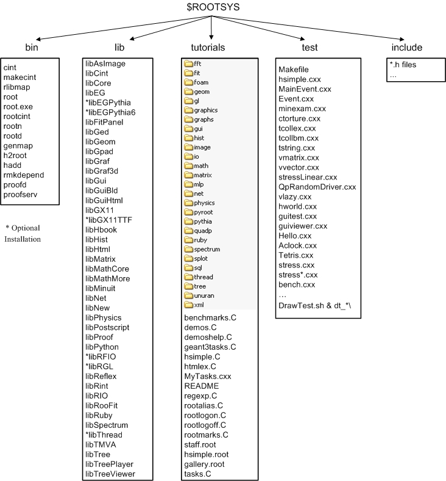
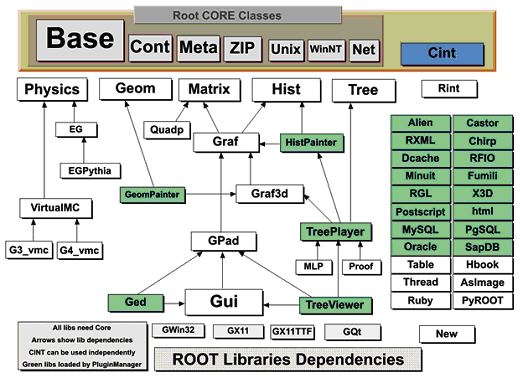
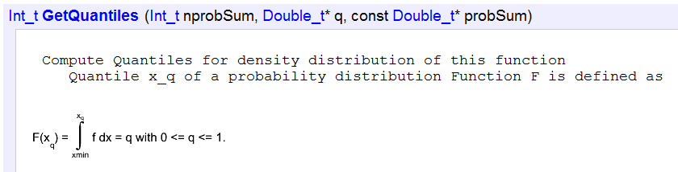
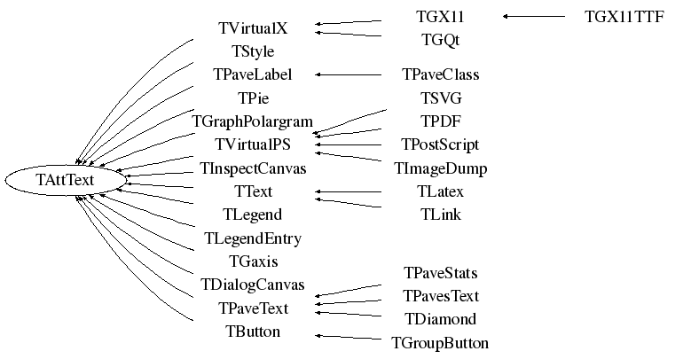
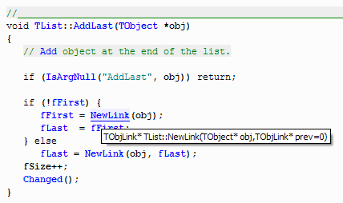

# Introduction

In the mid 1990's, René Brun and Fons Rademakers had many years of
experience developing interactive tools and simulation packages. They
had lead successful projects such as PAW, PIAF, and GEANT, and they
knew PAW the twenty-year-old FORTRAN libraries had reached their
limits. Although still very popular, these tools could not scale up to
the challenges offered by the Large Hadron Collider, where the data is
a few orders of magnitude larger than anything seen before.

At the same time, computer science had made leaps of progress
especially in the area of Object Oriented Design, and René and Fons
were ready to take advantage of it.

ROOT was developed in the context of the NA49 experiment at CERN. NA49
has generated an impressive amount of data, around 10 Terabytes per
run. This rate provided the ideal environment to develop and test the
next generation data analysis.

ROOT was, and still is, developed in the "Bazaar style", a term from
the book "The Cathedral and the Bazaar" by Eric S. Raymond. It means a
liberal, informal development style that heavily relies on the diverse
and deep talent of the user community. The result is that physicists
developed ROOT for themselves; this made it specific, appropriate,
useful, and over time refined and very powerful. The development of
ROOT is a continuous conversation between users and developers with
the line between the two blurring at times and the users becoming
co-developers.

When it comes to storing and mining large amount of data, physics
plows the way with its Terabytes, but other fields and industry follow
close behind as they acquiring more and more data over time. They are
ready to use the true and tested technologies physics has invented. In
this way, other fields and industries have found ROOT useful and they
have started to use it also.

In the bazaar view, software is released early and frequently to
expose it to thousands of eager co-developers to pound on, report
bugs, and contribute possible fixes. More users find more bugs,
because they stress the program in different ways. By now, after ten
years, the age of ROOT is quite mature. Most likely, you will find the
features you are looking for, and if you have found a hole, you are
encouraged to participate in the dialog and post your suggestion or
even implementation on `roottalk`, the ROOT mailing list.

## The ROOT Mailing Lists


The `roottalk` was the very first active ROOT mailing list. mailing
list People can subscribe to it by registering at the ROOT web site:
<http://root.cern.ch/root/Registration.phtml>. The `RootTalk` Forum
<http://root.cern.ch/phpBB3/> has been gradually replaced this
mailing list since September 2003. The `RootTalk` Forum is a web-based
news group with about 10 discussion sub-units.

If you have a question, it is likely that it has been asked, answered,
and stored in the `roottalk` or `RootTalk` Forum archives. Please use
the search engine to see if your question has already been answered
before sending a mail to the `roottalk` list or post a topic in the
Forum.

You can browse the `roottalk` archives at:
<http://root.cern.ch/root/roottalk/AboutRootTalk.html>. You can send
your question without subscribing to: <roottalk@cern.ch>

## Contact Information


Several authors wrote this book and you may see a "change of voice"
from one chapter to the next. We felt we could accept this in order to
have the expert explain what they know best. If you would like to
contribute a chapter or add to a section, please contact
<rootdoc@cern.ch>. We count on you to send us suggestions on
additional topics or on the topics that need more documentation.
Please send your comments, corrections, questions, and suggestions to
the `rootdoc` list: <rootdoc@cern.ch>

We attempt to give the user insight into the many capabilities of
ROOT. The book begins with the elementary functionality and progresses
in complexity reaching the specialized topics at the end. The
experienced user looking for special topics may find these chapters
useful: see "Networking", "Writing a Graphical User Interface",
"Threads", and "PROOF: Parallel Processing".

## Conventions Used in This Book


We tried to follow a style convention for the sake of clarity. The
styles in used are described below.

To show source code in scripts or source files:

``` {.cpp}
{
   cout << " Hello" << endl;
   float x = 3.;
   float y = 5.;
   int   i = 101;
   cout <<" x = "<<x<<" y = "<<y<<" i = "<<i<< endl;
}
```

To show the ROOT command line, we show the ROOT prompt without numbers.
In the interactive system, the ROOT prompt has a line number
(`root[12]`); for the sake of simplicity, the line numbers are left
off.

``` {.cpp}
root[] TLine l
root[] l.Print()
TLine  X1=0.000000 Y1=0.000000 X2=0.000000 Y2=0.000000
```

Italic bold monotype font indicates a global variable, for example
***`gDirectory`***.

When a variable term is used, it is shown between angled brackets. In
the example below the variable term \<library\> can be replaced with
any library in the `$ROOTSYS` directory: `$ROOTSYS/<library>/inc.`

## The Framework


ROOT is an object-oriented framework aimed at solving the data
analysis challenges of high-energy physics. There are two key words in
this definition, object oriented and framework. First, we explain what
we mean by a framework and then why it is an object-oriented
framework.

### What Is a Framework?


Programming inside a framework is a little like living in a city.
Plumbing, electricity, telephone, and transportation are services
provided by the city. In your house, you have interfaces to the
services such as light switches, electrical outlets, and telephones.
The details, for example, the routing algorithm of the phone switching
system, are transparent to you as the user. You do not care; you are
only interested in using the phone to communicate with your
collaborators to solve your domain specific problems.

Programming outside of a framework may be compared to living in the
country. In order to have transportation and water, you will have to
build a road and dig a well. To have services like telephone and
electricity you will need to route the wires to your home. In
addition, you cannot build some things yourself. For example, you
cannot build a commercial airport on your patch of land. From a global
perspective, it would make no sense for everyone to build their
own airport. You see you will be very busy building the infrastructure
(or framework) before you can use the phone to communicate with your
collaborators and have a drink of water at the same time. In software
engineering, it is much the same way. In a framework, the basic
utilities and services, such as I/O and graphics, are provided. In
addition, ROOT being a HEP analysis framework, it provides a large
selection of HEP specific utilities such as histograms and fitting.
The drawback of a framework is that you are constrained to it, as you
are constraint to use the routing algorithm provided by your telephone
service. You also have to learn the framework interfaces, which in
this analogy is the same as learning how to use a telephone.

If you are interested in doing physics, a good HEP framework will save
you much work. Next is a list of the more commonly used components of
ROOT: Command Line Interpreter, Histograms and Fitting, Writing a
Graphical User Interface, 2D Graphics, Input/Output , Collection
Classes, Script Processor.

There are also less commonly used components, as: 3D Graphics,
Parallel Processing (PROOF), Run Time Type Identification (RTTI),
Socket and Network Communication, Threads.

#### Advantages of Frameworks

The benefits of frameworks can be summarized as follows:

-   Less code to write - the programmer should be able to use and
    reuse the majority of the existing code. Basic functionality, such
    as fitting and histogramming are implemented and ready to use and
    customize.

-   More reliable and robust code - the code inherited from a
    framework has already been tested and integrated with the rest of
    the framework.

-   More consistent and modular code - the code reuse provides
    consistency and common capabilities between programs, no matter
    who writes them. Frameworks make it easier to break programs into
    smaller pieces.

-   More focus on areas of expertise - users can concentrate on their
    particular problem domain. They do not have to be experts at
    writing user interfaces, graphics, or networking to use the
    frameworks that provide those services.

### Why Object-Oriented?


Object-Oriented Programming offers considerable benefits compared to
Procedure-Oriented Programming:

-   Encapsulation enforces data abstraction and increases opportunity
    for reuse.

-   Sub classing and inheritance make it possible to extend and modify
    objects.

-   Class hierarchies and containment containment hierarchies provide
    a flexible mechanism for modeling real-world objects and the
    relationships among them.

-   Complexity is reduced because there is little growth of the global
    state, the state is contained within each object, rather than
    scattered through the program in the form of global variables.

-   Objects may come and go, but the basic structure of the program
    remains relatively static, increases opportunity for reuse of
    design.

## Installing ROOT
\index{install ROOT}

To install ROOT you will need to go to the ROOT website at:
<http://root.cern.ch/root/Availability.html>. You have a choice to
download the binaries or the source. The source is quicker to transfer
since it is only \~22 MB, but you will need to compile and link it. The
binaries compiled with no degug information range from \~35 MB to \~45
MB depending on the target platform.

The installation and building of ROOT is described in Appendix A:
Install and Build ROOT. You can download the binaries, or the source.
The GNU g++ compiler on most UNIX platforms can compile ROOT.

Before downloading a binary version make sure your machine contains the
right run-time environment. In most cases it is not possible to run a
version compiled with, e.g., gcc4.0 on a platform where only gcc 3.2 is
installed. In such cases you'll have to install ROOT from source.

ROOT is currently running on the following platforms: supported
platforms

-   `GNU/Linux x86-32 (IA32) and x86-64 (AMD64)(GCC,Intel/icc,
     Portland/PGCC,KAI/KCC)`

-   `Intel Itanium (IA64) GNU/Linux (GCC, Intel/ecc, SGI/CC) `

-   `FreeBSD and OpenBSD (GCC)`

-   `GNU/Hurd (GCC)`

-   `HP HP-UX 10.x (IA32) and 11 (IA64) (HP CC, aCC, GCC)`

-   `IBM AIX 4.1 (xlC compiler, GCC)`

-   `Sun Solaris for SPARC (SUN C++ compiler, GCC) `

-   `Sun Solaris for x86 (SUN C++ compiler, KAI/KCC)`

-   `Compaq Alpha (GCC, KAI/KCC, DEC/CXX)`

-   `SGI Irix 32 and 64 bits (GCC, KAI/KCC, SGI C++ compiler) `

-   `Windows >= 95 (Microsoft Visual C++ compiler, Cygwin/GCC) `

-   `MacOS X PPC, x86-32, x86-64 (GCC, Intel/ICC, IBM/xl)`

-   `PowerPC with GNU/Linux and GCC, Debian v2`

-   `PowerPC64 with GNU/Linux and GCC`

-   `ARM with GNU/Linux and GCC`

-   `LynxOS`

## The Organization of the ROOT Framework


Now after we know in abstract terms what the ROOT framework is, let us
look at the physical directories and files that come with the ROOT
installation. You may work on a platform where your system
administrator has already installed ROOT. You will need to follow the
specific development environment for your setup and you may not have
write access to the directories. In any case, you will need an
environment variable called `ROOTSYS`, which holds the path of the top
ROOT directory.

``` {.cpp}
> echo $ROOTSYS
/opt/root
```

In the `ROOTSYS` directory are examples, executables, tutorials,
header tutorials files, and, if you opted to download it, the source
is here. The directories of special interest to us are `bin`,
`tutorials`, `lib`, `test`, and` include`. The next figure shows the
contents of these directories.




### \$ROOTSYS/bin


The `bin` directory contains several executables.

+---------------+------------------------------------------------------------+
| `root`        | shows the ROOT splash screen and calls `root.exe`          |
+---------------+------------------------------------------------------------+
| `root.exe`    | the executable that `root` calls, if you use a debugger    |
|               | such as `gdb`, you will need to run `root.exe` directly    |
+---------------+------------------------------------------------------------+
| `rootcling`   | is the utility ROOT uses to create a class dictionary for  |
|               | Cling                                                       |
+---------------+------------------------------------------------------------+
| `rmkdepend`   | a modified version of `makedepend` that is used by the     |
|               | ROOT build system                                          |
+---------------+------------------------------------------------------------+
| `root-config` | a script returning the needed compile flags and libraries  |
|               | for projects that compile and link with ROOT               |
+---------------+------------------------------------------------------------+
| `proofd`      | a small daemon used to authenticate a user of ROOT         |
|               | parallel processing capability (PROOF)                     |
+---------------+------------------------------------------------------------+
| `proofserv`   | the actual PROOF process, which is started by `proofd`     |
|               | after a user, has successfully been authenticated          |
+---------------+------------------------------------------------------------+
| `rootd`       | is the daemon for remote ROOT file access (see the         |
|               | **`TNetFile`**)                                            |
+---------------+------------------------------------------------------------+

### \$ROOTSYS/lib


There are several ways to use ROOT, one way is to run the executable
by typing `root` at the system prompt another way is to link with the
ROOT libraries and make the ROOT classes available in your own program.

Here is a short description of the most relevant libraries, the ones
marked with a \* are only installed when the options specified them.

-   `libAsImage` is the image manipulation library

-   `libCling` is the C++ interpreter (Cling)

-   `libCore` is the Base classes

-   `libEG` is the abstract event generator interface classes

-   \*`libEGPythia` is the Pythia5 event generator interface

-   \*`libEGPythia6` is the Pythia6 event generator interface

-   `libFitPanel` contains the GUI used for fitting

-   `libGed` contains the GUI used for editing the properties of
    histograms, graphs, etc.

-   `libGeom` is the geometry package (with builder and painter)

-   `libGpad` is the pad and canvas classes which depend on low level
    graphics

-   `libGraf` is the 2D graphics primitives (can be used independent
    of libGpad)

-   `libGraf3d` is the 3D graphics primitives

-   `libGui` is the GUI classes (depend on low level graphics)

-   `libGuiBld` is the GUI designer

-   `libGuiHtml` contains the embedded HTML browser

-   `libGX11` is the low level graphics interface to the X11 system

-   \*`libGX11TTF` is an add-on library to libGX11 providing TrueType
    fonts

-   `libHbook` is for interface ROOT - HBOOK

-   `libHist` is the histogram classes (with accompanying painter
    library)

-   `libHtml` is the HTML documentation generation system

-   `libMatrix` is the matrix and vector manipulation

-   `libMathCore` contains the core mathematics and physics vector
    classes

-   `libMathMore` contains additional functions, interfacing the GSL
    math library

-   `libMinuit` is the MINUIT fitter

-   `libNet` contains functionality related to network transfer

-   `libNew` is the special global new/delete, provides extra memory
    checking and interface for shared memory (optional)

-   `libPhysics` contains the legacy physics classes (TLorentzVector,
    etc.)

-   `libPostscript` is the PostScript interface

-   `libProof` is the parallel ROOT Facility classes

-   `libPython` provides the interface to Python

-   \*`libRFIO` is the interface to CERN RFIO remote I/O system.

-   \*`libRGL` is the interface to OpenGL.

-   `libReflex` is the runtime type database library used by Cling

-   `libRint` is the interactive interface to ROOT (provides command
    prompt)

-   `libRIO` provides the functionality to write and read objects to
    and from ROOT files

-   `libRooFit` is the RooFit fitting framework

-   `libRuby` is the interface to Ruby

-   `libSpectrum` provides functionality for spectral analysis

-   \*`libThread` is the interface to TThread classes

-   `libTMVA` contains the multivariate analysis toolkit

-   `libTree` is the TTree object container system

-   `libTreePlayer` is the TTree drawing classes

-   `libTreeViewer` is the graphical TTree query interface

#### Library Dependencies



The libraries are designed and organized to minimize dependencies,
such that you can load just enough code for the task at hand rather
than having to load all libraries or one monolithic chunk. The core
library (`libCore.so`) contains the essentials; it is a part of all
ROOT applications. In the Figure 1-2 you see that libCore.so is made
up of base classes, container classes, meta information classes,
operating system specific classes, and the ZIP algorithm used for
compression of the ROOT files.

The Cling library (`libCling.so`) is also needed in all ROOT
applications, and even by `libCore`. A
program referencing only **`TObject`** only needs `libCore`;
`libCling` will be opened automatically. To add the ability to read and write
ROOT objects one also has to load `libRIO`. As one would expect, none of that
depends on graphics or the GUI.

Library dependencies have different consequences; depending on whether
you try to build a binary, or you just try to access a class that is
defined in a library.

#### Linktime Library Dependencies

When building your own executable you will have to link against the
libraries that contain the classes you use. The ROOT reference guide
states the library a class is reference guide defined in. Almost all
relevant classes can be found in libraries returned by
`root-config -glibs`; the graphics libraries are retuned by
`root-config --libs`. These commands are commonly used in `Makefiles`.
Using `root-config` instead of enumerating the libraries by hand
allows you to link them in a platform independent way. Also, if ROOT
library names change you will not need to change your Makefile.

A batch program that does not have a graphic display, which creates,
fills, and saves histograms and trees, only needs to link the core
libraries (`libCore`, `libRIO`), `libHist` and `libTree`.
If ROOT needs access to other libraries, it loads them dynamically.
For example, if the **`TreeViewer`** is used, `libTreePlayer` and all
libraries `libTreePlayer` depends on are loaded also. The dependent
libraries are shown in the ROOT reference guide's library dependency
graph. The difference between reference guide `libHist` and
`libHistPainter` is that the former needs to be explicitly linked and
the latter will be loaded automatically at runtime when ROOT needs it,
by means of the Plugin Manager. plugin manager

In the Figure 1-2, the libraries represented by green boxes outside of
the core are loaded via the plugin manager plugin manager or
equivalent techniques, while the white ones are not. Of course, if one
wants to access a plugin library directly, it has to be explicitly
linked. An example of a plugin library is `libMinuit`. To create and
fill histograms you need to link `libHist.so`. If the code has a call
to fit the histogram, the "fitter" will dynamically load libMinuit if
it is not yet loaded.

#### Plugins: Runtime Library Dependencies for Linking

plugin manager The Plugin Manager **`TPluginManager`** allows
postponing library dependencies to runtime: a plugin library will only
be loaded when it is needed. Non-plugins will need to be linked, and
are thus loaded at start-up. Plugins are defined by a base class (e.g.
**`TFile`**) that will be implemented in a plugin, a tag used to
identify the plugin (e.g. `^rfio:` as part of the protocol string),
the plugin class of which an object will be created
(e.g. **`TRFIOFile`**), the library to be loaded (in short
`libRFIO.so` to RFIO), and the constructor to be called (e.g.
"`TRFIOFile()`"). This can be specified in the `.rootrc` which already
contains many plugin definitions, or by calls to
`gROOT->GetPluginManager()->AddHandler()`.

#### Library Autoloading

When using a class in Cling, e.g. in an interpreted source file, ROOT
will automatically load the library that defines this class. On
start-up, ROOT parses all files ending on `.rootmap` rootmap that are
in one of the `$LD_LIBRARY_PATH` (or `$DYLD_LIBRARY_PATH` for `MacOS`,
or `$PATH` for `Windows`). They contain class names and the library
names that the class depends on. After reading them, ROOT knows which
classes are available, and which libraries to load for them.

When `TSystem::Load("ALib")` is called, ROOT uses this information to
determine which libraries `libALib.so` depends on. It will load these
libraries first. Otherwise, loading the requested library could cause
a system (dynamic loader) error due to unresolved symbols.

### \$ROOTSYS/tutorials


tutorials The tutorials directory contains many example example
scripts. They assume some basic knowledge of ROOT, and for the new
user we recommend reading the chapters: "Histograms" and
"Input/Output" before trying the examples. The more experienced user
can jump to chapter "The Tutorials and Tests" to find more explicit
and specific information about how to build and run the examples.

The `$ROOTSYS/tutorials/` directory include the following
sub-directories:

`fft`: Fast Fourier Transform with the fftw package `fit`: Several
examples illustrating minimization/fitting `foam`: Random generator in
multidimensional space `geom`: Examples of use of the geometry package
(**`TGeo`** classes) `gl`: Visualisation with OpenGL `graphics`: Basic
graphics `graphs`: Use of **`TGraph`**, **`TGraphErrors`**, etc.
`gui`: Scripts to create Graphical User Interface `hist`: Histograming
`image`: Image Processing `io`: Input/Output `math`: Maths and
Statistics functions `matrix`: Matrices (**`TMatrix`**) examples
`mlp`: Neural networks with **`TMultiLayerPerceptron`** `net`: Network
classes (client/server examples) `physics`: LorentzVectors, phase
space `pyroot`: Python tutorials `pythia`: Example with `pythia6`
`quadp`: Quadratic Programming `ruby`: ruby tutorials `smatrix`:
Matrices with a templated package `spectrum`: Peak finder, background,
deconvolutions `splot`: Example of the **`TSplot`** class
(signal/background estimator) `sql`: Interfaces to SQL (mysql, oracle,
etc) `thread`: Using Threads `tmva`: Examples of the MultiVariate
Analysis classes `tree`: Creating Trees, Playing with Trees `unuran`:
Interface with the unuram random generator library `xml`:
Writing/Reading xml files

You can execute the scripts in `$ROOTSYS/tutorials`
(or sub-directories) by setting your current directory in the script
directory or from any user directory with write access. Several
tutorials create new files. If you have write access to the tutorials
directory, the new files will be created in the tutorials directory,
otherwise they will be created in the user directory.

### \$ROOTSYS/test


The test directory contains a set of examples example that represent
all areas of the framework. When a new release is cut, the examples in
this directory are compiled and run to test the new release's backward
compatibility. The list of source files is described in chapter "The
Tutorials and Tests".

The `$ROOTSYS/test` directory is a gold mine of ROOT-wisdom nuggets,
and we encourage you to explore and exploit it. We recommend the new
users to read the chapter "Getting Started". The chapter "The
Tutorials and Tests" has instructions on how to build all the programs
and it goes over the examples `Event` and `stress`.

### \$ROOTSYS/include


The `include` directory contains all header files. It is especially
important because the header files contain the class definitions.

### \$ROOTSYS/\<library\>


The directories we explored above are available when downloading the
binaries. When downloading the source you also get a directory for
each library with the corresponding header and source files, located
in the `inc` and `src` subdirectories. To see what classes are in a
library, you can check the `<library>/inc` directory for the list of
class definitions. For example, the physics library `libPhysics.so`
contains these class definitions:

``` {.cpp}
> ls -m $ROOTSYS/math/physics/inc/
LinkDef.h, TFeldmanCousins.h, TGenPhaseSpace.h, TLorentzRotation.h,
TLorentzVector.h, TQuaternion.h, TRobustEstimator.h, TRolke.h,
TRotation.h, TVector2.h, TVector3.h
```

## How to Find More Information


website The ROOT web site has up to date documentation. The ROOT
source code automatically generates this documentation, so each class
is explicitly documented on its own web page, which is always up to
date with the latest official release of ROOT.

The ROOT Reference Guide web pages can be found at class index
reference guide <http://root.cern.ch/root/html/ClassIndex.html>. Each
page contains a class description, and an explanation of each method.
It shows the class inheritance tree and lets you jump to the parent
class page by clicking on the class name. If you want more details,
you can even see the source. There is a help page available in the
little box on the upper right hand side of each class documentation
page. You can see on the next page what a typical class documentation
web page looks like. The ROOT web site also contains in addition to
this Reference Guide, "How To's", a list of publications and example
applications.

### Class Reference Guide


The top of any class reference page lets you jump to different parts
of the documentation. The first line links to the class index and the
index for the current module (a group of classes, often a library).
The second line links to the ROOT homepage and the class overviews.
The third line links the source information - a HTML version of the
source and header file as well as the CVS (the source management
system used for the ROOT development) information of the files. The
last line links the different parts of the current pages.







