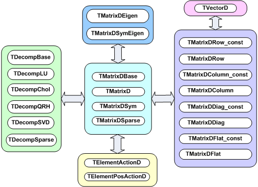
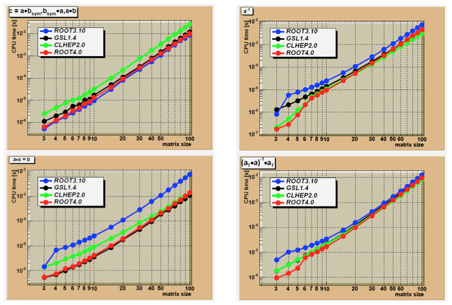

# Linear Algebra in ROOT

The linear algebra package is supposed to give a complete environment in
ROOT to perform calculations like equation solving and eigenvalue
decompositions. Most calculations are performed in double precision. For
backward compatibility, some classes are also provided in single
precision like **`TMatrixF`**, **`TMatrixFSym`** and **`TVectorF`**.
Copy constructors exist to transform these into their double precision
equivalent, thereby allowing easy access to decomposition and eigenvalue
classes, only available in double precision.

The choice was made not to provide the less frequently used complex
matrix classes. If necessary, users can always reformulate the
calculation in 2 parts, a real one and an imaginary part. Although, a
linear equation involving complex numbers will take about a factor of 8
more computations, the alternative of introducing a set of complex
classes in this non-template library would create a major maintenance
challenge.

Another choice was to fill in both the upper-right corner and the
bottom-left corner of a symmetric matrix. Although most algorithms use
only the upper-right corner, implementation of the different matrix
views was more straightforward this way. When stored only the
upper-right part is written to file.

For a detailed description of the interface, the user should look at the
root reference guide at: <http://root.cern.ch/root/Reference.html>

## Overview of Matrix Classes

The figure below shows an overview of the classes available in the
linear algebra library,` libMatrix.so`. At the center is the base class
**`TMatrixDBase`** from which three different matrix classes,
**`TMatrixD`**, **`TMatrixDSym`** and **`TMatrixDFSparse`** derive. The
user can define customized matrix operations through the classes
**`TElementActionD`** and **`TElementsPosActionD`**.



Reference to different views of the matrix can be created through the
classes on the right-hand side, see "Matrix Views". These references
provide a natural connection to vectors.

Matrix decompositions (used in equation solving and matrix inversion)
are available through the classes on the left-hand side (see "Matrix
Decompositions"). They inherit from the **`TDecompBase`** class. The
Eigen Analysis is performed through the classes at the top, see "Matrix
Eigen Analysis". In both cases, only some matrix types can be analyzed.
For instance, **`TDecompChol`** will only accept symmetric matrices as
defined **`TMatrixDSym`**. The assignment operator behaves somewhat
different than of most other classes. The following lines will result in
an error:

``` {.cpp}
   TMatrixD a(3,4);
   TMatrixD b(5,6);
   b = a;
```

It required to first resize matrix b to the shape of `a`.

``` {.cpp}
   TMatrixD a(3,4);
   TMatrixD b(5,6);
   b.ResizeTo(a);
   b = a;
```

## Matrix Properties

A matrix has five properties, which are all set in the constructor:

-   `precision` - float or double. In the first case you will use the
    **`TMatrixF`** class family, in the latter case the **`TMatrixD`**
    one;

-   `type` - general (**`TMatrixD`**), symmetric (**`TMatrixDSym`**) or
    sparse (**`TMatrixDSparse`**);

-   `size` - number of rows and columns;

-   `index` - range start of row and column index. By default these
    start at zero;

-   `sparse` `map` - this property is only relevant for a sparse matrix.
    It indicates where elements are unequal zero.

### Accessing Properties

The following table shows the methods to access the information about
the relevant matrix property:

+-----------------------------+----------------------------------------------+
| Method                      | Descriptions                                 |
+-----------------------------+----------------------------------------------+
| `Int_t GetRowLwb` `()`      | row lower-bound index                        |
+-----------------------------+----------------------------------------------+
| `Int_t GetRowUpb` `()`      | row upper-bound index                        |
+-----------------------------+----------------------------------------------+
| `Int_t GetNrows` `()`       | number of rows                               |
+-----------------------------+----------------------------------------------+
| `Int_t GetColLwb` `()`      | column lower-bound index                     |
+-----------------------------+----------------------------------------------+
| `Int_t GetColUpb` `()`      | column upper-bound index                     |
+-----------------------------+----------------------------------------------+
| `Int_t GetNcols` `()`       | number of columns                            |
+-----------------------------+----------------------------------------------+
| `Int_t GetNoElements` `()`  | number of elements, for a dense matrix this  |
|                             | equals: `fNrows x fNcols`                    |
+-----------------------------+----------------------------------------------+
| `Double_t GetTol` `()`      | tolerance number which is used in            |
|                             | decomposition operations                     |
+-----------------------------+----------------------------------------------+
| `Int_t *GetRowIndexArray`   | for sparse matrices, access to the row index |
| `()`                        | of `fNrows+1` entries                        |
+-----------------------------+----------------------------------------------+
| `Int_t *GetColIndexArray`   | for sparse matrices, access to the column    |
| `()`                        | index of `fNelems` entries                   |
+-----------------------------+----------------------------------------------+

The last two methods in this table are specific to the sparse matrix,
which is implemented according to the Harwell-Boeing format. Here,
besides the usual shape/size descriptors of the matrix like `fNrows`,
`fRowLwb`, `fNcols` and `fColLwb`, we also store a row index,
`fRowIndex` and column index, `fColIndex` for the elements unequal zero:

+-----------------------------+----------------------------------------------+
| `fRowIndex[0,..,fNrows]:`   | Stores for each row the index range of the   |
|                             | elements in the data and column array        |
+-----------------------------+----------------------------------------------+
| `fColIndex[0,..,fNelems-1]: | Stores the column number for each data       |
| `                           | element != 0.                                |
+-----------------------------+----------------------------------------------+

The code to print all matrix elements unequal zero would look like:

``` {.cpp}
   TMatrixDSparse a;
   const Int_t *rIndex = a.GetRowIndexArray();
   const Int_t *cIndex = a.GetColIndexArray();
   const Double_t *pData = a.GetMatrixArray();
   for (Int_t irow = 0; irow < a.getNrows(); irow++) {
      const Int_t sIndex = rIndex[irow];
      const Int_t eIndex = rIndex[irow+1];
      for (Int_t index = sIndex; index < eIndex; index++) {
         const Int_t icol = cIndex[index];
         const Double_t data = pData[index];
         printf("data(%d,%d) = %.4en",irow+a.GetfRowLwb(),
         icol+a.GetColLwb(),data);
      }
   }
```

### Setting Properties

The following table shows the methods to set some of the matrix
properties. The resizing procedures will maintain the matrix elements
that overlap with the old shape. The optional last argument `nr_zeros`
is only relevant for sparse matrices. If supplied, it sets the number of
non-zero elements. If it is smaller than the number overlapping with the
old matrix, only the first (row-wise)` nr_zeros` are copied to the new
matrix.

+-----------------------------------------+----------------------------------+
|               Method                    |            Descriptions          |
+=========================================+==================================+
| `SetTol` `(Double_t tol)`               | set the tolerance number         |
+-----------------------------------------+----------------------------------+
| `ResizeTo` `(Int_t nrows,Int_t ncols,`  | change matrix shape to `nrows` x |
|                                         | `ncols`. Index will start at     |
| `         Int_t nr_nonzeros=-1)`        | zero                             |
+-----------------------------------------+----------------------------------+
| `ResizeTo(Int_t row_lwb,Int_t row_upb,` | change matrix shape to           |
|                                         |                                  |
| `Int_t col_lwb,Int_t col_upb,`          | `row_lwb:row_upb` x              |
|                                         | `col_lwb:col_upb`                |
| `Int_t nr_nonzeros=-1)`                 |                                  |
+-----------------------------------------+----------------------------------+
| `SetRowIndexArray` `(Int_t *data)`      | for sparse matrices, set the row |
|                                         | index. The array data should     |
|                                         | contains at least` fNrows+1`     |
|                                         | entries column lower-bound index |
+-----------------------------------------+----------------------------------+
| `SetColIndexArray` `(Int_t *data)`      | for sparse matrices, set the     |
|                                         | column index. The array data     |
|                                         | should contains at least         |
|                                         | `fNelems` entries                |
+-----------------------------------------+----------------------------------+
| `SetSparseIndex` `(Int_t nelems new)`   | allocate memory for a sparse map |
|                                         | of `nelems_new` elements and     |
|                                         | copy (if exists) at most         |
|                                         | `nelems_new` matrix elements     |
|                                         | over to the new structure        |
+-----------------------------------------+----------------------------------+
| `SetSparseIndex`                        | copy the sparse map from matrix  |
| `(const TMatrixDBase &a)`               | `a` Note that this can be a      |
|                                         | dense matrix!                    |
+-----------------------------------------+----------------------------------+
| `SetSparseIndexAB`                      | set the sparse map to the same   |
| `(const TMatrixDSparse &a,` `           | of the map of matrix `a` and `b` |
| const TMatrixDSparse &b)`               |                                  |
+-----------------------------------------+----------------------------------+

The second half of the table is only relevant for sparse matrices. These
methods define the sparse structure. It should be clear that a call to
any of these methods has to be followed by a **`SetMatrixArray`** (...)
which will supply the matrix data, see the next chapter "Creating and
Filling a Matrix".

## Creating and Filling a Matrix

The matrix constructors are listed in the next table. In the simplest
ones, only the number of rows and columns is given. In a slightly more
elaborate version, one can define the row and column index range.
Finally, one can also define the matrix data in the constructor. In
Matrix Operators and Methods we will encounter more fancy constructors
that will allow arithmetic operations.

+--------------------------------------------------------------------------+
| `TMatrixD(Int_t nrows,Int_t ncols)`                                      |
|                                                                          |
| `TMatrixD(Int_t row_lwb,Int_t row_upb,Int_t col_lwb,Int_t col_upb)`      |
|                                                                          |
| `TMatrixD(Int_t nrows,Int_t ncols,const Double_t *data, Option_t option= |
| "")`                                                                     |
|                                                                          |
| `TMatrixD(Int_t row_lwb,Int_t row_upb,Int_t col_lwb,Int_t col_upb,`      |
|                                                                          |
| `         const Double_t *data,Option_t *option="")`                     |
+--------------------------------------------------------------------------+
| `TMatrixDSym(Int_t nrows)`                                               |
|                                                                          |
| `TMatrixDSym(Int_t row_lwb,Int_t row_upb) `                              |
|                                                                          |
| `TMatrixDSym(Int_t nrows,const Double_t *data,Option_t *option="")`      |
|                                                                          |
| `TMatrixDSym(Int_t row_lwb,Int_t row_upb,const Double_t *data, Option_t  |
| *opt="")            `                                                    |
+--------------------------------------------------------------------------+
| `TMatrixDSparse(Int_t nrows,Int_t ncols)`                                |
|                                                                          |
| `TMatrixDSparse(Int_t row_lwb,Int_t row_upb,Int_t col_lwb, Int_t col_upb |
| )`                                                                       |
|                                                                          |
| `TMatrixDSparse(Int_t row_lwb,Int_t row_upb,Int_t col_lwb,Int_t col_upb, |
| `                                                                        |
|                                                                          |
| `               Int_t nr_nonzeros,Int_t *row,Int_t *col,Double_t *data)` |
+--------------------------------------------------------------------------+

If only the matrix shape is defined in the constructor, matrix data has
to be supplied and possibly the sparse structure. In "Setting
Properties" was discussed how to set the sparse structure.

Several methods exist to fill a matrix with data:

`SetMatrixArray(const Double_t*data,Option_t*option="")`, copies the
array data. If option`="F"`, the array fills the matrix column-wise else
row-wise. This option is only implemented for **`TMatrixD`** and
**`TMatrixDSym`**. It is expected that the array data contains at least
`fNelems` entries.

`SetMatrixArray(Int_t nr,Int_t *irow,Int_t *icol,Double_t *data)`, is
only available for sparse matrices. The three arrays should each contain
`nr` entries with row index, column index and data entry. Only the
entries with non-zero data value are inserted!

`operator() `or `operator[]`, these operators provide the easiest way to
fill a matrix but are in particular for a sparse matrix expensive. If no
entry for slot (`i,j`) is found in the sparse index table it will be
entered, which involves some memory management! Therefore, before
invoking this method in a loop it is wise to set the index table first
through a call to the `SetSparseIndex` method.

`SetSub(Int_t row_lwb,Int_t col_lwb,const TMatrixDBase &source)`, the
matrix to be inserted at position `(row_lwb,col_lwb)` can be both, dense
or sparse.

`Use(...)` allows inserting another matrix or data array without
actually copying the data. Next table shows the different flavors for
the different matrix types.

+--------------------------------------------------------------------------+
| `Use(TMatrixD &a)`                                                       |
|                                                                          |
| `Use(Int_t row_lwb,Int_t row_upb,Int_t col_lwb,Int_t col_upb,Double_t *d |
| ata)`                                                                    |
|                                                                          |
| `Use(Int_t nrows,Int_t ncols,Double_t *data)`                            |
+--------------------------------------------------------------------------+
| `Use(TMatrixDSym &a)`                                                    |
|                                                                          |
| `Use(Int_t nrows,Double_t *data)`                                        |
|                                                                          |
| `Use(Int_t row_lwb,Int_t row_upb,Double_t *data)`                        |
+--------------------------------------------------------------------------+
| `Use(TMatrixDSparse &a)`                                                 |
|                                                                          |
| `Use(Int_t row_lwb,Int_t row_upb,Int_t col_lwb,Int_t col_upb,Int_t nr_no |
| nzeros,`                                                                 |
|                                                                          |
| `    Int_t *pRowIndex,Int_t *pColIndex,Double_t *pData)`                 |
|                                                                          |
| `Use(Int_t nrows,Int_t ncols,Int_t nr_nonzeros,Int_t *pRowIndex,`        |
|                                                                          |
| `    Int_t *pColIndex,Double_t *pData)`                                  |
+--------------------------------------------------------------------------+

Below follow a few examples of creating and filling a matrix. First we
create a Hilbert matrix by copying an array.

``` {.cpp}
   TMatrixD h(5,5);
   TArrayD data(25);
   for (Int_t = 0; i < 25; i++) {
      const Int_t ir = i/5;
      const Int_t ic = i%5;
      data[i] = 1./(ir+ic);
   }
   h.SetMatrixArray(data.GetArray());
```

We also could assign the data array to the matrix without actually
copying it.

``` {.cpp}
   TMatrixD h; h.Use(5,5,data.GetArray());
   h.Invert();
```

The array `data` now contains the inverted matrix. Finally, create a
unit matrix in sparse format.

``` {.cpp}
   TMatrixDSparse unit1(5,5);
   TArrayI row(5),col(5);
   for (Int_t i = 0; i < 5; i++) row[i] = col[i] = i;
   TArrayD data(5); data.Reset(1.);
   unit1.SetMatrixArray(5,row.GetArray(),col.GetArray(),data.GetArray());

   TMatrixDSparse unit2(5,5);
   unit2.SetSparseIndex(5);
   unit2.SetRowIndexArray(row.GetArray());
   unit2.SetColIndexArray(col.GetArray());
   unit2.SetMatrixArray(data.GetArray());
```

## Matrix Operators and Methods

It is common to classify matrix/vector operations according to BLAS
(Basic Linear Algebra Subroutines) levels, see following table:

+-------------+---------------------+-----------------+---------------------------+
| BLAS level  | operations          | example         | floating-point operations |
+-------------+---------------------+-----------------+---------------------------+
| 1           | vector-vector       | $x T y$         | $n$                       |
+-------------+---------------------+-----------------+---------------------------+
| 2           | matrix-vector       | $A x$           | $n2$                      |
|             | matrix              |                 |                           |
+-------------+---------------------+-----------------+---------------------------+
| 3           | matrix-matrix       | $A B$           | $n3$                      |
+-------------+---------------------+-----------------+---------------------------+

Most level 1, 2 and 3 BLAS are implemented. However, we will present
them not according to that classification scheme it is already boring
enough.

### Arithmetic Operations between Matrices

+-------------------------+------------------------------------+--------------------+
|        Description      |               Format               |       Comment      |
+-------------------------+------------------------------------+--------------------+
| `element`               | `C=A+B`                            |                    |
|                         |                                    | `overwrites` $A$   |
| `wise sum`              | `A+=B `                            |                    |
|                         |                                    | $A = A+\alpha B$   |
|                         | `Add` `(A,alpha,B) `               | `constructor`      |
|                         |                                    |                    |
|                         | `TMatrixD(A,TMatrixD::kPlus,B) `   |                    |
+-------------------------+------------------------------------+--------------------+
| `element wise`          | `C=A-B`                            | `overwrites` $A$   |
| `subtraction`           | `A-=B `                            | `constructor`      |
|                         |                                    |                    |
|                         | `TMatrixD(A,TMatrixD::kMinus,B) `  |                    |
+-------------------------+------------------------------------+--------------------+
| `matrix multiplication` | `C=A*B`                            | `overwrites` $A$   |
|                         |                                    |                    |
|                         | `A*=B `                            |                    |
|                         |                                    |                    |
|                         | `C.Mult(A,B)`                      |                    |
+-------------------------+------------------------------------+--------------------+
|                         | `TMatrixD(A,TMatrixD::kMult,B)`    | `constructor of `  |
|                         |                                    | $A.B$              |
+-------------------------+------------------------------------+--------------------+
|                         | `TMatrixD(A,`                      | `constructor of `  |
|                         | `TMatrixD::kTransposeMult,B)`      | $A^{T}.B$          |
+-------------------------+------------------------------------+--------------------+
|                         | `TMatrixD(A,`                      | `constructor of `  |
|                         | `TMatrixD::kMultTranspose,B)`      | $A.B^{T}$          |
+-------------------------+------------------------------------+--------------------+
| `element wise`          | `ElementMult(A,B) `                | `A(i,j)*= B(i,j)`  |
| `multiplication`        |                                    |                    |
|                         |                                    |                    |
| `element wise division` | `ElementDiv(A,B)`                  | `A(i,j)/= B(i,j)`  |
+-------------------------+------------------------------------+--------------------+

### Arithmetic Operations between Matrices and Real Numbers

+--------------------------+-------------------+----------------+
| Description              | Format            | Comment        |
+--------------------------+-------------------+----------------+
| element wise sum         | `C=r+A`           | overwrites $A$ |
|                          | `C=A+r`           |                |
|                          | `A+=r`            |                |
+--------------------------+-------------------+----------------+
| element wise subtraction | `C=r-A`           | overwrites $A$ |
|                          | `C=A-r`           |                |
|                          | `A-=r`            |                |
+--------------------------+-------------------+----------------+
| matrix multiplication    | `C=r*A`           | overwrites $A$ |
|                          | `C=A*r`           |                |
|                          | `A*=r`            |                |
+--------------------------+-------------------+----------------+

### Comparisons and Boolean Operations

The following table shows element wise comparisons between two matrices:

+------------------------------------------+----------+-----------------------------+
| Format                                   | Output   | Description                 |
+------------------------------------------+----------+-----------------------------+
| `A == B`                                 | `Bool_t` | equal to                    |
+------------------------------------------+----------+-----------------------------+
| `A != B `                                | matrix   | Not equal                   |
|                                          |          |                             |
| `A > B `                                 | matrix   | Greater than                |
|                                          |          |                             |
| `A >= B `                                | matrix   | Greater than or equal to    |
|                                          |          |                             |
| `A < B `                                 | matrix   | Smaller than                |
|                                          |          |                             |
| `A <= B`                                 | matrix   | Smaller than or equal to    |
+------------------------------------------+----------+-----------------------------+
| `AreCompatible(A,B) `                    | `Bool_t` | Compare matrix properties   |
|                                          |          |                             |
| `Compare(A,B) `                          |          | return summary of           |
|                                          |          | comparison                  |
| `VerifyMatrixIdentity(A,B,verb, maxDev)` | `Bool_t` |                             |
|                                          |          | Check matrix identity       |
|                                          |          | within `maxDev` tolerance   |
+------------------------------------------+----------+-----------------------------+

The following table shows element wise comparisons between matrix and real:

+---------------------------------------+----------+-----------------------------+
| Format                                | Output   | Description                 |
+---------------------------------------+----------+-----------------------------+
| `A == r`                              | `Bool_t` | equal to                    |
|                                       |          |                             |
| A != r                                | `Bool_t` | Not equal                   |
|                                       |          |                             |
| A \> r                                | `Bool_t` | Greater than                |
|                                       | `Bool_t` |                             |
| A \>= r                               |          | Greater than or equal to    |
|                                       | `Bool_t` |                             |
| A \< r                                | `Bool_t`  | Smaller than                |
|                                       |          |                             |
| A \<= r                               |          | Smaller than or equal to    |
+---------------------------------------+----------+-----------------------------+
| `VerifyMatrixValue(A,r,verb, maxDev)` | `Bool_t` | Compare matrix value with r |
|                                       |          | within `maxDev` tolerance   |
+---------------------------------------+----------+-----------------------------+

### Matrix Norms

+----------------------+--------------+----------------------------------------+
| Format               | Output       | Description                            |
+----------------------+--------------+----------------------------------------+
| `A.RowNorm()`        | `Double_t`   | norm induced by the infinity vector    |
|                      |              | norm, max*i*$\sum_{i}|A_{ij}|$         |
| `A.NormInf()`        | `Double_t`   |                                        |
|                      |              | max*i*$\sum_{i}|A_{ij}|$               |
| `A.ColNorm()`        | `Double_t`   |                                        |
|                      |              | norm induced by the 1 vector norm,     |
| `A.Norm1()`          | `Double_t`   | max*j*$\sum_{i}|A_{ij}|$               |
|                      |              |                                        |
| `A.E2Norm()`         | `Double_t`   | max*j*$\sum_{i}|A_{ij}|$               |
|                      |              |                                        |
| `A.NonZeros()`       | `Int_t`      | Square of the Euclidean norm,          |
|                      |              |                                        |
| `A.Sum()`            | `Double_t`   | $\sum_{ji}(A_{ij}^{2})$                |
|                      |              |                                        |
| `A.Min()`            | `Double_t`   | number of elements unequal zero        |
|                      |              |                                        |
| `A.Max()`            | `Double_t`   | $\sum_{ji}(A_{ij})$                    |
|                      |              |                                        |
|                      |              | min*ij* $(A_{ij})$                     |
|                      |              |                                        |
|                      |              | max*ij* $(A_{ij})$                     |
+----------------------+--------------+----------------------------------------+
| `A.NormByColumn`     | `TMatrixD`   | $A_{ij}/= \nu_i$, divide               |
| `(v,"D") `           |              | each matrix column by vector v. If the |
|                      | `TMatrixD`   | second argument is "`M`", the column   |
| `A.NormByRow`        |              | is multiplied.                         |
| `(v,"D")`            |              |                                        |
|                      |              | $A_{ij}/= \nu_j$, divide               |
|                      |              | each matrix row by vector v. If the    |
|                      |              | second argument is "`M`", the row is   |
|                      |              | multiplied.                            |
+----------------------+--------------+----------------------------------------+

### Miscellaneous Operators

+--------------------------+------------+---------------------------------------------+
| Format                   | Output     | Description                                 |
+--------------------------+------------+---------------------------------------------+
| `A.Zero()`               | `TMatrixX` | $A_{ij} = 0$                                |
+--------------------------+------------+---------------------------------------------+
| `A.Abs()`                | `TMatrixX` | $A_{ij} = |A_{ij}|$                         |
+--------------------------+------------+---------------------------------------------+
| `A.Sqr()`                | `TMatrixX` | $A_{ij} = A_{ij}^2$                         |
+--------------------------+------------+---------------------------------------------+
| `A.Sqrt()`               | `TMatrixX` | $A_{ij} = \sqrt{(A_{ij})}$                  |
+--------------------------+------------+---------------------------------------------+
| `A.UnitMatrix()`         | `TMatrixX` | $A_{ij} = 1$ for *i ==j* else 0             |
+--------------------------+------------+---------------------------------------------+
| `A.Randomize`            | `TMatrixX` | $A_{ij} = (\beta-\alpha)\bigcup(0,1)+\alpha$|
| `(alpha,beta,seed)`      |            | a random matrix is generated with           |
|                          |            | elements uniformly distributed              |
|                          |            | between $\alpha$ and $\beta$                |
+--------------------------+------------+---------------------------------------------+
| `A.T()`                  | `TMatrixX` | $A_{ij} = A_{ji}$                           |
+--------------------------+------------+---------------------------------------------+
| `A.Transpose(B)`         | `TMatrixX` | $A_{ij} = B_{ji}$                           |
+--------------------------+------------+---------------------------------------------+
| `A.Invert(&det)`         | `TMatrixX` | Invert matrix A. If the optional            |
|                          |            | pointer to the `Double_t`                   |
|                          |            | argument `det` is supplied, the             |
|                          |            | matrix determinant is                       |
|                          |            | calculated.                                 |
+--------------------------+------------+---------------------------------------------+
| `A.InvertFast(&det)     `| `TMatrixX` | like Invert but for matrices                |
|                          |            | i =(6x6)a faster but less                   |
|                          |            | accurate Cramer algorithm is                |
|                          |            | used                                        |
+--------------------------+------------+---------------------------------------------+
| `A.Rank1Update(v,alpha)` | `TMatrixX` | Perform with vector v a rank 1              |
|                          |            | operation on the matrix:                    |
|                          |            | $A = A + \alpha.\nu.\nu^T$                  |
+--------------------------+------------+---------------------------------------------+
| `A.RandomizePD           | `TMatrixX` | $A_{ij} = (\beta-\alpha)\bigcup(0,1)+\alpha$|
| `(alpha,beta,seed)`      |            | a random symmetric                          |
|                          |            | positive-definite matrix is                 |
|                          |            | generated with elements                     |
|                          |            | uniformly distributed                       |
|                          |            | between $\alpha$ and $\beta$                |
+--------------------------+------------+---------------------------------------------+

Output **`TMatrixX`** indicates that the returned matrix is of the same
type as `A`, being **`TMatrixD`**, **`TMatrixDSym`** or
**`TMatrixDSparse`**. Next table shows miscellaneous operations for
**`TMatrixD`**.

+--------------------------------+------------+---------------------------------+
| Format                         | Output     | Description                     |
+--------------------------------+------------+---------------------------------+
| `A.Rank1Update(v1,v2,alpha)`   | `TMatrixD` | Perform with vector `v1` and    |
|                                |            | `v2`, a rank 1 operation on the |
|                                |            | matrix:                         |
|                                |            | $A = A + \alpha.\nu.\nu2^T$     |
+--------------------------------+------------+---------------------------------+

## Matrix Views

Another way to access matrix elements is through the matrix-view
classes, **`TMatrixDRow`**, **`TMatrixDColumn`**, **`TMatrixDDiag`** and
**`TMatrixDSub`** (each has also a const version which is obtained by
simply appending const to the class name). These classes create a
reference to the underlying matrix, so no memory management is involved.
The next table shows how the classes access different parts of the
matrix:

+--------------------------------+-----------------------------------------+
| class                          | view                                    |
+--------------------------------+-----------------------------------------+
|                                | $$ \left(\begin{array}{ccccc}           |
|                                | x_{00} &     &        &     & x_{0n} \\ |
|                                |        &     &        &     &        \\ |
| `TMatrixDRow const(X,i)`       | x_{i0} & ... & x_{ij} & ... & x_{in} \\ |
| `TMatrixDRow(X,i)`             |        &     &        &     &        \\ |
|                                | x_{n0} &     &        &     & x_{nn}    |
|                                | \end{array}\right)$$                    |
+--------------------------------+-----------------------------------------+
|                                | $$ \left(\begin{array}{ccccc}           |
|                                | x_{00} &     & x_{0j} &     & x_{0n} \\ |
|                                |        &     &  ...   &     &        \\ |
| `TMatrixDColumn const(X,j)`    |        &     & x_{ij} &     &        \\ |
| `TMatrixDColumn(X,j)`          |        &     &  ...   &     &        \\ |
|                                | x_{n0} &     & x_{nj} &     & x_{nn}    |
|                                | \end{array}\right)$$                    |
+--------------------------------+-----------------------------------------+
|                                | $$ \left(\begin{array}{ccccc}           |
|                                | x_{00} &     &        &     & x_{0n} \\ |
|                                |        & ... &        &     &        \\ |
| `TMatrixDDiag const(X)`        |        &     &   ...  &     &        \\ |
| `TMatrixDDiag(X)`              |        &     &        & ... &        \\ |
|                                | x_{n0} &     &        &     & x_{nn}    |
|                                | \end{array}\right)$$                    |
+--------------------------------+-----------------------------------------+
|                                | $$ \left(\begin{array}{ccccc}           |
|                                | x_{00} &     &        &     & x_{0n} \\ |
|                                |        &     &        &     &        \\ |
| `TMatrixDSub const(X,i,l,j,k)` |        &     & x_{ij} & ... & x_{ik} \\ |
| `TMatrixDSub(X,i,l,j,k)`       |        &     & x_{lj} & ... & x_{lk} \\ |
|                                | x_{n0} &     &        &     & x_{nn}    |
|                                | \end{array}\right)$$                    |
+--------------------------------+-----------------------------------------+

### View Operators

For the matrix views **`TMatrixDRow`**, **`TMatrixDColumn`** and
**`TMatrixDDiag`**, the necessary assignment operators are available to
interact with the vector class **`TVectorD`**. The sub matrix view
**`TMatrixDSub`** has links to the matrix classes **`TMatrixD`** and
**`TMatrixDSym`**. The next table summarizes how the access individual
matrix elements in the matrix views:

+----------------------------------------+-----------------------------------+
| Format                                 | Comment                           |
+----------------------------------------+-----------------------------------+
| `TMatrixDRow(A,i)(j)`                  | element $A_{ij}$                  |
| `TMatrixDRow(A,i)[j]`                  |                                   |
+----------------------------------------+-----------------------------------+
| `TMatrixDColumn(A,j)(i)`               | element $A_{ij}$                  |
| `TMatrixDColumn(A,j)[i]`               |                                   |
+----------------------------------------+-----------------------------------+
| `TMatrixDDiag(A(i)`                    | element $A_{ij}$                  |
| `TMatrixDDiag(A[i]`                    |                                   |
+----------------------------------------+-----------------------------------+
| `TMatrixDSub(A(i)`                     | element $A_{ij}$                  |
| `TMatrixDSub(A,rl,rh,cl,ch)(i,j)`      |                                   |
|                                        | element $A_{rl+i,cl+j}$           |
+----------------------------------------+-----------------------------------+

The next two tables show the possible operations with real numbers, and
the operations between the matrix views:

+--------------------+-------------------------------+-----------------+
|    Description     |      Format                   |    Comment      |
+--------------------+-------------------------------+-----------------+
| assign real        | `TMatrixDRow(A,i) = r`        | row $i$         |
+--------------------+-------------------------------+-----------------+
|                    | `TMatrixDColumn(A,j) = r`     | column $j$      |
+--------------------+-------------------------------+-----------------+
|                    | `TMatrixDDiag(A) = r`         | matrix diagonal |
+--------------------+-------------------------------+-----------------+
|                    | `TMatrixDSub(A,i,l,j,k) = r`  | sub matrix      |
+--------------------+-------------------------------+-----------------+

+--------------------+-------------------------------+-----------------+
| add real           | `TMatrixDRow(A,i) += r`       | row $i$         |
+--------------------+-------------------------------+-----------------+
|                    | `TMatrixDColumn(A,j) += r`    | column $j$      |
+--------------------+-------------------------------+-----------------+
|                    | `TMatrixDDiag(A) += r`        | matrix diagonal |
+--------------------+-------------------------------+-----------------+
|                    | `TMatrixDSub(A,i,l,j,k) +=r`  | sub matrix      |
+--------------------+-------------------------------+-----------------+

+--------------------+-------------------------------+-----------------+
| multiply with real | `TMatrixDRow(A,i) *= r`       | row $i$         |
+--------------------+-------------------------------+-----------------+
|                    | `TMatrixDColumn(A,j) *= r`    | column $j$      |
+--------------------+-------------------------------+-----------------+
|                    | `TMatrixDDiag(A) *= r`        | matrix diagonal |
+--------------------+-------------------------------+-----------------+
|                    | `TMatrixDSub(A,i,l,j,k) *= r` | sub matrix      |
+--------------------+-------------------------------+-----------------+

+-----------------------+---------------------------------+---------------------------------------+
|       Description     |       Format                    |        Comment                        |
+-----------------------+---------------------------------+---------------------------------------+
|                       | `TMatrixDRow(A,i1) +=`          | add row $i2$ to row $i1$              |
|                       | `TMatrixDRow const(B,i2)`       |                                       |
+-----------------------+---------------------------------+---------------------------------------+
| add matrix slice      | `TMatrixDColumn(A,j1) +=`       | add column $j2$ to column $j1$        |
|                       | `TMatrixDColumn const(A,j2)`    |                                       |
+-----------------------+---------------------------------+---------------------------------------+
|                       | `TMatrixDDiag(A) +=`            | add $B$ diagonal to $A$ diagonal      |
|                       | `TMatrixDDiag const(B)`         |                                       |
+-----------------------+---------------------------------+---------------------------------------+

+-----------------------+---------------------------------+---------------------------------------+
|                       | `TMatrixDRow(A,i1) *=`          | multiply row $i2$ with row $i1$       |
|                       | `TMatrixDRow const(B,i2)`       | element wise                          |
+-----------------------+---------------------------------+---------------------------------------+
|                       | `TMatrixDColumn(A,j1) *=`       | multiply column $j2$ with column $j1$ |
|                       | `TMatrixDColumn const(A,j2)`    | element wise                          |
+-----------------------+---------------------------------+---------------------------------------+
| multiply matrix slice | `TMatrixDDiag(A) *=`            | multiply $B$ diagonal with $A$        |
|                       | `TMatrixDDiag const(B)`         | diagonal element wise                 |
+-----------------------+---------------------------------+---------------------------------------+
|                       | `TMatrixDSub(A,i1,l1,j1,k1) *=` | multiply sub matrix of $A$ with       |
|                       | `TMatrixDSub(B,i2,l2,j2,k2)`    | sub matrix of $B$                     |
+-----------------------+---------------------------------+---------------------------------------+
|                       | `TMatrixDSub(A,i,l,j,k) *= B`   | multiply sub matrix of $A$ with       |
|                       |                                 | matrix of $B$                         |
+-----------------------+---------------------------------+---------------------------------------+

In the current implementation of the matrix views, the user could
perform operations on a symmetric matrix that violate the symmetry. No
checking is done. For instance, the following code violates the
symmetry.

``` {.cpp}
   TMatrixDSym A(5);
   A.UnitMatrix();
   TMatrixDRow(A,1)[0] = 1;
   TMatrixDRow(A,1)[2] = 1;
```

### View Examples

Inserting row `i1 `into row` i2` of matrix $A$
can easily accomplished through:

``` {.cpp}
   TMatrixDRow(A,i1) = TMatrixDRow(A,i2)
```

Which more readable than:

``` {.cpp}
   const Int_t ncols = A.GetNcols();
   Double_t *start = A.GetMatrixArray();
   Double_t *rp1 = start+i*ncols;
   const Double_t *rp2 = start+j*ncols;
   while (rp1 < start+ncols) *rp1++ = *rp2++;
```

Check that the columns of a Haar -matrix of order `order` are indeed
orthogonal:

``` {.cpp}
   const TMatrixD haar = THaarMatrixD(order);
   TVectorD colj(1<<order);
   TVectorD coll(1<<order);
   for (Int_t j = haar.GetColLwb(); j <= haar.GetColUpb(); j++) {
      colj = TMatrixDColumn_const(haar,j);
      Assert(TMath::Abs(colj*colj-1.0) <= 1.0e-15);

      for (Int_t l = j+1; l <= haar.GetColUpb(); l++) {
         coll = TMatrixDColumn_const(haar,l);
         Assert(TMath::Abs(colj*coll) <= 1.0e-15);
      }
   }
```

Multiplying part of a matrix with another part of that matrix (they can overlap)

``` {.cpp}
   TMatrixDSub(m,1,3,1,3) *= m.GetSub(5,7,5,7);
```

## Matrix Decompositions

The linear algebra package offers several classes to assist in matrix
decompositions. Each of the decomposition methods performs a set of
matrix transformations to facilitate solving a system of linear
equations, the formation of inverses as well as the estimation of
determinants and condition numbers. More specifically the classes
**`TDecompLU`**, **`TDecompBK`**, **`TDecompChol`**, **`TDecompQRH`** and
**`TDecompSVD`** give a simple and consistent interface to the LU,
Bunch-Kaufman, Cholesky, QR and SVD decompositions. All of these classes
are derived from the base class **`TDecompBase`** of which the important
methods are listed in next table:

+-----------------------------------------------------+--------------------------------------+
|                    Method                           |          Action                      |
+-----------------------------------------------------+--------------------------------------+
| `Bool_t Decompose()`                                | perform the matrix decomposition     |
+-----------------------------------------------------+--------------------------------------+
| `Double_t Condition()`                              | calculate ||*A*||1 ||*A*-1||1,       |
|                                                     | see "Condition number"               |
+-----------------------------------------------------+--------------------------------------+
| `void Det(Double_t &d1,Double_t &d2)`               | the determinant is `d1` $2^{d_{2}}$. |
|                                                     | Expressing the determinant this      |
|                                                     | way makes under/over-flow very       |
|                                                     | unlikely                             |
+-----------------------------------------------------+--------------------------------------+
| `Bool_t Solve(TVectorD &b)`                         | solve `Ax=b`; vector` b` is          |
|                                                     | supplied through the argument and    |
|                                                     | replaced with solution `x`           |
+-----------------------------------------------------+--------------------------------------+
| `TVectorD Solve(const TVectorD &b,Bool_t &ok)`      | solve `Ax=b; x` is returned          |
+-----------------------------------------------------+--------------------------------------+
| `Bool_t Solve(TMatrixDColumn &b)`                   | solve                                |
|                                                     | `Ax=column(B,j)`;` column(B,j)`      |
|                                                     | is supplied through the argument     |
|                                                     | and replaced with solution `x`       |
+-----------------------------------------------------+--------------------------------------+
| `Bool_t TransSolve(TVectorD &b)`                    | solve $A^Tx=b;$ vector `b` is        |
|                                                     | supplied through the argument and    |
|                                                     | replaced with solution `x`           |
+-----------------------------------------------------+--------------------------------------+
| `TVectorD TransSolve(const TVectorD b, Bool_t &ok)` | solve $A^Tx=b;$ vector `x` is        |
|                                                     | returned                             |
+-----------------------------------------------------+--------------------------------------+
| `Bool_t TransSolve(TMatrixDColumn &b)`              | solve                                |
|                                                     | `ATx=column(B,j); column(B,j)` is    |
|                                                     | supplied through the argument and    |
|                                                     | replaced with solution `x`           |
+-----------------------------------------------------+--------------------------------------+
| `Bool_t MultiSolve(TMatrixD &B)`                    | solve $A^Tx=b;$. matrix `B` is       |
|                                                     | supplied through the argument and    |
|                                                     | replaced with solution `X`           |
+-----------------------------------------------------+--------------------------------------+
| `void Invert(TMatrixD &inv)`                        | call to `MultiSolve` with as         |
|                                                     | input argument the unit matrix.      |
|                                                     | Note that for a matrix (`m` x `n`)   |
|                                                     | - $A$   with `m > n`, a              |
|                                                     | pseudo-inverse is calculated         |
+-----------------------------------------------------+--------------------------------------+
| `TMatrixD Invert()`                                 | call to `MultiSolve` with as         |
|                                                     | input argument the unit matrix.      |
|                                                     | Note that for a matrix (`m` x `n`)   |
|                                                     | - $A$   with `m > n`, a              |
|                                                     | pseudo-inverse is calculated         |
+-----------------------------------------------------+--------------------------------------+

Through **`TDecompSVD`** and **`TDecompQRH`** one can solve systems for a (`m` x `n`)
 - $A$ with `m>n`. However, care has to be taken for
methods where the input vector/matrix is replaced by the solution. For
instance in the method **`Solve(b)`**, the input vector should have
length m but only the first n entries of the output contain the
solution. For the **`Invert(B)`** method, the input matrix B should have
size (`m` x `n`) so that the returned (`m` x `n`) pseudo-inverse can fit
in it.

The classes store the state of the decomposition process of matrix $A$ in the
user-definable part of **`TObject::fBits`**, see the next table. This guarantees the
correct order of the operations:

+---------------+-------------------------------------------------------------------------+
| `kMatrixSet`  | $A$ `assigned`                                                          |
|               |                                                                         |
| `kDecomposed` | $A$ decomposed, bit `kMatrixSet` must have been set.                    |
|               |                                                                         |
| `kDetermined` | `det` $A$ calculated, bit `kDecomposed` must have been set.             |
|               |                                                                         |
| `kCondition`  | ||*A*||1 ||*A*-1||1 is calculated bit `kDecomposed` must have been set. |
|               |                                                                         |
| `kSingular`   | $A$ is singular                                                         |
+---------------+-------------------------------------------------------------------------+


The state is reset by assigning a new matrix through
`SetMatrix(TMatrixD &A)` for **`TDecompBK`** and **`TDecompChol`**
(actually `SetMatrix(`**`TMatrixDSym &A)`** and
`SetMatrix(`**`TMatrixDSparse`** `&A)` for **`TMatrixDSparse`**).

As the code example below shows, the user does not have to worry about
the decomposition step before calling a solve method, because the
decomposition class checks before invoking `Solve` that the matrix has
been decomposed.

``` {.cpp}
   TVectorD b = ..;
   TMatrixD a = ..;
   .
   TDecompLU lu(a);
   Bool_t ok;
   lu.Solve(b,ok);
```

In the next example, we show again the same decomposition but now
performed in a loop and all necessary steps are manually invoked. This
example also demonstrates another very important point concerning memory
management! Note that the vector, matrix and decomposition class are
constructed outside the loop since the dimensions of vector/matrix are
constant. If we would have replaced `lu.SetMatrix(a)` by **`TDecompLU`**
`lu(a)`, we would construct/deconstruct the array elements of `lu` on
the stack*.*

``` {.cpp}
   TVectorD b(n);
   TMatrixD a(n,n);
   TDecompLU lu(n);
   Bool_t ok;
   for (....) {
      b = ..;
      a = ..;
      lu.SetMatrix(a);
      lu.Decompose();
      lu.Solve(b,ok);
   }
```

### Tolerances and Scaling

The tolerance parameter `fTol` (a member of the base class
**`TDecompBase`**) plays a crucial role in all operations of the
decomposition classes. It gives the user a tool to monitor and steer the
operations its default value is $\varepsilon$ where $1+\varepsilon=1$.

If you do not want to be bothered by the following considerations, like
in most other linear algebra packages, just set the tolerance with
`SetTol` to an arbitrary small number. The tolerance number is used by
each decomposition method to decide whether the matrix is near singular,
except of course SVD that can handle singular matrices. This will be
checked in a different way for any decomposition. For instance in LU, a
matrix is considered singular in the solving stage when a diagonal
element of the decomposed matrix is smaller than `fTol`. Here an
important point is raised. The `Decompose()` method is successful as
long no zero diagonal element is encountered. Therefore, the user could
perform decomposition and only after this step worry about the tolerance
number.

If the matrix is flagged as being singular, operations with the
decomposition will fail and will return matrices or vectors that are
invalid. If one would like to monitor the tolerance parameter but not
have the code stop in case of a number smaller than `fTol`, one could
proceed as follows:

``` {.cpp}
   TVectorD b = ..;
   TMatrixD a = ..;
   .
   TDecompLU lu(a);
   Bool_t ok;
   TVectorD x = lu.Solve(b,ok);
   Int_t nr = 0;
   while (!ok) {
      lu.SetMatrix(a);
      lu.SetTol(0.1*lu.GetTol());
      if (nr++ > 10) break;
      x = lu.Solve(b,ok);
   }
   if (x.IsValid())
   cout << "solved with tol =" << lu.GetTol() << endl;
   else
   cout << "solving failed " << endl;
```

The observant reader will notice that by scaling the complete matrix by
some small number the decomposition will detect a singular matrix. In
this case, the user will have to reduce the tolerance number by this
factor. (For CPU time saving we decided not to make this an automatic procedure).

### Condition number

The numerical accuracy of the solution `x` in `Ax = b` can be accurately
estimated by calculating the condition number `k` of matrix $A$, which is defined as:

$k = ||A||_{1}||A^{-1}||_{1}$ where $||A||_{1} = \underset{j}{max}(\sum_{i}|A_{ij}|)$

A good rule of thumb is that if the matrix condition number is 10n,
the accuracy in `x` is `15` - `n` digits for double precision.

Hager devised an iterative method (W.W. Hager, Condition estimators,
SIAM J. Sci. Stat. Comp., 5 (1984), pp. 311-316) to
determine $||A^{-1}||_{1}$ without actually having to
calculate $A^{-1}$. It is used when calling `Condition()`.

A code example below shows the usage of the condition number. The matrix $A$
is a (10x10) *Hilbert* matrix that is badly
conditioned as its determinant shows. We construct a vector `b` by
summing the matrix rows. Therefore, the components of the solution
vector `x` should be exactly 1. Our rule of thumb to the 2.1012
condition number predicts that the solution accuracy should be around

`15 - 12 = 3`

digits. Indeed, the largest deviation is 0.00055 in component 6.

``` {.cpp}
   TMatrixDSym H = THilbertMatrixDSym(10);
   TVectorD rowsum(10);
   for (Int_t irow = 0; irow < 10; irow++)
   for (Int_t icol = 0; icol < 10; icol++)
   rowsum(irow) += H(irow,icol);
   TDecompLU lu(H);
   Bool_t ok;
   TVectorD x = lu.Solve(rowsum,ok);
   Double_t d1,d2;
   lu.Det(d1,d2);
   cout << "cond:" << lu.Condition() << endl;
   cout << "det :" << d1*TMath:Power(2.,d2) << endl;
   cout << "tol :" << lu.GetTol() << endl;
   x.Print();
   cond:3.9569e+12
   det :2.16439e-53
   tol :2.22045e-16
   Vector 10 is as follows
     |          1   |
   ------------------
   0 |1
   1 |1
   2 |0.999997
   3 |1.00003
   4 |0.999878
   5 |1.00033
   6 |0.999452
   7 |1.00053
   8 |0.999723
   9 |1.00006
```

### LU

Decompose an `nxn` matrix $A$.

``` {.cpp}
   PA = LU
```

*P* permutation matrix stored in the index array `fIndex`: `j=fIndex[i]`
indicates that row j and row` i `should be swapped. Sign of the
permutation, $-1^n$, where `n` is the number of interchanges in the
permutation, stored in `fSign`.

*L* is lower triangular matrix, stored in the strict lower triangular
part of `fLU.` The diagonal elements of *L* are unity and are not
stored.

*U* is upper triangular matrix, stored in the diagonal and upper
triangular part of `fU`.

The decomposition fails if a diagonal element of `fLU` equals 0.

### Bunch-Kaufman

Decompose a real symmetric matrix $A$

``` {.cpp}
   A = UDUT
```

*D* is a block diagonal matrix with 1-by-1 and 2-by-2 diagonal blocks
*Dk*.

*U* is product of permutation and unit upper triangular matrices:

*U = Pn-1Un-1· · ·PkUk· · ·* where *k* decreases from *n* - 1 to 0 in
steps of 1 or 2. Permutation matrix *Pk* is stored in `fIpiv`. *Uk* is a
unit upper triangular matrix, such that if the diagonal block *Dk* is of
order *s* (*s* = 1, 2), then

$$ U_k = \underset{
         \begin{array}{ccc}
         k-s & s & n-k
         \end{array}
         }
         {
         \left(\begin{array}{ccc}
         1 &  v  & 0 \\
         0 &  1  & 0 \\
         0 &  0  & 1
         \end{array}\right)
         }
         \begin{array}{c}
         k-s \\
         s \\
         n-k
         \end{array}
$$

If *s* = 1, `Dk` overwrites $A$*(k, k)*, and v overwrites $A$*(0: k - 1, k)*.

If *s* = 2, the upper triangle of `Dk` overwrites
$A$*(k-1, k-1)*, $A$*(k-1,k)*, and $A$*(k, k)*, and v overwrites
$A$*(0 : k - 2, k - 1 : k)*.

### Cholesky

Decompose a symmetric, positive definite matrix $A$

``` {.cpp}
   A = UTU
```

*U* is an upper triangular matrix. The decomposition fails if a diagonal
element of `fU<=0`, the matrix is not positive negative.

### QRH

Decompose a (*m* x*n*) - matrix $A$ with *m >= n.*

``` {.cpp}
   A = QRH
```

*Q* orthogonal (*m* x *n*) - matrix, stored in `fQ`;

*R* upper triangular (*n* x *n*) - matrix, stored in `fR`;

*H* (*n* x *n*) - Householder matrix, stored through;

`fUp` n - vector with Householder up's;

`fW` n - vector with Householder beta's.

The decomposition fails if in the formation of reflectors a zero
appears, i.e. singularity.

### SVD

Decompose a (*m* x *n*) - matrix $A$ with *m >= n*.

``` {.cpp}
   A = USVT
```

*U* (*m* x *m*) orthogonal matrix, stored in `fU`;

*S* is diagonal matrix containing the singular values. Diagonal stored
in vector `fSig` which is ordered so that
`fSig[0] >= fSig[1] >= ... >= fSig[n-1]`;

*V* (*n* x *n*) orthogonal matrix, stored in `fV`.

The singular value decomposition always exists, so the decomposition
will (as long as m >= n) never fail. If *m* \< *n*, the user should add
sufficient zero rows to $A$, so that *m* == *n*.
In the `SVD`, `fTol` is used to set the threshold on the minimum allowed
value of the singular values: `min singular = fTol maxi(Sii)`.

## Matrix Eigen Analysis

Classes **`TMatrixDEigen`** and **`TMatrixDSymEigen`** compute
eigenvalues and eigenvectors for general dense and symmetric real
matrices, respectively. If matrix $A$ is symmetric, then
$A = V.D.V^{T}$, where the eigenvalue matrix $D$ is diagonal and the eigenvector matrix
$V$ is orthogonal. That is, the diagonal values of $D$ are the eigenvalues,
and $V.V^{T} = I$, where $I$ - is the identity matrix.
The columns of $V$ represent the
eigenvectors in the sense that $A.V = V.D$. If $A$ is not
symmetric, the eigenvalue matrix $D$ is block
diagonal with the real eigenvalues in 1-by-1 blocks and any complex
eigenvalues, `a+i*b`, in 2-by-2 blocks, `[a,b;-b,a]`. That is, if the
complex eigenvalues look like:

$$
   \left(\begin{array}{cccccc}
   u+iv &   .  &   .  &   .  &   .  &   .  \\
     .  & u-iv &   .  &   .  &   .  &   .  \\
     .  &   .  & a+ib &   .  &   .  &   .  \\
     .  &   .  &   .  & a-ib &   .  &   .  \\
     .  &   .  &   .  &   .  &   x  &   .  \\
     .  &   .  &   .  &   .  &   .  &   y
   \end{array}\right)
$$
then $D$ looks like:
$$
   \left(\begin{array}{cccccc}
     u  &   v  &   .  &   .  &   .  &   .  \\
    -v  &   u  &   .  &   .  &   .  &   .  \\
     .  &   .  &   a  &   b  &   .  &   .  \\
     .  &   .  &   .  &  -b  &   a  &   .  \\
     .  &   .  &   .  &   .  &   x  &   .  \\
     .  &   .  &   .  &   .  &   .  &   y
   \end{array}\right)
$$

This keeps $V$ a real matrix in both symmetric
and non-symmetric cases, and $A.V = V.D$. The matrix $V$ may be badly conditioned,
or even singular, so the validity of the equation $A = V.D.V^{-1}$ depends upon the
condition number of $V$. Next table shows the
methods of the classes **`TMatrixDEigen`** and **`TMatrixDSymEigen`** to
obtain the eigenvalues and eigenvectors. Obviously,
**`MatrixDSymEigen`** constructors can only be called with
**`TMatrixDSym`**:

+------------------------------+-----------+------------------------------------+
| Format                       | Output    | Description                        |
+------------------------------+-----------+------------------------------------+
| `eig.GetEigenVectors` `()`   | `TMatrixD | eigenvectors for both              |
|                              | `         | `TMatrixDEigen` and                |
|                              |           | `TMatrixDSymEigen`                 |
+------------------------------+-----------+------------------------------------+
| `eig.GetEigenValues` `()`    | `TVectorD | eigenvalues vector for             |
|                              | `         | `TMatrixDSymEigen`                 |
+------------------------------+-----------+------------------------------------+
| `eig.GetEigenValues()`       | `TMatrixD | eigenvalues matrix for             |
|                              | `         | `TMatrixDEigen`                    |
+------------------------------+-----------+------------------------------------+
| `eig.GetEigenValuesRe` `()`  | `TVectorD | real part of eigenvalues for       |
|                              | `         | `TMatrixDEigen`                    |
+------------------------------+-----------+------------------------------------+
| `eig.GetEigenValuesIm` `()`  | `TVectorD | imaginary part of eigenvalues for  |
|                              | `         |                                    |
|                              |           | `TMatrixDEigen`                    |
+------------------------------+-----------+------------------------------------+

Below, usage of the eigenvalue class is shown in an example where it is
checked that the square of the singular values of a matrix
$c$ are identical to the eigenvalues
of $c^{T}$. $c$:

``` {.cpp}
   const TMatrixD m = THilbertMatrixD(10,10);
   TDecompSVD svd(m);
   TVectorD sig = svd.GetSig(); sig.Sqr();
   // Symmetric matrix EigenVector algorithm
   TMatrixDSym mtm(TMatrixDBase::kAtA,m);
   const TMatrixDSymEigen eigen(mtm);
   const TVectorD eigenVal = eigen.GetEigenValues();
   const Bool_t ok = VerifyVectorIdentity(sig,eigenVal,1,1.-e-14);
```

## Speed Comparisons

Speed of four matrix operations have been compared between four matrix
libraries, `GSL` `CLHEP`, `ROOT v3.10` and `ROOT v4.0`. Next figure
shows the `CPU` time for these four operations as a function of the
matrix size:

1. `A*B` The execution time is measured for the sum of A \* Bsym,
Bsym\* A and A \* B. Notice the matrix\_size3 dependence of execution
time. `CLHEP` results are hampered by a poor implementation of symmetric
matrix multiplications. For instance, for general matrices of size
100x100, the time is 0.015 sec. while A \* Bsym takes 0.028 sec and
Bsym\* A takes 0.059 sec.

Both `GSL` and `ROOT v4.0` can be setup to use the hardware-optimized
multiplication routines of the `BLAS` libraries. It was tested on a G4
PowerPC. The improvement becomes clearly visible around sizes of (50x50)
were the execution speed improvement of the Altivec processor becomes
more significant than the overhead of filling its pipe.

2. $A^{-1}$ Here, the time is measured for an in-place matrix inversion.

Except for `ROOT v3.10`, the algorithms are all based on an
`LU `factorization followed by forward/back-substitution. `ROOT v3.10`
is using the slower Gaussian elimination method. The numerical accuracy
of the `CLHEP` routine is poor:

- up to 6x6 the numerical imprecise Cramer multiplication is hard-coded.
For instance, calculating `U=H*H-1`, where `H` is a (5x5) Hilbert
matrix, results in off-diagonal elements of $10^{-7}$ instead of the $10^{-13}$
using an `LU `according to `Crout`.

- scaling protection is non-existent and limits are hard-coded, as a
consequence inversion of a Hilbert matrix for `sizes>(12x12)` fails. In
order to gain speed the `CLHEP` algorithm stores its permutation info of
the pivots points in a static array, making multi-threading not
possible.

`GSL` uses LU decomposition without the implicit scaling of `Crout`.
Therefore, its accuracy is not as good. For instance a (10x10) Hilbert
matrix has errors 10 times larger than the `LU Crout` result. In
`ROOT v4.0`, the user can choose between the `Invert()` and
`IvertFast()` routines, where the latter is using the Cramer algorithm
for `sizes<7x7`. The speed graph shows the result for `InvertFast()`.

3. `A*x=b` the execution time is measured for solving the linear
equation `A*x=b`. The same factorizations are used as in the matrix
inversion. However, only 1 forward/back-substitution has to be used
instead of msize as in the inversion of (msize x msize) matrix. As a
consequence the same differences are observed but less amplified. CLHEP
shows the same numerical issues as in step the matrix inversion. Since
ROOT3.10 has no dedicated equation solver, the solution is calculated
through `x=A-1*b`. This will be slower and numerically not as stable.

4. $(A^{T}*A)^{-1}*A^{T}$ timing results for calculation of the pseudo inverse
of matrix a. The sequence of operations measures the impact of several
calls to constructors and destructors in the `C++` packages versus a `C`
library like `GSL`.


