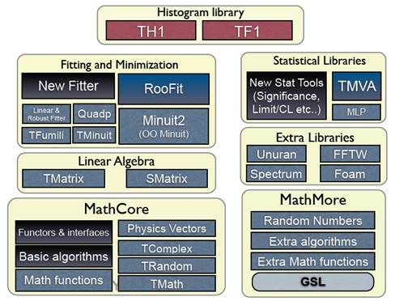
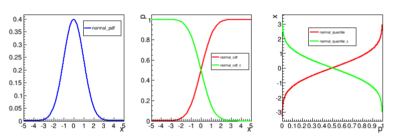
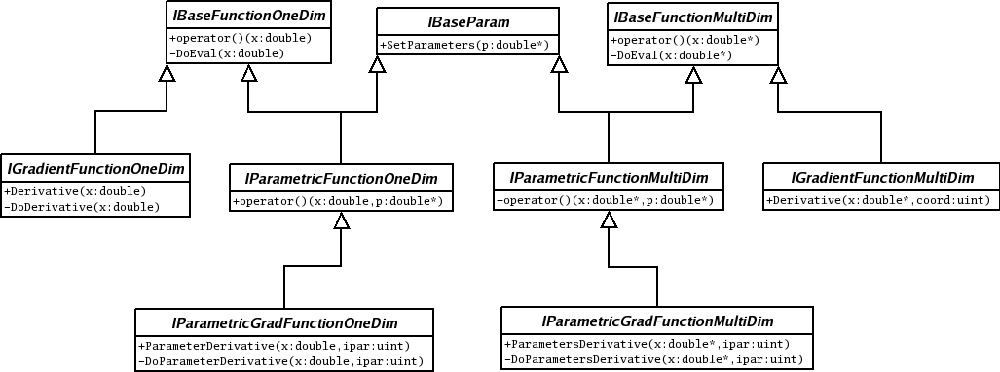
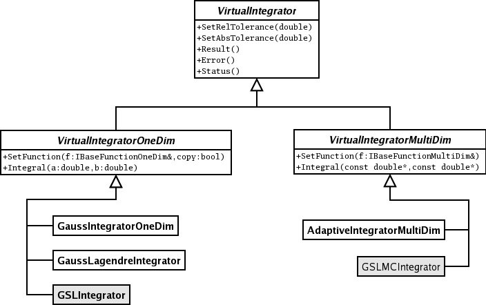
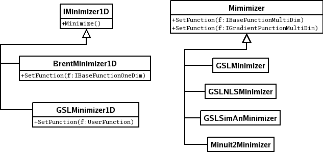

# Math Libraries in ROOT


The aim of Math libraries in ROOT is to provide and to support a
coherent set of mathematical and statistical functions. The latest
developments have been concentrated in providing first versions of the
`MathCore` and `MathMore` libraries, included in ROOT v5.08. Other
recent developments include the new version of `MINUIT`, which has been
re-designed and re-implemented in the C++ language. It is integrated in
ROOT. In addition, an optimized package for describing small matrices
and vector with fixed sizes and their operation has been developed
(`SMatrix`). The structure is shown in the following picture.




## MathCore Library

`MathCore` provides a collection of functions and C++ classes for
numerical computing. This library includes only the basic mathematical
functions and algorithms and not all the functionality required by the
physics community. A more advanced mathematical functionality is
provided by the `MathMore` library. The current set of included classes,
which are provided in the `ROOT::Math` namespace are:


-   Basic special functions like the gamma, beta and error function.

-   Mathematical functions used in statistics, such as the probability
    density functions and the cumulative distributions functions (lower
    and upper integral of the pdf's).

-   Generic function classes and interfaces
   for evaluating one-dimensional  (`ROOT::Math::IBaseFunctiononeDim`) and  multi-dimensional functions
    (`ROOT::Math::IBaseFunctionMultiDim`) and parametric function interfaces for evaluating functions with parameters in one 
    (`ROOT::Math::IParametricFunctionOneDim`) or multi dimensions (`ROOT::Math::IParametricFunctionMultiDim`).
	A set of user convenient wrapper classes, such as `ROOT::Math::Functor` is provided for wrapping user-classes in the needed interface,
	required to use the algorithms of the `ROOT` Mathematical libraries.

- Numerical algorithms interfaces and in same cases default implementations for:
    -  numerical integration;
    -  numerical differentiation;
	-  one dimensional root-finding;
	-  one-dimensional minimization;
	- multi-dimensional minimization (only the `ROOT::Math::Minimizer` interface)

- Fitting classes: set of classes for fitting generic data sets. These classes are provided in the namespace `ROOT::Fit`.
   They are describing separately in the Fitting chapter. 

The sets described above is independednt of ROOT libraries and can be built as a set of standalone classes.
In addition `MathCore` provides the following classes (depending on ROOT *libCore* library):

-  `TMath`: namespace with mathematical functions and basic function algorithms.
-  `TComplex`: class for complex numbers.
-   Random classes: the base class `TRandom` and the derived classes `TRandom1`, `TRandom2` and `TRandom3`, implementing the pseudo-random number generators.

A detailed description for all `MathCore` classes is available in the Doxygen
[online reference documentation](online reference documentation).

## MathMore Library 

The `MathMore` library provides an advanced collection of functions and
C++ classes for numerical computing. This is an extension of the
functionality provided by the `MathCore` library.
The `MathMore` library is implemented wrapping in C++ the GNU Scientific Library (GSL). 
The current set, provided in
the `ROOT::Math` namespace
include:

- Special mathematical functions (like Bessel functions, Legendre polynomials, etc.. )

- Additional mathematical functions used in statistics such as probability density
functions, cumulative distributions functions and their inverse which are not in `MathCore` but present in
the `GSL` library. 

- Numerical algorithms for one dimensional functions based on
implementation of the GNU Scientific Library (GSL):

-   Numerical integration classes implementing the  interface **`ROOT::Math::Integrator`**
    which is based on the Adaptive integration algorithms of QUADPACK

-   Numerical differentiation via **`ROOT::Math::GSLDerivator`**

-   Root finder implementing the  **`ROOT::Math::RootFinder`** interface, using different
    solver algorithms from GSL

-   one-dimensional Minimization implementing the interface**`ROOT::Math::IMinimizer1D`** 

-   Interpolation via **`ROOT::Math::Interpolation`**. All the GSL
    interpolation types are supported

-   Function approximation based on Chebyshev polynomials via the class
    **`ROOT::Math::Chebyshev`**

-   Random number generators and distributions based on GSL using the `ROOT::Math::Random<Engine_type>` class.

-   Polynomial evaluation and root solvers

The mathematical functions are implemented as a set of free functions in
the namespace **`ROOT::Math`**. The naming used for the special
functions is the same proposed for the C++ standard (see C++ standard
extension [proposal document](proposal document)).The `MathMore` library
is implemented wrapping in C++ the GNU Scientific Library ( <GSL>).
Building `MathMore` requires a version of GSL larger or equal 1.8. The
source code of `MathMore` is distributed under the GNU General Public
License.

`MathMore` (and its ROOT Cling dictionary) can be built within ROOT
whenever a GSL library is found in the system. The GSL library and
header file location can be specified in the ROOT configure script, by
doing:

```
./configure --with-gsl-incdir=... --with-gsl-libdir=...
```

`MathMore` can be built also a stand-alone library (without requiring
ROOT) downloding the tar file from the Web at this link. In this case
the library will not contain the dictionary information and therefore
cannot be used interactively

More information on the classes and functions present in `MathMore` is
available in the
[online reference documentation](online reference documentation).


## TMath


In the namespace, **`TMath`**, a collection of free functions is provided for the following functionality:

-   numerical constants (like `pi`, `e`, `h`, etc.);

-   trigonometric and elementary mathematical functions; 

-   functions to work with arrays and collections (e.g. functions to find `min` and `max` of arrays);

-   statistic functions to work on array of data (e.g.  mean and `RMS` of arrays);

-   algorithms for binary search/hashing sorting;

-   special mathematical functions like `Bessel`, `Erf`, `Gamma`, etc.;

-   statistical functions, like common probability and cumulative
(quantile) distributions

-   geometrical functions. 

For more details, see the reference documentation of **`TMath`** at
<http://root.cern.ch/root/htmldoc/TMath.html>.


### Numerical Constants

`TMath` offers a wide range of constants in the form of inline functions. Notice that they are not defined as C/C++ preprocessor macros. This set of functions includes one or more definitions for the following constants:

* Pi.
* Base of natural logarithm.
* Velocity of light.
* Gravitational constant (G).
* Standard acceleration of gravity (g).
* Standard acceleration of Gravity.
* Plank's contant.
* Boltzmann's and Steffan-Boltzmann's constants.
* Avogadro's number.
* Universal gas constant.
* Molecular weight of dry air.
* Dry air gas constant.
* Euler-Mascheroni Constant.
* Elementary charge.

### Elementary Functions

A set of miscellaneous elementary mathematical functions is provided along with a set of basic trigonometrical functions. Some of this functions refer to basic mathematical functions like the square root, the power to a number of the calculus of a logarithm, while others are used for number treatment, like rounding.

Although there are some functions that are not in the standard C math library (like `Factorial`), most of the functionality offered here is just a wrapper of the first ones. Nevertheless, some of the them also offer some security checks or a better precision, like the trigonometrical functions `ASin(x)`, `ACos(x)` or `ATan(x)`.

```{.cpp}
 // Generate a vector with 10 random numbers
 vector<double> v(10);
 std::generate(v.begin(), v.end(), rand);

 // Find the minumum value of the vector (iterator version)
 vector<double>::iterator it;
 it = TMath::LocMin(v.begin(), v.end());
 std::cout << *it << std::endl;

 // The same with the old-style version
 int i;
 i = TMath::LocMin(10, &v[0]);
 std::cout << v[i] << std::endl;
 ```
 
Another example of these functions can be found in $ROOTSYS/tutorials/permute.C.

### Statistic Functions Operating on Arrays.

This set of functions processes arrays to calculate:

* Mean.
* Median.
* Geometrical mean.
* Sample Standard Deviation (*RMS*).
* The kth smallest element.

These functions, as the array algorithms, have two different interfaces. An old-style one where the size of the array is passed as a first argument followed by a pointer to the array itself
and a modern C++-like  interface that receives two iterators to it.

```{.cpp}
 // Size of the array
 const int n = 100;

 // Vector v with random values
 vector<double> v(n);
 std::generate(v.begin(), v.end(), rand);

 // Weight vector w
 vector<double> w(n);
 std::fill(w.begin(), w.end, 1);

 double mean;

 // Calculate the mean of the vector
 // with iterators
 mean = TMath::Mean(v.begin(), v.end());

 // old-style
 mean = TMath::Mean(n, &v[0]);

 // Calculate the mean with a weight vector
 // with iterators
 mean = TMath::Mean(v.begin(), v.end(), w.begin());

 // old-style
 mean = TMath::Mean(n, &v[0], &w[0]);
 ```
 
### Special and Statistical Functions.

`TMath` also provides special functions like Bessel, Error functions, Gamma or similar plus statistical mathematical functions, including probability density functions, cumulative distribution and their inverse.

The majority of the special functions and the statitical distributions are provided also as free functions in the `ROOT::Math` namespace.
See one of the next paragraph for the complete description of the functions provided in `ROOT::Math`.
The user is encourage to use those versions of the algorithms rather than the ones in TMath.

Functions not present in `ROOT::Math` and provided only by `TMath` are:

* Special functions:
  * DiLogarithm
  * Struve

* Statistical functions:
   * KolmogorovProb
   * Voigt function
   * LaplaceDist
   * Vavilov
   
The example tutorial `GammaFun.C` and `mathBeta.C` in `$ROOTSYS/tutorials` shows an example of use of the `ROOT::Math` special functions


## Random Numbers


In ROOT pseudo-random numbers can be generated using the **`TRandom`**
classes. 4 different types exist: **`TRandom`**, **`TRandom1`**,
**`TRandom2`** and **`TRandom3`**. All they implement a different type
of random generators. **`TRandom`** is the base class used by others. It
implements methods for generating random numbers according to
pre-defined distributions, such as Gaussian or Poisson.

### TRandom


Pseudo-random numbers are generated using a linear congruential random
generator. The multipliers used are the same of the BSD `rand()` random
generator. Its sequence is:

$x_{n+1} = (ax_n + c) \bmod{m}$ with $a =1103515245$,
$c = 12345$ and $m =2^{31}$.

This type of generator uses a state of only a 32 bit integer and it has
a very short period, 2^31^,about 10^9^, which can be exhausted in just
few seconds. The quality of this generator is therefore BAD and it is
strongly recommended to NOT use for any statistical study.

### TRandom1


This random number generator is based on the Ranlux engine, developed by
M. Lüsher and implemented in Fortran by F. James. This engine has
mathematically proven random proprieties and a long period of about
10^171^. Various luxury levels are provided `(1,2,3,4)` and can be
specified by the user in the constructor. Higher the level, better
random properties are obtained at a price of longer CPU time for
generating a random number. The level 3 is the default, where any
theoretical possible correlation has very small chance of being
detected. This generator uses a state of 24 32-bits words. Its main
disadvantage is that is much slower than the others (see timing table).
For more information on the generator see the following article:

-   F. James, "RANLUX: A Fortran implementation of the high quality
    pseudo-random number generator of Lüscher", Computer Physics
    Communication, 79 (1994) 111.

### TRandom2


This generator is based on the maximally equidistributed combined
Tausworthe generator by L'Ecuyer. It uses only 3 32-bits words for the
state and it has a period of about 10^26^. It is fast and given its
small states, it is recommended for applications, which require a very
small random number size. For more information on the generator see the
following article:

-   P. L'Ecuyer, "Maximally Equidistributed Combined Tausworthe
    Generators", Mathematics of Computation, 65, 213 (1996), 203-213.

### TRandom3


This is based on the Mersenne and Twister pseudo-random number
generator, developed in 1997 by Makoto Matsumoto and Takuji Nishimura.
The newer implementation is used, referred in the literature as MT19937.
It is a very fast and very high quality generator with a very long
period of 10^6000^. The disadvantage of this generator is that it uses a
state of 624 words. For more information on the generator see the
following article:

-   M. M. Matsumoto and T. Nishimura, "Mersenne twister: A
    623-dimensionally equidistributed uniform pseudorandom number
    generator", ACM Trans. on Modeling and Computer Simulations, 8, 1,
    (1998), 3-20.

**`TRandom3`** is the recommended random number generator, and it is
used by default in ROOT using the global ***`gRandom`*** object (see
chapter gRandom).

### Seeding the Generators


The seeds for the generators can be set in the constructor or by using
the `SetSeed` method. When no value is given the generator default seed
is used, like 4357 for **`TRandom3`**. In this case identical sequence
will be generated every time the application is run. When the 0 value is
used as seed, then a unique seed is generated using a **`TUUID`**, for
**`TRandom1`**, **`TRandom2`** and **`TRandom3`**. For **`TRandom`** the
seed is generated using only the machine clock, which has a resolution
of about 1 sec. Therefore identical sequences will be generated if the
elapsed time is less than a second.

### Examples of Using the Generators


The method `Rndm()` is used for generating a pseudo-random number
distributed between 0 and 1 as shown in the following example:

``` {.cpp}
   // use default seed
   // (same random numbers will be generated each time)
   TRandom3 r; // generate a number in interval ]0,1] (0 is excluded)
   r.Rndm();
   double x[100];
   r.RndmArray(100,x); // generate an array of random numbers in ]0,1]
   TRandom3 rdm(111);      // construct with a user-defined seed
   // use 0: a unique seed will be automatically generated using TUUID
   TRandom1 r1(0);
   TRandom2 r2(0);
   TRandom3 r3(0);
   // seed generated using machine clock (different every second)
   TRandom r0(0);
```

### Random Number Distributions


The **`TRandom`** base class provides functions, which can be used by
all the other derived classes for generating random variates according
to predefined distributions. In the simplest cases, like in the case of
the exponential distribution, the non-uniform random number is obtained
by applying appropriate transformations. In the more complicated cases,
random variates are obtained using acceptance-rejection methods, which
require several random numbers.

``` {.cpp}
TRandom3 r;
   // generate a gaussian distributed number with:
   // mu=0, sigma=1 (default values)
   double x1 = r.Gaus();
   double x2 = r.Gaus(10,3);    // use mu = 10, sigma = 3;
```

The following table shows the various distributions that can be
generated using methods of the **`TRandom`** classes. More information
is available in the reference documentation for **`TRandom`**. In
addition, random numbers distributed according to a user defined
function, in a limited interval, or to a user defined histogram, can be
generated in a very efficient way using **`TF1::`**GetRandom() or
**`TH1::`**GetRandom().

+-------------------------------------------+--------------------------------+
| Distributions                             | Description                    |
+-------------------------------------------+--------------------------------+
| `Double_t Uniform(Double_t x1,Double_t x2 | Uniform random numbers between |
| )`                                        | `x1,x2`                        |
+-------------------------------------------+--------------------------------+
| `Double_t Gaus(Double_t mu,Double_t sigma | Gaussian random numbers.       |
| )`                                        |                                |
|                                           | Default values: `mu=0`,        |
|                                           | `sigma=1`                      |
+-------------------------------------------+--------------------------------+
| `Double_t Exp(Double_t tau)`              | Exponential random numbers     |
|                                           | with mean tau.                 |
+-------------------------------------------+--------------------------------+
| `Double_t Landau(Double_t mean,Double_t s | Landau distributed random      |
| igma)`                                    | numbers.                       |
|                                           |                                |
|                                           | Default values: `mean=0`,      |
|                                           | `sigma=1`                      |
+-------------------------------------------+--------------------------------+
| `Double_t BreitWigner(Double_t mean,`     | Breit-Wigner distributed       |
|                                           | random numbers.                |
| `                     Double_t gamma)`    |                                |
|                                           | Default values `mean=0`,       |
|                                           | `gamma=1`                      |
+-------------------------------------------+--------------------------------+
| `Int_t Poisson(Double_t mean) `           | Poisson random numbers         |
|                                           |                                |
| `Double_t PoissonD(Double_t mean)`        |                                |
+-------------------------------------------+--------------------------------+
| `Int_t  Binomial(Int_t ntot,Double_t prob | Binomial Random numbers        |
| )`                                        |                                |
+-------------------------------------------+--------------------------------+
| `Circle(Double_t &x,Double_t &y,Double_t  | Generate a random 2D point     |
| r)`                                       | `(x,y)` in                     |
|                                           |                                |
|                                           | a circle of radius `r`         |
+-------------------------------------------+--------------------------------+
| `Sphere(Double_t &x,Double_t &y,`         | Generate a random 3D point     |
|                                           | `(x,y,z)` in                   |
| `       Double_t &z,Double_t r)`          |                                |
|                                           | a sphere of radius `r`         |
+-------------------------------------------+--------------------------------+
| `Rannor(Double_t &a,Double_t &b)`         | Generate a pair of Gaussian    |
|                                           | random                         |
|                                           |                                |
|                                           | numbers with `mu=0` and        |
|                                           | `sigma=1`                      |
+-------------------------------------------+--------------------------------+

### UNURAN


An interface to a new package, UNU.RAN, (Universal Non Uniform Random
number generator for generating non-uniform pseudo-random numbers) was
introduced in ROOT v5.16.

UNU.RAN is an ANSI C library licensed under GPL. It contains universal
(also called automatic or black-box) algorithms that can generate random
numbers from large classes of continuous (in one or multi-dimensions),
discrete distributions, empirical distributions (like histograms) and
also from practically all standard distributions. An extensive online
documentation is available at the UNU.RAN Web Site
<http://statmath.wu-wien.ac.at/unuran/>

The ROOT class **`TUnuran`** is used to interface the UNURAN package. It
can be used as following:

-   With the UNU.RAN native, string API for pre-defined distributions
    (see UNU.RAN documentation for the allowed string values at
    <http://statistik.wu-wien.ac.at/unuran/doc/unuran.html> ):

``` {.cpp}
   TUnuran unr;
   // initialize unuran to generate normal random numbers using
   // a "arou" method
   unr.Init("normal()","method=arou");
   ...
   // sample distributions N times (generate N random numbers)
   for (int i = 0; i<N; ++i)
      double x = unr.Sample();
```

-   For continuous 1D distribution object via the class
    **`TUnuranContDist`** that can be created for example from a
    **`TF1`** function providing the pdf (probability density function)
    . The user can optionally provide additional information via
    `TUnuranContDist::SetDomain(min,max)` like the `domain()` for
    generating numbers in a restricted region.

``` {.cpp}
   // 1D case: create a distribution from two TF1 object
   // pointers pdfFunc
   TUnuranContDist  dist( pdfFunc);
   // initialize unuran passing the distribution and a string
   // defining the method
   unr.Init(dist, "method=hinv");
   // sample distribution  N times (generate N random numbers)
   for (int i = 0; i < N; ++i)
      double x = unr.Sample();
```

-   For multi-dimensional distribution via the class
    **`TUnuranMultiContDist`**, which can be created from a the
    multi-dimensional pdf.

``` {.cpp}
   // Multi- dimensional case from a TF1 (TF2 or TF3) objects
   TUnuranMultiContDist  dist( pdfFuncMulti);
   // the recommended method for multi-dimensional function is "hitro"
   unr.Init(dist,"method=hitro");
   // sample distribution  N times (generate N random numbers)
   double x[NDIM];
   for (int i = 0; i<N; ++i)
      unr.SampleMulti(x);
```

-   For discrete distribution via the class **`TUnuranDiscrDist`**,
    which can be initialized from a **`TF1`** or from a vector of
    probabilities.

``` {.cpp}
   // Create distribution from a vector of probabilities
   double pv[NSize] = {0.1,0.2,...};
   TUnuranDiscrDist dist(pv,pv+NSize);
   // the recommended method for discrete distribution is
   unr.Init(dist, "method=dgt");
   // sample N times (generate N random numbers)
   for (int i = 0; i < N; ++i)
      int k = unr.SampleDiscr();
```

-   For empirical distribution via the class **`TUnuranEmpDist`**. In
    this case one can generate random numbers from a set of un-bin or
    bin data. In the first case the parent distribution is estimated by
    UNU.RAN using a gaussian kernel smoothing algorithm. The
    **`TUnuranEmpDist`** distribution class can be created from a vector
    of data or from **`TH1`** (using the bins or from its buffer for
    un-binned data).

``` {.cpp}
   // Create distribution from a set of data
   // vdata is an std::vector containing the data
   TUnuranEmpDist  dist(vdata.begin(),vdata.end());
   unr.Init(dist);
   // sample N times (generate N random numbers)
   for (int i = 0; i<N; ++i)
      double x = unr.Sample();
```

-   For some predefined distributions, like `Poisson` and `Binomial`,
    one can use directly a function in the **`TUnuran`** class. This is
    more convenient in passing distribution parameters than using
    directly the string interface.

``` {.cpp}
   TUnuran unr;
   // Initialize unuran to generate normal random numbers from the
   // Poisson distribution with parameter mu
   unr.InitPoisson(mu);
   ...
   // Sample distributions N times (generate N random numbers)
   for (int i = 0; i<N; ++i)
      int k = unr.SampleDiscr();
```

Functionality is also provided via the C++ classes for using a different
random number generator by passing a TRandom pointer when constructing
the **`TUnuran`** class (by default the ROOT ***`gRandom`*** is passed
to UNURAN).

### Performances of Random Numbers


Here are the CPU times obtained using the four random classes on an
`lxplus` machine with an Intel 64 bit architecture and compiled using gcc
3.4:

+--------------------+---------------+----------------+----------------+----------------+
|                    | **`TRandom`** | **`TRandom1`** | **`TRandom2`** | **`TRandom3`** |
|                    | (ns/call)     | (ns/call)      | (ns/call)      |  (ns/call)     |
+--------------------+---------------+----------------+----------------+----------------+
| `Rndm()`           | -             | -              | 6              |  9             |
+--------------------+---------------+----------------+----------------+----------------+
| `Gaus()`           | 31            | 161            | 35             |  42            |
+--------------------+---------------+----------------+----------------+----------------+
| `Rannor()`         | 116           | 216            | 126            |  130           |
+--------------------+---------------+----------------+----------------+----------------+
| `Poisson(m-10)`    | 147           | 1161           | 162            |  239           |
+--------------------+---------------+----------------+----------------+----------------+
| `Poisson(m=10)`    | 80            | 294            | 89             |  99            |
| `UNURAN`           |               |                |                |                |
+--------------------+---------------+----------------+----------------+----------------+


## Mathematical Functions


The mathematical functions are present in both `MathCore` and `MathMore`
libraries. All mathematical functions are implemented as free functions
in the namespace **`ROOT::Math`**. The most used functions are in the
`MathCore` library while the others are in the `MathMore` library. The
functions in `MathMore` are all using the implementation of the GNU
Scientific Library (GSL). The naming of the special functions is the
same defined in the C++
[Technical Report on Standard Library extensions](Technical Report on
Standard Library extensions).
The special functions are defined in the header file `Math/SpecFunc.h`.

### Special Functions in MathCore


-   `ROOT::Math::beta(double x,double y) - `evaluates the beta function:
    $$B(x,y) = \frac{\Gamma(x) \Gamma(y)}{\Gamma(x+y)}$$

-   `double ROOT::Math::erf(double x)` - evaluates the error function
    encountered in integrating the normal
    distribution:
    $$erf(x) = \frac{2}{\sqrt{\pi}} \int_{0}^{x} e^{-t^2} dt$$

-   `double ROOT::Math::erfc(double x)` - evaluates the complementary
    error function:
    $$erfc(x) = 1 - erf(x) = \frac{2}{\sqrt{\pi}} \int_{x}^{\infty} e^{-t^2} dt$$

-   `double ROOT::Math::tgamma(double x)` - calculates the gamma
    function:
    $$\Gamma(x) = \int_{0}^{\infty} t^{x-1} e^{-t} dt$$

### Special Functions in MathMore


-   `double ROOT::Math::assoc_legendre(unsigned l,unsigned m,double x) -`computes
    the associated Legendre polynomials (with `m>=0`, `l>=m` and
    `|x|<1)`:
    $$P_{l}^{m}(x) = (1-x^2)^{m/2} \frac{d^m}{dx^m} P_{l}(x)$$

-   `double ROOT::Math::comp_ellint_1(double k)` - calculates the
    complete elliptic integral of the first kind (with $0 \le k^2 \le 1$:
    $$
    K(k) = F(k, \pi / 2) = \int_{0}^{\pi /2} \frac{d \theta}{\sqrt{1 - k^2 \sin^2{\theta}}}
    $$

-   `double ROOT::Math::comp_ellint_2(double k)` - calculates the
    complete elliptic integral of the second kind (with $0 \le k^2 \le 1$):
    $$
    E(k) = E(k , \pi / 2) = \int_{0}^{\pi /2} \sqrt{1 - k^2 \sin^2{\theta}} d \theta
    $$

-   `double ROOT::Math::comp_ellint_3(double n,double k)` - calculates
    the complete elliptic integral of the third kind (with $0 \le k^2 \le 1$):
    $$
    \Pi (n, k, \pi / 2) = \int_{0}^{\pi /2} \frac{d \theta}{(1 - n \sin^2{\theta})\sqrt{1 - k^2 \sin^2{\theta}}}
    $$

-   `double ROOT::Math::conf_hyperg(double a,double b,double z)` -
    calculates the confluent hyper-geometric functions of the first
    kind:
    $$
     _{1}F_{1}(a;b;z) = \frac{\Gamma(b)}{\Gamma(a)} \sum_{n=0}^{\infty} \frac{\Gamma(a+n)}{\Gamma(b+n)} \frac{z^n}{n!}
    $$

-   `double ROOT::Math::conf_hypergU(double a,double b,double z)` -
    calculates the confluent hyper-geometric
    functions of the second kind, known also as Kummer function of the second type. It is
    related to the confluent hyper-geometric function of the first kind:
    $$
    U(a,b,z) = \frac{ \pi}{ \sin{\pi b } } \left[ \frac{ _{1}F_{1}(a,b,z) } {\Gamma(a-b+1) } - \frac{ z^{1-b} { _{1}F_{1}}(a-b+1,2-b,z)}{\Gamma(a)} \right]
    $$

-   `double ROOT::Math::cyl_bessel_i(double nu,double x)` - calculates
    the modified Bessel function of the first kind, also called regular
    modified (cylindrical) Bessel function:
    $$
    I_{\nu} (x) = i^{-\nu} J_{\nu}(ix) = \sum_{k=0}^{\infty} \frac{(\frac{1}{2}x)^{\nu + 2k}}{k! \Gamma(\nu + k + 1)}
    $$

-   `double ROOT::Math::cyl_bessel_j(double nu,double x)` - calculates
    the (cylindrical) Bessel function of the first kind, also called
    regular (cylindrical) Bessel function:
    $$
    J_{\nu} (x) = \sum_{k=0}^{\infty} \frac{(-1)^k(\frac{1}{2}x)^{\nu + 2k}}{k! \Gamma(\nu + k + 1)}
    $$

-   `double ROOT::Math::cyl_bessel_k(double nu,double x)` - calculates
    the modified Bessel function of the second kind, also called
    irregular modified (cylindrical) Bessel function for $x > 0$, $v > 0$:
    $$
    K_{\nu} (x) = \frac{\pi}{2} i^{\nu + 1} (J_{\nu} (ix) + iN(ix)) = \left\{ \begin{array}{cl} \frac{\pi}{2} \frac{I_{-\nu}(x) - I_{\nu}(x)}{\sin{\nu \pi}} & \mbox{for non-integral $\nu$} \\ \frac{\pi}{2} \lim{\mu \to \nu} \frac{I_{-\mu}(x) - I_{\mu}(x)}{\sin{\mu \pi}} & \mbox{for integral $\nu$} \end{array} \right.
    $$

-   `double ROOT::Math::cyl_neumann(double nu,double x)` - calculates
    the (cylindrical) Bessel function of the second kind, also called
    irregular (cylindrical) Bessel function or (cylindrical) Neumann
    function:
    $$
    N_{\nu} (x) = Y_{\nu} (x) = \left\{ \begin{array}{cl} \frac{J_{\nu} \cos{\nu \pi}-J_{-\nu}(x)}{\sin{\nu \pi}} & \mbox{for non-integral $\nu$} \\ \lim{\mu \to \nu} \frac{J_{\mu} \cos{\mu \pi}-J_{-\mu}(x)}{\sin{\mu \pi}} & \mbox{for integral $\nu$} \end{array} \right.
    $$

-   `double ROOT::Math::ellint_1(double k,double phi)` - calculates
    incomplete elliptic integral of the first kind (with $0 \le k^2 \le 1$):
    $$
    K(k) = F(k, \pi / 2) = \int_{0}^{\pi /2} \frac{d \theta}{\sqrt{1 - k^2 \sin^2{\theta}}}
    $$

-   `double ROOT::Math::ellint_2(double k,double phi)` - calculates
    the complete elliptic integral of the second kind (with $0 \le k^2 \le 1$):
    $$
    E(k) = E(k , \pi / 2) = \int_{0}^{\pi /2} \sqrt{1 - k^2 \sin^2{\theta}} d \theta
    $$

-   `double ROOT::Math::ellint_3(double n,double k,double phi)` - calculates
    the complete elliptic integral of the third kind (with $0 \le k^2 \le 1$):
    $$
    \Pi (n, k, \pi / 2) = \int_{0}^{\pi /2} \frac{d \theta}{(1 - n \sin^2{\theta})\sqrt{1 - k^2 \sin^2{\theta}}}
    $$

-   `double ROOT::Math::expint(double x)` - calculates the exponential
    integral:
    $$
    Ei(x) = - \int_{-x}^{\infty} \frac{e^{-t}}{t} dt
    $$

-   `double ROOT::Math::hyperg(double a,double b,double c,double x)` -
    calculates Gauss' hyper-geometric function:
    $$
    _{2}F_{1}(a,b;c;x) = \frac{\Gamma(c)}{\Gamma(a) \Gamma(b)} \sum_{n=0}^{\infty} \frac{\Gamma(a+n)\Gamma(b+n)}{\Gamma(c+n)} \frac{x^n}{n!}
    $$

-   `double ROOT::Math::legendre(unsigned l,double x)` - calculates
    the Legendre polynomials for $l \ge 0$, $|x| \le 1$  in the Rodrigues
    representation:
    $$
    P_{l}(x) = \frac{1}{2^l l!} \frac{d^l}{dx^l} (x^2 - 1)^l
    $$

-   `double ROOT::Math::riemann_zeta(double x)` - calculates the
    Riemann zeta function:
    $$
    \zeta (x) = \left\{ \begin{array}{cl} \sum_{k=1}^{\infty}k^{-x} & \mbox{for $x > 1$} \\ 2^x \pi^{x-1} \sin{(\frac{1}{2}\pi x)} \Gamma(1-x) \zeta (1-x) & \mbox{for $x < 1$} \end{array} \right.
    $$

-   `double ROOT::Math::sph_bessel(unsigned n,double x)` - calculates
    the spherical Bessel functions of the first kind (also called
    regular spherical Bessel functions):
    $$
    j_{n}(x) = \sqrt{\frac{\pi}{2x}} J_{n+1/2}(x)
    $$

-   `double ROOT::Math::sph_neumann(unsigned n,double x)` - calculates
    the spherical Bessel functions of the second kind (also called
    irregular spherical Bessel functions or spherical Neumann
    functions):
    $$
    n_n(x) = y_n(x) = \sqrt{\frac{\pi}{2x}} N_{n+1/2}(x)
    $$

### Probability Density Functions (PDF)


Probability density functions of various distributions. All the
functions, apart from the discrete ones, have the extra location
parameter `x0`, which by default is zero. For example, in the case of a
gaussian `pdf`, `x0` is the `mean`, `mu`, of the distribution. All the
probability density functions are defined in the header file
`Math/DistFunc.h` and are part of the `MathCore` libraries. The
definition of these functions is documented in the
[reference doc for statistical functions](reference doc for statistical functions):

``` {.cpp}
double ROOT::Math::beta_pdf(double x,double a, double b);
double ROOT::Math::binomial_pdf(unsigned int k,double p,unsigned int n);
double ROOT::Math::breitwigner_pdf(double x,double gamma,double x0=0);
double ROOT::Math::cauchy_pdf(double x,double b=1,double x0=0);
double ROOT::Math::chisquared_pdf(double x,double r,double x0=0);
double ROOT::Math::exponential_pdf(double x,double lambda,double x0=0);
double ROOT::Math::fdistribution_pdf(double x,double n,double m,double x0=0);
double ROOT::Math::gamma_pdf(double x,double alpha,double theta,double x0=0);
double ROOT::Math::gaussian_pdf(double x,double sigma,double x0=0);
double ROOT::Math::landau_pdf(double x,double s,double x0=0);
double ROOT::Math::lognormal_pdf(double x,double m,double s,double x0=0);
double ROOT::Math::normal_pdf(double x,double sigma,double x0=0);
double ROOT::Math::poisson_pdf(unsigned int n,double mu);
double ROOT::Math::tdistribution_pdf(double x,double r,double x0=0);
double ROOT::Math::uniform_pdf(double x,double a,double b,double x0=0);
```

### Cumulative Distribution Functions (CDF)


For all the probability density functions, we have the corresponding
cumulative distribution functions and their complements. The functions
with extension `_cdf` calculate the lower tail integral of the
probability density function:

$$
D(x) = \int_{-\infty}^{x} p(x') dx'
$$

while those with the `cdf_c` extension calculate the upper tail of the
probability density function, so-called in statistics the survival
function. For example, the function:

``` {.cpp}
double ROOT::Math::gaussian_cdf(double x,double sigma,double x0=0);
```
evaluates the lower tail of the Gaussian distribution:
$$
D(x) = \int_{-\infty}^{x} {1 \over \sqrt{2 \pi \sigma^2}} e^{-(x'-x_0)^2 / 2\sigma^2} dx'
$$

while the function:

``` {.cpp}
double ROOT::Math::gaussian_cdf_c(double x, double sigma, double x0=0);
```
evaluates the upper tail of the Gaussian distribution:
$$
D(x) = \int_{x}^{+\infty} {1 \over \sqrt{2 \pi \sigma^2}} e^{-(x'-x_0)^2 / 2\sigma^2} dx'
$$

The cumulative distributions functions are defined in the header file
`Math/ProbFunc.h`. The majority of the CDF's are present in the
`MathCore`, apart from the `chisquared`, `fdistribution`, `gamma` and
`tdistribution`, which are in the `MathMore` library.

#### Inverse of the Cumulative Distribution Functions(Quantiles)

For almost all the cumulative distribution functions (`_cdf`) and their
complements (`_cdf_c`) present in the library, we provide the inverse
functions. The inverse of the cumulative distribution function is called
in statistics quantile function. The functions with the extension
`_quantile` calculate the inverse of the cumulative distribution
function (lower tail integral of the probability density function),
while those with the *`quantile_c`* extension calculate the inverse of
the complement of the cumulative distribution (upper tail integral). All
the inverse distributions are in the MathMore library and are defined in
the header file `Math/ProbFuncInv.h`.

The following picture illustrates the available statistical functions
(PDF, CDF and quantiles) in the case of the normal distribution.



## Numerical Algorithms 

ROOT provides C++ classes implementing numerical algorithms to solve a wide set of problem, like:

* Evaluation of function derivatives.
* Evaluation of integrals. 
* Finding the roots of a function
* Finding the minimum/maximum of a function

In order to use these algorithm the user needs to provide a function.
ROOT provides a common way of specifying them via some interfaces

## ROOT::Math Function interfaces

To get a consistency in the mathematical methods within ROOT, there exists a set of interfaces to define the basic behaviour of a mathematical function.
In order to use the classes presented in this chapter, the mathematical functions defined by the user must inherit from any of the classes seen in the figure:




### One-dimensional Function Interfaces

These interfaces are used for numerical algorithms operating only on  one-dimensional functions and cannot be applied to multi-dimensional functions.  
For this case the users needs to  define a function object which evaluates in one dimension, and the object  will have to derivate from the following:

* `ROOT::Math::IBaseFunctionOneDim`: This class is the most basic function. Provides a method to evaluate the function given a value (simple double) by implementing
`double operator() (const double )`. The user class defined only needs to reimplement the pure abstract method `double DoEval(double x)`,
that will do the work of evaluating the function at point x.

Example on how to create a class that represents a mathematical function. The user only has to override two methods from `IBaseFunctionOneDim`:

```{.cpp}
#include "Math/IFunction.h"
 
class MyFunction: public ROOT::Math::IBaseFunctionOneDim
{
   double DoEval(double x) const
   {
      return x*x;
   }
 
   ROOT::Math::IBaseFunctionOneDim* Clone() const
   {
      return new MyFunction();
   }
};
```


* `ROOT::Math::IGradientFunctionOneDim`: Some of the numerical algorithm will need to calculate the derivatives of the function. In these cases, the user will have to provide the neccesary code for
  this to happen. The interface defined in `IGradientFunctionOneDim` introduced the method `double Derivative(double x)` that will return the derivative of the function at the point `x`. The class
  inherit by the user will have to implement the abstract method `double DoDerivative(double x)`, leaving the rest of the class untouched.

  Example for implementing a gradient one-dimensional function:

```{.cpp}
#include "Math/IFunction.h"
 
class MyGradientFunction: public ROOT::Math::IGradientFunctionOneDim
{
public:
   double DoEval(double x) const
   {
      return sin(x);
   }
 
   ROOT::Math::IBaseFunctionOneDim* Clone() const
   {
      return new MyGradientFunction();
   }
 
   double DoDerivative(double x) const
   {
      return -cos(x);
   }
 
}; 
```

### Multi-dimensional Function Interfaces


The most generic case of a multidimensional function has similar approach. Some examples will be shown next. It is important to notice, that one dimensional functions can be also implemented through
the interfaces that will be presented here. Nevertheless, the user needs to implement those following the indications of the previous chapter, for algorithm woring exclusivly on one-dimensional
functions. For algorithms working on both one-dimensional and multi-dimensional functions they should instead use this interface.

* `ROOT::Math::IBaseFunctionMultiDim`: This interface provides the `double operator() (const double*)` that takes an array of doubles with all the values for the different dimensions. In this case,
  the user has to provide the functionality for two different functions: `double DoEval(const double*)` and `unsigned int NDim()`. The first ones evaluates the function given the array that represents
  the multiple variables. The second returns the number of dimensions of the function.

   Example of implementing a  basic multi-dimensional function:

```{.cpp}
#include "Math/IFunction.h"
 
class MyFunction: public ROOT::Math::IBaseFunctionMultiDim
{
public:
   double DoEval(const double* x) const
   {
      return x[0] + sin(x[1]);
   }
 
   unsigned int NDim() const
   {
      return 2;
   }
 
   ROOT::Math::IBaseFunctionMultiDim* Clone() const
   {
      return new MyFunction();
   }
 
}; 
```

* `ROOT::Math::IGradientFunctionMultiDim`: This interface offers the same functionality as the base function plus the calcualtion of the derivative.
It only adds the `double Derivative(double* x, uint ivar)` method for the user to implement. This method must implement the derivative of the function with respect to the variable indicated with the
second parameter.

Example of implementing a multi-dimensional gradient function

```{.cpp}
#include "Math/IFunction.h"
 
class MyGradientFunction: public ROOT::Math::IGradientFunctionMultiDim
{
public:
   double DoEval(const double* x) const
   {
      return x[0] + sin(x[1]);
   }
 
   unsigned int NDim() const
   {
      return 2;
   }
 
   ROOT::Math::IGradientFunctionMultiDim* Clone() const
   {
      return new MyGradientFunction();
   }
 
   double DoDerivative(const double* x, unsigned int ipar) const
   {
      if ( ipar == 0 )
         return sin(x[1]);
      else
         return x[0] + x[1] * cos(x[1]);
   }
 
};
```

### Parametric Function Interfaces

These interfaces, for evaluating multi-dimensional functions are used for fitting. These interfaces are defined in the header file
`Math/IParamFunction.h`. 
See also the documentation of the `ROOT::Fit` classes in the Fitting chaper for more information.

* **`ROOT::Math::IParametricFunctionMultiDim`**: Describes a multi dimensional parametric function. Similarly to the one dimensional version, the user needs to provide the
method `void SetParameters(double* p)` as well as the getter methods `const double * Parameters()` and `uint NPar()`.
Example of creating a parametric function: 

```{.cpp}
#include "Math/IFunction.h"
#include "Math/IParamFunction.h"
 
class MyParametricFunction: public ROOT::Math::IParametricFunctionMultiDim
{
private:
   const double* pars;
 
public:
   double DoEvalPar(const double* x, const double* p) const
   {
      return p[0] * x[0] + sin(x[1]) + p[1];
   }
 
   unsigned int NDim() const
   {
      return 2;
   }
 
   ROOT::Math::IParametricFunctionMultiDim* Clone() const
   {
      return new MyParametricFunction();
   }
 
   const double* Parameters() const 
   {
      return pars;
   }
 
   void SetParameters(const double* p)
   {
      pars = p;
   }
 
   unsigned int NPar() const
   {
      return 2;
   }
};
```

* **`ROOT::Math::IParametricGradFunctionMultiDim`**:
Provides an interface for parametric gradient multi-dimensional functions. In addition to function evaluation it provides the gradient with respect to the parameters,
via the method `ParameterGradient()`. This interface is only used in case of some dedicated fitting algorithms, when is required or more efficient to provide derivatives with respect to the
parameters. Here is an example:

```{.cpp}
#include "Math/IFunction.h"
#include "Math/IParamFunction.h"
 
class MyParametricGradFunction: 
          public ROOT::Math::IParametricGradFunctionMultiDim
{
private:
   const double* pars;
 
public:
   double DoEvalPar(const double* x, const double* p) const
   {
      return p[0] * x[0] + sin(x[1]) + p[1];
   }
 
   unsigned int NDim() const
   {
      return 2;
   }
 
   ROOT::Math::IParametricGradFunctionMultiDim* Clone() const
   {
      return new MyParametricGradFunction();
   }
 
   const double* Parameters() const 
   {
      return pars;
   }
 
   void SetParameters(const double* p)
   {
      pars = p;
   }
 
   unsigned int NPar() const
   {
      return 2;
   }
 
   double DoParameterDerivative(const double* x, const double* p,
                                unsigned int ipar) const
   {
      if ( ipar == 0 )
         return sin(x[1]) + p[1];
      else
         return p[0] * x[0] + x[1] * cos(x[1]) + p[1];
   }
};
```

### Wrapper Functions

To facilitate the user to insert their own type of function in the needed function interface, helper classes, wrapping the user interface in the
`ROOT::Math` function interfaces are provided.
this will avoid the user to re-implement dedicated funcition classes, following the code example shown in the previous paragraphs.

There is one possible wrapper for every interface explained in the previous section.
The following table indicates the wrapper for the most basic ones:


| **Interface**|   **Function Wrapper**    | 
|------------------------------------------|------------------------|
| `ROOT::Math::IBaseFunctionOneDim`              | `ROOT::Math::Functor1D` |
| `ROOT::Math::IGradientFunctionOneDim`        | `ROOT::Math::GradFunctor1D` |
| `ROOT::Math::IBaseFunctionMultiDim`             | `ROOT::Math::Functor` |
| `ROOT::Math::IGradientFunctionMultiDim`       | `ROOT::Math::GradFunctor` |


Thee functor wrapper are defined in the header file `Math/Functor.h`.

#### Wrapping One Dimensional Functions

The `ROOT::Math::Functor1D` is used to wrap one-dimensional functions It can wrap all the following types:
* A free C function of type `double ()(double )`.
* Any C++ callable object implemention `double operator()( double )`.
* A class member function with the correct signature like `double Foo::Eval(double )`. In this case one pass the object pointer and a pointer to the member function `(&Foo::Eval)`.

Example:

```{.cpp}
#include "Math/Functor.h"
 
class MyFunction1D { 
   
public: 
 
   double operator()(double x) const { 
      return x*x; 
   } 
 
   double Eval(double x) const { return x+x; }
};
 
double freeFunction1D(double  x ) { 
   return 2*x; 
}
 
int main()
{
   // wrapping a free function
   ROOT::Math::Functor1D  f1(&freeFunction1D); 
 
   MyFunction1D myf1;
 
   // wrapping a function object implementing operator()
   ROOT::Math::Functor1D  f2(myf1); 
 
   // wrapping a class member function 
   ROOT::Math::Functor1D f3(&myf1,&MyFunction1D::Eval); 
 
   cout << f1(2) << endl;
   cout << f2(2) << endl;
   cout << f3(2) << endl;
 
   return 0;
}
```


#### Wrapping One Dimensional Gradient Functions

The `ROOT::Math::GradFunctor1D`  class is used to wrap one-dimensional gradient functions. It can be constructed in three different ways:
* Any object implementing both `double operator()( double)` for the function evaluation and `double Derivative(double)` for the function derivative.
* Any object implementing any member function like `Foo::XXX(double )` for the function evaluation and any other member function like `Foo::YYY(double )` for the derivative.
* Any two function objects implementing `double operator()( double )` . One object provides the function evaluation, the other the derivative. One or both function object can be a  free C function of
type `double ()(double )`.

#### Wrapping Multi-dimensional Functions

The class `ROOT::Math::Functor`  is used to wrap in a very simple and convenient way multi-dimensional function objects. It can wrap all the following types:
* Any C++ callable object implementing `double operator()( const double * )`.
* A free C function of type `double ()(const double * )`.
* A member function with the correct signature like `Foo::Eval(const double * )`. In this case one pass the object pointer and a pointer to the member function `(&Foo::Eval)`.

The function dimension is required when constructing the functor.

Example of using `Functor`:
```{.cpp}
#include "Math/Functor.h"
 
class MyFunction { 
 
public: 
   double operator()(const double *x) const { 
      return x[0]+x[1]; 
   } 
 
   double Eval(const double * x) const { return x[0]+x[1]; }
};
 
double freeFunction(const double * x ) 
{ 
   return x[0]+x[1]; 
}
 
int main()
{
   // test directly calling the function object
   MyFunction myf;
 
   // test from a free function pointer
   ROOT::Math::Functor f1(&freeFunction,2); 
 
   // test from function object
   ROOT::Math::Functor f2(myf,2); 
 
   // test from a member function 
   ROOT::Math::Functor f3(&myf,&MyFunction::Eval,2); 
 
   double x[] = {1,2};
 
   cout << f1(x) << endl;
   cout << f2(x) << endl;
   cout << f3(x) << endl;
 
   return 0;
}
```


#### Wrapping Multi-dimensional Gradient Functions

The class `ROOT::Math::GradFunctor` is used to wrap in a very C++ callable object to make gradient functions. It can be constructed in three different way:
* From an object implementing both `double operator()( const double * )` for the function evaluation and `double Derivative(const double *, int icoord)` for the partial derivatives.
* From an object implementing any member function like `Foo::XXX(const double *)` for the function evaluation and any member function like `Foo::XXX(const double *, int icoord)` for the partial derivatives.
* From an function object implementing `double operator()( const double * )` for the function evaluation and another function object implementing `double operator() (const double *, int icoord)`
for the partial derivatives.

The function dimension is required when constructing the functor.

#### Special case: Wrapping TF1 objects in Parametric Function interfaces

In many cases, the user works with the `TF1` class. The mathematical library in ROOT provides some solutions to wrap these into the interfaces needed by other methods.
If the desired interface to wrap is one-dimensional, the class to use is `ROOT::Math::WrappedTF1`.
The default constructor takes a `TF1` reference as an argument, that will be wrapped with the interfaces of a `ROOT::Math::IParametricGradFunctionOneDim`.
Example:
```{.cpp}
#include "TF1.h"
#include "Math/WrappedTF1.h"
 
int main()
{
 
   TF1 f("Sin Function", "sin(x)+y",0,3);
 
   ROOT::Math::WrappedTF1 wf1(f);
 
   cout << f(1) << endl;
   cout << wf1(1) << endl;
 
   return 0;
}
```

For a TF1 defining a multidimensional function or in case we need to wrap in a multi-dimensional function interface,  the class to use is `ROOT::Math::WrappedMultiTF1`.
Following the usual procedure, setting the `TF1` though the constructor, will wrap it into a `ROOT::Math::IParametricGradFunctionMultiDim`.
Example:

```{.cpp}
#include "TF1.h"
#include "Math/WrappedMultiTF1.h"
 
int main()
{
 
   TF2 f("Sin Function", "sin(x) + y",0,3,0,2);
 
   ROOT::Math::WrappedMultiTF1 wf1(f);
 
   double x[] = {1,2};
 
   cout << f(x) << endl;
   cout << wf1(x) << endl;
 
   return 0;
}
```


## Numerical Integration

The algorithms provided by ROOT for numerical integration are implemented following the hierarchy shown in the next image.
`ROOT::Math::VirtualIntegrator` defines the most basic functionality while the specific behaviours for one or multiple dimensions are implemented in
`ROOT::Math::VirtualIntegratorOneDim` and `ROOT::Math::VirtualIntegratorMultiDim`.
These interfaces define the integrator functionality with abstract methods to set the function, to compute the integral or to set the integration tolerance.
These methods must be implemented in the concrete classes existing for the different integration algorithms.
The user cannot create directly these virtual integrator interfaces. He needs to create the
`ROOT::Math::IntegratorOneDim` class for integrating one-dimensional functions and `ROOT::Math::IntegratorMultiDim` for multi-dimensional functions.
Through the ROOT Plug-In Manager,  the user can initialize `ROOT::Math::IntegratorOneDim` or  `ROOT::Math::IntegratorMultiDim` with 
any of the concrete integration classes without dealing with them directly.
These two classes provide the same interface as in `VirtualIntegratorOneDim` and `VirtualIntegratorMultiDim`, but with the possibility to choose in the constructor,
which method will be used to perform the integration. 

The method to set the function to be integrated,  must be of the function interface type described before.
`ROOT::Math::IBaseFunctionOneDimFunction` is used for `ROOT::Math::IBaseFunctionMultiDim` and 
The only difference between the  `ROOT::Math::IntegratorOneDim`  and `ROOT::Math::IntegratorMultiDim` resides
in the dimensionality of that function and some specific that will be seen afterwards for the one dimensional one.



The rest of the classes shown above in the diagram are the specialized classes provided. Each one implements a different method that will be explained in detail. It is important
to notice that the two grayed classes (the one which name starts by GSL) are part of the *MathMore* library.
We will later show in more detail the differences between the implementations.


### Integration of One-dimensional Functions

#### Using `ROOT::Math::IntegratorOneDim`

Here is a code example on how to use the  `ROOT::Math::IntegratorOneDim` class
(note that the class is defined in the header file `Math/Integrator.h`). In this example we create
different instance of the class using some of the available algorithms in ROOT.
If no algorithm is specified, the default one is used. The default Integrator together with other integration options
such as relative and absolute tolerance, can be specified using the static method of the
`ROOT::Math::IntegratorOneDimOptions`

```{.cpp}
#include "Math/Integrator.h"

const double ERRORLIMIT = 1E-3;
 
double f(double x) { 
   return x; 
} 
 
double f2(const double * x) { 
   return x[0] + x[1]; 
} 
 
 
int testIntegration1D() { 
 
   const double RESULT = 0.5;
   int status = 0;

   // set default tolerances for all integrators
   ROOT::Math::IntegratorOneDimOptions::SetDefaultAbsTolerance(1.E-6);
   ROOT::Math::IntegratorOneDimOptions::SetDefaultRelTolerance(1.E-6);
 
   ROOT::Math::Functor1D wf(&f);
   ROOT::Math::Integrator ig(ROOT::Math::IntegrationOneDim::kADAPTIVESINGULAR); 
   ig.SetFunction(wf);
   double val = ig.Integral(0,1);
   std::cout << "integral result is " << val << std::endl;
   status += std::fabs(val-RESULT) > ERRORLIMIT;
 
   ROOT::Math::Integrator ig2(ROOT::Math::IntegrationOneDim::kNONADAPTIVE); 
   ig2.SetFunction(wf);
   val = ig2.Integral(0,1);
   std::cout << "integral result is " << val << std::endl;
   status += std::fabs(val-RESULT) > ERRORLIMIT;
 
   ROOT::Math::Integrator ig3(wf, ROOT::Math::IntegrationOneDim::kADAPTIVE); 
   val = ig3.Integral(0,1);
   std::cout << "integral result is " << val << std::endl;
   status += std::fabs(val-RESULT) > ERRORLIMIT;
 
   ROOT::Math::Integrator ig4(ROOT::Math::IntegrationOneDim::kGAUSS); 
   ig4.SetFunction(wf);
   val = ig4.Integral(0,1);
   std::cout << "integral result is " << val << std::endl;
   status += std::fabs(val-RESULT) > ERRORLIMIT;

   ROOT::Math::Integrator ig4(ROOT::Math::IntegrationOneDim::kLEGENDRE); 
   ig4.SetFunction(wf);
   val = ig4.Integral(0,1);
   std::cout << "integral result is " << val << std::endl;
   status += std::fabs(val-RESULT) > ERRORLIMIT;
 
   return status;
}
```

### One-dimensional Integration Algorithms

Here we provide a brief description of the different integration algorithms, which are also
implemented as separate classes. The algorithms can be instantiated using the following enumeration values:

| **Enumeration name**|   **Integrator class**    | 
|------------------------------------  |-------------------------------|
| `ROOT::Math::IntegratorOneDim::kGAUSS`      | `ROOT::Math::GaussianIntegrator`     |
| `ROOT::Math::IntegratorOneDim::kLEGENDRE`   | `ROOT::Math:::GausLegendreIntegrator` |
|  `ROOT::Math::Integration::kNONADAPTIVE`           |         `ROOT::Math:::GSLIntegrator`               |
|  `ROOT::Math::Integration::kADAPTIVE`           |         `ROOT::Math:::GSLIntegrator`               |
|  `ROOT::Math::Integration::kADAPTIVESINGULAR`           |         `ROOT::Math:::GSLIntegrator`               |

#### ROOT::Math:::GaussIntegrator

It uses the most basic Gaussian integration algorithm, it uses the 8-point and the 16-point Gaussian
quadrature approximations. It is derived from the `DGAUSS` rountine of the *CERNLIB* by S. Kolbig.
This class  
Here is an example of using directly  the `GaussIntegrator` class

```{.cpp}
#include "TF1.h"
#include "Math/WrappedTF1.h"
#include "Math/GaussIntegrator.h"
 
int main()
{
   TF1 f("Sin Function", "sin(x)", 0, TMath::Pi());
   ROOT::Math::WrappedTF1 wf1(f);
 
   ROOT::Math::GaussIntegrator ig;
 
   ig.SetFunction(wf1, false);
   ig.SetRelTolerance(0.001);
 
   cout << ig.Integral(0, TMath::PiOver2()) << endl;
 
   return 0;
}
```
#### ROOT::Math::GaussLegendreIntegrator

This class implementes the Gauss-Legendre quadrature formulas. This sort of numerical methods requieres that the user specifies the number of intermediate function points
used in the calculation of the integral. It will automatically determine the coordinates and weights of such points before performing the integration.
We can use the example above, but replacing the creation of a `ROOT::Math::GaussIntegrator` object with `ROOT::Math::GaussLegendreIntegrator`.

#### ROOT::Math::GSLIntegrator

This is a wrapper for the *QUADPACK* integrator implemented in the GSL library. It supports several integration methods that can be chosen in construction time.
The default type is adaptive integration with singularity applying a Gauss-Kronrod 21-point integration rule. For a detail description of the GSL methods visit the GSL user guide
This class implements the best algorithms for numerical integration for one dimensional functions. We encourage the use it as the main option, bearing in mind that it uses code from the
GSL library, wich is provided in the *MathMore* library of ROOT.

The interface to use is the same as above. We have now the possibility to specify a different integration algorithm in the constructor of the `ROOT::Math::GSLIntegrator` class. 
```{.cpp}
ROOT::Math::GSLIntegrator ig(ROOT::Math::Integration::kADAPTIVE, ROOT::Math::Integration::kGAUSS51);   // create the adaptive integrator with the 51 point rule
ig.SetRelTolerance(1.E-6);  // set relative tolerance
ig.SetAbsTolerance(1.E-6);   // set absoulte tolerance
```

The algorithm is controlled by the given absolute and relative tolerance. The iterations are continued until the following condition is satisfied
$$
absErr <= max ( epsAbs, epsRel * Integral)
$$
Where *absErr* is an estimate of the absolute error (it can be retrieved with `GSLIntegrator::Error()`)  and *Integral* is the estimate of the function integral
(it can be obtained with `GSLIntegrator::Result()`)

The possible integration algorithm types to use with the GSLIntegrator are the following. More information is provided in the `GSL` users documentation.
* `ROOT::Math::Integration::kNONADAPTIVE` : based on `gsl_integration_qng`. It is a non-adaptive procedure which uses fixed Gauss-Kronrod-Patterson abscissae
to sample the integrand at a maximum of 87 points. It is provided for fast integration of smooth functions.
* `ROOT::Math::Integration::kADAPTIVE`: based on `gsl_integration_qag`. It is an adaptiva Gauss-Kronrod integration algorithm, the integration region is divided into subintervals, and on each
iteration the subinterval with the largest estimated error is bisected. It is possible to specify the integration rule as an extra enumeration parameter. The possible rules are
     *  `Integration::kGAUSS15` : 15 points Gauss-Konrod rule (value = 1)
     *  `Integration::kGAUSS21` : 21 points Gauss-Konrod rule (value = 2)
     *  `Integration::kGAUSS31` : 31 points Gauss-Konrod rule (value = 3)
     *  `Integration::kGAUSS41` : 41 points Gauss-Konrod rule (value = 4)
     *  `Integration::kGAUSS51` : 51 points Gauss-Konrod rule (value = 5)
     *  `Integration::kGAUSS61` : 61 points Gauss-Konrod rule (value = 6)
	 The higher-order rules give better accuracy for smooth functions, while lower-order rules save time when the function contains local difficulties, such as discontinuities. If no integration rule
	 is passed, the 31 points rule is used as default.

* 	 `ROOT::Math::Integration::kADAPTIVESINGULAR`: based on `gsl_integration_qags`. It is an integration type which can be used in the case of the presence of singularities.It uses the
       Gauss-Kronrod 21-point integration rule. This is the default algorithm 

Note that when using the common `ROOT::Math::IntegratorOneDIm` class the enumeration type defining the algorithm must be defined in the namespace `ROOT::Math::IntegrationOneDim` (to distinguish from
the multi-dimensional case) and  the rule enumeration (or its corresponding integer) can be passed in the constructor of the `ROOT::Math::IntegratorOneDIm`.

### Multi-dimensional Integration 

The multi-dimensional integration algorithm should be applied to functions with dimension larger than one. 
Adaptive multi-dimensional integration works for low function dimension, while MC integration can be applied to higher dimensions.

#### Using `ROOT::Math::IntegratorMultiDim`

Here is a code example on how to use the  `ROOT::Math::IntegratorOneDim` class
(note that the class is defined in the header file `Math/Integrator.h`). In this example we create
different instance of the class using some of the available algorithms in ROOT.

```{.cpp}
#include "Math/IntegratorMultiDim.h"
#include "Math/Functor.h"

  
double f2(const double * x) { 
   return x[0] + x[1]; 
} 

int testIntegrationMultiDim() { 
 
   const double RESULT = 1.0;
   const double ERRORLIMIT = 1E-3;
   int status = 0;
 
   ROOT::Math::Functor wf(&f2,2);
   double a[2] = {0,0};
   double b[2] = {1,1};
 
   ROOT::Math::IntegratorMultiDim ig(ROOT::Math::IntegrationMultiDim::kADAPTIVE); 
   ig.SetFunction(wf);
   double val = ig.Integral(a,b);
   std::cout << "integral result is " << val << std::endl;
   status += std::fabs(val-RESULT) > ERRORLIMIT;
 
   ROOT::Math::IntegratorMultiDim ig2(ROOT::Math::IntegrationMultiDim::kVEGAS); 
   ig2.SetFunction(wf);
   val = ig2.Integral(a,b);
   std::cout << "integral result is " << val << std::endl;
   status += std::fabs(val-RESULT) > ERRORLIMIT;
 
   ROOT::Math::IntegratorMultiDim ig3(wf,ROOT::Math::IntegrationMultiDim::kPLAIN); 
   val = ig3.Integral(a,b);
   std::cout << "integral result is " << val << std::endl;
   status += std::fabs(val-RESULT) > ERRORLIMIT;
 
   ROOT::Math::IntegratorMultiDim ig4(wf,ROOT::Math::IntegrationMultiDim::kMISER); 
   val = ig4.Integral(a,b);
   std::cout << "integral result is " << val << std::endl;
   status += std::fabs(val-RESULT) > ERRORLIMIT;
 
   return status;
}
```

#### Multi-dimensions Integration Algorithms

Here is the types, that can be specified as enumeration and the corresponding classes

| **Enumeration name**|   **Integrator class**    | 
|------------------------------------  |-------------------------------|
| `ROOT::Math::IntegratorMultiDim::kADAPTIVE`      | `ROOT::Math::AdaptiveIntegratorMultiDim`     |
| `ROOT::Math::IntegratorMultiDim::kVEGAS`   | `ROOT::Math:::GSLMCIntegrator` |
| `ROOT::Math::IntegratorMultiDim::kMISER`   | `ROOT::Math:::GSLMCIntegrator` |
| `ROOT::Math::IntegratorMultiDim::kPLAIN`   | `ROOT::Math:::GSLMCIntegrator` |

The control parameters for the integration algorithms can be specified using the
`ROOT::Math::IntegratorMultiDimOptions` class. Static methods are provided to change the default values.
It is possible to print the list of default control parameters using the  `ROOT::Math::IntegratorMultiDimOptions::Print` function.
Example:
```{.cpp}
ROOT::Math::IntegratorMultiDimOptions opt;
opt.Print();
          Integrator Type :        ADAPTIVE
       Absolute tolerance :           1e-09
       Relative tolerance :           1e-09
           Workspace size :          100000
     (max) function calls :          100000
```
Depending on the algorithm, some of the control parameters might have no effect. 

#### `ROOT::Math::AdaptiveIntegratorMultiDim`

This class implements an adaptive quadrature integration method for multi dimensional functions. It is described in this paper
*Genz, A.A. Malik, An adaptive algorithm for numerical integration over an N-dimensional rectangular region, J. Comput. Appl. Math. 6 (1980) 295-302*.
It is part of the *MathCore* library.
The user can control the relative and absolute tolerance and the maximum allowed number of function evaluation. 


#### `ROOT::Math::GSLMCIntegrator`

It is a class for performing numerical integration of a multidimensional function. It uses the numerical integration algorithms of GSL, which reimplements the algorithms used
in the QUADPACK, a numerical integration package written in Fortran. Plain MC, MISER and VEGAS integration algorithms are supported for integration over finite (hypercubic) ranges.
For a detail description of the GSL methods visit the GSL users guide.
Specific configuration options (documented in the GSL user guide) for the `ROOT::Math::GSLMCIntegration` can be set directly in the class, or when using it via the `ROOT::Math::IntegratorMultiDim`
interface, can be defined using the `ROOT::Math::IntegratorMultiDimOptions`.


## Function Derivation

There are in ROOT only two classes to perform numerical derivation. One of them is in the MathCore library while the other is in the MathMore wrapping an integration function from the GSL library.
* RichardsonDerivator: Implements the Richardson method for numerical integration. It can calculate up to the third derivative of a function.
* GSLDerivator of *MathMore* based on GSL. 

## Numerical Minimization

The algorithms provided by ROOT for numerical integration are implemented following the hierarchy shown in the next image. The left branch of classes are used for one dimensional minimization, while
the right one is used for multidimensional minimization. In the case of multidimensional minimization we have also the classes `TMinuitMinimizer` implemented using `TMinuit`, `TFumiliMinimizer`
implemented using `TFumili` for least square or likelihood minimizations.
We encourage the use of the GSL algorithms for one dimensional minimization and `Minuit2` (or the old version`Minuit`) for multi dimensional minimization.




### One-Dimensional Minimization

These algorithms are for finding the minimum of a one-dimensional minimization function.
The function to minimize must be given to the class implementing the algorithm as a
`ROOT::Math::IBaseFunctionOneDim` object.
The algorithms supported are only bracketing algorithm which do not use derivatives information.


Two classes exist. One in the *MathCore* library implementing the Brent method (not using the derivatives)
and one in the *MathMore* library implementing several different methods, using in some case the derivatives.

#### `ROOT::Math::BrentMinimizer1D`

This class implements the Brent method to minimize one-dimensional function.
An interval containing the function minimum must be provided.
Here is an example where we define the function to minimize as a *lambda* function
(requires C++11). The function to minimize must be given to the class implementing the algorithm as a
`ROOT::Math::IBaseFunctionOneDim` object.

```{.cpp}
  ROOT::Math::Functor1D func( [](double x){ return 1 + -4*x + 1*x*x; } );
 
   ROOT::Math::BrentMinimizer1D bm;
   bm.SetFunction(func, -10,10);
   bm.Minimize(10,0,0);
   cout << "Minimum: f(" << bm.XMinimum() << ") = " <<bm.FValMinimum() << endl;
```

Note that when setting the function to minimize, one needs to provide the  interval range to find the minimum.
In the `Minimize` call, the maximum number of function calls, the relative and absolute tolerance must be provided.

#### `ROOT::Math::GSLMInimizer1D`

This class wraps two different methods from the GSL. 
The algorithms which can be choosen at construction time are *GOLDENSECTION*, which is the simplest method
but the slowest and *BRENT* (the default one) which combines the golden section with a parabolic interpolation.
The algorithm can be chosen as a different enumeration in the constructor:
* `ROOT::Math::Minim1D::kBRENT` for the Brent algorithm (default)
* `ROOT::Math::Minim1D::kGOLDENSECTION` for the golden section algorithm 

```{.cpp}
 // this makes class with the default Brent algorithm
 ROOT::Math::GSLMinimizer1D minBrent;
  // this make the class with the Golden Section algorithm 
   ROOT::Math::GSLMinimizer1D minGold(ROOT::Math::Minim1D::kGOLDENSECTION);
```

The interface to set the function and to minimize is the same as in the case of the `BrentMinimizer1D`. 

#### Using the TF1 class

It is possible to perform the one-dimensional minimization/maximization of a function by using directly the  function class in ROOT, `TF1` of the *Hist* library.
The minmization is implemented in `TF1` using the BrentMInimizer1D and available with the class member functions
* `TF1::GetMinimum`/`TF1::GetMaximum` to find the function minimum/maximum value
* `TF1::GetMinimumX`/`TF1::GetMaximumX` to find the x value corresponding at the function minimum.

The interval to search for the minimum (the default is the `TF1` range),  tolerance and maximum iterations can be provided as optional parameters of the
`TF1::GetMinimum/Maximum` functions. 


### Multi-Dimensional Minimization

All the algorithms for multi-dimensional minimization are implementing the `ROOT::Math::Minimizer`
interface and they can be used in the same way and one can switch between minimizer at run-time.
The minimizer concrete class can be in different ROOT libraries and they can be instantiate using the ROOT
plug-in manager.
More information on multi-dimensional minimization is provided in the Fitting Histogram chapter. 

## ROOT Finder Algorithms

The function must be given to the class implementing the algorithm as a
`ROOT::Math::IBaseFunctionOneDim` object.
Some of the algorithm requires the derivatives of the function.
In that case a `ROOT::Math::IGradientFunctionOneDim` object must be provided.


## Generic Vectors for 2, 3 and 4 Dimensions (GenVector)


`GenVector` is a package intended to represent vectors and their
operations and transformations, such as rotations and Lorentz
transformations, in 3 and 4 dimensions. The 3D space is used to describe
the geometry vectors and points, while the 4D space-time is used for
physics vectors representing relativistic particles. These 3D and 4D
vectors are different from vectors of the linear algebra package, which
describe generic N-dimensional vectors. Similar functionality is
currently provided by the CLHEP <Vector> and <Geometry> packages and the
ROOT Physics vector classes (See "Physics Vectors"). It also re-uses
concepts and ideas from the CMS
[Common Vector package](Common Vector package). In contrast to CLHEP or
the ROOT physics libraries, `GenVector` provides class templates for
modeling the vectors. The user can control how the vector is internally
represented. This is expressed by a choice of coordinate system, which
is supplied as a template parameter when the vector is constructed.
Furthermore, each coordinate system is itself a template, so that the
user can specify the underlying scalar type.

The `GenVector` classes do not inherit from **`TObject`**, therefore
cannot be used as in the case of the physics vector classes in ROOT
collections.

In addition, to optimize performances, no virtual destructors are
provided. In the following paragraphs, the main characteristics of
`GenVector` are described. A more detailed description of all the
`GenVector` classes is available also at
<http://seal.cern.ch/documents/mathlib/GenVector.pdf>

### Main Characteristics


#### Optimal Runtime Performances

We try to minimize any overhead in the run-time performance. We have
deliberately avoided the use of any virtual function and even virtual
destructors in the classes. In addition, as much as possible functions
are defined as inline. For this reason, we have chosen to use template
classes to implement the `GenVector` concepts instead of abstract or
base classes and virtual functions. It is then recommended to avoid
using the `GenVector` classes polymorphically and developing classes
inheriting from them.

#### Points and Vector Concept

Mathematically vectors and points are two distinct concepts. They have
different transformations, as vectors only rotate while points rotate
and translate. You can add two vectors but not two points and the
difference between two points is a vector. We then distinguish for the 3
dimensional case, between points and vectors, modeling them with
different classes:

-   `ROOT::Math::`**`DisplacementVector2D`** and
    `ROOT::Math::`**`DisplacementVector3D`** template classes describing
    2 and 3 component direction and magnitude vectors, not rooted at any
    particular point;

-   `ROOT::Math::`**`PositionVector2D`** and
    `ROOT::Math::`**`PositionVector3D`** template classes modeling the
    points in 2 and 3 dimensions.

For the 4D space-time vectors, we use the same class to model them,
`ROOT::Math::`**`LorentzVector`**, since we have recognized a limited
need for modeling the functionality of a 4D point.

#### Generic Coordinate System

The vector classes are based on a generic type of coordinate system,
expressed as a template parameter of the class. Various classes exist to
describe the various coordinates systems:

2D coordinate system classes:

-   **`ROOT::Math::Cartesian2D`**, based on (`x,y`);

-   **`ROOT::Math::Polar2D`**, based on (`r,phi`);

3D coordinate system classes:

-   **`ROOT::Math::Cartesian3D`**, based on (`x,y,z`);

-   **`ROOT::Math::Polar3D`**, based on (`r,theta,phi`);

-   **`ROOT::Math::Cylindrical3D`**, based on (`rho,z,phi`)

-   **`ROOT::Math::CylindricalEta3D`**, based on (`rho,eta,phi`), where
    `eta` is the pseudo-rapidity;

4D coordinate system classes:

-   **`ROOT::Math::PxPyPzE4D`**, based on based on (`px,py,pz,E`);

-   **`ROOT::Math::PxPyPzM4D`**, based on based on (`px,py,pz,M`);

-   **`ROOT::Math::PtEtaPhiE4D`**, based on based on (`pt,eta,phi,E`);

-   **`ROOT::Math::PtEtaPhiM4D`**, based on based on (`pt,eta,phi,M`);

Users can define the vectors according to the coordinate type, which is
the most efficient for their use. Transformations between the various
coordinate systems are available through copy constructors or the
assignment (=) operator. For maximum flexibility and minimize memory
allocation, the coordinate system classes are templated on the scalar
type. To avoid exposing templated parameter to the users, typedefs are
defined for all types of vectors based on doubles. See in the examples
for all the possible types of vector classes, which can be constructed
by users with the available coordinate system types.

#### Coordinate System Tag

The 2D and 3D points and vector classes can be associated to a tag
defining the coordinate system. This can be used to distinguish between
vectors of different coordinate systems like global or local vectors.
The coordinate system tag is a template parameter of the
**`ROOT::Math::`**`DisplacementVector3D` and
`ROOT::Math::PositionVector3D` (and also for 2D classes). A default tag
exists for users who do not need this functionality,
`ROOT::Math::DefaultCoordinateSystemTag`.

#### Transformations

The transformations are modeled using simple (non-template) classes,
using double as the scalar type to avoid too large numerical errors. The
transformations are grouped in rotations (in 3 dimensions), Lorentz
transformations and Poincare transformations, which are
translation`/`rotation combinations. Each group has several members
which may model physically equivalent transformations but with different
internal representations. Transformation classes can operate on all type
of vectors by using the operator `() `or the operator `*` and the
transformations can be combined via the operator `*`. The available
transformations are:

- 3D rotation classes

-   rotation described by a 3x3 matrix (**`ROOT::Math::Rotation3D`**)

-   rotation described by Euler angles (**`ROOT::Math::EulerAngles`**)

-   rotation described by a direction axis and an angle
    (**`ROOT::Math::AxisAngle`**)

-   rotation described by a quaternion (**`ROOT::Math::Quaternion`**)

-   optimized rotation around `x` (**`ROOT::Math::RotationX`**), `y`
    (**`ROOT::Math::RotationY`**) and `z` (**`ROOT::Math::RotationZ`**)
    and described by just one angle.

- 3D transformation: we describe the transformations defined as a
composition between a rotation and a translation using the class
**`ROOT::Math::Transform3D`**. It is important to note that
transformations act differently on vectors and points. The vectors only
rotate, therefore when applying a transformation (rotation +
translation) on a vector, only the rotation operates while the
translation has no effect. The **`Transform3D`** class interface is
similar to the one used in the CLHEP Geometry package (class
<HepGeom::Transform3D>).

- Lorentz rotation:

-   generic Lorentz rotation described by a `4x4` matrix containing a 3D
    rotation part and a boost part (class
    **`ROOT::Math::LorentzRotation`**)

-   a pure boost in an arbitrary direction and described by a 4x4
    symmetric matrix or 10 numbers (class **`ROOT::Math::Boost`**)

-   boost along the axis:` x `(**`ROOT::Math::BoostX`**),
    `y `(**`ROOT::Math::BoostY`**) and `z `(**`ROOT::Math::BoostZ`**).

#### Minimal Vector Classes Interface

We have tried to keep the interface to a minimal level by:

-   Avoiding methods that provide the same functionality but use
    different names (like `getX()` and `x()`).

-   Minimizing the number of setter methods, avoiding methods, which can
    be ambiguous and can set the vector classes in an inconsistent
    state. We provide only methods which set all the coordinates at the
    same time or set only the coordinates on which the vector is based,
    for example `SetX()` for a Cartesian vector. We then enforce the use
    of transformations as rotations or translations (additions) for
    modifying the vector contents.

-   The majority of the functionality, which is present in the CLHEP
    package, involving operations on two vectors, is moved in separated
    helper functions (see `ROOT::Math::VectorUtil`). This has the
    advantage that the basic interface will remain more stable with time
    while additional functions can be added easily.

#### Naming Convention

As part of ROOT, the `GenVector` package adheres to the prescribed ROOT
naming convention, with some (approved) exceptions, as described here:

-   Every class and function is in the **`ROOT::Math`** namespace.

-   Member function names start with upper-case letter, apart some
    exceptions (see the next section about CLHEP compatibility).

#### Compatibility with CLHEP Vector Classes

-   For backward compatibility with CLHEP the vector classes can be
    constructed from a CLHEP `HepVector` or **`HepLorentzVector`**, by
    using a template constructor, which requires only that the classes
    implement the accessors` x()`, `y()`, and `z()` (and `t()` for the
    4D).

-   We provide vector member function with the same naming convention as
    CLHEP for the most used functions like `x()`, `y()` and `z()`.

#### Connection to Linear Algebra Package

In some use cases, like in track reconstruction, it is needed to use the
content of the vector and rotation classes in conjunction with linear
algebra operations. We prefer to avoid any direct dependency to any
linear algebra package. However, we provide some hooks to convert to and
from linear algebra classes. The vector and the transformation classes
have methods which allow to get and set their data members (like
`SetCoordinates` and `GetCoordinates`) passing either a generic iterator
or a pointer to a contiguous set of data, like a C array. This allows an
easy connection with the linear algebra package, which in turn, allows
creation of matrices using C arrays (like the ROOT **`TMatrix`**
classes) or iterators (`SMatrix` classes). Multiplication between linear
algebra matrices and `GenVector` vectors is possible by using the
template free functions `ROOT::Math::VectorUtil::Mult`. This function
works for any linear algebra matrix, which implements the operator
(`i,j`) and with first matrix element at `i=j=0`.

### Example: 3D Vector Classes


To avoid exposing template parameter to the users, typedef's are defined
for all types of vectors based on double's and float's. To use them, one
must include the header file `Math/Vector3D.h`. The following typedef's,
defined in the header file `Math/Vector3Dfwd.h`, are available for the
different instantiations of the template class
`ROOT::Math::`**`DisplacementVector3D`**:

-   `ROOT::Math::`**`XYZVector`** vector based on `x,y,z` coordinates
    (Cartesian) in double precision

-   `ROOT::Math::`**`XYZVectorF`** vector based on `x,y,z` coordinates
    (Cartesian) in float precision

-   `ROOT::Math::`**`Polar3DVector`** vector based on `r,theta,phi`
    coordinates (polar) in double precision

-   `ROOT::Math::`**`Polar3DVectorF`** vector based on `r,theta,phi`
    coordinates (polar) in float precision

-   `ROOT::Math::`**`RhoZPhiVector`** vector based on `rho,z,phi`
    coordinates (cylindrical) in double precision

-   `ROOT::Math::`**`RhoZPhiVectorF`** vector based on `rho,z,phi`
    coordinates (cylindrical) in float precision

-   `ROOT::Math::`**`RhoEtaPhiVector`** vector based on `rho,eta,phi`
    coordinates (cylindrical using `eta` instead of `z`) in double
    precision

-   `ROOT::Math::`**`RhoEtaPhiVectorF`** vector based on `rho,eta,phi`
    coordinates (cylindrical using `eta` instead of `z`) in float
    precision

#### Constructors and Assignment

The following declarations are available:

``` {.cpp}
XYZVector       v1;             //an empty vector (x=0, y=0, z=0)
XYZVector       v2(1,2,3);      //vector with x=1, y=2, z=3;
Polar3DVector   v3(1,PI/2,PI);  //vector with r=1, theta=PI/2, phi=PI
RhoEtaPHiVector v4(1,2, PI);    //vector with rho=1, eta=2, phi=PI
```

Note that each vector type is constructed by passing its coordinate
representation, so a `XYZVector(1,2,3)` is different from a
`Polar3DVector(1,2,3)`. In addition, the vector classes can be
constructed by any vector, which implements the accessors `x()`, `y()`
and `z()`. This can be another 3D vector based on a different coordinate
system type. It can be even any vector of a different package, like the
CLHEP **`HepThreeVector`** that implements the required signature.

``` {.cpp}
   XYZVector    v1(1,2,3);
   RhoEtaPhiVector    r2(v1);
   CLHEP::HepThreeVector  q(1,2,3);
   XYZVector    v3(q);
```

#### Coordinate Accessors

All coordinate accessors are available through the class
`ROOT::Math::`**`DisplacementVector3D`**:

``` {.cpp}
   //returns cartesian components for the cartesian vector v1
   v1.X(); v1.Y(); v1.Z();
   //returns cylindrical components for the cartesian vector v1
   v1.Rho(); v1.Eta(); v1.Phi();
   //returns cartesian components for the cylindrical vector r2
   r2.X(); r2.Y(); r2.Z()
```

In addition, all the 3 coordinates of the vector can be retrieved with
the `GetCoordinates` method:

``` {.cpp}
   double d[3];
   //fill d array with (x,y,z) components of v1
   v1.GetCoordinates(d);
   //fill d array with (r,eta,phi) components of r2
   r2.GetCoordinates(d);
   std::vector vc(3);
   //fill std::vector with (x,y,z) components of v1
   v1.GetCoordinates(vc.begin(),vc.end());
```

See the reference documentation of
`ROOT::Math::`**`DisplacementVector3D`** for more details on all the
coordinate accessors.

#### Setter Methods

One can set only all the three coordinates via:

``` {.cpp}
   v1.SetCoordinates(c1,c2,c3);  // (x,y,z) for a XYZVector
   r2.SetCoordinates(c1,c2,c3);  // r,theta,phi for a Polar3DVector
   r2.SetXYZ(x,y,z);   // 3 cartesian components for Polar3DVector
```

Single coordinate setter methods are available for the basic vector
coordinates, like `SetX()` for a **`XYZVector`** or `SetR()` for a polar
vector. Attempting to do a `SetX()` on a polar vector will not compile.

``` {.cpp}
   XYZVector v1;
   v1.SetX(1);   //OK setting x for a Cartesian vector
   Polar3DVector v2;
   v2.SetX(1);   //ERROR: cannot set X for a Polar vector.
   //Method will not compile
   v2.SetR(1);   //OK setting r for a Polar vector
```

In addition, there are setter methods from C arrays or iterator

``` {.cpp}
   double d[3] = {1.,2.,3.};
   XYZVector v;
   // set (x,y,z) components of v using values from d
   v.SetCoordinates(d);
```

or, for example, from an `std::vector` using the iterator

``` {.cpp}
   std::vector w(3);
   // set (x,y,z) components of v using values from w
   v.SetCoordinates(w.begin(),w.end());
```

#### Arithmetic Operations

The following operations are possible between vector classes, even of
different coordinate system types: (`v1,v2` are any type of
**`ROOT::Math::DisplacementVector3D`** classes, `v3` is the same type
of `v1`; `a` is a scalar value)

``` {.cpp}
   v1 += v2;
   v1 -= v2;
   v1 = - v2;
   v1 *= a;
   v1 /= a;
   v2 = a * v1;
   v2 = v1 / a;
   v2 = v1 * a;
   v3 = v1 + v2;
   v3 = v1 - v2;
```

#### Comparison

For `v1` and `v2` of the same type (same coordinate system and same
scalar type):

``` {.cpp}
   v1 == v2;
   v1 != v2;
```

#### Dot and Cross Product

We support the dot and cross products, through the `Dot()` and `Cross()`
method, with any vector (`q`) implementing `x()`, `y()` and `z()`.

``` {.cpp}
   XYZVector v1(x,y,z);
   double s = v1.Dot(q);
   XYZVector v2 = v1.Cross(q);
```

Note that the multiplication between two vectors using the operator `*`
is not supported because it is ambiguous.

#### Other Methods

``` {.cpp}
   XYZVector u = v1.Unit(); //return unit vector parallel to v1
```

### Example: 3D Point Classes


To use all possible types of 3D points one must include the header file
`Math/Point3D.h`. The following typedef's defined in the header file
`Math/Point3Dfwd.h`, are available for different instantiations of the
template class **`ROOT::Math`**`::`**`PositionVector3D`**:

-   `ROOT::Math::`**`XYZPoint`** point based on `x`, `y`, `z`
    coordinates (Cartesian) in double precision

-   `ROOT::Math::`**`XYZPointF`** point based on `x`, `y`, `z`
    coordinates (Cartesian) in float precision

-   `ROOT::Math::`**`Polar3DPoint`** point based on `r`, `theta`, `phi`
    coordinates (polar) in double precision

-   `ROOT::Math::`**`Polar3DPointF`** point based on `r`, `theta`, `phi`
    coordinates (polar) in float precision

-   `ROOT::Math::`**`RhoZPhiPoint`** point based on `rho`, `z`, `phi`
    coordinates (cylindrical using `z`) in double precision

-   `ROOT::Math::`**`RhoZPhiPointF`** point based on `rho`, `z`, `phi`
    coordinates (cylindrical using `z`) in float precision

-   `ROOT::Math::`**`RhoEtaPhiPoint`** point based on `rho`, `eta`,
    `phi` coordinates (cylindrical using eta instead of `z`) in double
    precision

-   `ROOT::Math::`**`RhoEtaPhiPointF`** point based on `rho`, `eta`,
    `phi` coordinates (cylindrical using eta instead of `z`) in float
    precision

#### Constructors and Assignment

The following declarations are available:

``` {.cpp}
   XYZPoint         p1;             //an empty vector (x=0, y=0, z=0)
   XYZPoint         p2(1,2,3);      //
```

Note that each point type is constructed by passing its coordinate
representation, so a `XYZPoint(1,2,3)` is different from a
`Polar3DPoint(1,2,3)`. In addition the point classes can be constructed
by any vector, which implements the accessors `x()`, `y()` and `z()`.
This can be another 3D point based on a different coordinate system type
or even any vector of a different package, like the CLHEP
**`HepThreePoint`** that implements the required signatures.

``` {.cpp}
   XYZPoint             p1(1,2,3);
   RhoEtaPHiPoint       r2(v1);
   CLHEP::HepThreePoint q(1,2,3);
   XYZPoint             p3(q);
```

#### Coordinate Accessors and Setter Methods

For the points classes we have the same getter and setter methods as for
the vector classes. See "Example: 3D Vector Classes".

#### Point-Vector Operations

The following operations are possible between points and vector classes:
(`p1`, `p2` and `p3` are instantiations of the
`ROOT::Math::`**`PositionVector3D`** objects with `p1` and `p3` of the
same type; `v1` and `v2` are `ROOT::Math::`**`DisplacementVector3D`**
objects).

``` {.cpp}
   p1 += v1;
   p1 -= v1;
   p3 = p1 + v1;    // p1 and p3 are the same type
   p3 = v1 + p1;    // p3 is based on the same coordinate system as v1
   p3 = p1 - v1;
   p3 = v1 - p1;
   v2 = p1 - p2;    // difference between points returns a vector v2
                    // based on the same coordinate system as p1
```

Note that the addition between two points is **NOT** possible and the
difference between points returns a vector.

#### Other Operations

Exactly as for the 3D Vectors, the following operations are allowed:

-   comparison of points

-   scaling and division of points with a scalar

-   dot and cross product with any type of vector

### Example: LorentzVector Classes


As in the 3D case, typedef's are defined for user convenience. and can
be used by including the header file `Math/Vector4D.h`. The following
typedef's, defined in the header file `Math/Vector4Dfwd.h`, are
available for the different instantiations of the template class
**`ROOT::Math::LorentzVector`**:

-   `ROOT::Math::`**`XYZTVector`** vector based on `x`, `y`, `z`, `t`
    coordinates (Cartesian) in double precision

-   `ROOT::Math::`**`XYZTVectorF`** vector based on `x`, `y`, `z`, `t`
    coordinates (Cartesian) in float precision

-   `ROOT::Math::`**`PtEtaPhiEVector`** vector based on `pt(rho)`,
    `eta`, `phi` and `E(t)` coordinates in double precision

-   `ROOT::Math::`**`PtEtaPhiMVector`** vector based on `pt(rho)`,
    `eta`, `phi` and `M(t)` coordinates in double precision

-   `ROOT::Math::`**`PxPyPzMVector`** vector based on `px`, `py`, `pz`
    and `M(mass)` coordinates in double precision

The metric used for all the LorentzVector is (`-,-,-,+`) .

#### Constructors and Assignment

The following declarations are available:

``` {.cpp}
   // create an empty vector (x=0, y=0, z=0, t=0)
   XYZTVector      v1;
   // vector with x=1, y=2, z=3, t=4
   XYZTVector      v2(1,2,3,4);
   // vector with pt=1, eta=2, phi=PI, E=5
   PtEtaPhiEVector v3(1,2,PI,5);
```

Note that each type of vector is constructed by passing its coordinate
representation, so a **`XYZTVector`**`(1,2,3,4)` is different from a
`PtEtaPhiEVector(1,2,3,4)`. In addition, the Vector classes can be
constructed by any vector, which implements the accessors `x()`, `y()`,
`z()` and `t()`.

This can be another `ROOT::Math::`**`LorentzVector`** based on a
different coordinate system or any vector of a different package, like
the CLHEP **`HepLorentzVector`** that implements the required signature.

``` {.cpp}
   XYZTVector              v1(1,2,3,4);
   PtEtaPhiEVector         v2(v1);
   CLHEP::HepLorentzVector q(1,2,3,4);
   XYZTVector              v3(q);
```

#### Coordinate Accessors

All the same coordinate accessors are available through the interface of
`ROOT::Math::`**`LorentzVector`**. For example:

``` {.cpp}
   //returns cartesian components for the cartesian vector v1
   v1.X(); v1.X(); v1.Z(); v1.T();
   //returns cartesian components for the cylindrical vector v2
   v2.Px(); v2.Py(); v2.Pz(); v2.E();
   //returns other components for the cartesian vector v1
   v1.Pt(); v1.Eta(); v1.Phi(); v1.M()
```

In addition, all 4 vector coordinates can be retrieved with the
`GetCoordinates` method:

``` {.cpp}
   double d[4];
   //fill d array with (x,y,z,t) components of v1
   v1.GetCoordinates(d);
   //fill d array with (pt,eta,phi,e) components of v2
   v2.GetCoordinates(d);
   std::vector w(4);
   //fill std::vector with (x,y,z,t)
   v1.GetCoordinates(w.begin(),w.end());
   //components of v1
```

To get information on all the coordinate accessors see the
`ROOT::Math::`**`LorentzVector`** reference documentation.

#### Setter Methods

One can set only all the three coordinates via:

``` {.cpp}
   //sets the (x,y,z,t) for a XYZTVector
   v1.SetCoordinates(c1,c2,c3,c4);
   //sets pt,eta,phi,e for a PtEtaPhiEVector
   v2.SetCoordinates(c1,c2,c3,c4);
   //sets cartesian components for PtEtaPhiEVector
   v2.SetXYZ(x,y,z,t);
```

Single coordinate setter methods are available for the basic vector
coordinates, like `SetX()` for a `XYZTVector` or `SetPt()` for a
**`PtEtaPhiEVector`**. Attempting to do a `SetX()` on a non-Cartesian
vector will not compile.

``` {.cpp}
   XYZTVector      v1;
   v1.SetX(1);  //OK setting x for a cartesian vector
   PtEtaPhiEVector v2;
   v2.SetX(1);  //ERROR: cannot set X for a non-cartesian
                //vector. Method will not compile.
   v2.SetR(1)   // OK setting Pt for a  PtEtaPhiEVector vector
```

In addition, there are setter methods from C arrays or iterators.

``` {.cpp}
   double d[4] = {1.,2.,3.,4.};
   XYZTVector v;
   //set (x,y,z,t) components of v using values from d
   v.SetCoordinates(d);
```

or for example from an `std::vector `using the iterators

``` {.cpp}
   std::vector w(4);
   //set (x,y,z,t) components of v using values from w
   v.SetCoordinates(w.begin(),w.end());
```

#### Arithmetic Operations

The following operations are possible between Lorentz vectors classes,
even of different coordinate system types: (`v` and` w` are two Lorentz
vector of the same type, `q `is a generic Lorentz vector implementing
`x()`, `y()`, `z()` and `t()`, and `a` is a generic scalar type: double,
float, int, etc.) .

``` {.cpp}
   v += q;
   v -= q;
   v  = -q;
   v *= a;
   v /= a;
   w = v + q;
   w = v - q;
   w = v * a;
   w = a * v;
   w = v / a;
```

#### Comparison

``` {.cpp}
   v == w;
   v != w;
```

#### Other Methods

``` {.cpp}
   a =  v.Dot(q); //dot product in metric(+,+,+,-) of 2 LorentzVectors
   XYZVector s = v.Vect() //return the spatial components (x,y,z)
   v.Beta(); //return beta and gamma value (vector must
   v.Gamma() // be time-like otherwise result is meaningless)
   XYZVector b = v.BoostToCM(); //return boost vector which will bring
                                //the Vector in its mas frame (P=0)
```

### Example: Vector Transformations


Transformation classes are grouped in rotations (in three dimensions),
Lorentz transformations and Poincarre transformations, which are
translation`/`rotation combinations. Each group has several members
which may model physically equivalent transformations but with
different internal representations. All the classes are non-template
and use double precision as the scalar type. The following types of
transformation classes are defined:

3D rotations:

-   `ROOT::Math::`**`Rotation3D`**, rotation described by a 3x3 matrix
    of doubles

-   `ROOT::Math::`**`EulerAngles`** rotation described by the three
    Euler angles (`phi`, `theta` and `psi`) following the
    [GoldStein definition](GoldStein definition).

-   **`ROOT::Math::RotationZYX`** rotation described by three angles
    defining a rotation first along the `Z` axis, then along the rotated
    `Y'` axis and then along the rotated `X''` axis.

-   `ROOT::Math::`**`AxisAngle`**, rotation described by a vector (axis)
    and an angle

-   `ROOT::Math::`**`Quaternion`**, rotation described by a quaternion
    (4 numbers)

-   `ROOT::Math::`**`RotationX`**, specialized rotation along the X axis

-   `ROOT::Math::`**`RotationY`**, specialized rotation along the Y axis

-   `ROOT::Math::`**`RotationZ`**, specialized rotation along the Z axis

3D transformations (rotations + translations)

-   `ROOT::Math::`**`Transform3D`**, (rotations and then translation)
    described by a 3x4 matrix (12 double numbers)

-   **`ROOT::Math::Translation3D`** (only translation) described by a 3D
    Vector

Lorentz rotations and boosts

-   `ROOT::Math::`**`LorentzRotation`**, 4D rotation (3D rotation plus a
    boost) described by a 4x4 matrix

-   `ROOT::Math::`**`Boost`**, a Lorentz boost in an arbitrary direction
    and described by a 4x4 symmetrix matrix (10 numbers)

-   `ROOT::Math::`**`BoostX`**, a boost in the X axis direction

-   `ROOT::Math::`**`BoostY`**, a boost in the Y axis direction

-   `ROOT::Math::`**`BoostZ`**, a boost in the Z axis direction

#### Constructors

All rotations and transformations are default constructible (giving the
identity transformation). All rotations are constructible taking a
number of scalar arguments matching the number (and order of
components).

``` {.cpp}
   Rotation3D  rI;                 //a summy rotation (Identity matrix)
   RotationX   rX(PI);             //a RotationX with an angle PI
   EulerAngles rE(phi,theta,psi);  //an Euler rotation with phi,
                                   //theta,psi angles
   XYZVector   u(ux,uy,uz);
   AxisAngle   rA(u,delta);        //a rotation based on direction u,
                                   //angle delta
```

In addition, all rotations and transformations (other than the axial
rotations) and transformations are constructible from (`begin`,`end`)
iterators or from pointers behave like iterators.

``` {.cpp}
   double      data[9];
   //create a rotation from a rotation matrix
   Rotation3D  r(data,data+9);
   std::vector w(12);
   //create Transform3D from std::vector content
   Transform3D t(w.begin(),w.end());
```

All rotations, except the axial rotations, are constructible and
assigned from any other type of rotation (including the axial):

``` {.cpp}
   //create a rotation 3D from a rotation along X axis of angle PI
   Rotation3D  r(ROOT::Math::RotationX(PI));

   //construct an Euler rotation from A Rotation3D
   EulerAngles r2(r);

   //assign an Axis rotation from an Euler Rotation
   AxisAngle   r3; r3 = r2;
```

**`Transform3D`** (rotation + translation) can be constructed from a
rotation and a translation vector:

``` {.cpp}
   Rotation3D  r;
   XYZVector   v;
   Transform3D t1(r,v);   //construct from rotation and then
                          //translation
   Transform3D t2(v,r);   //construct inverse from first translation
                          //then rotation
   Transform3D t3(r);     //construct from only a rotation
                          //(zero translation)
   Transform3D t4(v);     //construct from only translation
                          //(identity rotation)
```

#### Operations

All transformations can be applied to vector and points using the
operator \* or using the operator()

``` {.cpp}
   XYZVector  v1(...);
   Rotation3D r(...);
   XYZVector  v2 = r*v1;       //rotate vector v1 using r
   v2 = r(v1);                 //equivalent
```

Transformations can be combined using the operator `*`. Rotation,
translation and **`Transform3D`** classes can be all combined with the
operator \*. The result of a combination of a rotation and a translation
will be a **`Transform3D`** class. Note that the rotations are not
commutative, the order is then important.

``` {.cpp}
   Rotation3D  r1(...);
   Rotation3D  r2(...);
   Rotation3D  r3 = r2*r1; //a combine rotation r3 by
                           //applying first r1 then r2
```

We can combine rotations of different types, like `Rotation3D` with any
other type of rotations. The product of two different axial rotations
returns a `Rotation3D`:

``` {.cpp}
   RotationX   rx(1.);
   RotationY   ry(2.);
   Rotation3D  r = ry * rx;       //rotation along X and then Y axis
```

It is also possible to invert all the transformation or return their
inverse:

``` {.cpp}
   Rotation3D  r1(...);
   r1.Invert(); //invert the rotation modifying its content
   Rotation3D  r2 =r1.Inverse(); //return the inverse in a new
                                 //rotation class
```

We have used rotation as examples, but all these operations can be
applied to all the transformation classes.

#### Set/GetComponents Methods

Common methods to all transformations are `Get` and `SetComponents`.
They can be used to retrieve all the scalar values on which the
transformation is based.

``` {.cpp}
   RotationX  rx;
   rx.SetComponents(1.);      //set agle of the X rotation
   double d[9] = {........};
   Rotation3D r;
   r.SetComponents(d,d+9);    //set 9 components of 3D rotation
   double d[16];
   LorentzRotation lr;
   lr.GetComponents(d,d+16);  //get 16 components of a LorentzRotation
   TMatrixD(3,4) m;
   Transform3D t;
   t.GetComponens(m);         //fill 3x4 matrix with components of t
```

The` GetComponents` and `SetComponents` methods can be used with a
signature based iterators or by using any foreign matrix which
implements the `operator(i,j)` or a different signatures depending on
the transformation type. For more details on all methods see the
reference documentation of any specific transformation class.

### Example with External Packages


#### Connection to Linear Algebra Classes

It is possible to use the vector and rotation classes together with the
linear algebra classes and to set and get the contents of any 3D or 4D
vector from a linear algebra vector class which implements an iterator
or something which behaves like an iterator. For example a pointer to a
C array (double`*`) behaves like an iterator. It is then assumed that
the coordinates, like (`x,y,z`) will be stored contiguously.

``` {.cpp}
   TVectorD   r2(N); //ROOT Linear Algebra Vector containing
                     //many vectors
   XYZVector  v2;
   //construct vector from x=r[INDEX], y=r[INDEX+1], z=r[INDEX+2]
   v2.SetCoordinates(&r2[INDEX],&r2[index]+3);
```

To fill a linear algebra vector from a 3D or 4D vector, with
`GetCoordinates()` one can get the internal coordinate data.

``` {.cpp}
   HepVector      c(3);        //CLHEP Linear algebra vector
   //fill HepVector c with c[0]=x, c[1]=y, c[2]=z
   v2.GetCoordinates(&c[0],&c[index]+3)
```

or using **`TVectorD`**:

``` {.cpp}
   double   *data[3];
   v2.GetCoordinates(data,data+3);
   TVectorD  r1(3,data); //create a new Linear Algebra vector
                         //copying the data
```

In the case of transformations, constructor and method to set`/`get
components exist with linear algebra matrices. The requisite is that the
matrix data are stored, for example in the case of a Lorentz rotation,
from (`0,0`) thru (`3,3`)

``` {.cpp}
   TMatrixD(4,4)   m;
   LorentzRotation r(m);       //create Lorentz r
```

#### Connection to Other Vector Classes

The 3D and 4D vectors of the `GenVector` package can be constructed and
assigned from any vector which satisfies the following requisites:

-   for 3D vectors implementing the `x()`, `y()` and `z()` methods

-   for Lorentz vectors implementing the `x()`, `y()`, `z()` and `t()`
    methods.

``` {.cpp}
   CLHEP::Hep3Vector hv;
   XYZVector         v1(hv);      //create  3D vector from
                                  //CLHEP 3D Vector
   HepGeom::Point3D  hp;
   XYZPoint          p1(hp);      //create a 3D p
```


## Linear Algebra: SMatrix Package


The ROOT Linear algebra package is documented in a separate chapter (see
"Linear Algebra in ROOT"). `SMatrix` is a C++ package, for high
performance vector and matrix computations. It has been introduced in
ROOT v5.08. It is optimized for describing small matrices and vectors
and It can be used only in problems when the size of the matrices is
known at compile time, like in the tracking reconstruction of physics
experiments. It is based on a C++ technique, called expression
templates, to achieve an high level optimization. The C++ templates can
be used to implement vector and matrix expressions such that these
expressions can be transformed at compile time to code which is
equivalent to hand optimized code in a low-level language like FORTRAN
or C (see for example T. Veldhuizen, Expression Templates, C++ Report,
1995).

The `SMatrix` has been developed initially by T. Glebe in
Max-Planck-Institut, Heidelberg, as part of the `HeraB` analysis
framework. A subset of the original package has been now incorporated in
the ROOT distribution, with the aim to provide a stand-alone and high
performance matrix package. The API of the current package differs from
the original one, in order to be compliant to the ROOT coding
conventions.

`SMatrix` contains the generic **`ROOT::Math::SMatrix`** and
**`ROOT::Math::SVector`** classes for describing matrices and vectors of
arbitrary dimensions and of arbitrary type. The classes are templated on
the scalar type and on the size, like number of rows and columns for a
matrix . Therefore, the matrix/vector dimension has to be known at
compile time. An advantage of using the dimension as template parameters
is that the correctness of dimension in the matrix/vector operations can
be checked at compile time.

`SMatrix` supports, since ROOT v5.10, symmetric matrices using a storage
class (**`ROOT::Math::MatRepSym`**) which contains only the `N*(N+1)/2`
independent element of a `NxN` symmetric matrix. It is not in the
mandate of this package to provide complete linear algebra
functionality. It provides basic matrix and vector functions such as
matrix-matrix, matrix-vector, vector-vector operations, plus some extra
functionality for square matrices, like inversion and determinant
calculation. The inversion is based on the optimized Cramer method for
squared matrices of size up to `6x6`.

The `SMatrix` package contains only header files. Normally one does not
need to build any library. In the ROOT distribution a library,
`libSmatrix` is produced with the C++ dictionary information for squared
and symmetric matrices and vectors up to dimension 7 and based on
**`Double_t`**, **`Float_t`** and **`Double32_t`**. The following
paragraphs describe the main characteristics of the matrix and vector
classes. More detailed information about the `SMatrix` classes API is
available in the
[online reference documentation](online reference documentation).

### Example: Vector Class (SVector)


The template class **`ROOT::Math::SVector`** represents `n`-dimensional
vectors for objects of arbitrary type. This class has 2 template
parameters, which define at compile time, its properties: 1) type of the
contained elements (for example *float* or *double*); 2) size of the
vector. The use of this dictionary is mandatory if one want to use
`Smatrix` in Cling and with I/O.

#### Creating a Vector

The following constructors are available to create a vector:

-   Default constructor for a zero vector (all elements equal to zero).

-   Constructor (and assignment) from a vector expression, like
    `v=p*q+w`. Due to the expression template technique, no temporary
    objects are created in this operation.

-   Constructor by passing directly the elements. This is possible only
    for vectors up to size 10.

-   Constructor from an iterator copying the data referred by the
    iterator. It is possible to specify the *begin* and *end* of the
    iterator or the *begin* and the *size*. Note that for the Vector the
    iterator is not generic and must be of type `T*`, where `T` is the
    type of the contained elements.

In the following example we assume that we are using the namespace
**`ROOT::Math`**

``` {.cpp}
   //create an empty vector of size 3 ( v[0]=v[1]=v[2]=0)
   SVector<double,3> v;
   double d[3] = {1,2,3};
   SVector<double,3> v(d,3);  //create a vector from a C array
```

#### Accessing and Setting Methods

The single vector elements can be set or retrieved using the
`operator[i]`, `operator(i)` or the iterator interface. Notice that the
index starts from zero and not from one as in FORTRAN. Also no check is
performed on the passed index. The full vector elements can be set also
by using the SetElements function passing a generic iterator.

``` {.cpp}
   double x = m(i);          // return the i-th element
   x = *(m.begin()+i);       // return the i-th element
   v[0] = 1;                 // set the first element
   v(1) = 2;                 // set the second element
   *(v.begin()+3) = 3;       // set the third element
   std::vector<double> w(3);

   // set vector elements from a std::vector<double>::iterator
   v.SetElements(w.begin(),w.end());
```

In addition there are methods to place a sub-vector in a vector. If the
size of the sub-vector is larger than the vector size a static assert (a
compilation error) is produced.

``` {.cpp}
   SVector>double,N>  v;
   SVector>double,M>  w;
   // M <= N otherwise a compilation error is obtained later
   // place a vector of size M starting from
   // element ioff, v[ioff+i]=w[i]
   v.Place_at(w,ioff);
   // return a sub-vector of size M starting from
   // v[ioff]: w[i]=v[ioff+i]
   w = v.Sub < SVector>double,M> > (ioff);
```

For the vector functions see later in the Matrix and Vector Operators
and Functions paragraph.

### Example: Matrix Class (SMatrix)


The template class **`ROOT::Math::SMatrix`** represents a matrix of
arbitrary type with `nrows` `x` `ncol` dimension. The class has 4
template parameters, which define at compile time, its properties:

-   type of the contained elements, T, for example float or double;

-   number of rows;

-   number of columns;

-   representation type. This is a class describing the underlined
    storage model of the Matrix. Presently exists only two types of this
    class:

-   **`ROOT::Math::MatRepStd`** for a general `nrows x ncols` matrix.
    This class is itself a template on the contained type `T`, the
    number of rows and the number of columns. Its data member is an
    array `T[nrows*ncols]` containing the matrix data. The data are
    stored in the row-major C convention. For example, for a matrix `M`,
    of size `3x3`, the data `{a0,a1,...,a8}` are stored in the following
    order:

$$
M =
         \left(\begin{array}{ccc}
         a_0 &  a_1  & a_2 \\
         a_3 &  a_4  & a_5 \\
         a_6 &  a_7  & a_8
         \end{array}\right)
$$

-   **`ROOT::Math::MatRepSym`** for a symmetric matrix of size `NxN`.
    This class is a template on the contained type and on the symmetric
    matrix size `N`. It has as data member an array of type `T` of size
    `N*(N+1)/2`, containing the lower diagonal block of the matrix. The
    order follows the lower diagonal block, still in a row-major
    convention. For example for a symmetric `3x3` matrix the order of
    the `6` independent elements `{a0,a1,...,a5}` is:

$$
M =
         \left(\begin{array}{ccc}
         a_0 &  a_1  & a_3 \\
         a_1 &  a_2  & a_4 \\
         a_3 &  a_4  & a_5
         \end{array}\right)
$$

#### Creating a Matrix

The following constructors are available to create a matrix:

-   Default constructor for a zero matrix (all elements equal to zero).

-   Constructor of an identity matrix.

-   Copy constructor (and assignment) for a matrix with the same
    representation, or from a different one when possible, for example
    from a symmetric to a general matrix.

-   Constructor (and assignment) from a matrix expression, like
    `D=A*B+C`. Due to the expression template technique, no temporary
    objects are created in this operation. In the case of an operation
    like `A=A*B+C`, a temporary object is needed and it is created
    automatically to store the intermediary result in order to preserve
    the validity of this operation.

-   Constructor from a generic STL-like iterator copying the data
    referred by the iterator, following its order. It is both possible
    to specify the begin and end of the iterator or the begin and the
    size. In case of a symmetric matrix, it is required only the
    triangular block and the user can specify whether giving a block
    representing the lower (default case) or the upper diagonal part.

Here are some examples on how to create a matrix. We use typedef's in
the following examples to avoid the full C++ names for the matrix
classes. Notice that for a general matrix the representation has the
default value, **`ROOT::Math::MatRepStd`**, and it is not needed to be
specified. Furthermore, for a general square matrix, the number of
column may be as well omitted.

``` {.cpp}
   // typedef definitions used in the following declarations
   typedef ROOT::Math::SMatrix<double,3>       SMatrix33;
   typedef ROOT::Math::SMatrix<double,2>       SMatrix22;
   typedef ROOT::Math::SMatrix<double,3,3,
   ROOT::Math::MatRepSym<double,3>> SMatrixSym3;
   typedef ROOT::Math::SVector>double,2>       SVector2;
   typedef ROOT::Math::SVector>double,3>       SVector3;
   typedef ROOT::Math::SVector>double,6>       SVector6;
   SMatrix33   m0;                         // create a zero 3x3 matrix
   // create an 3x3 identity matrix
   SMatrix33   i = ROOT::Math::SMatrixIdentity();
   double   a[9] = {1,2,3,4,5,6,7,8,9};    // input matrix data
   // create a matrix using the a[] data
   SMatrix33   m(a,9);             // this will produce the 3x3 matrix
                                   //    (  1    2    3  )
                                   //    (  4    5    6  )
                                   //    (  7    8    9  )
```

Example to fill a symmetric matrix from an `std::vector`:

``` {.cpp}
   std::vector<double> v(6);
   for (int i = 0; i<6; ++i) v[i] = double(i+1);
   SMatrixSym3  s(v.begin(),v.end())   // this will produce the
                                       // symmetric  matrix
                                       //    (  1    2    4  )
                                       //    (  2    3    5  )
                                       //    (  4    5    6  )
   //create a general matrix from a symmetric matrix (the opposite
   // will not compile)
   SMatrix33    m2 = s;
```

#### Accessing and Setting Methods

The matrix elements can be set using the `operator()(irow,icol)`, where
`irow` and `icol` are the row and column indexes or by using the
iterator interface. Notice that the indexes start from zero and not from
one as in FORTRAN. Furthermore, all the matrix elements can be set also
by using the SetElements function passing a generic iterator. The
elements can be accessed by the same methods as well as by using the
function `ROOT::Math::SMatrix::apply`. The `apply(i)` has exactly the
same behavior for general and symmetric matrices; in contrast to the
iterator access methods which behave differently (it follows the data
order).

``` {.cpp}
   SMatrix33   m;
   m(0,0) = 1;        // set the element in first row and first column
   *(m.begin()+1) = 2;      // set the second element (0,1)
   double d[9]={1,2,3,4,5,6,7,8,9};
   m.SetElements(d,d+9);    // set the d[] values in m
   double x = m(2,1);       // return the element in 3
   x = m.apply(7);          // return the 8-th element (row=2,col=1)
   x = *(m.begin()+7);      // return the 8-th element (row=2,col=1)
   // symmetric matrices
   //(note the difference in behavior between apply and the iterators)
   x = *(m.begin()+4)       // return the element (row=2,col=1)
   x = m.apply(7);          // returns again the (row=2,col=1) element
```

There are methods to place and/or retrieve **`ROOT::Math::SVector`**
objects as rows or columns in (from) a matrix. In addition one can put
(get) a sub-matrix as another **`ROOT::Math::SMatrix`** object in a
matrix. If the size of the sub-vector or sub-matrix is larger than the
matrix size a static assert (a compilation error) is produced. The
non-const methods are:

``` {.cpp}
   SMatrix33 m;
   SVector2  v2(1,2);
   // place a vector in the first row from
   // element (0,1) : m(0,1)=v2[0]
   m.Place_in_row(v2,0,1);
   // place the vector in the second column from
   // (0,1) : m(0,1) = v2[0]
   m.Place in_col(v2,0,1);
   SMatrix22 m2;
   // place m2 in m starting from the
   // element (1,1) : m(1,1) = m2(0,0)
   m.Place_at(m2,1,1);
   SVector3 v3(1,2,3);
   // set v3 as the diagonal elements
   // of m  : m(i,i) = v3[i] for i=0,1,2
   m.SetDiagonal(v3)
```

The const methods retrieving contents (getting slices of a matrix) are:

``` {.cpp}
   a = {1,2,3,4,5,6,7,8,9};
   SMatrix33       m(a,a+9);
   SVector3 irow = m.Row(0);     // return as vector the first row
   SVector3 jcol = m.Col(1);     // return as vector the second column

   // return a slice of the first row from
   // (0,1): r2[0]= m(0,1); r2[1]=m(0,2)
   SVector2 r2   =  m.SubRow<SVector2> (0,1);
   // return a slice of the second column from
   // (0,1): c2[0] = m(0,1); c2[1] = m(1,1)
   SVector2 c2   =  m.SubCol<SVector2> (1,0);

   // return a sub-matrix 2x2 with the upper left corner at(1,1)
   SMatrix22 subM = m.Sub<SMatrix22>   (1,1);

   // return the diagonal element in a SVector
   SVector3  diag = m.Diagonal();

   // return the upper(lower) block of the matrix m
   SVector6 vub = m.UpperBlock();       //  vub = [ 1, 2, 3, 5, 6, 9 ]
   SVector6 vlb = m.LowerBlock();       //  vlb = [ 1, 4, 5, 7, 8, 9 ]
```

#### Linear Algebra Matrix Functions (Inversion, Determinant)

Only limited linear algebra functionality is available for `SMatrix`. It
is possible for squared matrices `NxN`, to find the inverse or to
calculate the determinant. Different inversion algorithms are used if
the matrix is smaller than `6x6` or if it is symmetric. In the case of a
small matrix, a faster direct inversion is used. For a large
`(N>6) `symmetric matrix the Bunch-Kaufman diagonal pivoting method is
used while for a large `(N>6)` general matrix an LU factorization is
performed using the same algorithm as in the CERNLIB routine `dinv`.

``` {.cpp}
   // Invert a NxN matrix.
   // The inverted matrix replaces the existing one if the
   // result is successful
   bool ret = m.Invert();               // return the inverse matrix of m.

   // If the inversion fails ifail is different than zero  ???
   int ifail = 0;
   ifail = m.Inverse(ifail);

   // determinant of a square matrix - calculate the determinant
   // modyfing the matrix content and returns it if the calculation
   // was successful
   double det;
   bool ret = m.Det(det);

   // calculate determinant by using a temporary matrix; preserves
   // matrix content
   bool ret = n.Det2(det);
```

### Example: Matrix and Vector Functions and Operators


#### Matrix and Vector Operators

The **`ROOT::Math::SVector`** and **`ROOT::Math::SMatrix`** classes
define the following operators described below. The `m1`, `m2`, `m3` are
vectors or matrices of the same type (and size) and `a` is a scalar
value:

``` {.cpp}
   m1 == m2  // returns whether m1 is equal to m2
             // (element by element comparison)
   m1 != m2  // returns whether m1 is NOT equal to m2
             // (element by element comparison)
   m1 < m2   // returns whether m1 is less than m2
             // (element wise comparison)
   m1 > m2   // returns whether m1 is greater than m2
             // (element wise comparison)

   // in the following m1 and m3 can be general and m2 symmetric,
   // but not vice-versa

   m1 += m2           // add m2 to m1
   m1 -= m2           // subtract m2 to m1
   m3 = m1 + m2       // addition
   m1 - m2            // subtraction

   // Multiplication and division via a scalar value a

   m3 = a*m1; m3 = m1*a; m3 = m1/a;
```

**Vector-Vector multiplication:** The operator `*` defines an element by
element multiplication between vectors. For the standard vector-vector
algebraic multiplication returning a scalar, `vTv` (dot product), one
must use the **`ROOT::Math::Dot` function. In addition, the Cross (only
for vector sizes of 3), `ROOT::Math::`**`Cross`, and the Tensor product,
`ROOT::Math::TensorProd`, are defined.

**Matrix - Vector multiplication:** The operator `*` defines the
matrix-vector multiplication:
$y_i = \sum_j M_{i,j} x_j$. The operation compiles only if the matrix
and the vectors have the right sizes.

``` {.cpp}
   //M is a N1xN2 matrix, x is a N2 size vector, y is a N1 size vector
   y = M * x
```

**Matrix - Matrix multiplication:** The operator `*` defines the
matrix-matrix multiplication:
$C_{i,j} = \sum_k A_{i,k} B_{k,j}$.

``` {.cpp}
   // A is a N1xN2 matrix, B is a N2xN3 matrix and C is a N1xN3 matrix
   C = A * B
```

The operation compiles only if the matrices have the right size. In the
case that `A` and `B` are symmetric matrices, `C` is a general one,
since their product is not guaranteed to be symmetric.

### Matrix and Vector Functions


The most used matrix functions are:

-   `ROOT::Math::Transpose(M)` returns the transpose matrix `MT`

-   `ROOT::Math::Similarity(v,M)` returns the scalar value resulting
    from the matrix-vector product `vTMv`

-   `ROOT::Math::Similarity(U,M)` returns the matrix resulting from the
    product: `U M UT`. If `M` is symmetric, the returned resulting
    matrix is also symmetric

-   `ROOT::Math::SimilarityT(U,M)` returns the matrix resulting from the
    product: `UT M U`. If `M` is symmetric, the returned resulting
    matrix is also symmetric

The major vector functions are:

-   `ROOT::Math::Dot(v1,v2)` returns the scalar value resulting from the
    vector dot product

-   `ROOT::Math::Cross(v1,v2)` returns the vector cross product for two
    vectors of size 3. Note that the `Cross` product is not defined for
    other vector sizes

-   `ROOT::Math::Unit(v)` returns unit vector. One can use also the
    `v.Unit() `method.

-   `ROOT::Math::TensorProd(v1,v2)` returns a general matrix `M `of size
    `N1xN2` resulting from the tensor product between the vector `v1` of
    size `N1` and `v2` of size `N2`:

For a list of all the available matrix and vector functions see the
`SMatrix` online reference documentation.

#### Matrix and Vector I/O

One can print (or write in an output stream) Vectors and Matrices) using
the `Print` method or the `<<` operator:

``` {.cpp}
   // m is a SMatrix or a SVector object
   m.Print(std::cout);
   std::cout << m << std::endl;
```

In the ROOT distribution, the Cling dictionary is generated for `SMatrix`
and `SVector` for for **`Double_t`**, **`Float_t`** and **`Double32_t`**
up to dimension 7. This allows the possibility to store them in a ROOT
file.


## ROOT Statistics Classes


### Classes for Computing Limits and Confidence Levels


**`TFeldmanCousins`** class calculates the `CL` upper/lower limit for a
Poisson process using the Feldman-Cousins method (as described in PRD
V57 \#7, p3873-3889). No treatment is provided in this method for the
uncertainties in the signal or the background.

**`TRolke`** computes confidence intervals for the rate of a Poisson
process in the presence of background and efficiency, using the profile
likelihood technique for treating the uncertainties in the efficiency
and background estimate. The signal is always assumed to be Poisson;
background may be Poisson, Gaussian, or user-supplied; efficiency may be
Binomial, Gaussian, or user-supplied. See publication at Nucl. Instrum.
Meth. A551:493-503,2005.

**`TLimit`** class computes 95% C.L. limits using the Likelihood ratio
semi-Bayesian method ( <CLs> method; see e.g. T. Junk, NIM A434, p.
435-443, 1999). It takes signal background and data histograms wrapped
in a `TLimitDataSource` as input, and runs a set of Monte Carlo
experiments in order to compute the limits. If needed, inputs are
fluctuated according to systematic.

### Specialized Classes for Fitting


**`TFractionFitter`** fits Monte Carlo (MC) fractions to data histogram
(a la HMCMLL, R. Barlow and C. Beeston, Comp. Phys. Comm. 77 (1993)
219-228). It takes into account both data and Monte Carlo statistical
uncertainties through a likelihood fit using Poisson statistics.
However, the template (MC) predictions are also varied within
statistics, leading to additional contributions to the overall
likelihood. This leads to many more fit parameters (one per bin per
template), but the minimization with respect to these additional
parameters is done analytically rather than introducing them as formal
fit parameters. Some special care needs to be taken in the case of bins
with zero content.

**`TMultiDimFit`** implements multi-dimensional function
parameterization for multi-dimensional data by fitting them to
multi-dimensional data using polynomial or Chebyshev or Legendre
polynomial

**`TSpectrum`** contains advanced spectra processing functions for
1- and 2-dimensional background estimation, smoothing, deconvolution,
peak search and fitting, and orthogonal transformations.

**`RooFit`** is a complete toolkit for fitting and data analysis
modeling (see the RooFit User Guide at
ftp://root.cern.ch/root/doc/RooFit\_Users\_Manual\_2.07-29.pdf)

**`TSplot`** to disentangle signal from background via an extended
maximum likelihood fit and with a tool to access the quality and
validity of the fit producing distributions for the control variables.
(see M. Pivk and F.R. Le Diberder, Nucl. Inst. Meth.A 555, 356-369,
2005).

### Multi-variate Analysis Classes


**`TMultiLayerPerceptron`** is a Neural Network class (see for more
details the chapter "Neural Networks").

**`TPrincipal`** provides the Principal Component Analysis.

**`TRobustEstimator`** is a robust method for minimum covariance
determinant estimator (MCD).

**`TMVA`** is a package for multivariate data analysis (see
<http://tmva.sourceforge.net/docu/TMVAUsersGuide.pdf> the User's Guide).
