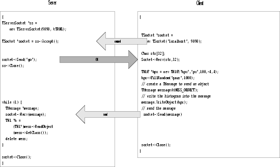

# Networking


In this chapter, you will learn how to send data over the network using
the ROOT socket classes.

## Setting-up a Connection


*On the serverside*, we create a **`TServerSocket`** to wait for a
connection request over the network. If the request is accepted, it
returns a full-duplex socket. Once the connection is accepted, we can
communicate to the client that we are ready to go by sending the string
"go", and we can close the server socket.

``` {.cpp}
{ // server
   TServerSocket *ss = new TServerSocket(9090,kTRUE);
   TSocket *socket = ss->Accept();
   socket->Send("go");
   ss->Close();
}
```

*On the clientside*, we create a socket and ask the socket to receive
input.

``` {.cpp}
{ // client
   TSocket *socket = new TSocket("localhost",9090);
   Char str[32];
   socket->Recv(str,32);
}
```

## Sending Objects over the Network


We have just established a connection and you just saw how to send and
receive a string with the example "go". Now let's send a histogram.

*To send an object (in our case on the client side*) it has to derive
from **`TObject`** class because it uses the `Streamers` to fill a
buffer that is then sent over the connection. On the receiving side, the
`Streamers` are used to read the object from the message sent via the
socket. For network communication, we have a specialized **`TBuffer`**,
a descendant of **`TBuffer`** called **`TMessage`**. In the following
example, we create a **`TMessage`** with the intention to store an
object, hence the constant `kMESS_OBJECT` in the constructor. We create
and fill the histogram and write it into the message. Then we call
**`TSocket`**`::Send` to send the message with the histogram.

``` {.cpp}
...
// create an object to be sent
TH1F *hpx = new TH1F("hpx","px distribution",100,-4,4);
hpx->FillRandom("gaus",1000);

// create a TMessage to send the object
TMessage message(kMESS_OBJECT);

// write the histogram into the message buffer
message.WriteObject(hpx);

// send the message
socket->Send(message);
...
```

On the receiving end (in our case the server side), we write a while
loop to wait and receive a message with a histogram. Once we have a
message, we call `TMessage::ReadObject`, which returns a pointer to
**`TObject`**. We have to cast it to a **`TH1`** pointer, and now we
have a histogram. At the end of the loop, the message is deleted, and
another one is created at the beginning.

``` {.cpp}
while (1) {
   TMessage *message;
   socket->Recv(message);
   TH1 *h = (TH1*)message->ReadObject(message->GetClass());
   delete message;
}
```

## Closing the Connection


Once we are done sending objects, we close the connection by closing the
sockets at both ends.

``` {.cpp}
Socket->Close();
```

This diagram summarizes the steps we just covered:



## A Server with Multiple Sockets


Chances are that your server has to be able to receive data from
multiple clients. The class we need for this is **`TMonitor`**. It lets
you add sockets and the `TMonitor::Select` method returns the socket
with data waiting. Sockets can be added, removed, or enabled and
disabled. Here is an example of a server that has a **`TMonitor`** to
manage multiple sockets:

``` {.cpp}
{
   TServerSocket *ss = new TServerSocket (9090, kTRUE);

   // Accept a connection and return a full-duplex communication socket.
   TSocket *s0 = ss->Accept();
   TSocket *s1 = ss->Accept();

   // tell the clients to start
   s0->Send("go 0");
   s1->Send("go 1");

   // Close the server socket (unless we will use it
   // later to wait for another connection).
   ss->Close();

   TMonitor *mon = new TMonitor;
   mon->Add(s0);
   mon->Add(s1);

   while (1) {
      TMessage *mess;
      TSocket  *s;
      s = mon->Select();
      s->Recv(mess);
      ...
   }
}
```

The full code for the example above is in
`$ROOTSYS/tutorials/net/hserv.C and`

`$ROOTSYS/tutorials/net/hclient.C`.
