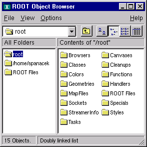

# Object Ownership


An object has ownership of another object if it has permission to
delete it. Usually a collection or a parent object such as a pad holds
ownership. To prevent memory leaks and multiple attempts to delete an
object, you need to know which objects ROOT owns and which are owned
by you.

The following rules apply to the ROOT classes.

-   Histograms, trees, and event lists created by the user are owned
    by current directory (***`gDirectory`***). When the current
    directory is closed or deleted the objects it owns are deleted.

-   The `TROOT` master object (***`gROOT`***) has several collections
    of objects. Objects that are members of these collections are
    owned by ***`gROOT`*** see "Ownership by the Master TROOT Object
    (gROOT).

-   Objects created by another object, for example the function object
    (e.g.**`TF1`**) created by the **`TH1::Fit `method is owned by the
    histogram.**

-   An object created by `DrawCopy` methods, is owned by the pad it is
    drawn in.

If an object fits none of these cases, the user has ownership. The
next paragraphs describe each rule and user ownership in more detail.

## Ownership by Current Directory (gDirectory)


When a histogram, tree, or event list (**`TEventList`**) is created,
it is added to the list of objects in the current directory by
default. You can get the list of objects in a directory and retrieve
a pointer to a specific object with the `GetList` method. This example
retrieves a histogram.

``` {.cpp}
   TH1F *h = (TH1F*)gDirectory->GetList()->FindObject("myHist");
```

The method `TDirectory::GetList()` returns a **`TList`** of objects in
the directory. It looks in memory, and is implemented in all ROOT
collections. You can change the directory of a histogram, tree, or
event list with the `SetDirectory` method. Here we use a histogram for
an example, but the same applies to trees and event lists.

``` {.cpp}
   h->SetDirectory(newDir);
```

You can also remove a histogram from a directory by using
`SetDirectory(0)`. Once a histogram is removed from the directory, it
will not be deleted when the directory is closed. It is now your
responsibility to delete this histogram once you have finished with
it. To change the default that automatically adds the histogram to the
current directory, you can call the static function:

``` {.cpp}
   TH1::AddDirectory(kFALSE);
```

Not all histograms created here after will be added to the current
directory. In this case, you own all histogram objects and you will
need to delete them and clean up the references. You can still set the
directory of a histogram by calling `SetDirectory` once it has been
created as described above.

Note that, when a file goes out of scope or is closed all objects on
its object list are deleted.

## Ownership by the Master TROOT Object (gROOT)


The master object ***`gROOT`***`,` maintains several collections of
objects. For example, a canvas is added to the collection of canvases
and it is owned by the canvas collection.

``` {.cpp}
TSeqCollection* fFiles        List of TFile
TSeqCollection* fMappedFiles  List of TMappedFile
TSeqCollection* fSockets      List of TSocket and TServerSocket
TSeqCollection* fCanvases     List of TCanvas
TSeqCollection* fStyles       List of TStyle
TSeqCollection* fFunctions    List of TF1, TF2, TF3
TSeqCollection* fTasks        List of TTask
TSeqCollection* fColors       List of TColor
TSeqCollection* fGeometries   List of geometries
TSeqCollection* fBrowsers     List of TBrowser
TSeqCollection* fSpecials     List of special objects
TSeqCollection* fCleanups     List of recursiveRemove collections
```

These collections are also displayed in the root folder of the
`Object Browser`. Most of these collections are self explanatory. The
special cases are the collections of specials and cleanups.

### The Collection of Specials


This collection contains objects of the following classes:
**`TCutG`**, **`TMultiDimFit`**, **`TPrincipal`**, **`TChains`**. In
addition it contains the ***`gHtml`*** object, ***`gMinuit`***
objects, and the array of contours graphs (**`TGraph`**) created when
calling the `Draw` method of a histogram with the `"CONT`, `LIST"`
option.

### Access to the Collection Contents


The current content for a collection listed above can be accessed with
the corresponding `gROOT->GetListOf` method (for example
`gROOT->GetListOfCanvases`). In addition, `gROOT->GetListOfBrowsables`
returns a collection of all objects visible on the left side panel in
the browser. See the image of the Object Browser in the next figure.



## Ownership by Other Objects


When an object creates another, the creating object is the owner of the
created one. For example:

``` {.cpp}
myHisto->Fit("gaus")
```

The call to Fit copies the global **`TF1`** Gaussian function and
attaches the copy to the histogram. When the histogram is deleted, the
copy is deleted also.

When a pad is deleted or cleared, all objects in the pad with the
`kCanDelete` bit set are deleted automatically. Currently the objects
created by the `DrawCopy` methods, have the `kCanDelete` bit set and
are therefore owned by the pad.

## Ownership by the User


The user owns all objects not described in one of the above cases.
**`TObject`** has two bits, `kCanDelete` and `kMustCleanup`, that
influence how an object is managed (in `TObject::fBits)`. These are in
an enumeration in `TObject.h.` To set these bits do:

``` {.cpp}
MyObject->SetBit(kCanDelete)
MyObject->SetBit(kMustCleanup)
```

The bits can be reset and tested with the `TObject::ResetBit` and
**`TObject::TestBit` methods.**

### The kCanDelete Bit


The ***`gROOT`*** collections (see above) own their members and will
delete them regardless of the `kCanDelete` bit. In all other
collections, when the collection `Clear` method is called (i.e.
**`TList::Clear())`**, members with the `kCanDelete` bit set, are
deleted and removed from the collection. If the `kCanDelete` bit is
not set, the object is only removed from the collection but not
deleted.

If a collection `Delete` (`TList::Delete()`) method is called, all
objects in the collection are deleted without considering the
`kCanDelete` bit. It is important to realize that deleting the
collection (i.e. delete `MyCollection`), DOES NOT delete the members
of the collection.

If the user specified `MyCollection->SetOwner()` the collection owns
the objects and delete `MyCollection` will delete all its members.
Otherwise, you need to:

``` {.cpp}
   // delete all member objects in the collection
   MyCollection->Delete();

   // and delete the collection object
   delete MyCollection;
```

Note that `kCanDelete` is automatically set by the `DrawCopy` method
and the user can set it for any object. For example, the user must
manage all graphics primitives. If you want **`TCanvas`** to delete
the primitive you created you have to set the `kCanDelete` bit.

The `kCanDelete` bit setting is displayed with `TObject::ls()`. The
last number is either 1 or 0 and is the `kCanDelete` bit.

``` {.cpp}
root[] TCanvas MyCanvas("MyCanvas")
root[] MyCanvas.Divide(2,1)
root[] MyCanvas->cd(MyCanvas_1)
root[] hstat.Draw()             // hstat is an existing TH1F
root[] MyCanvas->cd(MyCanvas_2)
root[] hstat.DrawCopy()         // DrawCopy sets the kCanDelete bit
(class TH1*)0x88e73f8
root[] MyCanvas.ls()
Canvas Name=MyCanvas ...
 TCanvas ... Name= MyCanvas ...
  TPad   ... Name= MyCanvas_1 ...
   TFrame  ...
   OBJ: TH1F    hstat   Event Histogram : 0
   TPaveText   ... title
   TPaveStats  ... stats
  TPad ... Name= MyCanvas_2 ...
   TFrame  ...
   OBJ: TH1F    hstat   Event Histogram : 1
   TPaveText   ... title
TPaveStats  ... stats
```

### The kMustCleanup Bit


When the `kMustCleanup` bit is set, the object destructor will remove
the object and its references from all collections in the clean up
collection (***`gROOT`***`::fCleanups`). An object can be in several
collections, for example if an object is in a browser and on two
canvases. If the `kMustCleanup` bit is set, it will be removed
automatically from the browser and both canvases when the destructor
of the object is called.

The `kMustCleanup` bit is set:

-   When an object is added to a pad (or canvas) in
    `TObject::AppendPad`.

-   When an object is added to a **`TBrowser`** with
    **`TBrowser`**`::Add`.

-   When an object is added to a `TFolder with `**`TFolder`**`::Add`.

-   When creating an inspector canvas with `TInspectCanvas::Inspector`.

-   When creating a **`TCanvas`**.

-   When painting a frame for a pad, the frame's `kMustCleanup` is set
    in `TPad::PaintPadFrame`

The user can add their own collection to the collection of clean ups, to
take advantage of the automatic garbage collection. For example:

``` {.cpp}
   // create two list
   TList *myList1, *myList2;

   // add both to of clean ups
   gROOT->GetListOfCleanUps()->Add(myList1);
   gROOT->GetListOfCleanUps()->Add(myList2);

   // assuming myObject is in myList1 and myList2, when calling:
   delete myObject;

   // the object is deleted from both lists
```
