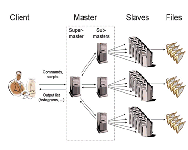

# PROOF: Parallel Processing
\index{PROOF}
\index{parallel processing}

The Parallel ROOT Facility, PROOF, is an extension of ROOT allowing
transparent analysis of large sets of ROOT files in parallel on remote
computer clusters or multi-core computers. The main design goals for the
PROOF system are:

*Transparency* : there should be as little difference as possible
between a local ROOT based analysis session and a remote parallel PROOF
session, both being interactive and giving the same results.

*Scalability* : the basic architecture should not put any implicit
limitations on the number of computers that can be used in parallel.

*Adaptability* : the system should be able to adapt itself to variations
in the remote environment (changing load on the cluster nodes, network
interruptions, etc.).

Being an extension of the ROOT system, PROOF is designed to work on
objects in ROOT data stores, though, for the time being, it mainly
addresses the case of **`TTree`** based object collections.

PROOF is primarily meant as an interactive alternative to batch systems
for Central Analysis Facilities and departmental workgroups (Tier-2's).
However, thanks to a multi-tier architecture allowing multiple levels of
masters, it can be easily adapted to wide range virtual clusters
distributed over geographically separated domains and heterogeneous
machines (GRIDs).

While pure interactivity might not always be possible when performing a
complicated analysis on a very large data set, PROOF still tries to give
the user the interactive experience with something we call "interactive
batch". With "interactive batch" the user can start very long running
queries, disconnect the client and at any time, any location and from
any computer reconnect to the query to monitor its progress or retrieve
the results. This feature gives it a distinct advantage over purely
batch based solutions, that only provide an answer once all sub-jobs
have been finished.

Details about the PROOF system and the way to use it can be found at
<PROOFWiki> [^1]

The PROOF development is a joint effort between CERN and MIT.

[^1]: http://root.cern.ch/twiki/bin/view/ROOT/PROOF
