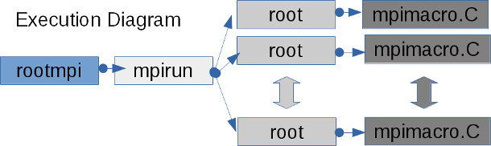
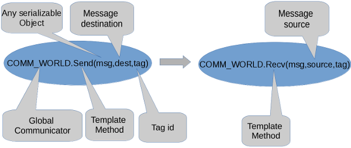
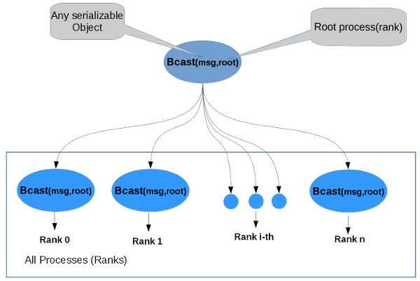
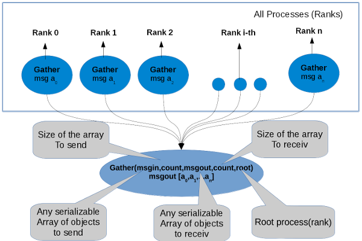
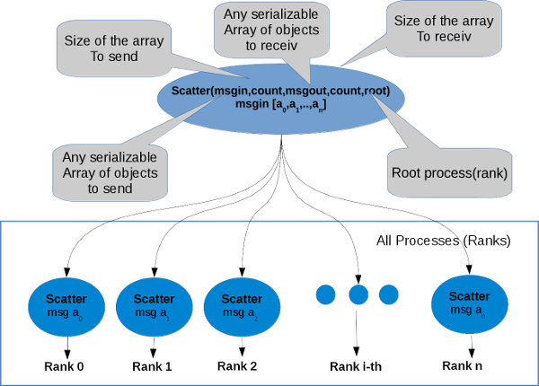
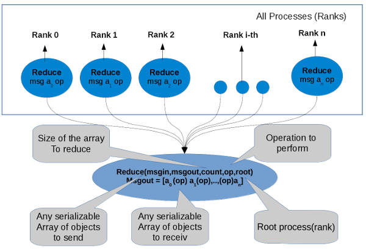
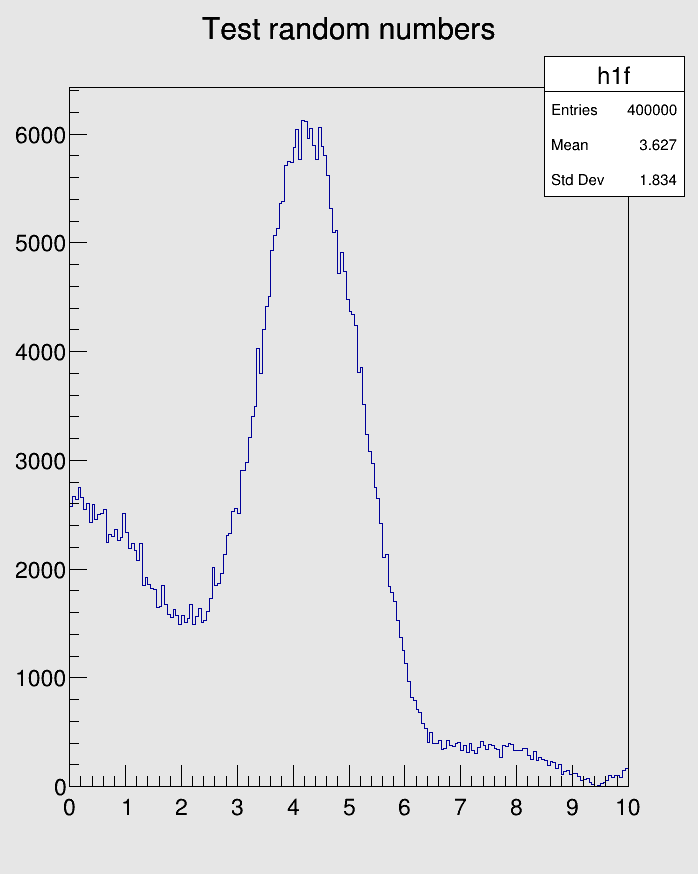
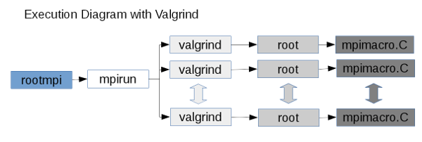

# ROOT Mpi
\index{ROOT Mpi}


## Description
MPI is an standard of communication for HPC/Grid computing widely used in the scientific community. The idea is to do parallel computing with message passing in a standart way.
This standart has several implementations developed by the academia of computer companies like [OpenMPI](https://www.open-mpi.org/), [MPICH](https://www.mpich.org/), [IBM](https://www.ibm.com/developerworks/downloads/im/mpi/index.html), [Intel](https://software.intel.com/en-us/intel-mpi-library), [Microsft](https://msdn.microsoft.com/en-us/library/bb524831(v=vs.85).aspx) etc..
It supports RMA (Remote Memory Access), shared memory,P2P(peer to perr) and collective communication and Checkpoint and Fault tolerance under develoment http://mpi-forum.org/mpi-40

ROOT Mpi is the integration of MPI and ROOT technologies in a framework for parallel computing. The <b>motivation</b> was to communicate ROOT objects through processes using serialization, to implement MPI with a better design for ROOT and create an interface that uses the new C++ features to write parallel code.
But the most important is to implement ROOT algorithms in parallel for HPC/Grid systems.


## Installation
To install ROOT MPI please read first.

- [https://root.cern.ch/building-root](https://root.cern.ch/building-root)
- [https://root.cern.ch/build-prerequisites](https://root.cern.ch/build-prerequisites)


### Compiling ROOT MPI:

**Prerequisities**
Install [OpenMPI](https://www.open-mpi.org/) or [MPICH](https://www.mpich.org/)

To compile ROOT MPI lets to create a compilation directory and to activate it use cmake -Dmpi=ON ..

``` {.sh}
mkdir compile
cd compile
cmake -Dmpi=ON ..
make -j 5
```

## ROOT Mpi Features

Feature       | Description                                                      | Status
 ------------ | :--------------------------------------------------------------- | ----- 
TCommunicator | Base class for all communcators, to perform p2p and collective   |<span style="color:green">**DONE**</span>
TIntraComminicator|Class to do communication in the same context                                                                                   |<span style="color:green">**DONE**</span>
TInterCommunicator|Class to perform communication between  different contexts.   |<span style="color:green">**DONE**</span>
TReuqest, TPrequest and TGrequest|Classes to handle non-blocking communication.|<span style="color:green">**DONE**</span>
TEnvironment | Class initialize/finalize communication system.                                                                                     |<span style="color:green">**DONE**</span>
TMpiMessage and TMpiMessageInfo|Classes for serialization in the communication                                                                     |<span style="color:green">**DONE**</span>
TStatus|Class to handle status in the ROOT Mpi calls.|<span style="color:green">**DONE**</span>
TMpiTimer| Class to measure times in the mpi environment.|<span style="color:green">**DONE**</span>
TGroup|Class manipulate mpi groups, with this class you can perform communication in group of processes.|<span style="color:green">**DONE**</span>
TPort|class to handle port information to establishes communication with a client.|<span style="color:green">**DONE**</span>
TInfo|Many of the routines in MPI take an argument info. info is an opaque object with a handle of type MPI_Info in C and ROOT::Mpi::TInfo in C++. It stores an unordered set of ( key, value) pairs (both key and value are strings).With this class you can to manipulte MPI_Info object with  facilities in C++,that allow to use it like a map with overloaded  operators and template methods.|<span style="color:green">**DONE**</span>
Error Handling                   | MPI errors are very hard to understant also for MPI experts, with the class TErrorHandler we improve the error handling with more beautiful and informative messages .|<span style="color:green">**DONE**</span>
TMpiFile and TMpiFileMerger| Classes manage distribute files.        <span style="color:blue"> **(SPECIAL CASE)**</span> see important notes below.|<span style="color:green">**DONE**</span>
TCartCommunicator|Cartesian Communicator (map processes in a mesh)                                                                                 |<span style="color:red">**TODO**</span>
TGraphComminicator|Graph communicator (map processes in a general graph topology)|<span style="color:red">**TODO**</span>
Checkpointing| Feature to save the state of the execution and restore it.                                                                          |<span style="color:red">**TODO**</span>
Fault Tolerance | Feature to continue execution in case of fault.                                                                                  |<span style="color:red">**TODO**</span>
Memory Window|Class to shared regions of memory with Remote Access Memory using one site communication|<span style="color:red">**NOT SUPPORTED**</span>


<span style="color:red">**Important NOTES**</span>

  * The message in the communication can be any serializable object supported by ROOT or raw datatypes.
  * Persistent communication is not supported because is not possible to know previously the size of the object in the serialization. (It will be implemented in the future for raw datatypes)
  * Fault tolerance and checkpoint needs the new standart that is not implemented yet in the mpi backends.
  * The class TMpiFile is not using the raw MPI C functions, instead a new design was created that is using TMemFile and TFile from ROOT.
  * Memory window is not supported becuase is not possible to know the size of the serialized object in both processes to get access to a memory region.


## rootmpi (command line tool)
Normally the mpi binaries are execute with the command mpirun or mpiexec, that lets to launch the binary code starting the communication system, but in ROOTMpi you can execute ROOT macros without compile it like is usual to run ROOT code.
rootmpi(executable) is a command line tool that helps you run binary code, root macros or compiling source code to generate binary code.
Internally to run a macro it launch mpirun with root interpreter, that allows to run the multiple processes in a distrubute system interpreting the code.


<center>

</center>

<b>Usage for Macro:</b> rootmpi (mpirun options) (root/cling options) (macro file.C )

<b>Options:</b>

 * --help-mpirun show mpi options for execution 

### Some mpirun options for (OpenMPI) :

 * -H, -host, --host (host1,host2,...,hostN) :List of hosts on which to invoke processes.
 * -machinefile,-hostfile file:File with hosts (see machine file example below)
 * -path (path) : (path) that will be used when attempting to locate the requested executables.
 * -np #: Run this many copies of the program on the given nodes.(number of process to use)

You can find full list of option for OpenMpi or Mpich at:

 * [https://www.open-mpi.org/doc/v2.1/man1/mpirun.1.php](https://www.open-mpi.org/doc/v2.1/man1/mpirun.1.php)
 * [http://www.mpich.org/static/docs/latest/www1/mpiexec.html](http://www.mpich.org/static/docs/latest/www1/mpiexec.html)

### Example of machine file

``` {.sh}
# This is an example hostfile.
# (taken from https://www.open-mpi.org/faq/?category=running#mpirun-hostfile)
# Comments begin with #
#
# The following node is a single processor machine:
node.example.com

# The following node is a dual-processor machine:
node.example.com slots=2

# The following node is a quad-processor machine, and we absolutely
# want to disallow over-subscribing it:
node.example.com slots=4 max-slots=4
```

### Options Cling/ROOT:

 * -b : run in batch mode without graphics
 * -n : do not execute logon and logoff macros as specified in .rootrc
 * -q : exit after processing command line macro files
 * -l : do not show splash screen
 * -x : exit on exception
 * -memstat : run with memory usage monitoring

## Hello world
This is a basic example that just print the host name and the rank id.
save it like hello.C
``` {.cpp}
using namespace ROOT::Mpi;
void hello()
{
   TEnvironment env; // environment to start communication system
   std::cout << "Hello from process " << COMM_WORLD.GetRank() 
             << " of " << COMM_WORLD.GetSize() << " in host "
             << env.GetProcessorName() << std::endl;
}
```

To execute it just use rootmpi command line tools
the wn1 and wn2 are aliases for worker node.<br>
-np number of processors <br>
-H is a option to say which nodes <br>
-b ROOT batch mode <br>
-pernode one proccess per node <br>

``` {.sh}
rootmpi -np 2 -H wn6,wn7 -b -pernode hello.C
```
the output mus be something like 
``` {.sh}
Processing hello.C ...

Processing hello.C ...
Hello from process 0 of 2 in host wn6
Hello from process 1 of 2 in host wn7
```


## ROOT Mpi Basics
ROOT Mpi can to communicate processes between multiple nodes using messages,
according to the different schemas the communiction, peer to peer or collectives
like gather, scatter, broadcast etc..
The data is encapsulated internally using TMpiMessage objects and the communication can be blocking(that blocks the execution while the message comes)
or non-blocking(that can to receive the messages the messages asonchronously without blocks the execution).

Every message have a tag id that allow to send or receive to the same process multiple messages and identify them with the id. if you id is wrong in the communication your communication can be blocked forever because you message never will be delivered, or you message will have wrong datatype producing an error handle by ROOTMpi in the execution time.

All the communication is made in the same context of communication using the 
the TIntraCommunicator object ROOT::Mpi::COMM_WORLD, this global object
allows to use the multiple schemas of communication throw its methods.

## Blocking communictaion

In the blocking communication the execution is "synchronous" and it stop while the message is received,if the tag id is wrong in the message the execution will be blocked forever.

### Peer to Peer communication
Peer to peer communication is the most basic communication operation,
basically is send and receiv a message between two processes.

<center>

</center>

<b>Example</b>
``` {.cpp}
using namespace ROOT::Mpi;
void p2p()
{
   TEnvironment env; // environment to start communication system

   if (COMM_WORLD.GetSize() != 2) return; // need 2 process

   // data to send/recv
   std::map<std::string, std::string> mymap; // std object
   TMatrixD mymat(2, 2);                     // ROOT object
   Double_t a;                               // default datatype

   //sending messages in process 0
   if (COMM_WORLD.GetRank()==0)
   {
      mymap["key"] = "hola";

      mymat[0][0] = 0.1;
      mymat[0][1] = 0.2;
      mymat[1][0] = 0.3;
      mymat[1][1] = 0.4;

      a = 123.0;

      std::cout << "Sending scalar = " << a << std::endl;
      COMM_WORLD.Send(a, 1, 0);
      std::cout << "Sending map = " << mymap["key"] << std::endl;
      COMM_WORLD.Send(mymap, 1, 0);
      std::cout << "Sending mat = ";
      mymat.Print();
      COMM_WORLD.Send(mymat, 1, 0);
   }
   //Receiving messages in process 1
   if(COMM_WORLD.GetRank()==1){
      COMM_WORLD.Recv(a, 0, 0);
      std::cout << "Recieved scalar = " << a << std::endl;
      COMM_WORLD.Recv(mymap, 0, 0);
      std::cout << "Received map = " << mymap["key"] << std::endl;
      COMM_WORLD.Recv(mymat, 0, 0);
      std::cout << "Received mat = ";
      mymat.Print();
   }
}
```
Execute with rootmpi command line tool
``` {.sh}
rootmpi  -np 2 p2p.C
```
The output is something like 
``` {.sh}
Processing p2p.C ...

Processing p2p.C ...
Sending scalar = 123
Sending map = hola
Recieved scalar = 123
Sending mat = 
2x2 matrix is as follows

     |      0    |      1    |
-------------------------------
   0 |        0.1         0.2 
   1 |        0.3         0.4 

Received map = hola
Received mat = 
2x2 matrix is as follows

     |      0    |      1    |
-------------------------------
   0 |        0.1         0.2 
   1 |        0.3         0.4
```

### Collective communication
The collective operations basically is to send/receiv messages
to multiple process at same time, using different schemas ilustrate below.

### Broadcast
Broadcasts a message from the process with rank root to all processes of the group, itself included. It is called by all members of group using the same arguments for comm, root. On return, the contents of root's communication buffer has been copied to all processes.

General, derived datatypes are allowed for datatype. The type signature of count, datatype on any process must be  equal  to  the  type  signature  of  count, datatype  at  the  root. This implies that the amount of data sent must be equal to the amount received, pairwise between each process and the root. ROOT::Mpi::Communicator::Bcast and all other data-movement collective routines make this restriction.
Distinct type maps between sender and receiver are still allowed

<center>

</center>

<b>Example</b>
``` {.cpp}
using namespace ROOT::Mpi;
void bcast()
{
   TEnvironment env;

   if (COMM_WORLD.GetSize() == 1) return; // need at least 2 process

   // data to send/recv
   TMatrixD mymat(2, 2); // ROOT object

   auto rank = COMM_WORLD.GetRank();
   auto root = COMM_WORLD.GetMainProcess();
   if (COMM_WORLD.IsMainProcess()) {
      mymat[0][0] = 0.1;
      mymat[0][1] = 0.2;
      mymat[1][0] = 0.3;
      mymat[1][1] = 0.4;
   }

   COMM_WORLD.Bcast(mymat, root);
   std::cout << "Rank = " << rank << std::endl;
   mymat.Print();
   std::cout.flush();
}

```
Execute with rootmpi command line tool
``` {.sh}
rootmpi  -np 4 bcast.C
```
The output is something like 
``` {.sh}
Processing bcast.C ...

Processing bcast.C ...

Processing bcast.C ...

Processing bcast.C ...
Rank = 2

2x2 matrix is as follows

     |      0    |      1    |
-------------------------------
   0 |        0.1         0.2 
   1 |        0.3         0.4 

Rank = 1

2x2 matrix is as follows

     |      0    |      1    |
-------------------------------
   0 |        0.1         0.2 
   1 |        0.3         0.4 

Rank = 0

2x2 matrix is as follows

     |      0    |      1    |
-------------------------------
   0 |        0.1         0.2 
   1 |        0.3         0.4 

Rank = 3

2x2 matrix is as follows

     |      0    |      1    |
-------------------------------
   0 |        0.1         0.2 
   1 |        0.3         0.4 
```


### Gather
Collect messages from a group of processes.
Each process (root process included) sends the contents of its send buffer to the root process. The root process receives the messages and stores them in rank order. The outcome is as if each of the n processes in the group (including the root process) had executed a call to ROOT::Mpi:TCommunicator::Gather .

<center>

</center>
<b>Example</b>
In this example we are sending two vector from each process 
and we are receiving an array of vector(with 4 vectors for 2 processes) in root process,
every vector has a values of the rank

``` {.cpp}
void gather()
{
   TEnvironment env;
   if (COMM_WORLD.GetSize() == 1) return; //needed at least 2 process
   auto rank = COMM_WORLD.GetRank();
   auto size = COMM_WORLD.GetSize();

   auto count=2;
   auto root=COMM_WORLD.GetMainProcess();

   //creating a vector to send and
   //the array of vectors to receiv.
   TVectorD send_vec[count];
   TVectorD *recv_vec;
   for (auto i = 0; i < count; i++) {
      send_vec[i].ResizeTo(1);
      send_vec[i][0] = rank;
   }

   if (rank == root) {
      recv_vec = new TVectorD[size * count];
   }

   COMM_WORLD.Gather(send_vec, count, recv_vec, size * count, root); //testing custom object


   if (rank == root) {
      //just printing all infortaion
      for (auto i = 0; i < size * count; i++) {
         recv_vec[i].Print();
      }

      for (auto i = 0; i < COMM_WORLD.GetSize(); i++) {
        
         for (auto j = 0; j < count; j++) {
            std::cout << "vec[" << i *count + j << "] = " << recv_vec[i * count + j][0] << " -- " << i << std::endl;
         }
      }
      delete[] recv_vec;
   }
}
```
Execute with rootmpi command line tool
``` {.sh}
rootmpi  -np 2 gather.C
```
The output is something like 
``` {.sh}
Processing gather.C ...

Processing gather.C ...

Vector (1)  is as follows

     |        1  |
------------------
   0 |0 


Vector (1)  is as follows

     |        1  |
------------------
   0 |0 


Vector (1)  is as follows

     |        1  |
------------------
   0 |1 


Vector (1)  is as follows

     |        1  |
------------------
   0 |1 

vec[0] = 0 -- 0
vec[1] = 0 -- 0
vec[2] = 1 -- 1
vec[3] = 1 -- 1
```

### Scatter
Sends data from one task to all tasks in a group.

This is the inverse operation to ROOT::Mpi::TCommunicator::Gather.
An alternative description is that the root sends a message with ROOT::Mpi::TCommunicator::Send. This message is split into n equal segments, the ith segment is sent to the ith process in the group, and each process receives this message as above.

The send buffer is ignored for all nonroot processes.

The type signature associated with incount, sendtype at the root must be equal to the type signature associated with out_vars, recvtype  at  all  processes (however,  the  type  maps  may  be  different). This implies that the amount of data sent must be equal to the amount of data received, pairwise between each process and the root. Distinct type maps between sender and receiver are still allowed.

All arguments to the function are significant on process root, while on other processes, only arguments out_vars, outcount, recvtype, root, comm are  significant. The arguments root and comm must have identical values on all processes.

The specification of counts and types should not cause any location on the root to be read more than once.

Rationale: Though not needed, the last restriction is imposed so as to achieve symmetry with ROOT::Mpi::TCommunicator::Gather, where the corresponding restriction (a multiple-write restriction) is necessary.

<center>

</center>

<b>Example</b>
In this example we are sending twi vector from each process 
and we are receiving an array of vector in root process,
every vector has a values of the rank

``` {.cpp}
using namespace ROOT::Mpi;

void scatter()
{
   TEnvironment env;
   env.SyncOutput();
   if (COMM_WORLD.GetSize() == 1) return; //needed at least 2 process
   auto rank = COMM_WORLD.GetRank();
   auto size = COMM_WORLD.GetSize();
   
   auto count=2;
   auto root=COMM_WORLD.GetMainProcess();

   //creating a vector to send and
   //the array of vectors to receiv.
   TVectorD *send_vec;
   if (root == rank) {
      send_vec = new TVectorD[size * count];
      for (auto i = 0; i < COMM_WORLD.GetSize() * count; i++) {
         send_vec[i].ResizeTo(1);
         send_vec[i][0] = i;
      }
   }
   TVectorD recv_vec[count];

   COMM_WORLD.Scatter(send_vec, size * count, recv_vec, count, root); //testing custom object

   for (auto i = 0; i < count; i++) {
      recv_vec[i].Print();
      std::cout << recv_vec[i][0] << " -- " << (rank * count + i) << std::endl;
      //assertions
      assert(recv_vec[i][0] == (rank * count + i));
   }

   if (rank == root) delete[] send_vec;
}
```
Execute with rootmpi command line tool
``` {.sh}
rootmpi  -np 2 scatter.C
```
The output is something like 
``` {.sh}
Processing scatter.C ...

Processing scatter.C ...
-------  Rank 0 OutPut  -------

Vector (1)  is as follows

     |        1  |
------------------
   0 |0 

0 -- 0

Vector (1)  is as follows

     |        1  |
------------------
   0 |1 

1 -- 1
-------  Rank 1 OutPut  -------

Vector (1)  is as follows

     |        1  |
------------------
   0 |2 

2 -- 2

Vector (1)  is as follows

     |        1  |
------------------
   0 |3 

3 -- 3
```
### Reduce
perform a global reduce operation (such as sum, max, logical AND, etc.) across all the members of a group. The reduction operation can be either one of a predefined  list  of  operations,  or  a  userdefined  operation.  The global reduction functions come in several flavors: a reduce that returns the result of the reduction at one node and all-reduce that returns this result at all nodes.

<center>

</center>

<b>Example</b>
Example to generated random numbers to fill a TH1F histogram in every process and merging the result through a custom reduce operation.
In this example we are creating our custom opration with sum the histogram
called HSUM.
Every process is creating 100000 random number into the histogram
and mergin it the resuls is 100000*n where n is the number of processes(in this example 4).

``` {.cpp}
using namespace ROOT::Mpi;

TOp<TH1F> HSUM() // histogram sum(custom operation for reduce)
{
   // returning an  ROOT::Mpi::Op<TH1F>(arg) object where "arg" is a lambda
   // function with histograms sum
   return TOp<TH1F>([](const TH1F &a, const TH1F &b) {
      TH1F c(a);
      c.Add(&b);
      return c;
   });
}

void hist_reduce(Int_t points = 100000)
{
   TEnvironment env;

   auto root = 0;
   auto rank = COMM_WORLD.GetRank();

   if (COMM_WORLD.GetSize() == 1) return; // need at least 2 process

   auto form1 = new TFormula("form1", "abs(sin(x)/x)");
   auto sqroot = new TF1("sqroot", "x*gaus(0) + [3]*form1", 0, 10);
   sqroot->SetParameters(10, 4, 1, 20);

   TH1F h1f("h1f", "Test random numbers", 200, 0, 10);
   h1f.SetFillColor(rank);
   h1f.FillRandom("sqroot", points);

   TH1F result;

   COMM_WORLD.Reduce(h1f, result, HSUM, root);

   if (rank == root) {
      TCanvas *c1 = new TCanvas("c1", "The FillRandom example", 200, 10, 700, 900);
      c1->SetFillColor(18);
      result.Draw();
      c1->SaveAs("hist.png");
      delete c1;
   }

   delete form1;
   delete sqroot;
}
```
Execute with rootmpi command line tool
``` {.sh}
rootmpi  -np 4 hist_reduce.C
```
The output is something like 
``` {.sh}
Processing hist_reduce.C ...

Processing hist_reduce.C ...

Processing hist_reduce.C ...

Processing hist_reduce.C ...
Info in <TCanvas::Print>: file hist.png has been created
```
rmpihistreduce.png

<center>

</center>

## Debugging and Profiling ROOT Mpi applications

To debug parallel applications is a hard work, to help in this task,
rootmpi commandline tool will have a set of extra tools that can help in runtime to do debugging or profiling  of your application.
At the moment it have valgrind integration that help to check the 
application in every process launched.

<center>

</center>

In ROOT Mpi, when you run an application every rank of process has a process id (PID) from the operating system, the a valgrind output will be a file for every process.

<b>Example</b>

In this example we will run the initial hello world code.

``` {.sh}
rootmpi  -np 2 -valgrind hello.C
```
the output mus be something like 
``` {.sh}
Processing hello.C ...

Processing hello.C ...
Hello from process 0 of 2 in host tuxito
Hello from process 1 of 2 in host tuxito

Valgrind files  report-hello.C-pid.memcheck must be generated.
```

Two files (nie for each process is created with the name report-hello.C-pid.memcheck) whehere pid is the PID is the process in your OS.
The memcheck looks like

<b>process 1</b>
``` {.sh}
==21192== Memcheck, a memory error detector
==21192== Copyright (C) 2002-2015, and GNU GPL'd, by Julian Seward et al.
==21192== Using Valgrind-3.12.0.SVN and LibVEX; rerun with -h for copyright info
==21192== Command: /home/ozapatam/Projects/root/compile/bin/root -l -x -q hello.C\
...
...
...
==21192==     in use at exit: 46 bytes in 1 blocks
==21192==   total heap usage: 4 allocs, 3 frees, 72,842 bytes allocated
==21192==
==21192== Searching for pointers to 1 not-freed blocks
==21192== Checked 285,112 bytes
==21192==
==21192== 46 bytes in 1 blocks are still reachable in loss record 1 of 1
==21192==    at 0x4C2C93F: operator new[](unsigned long) (vg_replace_malloc.c:423)
==21192==    by 0x10B97F: SetRootSys (rootx.cxx:259)
==21192==    by 0x10B97F: main (rootx.cxx:467)
==21192==
==21192== LEAK SUMMARY:
==21192==    definitely lost: 0 bytes in 0 blocks
==21192==    indirectly lost: 0 bytes in 0 blocks
==21192==      possibly lost: 0 bytes in 0 blocks
==21192==    still reachable: 46 bytes in 1 blocks
==21192==         suppressed: 0 bytes in 0 blocks
==21192==
==21192== ERROR SUMMARY: 0 errors from 0 contexts (suppressed: 0 from 0)
==21192== ERROR SUMMARY: 0 errors from 0 contexts (suppressed: 0 from 0)

```
<b>process 1</b>
``` {.sh}
==21193== Memcheck, a memory error detector
==21193== Copyright (C) 2002-2015, and GNU GPL'd, by Julian Seward et al.
==21193== Using Valgrind-3.12.0.SVN and LibVEX; rerun with -h for copyright info
==21193== Command: /home/ozapatam/Projects/root/compile/bin/root -l -x -q hello.C\
...
...
...
==21193==     in use at exit: 46 bytes in 1 blocks
==21193==   total heap usage: 4 allocs, 3 frees, 72,842 bytes allocated
==21193==
==21193== Searching for pointers to 1 not-freed blocks
==21193== Checked 285,112 bytes
==21193==
==21193== 46 bytes in 1 blocks are still reachable in loss record 1 of 1
==21193==    at 0x4C2C93F: operator new[](unsigned long) (vg_replace_malloc.c:423)
==21193==    by 0x10B97F: SetRootSys (rootx.cxx:259)
==21193==    by 0x10B97F: main (rootx.cxx:467)
==21193==
==21193== LEAK SUMMARY:
==21193==    definitely lost: 0 bytes in 0 blocks
==21193==    indirectly lost: 0 bytes in 0 blocks
==21193==      possibly lost: 0 bytes in 0 blocks
==21193==    still reachable: 46 bytes in 1 blocks
==21193==         suppressed: 0 bytes in 0 blocks
==21193==
==21193== ERROR SUMMARY: 0 errors from 0 contexts (suppressed: 0 from 0)
==21193== ERROR SUMMARY: 0 errors from 0 contexts (suppressed: 0 from 0)
```
In our case we dont have memory errors.


