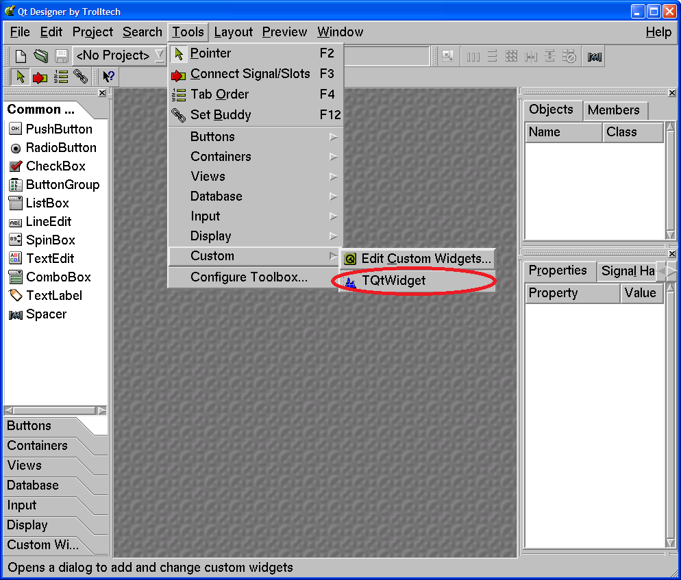
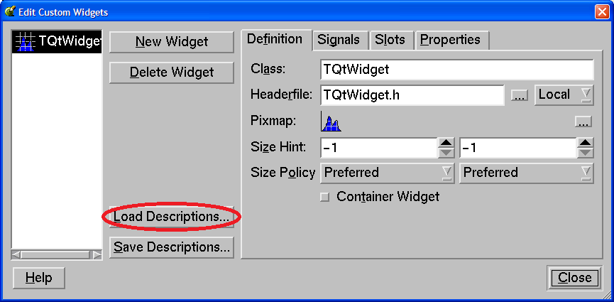
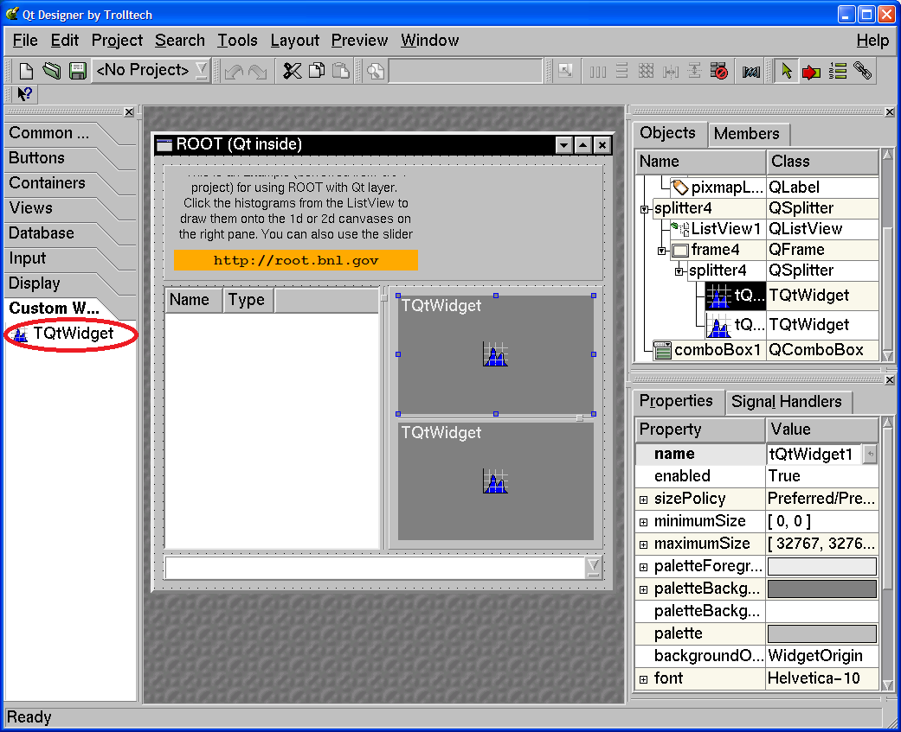
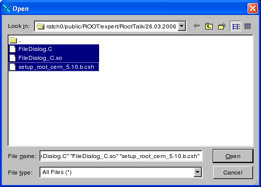
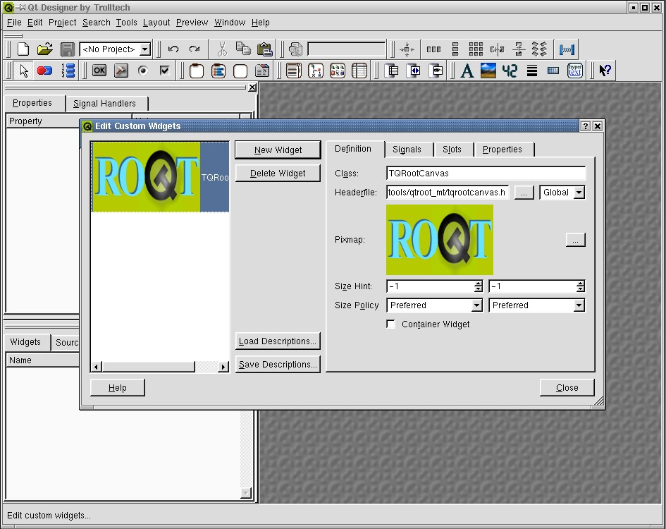
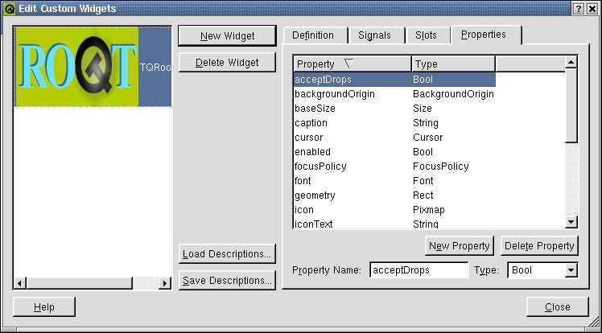
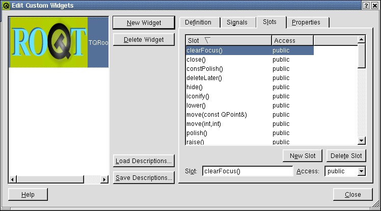
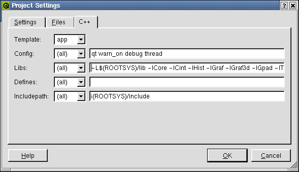
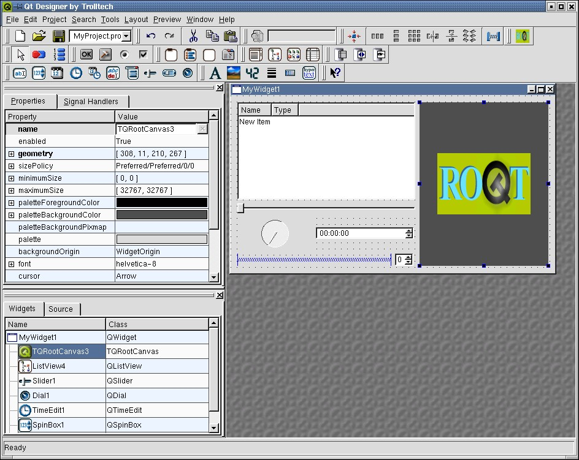

# ROOT/Qt Integration Interfaces
\index{Qt}

## Qt-ROOT Implementation of TVirtualX Interface (BNL)


Qt-ROOT implementation of **`TVirtualX`** (Qt-layer) is to provide a
convenient way of creating the complex end-user applications that
require both Qt GUI and ROOT features. The primary goal is to allow
"embedding" the ROOT classes like **`TCanvas`** and **`TPad`** into the
arbitrary Qt widgets and using it seamlessly with other Qt-based
components and Qt-based third party libraries. **`TGQt`** ROOT class, a
Qt-based implementation of **`TVirtualX`** interface is an optional ROOT
component. The implementation was developed and is supported by the
<STAR> collaboration at
[Brookhaven National Laboratory](Brookhaven National Laboratory).

### Installation


#### Qt Package Installation and Configuration

ROOT Qt-layer requires a "good" properly configured Qt package version.
To install it, one has to:

1. Make sure the adequate version of Qt system. Even though Qt ROOT
implementation theoretically can work with any Qt release version 3.xx,
we found the earlier versions of the package not reliable and recommend
installing the Qt version 3.3 or higher. The package was tested against
Qt 4.3 also (Qt 4.3 and higher versions contain some features introduced
by TrollTech to back the ROOT applications).

2. Check the Qt package configuration and its compilation options are
consistent with those used to compile and install ROOT alone. For Qt
3.x, we recommend configuring Qt as follows:

`./configure -thread -no-xft -qt-gif -no-exeptions `

I.e. one is required to build the Qt version with the "`thread`" support
and with "`no exceptions`". Generally, you are free to select the
remaining Qt options like the types of the different image formats
provided etc. You can check the Qt installation parameters by looking up
the file:

`more $QTDIR/config.status`

No special flag for Qt 4.3 build and higher have been set yet to make QtRoot working.

3. Attention. The Qt port for 4.3 and above versions should be considered as an
experimental one. Most examples in this manual are for Qt version 3.3 and they need
to be adjusted for Qt 4.3.x.

#### Qt-layer Installation

The Qt-layer is included into the ROOT distribution kit. To install it
one has to configure ROOT. The installation does not change any other
components of the ROOT package. It produces several extra-shared
libraries that may be dynamically loaded into the ROOT session at start
time with the regular ROOT plug-in mechanism to replace the "native" GUI
interface. To install Qt-layer one should follow the ROOT installation
procedure providing the QTDIR environment variable points to the proper
version of Qt system. Many Linux flavors come with the pre-installed Qt.
May sure you are not going to pick the obsolete version.

``` {.cpp}
% cd root
% ./configure <target> --enable-qt
% gmake
% gmake install
```

#### Qt Main C++ Classes Cling Dictionary

The ROOT Cling dictionary allows to call the Qt main classes directly
from the ROOT command prompt is an optional component and it is not
created during the "Qt-layer installation". To build / re-build the Qt
main classes ROOT dictionary one can invoke the make

``` {.cpp}
% cd root
% gmake qtcint
```

The dictionary contains so-called Qt main classes as defined by
TrollTech on the Web page:
<http://doc.trolltech.com/3.3/mainclasses.html>. The dictionary is NOT
loaded automatically and it should be loaded by the user ROOT macro as
needed.

#### Qt-layer Configuration

Any ROOT-based application should be configured to use Qt-layer using
ROOT "Environment Setup". The correct **`QTDIR`** environment variable
to locate the proper version of Qt package should be provided as well.
There are several ways to customize the ROOT setup environment to
activate Qt-layer.

Look up at `$ROOTSYS/etc/system.rootrc`. Find there the definition of
`Gui.Backend` and `Gui.Factory`:

``` {.cpp}
# GUI specific settings
Gui.Backend:                native
Gui.Factory:                native
```

Now you can either edit the file `$ROOTSYS/etc/system.rootrc` or provide
your own custom `.rootrc` redefine the options:

``` {.cpp}
# GUI specific settings
Gui.Backend:                qt
Gui.Factory:                qt
```

If you need to switch often from native layer to qt one back and force
you may find convenient to define the type of GUI using some external
environment variable defining options indirectly:

``` {.cpp}
# GUI specific settings
Gui.Backend:                $(GUI)
Gui.Factory:                $(GUI)
```

The last step is to make sure your `LD_LIBRARY_PATH` variable point to
the `$QTDIR/lib` directory. Optionally, you can define the Qt Widget
"look and feel" using the option `Gui.Style` option. The number of
different styles to choose from is defined by your local Qt
installation. Usually you can choose from "`window`", "`motif`",
"`cde`", "`motifplus`", "`platinum`", "`sgi`", "`compact`",
"`windowsxp`", "`aqua`" or "`macintosh`". For example, the option
defined below will force the "windows" look and feel on any platform.

``` {.cpp}
# Qt GUI style setting
Gui.Style:                windows
```

The default style is so-called "native" style. That is defined by the
current application environment.

### Applications


As soon as you customize ROOT "Environment Setup" to use Qt-layer you
can start any ROOT session or stand-alone ROOT-based applications and ...
even though your applications will be using the Qt package you should
not see any difference. This merely means if the only thing you want to
do is just use ROOT or some ROOT-based stand-alone application "as is"
then you probably do not need to switch to Qt-layer and should skip this
section entirely. It is recommended you communicate the lower graphical
layer via the generic **`TVirtualX`** interface provided by the global
***`gVirtualX`***.

#### Qt-based ROOT Applications

"ROOT application" is the application that either instantiates the ROOT
**`TApplication`** / **`TRint`** class and enters the ROOT event loop or
is the shared library that can be loaded into the already running ROOT
application via `TSystem::Load` method or via ROOT plug-in mechanism.
You must neither initialize Qt `QApplication` nor enter the Qt event
loop. Qt-layer takes care about these two steps. What you need is to
instantiate the Qt object of your choice and to keep playing ROOT rules.

``` {.cpp}
#include <TRint.h>
#include <qpushbutton.h>
int main( int argc, char **argv ) {
   // Create an interactive ROOT application
   TRint *theApp = new TRint("Rint", &argc, argv);
   // Create Qt object within ROOT application
   QPushButton hello( "Hello world!", 0 );
   hello.resize( 100, 30 );
   hello.show();
   // and enter the ROOT event loop...
   theApp->Run();
}
```

Under UNIX, you can build the stand-alone ROOT HelloWord Qt-based
application with the command

```  {.cpp}
g++ `root-config --cflags --glibs` -I$QTDIR/include -L$QTDIR/lib
                                   -lqt-mt HelloWord.cxx -o HelloWord
```

#### ROOT-based Qt Applications

"Qt application" is the application that either instantiates the Qt
`QApplication` and enters the Qt event loop or is the shared library
that can be loaded into the already running Qt application via Qt
plug-in mechanism. You must neither initialize ROOT **`TApplication`** /
**`TRint`** nor enter the ROOT event loop. Qt-layer takes care about
both of these steps. What you need is just to instantiate the embedded
and regular ROOT objects of your choice and keep playing Qt rules.
ROOT-based Qt applications treat the "native" style of the ROOT
**`Gui.Backend`** and **`Gui.Factory`** parameters as "qt". For example,

``` {.cpp}
// Minimal ROOT based Qt example
#include <qapplication.h>
#include "TGraph.h"
#include "TQtWidget.h"
#include "TCanvas.h"

int main( int argc, char **argv ) {

   QApplication *app = new QApplication(argc, argv);
   TQtWidget *MyWidget= new TQtWidget(0,"MyWidget");
   // Create any other Qt-widget here
   MyWidget->show();
   MyWidget->GetCanvas()->cd();
   TGraph *mygraph;
   float x[3] = {1,2,3};
   float y[3] = {1.5, 3.0, 4.5};
   mygraph  = new TGraph(3,x,y);
   mygraph->SetMarkerStyle(20);
   mygraph->Draw("AP");
   MyWidget->GetCanvas()->Update();
   app->exec();
   return 0;
}
```

The code above can be converted into the running application using
qmake, TrollTech provided, build utility. As soon as you have qmake
project file `HelloCanvas.pro`:

``` {.cpp}
# Automatically generated by qmake (1.07a) Sun Jun 26 02:03:47 2005
# Adjusted by hand to include $ROOTSYS/include/rootcling.pri file

TEMPLATE = app thread
CONFIG -= moc
INCLUDEPATH += .

# include "by hand" the qmake include file from
# ROOT distribution to define
#  1. include path to the ROOT system header files
#  2. the list of the ROOT shared libraries to link
#     Qt application against of
#  3. qmake rules to generate ROOT/Cint dictionaries

include("$(ROOTSYS)/include/rootcling.pri")

# Input
SOURCES += HelloCanvas.cxx
```

You can get the running ROOT-based Qt application with the Unix shell
commands:

``` {.cpp}
qmake HelloCanvas.pro
make
HelloCanvas
```

#### Qt Project for Creation of ROOT Shared Libraries with Qt Components and ROOT Dictionaries

It is possible and desirable to create the ROOT-based Qt application
with TrollTech provided qmake utility. To do that one should include one
qmake include file, namely, `$ROOTSYS/include/rootcling.pri `with one
extra line in the project file (as the example above has revealed). The
include file defines all necessary components one needs to compile and
link the healthy Qt application against of the ROOT shared libraries. It
contains the qmake rules to create the ROOT/Cling dictionary from the
list of the provided header files.

For example, we may convert the stand-alone Qt-based ROOT application
above into C++ class with `RootCint` dictionary, that one loads into the
interactive ROOT session and invokes interactively. This task requires
four simple files.

1. Class dictionary definition file `LinkDef.h`:

``` {.cpp}
#ifdef __CLING__
#pragma link off all globals;
#pragma link off all classes;
#pragma link off all functions;

#pragma link C++ class TMyQButton;

#endif
```

2. Class header file `TMyQButton.h`:

``` {.cpp}
#ifndef ROOT_TMyQButton
#define ROOT_TMyQButton
#include "Rtypes.h"

class QPushButton;
class TVirtualPad;

class TMyQButton {
private:
   QPushButton *fMyButton;
public:
   TMyQButton(const char*name="");
   virtual ~TMyQButton();
   void SetSize(UInt_t w, UInt_t h);
   void Show(Bool_t show=kTRUE);
   void SetText(const char *text);
   void SetOn(Bool_t on=kTRUE);
   void SetStyle(const char * style);
};
#endif
```

3. Class implementation file `TMyQButton.cxx`:

``` {.cpp}
#include "TMyQButton.h"
#include <qpushbutton.h>

// This class allow you to create and manipulate the QPushButton
// interactively
TMyQButton::TMyQButton(const char *name) {
   // Create Qt QPushButton interactively
   fMyButton = new QPushButton(name,0);
}

TMyQButton::~TMyQButton() { delete fMyButton; }

void TMyQButton::SetSize(UInt_t w, UInt_t h) {
   // Resize the Qt button
   fMyButton->resize(w,h);
}
void TMyQButton::Show(Bool_t show) {
   // Show / hide the button
   if (show)  fMyButton->show();
   else       fMyButton->hide();
}
void TMyQButton::SetText(const char *text) {
   // Set / change the button text
   fMyButton->setText(text);
}
void TMyQButton::SetOn(Bool_t on) {
   fMyButton->setOn(on);
}
void TMyQButton::SetStyle(const char * style) {
   // Set button's look and feel
   // The possible styles are defined by the local Qt installation.
   // For example the possible style can be: "window","motif",
   // "cde","sgi","motifplus","platinum","compact","windowsxp",
   // "aqua","macintosh"
   fMyButton->setStyle(style);
}
```

4. `qmake` project file `MyQButton.pro`:

``` {.cpp}
TEMPLATE = lib dll thread
# Input
HEADERS += TMyQButton.h
SOURCES += TMyQButton.cxx

CREATE_ROOT_DICT_FOR_CLASSES  = $$HEADERS LinkDef.h
include("$(ROOTSYS)/include/rootcling.pri")
```

At this point, you are ready to produce the class-shared library with
the ROOT/Cling dictionary by invoking two shell commands (as above):

``` {.cpp}
qmake MyQButton.pro
make
```

In addition, get you class into the interactive Root session:

``` {.cpp}
root[] gSystem->Load("lib
```

Please, pay your attention that class implementation does not contain
any Qt system initialization call. Since the above example is a ROOT
application, do not forget, one needs the `.rootrc` file to assign
"`qt`" value for the options` Gui.Backend` and `Gui.Factory`.

Note: Do not mix the ROOT GUI and Qt GUI API within the same class
implementation.

#### Using Qt "Designer" to Create Qt GUI with Embedded ROOT Objects

Qt package is equipped with [Qt designer](Qt designer) - a powerful tool
to create the high quality, robust GUI interfaces for your applications.
It is possible and desirable to use this utility to create the
ROOT-based Qt GUI. To do that one should add the
`$ROOTSYS/include/rootcling.pri` in the project file generated by
designer and configure Qt designer to use the so-called "custom widget"
defined by `$ROOTSYS/include/TQtWidget.cw`. The file defines the custom
**`TQtWidget`** Qt widget to back the embedded **`TCanvas`** objects. To
customize your designer start `designer` and select "Edit Custom Widget"
menu:



Open "Edit Custom Widget" dialog and load the **`TQtWidget`**
("embedded" **`TCanvas`**) widget definition into the designer. One
should do this at once. Designer will remember the last configuration
and will be restoring it for all subsequent designer sessions.



Now, you can create your shining GUI interface that contains
**`TCanvas`** / **`TPad`** object with all features of these famous ROOT
classes.



We strongly recommend you to read the "Quick Start" section of the Qt
designer manual <http://doc.trolltech.com/3.3/designer-manual.html>. One
can find further information, the examples of the working ROOT-based Qt
projects including all examples of this section as well as the list of
the references and publications on the Qt project Web site
<http://root.bnl.gov>

#### Using Qt Class Library from the ROOT C++ Interpreter

Since the Qt package is a regular C++ class library to use it within
ROOT C++ interpreter environment one should either load the dedicated
RootCint dictionary or apply ACLiC mode.

For example, the following ROOT interactive session is to popup the
"Open File" Qt dialog box and print out the file name selected by the
user via the dialog.

``` {.cpp}
root[] gSystem->Load("qtcint");
root[] cout << QFileDialog::getOpenFileName() << endl;
```

The ROOT session:

``` {.cpp}
root[] gSystem->Load("qtcint");
root[] QPrinter p;
root[] p.setup();  // Display the Qt "Setup printer" dialog box
root[] Int_t id = gPad->GetPixmapID();
root[] QPixmap *pix = (QPixmap *)(TGQt::iwid(id));
root[] QPainter pnt(&p);
root[] pnt.drawPixmap(0,0,*pix);
```

is to display the Qt "Setup Printer" dialog and use QPrinter object to
print the current **`TPad`** image to the selected printer. To use the
more complex Qt-related code one is advised to apply "ACLiC - Automatic
Compiler of Libraries for Cling" (see Cling the C++ Interpreter). For
example:

``` {.cpp}
#ifndef __CLING__
#  include <qfiledialog.h>
#  include <qstringlist.h>
#  include <qstring.h>
#endif
void FileDialog() {
   // This is small AClIC wrapper to use Qt 3.3 QFileDialog class
   // See: http://doc.trolltech.com/3.3/qfiledialog.html#getOpenFileNames
   // To use, invoke ACLiC from the ROOT prompt:
   // root [] .x FileDialog .C++
   QStringList files = QFileDialog::getOpenFileNames ();
   QStringList::Iterator it = files.begin();
   while ( it != files.end() ) {
      printf ("Next file selected: %sn", (const char *)(*it));
      ++it;
   }
}
```

With the ROOT ACLiC session:

``` {.cpp}
root [0] .x FileDialog.C++
Info in <TUnixSystem::ACLiC>: creating shared library macros/./FileDialog_C.so
Next file selected: macros/QtFileDialog.C
Next file selected: macros/QtMultiFileDialog.C
Next file selected: macros/QtMultiFileDialog_C.so
Next file selected: macros/QtPrintDialog.C
Next file selected: macros/QtPrintDialog_C.so
```



the Qt generated "Open File Dialog" pops up and prints out the list of
the selected files.

### TQtWidget Class, Qt Signals / Slots and TCanvas Interface


**`TQtWidget`** is a `QWidget` with the `QPixmap` double buffer. It is
designed to back the ROOT **`TCanvasImp`** class interface and it can be
used as a regular Qt Widget to create Qt-based GUI with the embedded
**`TCanvas`** objects. It was mentioned the class can used as a "custom
widget" to create the advanced GUI with the TrollTech "designer"
utility.

To do that **`TQtWidget`** class can emit the set of the "Qt signals"
and it is equipped with the collection of the dedicated "Qt slots".

#### TQtWidget Public Qt Slots

**`TQtWidget`** class inherits all slots of its base QWidget class (see:
<http://doc.trolltech.com/3.3/qwidget.html>). In addition, it is in
possession of two groups of the dedicated slots.

``` {.cpp}
virtual void cd();
virtual void cd(int subpadnumber);
```

Make the associated **`TCanvas`**/**`TPad`** the current one, the proxy
interface to the embedded `TCanvas::cd()` and
**`TCanvas`**`::cd(int subpadnumber)` methods.

``` {.cpp}
virtual bool Save(const QString &fileName) const
virtual bool Save(const char *fileName) const
virtual bool Save(const QString &fileName,const char *format,
                  int quality=60) const
virtual bool Save(const char *fileName,const char *format,
                  int quality=60) const
```

The slots are to save the double buffer of the **`TQtWidget`** object
using the default or specified save format. The default save format is
defined either by the "known" file extension or by the "default" file
format.

The default format can be changed by `TQtWidget::SetSaveFormat` method
and it is set to be "`PNG`" at the class constructor.

#### TQtWidget Qt Signals

The class object emits the different signals that can be used to create
the sophisticated GUI applications.

The signal `CanvasPainted()` is emitted to notify the GUI that the
double buffer of the widget has been filled and buffer has been painted
onto the screen. In the other words, this signal means that all
**`TObject`** objects of the embedded **`TCanvas`** have been visualized
on the screen. The signal:

``` {.cpp}
Saved(bool ok)
```

is emitted to notify the GUI that a **`TCanvas`** has been saved into
the file:

``` {.cpp}
RootEventProcessed(TObject *selected, unsigned int event, TCanvas *c)
```

This signal notifies the Qt framework that the Qt mouse/keyboard event
has been process by ROOT. The signal is disabled by default, i.e. the
connected slot is not called unless the signal is explicitly enabled
with `TQtWidget::EnableSignalEvents` method.

For example, to create a custom response to the mouse crossing of a
**`TCanvas`**, you need to connect the `RootEventProsecced` signal
with your `qt` slot. The next piece of the code demonstrates that:

``` {.cpp}
connect(tQtWidget,SIGNAL(RootEventProcessed(TObject *,
                         unsigned int, TCanvas *)),
this,SLOT(CanvasEvent(TObject *, unsigned int, TCanvas *)));
. . .
void qtrootexample1::CanvasEvent(TObject *obj, unsigned int event,
                                 TCanvas *)
{
   TQtWidget *tipped = (TQtWidget *)sender();
   const char *objectInfo = obj->GetObjectInfo(tipped->GetEventX(),
   tipped->GetEventY());
   QString tipText ="You have ";
   if  (tipped == tQtWidget1)
      tipText +="clicked";
   else
      tipText +="passed";
   tipText += " the object <";
   tipText += obj->GetName();
   tipText += "> of class ";
   tipText += obj->ClassName();
   tipText += " : ";
   tipText += objectInfo;

   QWhatsThis::display(tipText)
}
```

## GSI QtROOT


The Qt Interface developed at Darmstadt GSI is a lightweight interface
that enables the user to write a Qt 3 application, which can use ROOT.
The Native Qt 4 support is planned and will be available in the near
future.  Furthermore, existing Qt 3 Application can use this interface
to have almost full access to the Root functionality (see "Create the
Main file for the project" below). Using this interface a full access to
both ROOT and Qt widgets is possible in one application.

An Embedded Root canvas can be set inside any Qt widget by C++ calls or
using the Qt designer. To use the Qt 3.x designer to make ROOT
applications with Qt GUI's follow the steps described below:

1) Add the TQRootCanvas to the Qt Designer:

-   Start the designer

-   In the designer menu choose tools-\>custom-\>Edit Custom Widget

-   In the Edit Custom Widget window choose "Load Description"

-   From GSI Qt-Root interface directory load the file "TQRootCanvas.cw"



Now you will see the **`TQRootCanvas`** in the Class field, you will
also see all other parameters, signals, slots and properties of the
**`TQRootCanvas`**.





Now we are ready use the **`TQRootCanvas`** within the Qt 3.x designer.

### Create a New Project in the Designer


1). Choose "File-\>New"

2). Select C++ Project

3). Create the Project in a directory of your choice.

4). In the project settings (Project-\>Setting from the designer main
window) select the C++ tab. Add ROOT and GSI Qt-Root libraries into the
Libs entry field. For example:

`-L(ROOTSYS)/lib -lCore -lCint -lHist -lGraf -lGraf3d -lGpad -lTree -lRint
-lPostscript -lMatrix -lPhysics -lnsl -lm -ldl -rdynamic -lqtgsi`

Add `$(ROOTSYS)/include` into Includepath entry field.



These setting will be saved in `project.pro` file and `qmake` will
generate the `Makefile` according to them.

Now you can create your own widgets in the designer and add them to the
project.



### main()


The `main` file should look like:

``` {.cpp}
#include "TQtApplication.h"
#include "TQtRootApplication.h"
#include "MyWidget1.h"
int main( int argc, char ** argv ){
    TQRootApplication a( argc, argv, 0);
    TQApplication app("uno",&argc,argv);
    MyWidget1 *w = new Mywidget1;
    w->show();
    a.connect(&a, SIGNAL(lastWindowClosed()), &a, SLOT(quit()));
    return a.exec();
}
```
