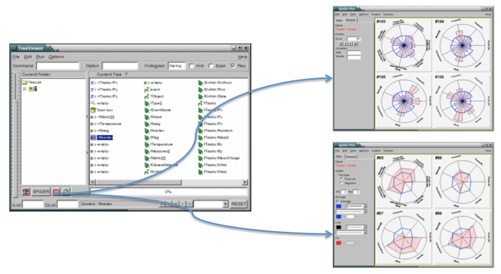
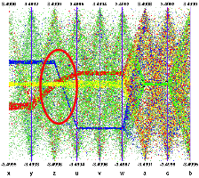
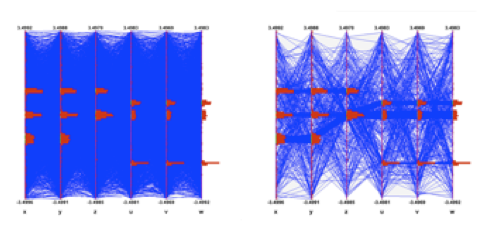
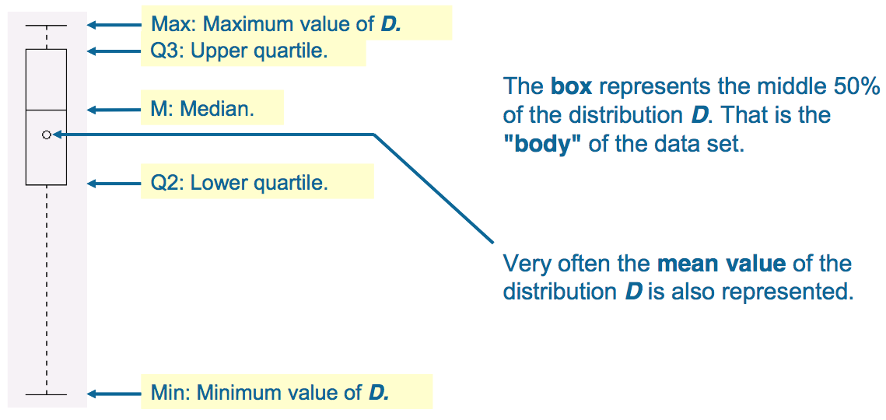

# Trees


## Why Should You Use a Tree?


In the "Input/Output" chapter, we saw how objects can be saved in ROOT
files. In case you want to store large quantities of same-class objects,
ROOT has designed the **`TTree`** and **`TNtuple`** classes specifically
for that purpose. The **`TTree`** class is optimized to reduce disk
space and enhance access speed. A **`TNtuple`** is a **`TTree`** that is
limited to only hold floating-point numbers; a **`TTree`** on the other
hand can hold all kind of data, such as objects or arrays in addition to
all the simple types.

When using a **`TTree`**, we fill its branch buffers with leaf data and
the buffers are written to disk when it is full. Branches, buffers, and
leafs, are explained a little later in this chapter, but for now, it is
important to realize that each object is not written individually, but
rather collected and written a bunch at a time.

This is where the **`TTree`** takes advantage of compression and will
produce a much smaller file than if the objects were written
individually. Since the unit to be compressed is a buffer, and the
**`TTree`** contains many same-class objects, the header of the objects
can be compressed.

The **`TTree`** reduces the header of each object, but it still contains
the class name. Using compression, the class name of each same-class
object has a good chance of being compressed, since the compression
algorithm recognizes the bit pattern representing the class name. Using
a **`TTree`** and compression the header is reduced to about 4 bytes
compared to the original 60 bytes. However, if compression is turned
off, you will not see these large savings.

The **`TTree`** is also used to optimize the data access. A tree uses a
hierarchy of branches, and each branch can be read independently from
any other branch. Now, assume that `Px` and `Py` are data members of the
event, and we would like to compute `Px2 + Py2` for every event
and histogram the result.

If we had saved the million events without a **`TTree`** we would have
to:

-   read each event in its entirety into memory
-   extract the `Px` and `Py` from the event
-   compute the sum of the squares
-   fill a histogram

We would have to do that a million times! This is very time consuming,
and we really do not need to read the entire event, every time. All we
need are two little data members (`Px` and `Py`). On the other hand, if
we use a tree with one branch containing `Px` and another branch
containing `Py`, we can read all values of `Px` and `Py` by only reading
the `Px` and `Py` branches. This makes the use of the **`TTree`** very
attractive.

## A Simple TTree


This script builds a **`TTree`** from an ASCII file containing
statistics about the staff at CERN. This script, `cernbuild.C` and its input
file `cernstaff.dat` are in `$ROOTSYS/tutorials/tree`.

``` {.cpp}
{
   // Simplified version of cernbuild.C.
   // This macro to read data from an ascii file and
   // create a root file with a TTree

   Int_t           Category;
   UInt_t          Flag;
   Int_t           Age;
   Int_t           Service;
   Int_t           Children;
   Int_t           Grade;
   Int_t           Step;
   Int_t           Hrweek;
   Int_t           Cost;
   Char_t          Division[4];
   Char_t          Nation[3];

   FILE *fp = fopen("cernstaff.dat","r");

   TFile *hfile = hfile = TFile::Open("cernstaff.root","RECREATE");

   TTree *tree = new TTree("T","CERN 1988 staff data");
   tree->Branch("Category",&Category,"Category/I");
   tree->Branch("Flag",&Flag,"Flag/i");
   tree->Branch("Age",&Age,"Age/I");
   tree->Branch("Service",&Service,"Service/I");
   tree->Branch("Children",&Children,"Children/I");
   tree->Branch("Grade",&Grade,"Grade/I");
   tree->Branch("Step",&Step,"Step/I");
   tree->Branch("Hrweek",&Hrweek,"Hrweek/I");
   tree->Branch("Cost",&Cost,"Cost/I");
   tree->Branch("Division",Division,"Division/C");
   tree->Branch("Nation",Nation,"Nation/C");
   char line[80];
   while (fgets(line,80,fp)) {
      sscanf(&line[0],"%d %d %d %d %d %d %d  %d %d %s %s",
      &Category,&Flag,&Age,&Service,&Children,&Grade,&Step,&Hrweek,&Cost,Division,Nation);
      tree->Fill();
   }
   tree->Print();
   tree->Write();

   fclose(fp);
   delete hfile;
}
```

The script opens the
ASCII file, creates a ROOT file and a **`TTree`**. Then it creates
branches with the `TTree::Branch` method. The first parameter of the
`Branch` method is the branch name. The second parameter is the address
from which the first leaf is to be read. Once the branches are defined, the script
reads the data from the ASCII file into C variables and
fills the `tree`. The ASCII file is closed, and the ROOT file is written
to disk saving the `tree`. Remember, trees (and histograms) are created in
the current directory, which is the file in our example. Hence a
`f->Write() `saves the tree.

## Show an Entry with TTree::Show


An easy way to access one entry of a tree is the use the `TTree::Show`
method. For example to look at the 10th entry in the `cernstaff.root` tree:

``` {.cpp}
root[] TFile f("cernstaff.root")
root[] T->Show(10)
======> EVENT:10
 Category        = 361
 Flag            = 15
 Age             = 51
 Service         = 29
 Children        = 0
 Grade           = 7
 Step            = 13
 Hrweek          = 40
 Cost            = 7599
 Division        = PS
 Nation          = FR
```

## Print the Tree Structure with TTree::Print


A helpful command to see the tree structure meaning the number of
entries, the branches and the leaves, is `TTree::Print`.

``` {.cpp}
root[] T->Print()
**********************************************************************
*Tree    :T         : staff data from ascii file                     *
*Entries :3354      : Total = 245417 bytes  File  Size =        59945*
*                     Tree compression factor =   2.90               *
**********************************************************************
*Br    0 :staff     :Category/I:Flag:Age:Service:Children:Grade:...  *
*         | Cost                                                     *
*Entries :3354 : Total Size  = 154237 bytes  File Size = 32316       *
*Baskets :   3 : Basket Size =  32000 bytes  Compression= 2.97       *
```

## Scan a Variable the Tree with TTree::Scan


The `TTree::Scan` method shows all values of the list of leaves
separated by a colon.

``` {.cpp}
root[] T->Scan("Cost:Age:Children")
************************************************
*    Row   *      Cost *       Age *  Children *
************************************************
*        0 *     11975 *        58 *         0 *
*        1 *     10228 *        63 *         0 *
*        2 *     10730 *        56 *         2 *
*        3 *      9311 *        61 *         0 *
*        4 *      9966 *        52 *         2 *
*        5 *      7599 *        60 *         0 *
*        6 *      9868 *        53 *         1 *
*        7 *      8012 *        60 *         1 *
...
```

## The Tree Viewer


The tree viewer is a quick and easy way to examine a tree. To start the
tree viewer, open a file and object browser. Right click on a
**`TTree`** and select `StartViewer`. You can also start the tree viewer
from the command line. First load the viewer library.


``` {.cpp}
root[] TFile f("cernstaff.root")
root[] T->StartViewer()
```

If you want to start a tree viewer without a tree, you need to load the
tree player library first:

``` {.cpp}
root[] gSystem->Load("libTreeViewer.so")
root[] new TTreeViewer()
```

The figure above shows how the tree viewer looks like for the example file
`cernstaff.root`. The left panel contains the list of trees and their
branches; in this case there is only one tree. You can add more trees
with the File-Open command to open the file containing the new tree,
then use the context menu on the right panel, select `SetTreeName` and
enter the name of the tree to add. On the right are the leaves or
variables in the tree. You can double click on any leaf to a histogram
it.

The toolbar in the upper part can be used for user commands, changing
the drawing option and the histogram name. The lower part contains three
picture buttons that draw a histogram, stop the current command, and
refresh the tree.


The three check buttons toggle the following:

`Hist`- the histogram drawing mode;

`Scan`- enables redirecting of `TTree::Scan `command in an ASCII file;

`Rec` - enables recording of the last issued command.

-  To draw more than one dimension you can drag
and drop any leaf to the `X,Y,Z` boxes". Then push the Draw button,
witch is marked with the purple icon on the bottom left.

-  All commands can be interrupted at any time
by pressing this button.

-  The method **`TTree::Refresh`** is called by
pressing the refresh button in `TTreeViewer`. It redraws the current
exposed expression. Calling `TTree::Refresh` is useful when a tree is
produced by a writer process and concurrently analyzed by one or more
readers.

-  To add a cut/weight to the histogram, enter an
expression in the "cut box". The cut box is the one with the scissor
icon.

Below them there are two text widgets for specifying the input and
output event lists. A Tree Viewer session is made by the list of
user-defined expressions and cuts, applying to a specified tree. A
session can be saved using File / `SaveSource` menu or the `SaveSource`
method from the context menu of the right panel. This will create a
macro having as default name `treeviewer.C` that can be ran at any time
to reproduce the session.

Besides the list of user-defined expressions, a session may contain a
list of RECORDS. A record can be produced in the following way: dragging
leaves/expression on X/Y/Z; changing drawing options; clicking the RED
button on the bottom when happy with the histogram

NOTE that just double clicking a leaf will not produce a record: the
histogram must be produced when clicking the DRAW button on the
bottom-left. The records will appear on the list of records in the
bottom right of the tree viewer. Selecting a record will draw the
corresponding histogram. Records can be played using the arrow buttons
near to the record button. When saving the session, the list of records
is being saved as well.

Records have a default name corresponding to the Z: Y: X selection, but
this can be changed using `SetRecordName()` method from the right panel
context menu. You can create a new expression by right clicking on any
of the` E()` boxes. The expression can be dragged and dropped into any
of the boxes (`X,` `Y,` `Z,` `Cut`, or `Scan`). To scan one or more
variables, drop them into the Scan box, then double click on the box.
You can also redirect the result of the scan to a file by checking the
Scan box on top.


When the "`Rec`" box is checked, the `Draw` and `Scan` commands are
recorded in the history file and echoed on the command line. The
"Histogram" text box contains the name of the resulting histogram. By
default it is `htemp`. You can type any name, if the histogram does not
exist it will create one. The Option text box contains the list of Draw
options. See "Draw Options". You can select the options with the Options
menu. The Command box lets you enter any command that you could also
enter on the command line. The vertical slider on the far left side can
be used to select the minimum and maximum of an event range. The actual
start and end index are shown in on the bottom in the status window.

There is an extensive help utility accessible with the Help menu. The
`IList` and `OList` are to `specify` an input list of entry indices and
a name for the output list respectively. Both need to be of type
**`TList`** and contain integers of entry indices. These lists are
described below in the paragraph "**Error! Reference source not
found.**".


The first one is a plot of the age distribution, the second a scatter
plot of the cost vs. age. The second one was generated by dragging the
age leaf into the Y-box and the cost leaf into the X-box, and pressing
the Draw button. By default, this will generate a scatter plot. Select a
different option, for example `"lego"` to create a 2D histogram.

## Creating and Saving Trees


This picture shows the **`TTree`** class:


To create a **`TTree`** we use its constructor. Then we design our data
layout and add the branches. A tree can be created by giving a name and
title:

``` {.cpp}
   TTree t("MyTree","Example Tree");
```

### Creating a Tree from a Folder Hierarchy


An alternative way to create a tree and organize it is to use folders
(see "Folders and Tasks"). You can build a folder structure and create a
tree with branches for each of the sub-folders:

``` {.cpp}
   TTree folder_tree("MyFolderTree","/MyFolder");
```

The second argument `"/MyFolder" `is the top folder, and the "/" signals
the **`TTree`** constructor that this is a folder not just the title.
You fill the tree by placing the data into the folder structure and
calling `TTree::Fill`.

### Tree and TRef Objects


``` {.cpp}
   MyTree->BranchRef();
```

This call requests the construction of an optional branch supporting
table of references (**`TRefTable`**). This branch (**`TBranchRef`**)
will keep all the information needed to find the branches containing
referenced objects at each `Tree::Fill`, the branch numbers containing
the referenced objects are saved in the table of references. When the
Tree header is saved (via `TTree::Write` for example), the branch is
saved, keeping the information with the pointers to the branches having
referenced objects. Enabling this optional table, allow
`TTree::Draw` to automatically load the branches needed to
dereference a **`TRef`** (or **`TRefArray`**) object.

### Autosave


`Autosave` gives the option to save all branch buffers every `n` byte.
We recommend using `Autosave` for large acquisitions. If the acquisition
fails to complete, you can recover the file and all the contents since
the last `Autosave`. To set the number of bytes between `Autosave` you
can use the `TTree::SetAutosave()` method. You can also call
**`TTree::Autosave` in the acquisition loop every `n `entry.**

### Trees with Circular Buffers


When a **`TTree`** is memory resident, you set it up so that it retains
retain only the last few entries. For example, this can be very useful
for monitoring purpose.

``` {.cpp}
   void TTree::SetCircular(Long64_t maxEntries);
```

where `maxEntries` is the maximum number of entries to be kept in the
buffers. When the number of entries exceeds this value, the first
entries in the **`Tree`** are deleted and the buffers used again. An
example of a script using a circular buffer is shown below:

``` {.cpp}
void circular() {
   gROOT->cd(); //make sure that the Tree is memory resident
   TTree *T = new TTree("T","test circular buffers");
   TRandom r;
   Float_t px,py,pz;
   Double_t random;
   UShort_t i;
   T->Branch("px",&px,"px/F");
   T->Branch("py",&py,"py/F");
   T->Branch("pz",&pz,"pz/F");
   T->Branch("random",&random,"random/D");
   T->Branch("i",&i,"i/s");
   T->SetCircular(20000);
   for (i = 0; i < 65000; i++) {
      r.Rannor(px,py);
      pz = px*px + py*py;
      random = r.Rndm();
      T->Fill();
   }
   T->Print();
}
```

### Size of TTree in the File


When writing a **`TTree`** to a file, if the file size reaches the value
stored in the `TTree::GetMaxTreeSize()`, the current file is closed and
a new file is created. If the original file is named "`myfile.root`",
subsequent files are named "`myfile_1.root`", "`myfile_2.root`", etc.

Currently, the automatic change of file is restricted to the case where
the tree is in the top level directory. The file should not contain
sub-directories. Before switching to a new file, the tree header is
written to the current file, then the current file is closed. To process
the multiple files created by `ChangeFile()`, one must use a
**`TChain`**.

The new file name has a suffix "`_N`" where `N` is equal to
`fFileNumber+1`. By default a Root session starts with `fFileNumber=0`.
One can set `fFileNumber` to a different value via
`TTree::SetFileNumber()`. In case a file named "`_N`" already exists,
the function will try a file named "`__N`", then "`___N`", etc. The
maximum tree size can be set via the static function
`TTree::SetMaxTreeSize()`. The default value of `fgMaxTreeSize` is 100
GB. If the current file contains other objects (like **`TH1`** and
**`TTree`**), these objects are automatically moved to the new file.

### User Info Attached to a TTree Object


The function `TTree::GetUserInfo()` allows adding any object defined by
a user to the tree that is not depending on the entry number. For
example:

``` {.cpp}
   tree->GetUserInfo()->Add(myruninfo);
```

### Indexing a Tree


Use `TTree::BuildIndex()`, to build an index table using expressions
depending on the value in the leaves.

``` {.cpp}
tree->BuildIndex(majorname, minorname);
```

The index is built in the following way:

-   a pass on all entries is made like in `TTree::Draw()`
-   `var1 = majorname`
-   `var2 = minorname`
-   `sel  = ` $2^{31} \times majorname + minorname$
-   for each entry in the tree the sel expression is evaluated and the
    results array is sorted into `fIndexValues`

Once the index is computed, using the
`TTree::GetEntryWithIndex(majornumber, minornumber)` one entry can be
retrieved. Example:

``` {.cpp}
   // to create an index using leaves Run and Event
   tree.BuildIndex("Run","Event");
   // to read entry corresponding to Run=1234 and Event=56789
   tree.GetEntryWithIndex(1234,56789);
```

Note that `majorname` and `minorname` may be expressions using original
tree variables e.g.: "`run-90000`", "`event +3*xx`". In case an
expression is specified, the equivalent expression must be computed when
calling `GetEntryWithIndex()`. To build an index with only `majorname`,
specify `minorname="0"` (default).

Note that once the index is built, it can be saved with the **`TTree`**
object with:

``` {.cpp}
   tree.Write();     //if the file has been open in "update" mode
```

The most convenient place to create the index is at the end of the
filling process just before saving the tree header. If a previous index
was computed, it is redefined by this new call.

Note that this function can also be applied to a **`TChain`**. The
return value is the number of entries in the Index (\< 0 indicates
failure).

## Branches


The organization of branches allows the designer to optimize the data
for the anticipated use. The class for a branch is called **`TBranch`**.
If two variables are independent, and the designer knows the variables
will not be used together, they should be placed on separate branches.
If, however, the variables are related, such as the coordinates of a
point, it is most efficient to create one branch with both coordinates
on it. A variable on a **`TBranch`** is called a leaf (yes -
**`TLeaf`**). Another point to keep in mind when designing trees is that
branches of the same **`TTree`** can be written to separate files. To
add a **`TBranch`** to a **`TTree`** we call the
method **`TTree::Branch()`**. Note that we DO NOT use the `TBranch`
constructor.

The `TTree::Branch` method has several signatures. The branch type
differs by what is stored in it. A branch can hold an entire object, a
list of simple variables, contents of a folder, contents of a
**`TList`**, or an array of objects. Let's see some examples. To follow
along you will need the shared library `libEvent.so`. First, check if it
is in `$ROOTSYS/test`. If it is, copy it to your own area. If it is not
there, you have to build it by typing make in `$ROOTSYS/test`.

## Adding a Branch to Hold a List of Variables


As in the very first example (`cernstaff.root.root`)
the data we want to save is a list of simple variables, such as integers
or floats. In this case, we use the following `TTree::Branch` signature:

``` {.cpp}
   tree->Branch("Ev_Branch",&event,
                "temp/F:ntrack/I:nseg:nvtex:flag/i");
```

The first parameter is the branch name.

The second parameter is the address from which the first variable is to
be read. In the code above, "event" is a structure with one float and
three integers and one unsigned integer. You should not assume that the
compiler aligns the elements of a structure without gaps. To avoid
alignment problems, you need to use structures with same length members.
If your structure does not qualify, you need to create one branch for
each element of the structure.

The leaf name is NOT used to pick the variable out of the structure, but
is only used as the name for the leaf. This means that the list of
variables needs to be in a structure in the order described in the third
parameter.

This third parameter is a string describing the leaf list. Each leaf has
a name and a type separated by a "/" and it is separated from the next
leaf by a "`:`".

``` {.cpp}
<Variable>/<type>:<Variable>/<type>
```

The example on the next line has two leafs: a floating-point number
called temp and an integer named `ntrack`.

``` {.cpp}
"temp/F:ntrack/I:"
```

The type can be omitted and if no type is given, the same type as the
previous variable is assumed. This leaf list has three integers called
`ntrack`, `nseg`, and `nvtex`.

``` {.cpp}
"ntrack/I:nseg:nvtex"
```

There is one more rule: when no type is given for the very first leaf,
it becomes a `float` (F). This leaf list has three floats called `temp`,
`mass`, and `px`.

``` {.cpp}
"temp:mass:px"
```

The symbols used for the type are:

-   `C`: a character string terminated by the 0 character
-   `B`: an 8 bit signed integer
-   `b`: an 8 bit unsigned integer
-   `S`: a 16 bit signed integer
-   `s`: a 16 bit unsigned integer
-   `I`: a 32 bit signed integer
-   `i`: a 32 bit unsigned integer
-   `L`: a 64 bit signed integer
-   `l`: a 64 bit unsigned integer
-   `G`: a long signed integer, stored as 64 bit
-   `g`: a long unsigned integer, stored as 64 bit
-   `F`: a 32 bit floating point
-   `D`: a 64 bit floating point
-   `O`: [the letter 'o', not a zero] a boolean (Bool\_t)

The type is used for a byte count to decide how much space to allocate.
The variable written is simply the block of bytes starting at the
starting address given in the second parameter. It may or may not match
the leaf list depending on whether or not the programmer is being
careful when choosing the leaf address, name, and type.

By default, a variable will be copied with the number of bytes specified
in the type descriptor symbol. However, if the type consists of two
characters, the number specifies the number of bytes to be used when
copying the variable to the output buffer. The line below describes
`ntrack` to be written as a 16-bit integer (rather than a 32-bit
integer).

``` {.cpp}
"ntrack/I2"
```

With this Branch method, you can also add a leaf that holds an entire
array of variables. To add an array of floats use the `f[n]` notation
when describing the leaf.

``` {.cpp}
   Float_t  f[10];
   tree->Branch("fBranch",f,"f[10]/F");
```

You can also add an array of variable length:

``` {.cpp}
{
   TFile *f = new TFile("peter.root","recreate");
   Int_t nPhot;
   Float_t E[500];
   TTree* nEmcPhotons = new TTree("nEmcPhotons","EMC Photons");
   nEmcPhotons->Branch("nPhot",&nPhot,"nPhot/I");
   nEmcPhotons->Branch("E",E,"E[nPhot]/F");
}
```

See "Example 2: A Tree with a C Structure" below
(`$ROOTSYS/tutorials/tree/tree2.C`) and `staff.C` at the beginning of
this chapter.

## Adding a TBranch to Hold an Object


To write a branch to hold an event object, we need to load the
definition of the `Event` class, which is in `$ROOTSYS/test/libEvent.so`
(if it doesn't exist type make in `$ROOTSYS/test`). An object can be
saved in a tree if a ROOT dictionary for its class has been generated
and loaded.

``` {.cpp}
root[] .L libEvent.so
```

First, we need to open a file and create a tree.

``` {.cpp}
root[]     TFile *f = new TFile("AFile.root","RECREATE")
root[]     TTree *tree = new TTree("T","A Root Tree")
```

We need to create a pointer to an `Event` object that will be used as a
reference in the `TTree::Branch` method. Then we create a branch
with the `TTree::Branch` method.

``` {.cpp}
root[]     Event *event = new Event()
root[]     tree->Branch("EventBranch","Event",&event,32000,99)
```

To add a branch to hold an object we use the signature above. The first
parameter is the name of the branch. The second parameter is the name of
the class of the object to be stored. The third parameter is the address
of a pointer to the object to be stored.

Note that it is an address of a pointer to the object, not just a
pointer to the object.

The fourth parameter is the buffer size and is by default 32000 bytes.
It is the number of bytes of data for that branch to save to a buffer
until it is saved to the file. The last parameter is the split-level,
which is the topic of the next section. Static class members are not
part of an object and thus not written with the object. You could store
them separately by collecting these values in a special "status" object
and write it to the file outside of the tree. If it makes sense to store
them for each object, make them a regular data member.

### Setting the Split-level


To split a branch means to create a sub-branch for each data member in
the object. The split-level can be set to 0 to disable splitting or it
can be set to a number between 1 and 99 indicating the depth of
splitting.

If the split-level is set to zero, the whole object is written in its
entirety to one branch. The **`TTree`** will look like the one on the
right, with one branch and one leaf holding the entire event object.


When the split-level is 1, an object data member is assigned a branch.
If the split-level is 2, the data member objects will be split also, and
a split level of 3 its data members objects, will be split. As the
split-level increases so does the splitting depth. The ROOT default for
the split-level is 99. This means the object will be split to the
maximum.

#### Memory Considerations when Splitting a Branch

Splitting a branch can quickly generate many branches. Each branch has
its own buffer in memory. In case of many branches (say more than 100),
you should adjust the buffer size accordingly. A recommended buffer size
is 32000 bytes if you have less than 50 branches. Around 16000 bytes if
you have less than 100 branches and 4000 bytes if you have more than 500
branches. These numbers are recommended for computers with memory size
ranging from 32MB to 256MB. If you have more memory, you should specify
larger buffer sizes. However, in this case, do not forget that your file
might be used on another machine with a smaller memory configuration.

#### Performance Considerations when Splitting a Branch

A split branch is faster to read, but slightly slower to write. The
reading is quicker because variables of the same type are stored
consecutively and the type does not have to be read each time. It is
slower to write because of the large number of buffers as described
above. See "

Performance Benchmarks" for performance impact of split and non-split
mode.

#### Rules for Splitting

When splitting a branch, variables of different types are handled
differently. Here are the rules that apply when splitting a branch.

-   If a data member is a basic type, it becomes one branch of class
    **`TBranchElement`**.

-   A data member can be an array of basic types. In this case, one
    single branch is created for the array.

-   A data member can be a pointer to an array of basic types. The
    length can vary, and must be specified in the comment field of the
    data member in the class definition. See "Input/Output".

-   Pointer data member are not split, except for pointers to a
    **`TClonesArray`**. The **`TClonesArray`** (pointed to) is split if
    the split level is greater than two. When the split level is one,
    the **`TClonesArray`** is not split.

-   If a data member is a pointer to an object, a special branch is
    created. The branch will be filled by calling the class `Streamer`
    function to serialize the object into the branch buffer.

-   If a data member is an object, the data members of this object are
    split into branches according to the split-level (i.e. split-level
    \> 2).

-   Base classes are split when the object is split.

-   Abstract base classes are never split.

-   All STL containers are supported.

``` {.cpp}
   // STL vector of vectors of TAxis*
   vector<vector<TAxis *> >  fVectAxis;
   // STL map of string/vector
   map<string,vector<int> >  fMapString;
   // STL deque of pair
   deque<pair<float,float> > fDequePair;
```

-   As of ROOT 4.01/00, only `std::vector` of objects can be split.
    Support for splitting the other type of STL containers will be
    introduced in the near future.

-   C-structure data members are not supported in split mode.

-   An object that is not split may be slow to browse.

-   A STL container that is not split will not be accessible in the
    browser.

### Exempt a Data Member from Splitting


If you are creating a branch with an object and in general you want the
data members to be split, but you want to exempt a data member from the
split. You can specify this in the comment field of the data member:

``` {.cpp}
class Event : public TObject {
   private:
      EventHeader    fEvtHdr;      //|| Don't split the header
```

### Adding a Branch to Hold a TClonesArray


ROOT has two classes to manage arrays of objects. The **`TObjArray`**
can manage objects of different classes, and the **`TClonesArray`** that
specializes in managing objects of the same class (hence the name Clones
Array). **`TClonesArray`** takes advantage of the constant size of each
element when adding the elements to the array. Instead of allocating
memory for each new object as it is added, it reuses the memory. Here is
an example of the time a **`TClonesArray`** can save over a
**`TObjArray`**. We have 100,000 events, and each has 10,000 tracks,
which gives 1,000,000,000 tracks. If we use a **`TObjArray`** for the
tracks, we implicitly make a call to new and a corresponding call to
delete for each track. The time it takes to make a pair of new/delete
calls is about 7 s (10-6). If we multiply the number of tracks by 7 s,
(1,000,000,000 \* 7 \* 10-6) we calculate that the time allocating and
freeing memory is about 2 hours. This is the chunk of time saved when a
**`TClonesArray`** is used rather than a **`TObjArray`**. If you do not
want to wait 2 hours for your tracks (or equivalent objects), be sure to
use a **`TClonesArray`** for same-class objects arrays. Branches with
**`TClonesArrays`** use the same method (`TTree::Branch`) as any other
object described above. If splitting is specified the objects in the
**`TClonesArray`** are split, not the **`TClonesArray`** itself.

### Identical Branch Names


When a top-level object (say `event`), has two data members of the same
class the sub branches end up with identical names. To distinguish the
sub branch we must associate them with the master branch by including a
"`.`" (a dot) at the end of the master branch name. This will force the
name of the sub branch to be `master.sub` branch instead of simply `sub`
branch. For example, a tree has two branches `Trigger` and
`MuonTrigger`, each containing an object of the same class (`Trigger`).
To identify uniquely the sub branches we add the dot:

``` {.cpp}
   tree->Branch("Trigger.","Trigger",&b1,8000,1);
   tree->Branch("MuonTrigger.","Trigger",&b2,8000,1);
```

If `Trigger` has three members, `T1`, `T2`, `T3`, the two instructions
above will generate sub branches called: `Trigger.T1`, `Trigger.T2`,
`Trigger.T3`, `MuonTrigger.T1`, `MuonTrigger.T2`, and` MuonTrigger.T3`.

## Adding a Branch with a Folder


Use the syntax below to add a branch from a folder:

``` {.cpp}
   tree->Branch("/aFolder");
```

This method creates one branch for each element in the folder. The
method returns the total number of branches created.

## Adding a Branch with a Collection


This `Branch` method creates one branch for each element in the
collection.

``` {.cpp}
   tree->Branch(*aCollection, 8000, 99);
   // Int_t TTree::Branch(TCollection *list, Int_t bufsize,
   //                     Int_t splitlevel, const char *name)
```

The method returns the total number of branches created. Each entry in
the collection becomes a top level branch if the corresponding class is
not a collection. If it is a collection, the entry in the collection
becomes in turn top level branches, etc. The split level is decreased by
1 every time a new collection is found. For example if `list` is a
**`TObjArray`**\*

-   If `splitlevel = 1`, one top level branch is created for each
    element of the **`TObjArray`**.

-   If `splitlevel = 2`, one top level branch is created for each array
    element. If one of the array elements is a **`TCollection`**, one
    top level branch will be created for each element of this
    collection.

In case a collection element is a **`TClonesArray`**, the special Tree
constructor for **`TClonesArray`** is called. The collection itself
cannot be a **`TClonesArray`**. If `name` is given, all branch names
will be prefixed with `name_`.

*IMPORTANT NOTE1:* This function should not be called if `splitlevel<1`.
*IMPORTANT NOTE2:* The branches created by this function will have names
corresponding to the collection or object names. It is important to give
names to collections to avoid misleading branch names or identical
branch names. By default collections have a name equal to the
corresponding class name, e.g. the default name of **`TList`** is
"`TList`".

## Examples for Writing and Reading Trees


The following sections are examples of writing and reading trees
increasing in complexity from a simple tree with a few variables to a
tree containing folders and complex Event objects. Each example has a
named script in the `$ROOTSYS/tutorials/tree` directory. They are called
tree1.C to tree4.C. The examples are:

-   `tree1.C`: a tree with several simple (integers and floating point)
    variables.

-   `tree2.C`: a tree built from a C structure (`struct`). This example
    uses the `Geant3` C wrapper as an example of a FORTRAN common block
    ported to C with a C structure.

-   `tree3.C:` in this example, we will show how to extend a tree with a
    branch from another tree with the Friends feature. These trees have
    branches with variable length arrays. Each entry has a variable
    number of tracks, and each track has several variables.

-   `tree4.C:` a tree with a class (`Event`). The class Event is defined
    in `$ROOTSYS/test`. In this example we first encounter the impact of
    splitting a branch.

Each script contains the main function, with the same name as the file
(i.e. `tree1`), the function to write - `tree1w`, and the function to
read - `tree1r`. If the script is not run in batch mode, it displays the
tree in the browser and tree viewer. To study the example scripts, you
can either execute the main script, or load the script and execute a
specific function. For example:

``` {.cpp}
// execute the function that writes, reads, shows the tree
root[]     x tree1.C
// use ACLiC to build shared library, check syntax, execute
root[] x tree1.C++
// Load the script and select a function to execute
root[]     L tree1.C
root[]     tree1w()
root[]     tree1r()
```

## Example 1: A Tree with Simple Variables


This example shows how to write, view, and read a tree with several
simple (integers and floating-point) variables.

### Writing the Tree


Below is the function that writes the tree (`tree1w`). First, the
variables are defined (`px, py, pz,` `random` and `ev`). Then we add a
branch for each of the variables to the tree, by calling the
`TTree::Branch` method for each variable.

``` {.cpp}
void tree1w(){

   // create a tree file tree1.root - create the file, the Tree and
   // a few branches
   TFile f("tree1.root","recreate");
   TTree t1("t1","a simple Tree with simple variables");
   Float_t px, py, pz;
   Double_t random;
   Int_t ev;
   t1.Branch("px",&px,"px/F");
   t1.Branch("py",&py,"py/F");
   t1.Branch("pz",&pz,"pz/F");
   t1.Branch("ev",&ev,"ev/I");

   // fill the tree
   for (Int_t i=0; i<10000; i++) {
      gRandom->Rannor(px,py);
      pz = px*px + py*py;
      random = gRandom->Rndm();
      ev = i;
      t1.Fill();
   }
   // save the Tree heade; the file will be automatically closed
   // when going out of the function scope
   t1.Write();
}
```

#### Creating Branches with A single Variable

This is the signature of `TTree::Branch` to create a branch with a list
of variables:

``` {.cpp}
   TBranch* TTree::Branch(const char* name,void* address,
                          const char* leaflist,
                          Int_t bufsize = 32000)
```

The first parameter is the branch name. The second parameter is the
address from which to read the value. The third parameter is the leaf
list with the name and type of each leaf. In this example, each branch
has only one leaf. In the box below, the branch is named `px` and has
one floating point type leaf also called `px`.

``` {.cpp}
   t1.Branch("px",&px,"px/F");
```

#### Filling the Tree

First we find some random values for the variables. We assign `px` and
`py` a Gaussian with mean = 0 and sigma = 1 by calling
`gRandom->Rannor(px,py)`, and calculate` pz`. Then we call the
`TTree::Fill()` method. The call `t1.Fill()` fills all branches in the
tree because we have already organized the tree into branches and told
each branch where to get the value from. After this script is executed
we have a ROOT file called `tree1.root` with a tree called `t1`. There
is a possibility to fill branches one by one using the method
`TBranch::Fill()`. In this case you do not need to call `TTree::Fill()`
method. The entries can be set by `TTree::SetEntries(Double_t n)`.
Calling this method makes sense only if the number of existing entries
is null.

### Viewing the Tree


In the right panel of the ROOT object browse are the branches: `ev`,
`px`, `py`, `pz`, and `random`. Note that these are shown as leaves
because they are "end" branches with only one leaf. To histogram a leaf,
we can simply double click on it in the browser. This is how the tree
`t1` looks in the Tree Viewer. Here we can add a cut and add other
operations for histogramming the leaves. See "The Tree Viewer". For
example, we can plot a two dimensional histogram.


### Reading the Tree


The `tree1r` function shows how to read the tree and access each entry
and each leaf. We first define the variables to hold the read values.

``` {.cpp}
   Float_t px, py, pz;
```

Then we tell the tree to populate these variables when reading an entry.
We do this with the method `TTree::SetBranchAddress`. The first
parameter is the branch name, and the second is the address of the
variable where the branch data is to be placed. In this example, the
branch name is `px`. This name was given when the tree was written (see
`tree1w`). The second parameter is the address of the variable `px`.

``` {.cpp}
   t1->SetBranchAddress("px",&px);
```

#### GetEntry

Once the branches have been given the address, a specific entry can be
read into the variables with the method `TTree::GetEntry(n)`. It
reads all the branches for entry (n) and populates the given address
accordingly. By default, `GetEntry()` reuses the space allocated by the
previous object for each branch. You can force the previous object to be
automatically deleted if you call `mybranch.SetAutoDelete(kTRUE)`
(default is `kFALSE`).

Consider the example in `$ROOTSYS/test/Event.h`. The top-level branch in
the tree `T` is declared with:

``` {.cpp}
   Event *event = 0;
   // event must be null or point to a valid object;
   // it must be initialized
   T.SetBranchAddress("event",&event);
```

When reading the Tree, one can choose one of these 3 options:

Option 1:

``` {.cpp}
   for (Int_t i = 0; i<nentries; i++) {
      T.GetEntry(i);
      //the object event has been filled at this point
   }
```

This is the default and recommended way to create an object of the class
`Event. `It will be pointed by `event`.

At the following entries, `event` will be overwritten by the new data.
All internal members that are **`TObject`**\* are automatically deleted.
It is important that these members be in a valid state when `GetEntry`
is called. Pointers must be correctly initialized. However these
internal members will not be deleted if the characters "`->`" are
specified as the first characters in the comment field of the data
member declaration.

The pointer member is read via the `pointer->Streamer(buf)` if "`->`" is
specified. In this case, it is assumed that the pointer is never null
(see pointer `TClonesArray *fTracks` in the `$ROOTSYS/test/Event`
example). If "`->`" is not specified, the pointer member is read via
`buf >> pointer`. In this case the pointer may be null. Note that the
option with "`->`" is faster to read or write and it also consumes less
space in the file.

Option 2 - the option `AutoDelete` is set:

``` {.cpp}
   TBranch *branch = T.GetBranch("event");
   branch->SetAddress(&event);
   branch->SetAutoDelete(kTRUE);
   for (Int_t i=0; i<nentries; i++) {
      T.GetEntry(i); // the object event has been filled at this point
   }
```

At any iteration, the `GetEntry` deletes the object `event` and a new
instance of `Event` is created and filled.

Option 3 - same as option 1, but you delete the event yourself:

``` {.cpp}
   for (Int_t i=0; i<nentries; i++) {
      delete event;
      event = 0;      //EXTREMELY IMPORTANT
      T.GetEntry(i);
      // the objrect event has been filled at this point
   }
```

It is strongly recommended to use the default option 1. It has the
additional advantage that functions like `TTree::Draw` (internally
calling `TTree::GetEntry`) will be functional even when the classes in
the file are not available. Reading selected branches is quicker than
reading an entire entry. If you are interested in only one branch, you
can use the `TBranch::GetEntry` method and only that branch is read.
Here is the script `tree1r`:

``` {.cpp}
void tree1r(){
   // read the Tree generated by tree1w and fill two histograms
   // note that we use "new" to create the TFile and TTree objects,
   // to keep them alive after leaving this function.
   TFile *f = new TFile("tree1.root");
   TTree *t1 = (TTree*)f->Get("t1");
   Float_t px, py, pz;
   Double_t random;
   Int_t ev;
   t1->SetBranchAddress("px",&px);
   t1->SetBranchAddress("py",&py);
   t1->SetBranchAddress("pz",&pz);
   t1->SetBranchAddress("random",&random);
   t1->SetBranchAddress("ev",&ev);
   // create two histograms
   TH1F *hpx   = new TH1F("hpx","px distribution",100,-3,3);
   TH2F *hpxpy = new TH2F("hpxpy","py vs px",30,-3,3,30,-3,3);
   //read all entries and fill the histograms
   Int_t nentries = (Int_t)t1->GetEntries();
   for (Int_t i=0; i<nentries; i++) {
      t1->GetEntry(i);
      hpx->Fill(px);
      hpxpy->Fill(px,py);
   }
   // We do not close the file. We want to keep the generated
   // histograms we open a browser and the TreeViewer
   if (gROOT->IsBatch()) return;
   new TBrowser ();
   t1->StartViewer();

   //In the browser, click on "ROOT Files", then on "tree1.root"
   //You can click on the histogram icons in the right panel to draw
   //them in the TreeViewer, follow the instructions in the Help.
}
```

## Example 2: A Tree with a C Structure


The executable script for this example is
`$ROOTSYS/tutorials/tree/tree2.C. `In this example we show:

-   how to build branches from a C structure
-   how to make a branch with a fixed length array
-   how to make a branch with a variable length array
-   how to read selective branches
-   how to fill a histogram from a branch
-   how to use `TTree::Draw` to show a 3D plot

A C structure (`struct`) is used to build a ROOT tree. In general we
discourage the use of C structures`,` we recommend using a class
instead. However, we do support them for legacy applications written in
C or FORTRAN. The example `struct` holds simple variables and arrays. It
maps to a Geant3 common block `/gctrak/. `This is the definition of the
common block/structure:

``` {.cpp}
const Int_t MAXMEC = 30;
// PARAMETER (MAXMEC=30)
// COMMON/GCTRAK/VECT(7),GETOT,GEKIN,VOUT(7)
//     + ,NMEC,LMEC(MAXMEC)
//     + ,NAMEC(MAXMEC),NSTEP
//     + ,PID,DESTEP,DESTEL,SAFETY,SLENG
//     + ,STEP,SNEXT,SFIELD,TOFG,GEKRAT,UPWGHT

typedef struct {
   Float_t  vect[7];
   Float_t  getot;
   Float_t  gekin;
   Float_t  vout[7];
   Int_t    nmec;
   Int_t    lmec[MAXMEC];
   Int_t    namec[MAXMEC];
   Int_t    nstep;
   Int_t    pid;
   Float_t  destep;
   Float_t  destel;
   Float_t  safety;
   Float_t  sleng;
   Float_t  step;
   Float_t  snext;
   Float_t  sfield;
   Float_t  tofg;
   Float_t  gekrat;
   Float_t  upwght;
} Gctrak_t;
```

When using Geant3, the common block is filled by Geant3 routines at each
step and only the `TTree::Fill` method needs to be called. In this
example we emulate the Geant3 step routine with the `helixStep`
function. We also emulate the filling of the particle values. The calls
to the `Branch` methods are the same as if Geant3 were used.

``` {.cpp}
void helixStep(Float_t step, Float_t *vect, Float_t *vout)
{
   // extrapolate track in constant field
   Float_t field = 20; // field in kilogauss
   enum Evect {kX,kY,kZ,kPX,kPY,kPZ,kPP};
   vout[kPP] = vect[kPP];

   Float_t h4    = field*2.99792e-4;
   Float_t rho   = -h4/vect[kPP];
   Float_t tet   = rho*step;
   Float_t tsint = tet*tet/6;
   Float_t sintt = 1 - tsint;
   Float_t sint  = tet*sintt;
   Float_t cos1t = tet/2;
   Float_t f1 = step*sintt;
   Float_t f2 = step*cos1t;
   Float_t f3 = step*tsint*vect[kPZ];
   Float_t f4 = -tet*cos1t;
   Float_t f5 = sint;
   Float_t f6 = tet*cos1t*vect[kPZ];

   vout[kX]  = vect[kX]  + (f1*vect[kPX] - f2*vect[kPY]);
   vout[kY]  = vect[kY]  + (f1*vect[kPY] + f2*vect[kPX]);
   vout[kZ]  = vect[kZ]  + (f1*vect[kPZ] + f3);
   vout[kPX] = vect[kPX] + (f4*vect[kPX] - f5*vect[kPY]);
   vout[kPY] = vect[kPY] + (f4*vect[kPY] + f5*vect[kPX]);
   vout[kPZ] = vect[kPZ] + (f4*vect[kPZ] + f6);
}
```

### Writing the Tree


``` {.cpp}
void tree2w() {
   // write tree2 example
   //create a Tree file tree2.root
   TFile f("tree2.root","recreate");

   //create the file, the Tree
   TTree t2("t2","a Tree with data from a fake Geant3");
   // declare a variable of the C structure type
   Gctrak_t gstep;

   // add the branches for a subset of gstep
   t2.Branch("vect",gstep.vect,"vect[7]/F");
   t2.Branch("getot",&gstep.getot,"getot/F");
   t2.Branch("gekin",&gstep.gekin,"gekin/F");
   t2.Branch("nmec",&gstep.nmec,"nmec/I");
   t2.Branch("lmec",gstep.lmec,"lmec[nmec]/I");
   t2.Branch("destep",&gstep.destep,"destep/F");
   t2.Branch("pid",&gstep.pid,"pid/I");

   //Initialize particle parameters at first point
   Float_t px,py,pz,p,charge=0;
   Float_t vout[7];
   Float_t mass  = 0.137;
   Bool_t newParticle = kTRUE;
   gstep.step    = 0.1;
   gstep.destep  = 0;
   gstep.nmec    = 0;
   gstep.pid     = 0;

   //transport particles
   for (Int_t i=0; i<10000; i++) {
      //generate a new particle if necessary (Geant3 emulation)
      if (newParticle) {
      px = gRandom->Gaus(0,.02);
      py = gRandom->Gaus(0,.02);
      pz = gRandom->Gaus(0,.02);
      p  = TMath::Sqrt(px*px+py*py+pz*pz);
      charge = 1;
      if (gRandom->Rndm() < 0.5) charge = -1;
         gstep.pid    += 1;
         gstep.vect[0] = 0;
         gstep.vect[1] = 0;
         gstep.vect[2] = 0;
         gstep.vect[3] = px/p;
         gstep.vect[4] = py/p;
         gstep.vect[5] = pz/p;
         gstep.vect[6] = p*charge;
         gstep.getot   = TMath::Sqrt(p*p + mass*mass);
         gstep.gekin   = gstep.getot - mass;
         newParticle   = kFALSE;
      }
      // fill the Tree with current step parameters
      t2.Fill();


      //transport particle in magnetic field (Geant3 emulation)
      helixStep(gstep.step, gstep.vect, vout);
      //make one step
      //apply energy loss
      gstep.destep   = gstep.step*gRandom->Gaus(0.0002,0.00001);
      gstep.gekin -= gstep.destep;
      gstep.getot  = gstep.gekin + mass;
      gstep.vect[6]= charge*TMath::Sqrt(gstep.getot*gstep.getot
                      - mass*mass);
      gstep.vect[0] = vout[0];
      gstep.vect[1] = vout[1];
      gstep.vect[2] = vout[2];
      gstep.vect[3] = vout[3];
      gstep.vect[4] = vout[4];
      gstep.vect[5] = vout[5];
      gstep.nmec    = (Int_t)(5*gRandom->Rndm());
      for (Int_t l=0; l<gstep.nmec; l++) gstep.lmec[l] = l;
      if  (gstep.gekin < 0.001) newParticle = kTRUE;
      if  (TMath::Abs(gstep.vect[2]) > 30) newParticle = kTRUE;
   }
   //save the Tree header. The file will be automatically
   // closed when going out of the function scope
   t2.Write();
}
```

#### Adding a Branch with a Fixed Length Array

At first, we create a tree and create branches for a subset of variables
in the C structure` Gctrak_t`. Then we add several types of branches.
The first branch reads seven floating-point values beginning at the
address of `'gstep.vect'`. You do not need to specify `&gstep.vect`,
because in C and C++ the array variable holds the address of the first
element.

``` {.cpp}
   t2.Branch("vect",gstep.vect,"vect[7]/F");
   t2.Branch("getot",&gstep.getot,"getot/F");
   t2.Branch("gekin",&gstep.gekin,"gekin/F");
```

#### Adding a Branch with a Variable Length Array

The next two branches are dependent on each other. The first holds the
length of the variable length array and the second holds the variable
length array. The `lmec` branch reads `nmec` number of integers
beginning at the address `gstep.lmec`.

``` {.cpp}
   t2.Branch("nmec",&gstep.nmec,"nmec/I");
   t2.Branch("lmec",gstep.lmec,"lmec[nmec]/I");
```

The variable `nmec` is a random number and is reset for each entry.

``` {.cpp}
   gstep.nmec = (Int_t)(5*gRandom->Rndm());
```

#### Filling the Tree

In this emulation of Geant3, we generate and transport particles in a
magnetic field and store the particle parameters at each tracking step
in a ROOT tree.

### Analysis


In this analysis, we do not read the entire entry we only read one
branch. First, we set the address for the branch to the file `dstep`,
and then we use the `TBranch::GetEntry` method. Then we fill a histogram
with the `dstep` branch entries, draw it and fit it with a Gaussian. In
addition, we draw the particle's path using the three values in the
vector. Here we use the **`TTree::Draw`** method. It automatically creates
a histogram and plots the 3 expressions (see Trees in Analysis).


``` {.cpp}
void tree2r() {

   // read the Tree generated by tree2w and fill one histogram
   // we are only interested by the destep branch

   // note that we use "new" to create the TFile and TTree objects because we
   // want to keep these objects alive when we leave this function
   TFile *f = new TFile("tree2.root");
   TTree *t2 = (TTree*)f->Get("t2");
   static Float_t destep;
   TBranch *b_destep = t2->GetBranch("destep");
   b_destep->SetAddress(&destep);

   //create one histogram
   TH1F *hdestep = new TH1F("hdestep","destep in Mev",100,1e-5,3e-5);
   //read only the destep branch for all entries
   Int_t nentries = (Int_t)t2->GetEntries();
   for (Int_t i=0;i<nentries;i++) {
      b_destep->GetEntry(i);
      // fill the histogram with the destep entry
      hdestep->Fill(destep);
   }

   // we do not close the file; we want to keep the generated histograms;
   // we fill a 3-d scatter plot with the particle step coordinates
   TCanvas *c1 = new TCanvas("c1","c1",600,800);
   c1->SetFillColor(42);
   c1->Divide(1,2);

   c1->cd(1);
   hdestep->SetFillColor(45);
   hdestep->Fit("gaus");

   c1->cd(2);
   gPad->SetFillColor(37);                       // continued...
   t2->SetMarkerColor(kRed);
   t2->Draw("vect[0]:vect[1]:vect[2]");
   if (gROOT->IsBatch()) return;

   // invoke the x3d viewer
   gPad->GetViewer3D("x3d");
}
```

## Example 3: Adding Friends to Trees


In this example, we will show how to extend a tree with a branch from
another tree with the Friends feature.

### Adding a Branch to an Existing Tree


You may want to add a branch to an existing tree. For example, if one
variable in the tree was computed with a certain algorithm, you may want
to try another algorithm and compare the results. One solution is to add
a new branch, fill it, and save the tree. The code below adds a simple
branch to an existing tree. Note that the `kOverwrite` option in the
`Write` method overwrites the existing tree. If it is not specified, two
copies of the tree headers are saved.

``` {.cpp}
void tree3AddBranch() {
   TFile f("tree3.root","update");
   Float_t new_v;
   TTree *t3 = (TTree*)f->Get("t3");
   TBranch *newBranch = t3-> Branch("new_v",&new_v,"new_v/F");
   //read the number of entries in the t3
   Int_t nentries = (Int_t)t3->GetEntries();
   for (Int_t i = 0; i < nentries; i++){
      new_v= gRandom->Gaus(0,1);
      newBranch->Fill();
   }
   t3->Write("",TObject::kOverwrite); // save only the new version of
                                      // the tree
}
```

Adding a branch is often not possible because the tree is in a read-only
file and you do not have permission to save the modified tree with the
new branch. Even if you do have the permission, you risk loosing the
original tree with an unsuccessful attempt to save the modification.
Since trees are usually large, adding a branch could extend it over the
2GB limit. In this case, the attempt to write the tree fails, and the
original data is may also be corrupted. In addition, adding a branch to
a tree enlarges the tree and increases the amount of memory needed to
read an entry, and therefore decreases the performance. For these
reasons, ROOT offers the concept of friends for trees (and chains). We
encourage you to use `TTree::AddFriend` rather than adding a branch
manually.

### TTree::AddFriend


A tree keeps a list of friends. In the context of a tree (or a chain),
friendship means unrestricted access to the friends data. In this way it
is much like adding another branch to the tree without taking the risk
of damaging it. To add a friend to the list, you can use the
`TTree::AddFriend` method. The **`TTree`** (`tree`) below has two
friends (`ft1` and `ft2`) and now has access to the variables
`a,b,c,i,j,k,l` and `m`.


The `AddFriend` method has two parameters, the first is the tree name
and the second is the name of the ROOT file where the friend tree is
saved. `AddFriend` automatically opens the friend file. If no file name
is given, the tree called `ft1` is assumed to be in the same file as the
original tree.

``` {.cpp}
   tree.AddFriend("ft1","friendfile1.root");
```

If the friend tree has the same name as the original tree, you can give
it an alias in the context of the friendship:

``` {.cpp}
   tree.AddFriend("tree1 = tree","friendfile1.root");
```

Once the tree has friends, we can use `TTree::Draw` as if the friend's
variables were in the original tree. To specify which tree to use in the
`Draw` method, use the syntax:

``` {.cpp}
<treeName>.<branchname>.<varname>
```

If the `variablename` is enough to identify uniquely the variable, you
can leave out the tree and/or branch name.

For example, these commands generate a 3-d scatter plot of variable
"`var`" in the **`TTree`** `tree` versus variable `v1 in `TTree ft1`
versus variable `v2` in **`TTree`** `ft2`.

``` {.cpp}
   tree.AddFriend("ft1","friendfile1.root");
   tree.AddFriend("ft2","friendfile2.root");
   tree.Draw("var:ft1.v1:ft2.v2");
```

The picture illustrates the access of the tree
and its friends with a `Draw` command.

When `AddFriend` is called, the ROOT file is automatically opened and
the friend tree (`ft1)` header is read into memory. The new friend
(`ft1`) is added to the list of friends of `tree`. The number of entries
in the friend must be equal or greater to the number of entries of the
original tree. If the friend tree has fewer entries, a warning is given
and the missing entries are not included in the histogram.

Use `TTree::GetListOfFriends` to retrieve the list of friends from a
tree.

When the tree is written to file (`TTree::Write`), the friends list is
saved with it. Moreover, when the tree is retrieved, the trees on the
friends list are also retrieved and the friendship restored. When a tree
is deleted, the elements of the friend list are also deleted. It is
possible to declare a friend tree that has the same internal structure
(same branches and leaves) as the original tree, and compare the same
values by specifying the tree.

``` {.cpp}
   tree.Draw("var:ft1.var:ft2.var");
```

The example code is in `$ROOTSYS/tutorials/tree/tree3.C`. Here is the
script:

``` {.cpp}
void tree3w() {
   // Example of a Tree where branches are variable length arrays
   // A second Tree is created and filled in parallel.
   // Run this script with .x tree3.C
   // In the function treer, the first Tree is open.
   // The second Tree is declared friend of the first tree.
   // TTree::Draw is called with variables from both Trees.
   const Int_t kMaxTrack = 500;
   Int_t ntrack;
   Int_t stat[kMaxTrack];
   Int_t sign[kMaxTrack];
   Float_t px[kMaxTrack];
   Float_t py[kMaxTrack];
   Float_t pz[kMaxTrack];
   Float_t pt[kMaxTrack];
   Float_t zv[kMaxTrack];
   Float_t chi2[kMaxTrack];
   Double_t sumstat;

   // create the first root file with a tree
   TFile f("tree3.root","recreate");
   TTree *t3 = new TTree("t3","Reconst ntuple");
   t3->Branch("ntrack",&ntrack,"ntrack/I");
   t3->Branch("stat",stat,"stat[ntrack]/I");
   t3->Branch("sign",sign,"sign[ntrack]/I");
   t3->Branch("px",px,"px[ntrack]/F");
   t3->Branch("py",py,"py[ntrack]/F");
   t3->Branch("pz",pz,"pz[ntrack]/F");
   t3->Branch("zv",zv,"zv[ntrack]/F");
   t3->Branch("chi2",chi2,"chi2[ntrack]/F");

   // create the second root file with a different tree
   TFile fr("tree3f.root","recreate");
   TTree *t3f = new TTree("t3f","a friend Tree");
   t3f->Branch("ntrack",&ntrack,"ntrack/I");
   t3f->Branch("sumstat",&sumstat,"sumstat/D");
   t3f->Branch("pt",pt,"pt[ntrack]/F");

   // Fill the trees
   for (Int_t i=0;i<1000;i++) {
      Int_t nt = gRandom->Rndm()*(kMaxTrack-1);
      ntrack = nt;
      sumstat = 0;
      // set the values in each track
      for (Int_t n=0;n<nt;n++) {
         stat[n] = n%3;
         sign[n] = i%2;
         px[n]   = gRandom->Gaus(0,1);
         py[n]   = gRandom->Gaus(0,2);
         pz[n]   = gRandom->Gaus(10,5);
         zv[n]   = gRandom->Gaus(100,2);
         chi2[n] = gRandom->Gaus(0,.01);
         sumstat += chi2[n];
         pt[n]   = TMath::Sqrt(px[n]*px[n] + py[n]*py[n]);
      }
      t3->Fill();
      t3f->Fill();
   }
   // Write the two files
   t3->Print();
   f.cd();
   t3->Write();
   fr.cd();
   t3f->Write();
}

// Function to read the two files and add the friend
void tree3r()         {
   TFile *f = new TFile("tree3.root");
   TTree *t3 = (TTree*)f->Get("t3");
   // Add the second tree to the first tree as a friend
   t3->AddFriend("t3f","tree3f.root");
   // Draw pz which is in the first tree and use pt
   // in the condition. pt is in the friend tree.
   t3->Draw("pz","pt>3");
}

// This is executed when typing .x tree3.C
void tree3() {
   tree3w();
   tree3r();
}
```

## Example 4: A Tree with an Event Class


This example is a simplified version of `$ROOTSYS/test/MainEvent.cxx`
and where Event objects are saved in a tree. The full definition of
`Event` is in `$ROOTSYS/test`/`Event.h`. To execute this macro, you will
need the library `$ROOTSYS/test/libEvent.so`. If it does not exist you
can build the test directory applications by following the instruction
in the `$ROOTSYS/test/README` file.

In this example we will show

-   the difference in splitting or not splitting a branch
-   how to read selected branches of the tree,
-   how to print a selected entry

### The Event Class


`Event` is a descendent of **`TObject`**. As such it inherits the data
members of **`TObject`** and its methods such as `Dump()` and
`Inspect() `and` Write()`. In addition, because it inherits from
**`TObject`** it can be a member of a collection. To summarize, the
advantages of inheriting from a **`TObject`** are:

-   Inherit the `Write`, `Inspect`, and `Dump` methods
-   Enables a class to be a member of a ROOT collection
-   Enables RTTI

Below is the list of the `Event` data members. It contains a character
array, several integers, a floating-point number, and an `EventHeader`
object. The `EventHeader` class is described in the following paragraph.
`Event` also has two pointers, one to a **`TClonesArray`** of tracks and
one to a histogram. The string "`->`" in the comment field of the
members `*fTracks` and `*fH` instructs the automatic `Streamer` to
assume that the objects `*fTracks` and `*fH` are never null pointers and
that `fTracks->Streamer` can be used instead of the more time consuming
form `R__b << fTracks`.

``` {.cpp}
class Event : public TObject {
   private:
      char                 fType[20];
      Int_t                fNtrack;
      Int_t                fNseg;
      Int_t                fNvertex;
      UInt_t               fFlag;
      Float_t              fTemperature;
      EventHeader          fEvtHdr;
      TClonesArray        *fTracks;            //->
      TH1F                *fH;                 //->
      Int_t                fMeasures[10];
      Float_t              fMatrix[4][4];
      Float_t             *fClosestDistance;   //[fNvertex]
      static TClonesArray *fgTracks;
      static TH1F         *fgHist;
      // ... list of methods
      ClassDef(Event,1)  //Event structure
};
```

### The EventHeader Class


The `EventHeader` class (also defined in `Event.h`) does not inherit
from **`TObject`**. Beginning with ROOT 3.0, an object can be placed on
a branch even though it does not inherit from **`TObject`**. In previous
releases branches were restricted to objects inheriting from the
**`TObject`**. However, it has always been possible to write a class not
inheriting from **`TObject`** to a tree by encapsulating it in a
**`TObject`** descending class as is the case in `EventHeader` and
`Event`.

``` {.cpp}
class EventHeader {
   private:
      Int_t   fEvtNum;
      Int_t   fRun;
      Int_t   fDate;
      // ... list of methods
      ClassDef(EventHeader,1)      //Event Header
};
```

### The Track Class


The `Track` class descends from **`TObject`** since tracks are in a
**`TClonesArray`** (i.e. a ROOT collection class) and contains a
selection of basic types and an array of vertices. Its **`TObject`**
inheritance enables `Track` to be in a collection and in `Event` is a
**`TClonesArray`** of `Tracks`.

``` {.cpp}
class Track : public TObject {
   private:
      Float_t   fPx;         //X component of the momentum
      Float_t   fPy;         //Y component of the momentum
      Float_t   fPz;         //Z component of the momentum
      Float_t   fRandom;     //A random track quantity
      Float_t   fMass2;      //The mass square of this particle
      Float_t   fBx;         //X intercept at the vertex
      Float_t   fBy;         //Y intercept at the vertex
      Float_t   fMeanCharge; //Mean charge deposition of all hits
      Float_t   fXfirst;     //X coordinate of the first point
      Float_t   fXlast;      //X coordinate of the last point
      Float_t   fYfirst;     //Y coordinate of the first point
      Float_t   fYlast;      //Y coordinate of the last point
      Float_t   fZfirst;     //Z coordinate of the first point
      Float_t   fZlast;      //Z coordinate of the last point
      Float_t   fCharge;     //Charge of this track
      Float_t   fVertex[3];  //Track vertex position
      Int_t     fNpoint;     //Number of points for this track
      Short_t   fValid;      //Validity criterion

      // method definitions ...
      ClassDef(Track,1)          //A track segment
};
```

### Writing the Tree


We create a simple tree with two branches both holding `Event` objects.
One is split and the other is not. We also create a pointer to an
`Event` object (`event`).

``` {.cpp}
void tree4w() {
   // check to see if the event class is in the dictionary
   // if it is not load the definition in libEvent.so
   if (!TClassTable::GetDict("Event")) {
      gSystem->Load("$ROOTSYS/test/libEvent.so");
   }
   // create a Tree file tree4.root
   TFile f("tree4.root","RECREATE");
   // create a ROOT Tree
   TTree t4("t4","A Tree with Events");
   // create a pointer to an Event object
   Event *event = new Event();
   // create two branches, split one
   t4.Branch("event_branch", "Event", &event,16000,2);
   t4.Branch("event_not_split", "Event", &event,16000,0);

   // a local variable for the event type
   char etype[20];

   // fill the tree
   for (Int_t ev = 0; ev <100; ev++) {
      Float_t sigmat, sigmas;
      gRandom->Rannor(sigmat,sigmas);
      Int_t ntrack   = Int_t(600 + 600 *sigmat/120.);
      Float_t random = gRandom->Rndm(1);
      sprintf(etype,"type%d",ev%5);
      event->SetType(etype);
      event->SetHeader(ev, 200, 960312, random);
      event->SetNseg(Int_t(10*ntrack+20*sigmas));
      event->SetNvertex(Int_t(1+20*gRandom->Rndm()));
      event->SetFlag(UInt_t(random+0.5));
      event->SetTemperature(random+20.);
      for(UChar_t m = 0; m < 10; m++) {
         event->SetMeasure(m, Int_t(gRandom->Gaus(m,m+1)));
      }
                                                  // continued...
      // fill the matrix
      for(UChar_t i0 = 0; i0 < 4; i0++) {
         for(UChar_t i1 = 0; i1 < 4; i1++) {
            event->SetMatrix(i0,i1,gRandom->Gaus(i0*i1,1));
         }
      }
      // create and fill the Track objects
      for (Int_t t = 0; t < ntrack; t++) event->AddTrack(random);
      t4.Fill();      // Fill the tree
      event->Clear(); // Clear before reloading event
   }
   f.Write();            // Write the file header
   t4.Print();           // Print the tree contents
}
```

### Reading the Tree


First, we check if the shared library with the class definitions is
loaded. If not we load it. Then we read two branches, one for the number
of tracks and one for the entire event. We check the number of tracks
first, and if it meets our condition, we read the entire event. We show
the fist entry that meets the condition.


``` {.cpp}
void tree4r() {
   // check if the event class is in the dictionary
   // if it is not load the definition in libEvent.so
   if (!TClassTable::GetDict("Event")) {
      gSystem->Load("$ROOTSYS/test/libEvent.so");
   }
   // read the tree generated with tree4w

   // note that we use "new" to create the TFile and TTree objects, because we
   // want to keep these objects alive when we leave this function.
   TFile *f = new TFile("tree4.root");
   TTree *t4 = (TTree*)f->Get("t4");

   // create a pointer to an event object for reading the branch values.
   Event *event = new Event();
   // get two branches and set the branch address
   TBranch *bntrack = t4->GetBranch("fNtrack");
   TBranch *branch  = t4->GetBranch("event_split");
   branch->SetAddress(&event);

   Int_t nevent = t4->GetEntries();
   Int_t nselected = 0;
   Int_t nb = 0;
   for (Int_t i=0; i<nevent; i++) {
      //read branch "fNtrack"only
      bntrack->GetEntry(i);

      // reject events with more than 587 tracks
      if (event->GetNtrack() > 587)continue;

      // read complete accepted event in memory
      nb += t4->GetEntry(i);
      nselected++;

     // print the first accepted event
     if (nselected == 1) t4->Show();
     // clear tracks array
     event->Clear();
   }

   if (gROOT->IsBatch()) return;
   new TBrowser();
   t4->StartViewer();
}
```

Now, let's see how the tree looks like in the tree viewer.


You can see the two branches in the tree in the left panel: the event
branch is split and hence expands when clicked on. The other branch
event not split is not expandable and we can not browse the data
members.

The **`TClonesArray`** of tracks `fTracks` is also split because we set
the split level to 2. The output on the command line is the result of
`tree4->Show()`. It shows the first entry with more than 587 tracks:

``` {.cpp}
======> EVENT:26
 event_split     =
 fUniqueID       = 0
 fBits           = 50331648
 fType[20]       = 116 121 112 101 49 0 0 0 0 0 0 0 0 0 0 0 0 0 0 0
 fNtrack         = 585
 fNseg           = 5834
 fNvertex        = 17
 fFlag           = 0
 fTemperature    = 20.044315
 fEvtHdr.fEvtNum = 26
 fEvtHdr.fRun    = 200
 fEvtHdr.fDate   = 960312
 fTracks         = 585
 fTracks.fUniqueID = 0, 0, 0, 0, 0, 0, 0, 0, 0, 0
...
```

## Example 5: Import an ASCII File into a TTree


The method `TTree::ReadFile` can be used to automatic define the
structure of the **`TTree`** and read the data from a formatted ascii
file.

``` {.cpp}
Long64_t TTree::ReadFile(const char *filename,
                         const char *branchDescriptor)
```

Creates or simply read branches from the file named whose name is passed
in `'filename'`.

``` {.cpp}
{
   gROOT->Reset();
   TFile *f = new TFile("basic2.root","RECREATE");
   TH1F *h1 = new TH1F("h1","x distribution",100,-4,4);
   TTree *T = new TTree("ntuple","data from ascii file");
   Long64_t nlines = T->ReadFile("basic.dat","x:y:z");
   printf(" found %lld pointsn",nlines);
   T->Draw("x","z>2");
   T->Write();
}
```

If `branchDescriptor` is set to an empty string (the default), it is
assumed that the **`Tree`** descriptor is given in the first line of the
file with a syntax like: `A/D:Table[2]/F:Ntracks/I:astring/C`.

Otherwise branchDescriptor must be specified with the above syntax.Lines
in the input file starting with "\#" are ignored. A **`TBranch`** object
is created for each variable in the expression. The total number of rows
read from the file is returned.

## Trees in Analysis


The methods `TTree::Draw`, `TTree::MakeClass` and
`TTree::MakeSelector` are available for data analysis using trees. The
**`TTree::Draw`** method is a powerful yet simple way to look and draw the
trees contents. It enables you to plot a variable (a leaf) with just one
line of code. However, the Draw method falls short once you want to look
at each entry and design more sophisticated acceptance criteria for your
analysis. For these cases, you can use `TTree::MakeClass`. It creates a
class that loops over the trees entries one by one. You can then expand
it to do the logic of your analysis.

The `TTree::MakeSelector` is the recommended method for ROOT data
analysis. It is especially important for large data set in a parallel
processing configuration where the analysis is distributed over several
processors and you can specify which entries to send to each processor.
With `MakeClass` the user has control over the event loop, with
`MakeSelector `the tree is in control of the event loop.

## Simple Analysis Using TTree::Draw


We will use the tree in `cernstaff.root` that was made by the macro in
`$ROOTSYS/tutorials/tree/staff.C`.

First, open the file and lists its contents.

``` {.cpp}
root[] TFile f ("cernstaff.root")
root[] f.ls()
TFile**         cernstaff.root
TFile*         cernstaff.root
KEY: TTree    T;1     staff data from ascii file
```

We can see the **`TTree `**"`T`" in the file. We will use it to
experiment with the **`TTree::Draw`** method, so let's create a pointer to it:

``` {.cpp}
root[] TTree *MyTree = T
```

Cling allows us to get simply the object by using it. Here we define a
pointer to a **`TTree`** object and assign it the value of "`T`", the
**`TTree`** in the file. Cling looks for an object named "`T`" in the
current ROOT file and returns it (this assumes that "T" has not
previously been used to declare a variable or function).

In contrast, in compiled code, you can use:

``` {.cpp}
   TTree *MyTree;f.GetObject("T",MyTree);
```

To show the different `Draw` options, we create a canvas with four
sub-pads. We will use one sub-pad for each `Draw` command.

``` {.cpp}
root[] TCanvas *myCanvas = new TCanvas()
root[] myCanvas->Divide(2,2)
```

We activate the first pad with the `TCanvas::cd` statement:

``` {.cpp}
root[] myCanvas->cd(1)
```

We then draw the variable `Cost`:

``` {.cpp}
root[] MyTree->Draw("C
```

As you can see, the last call `TTree::Draw` has only one parameter. It
is a string containing the leaf name. A histogram is automatically
created as a result of a `TTree::Draw`. The style of the histogram is
inherited from the **`TTree`** attributes and the current style
(***`gStyle`***) is ignored. The **`TTree`** gets its attributes from
the current **`TStyle`** at the time it was created. You can call the
method `TTree::UseCurrentStyle` to change to the current style rather
than the **`TTree`** style. (See ***`gStyle`***; see also "Graphics and
the Graphical User Interface" )

In the next segment, we activate the second pad and draw a scatter plot
variables:

``` {.cpp}
root[] myCanvas->cd(2)
root[] MyTree->Draw("Cost:Age")
```

This signature still only has one parameter, but it now has two
dimensions separated by a colon `("x:y")`. The item to be plotted can be
an expression not just a simple variable. In general, this parameter is
a string that contains up to three expressions, one for each dimension,
separated by a colon ("`e1:e2:e3`"). A list of examples follows this
introduction.

### Using Selection with TTree:Draw


Change the active pad to 3, and add a selection to the list of
parameters of the draw command.

``` {.cpp}
root[] myCanvas->cd(3)
root[] MyTree->Draw("Cost:Age","Nation == "FR"")
```

This will draw the `Cost `vs. `Age` for the entries where the nation is
equal to "`FR`". You can use any C++ operator, and some functions
defined in **`TFormula`**, in the selection parameter. The value of the
selection is used as a weight when filling the histogram. If the
expression includes only Boolean operations as in the example above, the
result is 0 or 1. If the result is 0, the histogram is not filled. In
general, the expression is:

``` {.cpp}
Selection = "weight *(boolean expression)"
```

If the Boolean expression evaluates to true, the histogram is filled
with a weight. If the weight is not explicitly specified it is assumed
to be 1.

For example, this selection will add 1 to the histogram if x is less
than y and the square root of z is less than 3.2.

``` {.cpp}
"x<y && sqrt(z)>3.2"
```

On the other hand, this selection will add `x+y` to the histogram if the
square root of z is larger than 3.2.

``` {.cpp}
"(x+y)*(sqrt(z)>3.2)"
```

The `Draw` method has its own parser, and it only looks in the current
tree for variables. This means that any variable used in the selection
must be defined in the tree. You cannot use an arbitrary global variable
in the `TTree::Draw` method.

### Using TCut Objects in TTree::Draw


The `TTree::Draw` method also accepts **`TCutG`** objects. A
**`TCut`** is a specialized string object used for **`TTree`**
selections. A **`TCut`** object has a name and a title. It does not have
any data members in addition to what it inherits from **`TNamed`**. It
only adds a set of operators to do logical string concatenation. For
example, assume:

``` {.cpp}
TCut cut1 = "x<1"
TCut cut2 = "y>2"
```

then

``` {.cpp}
cut1 && cut2
//result is the string "(x<1)&&(y>2)"
```

Operators =, +=, +, \*, !, &&, || are overloaded, here are some
examples:

``` {.cpp}
root[] TCut c1 = "x < 1"
root[] TCut c2 = "y < 0"
root[] TCut c3 = c1 && c2
root[] MyTree.Draw("x", c1)
root[] MyTree.Draw("x", c1 || "x>0")
root[] MyTree.Draw("x", c1 && c2)
root[] MyTree.Draw("x", "(x + y)" * (c1 && c2))
```

### Accessing the Histogram in Batch Mode


The `TTree::Draw` method creates a histogram called `htemp` and puts it
on the active pad. In a batch program, the histogram `htemp` created by
default, is reachable from the current pad.

``` {.cpp}
   // draw the histogram
   nt->Draw("x", "cuts");
   // get the histogram from the current pad
   TH1F *htemp = (TH1F*)gPad->GetPrimitive("htemp");
   // now we have full use of the histogram
   htemp->GetEntries();
```

If you pipe the result of the `TTree::Draw` into a histogram, the
histogram is also available in the current directory. You can do:

``` {.cpp}
   // Draw the histogram and fill hnew with it
   nt->Draw("x>>hnew","cuts");
   // get hnew from the current directory
   TH1F *hnew = (TH1F*)gDirectory->Get("hnew");
   // or get hnew from the current Pad
   TH1F *hnew = (TH1F*)gPad->GetPrimitive("hnew");
```

### Using Draw Options in TTree::Draw


The next parameter is the draw option for the histogram:

``` {.cpp}
root[] MyTree->Draw("Cost:Age","Nation == \"FR\"","surf2");
```


The draw options are the same as for `TH1::Draw`. See "Draw Options"
where they are listed. In addition to the draw options defined in
**`TH1`**, there are three more. The `'prof'` and `'profs'` draw a
profile histogram (**`TProfile`**) rather than a regular 2D histogram
(**`TH2D`**) from an expression with two variables. If the expression
has three variables, a **`TProfile2D`** is generated.

The '`profs`' generates a **`TProfile`** with error on the spread. The
'`prof`' option generates a **`TProfile`** with error on the mean. The
"`goff`" option suppresses generating the graphics. You can combine the
draw options in a list separated by commas. After typing the lines
above, you should now have a canvas that looks this.

### Superimposing Two Histograms


When superimposing two 2-D histograms inside a script with `TTree::Draw`
and using the "`same`" option, you will need to update the pad between
`Draw` commands.

``` {.cpp}
{
   // superimpose two 2D scatter plots
   // Create a 2D histogram and fill it with random numbers
   TH2 *h2 = new TH2D ("h2","2D histo",100,0,70,100,0,20000);
   for (Int_t i = 0; i < 10000; i++)
      h2->Fill(gRandom->Gaus(40,10),gRandom->Gaus(10000,3000));
   // set the color to differentiate it visually
   h2->SetMarkerColor(kGreen);
   h2->Draw();
   // Open the example file and get the tree
   TFile f("cernstaff.root");
   TTree *myTree = (TTree*)f.Get("T");
   // the update is needed for the next draw command to work properly
   gPad->Update();
   myTree->Draw("Cost:Age", "","same");
}
```

In this example, `h2->Draw` is only adding the object h2 to the pad's
list of primitives. It does not paint the object on the screen. However,
`TTree::Draw` when called with option "`same`" gets the current pad
coordinates to build an intermediate histogram with the right limits.
Since nothing has been painted in the pad yet, the pad limits have not
been computed. Calling `pad->Update()` forces the painting of the pad
and allows `TTree::Draw` to compute the right limits for the
intermediate histogram.

### Setting the Range in TTree::Draw


There are two more optional parameters to the `TTree::Draw` method: one
is the number of entries and the second one is the entry to start with.
For example, this command draws 1000 entries starting with entry 100:

``` {.cpp}
myTree->Draw("Cost:Age", "","",1000,100);
```

### TTree::Draw Examples


The examples below use the `Event.root` file generated by the
`$ROOTSYS/test/Event` executable and the `Event`, `Track`, and
`EventHeader` class definitions are in `$ROOTSYS/test/Event.h`. The
commands have been tested on the split-levels 0, 1, and 9. Each command
is numbered and referenced by the explanations immediately following the
examples.

``` {.cpp}
    // Data members and methods
1   tree->Draw("fNtrack");
2   tree->Draw("event.GetNtrack()");
3   tree->Draw("GetNtrack()");
4   tree->Draw("fH.fXaxis.fXmax");
5   tree->Draw("fH.fXaxis.GetXmax()");
6   tree->Draw("fH.GetXaxis().fXmax");
7   tree->Draw("GetHistogram().GetXaxis().GetXmax()");
    // Expressions in the selection parameter
8   tree->Draw("fTracks.fPx","fEvtHdr.fEvtNum%10 == 0");
9   tree->Draw("fPx","fEvtHdr.fEvtNum%10 == 0");
    // Two dimensional arrays defined as:
    //   Float_t fMatrix[4][4] in Event class
10  tree->Draw("fMatrix");
11  tree->Draw("fMatrix[ ][ ]");
12  tree->Draw("fMatrix[2][2]");
13  tree->Draw("fMatrix[ ][0]");
14  tree->Draw("fMatrix[1][ ]");
    // using two arrays... Float_t  fVertex[3];  in Track class
15  tree->Draw("fMatrix - fVertex");
16  tree->Draw("fMatrix[2][1]  - fVertex[5][1]");
17  tree->Draw("fMatrix[ ][1]  - fVertex[5][1]");
18  tree->Draw("fMatrix[2][ ]  - fVertex[5][ ]");
19  tree->Draw("fMatrix[ ][2]  - fVertex[ ][1]");
20  tree->Draw("fMatrix[ ][2]  - fVertex[ ][ ]");
21  tree->Draw("fMatrix[ ][ ]  - fVertex[ ][ ]");
    // variable length arrays
22  tree->Draw("fClosestDistance");
23  tree->Draw("fClosestDistance[fNvertex/2]");
    // mathematical expressions
24  tree->Draw("sqrt(fPx*fPx + fPy*fPy + fPz*fPz))");
    // external function call
25  tree->Draw("TMath::BreitWigner(fPx,3,2)");
    // strings
26  tree->Draw("fEvtHdr.fEvtNum","fType=="type1" ");
27  tree->Draw("fEvtHdr.fEvtNum","strstr(fType,"1" ");
    // Where fPoints is defined in the track class:
    //        Int_t  fNpoint;
    //        Int_t *fPoints; [fNpoint]
28  tree->Draw("fTracks.fPoints");
29  tree->Draw("fTracks.fPoints - fTracks.fPoints[][fAvgPoints]");
30  tree->Draw("fTracks.fPoints[2][]- fTracks.fPoints[][55]");
31  tree->Draw("fTracks.fPoints[][] - fTracks.fVertex[][]");
    // selections
32  tree->Draw("fValid&0x1","(fNvertex>10) && (fNseg<=6000)");
33  tree->Draw("fPx","(fBx>.4) || (fBy<=-.4)");
34  tree->Draw("fPx","fBx*fBx*(fBx>.4) + fBy*fBy*(fBy<=-.4)");
35  tree->Draw("fVertex","fVertex>10");
36  tree->Draw("fPx[600]");
37  tree->Draw("fPx[600]","fNtrack>600");
    // alphanumeric bin histogram
    // where Nation is a char* indended to be used as a string
38  tree->Draw("Nation");
    // where MyByte is a char* intended to be used as a byte
39  tree->Draw("MyByte + 0");
    // where fTriggerBits is a data member of TTrack of type TBits
40  tree->Draw("fTracks.fTriggerBits");
    // using alternate values
41  tree->Draw("fMatrix-Alt$(fClosestDistance,0)");
    // using meta information about the formula
42  tree->Draw("fMatrix:Iteration$")
43 T->Draw("fLastTrack.GetPx():fLastTrack.fPx");
44 T->Scan("((Track*)(fLastTrack@.GetObject())).GetPx()","","");
45 tree->Draw("This->GetReadEntry()");
46  tree->Draw("mybr.mystring");
47  tree->Draw("myTimeStamp");
```

#### Explanations:

1. **`tree->Draw("fNtrack");`**

It fills the histogram with the number of tracks for each entry.
`fNtrack` is a member of event.

2. **`tree->Draw("event.GetNtrack()");`**

Same as case 1, but use the method of event to get the number of tracks.
When using a method, you can include parameters for the method as long
as the parameters are literals.

3. **`tree->Draw("GetNtrack()");`**

Same as case 2, the object of the method is not specified. The command
uses the first instance of the `GetNtrack` method found in the objects
stored in the tree. We recommend using this shortcut only if the method
name is unique.

4. **`tree->Draw("fH.fXaxis.fXmax");`**

Draw the data member of a data member. In the tree, each entry has a
histogram. This command draws the maximum value of the X-axis for each
histogram.

5. **`tree->Draw("fH.fXaxis.GetXmax()");`**

Same as case 4, but use the method of a data member.

6. **`tree->Draw("fH.GetXaxis().fXmax");`**

The same as case 4: a data member of a data member retrieved by a
method.

7. `**tree->Draw("GetHistogram().GetXaxis().GetXmax()");`**

Same as case 4, but using methods.

8. **`tree->Draw("fTracks.fPx","fEvtHdr.fEvtNum%10 == 0");`**

Use data members in the expression and in the selection parameter to
plot `fPx` or all tracks in every 10th entry. Since `fTracks` is a
**`TClonesArray`** of `Tracks`, there will be d values of `fPx` for each
entry.

9. **`tree->Draw("fPx","fEvtHdr.fEvtNum%10 == 0");`**

Same as case 8, use the name of the data member directly.

10. **`tree->Draw("fMatrix");`**

When the index of the array is left out or when empty brackets are used
`[]`, all values of the array are selected. Draw all values of `fMatrix`
for each entry in the tree. If `fMatrix` is defined as:
`Float_t fMatrix[4][4]`, all 16 values are used for each entry.

11. **`tree->Draw("fMatrix[ ][ ]");`**

The same as case 10, all values of `fMatrix` are drawn for each entry.

12. **`tree->Draw("fMatrix[2][2]");`**

The single element at `fMatrix[2][2]` is drawn for each entry.

13. **`tree->Draw("fMatrix[][0]");`**

Four elements of `fMatrix` are used: `fMatrix[1][0]`, `fMatrix[2][0]`,
`fMatrix[3][0]`, `fMatrix[4][0]`.

14. **`tree->Draw("fMatrix[1][ ]");`**

Four elements of `fMatrix` are used: `fMatrix[1][0]`, `fMatrix[1][2]`,
`fMatrix[1][3]`, `fMatrix[1][4]`.

15. **`tree->Draw("fMatrix - fVertex");`**

With two arrays and unspecified element numbers, the number of selected
values is the minimum of the first dimension times the minimum of the
second dimension. In this case `fVertex` is also a two dimensional array
since it is a data member of the tracks array. If `fVertex` is defined
in the track class as: `Float_t *fVertex[3]`, it has `fNtracks` x 3
elements. `fMatrix` has 4 x 4 elements. This case, draws 4 (the smaller
of `fNtrack` and 4) times 3 (the smaller of 4 and 3), meaning 12
elements per entry. The selected values for each entry are:

`fMatrix[0][0] - fVertex[0][0]`

`fMatrix[0][1] - fVertex[0][1]`

`fMatrix[0][2] - fVertex[0][2]`

`fMatrix[1][0] - fVertex[1][0]`

`fMatrix[1][1] - fVertex[1][1]`

`fMatrix[1][2] - fVertex[1][2]`

`fMatrix[2][0] - fVertex[2][0]`

`fMatrix[2][1] - fVertex[2][1]`

`fMatrix[2][2] - fVertex[2][2]`

`fMatrix[3][0] - fVertex[3][0]`

`fMatrix[3][1] - fVertex[3][1]`

`fMatrix[3][2] - fVertex[3][2]`

16. **`tree->Draw("fMatrix[2][1] - fVertex[5][1]");`**

This command selects one value per entry.

17. **`tree->Draw("fMatrix[ ][1] - fVertex[5][1]");`**

The first dimension of the array is taken by the `fMatrix`.

`fMatrix[0][1] - fVertex[5][1]`

`fMatrix[1][1] - fVertex[5][1]`

`fMatrix[2][1] - fVertex[5][1]`

`fMatrix[3][1] - fVertex[5][1]`

18. **`tree->Draw("("fMatrix[2][ ] - fVertex[5][ ]");`**

The first dimension minimum is 2, and the second dimension minimum is 3
(from `fVertex`). Three values are selected from each entry:

`fMatrix[2][0] - fVertex[5][0]`

`fMatrix[2][1] - fVertex[5][1]`

`fMatrix[2][2] - fVertex[5][2]`

19. **`tree->Draw("fMatrix[ ][2] - fVertex[ ][1]")`**

This is similar to case 18. Four values are selected from each entry:

`fMatrix[0][2] - fVertex[0][1]`

`fMatrix[1][2] - fVertex[1][1]`

`fMatrix[2][2] - fVertex[2][1]`

`fMatrix[3][2] - fVertex[3][1]`

20. **`tree->Draw("fMatrix[ ][2] - fVertex[ ][ ]")`**

This is similar to case 19. Twelve values are selected (4x3) from each
entry:

`fMatrix[0][2] - fVertex[0][0]`

`fMatrix[0][2] - fVertex[0][1]`

`fMatrix[0][2] - fVertex[0][2]`

`fMatrix[1][2] - fVertex[1][0]`

`fMatrix[1][2] - fVertex[1][1]`

`fMatrix[1][2] - fVertex[1][2]`

`fMatrix[2][2] - fVertex[2][0]`

`fMatrix[2][2] - fVertex[2][1]`

`fMatrix[2][2] - fVertex[2][2]`

`fMatrix[3][2] - fVertex[3][0]`

`fMatrix[3][2] - fVertex[3][1]`

`fMatrix[3][2] - fVertex[3][2]`

21. **`tree->Draw("fMatrix[ ][ ] - fVertex[ ][ ]")`**

This is the same as case 15. The first dimension minimum is 4 (from
`fMatrix`), and the second dimension minimum is 3 (from `fVertex`).
Twelve values are selected from each entry.

22. **`tree->Draw("fClosestDistance")`**

This event data member `fClosestDistance` is a variable length array:

`Float_t  *fClosestDistance;   //[fNvertex]`

This command selects all elements, but the number per entry depends on
the number of vertices of that entry.

23. **`tree->Draw("fClosestDistance[fNvertex/2]")`**

With this command the element at `fNvertex/2` of the
`fClosestDistance `array is selected. Only one per entry is selected.

24. **`tree->Draw("sqrt(fPx*fPx + fPy*fPy + fPz*fPz)")`**

This command shows the use of a mathematical expression. It draws the
square root of the sum of the product.

25. **`tree->Draw("TMath::BreitWigner(fPx,3,2)")`**

The formula can contains call to a function that takes numerical
arguments and returns a numerical value. The function needs to be
declared to the dictionary and need to be available from the global
namespace. In particular, global functions and public static member
functions can be called.

26. **`tree->Draw("fEvtHdr.fEvtNum","fType=="type1" ")`**

You can compare strings, using the symbols == and !=, in the first two
parameters of the `Draw` command (`TTreeFormula`). In this case,
the event number for type1' events is plotted.

27. **`tree->Draw("fEvtHdr.fEvtNum","strstr(fType,"1") ")`**

To compare strings, you can also use `strstr`. In this case, events
having a '1' in `fType` are selected.

28. **`tree->Draw("fTracks.fPoints")`**

If `fPoints` is a data member of the `Track` class declared as:

`Int_t  fNpoint;`

`Int_t *fPoints; [fNpoint]`

The size of the array `fPoints` varies with each track of each event.
This command draws all the value in the `fPoints` arrays.

29. **`tree->Draw("fTracks.fPoints - fTracks.fPoints[][fAvgPoints]");`**

`When fAvgPoints` is a data member of the `Event` class, this example
selects:

`fTracks[0].fPoints[0] - fTracks[0].fPoint[fAvgPoints]`

`fTracks[0].fPoints[1] - fTracks[0].fPoint[fAvgPoints]`

`fTracks[0].fPoints[2] - fTracks[0].fPoint[fAvgPoints]`

`fTracks[0].fPoints[3] - fTracks[0].fPoint[fAvgPoints]`

`fTracks[0].fPoints[4] - fTracks[0].fPoint[fAvgPoints]`

`...`

`fTracks[0].fPoints[max0]- fTracks[0].fPoint[fAvgPoints]`

`...`

`fTracks[1].fPoints[0] - fTracks[1].fPoint[fAvgPoints]`

`fTracks[1].fPoints[1] - fTracks[1].fPoint[fAvgPoints]`

`fTracks[1].fPoints[2] - fTracks[1].fPoint[fAvgPoints]`

`fTracks[1].fPoints[3] - fTracks[1].fPoint[fAvgPoints]`

`fTracks[1].fPoints[4] - fTracks[1].fPoint[fAvgPoints]`

`...`

`fTracks[1].fPoints[max1]- fTracks[1].fPoint[fAvgPoints]`

`...`

`fTracks[fNtrack-1].fPoints[0] - fTracks[fNtrack-1].fPoint[fAvgPoints]`

`fTracks[fNtrack-1].fPoints[1] - fTracks[fNtrack-1].fPoint[fAvgPoints]`

`fTracks[fNtrack-1].fPoints[2] - fTracks[fNtrack-1].fPoint[fAvgPoints]`

`fTracks[fNtrack-1].fPoints[3] - fTracks[fNtrack-1].fPoint[fAvgPoints]`

`fTracks[fNtrack-1].fPoints[4] - fTracks[fNtrack-1].fPoint[fAvgPoints]`

`...`

`fTracks[fNtrack-1].fPoints[maxn] - fTracks[fNtrack-1].fPoint[fAvgPoints]`

Where` max0`, `max1`, `... max n`, is the size of the` fPoints `array for
the respective track`.`

30. **`tree->Draw("fTracks.fPoints[2][]- fTracks.fPoints[][55]") `**

For each event, this expression is selected:

`fTracks[2].fPoints[0] - fTracks[0].fPoints[55]`

`fTracks[2].fPoints[1] - fTracks[1].fPoints[55]`

`fTracks[2].fPoints[2] - fTracks[2].fPoints[55]`

`fTracks[2].fPoints[3] - fTracks[3].fPoints[55]`

`  ...`

`fTracks[2].fPoints[max] - fTracks[max].fPoints[55]`

where max is the minimum of `fNtrack` and `fTracks[2].fNpoint`.

31. **`tree->Draw("fTracks.fPoints[][] - fTracks.fVertex[][]")`**

For each event and each track, this expression is selected. It is the
difference between `fPoints` and of `fVertex`. The number of elements
used for each track is the minimum of `fNpoint` and 3 (the size of the
`fVertex` array).

`fTracks[0].fPoints[0] - fTracks[0].fVertex[0]`

`fTracks[0].fPoints[1] - fTracks[0].fVertex[1]`

`fTracks[0].fPoints[2] - fTracks[0].fVertex[2]`

`// with fTracks[1].fNpoint==7`

`fTracks[1].fPoints[0] - fTracks[1].fVertex[0]`

`fTracks[1].fPoints[1] - fTracks[1].fVertex[1]`

`fTracks[1].fPoints[2] - fTracks[1].fVertex[2]`

`// with fTracks[1].fNpoint==5`

`fTracks[2].fPoints[0] - fTracks[2].fVertex[0]`

`fTracks[2].fPoints[1] - fTracks[2].fVertex[1]`

`// with fTracks[2].fNpoint==2`

`fTracks[3].fPoints[0] - fTracks[3].fVertex[0]`

`// with fTracks[3].fNpoint==1`

`fTracks[4].fPoints[0] - fTracks[4].fVertex[0]`

`fTracks[4].fPoints[1] - fTracks[4].fVertex[1]`

`fTracks[4].fPoints[2] - fTracks[4].fVertex[2] `

`// with fTracks[4].fNpoint==3`

32. **`tree->Draw("fValid&0x1","(fNvertex>10) && (fNseg<=6000)")`**

You can use bit patterns (`&,|,<<`) or Boolean operation.

33. **`tree->Draw("fPx","(fBx>.4) || (fBy<=-.4)");`**

34. **`tree->Draw("fPx","fBx*fBx*(fBx>.4) + fBy*fBy*(fBy<=-.4)");`**

The selection argument is used as a weight. The expression returns a
multiplier and in case of a Boolean the multiplier is either 0 (for
false) or 1 (for true). The first command draws `fPx` for the range
between with conditions on `fBx` and `fBy`, the second command draws `fPx`
for the same conditions, but adds a weight using the result of the second
expression.

35. **`tree->Draw("fVertex","fVertex>10")`**

When using arrays in the selection and the expression, the selection is
applied to each element of the array.

`if (fVertex[0]>10) fVertex[0]`

`if (fVertex[1]>10) fVertex[1]`

`if (fVertex[2]>10) fVertex[2]`

36. **`tree->Draw("fPx[600]")`**

37. **`tree->Draw("fPx[600]","fNtrack > 600")`**

When using a specific element for a variable length array the entries
with fewer elements are ignored. Thus these two commands are equivalent.

38. **`tree->Draw("Nation")`**

`Nation` is a `char*` branch. When drawing a `char*` it will plot an
alphanumeric histogram, of the different value of the string `Nation`.
The axis will have the `Nation` values. See "Histograms".

39. **`tree->Draw("MyChar +0")`**

If you want to plot a char\* variable as a byte rather than a string,
you can use the syntax above.

40. **`tree->Draw("fTracks.fTriggerBits")`**

`fTriggerBits` is a data member of **`TTrack`** of type **`TBits`**.
Objects of class **`TBits`** can be drawn directly. This command will
create a 1D histogram from 0 to `nbits` which is filled for each
non-null bit-number.

41. **`tree->Draw("fMatrix-Alt$(fClosestDistance,0)")`**

`Alt$(primary,alternate)` returns the value of "`primary`" if it is
available for the current iteration; otherwise return the value of
"`alternate`". Assuming that `fClosestDistance` is a smaller array than
`fMatrix`. This example will draw `fMatrix[i]+fClosestDistance[i]` for
`i` less than the size of `fClosestDistance`, and will draw
`fMatrix[i]+0` for the other value of `i`.

42. **`tree->Draw("fClosestDistance:Iteration$")`**

This example draws a 2D plot with, for all entries,
`fClosestDistance[i]:i` for each value of `i` between 0 and the size of
`fClosestDistance`. `Iterations$` is one of four special variables
giving some indications of the state of the loops implied by the
formula:

`Entry$    :` return the current entry number (`TTree::GetReadEntry()`)

`Entries$  :` return the total number of entries (`TTree::GetEntries()`)

`Length$   :` return the total number of element of this formula for
this entry

`Iteration$:` return the current iteration over this formula for this
entry (i.e. varies from 0 to `Length$`).

43. T->Draw("fLastTrack.GetPx():fLastTrack.fPx");`**

**`TRef`** and **`TRefArray`** are automatically deferenced and this
shows the value of the `fPx` of the track referenced by `fLastTrack`. To
access the **`TRef`** object itself use the '`@`' notation (see next
example). This auto dereferencing can be extended (via an implementation
of **`TVirtualRefProxy`**) to any reference type.

44. T->Scan("((Track*)(fLastTrack@.GetObject())).GetPx()","","");`**

Will cast the return value of `GetObject()` (which happens to be
**`TObject*`** in this case) before requesting the `GetPx()` member
functions.

45. **`tree->Draw("This->GetReadEntry()");`**

You can refer to the tree (or chain) containing the data by using the
string '`This`'. You can also call any **`TTree`** methods. Next example
will display the name of the first '`user info`' object:

`tree->Draw("This->GetUserInfo()->At(0)->GetName()");`

46.  **`tree->Draw("mybr.mystring");`**

**`TString`** and `std::string` object are plotted directly. The example
45 draws the same results - i.e. an histogram whose labels are the
string value of '`mystring`':

`tree->Draw("mybr.mystring.c_str()");`

or

`tree->Draw("mybr.mytstring.Data()");`

47.  **`tree->Draw("myTimeStamp");`**

You can plot plot objects of any class which has either `AsDouble` or
`AsString` (`AsDouble` has priority). For such a class (for example
**`TTimeStamp`**), the line 46 will plot the same as:

`tree->Draw("myTimeStamp.AsDouble");`

`AsString` can be returning either a `char*`, or a **`TString`** or an
`std::string`.

### Multiple variables visualisation


This section presents the visualization technique available in ROOT
to represent multiple variables (>4) data sets.

#### Spider (Radar) Plots

Spider plots (sometimes called web-plots or radar plots) are used
to compare series of data points (events). They use the human ability
to spot un-symmetry.


Variables are represented on individual axes displayed along a circle.
For each variable the minimum value sits on the circles center, and
the maximum on the circles radius. Spider plots are not suitable for
an accurate graph reading since, by their nature, it can be difficult
to read out very detailed values, but they give quickly a global view
of an event in order to compare it with the others. In ROOT the spider
plot facility is accessed from the tree viewer GUI. The variables to
be visualized are selected in the tree viewer and can be scanned using
the spider plot button.



The spider plot graphics editor provides two tabs to interact with
the spider plots output: the tab Style defining the spider layout
and the tab Browse to navigate in the tree.

#### Parallel Coordinates Plots
\index{parallel coordinates}

The Parallel Coordinates Plots are a common way of studying and
visualizing multiple variables data sets. They were proposed by in
A.Inselberg in 1981 as a new way to represent multi-dimensional
information. In traditional Cartesian coordinates, axes are mutually
perpendicular. In Parallel coordinates, all axes are parallel which
allows representing data in much more than three dimensions. To show
a set of points in Parallel Coordinates, a set of parallel lines is
drawn, typically vertical and equally spaced. A point in n-dimensional
space is represented as a polyline with vertices on the parallel axes.
The position of the vertex on the i-th axis corresponds to the i-th
coordinate of the point. The three following figures show some very
simple examples:


The Parallel Coordinates technique is good at: spotting irregular
events, seeing the data trend, finding correlations and clusters. Its
main weakness is the cluttering of the output. Because each point in
the multidimensional space is represented as a line, the output is very
quickly opaque and therefore it is difficult to see the data clusters.
Most of the work done about Parallel Coordinates is to find techniques
to reduce the outputs cluttering. The Parallel Coordinates plots in
ROOT have been implemented as a new plotting option PARA in the
`TTree::Draw()method`. To demonstrate how the Parallel Coordinates
works in ROOT we will use the tree produced by the following
pseudo C++ code:

``` {.cpp}
void parallel_example() {
   TNtuple *nt = new TNtuple("nt","Demo ntuple","x:y:z:u:v:w:a:b:c");
   for (Int_t i=0; i<3000; i++) {
      nt->Fill(   rnd,   rnd,   rnd,    rnd,    rnd,    rnd, rnd, rnd, rnd );
      nt->Fill(   s1x,   s1y,   s1z,    s2x,    s2y,    s2z, rnd, rnd, rnd );
      nt->Fill(   rnd,   rnd,   rnd,    rnd,    rnd,    rnd, rnd, s3y, rnd );
      nt->Fill( s2x-1, s2y-1,   s2z, s1x+.5, s1y+.5, s1z+.5, rnd, rnd, rnd );
      nt->Fill(   rnd,   rnd,   rnd,    rnd,    rnd,    rnd, rnd, rnd, rnd );
      nt->Fill( s1x+1, s1y+1, s1z+1,  s3x-2,  s3y-2,  s3z-2, rnd, rnd, rnd );
      nt->Fill(   rnd,   rnd,   rnd,    rnd,    rnd,    rnd, s3x, rnd, s3z );
      nt->Fill(   rnd,   rnd,   rnd,    rnd,    rnd,    rnd, rnd, rnd, rnd );
   }
```

The data set generated has:

-    9 variables: x, y, z, u, v, w, a, b, c.
-    3000*8 = 24000 events.
-    3 sets of random points distributed on spheres: s1, s2, s3
-    Random values (noise): rnd
-    The variables a,b,c are almost completely random. The variables a
and c are correlated via the 1st and 3rd coordinates of the 3rd sphere s3.

The command used to produce the Parallel Coordinates plot is:

``` {.cpp}
   nt->Draw("x:a:y:b:z:u:c:v:w","","PARA");
```


If the 24000 events are plotted as solid lines and no special techniques
are used to clarify the picture, the result is the previous picture
which is very cluttered and useless. To improve the readability of the
Parallel Coordinates output and to explore interactively the data set,
many techniques are available. We have implemented a few in ROOT. First
of all, in order to show better where the clusters on the various axes
are, a 1D histogram is associated to each axis. These histograms
(one per axis) are filled according to the number of lines passing
through the bins.


These histograms can be represented which colors (get from a palette
according to the bin contents) or as bar charts. Both representations
can be cumulated on the same plot. This technique allows seeing clearly
where the clusters are on an individual axis but it does not give any
hints about the correlations between the axes.

Avery simple technique allows to make the clusters appearing:
Instead of painting solid lines we paint dotted lines. The cluttering of
each individual line is reduced and the clusters show clearly as we can
see on the next figure. The spacing between the dots is a parameter which
can be adjusted in order to get the best results.


Interactivity is a very important aspect of the Parallel Coordinates plots.
To really explore the data set it is essential to act directly with the
events and the axes. For instance, changing the axes order may show clusters
which were not visible in a different order. On the next figure the axes
order has been changed interactively. We can see that many more clusters
appear and all the random spheres we put in the data set are now
clearly visible. Having moved the variables `u,v,w` after the variables
`x,y,z` the correlation between these two sets of variables is clear also.


To pursue further data sets exploration we have implemented the possibility
to define selections interactively. A selection is a set of ranges combined
together. Within a selection, ranges along the same axis are combined with
logical OR, and ranges on different axes with logical AND. A selection is
displayed on top of the complete data set using its own color. Only the
events fulfilling the selection criteria (ranges) are displayed. Ranges
are defined interactively using cursors, like on the first axis on the
figure. Several selections can be defined at the same time,
each selection having its own color.


Several selections can been defined. Each cluster is now clearly visible
and the zone with crossing clusters is now understandable whereas,
without any selection or with only a single one, it was not easy to
understand.



Interactive selections on Parallel Coordinates are a powerful tool because
they can be defined graphically on many variables (graphical cuts in ROOT can
be defined on two variables only) which allow a very accurate events
filtering. Selections allow making precise events choices: a single outlying
event is clearly visible when the lines are displayed as solid therefore
it is easy to make cuts in order to eliminate one single event from a
selection. Such selection (to filter one single event) on a scatter plot
would be much more difficult.


Once a selection has been defined, it is possible to use it to generate a
`TEntryList` which is applied on the tree and used at drawing time. In our
example the selection we defined allows to select exactly the two
correlated random spheres.


Another technique has been implemented in order to show clusters when
the picture is cluttered. A weight is assigned to each event. The weight
value is computed as:
$$
weight = \sum_{i=1}^{n} b_i
$$

Where:

-    bi is the content of bin crossed by the event on the i-th axis.
-    n is the number of axis.

The events having the bigger weights are those belonging to clusters.
It is possible to paint only the events having a weight above a given
value and the clusters appear. The next example weight cut applied on
the right plot is 50. Only the events with a weight greater than 50 are displayed.



In case only a few events are displayed, drawing them as smooth curves
instead of straight lines helps to differentiate them.


Interactivity and therefore the Graphical User Interface are very important
to manipulate the Parallel Coordinates plots.  The ROOT framework allows
to easily implement the direct interactions on the graphical area and the
graphical editor facility provides dedicated GUI.


Transparency is very useful with parallel coordinates plots. It allows to
show clearly the clusters.
\index{transparency!parallel coordinates}


#### Box (Candle) Plots
\index{candle plot}
\index{candle stick plot}
\index{box-and whisker plot}

A Box Plot (also known as a box-and whisker plot or candle stick plot)
is a convenient way to describe graphically a data distribution (D) with only
the five numbers. It was invented in 1977 by John Tukey. The five numbers are:

1. The minimum value of the distribution D (Min).
2. The lower quartile (Q1): 25% of the data points in D are less than Q1.
3. The median (M): 50% of the data points in D are less than M.
4. The upper quartile (Q3): 75% of the data points in D are less than Q3.
5. The maximum value of the distribution D (Max).



In ROOT Box Plots (Candle Plots) can be produced from a TTree using the
candle option in TTree::Draw().

``` {.cpp}
  tree->Draw(px:cos(py):sin(pz),,candle);
```


### Using TTree::Scan
\index{tree!scan}

`TTree::Scan` can be used to print the content of the tree's entries
optional passing a selection.

``` {.cpp}
root[] MyTree->Scan();
```

will print the first 8 variables of the tree.

``` {.cpp}
root[] MyTree->Scan("*");
```

will print all the variable of the tree.

Specific variables of the tree can be explicit selected by list them in
column separated list:

``` {.cpp}
root[] MyTree->Scan("var1:var2:var3");
```

will print the values of `var1`, `var2` and `var3`. A selection can be
applied in the second argument:

``` {.cpp}
root[] MyTree->Scan("var1:var2:var3","var1==0");
```

will print the values of `var1`, `var2` and `var3` for the entries where
var1 is exactly 0.

`TTree::Scan` returns the number of entries passing the selection. By
default 50 rows are shown before `TTree::Scan` pauses and ask you to
press the Enter key to see the next 50 rows. You can change the default
number of rows to be shown before \<CR\> via
`mytree->SetScanfield(maxrows)` where maxrows is 50 by default. If
maxrows is set to 0 all rows of the **`Tree`** are shown. This option is
interesting when dumping the contents of a Tree to an ascii file, eg
from the command line:

``` {.cpp}
root[] tree->SetScanField(0);
root[] tree->Scan("*"); >tree.log
```

will create a file `tree.log`.

Arrays (within an entry) are printed in their linear forms. If several
arrays with multiple dimensions are printed together, they will NOT be
synchronized. For example, with a tree containing `arr1[4][2] `and
`arr2[2][3]`,

``` {.cpp}
root[] MyTree("arr1:arr2");
```

will results in a printing similar to:

``` {.cpp}
************************************************
*    Row   * Instance *      arr1 *      arr2 *
***********************************************
*        x *        0 * arr1[0][0]* arr2[0][0]*
*        x *        1 * arr1[0][1]* arr2[0][1]*
*        x *        2 * arr1[1][0]* arr2[0][2]*
*        x *        3 * arr1[1][1]* arr2[1][0]*
*        x *        4 * arr1[2][0]* arr2[1][1]*
*        x *        5 * arr1[2][1]* arr2[1][2]*
*        x *        6 * arr1[3][0]*           *
*        x *        7 * arr1[3][1]*           *
```

However, if there is a selection criterium which is an array, then all
the formulas will be synchronized with the selection criterium (see
**`TTree::Draw` for more information).**

The third parameter of `TTree::Scan` can be use to specific the layout
of the table:

-   `lenmax=dd` - where 'dd' is the maximum number of elements per array
    that should be printed. If 'dd' is 0, all elements are printed (this
    is the default).

-   `colsize=ss` - where 'ss' will be used as the default size for all
    the column. If this options is not specified, the default column
    size is 9.

-   `precision=pp` - where 'pp' will be used as the default 'precision'
    for the printing format.

-   `col=xxx` - where '`xxx`' is colon (:) delimited list of printing
    format for each column if no format is specified for a column, the
    default is used.

For example:

``` {.cpp}
   tree->Scan("a:b:c","","colsize=30 precision=3 col=::20.10");
```

will print 3 columns, the first 2 columns will be 30 characters long,
the third columns will be 20 characters long. The printf format for the
columns (assuming they are numbers) will be respectively: `%30.3g`
`%30.3g` `%20.10g`.

### TEventList and TEntryList
\index{list!event}
\index{list!entry}

The `TTree::Draw `method can also be used to build a list of the
entries. When the first argument is preceded by `">>"` ROOT knows that
this command is not intended to draw anything, but to save the entries
in a list with the name given by the first argument. As a result, a
**`TEventList`** or a **`TEntryList`** object is created in the current
directory. For example, to create a **`TEventList`** of all entries with
more than 600 tracks, do:

``` {.cpp}
root[] TFile *f = new TFile("Event.root");
root[] T->Draw(">> myList","fNtrack > 600");
```

To create a **`TEntryList`**, use the option "`entrylist`".

``` {.cpp}
root[] T->Draw(">>myList", "fNtrack>600", "entrylist");
```

This list contains the entry number of all entries with more than 600
tracks. To see the entry numbers use the `Print("all")` command.

``` {.cpp}
root[] myList->Print("all");
```

When using the "`>>`" whatever was in the list is overwritten. The list
can be grown by using the "`>>+`" syntax. For example to add the
entries, with exactly 600 tracks:

``` {.cpp}
root[] T->Draw(">>+ myList","fNtrack == 600", "entrylist");
```

If the `Draw` command generates duplicate entries, they are not added to
the list.

``` {.cpp}
root[] T->Draw(">>+ myList"," fNtrack > 610", "entrylist");
```

This command does not add any new entries to the list because all
entries with more than 610 tracks have already been found by the
previous command for entries with more than 600 tracks.

#### Main Differences between TEventList and TEntryList

The functionality is essentially the same: both are used to store entry
numbers. **`TEntryList`**, however, uses considerably less memory for
storage, and is optimized for both very high and very low selectivity of
cuts (see **`TEntryListBlock`** class description for the details of
internal storage). Unlike the **`TEventList`**, **`TEntryList`** makes a
distinction between indices from a **`TChain`** and from a **`TTree`**.
While a **`TEntryList`** for a **`TTree`** can be seen as just a list of
numbers, a **`TEntryList`** for a **`TChain`** is a collection of
**`TEntryList`**(s) for the **`TTree`**(s) that constitute this
**`TChain`**. Such "sub-lists" can be extracted by calling the function

``` {.cpp}
TEntryList::GetEntryList(const char *treename, const char *filename)
```

and then be used to construct a new **`TEntryList`** for a new
**`TChain`**, or processed independently as normal **`TEntryList`**(s)
for **`TTree`**(s). This modularity makes **`TEntryList`** much better
suited for PROOF processing than the **`TEventList`**.

#### Using an Event List

A **`TEventList`** or a **`TEntryList`** can be used to limit the
**`TTree`** to the events in the list. The methods `SetEventList` and
`SetEntryList` tell the tree to use the list and hence limit all
subsequent calls to `Draw`, `Scan`, `Process`, `Query`, `Principal` and
`CopyTree` methods to the entries in the list. In general, it affects
the `GetEntryNumber` method and all functions using it for looping over
the tree entries. The `GetEntry` and `GetEntries` methods are not
affected. Note, that in the `SetEventList` method, the **`TEventList`**
argument is internally transformed into a **`TEntryList`**, and this
operation, in case of a **`TChain`**, requires loading of all the tree
headers. In this example, we create a list with all entries with more
than 600 tracks and then set it so that the tree will use this list. To
reset the **`TTree`** to use all events use `SetEventList(0)` or
`SetEntryList(0)`.

1. Let's look at an example. First, open the file and draw the
`fNtrack`.

``` {.cpp}
root[] TFile *f = new TFile("Event.root");
root[] TTree *T = (TTree*)f->Get("T");
root[] T->Draw("fNtrack");
```

2. Now, put the entries with over 600 tracks into a **`TEntryList`**
called `myList`. We get the list from the current directory and assign
it to a variable list.

``` {.cpp}
root[] T->Draw(">>myList","fNtrack > 600","entrylist");
root[] TEntryList *list=(TEntryList*)gDirectory->Get("myList");
```

3. Instruct the tree **`T`** to use the new list and draw it again. Note
that this is exactly the same `Draw` command. The list limits the
entries.

``` {.cpp}
root[] T->SetEntryList(list);
root[] T->Draw("fNtrack");
```

You should now see a canvas similar to this one.


#### Operations on TEntryLists

If you have entry lists that were created using different cuts, you can
combine the lists to get a new list, with entries passing at least one
of the cuts. Example:

``` {.cpp}
root[] T->Draw(">>list1","fNtrack>600","entrylist");
root[] TEntryList *list1 = (TEntryList*)gDirectory->Get("list1");
root[] T->Draw(">>list2","fNtrack<590","entrylist");
root[] TEntryList *list2 = (TEntryList*)gDirectory->Get("list2");
root[] list1->Add(list2);
```

`list1` now contains entries with more than 600 or less than 590 tracks.
Check this by calling:

``` {.cpp}
root[] T->SetEntryList(list1);
root[] T->Draw("fNtrack");
```

You can also subtract **`TEntryList`** from each other, so that the
first list contains only the entries, passing the selection of the first
list and not present in the second list.

To add some individual entries, use `TEntryList::Enter()` function. To
remove the entries you don't like, use `TEntryList::Remove()`. To see if
the entry is in the list, use **`TEntryList::Contains()`**. Remember, that
all operation in a **`TEntryList`** for a **`TChain`** are on the
**`TTree`** level. This is illustrated by the following example:

``` {.cpp}
root[] TEntryList *list1 = new TEntryList("list1","list1");
root[] list1->SetTree("tree1","file1")
root[] list1->Enter(0);
root[] list1->Enter(2);
root[] TEntryList *list2 = new TEntryList("list2", "list2");
root[] list2->SetTree("tree2", "file2");
root[] list2->Enter(0);
root[] list2->Enter(3);
root[] list1->Add(list2);
root[] list1->Print("all")
tree1 file1
0
2
tree2 file2
0
3
```

The result is a **`TEntryList`** for a **`TChain`** of `tree1` and
`tree2`. If the second list was for the same **`TTree`** in the same
file as the first list, the result would be as follows:

``` {.cpp}
root[] TEntryList *list2_2 = new TEntryList("list2_2", "list2_2");
root[] list2_2->SetTree("tree2", "file2");
root[] list2_2->Enter(1);
root[] list2_2->Enter(2);
root[] list2->Add(list2_2);
root[] list2->Print("all")
tree2 file2
0
1
2
3
```

#### TEntryListFromFile

This is a special kind of **`TEntryList`**, used only when processing
**`TChain`** objects (see the method `TChain::SetEntryListFile()`). It
is used in the case, when the entry lists, corresponding to the trees of
this chain, are stored in separate files. It allows to load the entry
lists in memory one by one, keeping only the list for the currently
processed tree loaded.

For more details on entry lists, see **`TEntryList`**,
**`TEntryListBlock`** and **`TEntryListFromFile`** class descriptions,
functions **`TChain`**`::SetEntryList()`, `TChain::SetEntryListFile()`,
and the macro `$ROOTSYS/test/stressEntryList.C`.

### Filling a Histogram


The `TTree::Draw` method can also be used to fill a specific histogram.
The syntax is:

``` {.cpp}
root[] TFile *f = new TFile("Event.root")
root[] T->Draw("fNtrack >> myHisto")
root[] myHisto->Print()
TH1.Print Name= myHisto, Entries= 100, Total sum= 100
```

As we can see, this created a **`TH1`**, called `myHisto`. If you want
to append more entries to the histogram, you can use this syntax:

``` {.cpp}
root[] T->Draw("fNtrack >>+ myHisto")
```

If you do not create a histogram ahead of time, ROOT will create one at
the time of the Draw command (as is the case above). If you would like
to draw the variable into a specific histogram where you, for example,
set the range and bin number, you can define the histogram ahead of time
and use it in the Draw command. The histogram has to be in the same
directory as the tree.

``` {.cpp}
root[] TH1 *h1 = new TH1("h1","h1",50,0.,150.);
root[] T->Draw("fNtrack>> h1");
```

When you project a **`TTree`** into a histogram, the histogram inherits
the **`TTree`** attributes and not the current style attributes. This
allows you to project two Trees with different attributes into the same
picture. You can call the method `TTree::UseCurrentStyle` to change the
histogram to use the current style ***`gStyle`***. See "Graphics and the
Graphical User Interface.

The binning of the newly created histogram can be specified in two ways.
You can set a default in the `.rootrc` and/or you can add the binning
information in the `TTree::Draw` command.

To set number of bins default for the 1-D, 2-D, 3-D histograms can be
specified in the `.rootrc` file via the environment variables, e.g.:

```
# default binnings   Hist.Binning.1D.x: 100

Hist.Binning.2D.x: 40
Hist.Binning.2D.y: 40
Hist.Binning.2D.Prof: 100

Hist.Binning.3D.x: 20
Hist.Binning.3D.y: 20
Hist.Binning.3D.z: 20
Hist.Binning.3D.Profx: 100
Hist.Binning.3D.Profy: 100
```

To set the number of bins for a specific histogram when using
`TTree::Draw,` add up to nine numbers following the histogram name. The
numbers meaning is:

1 bins in x-direction

2 lower limit in x-direction

3upper limit in x-direction

4-6 same for y-direction

7-9 same for z-direction

When a bin number is specified, the value becomes the default. Any of
the numbers can be skipped. For example:

``` {.cpp}
   tree.Draw("sqrt(x)>>hsqrt(500,10,20)";
   // plot sqrt(x) between 10 and 20 using 500 bins
   tree.Draw("sqrt(x):sin(y)>>hsqrt(100,10,,50,.1,.5)";
   // plot sqrt(x) against sin(y) 100 bins in x-direction;
   // lower limit on x-axis is 10; no upper limit
   // 50 bins in y-direction; lower limit on y-axis is .1;
   // upper limit is .5
```

When the name is followed by binning information, appending the
histogram with a "+", will not reset `hsqrt`, but will continue to fill
it.

``` {.cpp}
   tree.Draw("sqrt(x)>>+hsqrt","y>0");
```

This works for 1-D, 2-D and 3-D histograms.

#### Projecting a Histogram

If you would like to fill a histogram, but not draw it you can use the
`TTree::Project()` method.

``` {.cpp}
root[] T->Project("quietHisto","fNtrack")
```

#### Making a Profile Histogram
\index{histogram!profile}

In case of a two dimensional expression, you can generate a
**`TProfile`** histogram instead of a two dimensional histogram by
specifying the `'prof'` or '`profs'` option. The `prof` option is
automatically selected when the output is redirected into a
**`TProfile`**. For example `y:x>>pf` where `pf `is an existing
**`TProfile`** histogram.

#### Tree Information

Once we have drawn a tree, we can get information about the tree. These
are the methods used to get information from a drawn tree **`TTree`**:

-   `GetSelectedRows`: Returns the number of entries accepted by the
    selection expression. In case where no selection was specified, it
    returns the number of entries processed.

-   `GetV1`: Returns a pointer to the float array of the first variable.

-   `GetV2`: Returns a pointer to the float array of second variable

-   `GetV3`: Returns a pointer to the float array of third variable.

-   `GetW`: Returns a pointer to the float array of Weights where the
    weight equals the result of the selection expression.

To read the drawn values of `fNtrack` into an array, and loop through
the entries follow the lines below. First, open the file and draw the
`fNtrack` variable:

``` {.cpp}
root[] TFile *f = new TFile("Event.root")
root[] T->Draw("fNtrack")
```

Then declare a pointer to a float and use the GetV1 method to retrieve
the first dimension of the tree. In this example we only drew one
dimension (`fNtrack`) if we had drawn two, we could use GetV2 to get the
second one.

``` {.cpp}
root[] Float_t *a
root[] a = T->GetV1()
```

Loop through the first 10 entries and print the values of `fNtrack`:

``` {.cpp}
root[] for (int i = 0; i < 10; i++)
root[] cout << a[i] << " " << endl   // need an endl to see the values
594 597 606 595 604 610 604 602 603 596
```

By default, `TTree::Draw` creates these arrays with `fEstimate` words
where `fEstimate` can be set via `TTree::SetEstimate`. If you have more
entries than `fEstimate` only the first `fEstimate` selected entries
will be stored in the arrays. The arrays are used as buffers. When
`fEstimate` entries have been processed, ROOT scans the buffers to
compute the minimum and maximum of each coordinate and creates the
corresponding histograms. You can use these lines to read all entries
into these arrays:

``` {.cpp}
root[] Int_t nestimate = (Int_t)T->GetEntries();
root[] T->SetEstimate(nestimate);
```

Obviously, this will not work if the number of entries is very large.
This technique is useful in several cases, for example if you want to
draw a graph connecting all the `x`, `y(or z)` points. Note that you may
have a tree (or chain) with 1 billion entries, but only a few may
survive the cuts and will fit without problems in these arrays.

## Using TTree::MakeClass
\index{tree!MakeClass}

The `TTree::Draw` method is convenient and easy to use; however it falls
short if you need to do some programming with the variable.

For example, for plotting the masses of all oppositely changed pairs of
tracks, you would need to write a program that loops over all events,
finds all pairs of tracks, and calculates the required quantities. We
have shown how to retrieve the data arrays from the branches of the tree
in the previous section, and you could just write that program from
scratch. Since this is a very common task, ROOT provides a utility that
generates a skeleton class designed to loop over the entries of the
tree.

This is the `TTree::MakeClass` method. We will now go through the steps
of using `MakeClass` with a simplified example. The methods used here
obviously work for complex event loop calculations.

These are our assumptions: we would like to do selective plotting and
loop through each entry of the tree and tracks. We chose a simple
example: we want to plot `fPx` of the first 100 tracks of each entry. We
have a ROOT tree with a branch for each data member in the "`Event`"
object. To build this file and tree follow the instructions on how to
build the examples in `$ROOTSYS/test`. Execute `Event` and instruct it
to split the object with this command (from the UNIX command line).

``` {.cpp}
> $ROOTSYS/test/Event 400 1 2 1
```

This creates an `Event.root` file with 400 events, compressed, split,
and filled.

See `$ROOTSYS/test/MainEvent.cxx` for more info.

The person who designed the tree makes a shared library available to
you, which defines the classes needed. In this case, the classes are
Event, `EventHeader`, and Track and they are defined in the shared
library `libEvent.so`. The designer also gives you the `Event.h` file to
see the definition of the classes. You can locate `Event.h` in
`$ROOTSYS/test`, and if you have not yet built `libEvent.so`, please see
the instructions of how to build it (typing make in \$ROOTSYS/test is
enough). If you have already built it, you can now use it again.

### Creating a Class with MakeClass


First, we load the shared library and open `Event.root`.

``` {.cpp}
root[] .L libEvent.so
root[] TFile *f = new TFile("Event.root");
root[] f->ls();
TFile**         Event.root      TTree benchmark ROOT file
TFile*         Event.root      TTree benchmark ROOT file
KEY: TH1F     htime;1 Real-Time to write versus time
KEY: TTree    T;1     An example of a ROOT tree
```

We can see there is a tree "`T`", and just to verify that we are working
with the correct one, we print the tree, which will show us the header
and branches.

``` {.cpp}
root[] T->Print();
```

From the output of print we can see that the tree has one branch for
each data member of `Event`, `Track`, and `EventHeader`. Now we can use
`TTree::MakeClass` on our tree "`T`". `MakeClass` takes one parameter, a
string containing the name of the class to be made. In the command
below, the name of our class will be "`MyClass`".

``` {.cpp}
root[] T->MakeClass("MyClass")
Files: MyClass.h and MyClass.C generated from Tree: T
```

Cling informs us that it has created two files. `MyClass.`h contains the
class definition and `MyClass.C` contains the `MyClass::Loop()` method.
`MyClass` has more methods than just `Loop()`. The other methods are a
constructor, a destructor, `GetEntry()`, `LoadTree()`, `Notify()`,
`Cut()` and `Show()`. The implementations of these methods are in the .h
file. This division of methods was done intentionally. The .C file is
kept as short as possible, and contains only code that is intended for
you to customize. The .h file contains all the other methods. It is
clear that you want to be as independent as possible of the header file
(i.e. `MyClass.h`) generated by `MakeClass`. The solution is to
implement a derived class, for example `MyRealClass` deriving from
`MyClass` such that a change in your `Tree `or regeneration of
`MyClass.h` does not force you to change `MyRealClass.h`. You can
imagine deriving several classes from `MyClass.h`, each with a specific
algorithm. To understand both files, let's start with `MyClass.h` and
the class declaration:

### MyClass.h


``` {.cpp}
class MyClass {
   public :
      // Pointer to the analyzed TTree or TChain
      TTree          *fChain;
      // Current Tree number in a TChain
      Int_t           fCurrent;
      // Declaration of leaves types
      UInt_t          fUniqueID;
      UInt_t          fBits;
      Char_t          fType[20];
      Int_t           fNtrack;
      Int_t           fNseg;
      Int_t           fNvertex;
      UInt_t          fFlag;
      Float_t         fTemperature;
      Int_t           fEvtHdr_fEvtNum;
      // List of branches
      TBranch        *b_fUniqueID;
      TBranch        *b_fBits;
      TBranch        *b_fType;
      TBranch        *b_fNtrack;
      TBranch        *b_fNseg;
      TBranch        *b_fNvertex;
      TBranch        *b_fFlag;
      TBranch        *b_fTemperature;
      TBranch        *b_fEvtHdr_fEvtNum;
...
             MyClass(TTree *tree=0);
            ~MyClass();
      Int_t  Cut(Int_t entry);
      Int_t  GetEntry(Int_t entry);
      Int_t  LoadTree(Int_t entry);
      void   Init(TTree *tree);
      void   Loop();
      Bool_t Notify();
      void   Show(Int_t entry = -1);
};
```

We can see data members in the generated class. The first data member is
`fChain`. Once this class is instantiated, `fChain` will point to the
original tree or chain this class was made from. In our case, this is
"T" in "`Event.root`". If the class is instantiated with a tree as a
parameter to the constructor, `fChain` will point to the tree named in
the parameter. Next is `fCurrent`, which is also a pointer to the
current tree/chain. Its role is only relevant when we have multiple
trees chained together in a **`TChain`**. The class definition shows us
that this tree has one branch and one leaf per data member. The methods
of `MyClass` are:

-   `MyClass(TTree *tree=0) -` this constructor has an optional tree
    for a parameter. If you pass a tree, `MyClass` will use it rather
    than the tree from which it was created.

-   `void  Init(TTree *tree) -` it is called by the constructor to
    initialize the tree for reading. It associates each branch with the
    corresponding leaf data member.

-   `~MyClass() - `the destructor, nothing special.

-   `Int_t GetEntry(Int_t entry) -` it loads the class with the entry
    specified. Once you have executed `GetEntry`, the leaf data members
    in `MyClass` are set to the values of the entry. For example,
    `GetEntry(12)` loads the 13th event into the event data member of
    `MyClass` (note that the first entry is 0). `GetEntry` returns the
    number of bytes read from the file. In case the same entry is read
    twice, ROOT does not have to do any I/O. In this case `GetEntry`
    returns 1. It does not return 0, because many people assume a return
    of 0 means an error has occurred while reading.

-   `Int_t LoadTree(Int_t entry)` and `void  Notify()` - these two
    methods are related to chains. `LoadTree` will load the tree
    containing the specified entry from a chain of trees. Notify is
    called by `LoadTree` to adjust the branch addresses.

-   `void Loop()` - it is the skeleton method that loops through each
    entry of the tree. This is interesting to us, because we will need
    to customize it for our analysis.

### MyClass.C


`MyClass::Loop` consists of a for-loop calling `GetEntry` for each
entry. In the template, the numbers of bytes are added up, but it does
nothing else. If we were to execute it now, there would be no output.

``` {.cpp}
void MyClass::Loop() {
   if (fChain == 0) return;

   Int_t nentries = Int_t(fChain->GetEntries());
   Int_t nbytes = 0, nb = 0;
   for (Int_t jentry=0; jentry<nentries;jentry++) {
      Int_t ientry = LoadTree(jentry);
      // in case of a TChain   , ientry is the entry number in the
      // current file
      nb = fChain->GetEntry(jentry);   nbytes += nb;
      // if (Cut(ientry) < 0) continue;
   }
}
```

At the beginning of the file are instructions about reading selected
branches. They are not reprinted here, but please read them from your
own file

### Modifying MyClass::Loop


Let us continue with the goal of going through the first 100 tracks of
each entry and plot `Px`. To do this we change the Loop method.

``` {.cpp}
...
   if (fChain == 0) return;
   Int_t nentries = Int_t(fChain->GetEntries());
   TH1F *myHisto  = new TH1F("myHisto","fPx", 100, -5,5);
   TH1F *smallHisto = new TH1F("small","fPx", 100, -5,5);
...
```

In the for-loop, we need to add another for-loop to go over all the
tracks. In the outer for-loop, we get the entry and the number of
tracks. In the inner for-loop, we fill the large histogram (`myHisto`)
with all tracks and the small histogram (`smallHisto`) with the track if
it is in the first 100.

``` {.cpp}
...
   for (Int_t jentry=0; jentry<nentries;jentry++) {
      GetEntry(jentry);
      for (Int_t j = 0; j < 100; j++) {
         myHisto->Fill(fTracks_fPx[j]);
         if (j < 100) {
            smallHisto->Fill(fTracks_fPx[j]);
         }
      }
   }
...
```

Outside of the for-loop, we draw both histograms on the same canvas.

``` {.cpp}
...
   myHisto->Draw();
   smallHisto->Draw("Same");
...
```

Save these changes to `MyClass.C` and start a fresh root session. We
will now load `MyClass` and experiment with its methods.

### Loading MyClass


The first step is to load the library and the class file. Then we can
instantiate a `MyClass` object.

``` {.cpp}
root[] .L libEvent.so
root[] .L MyClass.C
root[] MyClass m
```

Now we can get a specific entry and populate the event leaf. In the code
snipped below, we get entry 0, and print the number of tracks (594).
Then we get entry 1 and print the number of tracks (597).

``` {.cpp}
root[] m.GetEntry(0)
(int)57503
root[] m.fNtrack()
(Int_t)594
root[] m.GetEntry(1)
(int)48045
root[] m.fNtrack()
(Int_t)597
```

Now we can call the `Loop` method, which will build and display the two
histograms.

``` {.cpp}
root[] m.Loop()
```

You should now see a canvas that looks like this.


To conclude the discussion on `MakeClass` let us lists the steps that
got us here.

-   Call `TTree::MakeClass`, which automatically creates a class to loop
    over the tree.

-   Modify the `MyClass::Loop()` method in `MyClass.C` to fit your task.

-   Load and instantiate `MyClass`, and run `MyClass::Loop()`.

## Using TTree::MakeSelector
\index{tree!MakeSelector}

With a **`TTree`** we can make a selector and use it to process a
limited set of entries. This is especially important in a parallel
processing configuration where the analysis is distributed over several
processors and we can specify which entries to send to each processor.
The `TTree::Process` method is used to specify the selector and the
entries. Before we can use **`TTree::Process`** we need to make a
selector. We can call the `TTree::MakeSelector` method. It creates
two files similar to `TTree::MakeClass`.

In the resulting files is a class that is a descendent of
**`TSelector`** and implements the following methods:

-   `TSelector::Begin()` `-` this method is called every time a loop
    over the tree starts. This is a convenient place to create your
    histograms.

-   `TSelector::Notify()` `-` it is called at the first entry of a new
    tree in a chain.

-   `TSelector::Process()` `-` it is called to process an event. It is
    the user's responsibility to read the corresponding entry in memory
    (may be just a partial read). Once the entry is in memory one can
    apply a selection and if the event is selected histograms can be
    filled. Processing stops when this function returns `kFALSE`. It
    combines the methods **`TSelector::ProcessCut()` and
    `TSelector`**`::ProcessFill()` in one, avoiding the necessity to
    maintain the state in the class to communicate between these two
    functions. It reduces the information that needs to be shared
    between them and promotes a more granular data access by reading
    branches as they are needed.

-   `TSelector::Terminate() -` it is called at the end of a loop on a
    **`TTree`**. This is a convenient place to draw and fit your
    histograms.

-   `TSelector::Version()` `-` this function provides backward
    compatibility for old versions and support for the future upgrades.

-   The **`TSelector`**, unlike the resulting class from `MakeClass`,
    separates the processing into a `ProcessCut()` and `ProcessFill()`,
    so we can limit reading of branches to the ones we need.

-   When a selector is used with a **`TChain`** in methods `Process()`,
    `ProcessFill()`, `ProcessCut()`, you must use the pointer to the
    current **`TTree`** to call the method `GetEntry(entry)`. The
    parameter `entry` is always the local entry number in the current
    tree. Assuming that `fChain` is the pointer to the **`TChain`**
    being processed, use

``` {.cpp}
   fChain->GetTree()->GetEntry(entry);
```

To create a selector call:

``` {.cpp}
root[] T->MakeSelector("MySelector");
```

Where `T` is the **`TTree`** and `MySelector` is the name of created
class and the name of the `.h` and `.C` files. The resulting
**`TSelector`** is the argument to **`TTree::Process`**. The argument can
be the file name or a pointer to the selector object.

``` {.cpp}
root[] T->Process("MySelector.C","",1000,100);
```

This call will interpret the class defined in `MySelector.C` and process
1000 entries beginning with entry 100. The file name can be appended
with a "+" or a "++" to use `ACLiC`.

``` {.cpp}
root[] T->Process("MySelector.C++","",1000,100);
```

When appending a "++", the class will be compiled and dynamically
loaded.

``` {.cpp}
root[] T->Process("MySelector.C+","",1000,100);
```

When appending a "+", the class will also be compiled and dynamically
loaded. When it is called again, it recompiles only if the macro
(`MySelector.C`) has changed since it was compiled last. If not, it
loads the existing library. The next example shows how to create a
selector with a pointer:

``` {.cpp}
MySelector *selector = (MySelector *)TSelector::GetSelector("MySelector.C+");
T->Process(selector);
```

`Using this form, you can do things like:`

``` {.cpp}
   selector->public_attribute1 = init_value;
   for (int i=0; i<limit; i++) {
      T->Process(selector);
      selector->public_attribute1 =
         function(selector->public_attribute2);
   }
```

`TTree::Process()` is aware of PROOF, ROOT parallel processing facility.
If PROOF is setup, it divides the processing amongst the slave CPUs.

### Performance Benchmarks
\index{benchmarks}

The program `$ROOTSYS/test/bench.cxx` compares the I/O performance of
STL vectors to the ROOT native **`TClonesArray`**`s` collection class.
It creates trees with and without compression for the following cases:
`vector<THit>`, `vector<THit*>`, `TClonesArray(`**`TObjHit`**`)`
not split `TClonesArray(`**`TObjHit`**`)` split.

The next graphs show the two columns on the right which represent the split and
non-split **`TClonesArray`**, are significantly lower than the vectors. The most
significant difference is in reading a file without compression.

The file size with compression, write times with and without compression
and the read times with and without compression all favor the
**`TClonesArray`**.

## Impact of Compression on I/O


This benchmark illustrates the pros and cons of the compression option.
We recommend using compression when the time spent in I/O is small
compared to the total processing time. In this case, if the I/O
operation is increased by a factor of 5 it is still a small percentage
of the total time and it may very well save a factor of 10 on disk
space. On the other hand if the time spend on I/O is large, compression
may slow down the program's performance. The standard test program
`$ROOTSYS/test/Event` was used in various configurations with 400
events. The data file contains a **`TTree`**. The program was invoked
with:

``` {.cpp}
Event 400 comp split
```

-   comp = 0 means: no compression at all.
-   comp = 1 means: compress everything if split = 0.
-   comp = 1 means: compress only the tree branches with integers if
    split = 1.
-   comp = 2 means: compress everything if split=1.
-   split = 0 : the full event is serialized into one single buffer.
-   split = 1 : the event is split into branches. One branch for each
    data member of the Event class. The list of tracks (a
    **`TClonesArray`**) has the data members of the Track class also
    split into individual buffers.

These tests were run on Pentium III CPU with 650 MHz.

+------------+--------+---------------+---------------+----------------+----------------+
| Event      | File   | Total Time to | Effective     | Total Time to  | Total Time to  |
| Parameters | Size   | Write         | Time to Write | Read All       | Read Sample    |
|            |        | (MB/sec)      | (MB/sec)      | (MB/sec)       | (MB/sec)       |
+------------+--------+---------------+---------------+----------------+----------------+
| Comp = 0   | 19.75  | 6.84 s.(2.8   | 3.56 s.(5.4   | 0.79s.(24.2    | 0.79 s.(24.2   |
|            | MB     | MB/s)         | MB/s)         | MB/s)          | MB/s)          |
| Split = 1  |        |               |               |                |                |
+------------+--------+---------------+---------------+----------------+----------------+
| Comp = 1   | 17.73  | 6.44 s.(3.0   | 4.02 s.(4.8   | 0.90 s.(21.3   | 0.90 s.(21.3   |
|            | MB     | MB/s)         | MB/s)         | MB/s)          | MB/s)          |
| Split = 1  |        |               |               |                |                |
+------------+--------+---------------+---------------+----------------+----------------+
| Comp = 2   | 13.78  | 11.34s.(1.7   | 9.51 s.(2.0   | 2.17 s.(8.8    | 2.17 s.(8.8    |
|            | MB     | MB/s)         | MB/s)         | MB/s)          | MB/s)          |
| Split = 1  |        |               |               |                |                |
+------------+--------+---------------+---------------+----------------+----------------+

The **Total Time** is the real time in seconds to run the program.
**Effective time** is the real time minus the time spent in non I/O
operations (essentially the random number generator). The program
`Event` generates in average 600 tracks per event. Each track has 17
data members. The read benchmark runs in the interactive version of
ROOT. The Total Time to Read All' is the real time reported by the
execution of the script `&ROOTSYS/test/eventa`.

We did not correct this time for the overhead coming from the
interpreter itself. The **Total time to read sample** is the execution
time of the script `$ROOTSYS/test/eventb`. This script loops on all
events. For each event, the branch containing the number of tracks is
read. In case the number of tracks is less than 585, the full event is
read in memory. This test is obviously not possible in non-split mode.
In non-split mode, the full event must be read in memory. The times
reported in the table correspond to complete I/O operations necessary to
deal with **machine independent binary files**. On **Linux**, this also
includes byte-swapping operations. The ROOT file allows for direct
access to any event in the file and direct access to any part of an
event when split=1.

Note also that the uncompressed file generated with split=0 is 48.7
Mbytes and only 47.17 Mbytes for the option split=1. The difference in
size is due to the object identification mechanism overhead when the
event is written to a single buffer. This overhead does not exist in
split mode because the branch buffers are optimized for homogeneous data
types. You can run the test programs on your architecture. The program
`Event` will report the write performance. You can measure the read
performance by executing the scripts `eventa` and `eventb`. The
performance depends not only of the processor type, but also of the disk
devices (local, NFS, AFS, etc.).

## Chains
\index{tree!chains}

A **`TChain`** object is a list of ROOT files containing the same tree.
As an example, assume we have three files called
`file1.root, file2.root, file3.root`. Each file contains one tree called
"`T`". We can create a chain with the following statements:

``` {.cpp}
   TChain chain("T");   // name of the tree is the argument
   chain.Add("file1.root");
   chain.Add("file2.root");
   chain.Add("file3.root");
```

The name of the **`TChain`** will be the same as the name of the tree;
in this case it will be `"T". Note that two `objects can have the same
name as long as they are not histograms in the same directory, because
there, the histogram names are used to build a hash table. The class
**`TChain`** is derived from the class **`TTree`**. For example, to
generate a histogram corresponding to the attribute "`x`" in tree "`T`"
by processing sequentially the three files of this chain, we can use the
`TChain::Draw` method.

``` {.cpp}
   chain.Draw("x");
```

When using a **`TChain`**, the branch address(es) must be set with:

``` {.cpp}
   chain.SetBranchAdress(branchname,...)  // use this for TChain
```

rather than:

``` {.cpp}
   branch->SetAddress(...);  // this will not work
```

The second form returns the pointer to the branch of the current
**`TTree`** in the chain, typically the first one. The information is
lost when the next **`TTree`** is loaded. The following statements
illustrate how to set the address of the object to be read and how to
loop on all events of all files of the chain.

``` {.cpp}
{
   TChain chain("T"); // create the chain with tree "T"
   chain.Add("file1.root"); // add the files
   chain.Add("file2.root");
   chain.Add("file3.root");
   TH1F *hnseg = new TH1F("hnseg",
                          "Number of segments for selected tracks",
                          5000,0,5000);
   // create an object before setting the branch address
   Event *event = new Event();
   // Specify the address where to read the event object
   chain.SetBranchAddress("event", &event);

   // Start main loop on all events In case you want to read only a few
   // branches, use TChain::SetBranchStatus to activate a branch.
   Int_t nevent = chain.GetEntries();
   for (Int_t i=0;i<nevent;i++) {
      // read complete accepted event in memory
      chain.GetEvent(i);
      // Fill histogram with number of segments
      hnseg->Fill(event->GetNseg());
   }
   // Draw the histogram
   hnseg->Draw();
}
```

### TChain::AddFriend
\index{tree!friend}

`A `**`TChain`** has a list of friends similar to a tree (see
`TTree::AddFriend)`. You can add a friend to a chain with the
`TChain::AddFriend` method. With `TChain::GetListOfFriends` you can
retrieve the list of friends. The next example has four chains each has
20 ROOT trees from 20 ROOT files.

``` {.cpp}
   TChain ch("t");    // a chain with 20 trees from 20 files
   TChain ch1("t1");
   TChain ch2("t2");
   TChain ch3("t3");
```

Now we can add the friends to the first chain.

``` {.cpp}
   ch.AddFriend("t1");
   ch.AddFriend("t2");
   ch.AddFriend("t3");
```

The parameter is the name of friend chain (the name of a chain is always
the name of the tree from which it was created). The original chain has
access to all variables in its friends. We can use the `TChain::Draw`
method as if the values in the friends were in the original chain. To
specify the chain to use in the `Draw` method, use:

``` {.cpp}
<chainname>.<branchname>.<varname>
```

If the variable name is enough to identify uniquely the variable, you
can leave out the chain and/or branch name. For example, this generates
a 3-d scatter plot of variable "`var`" in the `TChain ch` versus
variable `v1 in `**`TChain t1` versus variable `v2` in `TChain`**` t2`.

``` {.cpp}
   ch.Draw("var:t1.v1:t2.v2");
```

When a `TChain::Draw` is executed, an automatic call to
`TTree::AddFriend `connects the trees in the chain. When a chain
is deleted, its friend elements are also deleted.


The number of entries in the friend must be equal or greater to the
number of entries of the original chain. If the friend has fewer entries
a warning is given and the resulting histogram will have missing
entries. For additional information see `TTree::AddFriends()`. A full
example of a tree and friends is in Example \#3
`($ROOTSYS/tutorials/tree/tree3.C`) in the Trees section above.
