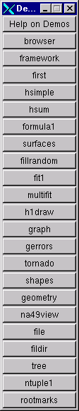
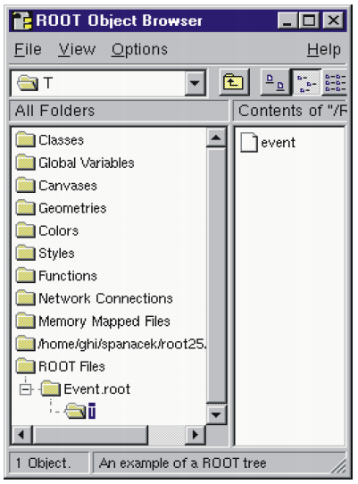
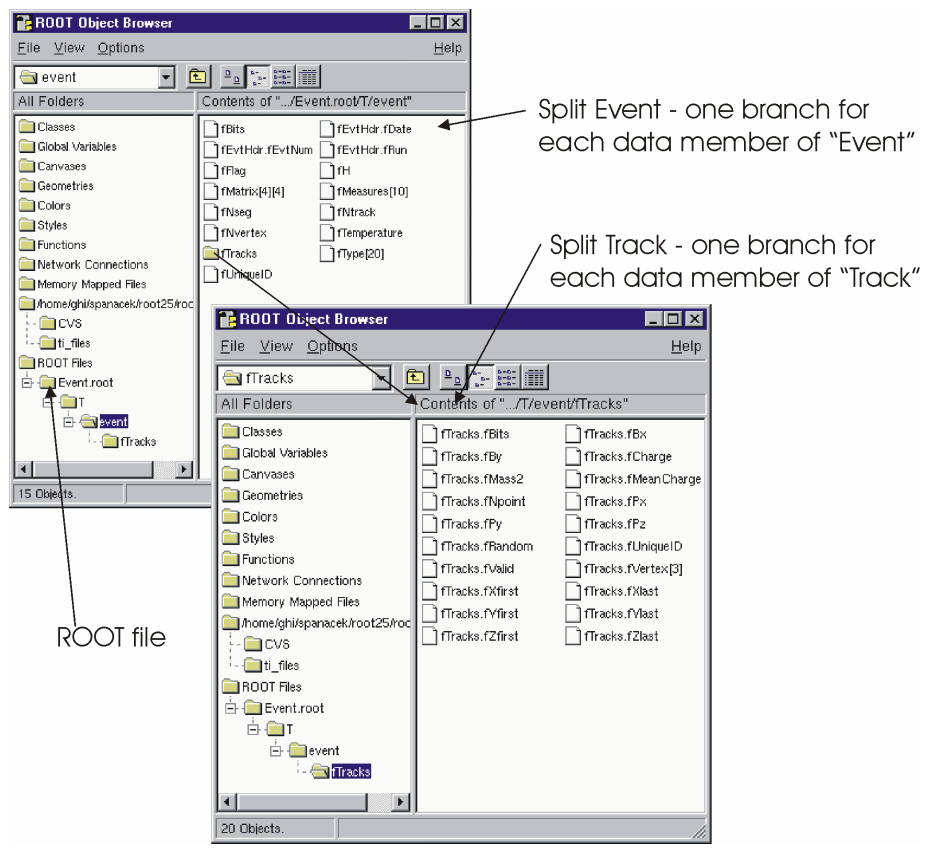
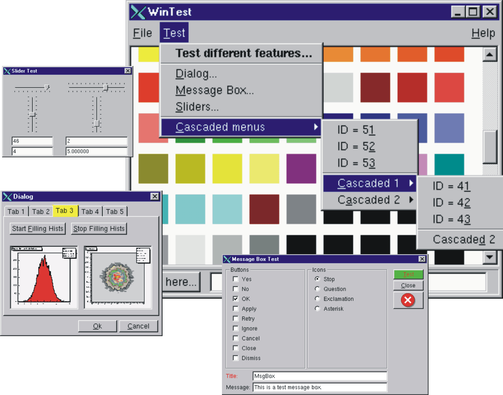

# The Tutorials and Tests


This chapter is a guide to the examples that come with the installation
of ROOT. They are located in two directories: `$ROOTSYS/tutorials` and
`$ROOTSYS/test`.

## \$ROOTSYS/tutorials




The tutorials directory contains many example
scripts. *To have all examples working you must have write permission
and you will need to execute`hsimple.C` first*. If you do not have write
permission in the directory` $ROOTSYS/tutorials`, copy the entire
directory to your area. The script `hsimple.C` displays a histogram as
it is being filled, and creates a ROOT file used by the other examples.

To execute it type:

``` {.cpp}
$ cd $ROOTSYS/tutorials
$ root
   ------------------------------------------------------------
  | Welcome to ROOT 6.00/00                http://root.cern.ch |
  |                               (c) 1995-2014, The ROOT Team |
  | Built for linuxx8664gcc                                    |
  | From tag v6-00-00, 30 May 2014                             |
  | Try '.help', '.demo', '.license', '.credits', '.quit'/'.q' |
   ------------------------------------------------------------

root [0] .x hsimple.C
```

Now execute `demos.C`, which brings up the button bar shown on the left.
You can click on any button to execute another example. To see the
source, open the corresponding source file (for example `fit1.C`). Once
you are done, and want to quit the ROOT session, you can do so by typing
**`.q`**.

``` {.cpp}
root[] .x demos.C
root[] .q
```

## \$ROOTSYS/test


The test directory contains a set of examples that represent all areas
of the framework. When a new release is cut, the examples in this
directory are compiled and run to test the new release's backward
compatibility.

We see these source files:

+-------------------+--------------------------------------------------------+
| `Makefile`        | Makefile to build all test programs.                   |
+-------------------+--------------------------------------------------------+
| `hsimple.cxx`     | Simple test program that creates and saves some        |
|                   | histograms                                             |
+-------------------+--------------------------------------------------------+
| `MainEvent.cxx`   | Simple test program that creates a ROOT Tree object    |
|                   | and fills it with some simple structures but also with |
|                   | complete histograms. This program uses the files       |
|                   | `Event.cxx`, `EventCint.cxx` and `Event.h`. An example |
|                   | of a procedure to link this program is in              |
|                   | `bind_Event`. Note that the `Makefile` invokes the     |
|                   | `rootcling` utility to generate the Cling interface      |
|                   | `EventCint.cxx`                                        |
+-------------------+--------------------------------------------------------+
| `Event.cxx`       | Implementation for classes Event and Track             |
+-------------------+--------------------------------------------------------+
| `minexam.cxx`     | Simple test program for data fitting                   |
+-------------------+--------------------------------------------------------+
| `tcollex.cxx`     | Example usage of the ROOT collection classes           |
+-------------------+--------------------------------------------------------+
| `tcollbm.cxx`     | Benchmarks of ROOT collection classes                  |
+-------------------+--------------------------------------------------------+
| ctorture.cxx      | Test program for the class **`TComplex`**              |
+-------------------+--------------------------------------------------------+
| `tstring.cxx`     | Example usage of the ROOT string class                 |
+-------------------+--------------------------------------------------------+
| `vmatrix.cxx`     | Verification program for the **`TMatrix`** class       |
+-------------------+--------------------------------------------------------+
| `vvector.cxx`     | Verification program for the **`TVector `**class       |
+-------------------+--------------------------------------------------------+
| `vlazy.cxx`       | Verification program for lazy matrices                 |
+-------------------+--------------------------------------------------------+
| `hworld.cxx`      | Small program showing basic graphics                   |
+-------------------+--------------------------------------------------------+
| `guitest.cxx`     | Example usage of the ROOT GUI classes                  |
+-------------------+--------------------------------------------------------+
| `gui` `viewer`    | Another ROOT GUI example program                       |
| `.cxx`            |                                                        |
+-------------------+--------------------------------------------------------+
| `Hello.cxx`       | Dancing text example                                   |
+-------------------+--------------------------------------------------------+
| `Aclock.cxx`      | Analog clock (a la X11 `xclock`)                       |
+-------------------+--------------------------------------------------------+
| `Tetris.cxx`      | The known Tetris game based on the ROOT graphics       |
+-------------------+--------------------------------------------------------+
| `stress.cxx`      | Important ROOT stress testing program                  |
+-------------------+--------------------------------------------------------+
| `stress*.cxx`     | Stress testing of different ROOT classes               |
+-------------------+--------------------------------------------------------+
| `bench.cxx`       | STL and ROOT container test and benchmarking program   |
+-------------------+--------------------------------------------------------+
| QpRandomDriver.cx | Verfication program for Quadratic programming classes  |
| x                 | in Quadp library                                       |
+-------------------+--------------------------------------------------------+
| DrawTest.sh       | Entry script to extensive **`TTree`** query test suite |
+-------------------+--------------------------------------------------------+
| dt\_\*            | Scripts used by DrawTest.sh                            |
+-------------------+--------------------------------------------------------+

The `$ROOTSYS/test` directory is a gold mine of root-wisdom nuggets, and
we encourage you to explore and exploit it. These instructions will
compile all programs in `$ROOTSYS/test`:

If you do not have write permission in the `$ROOTSYS/test` directory,
copy the entire `$ROOTSYS/test` directory to your area. The `Makefile`
is a useful example of how ROOT applications are linked and built. Edit
the `Makefile` to specify your architecture by changing the `ARCH`
variable, for example, on an SGI machine type:` ARCH` = `sgikcc`.

Now compile all programs:

% **`gmake`**

This will build several applications and shared libraries. We are
especially interested in Event, stress, and `guitest`.

### Event - An Example of a ROOT Application


Event is created by compiling `MainEvent.cxx`, and `Event.cxx`. It
creates a ROOT file with a tree and two histograms. When running `Event`
we have four optional arguments with defaults:

+-----+---------------------------------------------------------+--------------+
|     | Argument                                                | Default      |
+-----+---------------------------------------------------------+--------------+
| 1   | Number of Events (1 ... n)                              | 400          |
+-----+---------------------------------------------------------+--------------+
| 2   | Compression level:                                      | 1            |
|     |                                                         |              |
|     | 0: no compression at all.                               |              |
|     |                                                         |              |
|     | 1: If the split level is set to zero, everything is     |              |
|     | compressed according to the `gzip` level 1. If split    |              |
|     | level is set to 1, leaves that are not floating point   |              |
|     | numbers are compressed using the `gzip` level 1.        |              |
|     |                                                         |              |
|     | 2: If the split level is set to zero, everything is     |              |
|     | compressed according to the `gzip` level 2. If split    |              |
|     | level is set to 1, all non floating point leaves are    |              |
|     | compressed according to the `gzip` level 2 and the      |              |
|     | floating point leaves are compressed according to the   |              |
|     | `gzip` level 1 (`gzip` level -1).                       |              |
|     |                                                         |              |
|     | Floating point numbers are compressed differently       |              |
|     | because the gain when compressing them is about 20 -    |              |
|     | 30%. For other data types it is generally better and    |              |
|     | around 100%.                                            |              |
+-----+---------------------------------------------------------+--------------+
| 3   | Split or not Split                                      | 1            |
|     |                                                         |              |
|     | 0: only one single branch is created and the complete   | (Split)      |
|     | event is serialized in one single buffer                |              |
|     |                                                         |              |
|     | 1: a branch per variable is created.                    |              |
+-----+---------------------------------------------------------+--------------+
| 4   | Fill                                                    | 1            |
|     |                                                         |              |
|     | 0: read the file                                        | (Write, no   |
|     |                                                         | fill)        |
|     | 1: write the file, but don't fill the histograms        |              |
|     |                                                         |              |
|     | 2: don't write, don't fill the histograms               |              |
|     |                                                         |              |
|     | 10: fill the histograms, don't write the file           |              |
|     |                                                         |              |
|     | 11: fill the histograms, write the file                 |              |
|     |                                                         |              |
|     | 20: read the file sequentially                          |              |
|     |                                                         |              |
|     | 25: read the file at random                             |              |
+-----+---------------------------------------------------------+--------------+

#### Effect of Compression on File Size and Write Times

You may have noticed that a ROOT file has up to nine compression level,
but here only levels 0, 1, and 2 are described. Compression levels above
2 are not competitive. They take up to much write time compared to the
gain in file space. Below are three runs of `Event` on a Pentium III 650
MHz and the resulting file size and write and read times.

No Compression:

``` {.cpp}
> Event 400 0 1 1
400 events and 19153182 bytes processed.
RealTime=6.840000 seconds, CpuTime=3.560000 seconds
compression level=0, split=1, arg4=1
You write 2.800173 Mbytes/Realtime seconds
You write 5.380107 Mbytes/Cputime seconds

> ls -l Event.root
... 19752171 Feb 23 18:26 Event.root

> Event 400 0 1 20
400 events and 19153182 bytes processed.
RealTime=0.790000 seconds, CpuTime=0.790000 seconds
You read 24.244533 Mbytes/Realtime seconds
You read 24.244533 Mbytes/Cputime seconds
```

We see the file size without compression is 19.75 MB, the write time is
6.84 seconds and the read time is 0.79 seconds.

Compression = 1: event is compressed:

``` {.cpp}
> Event 400 1 1 1
400 events and 19153182 bytes processed.
RealTime=6.440000 seconds, CpuTime=4.020000 seconds
compression level=1, split=1, arg4=1
You write 2.974096 Mbytes/Realtime seconds
You write 4.764473 Mbytes/Cputime seconds

> ls -l Event.root
...     17728188 Feb 23 18:28 Event.root

> Event 400 1 1 20
400 events and 19153182 bytes processed.
RealTime=0.900000 seconds, CpuTime=0.900000 seconds
You read 21.281312 Mbytes/Realtime seconds
You read 21.281312 Mbytes/Cputime seconds
```

We see the file size 17.73, the write time was 6.44 seconds and the read
time was 0.9 seconds.

Compression = 2: Floating point numbers are compressed with level 1:

``` {.cpp}
> Event 400 2 1 1
400 events and 19153182 bytes processed.
RealTime=11.340000 seconds, CpuTime=9.510000 seconds
compression level=2, split=1, arg4=1
You write 1.688993 Mbytes/Realtime seconds
You write 2.014004 Mbytes/Cputime seconds

> ls -l Event.root
...     13783799 Feb 23 18:29 Event.root

> Event 400 2 1 20
400 events and 19153182 bytes processed.
RealTime=2.170000 seconds, CpuTime=2.170000 seconds
You read 8.826351 Mbytes/Realtime seconds
You read 8.826351 Mbytes/Cputime seconds
```

The file size is 13.78 MB, the write time is 11.34 seconds and the read
time is 2.17 seconds.

This table summarizes the findings on the impact of compressions:

+---------------------+----------------------+-------------------+---------------+
| Compression         | File Size            | Write Times       | Read Times    |
+---------------------+----------------------+-------------------+---------------+
| 0                   | 19.75 MB             | 6.84 sec.         | 0.79 sec.     |
+---------------------+----------------------+-------------------+---------------+
| 1                   | 17.73 MB             | 6.44 sec.         | 0.90 sec.     |
+---------------------+----------------------+-------------------+---------------+
| 2                   | 13.78 MB             | 11.34 sec.        | 2.17 sec.     |
+---------------------+----------------------+-------------------+---------------+

#### Setting the Split Level



Split Level = 0: \
Now we execute Event with the split parameter set to 0:

``` {.cpp}
> Event 400 1 0 1
> root
root[] TFile f("Event.root")
root[] TBrowser T
```

We notice that only one branch is visible (event). The individual data
members of the `Event` object are no longer visible in the browser. They
are contained in the event object on the event branch, because we
specified no splitting. Split Level = 1:

Setting the split level to 1 will create a branch for each data member
in the Event object. First we execute `Event` and set the split level to
1 and start the browser to examine the split tree:

``` {.cpp}
>     Event 400 1 1 1
```

``` {.cpp}
>     root
root[] TFile f("Event.root")
root[] TBrowser browser
```



### stress - Test and Benchmark


The executable stress is created by compiling `stress.cxx`. It completes
sixteen tests covering the following capabilities of the ROOT framework.

-   Functions, Random Numbers, Histogram Fits

-   Size & compression factor of a ROOT file

-   Purge, Reuse of gaps in **`TFile`**

-   2D Histograms, Functions, 2D Fits

-   Graphics & PostScript

-   Subdirectories in a ROOT file

-   **`TNtuple`**, Selections, **`TCutG`**, **`TEventList`**

-   Split and Compression modes for Trees

-   Analyze `Event.root` file of stress 8

-   Create 10 files starting from `Event.root`

-   Test chains of Trees using the 10 files

-   Compare histograms of test 9 and 11

-   Merging files of a chain

-   Check correct rebuilt of `Event.root` in test 13

-   Divert Tree branches to separate files

-   Cling test (3 nested loops) with `LHCb` trigger

The program stress takes one argument, the number of events to process.
The default is 1000 events. Be aware that executing stress with 1000
events*will create several files consuming about 100 MB of disk space;*
running stress with 30 events will consume about 20 MB. The disk space
is released once stress is done.

There are two ways to run `stress`:

From the system prompt or from the ROOT prompt using the interpreter.

``` {.cpp}
> cd $ROOTSYS/test
> stress             // default 1000 events
> stress 30          // test with 30 events
```

Start ROOT with the batch mode option (-b) to suppress the graphic
output.

``` {.cpp}
> root -b
root[] .L stress.cxx
root[] stress(1000)// test with 1000 events
root[] stress(30)// test with 30 events
```

The output of stress includes a pass/fail conclusion for each test, the
total number of bytes read and written, and the elapsed real and CPU
time. It also calculates a performance index for your machine relative
to a reference machine a DELL Inspiron 7500 (Pentium III 600 MHz) with
256 MB of memory and 18GB IDE disk in ROOTMARKS. Higher ROOTMARKS means
better performance. The reference machine has 200 ROOTMARKS, so the
sample run below with 53.7 ROOTMARKS is about four times slower than the
reference machine.

Here is a sample run:

``` {.cpp}
% root -b
root[] .x stress.cxx(30)

Test  1 : Functions, Random Numbers, Histogram Fits............. OK
Test  2 : Check size & compression factor of a Root file........ OK
Test  3 : Purge, Reuse of gaps in TFile......................... OK
Test  4 : Test of 2-d histograms, functions, 2-d fits........... OK
Test  5 : Test graphics & PostScript ............................OK
Test  6 : Test subdirectories in a Root file.................... OK
Test  7 : TNtuple, selections, TCutG, TEventList.......... OK
Test  8 : Trees split and compression modes..................... OK
Test  9 : Analyze Event.root file of stress 8................... OK
Test 10 : Create 10 files starting from Event.root.............. OK
Test 11 : Test chains of Trees using the 10 files............... OK
Test 12 : Compare histograms of test 9 and 11................... OK
Test 13 : Test merging files of a chain......................... OK
Test 14 : Check correct rebuilt of Event.root in test 13........ OK
Test 15 : Divert Tree branches to separate files................ OK
Test 16 : Cling test (3 nested loops) with LHCb trigger.......... OK
******************************************************************
*  IRIX64 fnpat1 6.5 01221553 IP27
******************************************************************
stress    : Total I/O =   75.3 Mbytes, I =   59.2, O =  16.1
stress    : Compr I/O =   75.7 Mbytes, I =   60.0, O =  15.7
stress    : Real Time = 307.61 seconds Cpu Time = 292.82 seconds
******************************************************************
*  ROOTMARKS =  53.7   *  Root2.25/00   20000710/1022
```

### guitest - A Graphical User Interface
\index{GUI application}

The `guitest` example, created by compiling `guitest.cxx`, tests and
illustrates the use of the native GUI widgets such as cascading menus,
dialog boxes, sliders and tab panels. It is a very useful example to
study when designing a GUI. Some examples of the output of `guitest` are
shown next. To run it type `guitest` at the system prompt in the
`$ROOTSYS/test` directory. We have included an entire chapter on this
subject where we explore `guitest` in detail and use it to explain how
to build our own ROOT application with a GUI. See "Writing a Graphical
User Interface".


