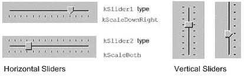
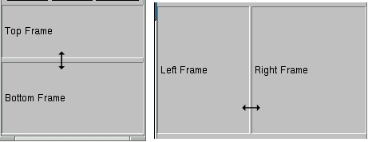

# Writing a Graphical User Interface
\index{Graphical User Interface}

The ROOT GUI classes support an extensive and rich set of widgets with
the Windows 95 look and feel. The widget classes interface to the
underlying graphics system via a single abstract class. Concrete
versions of this abstract class have been implemented for X11 and Win32,
thereby making the ROOT GUI fully cross-platform. Originally the GUI
classes were based on Hector Peraza's Xclass'95 widget library
<http://xclass.sourceforge.net/>

## The ROOT GUI Classes


Features of the GUI classes in a nutshell:

-   Originally based on the Xclass'95 widget library

-   A rich and complete set of widgets

-   Win'95 look and feel

-   All machine dependent graphics calls abstracted via the
    **`TVirtualX`** "abstract" class

-   Completely scriptable via the C++ interpreter (fast prototyping)

-   Supports signal/slot event handling as pioneered by Trolltech's Qt

-   Full class documentation is generated automatically (as for all ROOT
    classes)

-   Code generation for variety of GUI's

## Widgets and Frames


The ROOT GUI classes provide of set of components that allow an easy way
to develop cross-platform GUI applications with a Windows look and feel.

The main widgets are:

-   Simple widgets: labels, icons, push buttons, either with text or
    pixmaps, check buttons, radio buttons, menu bars and popup menus,
    scroll bars, list boxes, combo boxes, group frames, text entry
    widgets, tab widgets, progress bars, sliders, tool tips

-   Complex widgets: shutter, toolbar, status bar, list view, list tree

-   Common dialogs: File Open/Save, File Properties, Font Selection,
    Color Selection, About

-   The widgets are shown in frames:

-   frame, composite frame, main frame, transient frame, group frame

-   Arranged by layout managers:

-   horizontal layout, vertical layout, row layout, list layout, tile
    layout, matrix layout

Using a combination of layout hints:

-   left, right, center x, center y, top, bottom, expand x, expand y,
    fixed offsets

Event handling by signals/slots and messaging (as opposed to callbacks):

-   in response to actions widgets send messages and emit signals

-   associated frames process these messages or the slot methods
    connected to the signals are executed

## TVirtualX


The GUI classes interface to the platform dependent low level graphics
system via the semi-abstract graphics base class **`TVirtualX`**.
Currently concrete implementations exist for X11 and Win32 (MacOS X is
fully supported via Apple's X11 implementation). Thanks to this single
graphics interface, porting the ROOT GUI to a new platform requires only
the implementation of **`TVirtualX`**.


## A Simple Example


We will start with a simple example that builds a small application
containing a canvas and two buttons: Draw and Exit. Its functionality
will be very simple: every time you click on Draw button, the graphics
of the function `sin(x)/x` will be drawn in randomly chosen interval in
the canvas window, if you click on Exit - you close the application.
This example shows the basic concepts for almost any GUI-application in
ROOT and it is important to understand how it is constructed. The
example program is written as a named script. See "Cling the C++
Interpreter". Remember that the named script can be executed via

``` {.cpp}
root[] .x example.C
```

only if the filename (without extension) and the function entry point
are both the same.


We need to say a few words about the parent-children relationship
between the widgets before going through the real code. The widgets'
behaviors are based on this relationship. Every parent widget is
responsible for where the children are and it ensures all properties and
behavior for them. For example, if you want to hide several widgets, it
will be enough to hide their parent widget. Later you can show the
parent and the children will appear too. Writing your code you have to
specify the parent-child relationship. Usually in a child constructor
the address of the parent is passed as an argument. In general frames
are parents of simple widgets. In this example you will see how we
organize the parent-children relationship by using frame widgets in
addition to the canvas window and button widgets.

Let's now go through the code of the `example.C`.

The first lines include ROOT header files. The header file names are
almost always as the class names (**`TApplication`**, **`TF1`**,
**`TCanvas`**), but there are cases when similar classes are grouped
together in one header file: all frames are declared in `TGFrame.h`, all
buttons - in `TGButton.h`, etc. Our small example is based on an object
of the class `MyMainFrame`.

``` {.cpp}
new MyMainFrame(gClient->GetRoot(),200,200);
```

The first parameter `gClient->GetRoot()` makes the initial connection to
the window server. It is a pointer to the root window of the screen,
which is obtained from ***`gClient`***. The next two parameters
initialize the width and height of the application window in pixels. Let
see what `MyMainFrame` is. The three arguments pass to the
**`TGMainFrame`** constructor when we create the `fMain` object.

The first thing to note is the inclusion of the `RQ_OBJECT` macro in the
class declaration of `MyMainFrame`. It is necessary to provide a
standalone class signal/slot capability. The signal/slot communication
mechanism is described in a separate chapter. See "Event Processing:
Signals and Slots".

``` {.cpp}
// example.C

#include <TGClient.h>
#include <TCanvas.h>
#include <TF1.h>
#include <TRandom.h>
#include <TGButton.h>
#include <TGFrame.h>
#include <TRootEmbeddedCanvas.h>
#include <RQ_OBJECT.h>

class MyMainFrame {
   RQ_OBJECT("MyMainFrame")
private:
   TGMainFrame         *fMain;
   TRootEmbeddedCanvas *fEcanvas;
public:
   MyMainFrame(const TGWindow *p,UInt_t w,UInt_t h);
   virtual ~MyMainFrame();
   void DoDraw();
};
MyMainFrame::MyMainFrame(const TGWindow *p,UInt_t w,UInt_t h) {
   // Create a main frame
   fMain = new TGMainFrame(p,w,h);

   // Create canvas widget
   fEcanvas = new TRootEmbeddedCanvas("Ecanvas",fMain,200,200);
   fMain->AddFrame(fEcanvas, new TGLayoutHints(kLHintsExpandX |
                   kLHintsExpandY, 10,10,10,1));
   // Create a horizontal frame widget with buttons
   TGHorizontalFrame *hframe = new TGHorizontalFrame(fMain,200,40);
   TGTextButton *draw = new TGTextButton(hframe,"&Draw");
   draw->Connect("Clicked()","MyMainFrame",this,"DoDraw()");
   hframe->AddFrame(draw, new TGLayoutHints(kLHintsCenterX,
                                            5,5,3,4));
   TGTextButton *exit = new TGTextButton(hframe,"&Exit",
                                "gApplication->Terminate(0)");
   hframe->AddFrame(exit, new TGLayoutHints(kLHintsCenterX,
                                            5,5,3,4));
   fMain->AddFrame(hframe, new TGLayoutHints(kLHintsCenterX,
                                             2,2,2,2));

   // Set a name to the main frame
   fMain->SetWindowName("Simple Example");

   // Map all subwindows of main frame
   fMain->MapSubwindows();

   // Initialize the layout algorithm
   fMain->Resize(fMain->GetDefaultSize());

   // Map main frame
   fMain->MapWindow();
}
void MyMainFrame::DoDraw() {
   // Draws function graphics in randomly chosen interval
   TF1 *f1 = new TF1("f1","sin(x)/x",0,gRandom->Rndm()*10);
   f1->SetLineWidth(3);
   f1->Draw();
   TCanvas *fCanvas = fEcanvas->GetCanvas();
   fCanvas->cd();
   fCanvas->Update();
}
MyMainFrame::~MyMainFrame() {
   // Clean up used widgets: frames, buttons, layout hints
   fMain->Cleanup();
   delete fMain;
}
void example() {
   // Popup the GUI...
   new MyMainFrame(gClient->GetRoot(),200,200);
}
```

The **`TGMainFrame `**class defines a top level window that interacts
with the system window manager. Its method `CloseWindow()` is invoked
when Alt+F4 are pressed or a window manager close/exit command is used.
To terminate the application when this happens you need to override the
`CloseWindow()` method and call `gApplication->Terminate(0)`.

The main frame can be considered as a container where all widgets of the
application are organized with respect to their parent-child
relationship. After the main frame we create `fEcanvas` - an object of
class **`TRootEmbeddedCanvas`**. It is a quite complex widget and we
will explain it in detail later. For the moment keep in mind only its
main purpose - to create a **`TCanvas`** - the ROOT basic whiteboard for
drawing and editing different graphical objects.

``` {.cpp}
fEcanvas = new TRootEmbeddedCanvas("Ecanvas",fMain,200,200);
```

In the **`TRootEmbeddedCanvas`** constructor we pass the address of the
main frame widget `fMain` as a second parameter. This pass is important
because it makes `fMain` the parent of the canvas window. The first
parameter `Ecanvas` is the name of the **`TCanvas`**, the last two
parameters give the width and height of canvas window in pixels. Next
step is to add `fEcanvas` to the parent frame defining its appearance
inside the parent window. We use the method `AddFrame():`

``` {.cpp}
fMain->AddFrame(fEcanvas,new TGLayoutHints(kLHintsExpandX |
                kLHintsExpandY, 10, 10, 10, 1));
```

It adds the `fEcanvas` into the list of children widgets of the main
frame `fMain`. The specification of how it should be placed inside the
parent frame is made by the **`TGLayoutHints`** object. Setting its
first parameter to `kLHintsExpandX|kLHintsExpandY `we define the canvas
window as expanded on x and y in the frame. The next four parameters
define amounts of padding in left, right, top and bottom in pixels. This
means that the canvas window will be expanded when the parent window
expands, but it will keep around a frame of 10 pixels on left, right,
top and 1 pixel on bottom.


The laying out is always made with respect to the parent-children
relationship. There is a special chapter presenting the different layout
managers, but we will quickly introduce the concept here. The layout
process will apply not to the embedded canvas window but to its parent -
the main frame. A popular layout manager and the one used in this case
is the vertical layout manager which arranges its widgets vertically in
a column.

The next widget we create as a child of the main frame is the horizontal
frame `hframe`:

``` {.cpp}
TGHorizontalFrame *hframe=new TGHorizontalFrame(fMain,200,40);
```

The first parameter of its constructor is again the address of its
parent, `fMain`. The next ones define the frame width and height in
pixels. The name of the class **`TGHorizontalFrame`** gives a hint that
a horizontal layout will apply on its children widgets. The Draw and
Exit buttons will be laid out horizontally. Here are their constructors:

``` {.cpp}
TGTextButton *draw = new TGTextButton(hframe,"&Draw");
hframe ->AddFrame(draw, new TGLayoutHints(kLHintsCenterX,5,5,3,4));
TGTextButton *exit = new TGTextButton(hframe,"&Exit",
                                     "gApplication->Terminate(0)");
hframe ->AddFrame(exit,new TGLayoutHints(kLHintsCenterX,5,5,3,4));
```

They are created as objects of the **`TGTextButton`** class that
represent the command buttons with a text label. When you click on a
command button it performs the action shown on its label. These buttons
are well known as "push buttons" or just "buttons". The parent address
`hframe` is passed as first parameter. The second one defines the button
label and normally indicates the action to be taken when the button is
clicked. It is possible to define a hot key for the button at that point
using the hot string for its label. A hot string is a string with a
"hot" character underlined. This character we call the button hot key.
It shows the assigned keyboard mnemonic for the button choice. Following
our example, this means that you can use `Alt+D` to click on Draw button
and `Alt+E` to click on Exit. There is a possibility to specify a
command string as third parameter of the button constructor. We use it
to assign the command `gApplication->Terminate(0)`. The application will
be terminated when you click on the Exit button.

We call again `AddFrame()` to add the buttons to their parent widget
giving layout hints for each of them. This time we would like to have
centered buttons with an amount of 5 pixels on the left, 5 on the right,
3 on the top and 4 on the bottom. You can feel already that the same
steps are repeated three times: to create a new widget with passing a
parent address as a parameter, to define layout hints for it and to add
it in the parent list. The next line is something new:

``` {.cpp}
draw->Connect("Clicked()","MyMainFrame",this,"DoDraw()");
```

Here we connect a signal to a slot. Whenever the draw button is clicked,
it emits a signal that something has happened (it is clicked) to whom
might be interesting in the outside world. The widget does not know who
will use this information. On the other side of the program world there
is some code which should be executed when the button is clicked. This
code is called a slot. Think about slots as normal C++ functions or
class methods. The line above specifies that the slot
`MyMainFrame::DoDraw()` will be executed when the draw button is
clicked. Our slot draws the graphics of `sin(x)/x` in randomly chosen
interval every time the draw button sends a signal "I am clicked". The
signal/slot communication mechanism originally featured in Qt by
TrollTech(see <http://doc.trolltech.com/3.1/signalsandslots.html>). ROOT
supports its own version of signals/slots. We will return to that point
in details later. We specified all child widgets of the horizontal frame
(the Draw and Exit buttons in our case). Next, we need to add their
parent frame to the main frame:

``` {.cpp}
fMain->AddFrame(hframe,new TGLayoutHints(kLHintsCenterX,2,2,2,2));
```

The last thing to do is to set the main window title and to make all
widgets visible. Commonly in all systems windows are assigned by name to
be identified by users. This name is displayed in the application's
title bar and can be set by:

``` {.cpp}
fMain->SetWindowName("Simple Example");
```

The next lines make the widgets visible. The first one maps all child
frames of the top-level frame; the last one - the main frame itself,
i.e. makes it appear on the screen.

``` {.cpp}
fMain->MapSubwindows();
fMain->Resize(fMain->GetDefaultSize());
fMain->MapWindow();
```

The line in between has an important mission - to execute all layout
specifications for the widgets before the top-level window itself is
shown on the screen. We can run the named script via the Cling
interpreter with the command:

``` {.cpp}
root[].x example.C
```

The event processing starts. If you change the state of a widget, it
emits a signal and the corresponding slot is executed ensuring the
functionality we want for this small example.

The steps we passed can be generalized as follows:

-   Opening of the connection to the system

-   Definition of main frame (top level window)

-   Creation of widgets as children of the top-level frame; assign them
    desired properties following the steps:

-   Create a new widget passing its parent in the constructor

-   Connect widget's signals with desired slots to ensure desired
    functionality

-   Define widget's layout and add it to the parent list of children

-   Set main window attributes

-   Map all sub windows

-   Initialize the layout algorithm via `Resize(GetDefaultSize())`
    method

-   Map the main frame

-   Execution of the even-processing loop

### A Standalone Version


As usual a standalone program in C++ has to contain a main() function -
the starting point for the application execution. In this case it is
better to separate the program code creating a program header file
example2a.h with the `MyMainFrame` class declaration and
`example2a.cxx `- with the class methods implementation. To run our
simple example as a standalone application we need to create in addition
an object of class **`TApplication`**. It will make a correct
initialization of the dictionaries if it is not yet done. It will be
responsible for holding everything together and to handle all events in
the application. Its environment provides an interface to the ROOT
graphics system and by calling the `Run()` method the event loop starts
and the application program is waiting for the user action. The
application exits only if the top level window is not closed. Two header
files are used in addition: `TApplication.h` - for the class
**`TApplication`** and `TGClient.h` that is used to make initial
connection to the graphics system. The class **`TApplication`** must be
instantiated only once in any given application. The original list of
argument options can be retrieved via the `Argc()` and `Argv()` methods.

Note: to have signals/slots working we need to create a dictionary for
the class `MyMainFrame`, i.e. we create the file `ex2aLinkDef.h`
containing the line:

``` {.cpp}
#pragma link C++ class MyMainFrame;
```

We compile the example:

``` {.cpp}
rootcling -f ex2aDict.cxx -c example2a.h ex2aLinkDef.h
g++ -o example2a example2a.cxx ex2aDict.cxx `root-config --cflags --glibs`
```

`example2a.h`

``` {.cpp}
#include <TQObject.h>
#include <RQ_OBJECT.h>

class TGWindow;
class TGMainFrame;
class TRootEmbeddedCanvas;

class MyMainFrame {
   RQ_OBJECT("MyMainFrame")
private:
   TGMainFrame         *fMain;
   TRootEmbeddedCanvas *fEcanvas;
public:
   MyMainFrame(const TGWindow *p,UInt_t w,UInt_t h);
   virtual ~MyMainFrame();
   void DoDraw();
};
```

`example2a.cxx`

``` {.cpp}
#include <TApplication.h>
#include <TGClient.h>
#include <TCanvas.h>
#include <TF1.h>
#include <TRandom.h>
#include <TGButton.h>
#include <TRootEmbeddedCanvas.h>
#include "example2a.h"

MyMainFrame::MyMainFrame(const TGWindow *p,UInt_t w,UInt_t h) {...}
MyMainFrame::~MyMainFrame() { ... }
void MyMainFrame::DoDraw() { ... }
void example() { ... }

int main(int argc, char **argv) {
   TApplication theApp("App",&argc,argv);
   example();
   theApp.Run();
   return 0;
}
```

The class `MyMainFrame` could derive from **`TGMainFrame`**. In that
case the `RQ_OBJECT` macro is not needed anymore, since the
functionality it provides is obtained now via inheritance from
**`TGMainFrame`**. This will reflect in the `MyMainFrame` class
declaration and in the code of the `MyMainFrame::MyMainFrame`
constructor as follows:

`example2b.h`

``` {.cpp}
#include <TGFrame.h>
class MyMainFrame : public TGMainFrame {
private:
   TRootEmbeddedCanvas *fEcanvas;
public:
   MyMainFrame(const TGWindow *p,UInt_t w,UInt_t h);
   virtual ~MyMainFrame() {  ...  }
   void DoDraw(){  ...  }
   ClassDef(MyMainFrame,0)
};
```

`example2b.cxx`

``` {.cpp}
#include <TApplication.h>
#include <TGClient.h>
#include <TCanvas.h>
#include <TF1.h>
#include <TRandom.h>
#include <TGButton.h>
#include <TRootEmbeddedCanvas.h>
#include "example2b.h"

MyMainFrame::MyMainFrame(const TGWindow *p,UInt_t w,UInt_t h)
   : TGMainFrame(p,w,h) {

   // Creates widgets of the example
   fEcanvas = new TRootEmbeddedCanvas ("Ecanvas",this,200,200);
   AddFrame(fEcanvas, new TGLayoutHints(kLHintsExpandX |
                                    kLHintsExpandY, 10,10,10,1));
   TGHorizontalFrame *hframe=new TGHorizontalFrame(this, 200,40);
   TGTextButton *draw = new TGTextButton(hframe,"&Draw");
   draw->Connect("Clicked()","MyMainFrame",this,"DoDraw()");
   hframe->AddFrame(draw, new TGLayoutHints(kLHintsCenterX,
                                            5,5,3,4));
   TGTextButton *exit = new TGTextButton(hframe,"&Exit ",
                                "gApplication->Terminate()");
   hframe->AddFrame(exit, new TGLayoutHints(kLHintsCenterX,
                                            5,5,3,4));
   AddFrame(hframe,new TGLayoutHints(kLHintsCenterX,2,2,2,2));

   // Sets window name and shows the main frame
   SetWindowName("Simple Example");
   MapSubwindows();
   Resize(GetDefaultSize());
   MapWindow();
}
```

## Widgets Overview


The word widget is a contraction of windows and gadget. Almost all GUI
elements are widgets. A button is a widget, a menu item is a widget, a
scrollbar is a widget, and a complete dialog box is a widget too. Some
widgets may have sub widgets. For example, a dialog box can contain
buttons, text fields, a combo-box, etc.

On the screen widgets look like rectangular areas with special
behaviors. In terms of the object-oriented programming we can define a
widget in ROOT as an object of a class deriving from **`TGObject`**.

This section presents all currently supported widgets in ROOT and their
most useful methods. All of them can be considered as building blocks
for an application, and most of them can be found in dialogs. Provided
snippets of the code will give you practical guidelines where and how to
use certain widgets. The macro `$ROOTSYS/tutorials/gui/guitest.C`
contains the complete source code.


Any custom widget can be created by sub classing existing widgets. To
achieve a better understanding of the widgets' properties they are
separated by their type and their inheritance. As all of them inherit
from **`TGObject`** and most from **`TGWidget`**, these base classes are
described first.

### TGObject


**`TGObject`** is the base class for all ROOT GUI classes. It inherits
from **`TObject`**. The two data members of this class contain important
information about X11/Win32 window identifier and the connection to the
host's graphics system. Every GUI element, which derives from
**`TGObject`** has access to the **`TGClient`** via the data member
`fClient` of **`TGObject. TGClient`** creates the connection with the
host's graphics system and sets up the complete graphics system for all
widgets.

### TGWidget


The widgets base class **`TGWidget`** is typically used as a mix-in
class via multiple inheritances. Its properties are available for all
deriving widgets: **`TGButton`**, **`TGComboBox`**, **`TGTab`**,
**`TGColorPalette`**, **`TGColorPick`**, **`TGDoubleSlider`**,
**`TGListTree`**, **`TGNumberEntry`**, **`TGScrollBar`**,
**`TGShutterItem`**, **`TGTextEntry`**, **`TGSlider`**, **`TGListBox`**,
**`TGView.`**

This class has four data members keeping information about the widget id
- important for event processing, the window which handles the widget's
events, the widget status flags and the assigned command (if there is
any). The general properties of **`TGWidget`** are specified by
`SetFlags(Int_t flags)` and `ClearFlags(Int_t flags)` methods. The
status flags are: `kWidgetWantFocus`, `kWidgetHasFocus`, and
`kWidgetIsEnabled`. The method `Associate(const TGWindow* w)` - sets the
window which handles the widget events.
`SetCommand(const char* command)` - sets the command to be executed. The
command string can be gathering via `GetCommand()` method. For example,
the third parameter in **`TGTextButton`** constructor can be omitted and
set later in your program, i.e. instead of:

``` {.cpp}
TGTextButton *exit = new TGTextButton(hframe,"&Exit",
                                     "gApplication->Terminate()");
```

You will have the following the two lines:

``` {.cpp}
TGTextButton *exit = new TGTextButton(hframe,"&Exit");
exit->SetCommand("gApplication->Terminate()");
```

The method `IsEnabled()` - returns `kTRUE` if the widget has flag
`kWidgetIsEnabled` and it accepts user events. This method is very
important for creating a good user interface because it allows you to
disable or enable a widget depending on the situation of your
application. As a standard all disabled widgets are displayed "grayed
out". `HasFocus()` - returns `kTRUE` if the widget has the input focus
(i.e. flag `kWidgetHasFocus` is set). Remember that only one item in a
complex widget as a dialog can have the value of `HasFocus()` sets as
true. `WantFocus()` - returns `kTRUE` if the flag `kWidgetWantFocus` is
set.

### TGWindow


**`TGWindow`** is a ROOT GUI window base class. It inherits from
**`TGObject`** and **`TGFrame`** derives from it. The application does
not use it directly. It creates and registers a new window within the
system. This window has common characteristics: existing parent,
location, size in height and width (it has a default minimum size 1, 1
under which it cannot shrink), border with particular view, state,
specific attributes. If there are no specified arguments their values
will be taken from the parent. It receives events from the window system
and can paint a representation of itself on the screen.


### Frames


Most of the frame classes are mainly created for arranging widgets in a
window. The class **`TGFrame`** is a subclass of **`TGWindow`**
providing additional window characteristics and overriding some methods
of **`TGWindow`**. It is a base class for the simple widgets as buttons,
labels, etc. Its only purpose is to draw a frame around widgets that do
not have a frame of their own. The main groups of **`TGFrame`** member
functions are:

-   Window's functions: `DoRedraw()`, `DeleteWindow()`, `Activate()`,
    etc.

-   Geometry functions: `Move()`, `Resize()`, `SetSize()`, etc.

-   Graphics handlers: `ChangeBackground()`, `ChangeOptions()`, etc.

-   Mouse and keyboard functions: `HandleButton()`,
    `HandleFocusChange()`, `HandleKey()`, `HandleMotion()`, etc.

-   Event handlers: `HandleEvent()`, `ProcessEvent()`, `GetSender()`,
    `SendMessage()`,` ProcessMessage()`, `GetLastClick()`, etc.


Ones of **`TGFrame`** member functions provide direct functionality;
others - will be overridden by **`TGFrame`** subclasses to ensure
particular widget's functionality. There are two constructors provided
in **`TGFrame`** class. One creates a frame using an externally created
window:

``` {.cpp}
TGFrame(TGClient *c,Window_t id,const TGWindow *parent = 0);
```

For example, it can register the root window (called by **`TGClient`**),
or a window created via **`TVirtualX::InitWindow()`** (window id is
obtained by `TVirtualX::GetWindowID()` method). The other
**`TGFrame`** constructor is:

``` {.cpp}
TGFrame(const TGWindow *p,UInt_t w,UInt_t h,UInt_t options=0,
ULong_t back = GetDefaultBackground());
```

The options parameter is the bitwise OR between defined frame types.
Here is a short description of these types:

+-----------------------+----------------------------------------------------+
| Frame Type            | Description                                        |
+-----------------------+----------------------------------------------------+
| `kChildFrame `        | a frame embedded in a parent                       |
+-----------------------+----------------------------------------------------+
| `kMainFrame `         | a main frame interacting with the system Window    |
|                       | Manager                                            |
+-----------------------+----------------------------------------------------+
| `kTransientFrame `    | a top level dialog's frame                         |
+-----------------------+----------------------------------------------------+
| `kVerticalFrame `     | a frame that layouts its children in a column      |
+-----------------------+----------------------------------------------------+
| `kHorizontalFrame `   | a frame that layouts its children in a row         |
+-----------------------+----------------------------------------------------+
| `kSunkenFrame `       | a frame with a sunken board appearance             |
+-----------------------+----------------------------------------------------+
| `kRaisedFrame `       | a frame with a raised board appearance             |
+-----------------------+----------------------------------------------------+
| `kFitWidth `          | a frame with dynamically scaled width              |
+-----------------------+----------------------------------------------------+
| `kFitHeight `         | a frame with dynamically scaled height             |
+-----------------------+----------------------------------------------------+
| `kFixedWidth `        | a frame with fixed width                           |
+-----------------------+----------------------------------------------------+
| `kFixedHeight `       | a frame with fixed height                          |
+-----------------------+----------------------------------------------------+
| `kFixedSize `         | = `kFixedWidth` | `kFixedHeight`                   |
|                       |                                                    |
|                       | a frame with fixed width and height                |
+-----------------------+----------------------------------------------------+
| `kDoubleBorder `      | a frame having a double line border                |
+-----------------------+----------------------------------------------------+
| `kOwnBackground `     | a frame having own background                      |
+-----------------------+----------------------------------------------------+
| `kTempFrame `         | a temporary frame shown in certain circumstances;  |
|                       | for example, it is used for creation of tool tip   |
|                       | widget                                             |
+-----------------------+----------------------------------------------------+

The method `ChangeOpton(UInt_t options)` allows you to change frame
options. Next example shows you how to change `kVerticalFrame` option to
`kHorizontalFrame`:

``` {.cpp}
frame->ChangeOptions((frame->GetOptions()& ~kVerticalFrame) |
                     kHorizontalFrame);
```

The class **`TGCompositeFrame`** is the base class of all composite
widgets as a menu bar, a list box, a combo box, etc. It subclasses
**`TGFrame`** and has in addition a layout manager and a list of child
frames/widgets. There are two steps to do the design using a composite
frame widget. First you put all widgets you need within this frame and
assign them desired properties using `AddFrame(),` then you lay them out
by the `Layout()` method according to the assigned layout manager. The
method `AddFrame()` creates an instance of **`TGFrameElement`** class
for every child widget of a composite frame. This class has three public
data members: the child pointer, its layout hints, and a status variable
showing if the child is visible or hidden. If no hints are specified,
the default layout hints are used. Because the layout is very important
part of any design we include a special section about layout management
and layout hints.

You can set a layout manager for the composite frame via:

``` {.cpp}
compFrame->SetLayoutManager(TGLayoutManager *l);
```

The child widgets cannot be added to different composite frames.

Any child frame can be removed from the parent list by:

``` {.cpp}
compFrame->RemoveFrame(TGFrame *f);
```

You can hide or show a child frame of a composite frame using the
methods: `HideFrame(TGFrame *f)` or `ShowFrame(TGFrame *f).` You should
call, for example `HideFrame(TGFrame *f),` only after the frames have
been laid out and the sub windows of the composite frame have been
mapped via method `MapSubwindows(),` i.e.

``` {.cpp}
frame->AddFrame(hFrame1,fLayout1);
frame->AddFrame(hFrame2,fLayout2);
frame->Resize(frame->GetDefaultSize()); // lays out frames
frame->MapSubwindows();                 // maps subwindows
frame->HideFrame(hFrame2);              // hides frame hFrame2
frame->MapWindow();                     // maps main frame
```

The state information about a child frame can be obtained from the
methods `GetState(TGframe *f)`, `IsArranged(TGFrame *f)`, and
`IsVisible(TGFrame *f)`.

The method `Cleanup()` deletes all objects of the composite frame added
via `AddFrame()`. All **`TGFrameElement`** objects (frames and layout
hints) must be unique, i.e. cannot be shared.

We already mentioned that **`TGMainFrame`** class defines top level
windows interacting with the system window manager. It handles
applications with a menu bar, toolbar, text entry fields and other
widgets surrounding a central area (e.g. a canvas widget). It lays out a
set of related widgets and provides the typical application main window
behavior. As you can see from the Figure above, it inherits from
**`TGCompositeFrame`** and is inherited by **`TGTransientFrame`** and
several ROOT interface classes: **`TViewerX3D`**,**` TRootBrowser`**,
**`TRootCanvas`**, **`TRootControlBar`**, **`TTreeViewer.`**

To fix the size of a top level window you have to use the method
`TGMainFrame::SetWMSize().` This call tells the Window Manager that it
should not resize the window. The option `kFixedSize` works only for
embedded frames like **`TGCompositeFrame`** and derived classes (in
combination with layout hints).

The **`TGVerticalFrame`** and **`TGHorizontalFrame`** are composite
frames that lay out their child frames in vertical or horizontal way in
the same order as they were added and according to their hints
preferences.

The **`TGTransientFrame`** class defines transient windows that
typically are used for dialogs. They extend and complete an interaction
within a limited context. Always transient frames are displayed from
another window or another dialog. They may appear because of a command
button being activated or a menu item being selected. They may also
present automatically when an additional input and the user attention
are required by a certain condition.

The **`TGGroupFrame`** class presents a very convenient frame which
surrounds visually a group of logically connected widgets: radio
buttons, related check boxes, two or more functionally related controls.


It is a composite frame with a border and a title. The title explains
the purpose of the group and should be a noun or noun phrase. Here is an
example taken from `guitest.C`:

``` {.cpp}
groupFrame = new TGGroupFrame(tf,"Options",kVerticalFrame);
groupFrame->SetTitlePos(TGGroupFrame::kLeft);
```

The second line sets the title position on the left. You can change it
to be centered or right aligned if you use **`TGGroupFrame::kCenter`** or
`TGGroupFrame::kRight` as a parameter.


Be conservative in the use of borders because of the potential for
clutter. Do not place them around single entry fields, single combo
boxes, list boxes and groups of command buttons. The design of these
widgets provides them with a border. The picture above provides kind of
borders to avoid.

## Layout Management


The layout process is an integral part of any GUI. When you create a
simple message window, laying out its few buttons and text widgets is
quite simple. However, this process becomes increasingly difficult if
you have to implement large GUI's with many widgets that should behave
properly when the GUI is resized or uses a different font type or size.
Layout management is the process of determining the size and position of
every widget in a container.

A layout manager is an object that performs layout management for the
widgets within a container. You already know that when adding a
component (child widget) to a container (parent widget) you can provide
alignment hints (or rely on the default ones). These hints are used by
the layout manager to correctly position the widgets in the container.
The **`TGLayoutManager`** is an abstract class providing the basic
layout functionality.


The base "container" class is **`TGCmpositeFrame`**. You can easily
change the layout manager using the
`SetLayoutManager(TGLayoutManager *l)` method. Setting the proper layout
manager for each container is the first step you have to do. The
container uses that layout manager to position and size the components
before they are painted. ROOT currently provides the layout managers
shown on the picture above.

The next important step is to provide hints about every widget in the
container, i.e. to provide positions and right amount of space between
the components. The **`TGLayoutHints`** objects set hints by specifying
the white space in pixels around every widget.

Let's see an example with five buttons. First you put them in a
container, assign them desired properties, and then you lay them out
according to the layout manager. This process can be repeated: you go
back and add, remove or change some of the widgets and lay them out
again.


Once created, you can consider these widgets as elementary objects even
though they are compound ones. The pictures above present four different
layouts of five buttons. The first one shows laid out vertically
buttons. Almost everywhere you can find this vertical orientation.
Looking at dialogs you see that often they consist of number of rows
laid out below each other. Some of the rows could have an internal
vertical structure as well. The second picture shows the same buttons
laid out horizontally - the next common orientation. The other two show
different layouts based on mixed use of the vertical and horizontal
orientation. You might recognize their pattern: two (third picture) and
three (last picture) rows that are vertically laid out.

As we already explained the layout process is always applying to a
container. It will be enough to define the container frame with vertical
or horizontal layout to have buttons as in the first and second
pictures.

To design them in several rows we need to use additional frames as
invisible containers: two horizontal frames, children of a vertical
parent frame; or one horizontal frame laid out vertically with the Draw
and Exit buttons. For widgets in a group it is obvious to use a vertical
layout.

The layout hints data member of **`TGLayoutHints`** is the bit wise OR
between the hints:

+------------------+---------------------------------------------------------+
| Hints            | Description                                             |
+------------------+---------------------------------------------------------+
| `kLHintsNoHints` | no specified layout hints, the default ones will be     |
|                  | used                                                    |
+------------------+---------------------------------------------------------+
| `kLHintsLeft`    | specifies the frame position to the left of the         |
|                  | container frame after other frames with the same hint   |
|                  | into the list                                           |
+------------------+---------------------------------------------------------+
| `kLHintsCenterX` | specifies the frame position centered horizontally      |
|                  | (with vertical containers only)                         |
+------------------+---------------------------------------------------------+
| `kLHintsRight`   | specifies the frame position to the right of the        |
|                  | container frame before any other laid out frames with   |
|                  | the same hint into the list                             |
+------------------+---------------------------------------------------------+
| `kLHintsTop`     | specifies the frame position to the top of the          |
|                  | container frame, below any laid out frames with the     |
|                  | same hint                                               |
+------------------+---------------------------------------------------------+
| `kLHintsCenterY` | specifies the frame position centered vertically (with  |
|                  | horizontal containers only)                             |
+------------------+---------------------------------------------------------+
| `kLHintsBottom`  | specifies the frame position to the bottom of the       |
|                  | container frame, above any laid out frames with the     |
|                  | same hint                                               |
+------------------+---------------------------------------------------------+
| `kLHintsExpandX` | specifies the frame to be expanded up to the width of   |
|                  | the container frame. If the container frame is a        |
|                  | vertical frame - it will fit the whole width. If it is  |
|                  | a horizontal frame - after the positioning of all       |
|                  | frames the available "free" width space is shared       |
|                  | between the frames having this hint                     |
+------------------+---------------------------------------------------------+
| `kLHintsExpandY` | specifies the frame to be expanded up to the height of  |
|                  | the container frame. If the container frame is a        |
|                  | horizontal frame - it will fit the whole height. If the |
|                  | container frame is a vertical frame - after the         |
|                  | arrangement of all frames the available "free" height   |
|                  | space is shared between the frames having this hint     |
+------------------+---------------------------------------------------------+
| `kLHintsNormal`  | = `kLHintsLeft | kLHintsTop` - default hints            |
+------------------+---------------------------------------------------------+

Layout policy:

Child frames never modify their container frame. The container frame can
(or cannot) adapt its size in the layout process. It can show all or a
part of its frames. Every **`TGFrame`** object has a default minimum
size (1, 1) assured by **`TGWindow`**.

## Event Processing: Signals and Slots


Event handling covers the interaction between different objects and
between the user and the objects in an application. There are two
general ways for the user to interact with an application: the keyboard
and the mouse. The Graphical User Interface is as a bridge between the
user and the program - it provides methods to detect the user actions
and instruments that do something as a reaction of these actions. The
user communicates with an application through the window system. The
window system reports interaction events to the application. The
application in turn forwards them to the currently active window. The
objects/widgets receive the events and react to them according to the
application functionality.


The signals/slot communication mechanism is an advanced object
communication concept; it largely replaces the concept of callback
functions to handle actions in GUI's. Signals and slots are just like
any object-oriented methods implemented in C++. The objects are the
instances of classes that don't know anything about each other. They
interact and allow method calls of other object's methods. The idea is
simple: any object can send out (emit) a signal in certain situations
saying that something happened. This is all it does to communicate and
it does not know whether anything is interested in this information. On
the other side there might be an object waiting for that signal and
ready to react to it. This object disposes of special instruments to
listen to the sent out signals. To have a communication we need a
message transmission between the objects. In this simple example we use
signals and slots. The code of the method **`TGButton::Clicked()`** is:

``` {.cpp}
virtual void Clicked()  { Emit("Clicked()"); }   // *SIGNAL*
```

I.e. any button emits the signal `Clicked()` any time someone clicks on
it. As you can see this method is virtual and could be overridden if you
need to. In our simple example we call the `Connect()` method to connect
the `Clicked()` signal of Draw button with `MyMainFrame::DoDraw():`

``` {.cpp}
draw->Connect("Clicked()","MyMainFrame",this,"DoDraw()");
```

In the same way we can connect to the signal `Clicked()` of the Exit
button with the system call `gApplication->Terminate(0).` We declare a
new slot `DoExit(),` implement it to invoke the termination call and
associate this slot with the signal `Clicked()` of the Exit button.

The code of `example.C` can be changed as follows:

``` {.cpp}
public:
...
   void DoExit();  // a new slot is added
}
void MyMainFrame::DoExit() {
   gApplication->Terminate(0);
}
MyMainFrame::MyMainFrame(const TGWindow *p,UInt_t w,UInt_t h) {
...
   TGTextButton *exit = new TGTextButton(hframe,"&Exit ");
   // connects signal Clicked() with slot DoExit()
   exit->Connect("Clicked()","MyMainFrame",this,"DoExit()");
...
}
```

Here is an abstract view of the signal/slots connections in `example.C`:


To benefit from this mechanism your classes must inherit from
**`TQObject`** or otherwise the class definition must start with
`RQ_OBJECT("ClassName") `macro. This macro allows the signals/slots
communication mechanism to be applied between compiled and interpreted
classes in an interactive ROOT session without having the class derive
from **`TQObject`**. Every signal method declaration is followed by a
comment `"*SIGNAL*".` Only instances of a class that defines a signal or
instances of its subclasses can emit the signal. The ROOT implementation
of a popular example presenting signals and slots is the next. Let's
have a minimal class declaration:

``` {.cpp}
class MyClass {
private:
   Int_t fValue;
public:
   MyClass()  { fValue=0; }
   Int_t GetValue() const { return fValue; }
   void  SetValue(Int_t);
};
```

It will become the following as interpreted:

``` {.cpp}
class MyClass {
   RQ_OBJECT("MyClass")
private:
   Int_t fValue;
public:
   MyClass() { fValue=0; }
   Int_t GetValue() const { return fValue; }
   void  SetValue(Int_t); // *SIGNAL*
};
```

Both class declarations have the same data member and public methods to
access the value. By placing the `RQ_OBJECT("MyClass")` macro inside the
`MyClass` body (`MyClass` is not inherited from **`TQObject`**) we allow
this class to use the signal/slot communication. Any instance of this
class can tell the outside world that the state of its data member has
changed by emitting a signal `SetValue(Int_t).` A possible
implementation of `MyClass::SetValue()` can be:

``` {.cpp}
void MyClass::SetValue(Int_t v) {
   if (v != fValue) {
      fValue = v;
      Emit("SetValue(Int_t)",v);
   }
}
```

The line `Emit("SetValue(Int_t)",v)` activates the signal
`SetValue(Int_t)` with argument v. You can use any of the methods
**`TQObject::Emit("full_method_name",arguments)`** to emit a signal. We
create two instances of `MyClass` and connect them together:

``` {.cpp}
MyClass *objA = new MyClass();
MyClass *objB = new MyClass();
objA->Connect("SetValue(Int_t)","MyClass",objB,"SetValue(Int_t)");
objB->SetValue(11);
objA->SetValue(79);
objB->GetValue();          // the value is 79
```

By calling the method `objA->Connect()`, `objA` connects its signal
"`SetValue(Int_t)`" to the "`MyClass::SetValue(Int_t)`" method (slot) of
`objB`. Next, when you call `objA->SetValue(79) `object `objA `emits a
signal which `objB `receives and `objB->SetValue(79) `is invoked.

It is executed immediately, just like a normal function call. `objB`
will emit the same signal in turn, but nobody is interested in this
signal, since no slot has been connected to it. Signals are currently
implemented for all ROOT GUI classes, event handlers
(**`TFileHandler`**, **`TSignalHandler`**, etc.), timers (**`TTimer)`**
and pads (**`TPad`**, **`TCanvas`**, etc.). To find all defined signals
you just do: `grep ‘*SIGNAL*' $ROOTSYS/include/*.h`

As a programmer you build the sender-receiver part of object connections
using the `TQObject::Connect()` method. You can connect one signal to
many different slots. The slots will be activated in order they were
connected to the signal. You can change this order using the methods
`LowPriority()` and `HightPriority()` of **`TQObject`**. Also, many
signals can be connected to one slot of a particular object or a slot
can be connected to a signal for all objects of a specific class. It is
even possible to connect a signal directly to another signal - this will
emit the second signal immediately after the first one is emitted.

All signals and slots are normal class methods and can take any number
of arguments of any type. The common methods of **`TQObject`** that
activate a signal with any number and type of parameters are:

``` {.cpp}
Emit(signal_name,param);
```

With no parameters `param` the method will be:

``` {.cpp}
ApplyButton->Emit("Clicked()");
```

`param` can be a single parameter or an array of `Long_t` parameters as
it is shown below:

``` {.cpp}
TQObject *processor;  // data processor
TH1F     *hist;       // filled with processor results
...
processor->Connect("Evaluated(Float_t, Float_t)", "TH1F", hist,
                   "Fill(Axis_t x, Axis_t y)");
...
Long_t args[2];
args[0]=(Long_t)processor->GetValue(1);
args[1]=(Long_t)processor->GetValue(2);
...
processor->Emit("Evaluated(Float_t, Float_t)", args);
...
```

To use signals and slot you need something that brings them together.
The class **`TQObject`** has several methods creating sender-receiver
connections. Some of them are static and can be called without having an
instance of the class. The ROOT implementation of signals and slots
allows connections to any known Cling object. The class name parameter in
the `Connect()` methods must be a class with a dictionary (interpreted
classes have an implicit dictionary).

``` {.cpp}
TGButton *button;
TH2      *hist;
...
TQObject::Connect(button,"Clicked()","TH2",hist,"Draw(Option_t*)");
```

You can replace it with 0 (zero) and in this case the slot string
defines a global or interpreted function name. The receiver parameter
should be zero too. For example:

``` {.cpp}
TQObject::Connect(button, "Clicked()",0,0, "hsimple()");
```

To make a single connection from all objects of a class you should
write:

``` {.cpp}
TQObject::Connect("Channel", "AllarmOn()","HandlerClass",handler,
                  "HandleAllarm()");
```

The first argument specifies the class name Channel. The signal
`AllarmOn()` of any object of the class Channel is connected to the
`HandleAllarm()` method of the handler object of the class
`HandlerClass`.

In `example.C` we have used the not-static `Connect() `method:

``` {.cpp}
Bool_t Connect(const char *signal, const char *receiver_class,
               void *receiver, const char *slot);
```

It needs to know four things: the signal that should be connected, the
receiver class, the object that will receive the signal, and the slot
that will be connected to the signal. Because this method is non-static
we can write this as a receiver parameter.

In all methods you have to specify the signal and the slot with their
names and parameter types. Do not write values instead of types in that
place. It is possible to pass a parameter by value to a slot method in
the following way:

``` {.cpp}
Connect(myButton, "Pressed()", "TH1", hist, "SetMaximum(=123) ");
Connect(myButton, "Pressed()", "TH1", hist, "Draw(=\"LEGO\")");
```

As you see the parameter's value is preceded by the equation symbol (=).
Please note that this method of passing arguments by value works only
if the signal has less arguments than the slot.
If the signal method has the same number of arguments, then the slot
argument will be overwritten with the signal argument. In the
example below, the Draw option would be overwritten in the first line
by the emitted signal argument. The second line would be ok, the
argument passed by value would not be overwritten.

``` {.cpp}
Connect(myComboBox, "Selected(const char*)", "TTree", myTree, "Draw(=\"x\")");
Connect(myComboBox, "Selected(const char*)", "TTree", myTree, "Draw(const char*, =\" y==1 \")");
```

In addition, if the signal and slot arguments differ in argument type,
passing arguments by value leads to undefined behaviour and illegal
memory access, as the signal argument will be casted to another data
type. In the example below, if Selected emits Int_t = 1, then ChangeText
will try to read a TString at address 0x1.

``` {.cpp}
Connect(myComboBox, "Selected(Int_t)", "TGTextButton", myButton, "ChangeText(=\"Hello\")");
```

You have the possibility to destroy a signal/slot connection by using
`Disconnect()` methods. There are three ways to do this:

1/ to destroy all connections to an object's signals;

2/ to destroy all connections to a particular object's signal; 3/ to
detach an object from a specific receiver:

``` {.cpp}
Disconnect(myObgect);                     // case 1
Disconnect(myObgect, "mySignal");         // case 2
Disconnect(myObgect,0,myReceiver,0);      // case 3
```

Three parameters of these methods could be replaced by 0. The meaning in
these cases would be "any signal", "any receiving object", "any slot of
the receiving object", i.e. 0 is used as a wildcard. The sender
parameter cannot be 0, because you can disconnect signals from one given
object. If the signal parameter is 0, the receiver and the slot are
disconnected from any signal. Giving the name of the signal you
disconnect this signal.

In addition to all Qt features the ROOT version of signals/slots gives
you the possibility to connect slots to a class. The slots will be
executed every time the specified signal is emitted by any object of
this class. A slot can have default arguments and it can be either a
class method or stand-alone function (compiled or interpreted).

The method `TQObject::HasConnection(signale_name)` checks if there is an
object connected to this signal and returns true if it is the case.

Using `TQObject::NumberOfConnections()`,
**`TQObject`**`::NumberOfSignals()` you can check how many signals or
connections has the object.

The rules for using signals/slots mechanism in a standalone executable
program do not differ from what was described previously. Let's remind
that

-   a slot can be any class method with a generated Cling dictionary

-   a slot can be a function with a dictionary

Detailed information how to generate a dictionary can be found on
<http://root.cern.ch/root/CintGenerator.html>

The following example demonstrates how to use signals/slots mechanism in
a standalone executable program on `linux` platform with the `gcc`
compiler.

`tst.C `

``` {.cpp}
#include <TQObject.h>
#include <RQ_OBJECT.h>

class A {
   RQ_OBJECT("A")
private:
   Int_t fValue;
public:
   A() : fValue(0) { }
   ~A() { }
   void  SetValue(Int_t value);  // *SIGNAL*
   void  PrintValue() const   { printf("value = %d\n", fValue); }
};
void A::SetValue(Int_t value) {  // Set new value
   // Emit signal "SetValue(Int_t)" with a single parameter
   if (value != fValue) {
      fValue = value;
      Emit("SetValue(Int_t)", fValue);
   }
}
// Main program
#ifdef STANDALONE
int main(int argc, char **argv) {
   A* a = new A();
   A* b = new A();
   a->Connect("SetValue(Int_t)", "A", b, "SetValue(Int_t)");
   printf("n******* Test of SetValue(Int_t) signal *******n");
   b->SetValue(10);
   printf("nt***** b before ******n");
   b->PrintValue();
   a->SetValue(20);
   printf("t***** b after a->SetValue(20) ******n");
   b->PrintValue();
   return 0;
}
#endif
```

ACLiC simplifies this procedure and allows the dictionary generation by:

``` {.cpp}
root[] .L tst.C++
```

It will create the shared library `tst_C.so.`

The next line will create an executable:

**`` g++ -otst tst.C `root-config --cflags --libs` ./tst_C.so -DSTANDALONE ``**

The library `tst_C.so` is a dynamically loaded library and should be
located in `$LD_LIBRARY_PATH`. The current working directory should be
added to `$LD_LIBRARY_PATH` via:

**`export LD_LIBRARY_PATH=$LD_LIBRARY_PATH:./`**

To run it, you just do:

**`./tst`**

## Widgets in Detail


### Buttons


Buttons are a popular group of widgets designed to provide specific
interfaces for user interaction. **`TGButton`** is an abstract class
defining the general button behavior: width, height, state, its group,
tool tip text, etc.

There are two main groups of buttons: command buttons with a text or
graphics inside that indicate the action to be accomplished and option
buttons well known as radio and check buttons that select or change
properties. The first group is presented in ROOT by
**`TGPictureButton`** and **`TGTextButton`** classes. They yield an
action as soon as they are clicked. It can be opening/closing a dialog
box or invoking a specific function in an application. Remember the Draw
button from the example. The radio and check buttons from the second
group are used to select an option. There is a visual difference between
these two groups: the text buttons appear "pressed in" only while they
are clicked, while the radio and check buttons change their appearance
when they are selected and keep that appearance afterwards.

A text button is represented by the class **`TGTextButton`**. We already
used its constructor in the example. The button label indicates the
action to be taken when the button is selected or pressed. The text can
be a hot string defining a hot key (known as shortcut key also) for this
selection. The hot key is an underlined character in a button label that
shows the assigned keyboard mnemonic for its choice. A button that
prompts more information for users has the label generally followed by
ellipsis (...).


As we saw the hot strings "&Draw" and "&Exit" define the text labels
"Draw" and "Exit" and keyboard mnemonics `Alt+D`, `Alt+E` for their
selection. The letter D and E appear underlined on the screen. All text
buttons should have a unique shortcut key with the exception of OK and
Cancel.

These buttons are usually placed within a window to provide fast access
to frequently used or critical commands. They help in situations where a
command is not available through the menu bar. You already know that a
command string can be passed in the text button via the constructor:

``` {.cpp}
TGTextButton(const TGWindow *p, const char *s, const char *cmd,
             Int_t id, GContext_t norm, FontStruct_t font,
             UInt_t options);
```

A button label can be changed by `SetText(new_label).` There are
important guidelines to be followed about a button label. The text has
to provide a meaningful description of the performed action. The
single-word label should be used whenever possible, only two-three words
for clarity, if necessary. Do not number labels. Always follow all
platform presentation and usage guidelines for standard button
functions. Let's remember a few standard names and definitions of well
known buttons:

***`OK`*** - any changed information in a window is accepted and the
window is closed;

***`Cancel`*** - closes window without implementing submitted changes;

***`Reset `***- resets defaults and cancels any changed information that
has not be submitted;

***`Apply`*** - any changed information is accepted and again displayed
in the window that remains open;

***`Close`*** - closes the window;

***`Help`*** - opens online Help.

Below are examples of text buttons. Note the two placement methods. The
first example should be used when there are one to three command
buttons; the second one when there are more than three buttons.


Picture buttons are usually rectangular in shape with an icon or
graphics label. These buttons may appear alone or placed in a group at
the window's top or side. They are most frequently used to quickly
access commands, many of which are normally accessed through the tool
bar. For example, the picture buttons below can be used to provide
different styles of a histogram drawing.


Here is the example how to create the first button:

``` {.cpp}
TGPictureButton *fPicture = new TGPictureButton(parent,
                           gClient->GetPicture("h1_s.xpm"), 11);
```

The picture of file h1\_s.xpm is used in the button. All `.xpm` files
are located in the directory `$ROOTSYS/icons`. You can assign a command
directly as a parameter of the picture button constructor. The picture
of **`TGPictureButton`** can be changed by:

``` {.cpp}
fPicture->SetPicture("h2_s.xpm");
```

The advantage of command buttons is that they are always visible,
providing a reminder of their existence. They can be inscribed with a
meaningful description of what they do by
`TGToolTip("Some describing text").` Their activation is much easier and
faster than using a two-step menu bar/pull-down sequence. The only
disadvantage of the text and picture buttons is that they consume
considerable screen space if they are many. Having no more than six
command buttons per window or dialog box helps to appropriately balance
the application's effectiveness, its real efficiency, and the
operational simplicity.

The classes **`TGRadioButton`** and **`TGCheckButton`** present the
option buttons in ROOT. Like the text buttons, they have text or hot
string as a label. Radio buttons are grouped in logical sets of two or
more and appear with a text label to the right. The choices are mutually
exclusive and only one setting is permitted at one time. They represent
visually all alternatives and it is easy to access and compare choices.
They facilitate the situations where all alternatives cannot be easily
remembered or where displaying the alternatives together helps to
understand and select the proper choice. It is very useful to provide a
default setting whenever it is possible. When it is not possible to
establish a default setting because of the nature of the information, it
is better to leave all radio buttons blank.


A columnar orientation is the preferred manner of radio buttons
presentation. If the vertical space on the window is limited, they can
be oriented horizontally. Selection choices should be organized
logically in groups. Here is the example that produces the image above:

``` {.cpp}
br = new TGButtonGroup(p,"Coordinate system",kVerticalFrame);
fR[0] = new TGRadioButton(bg,new TGHotString("&Pixel"));
fR[1] = new TGRadioButton(bg,new TGHotString("&NDC "));
fR[2] = new TGRadioButton(bg,new TGHotString("&User "));
fR[1]->SetState(kButtonDown);
br->Show();
```

It is enough to change `kVerticalFrame` to `kHorizontalFrame` in
**`TGButtonGroup`** constructor and you will have radio buttons aligned
horizontally:


The class **`TGButtonGroup`** will help you to organize button widgets
in a group. There is no need to call `AddFrame()` since the buttons are
added automatically with a default layout hint to their parent by
**`TGButtonGroup`**`::Show()` as shown in the previous example. The
buttons in the group have assigned identifiers. Any button in a group
emits a `Clicked()` signal with this identifier when it is clicked. This
giving an ideal solution to connect several `Clicked()` signals to one
slot.

An exclusive button group switches off all toggle buttons except the
selected one. The group is by default non-exclusive but its entire radio
buttons will be mutually exclusive.

**`TGHButtonGroup`** and **`TGVButtonGroup`** are convenience classes
that offer you a thin layer on top of **`TGButtonGroup`**.
**`TGHButtonGroup`** organize button widgets in a group of one
horizontal row, **`TGVButtonGroup`** in a group of one column. You can
also organize buttons in rows and columns using the provided constructor
and **`TGMatrixLayout`**.

Do not use a radio button to indicate the presence or absence of a state
- use a check box instead.


To have the check button "Event Status" and to set it as selected we
need to write:

``` {.cpp}
TGCheckButton *estat = new TGCheckButton(p, "Event Status",1);
estat->SetState(kButtonDown);
```

Check boxes show the selected choices and any number of them can be
selected, including none. Their proper usage is for setting attributes,
properties or values; also for data or choices that are discrete, small
and fixed in number, not easily remembered. With check boxes all
alternatives are visible: it is easy to access and compare choices
because they can all be seen together. Each option acts as a switch and
can be either "on" or "off". It is never changed in contents. Checkboxes
differ from radio buttons in that they permit selection of more than one
alternative. Each box can be switched on or off independently. These
buttons can be used alone or grouped in sets. It is good practice to
provide default settings for check boxes whenever it is possible.


This can be done by:

``` {.cpp}
SetState(EButtonState state)
```

The parameter state can be one of `kButtonUp`, `kButtonDown`,
`kButtonEngaged`, `kButtonDisabled`.

Check boxes can be used to affect other controls. The contents of a list
can, for example, be filtered by setting a check box. In any case, use a
check box only when both states of a choice are clearly opposite and
unambiguous. If opposite states are not clear, it is better to use two
radio buttons.

Choice description, i.e. check box label, must be clear, meaningful,
fully spelled out, and displayed in mixed-type text. Whenever the use of
a given button is inappropriate, for whatever reason, that button should
be disabled:

``` {.cpp}
button->SetState(kButtonDisabled);
```

Never make a button appear and disappear.

In general, option buttons should not offer more than eight choices. If
the number of choices exceeds this maximum, it is better to use a
multiple selection list box.

The method `IsToggleButton()` gives the information whether a radio
button or a check button is selected. An option button can be set or
unset via its method `PSetState(EButtonState state).`

The method `HandleKey(event)` is called when the defined hotkey is hit
for any button. It sets the selected option button or clicks the
selected text button and invokes its defined action.

### Text Entries


A **`TGTextEntry`** is a one-line text input widget. It contains text
that is entered or modified through the keyboard. This text may be
displayed in different way according to the set echo mode. Users can
control them by` SetEchoMode()`, `GetEchoMode()` methods.

-   `kNormal` - display characters as they are entered (default);

-   `kNoEcho` - do not display anything;

-   `kPassword` - display asterisks instead of the characters actually
    entered.

The way in which typed characters are inserted in the text entry is
defined by `TGTextEntry::EInsertMode` and can be toggled by the Insert
key:

-   `kInsert` - typed character are inserted (cursor has shape of short
    line)

-   `kReplace` - entered characters substitute already typed ones
    (cursor has the shape of filled rectangle).

 

There ate different text alignment modes defined by
`TGWidget::ETextJustification`. They are valid until text fits the frame
width of the text entry field.

-   `kTextLeft` - left-side text alignment

-   `kTextRight` - right-side text alignment

-   `kTextCenterX` - center text alignment along x direction

-   `kTextTop` - top-side text alignment

-   `kTextBottom` - bottom-side text alignment

-   `kTextCenterY` - center text alignment along y direction

### Number Entries


The **`TGNumberEntry`** class present number entry widgets. A number
entry is a single-line field followed by two small, vertically arranged
up-down buttons. Its purpose is to make a selection by either scrolling
through a small set of meaningful predefined choices or typing numbers.
The **`TGNumberFormat`** class contains `enum` types to specify the
numeric format. The number entry widget is based on
**`TGTextEntry`**. It allows only numerical input. The widget supports
numerous formats including integers, hex numbers, real numbers, fixed
fraction real and time/date formats. It also allows to restrict input
values to non-negative or positive numbers and to specify explicit
limits.


The following styles are supported:

-   `kNESInteger` - integer number

-   `kNESRealOne` - real number with one digit (no exponent)

-   `kNESRealTwo` - real number with two digits (no exponent)

-   `kNESRealThree` - real number with three digits (no exponent)

-   `kNESRealFour` - real number with four digits (no exponent)

-   `kNESReal` - arbitrary real number

-   `kNESDegree` - angle in degree:minutes:seconds format

-   `kNESMinSec` - time in minutes:seconds format

-   `kNESHourMin` - time in hour:minutes format

-   `kNESHourMinSec` - time in hour:minutes:seconds format

-   `kNESDayMYear` - date in day/month/year format

-   `kNESMDayYear` - date in month/day/year format

-   `kNESHex`- hexadecimal number

The following attributes can be specified:

-   `kNEAAnyNumber` - any number is allowed

-   `kNEANonNegative` - only non-negative numbers are allowed

-   `kNEAPositive` - only positive numbers are allowed

Explicit limits can be specified individually:

-   `kNELNoLimits` - no limits

-   `kNELLimitMin` - lower limit only

-   `kNELLimitMax` - upper limit only

-   `kNELLimitMinMax` - both lower and upper limits

``` {.cpp}
fN1 = new TGNumberEntry(parent, 0.005, 9, kENTRY1,
         TGNumberFormat::kNESRealThree,   //style
         TGNumberFormat::kNEAAnyNumber,   //input value filter
         TGNumberFormat::kNELLimitMinMax, //specify limits
         -1.,1.);                         //limit values
```

**`TGNumberEntryField`** is a number entry input widget.

``` {.cpp}
Nent = new TGNumberEntryField(hgrunf2, kNENT_ID, 0.6,
                              TGNumberFormat::kNESRealThree,
                              TGNumberFormat::kNEAAnyNumber);
```

**`TGNumberEntryField`** is a plain vanilla entry field, whereas
**`TGNumberEntry`** adds two small buttons to increase and decrease the
numerical value in the field. The number entry widgets also support
using the up and down cursor keys to change the numerical values. The
step size can be selected with control and shift keys:

-   --small step (1 unit/factor of 3)

-   Shift medium step (10 units/factor of 10)

-   Controllarge step (100 units/factor of 30)

-   Shift+Controlhuge step (1000 units/factor of 100)

The steps are either linear or logarithmic. The default behavior is set
when the entry field is created, but it can be changed by pressing the
alt key at the same time.

### Menus


Menus provide a list of commands or options helping the user to select
and to perform a task. The menu system classes are **`TGMenuBar`**,
**`TGMenuTitle`**, **`TGPopupMenu`**, and **`TGMenuEntry`**.

The **`TGMenuBar`** class implements a menu bar widget. It is used to
specify and provide access to common and frequently used application
actions described in menu titles, implemented by **`TGMenuTitle`**
class. The menu bar is the highest-level of the menu system and it is a
starting point for all interactions. Also, it is always visible and
allows using the keyboard equivalents. The geometry of the menu bar is
automatically set to the parent widget, i.e. the menu bar automatically
resizes itself so that it has the same width as its parent (typically
**`TGMainFrame`**).

The menu bar is as a container for its menus - objects of the type
**`TGPopupMenu.`** Popup menus can appear in a menu bar. They can be a
sub-menu of another popup menu (cascading menus) or can be standalone
(as a context menu). They are made of one or more menu items choices.
When displayed, the menu items are arranged in a vertical list. Usually
they correspond to actions (e.g. `Open`**)**. These items can be labeled
with text, graphics or a combination of both. Each of them should have a
character defined as its unique key for access. Grouped logically by
their functionality, they are separated visually by menu separators in
groups. For example, The `File` menu is a common menu title for tasks
that apply to a file, as **`Open`**,**`Save`**,**`Close`**,**`Print`**...

``` {.cpp}
// a popup menu
fMenuFile = new TGPopupMenu(gClient->GetRoot());

// adding menu entries
fMenuFile->AddEntry("&Open...",M_FILE_OPEN);
fMenuFile->AddEntry("&Save",M_FILE_SAVE);
fMenuFile->AddEntry("S&ave as...",M_FILE_SAVEAS);
fMenuFile->AddEntry("&Close", -1);

// adding separator
fMenuFile->AddSeparator();

// next group of menu entries
fMenuFile->AddEntry("&Print",M_FILE_PRINT);
fMenuFile->AddEntry("P&rint setup...",M_FILE_PRINTSETUP);
. . .
fMenuFile->AddSeparator();
fMenuFile->AddEntry("E&xit",M_FILE_EXIT);
```

First we create the File menu by creating an object of
class**` TGPopupMenu`** and adding menu entries with `AddEntry` method.
Its first parameter is a hot string, the second - a menu ID. The
ampersand character (&) denotes shortcut for each menu entry; you can
use the letter after it to manage the menu via keyboard. There are three
groups of menu entries separated visually by two separators.

You can add a sub-menu by using the method `TGPopupMenu::AddPopup`. Its
first parameter is again a string, the second one - a pointer to a
**`TGPopupMenu`** object that will appear as a sub-menu when the menu
entry will be selected. The often used visual indicator of a sub- menu
is a right-facing arrow to the right of the parent menu item. Generally
only one level of cascading menus is recommended and you should be
careful in using more. Next lines show how to create a menu bar with
`File`**,**`Test` and `Help` menus:

``` {.cpp}
// menu bar item layout hints
fMBItemLayout = new TGLayoutHints(kLHintsTop|kLHintsLeft,0,4,0,0);
fMBHelpLayout = new TGLayoutHints(kLHintsTop|kLHintsRight);

// menu bar
fMenuBar = new TGMenuBar(fMain,100,20,kHorizontalFrame);

// adding popup menus
fMenuBar->AddPopup("&File", fMenuFile, fMBItemLayout);
fMenuBar->AddPopup("&Test", fMenuTest, fMBItemLayout);
fMenuBar->AddPopup("&Help", fMenuHelp, fMBHelpLayout);
```

Using the method `TGMenuBar::AddPopup` we add three **`TGPopupMenu`**
objects to the menu bar `fMenuBar`. The first parameter is a hot string
used by **`TGMenuTitle`** object. When you add a popup menu to the menu
bar, a **`TGMenuTitle`** object is created by the menu bar. It is the
name of the popup menu. A menu title should have a one-word name that
reflects the purpose of all items within the corresponding popup menu.
It should also have a defined character as its unique access key. The
second parameter is the popup menu we would like to add. The third one
is an object of **`TGLayoutHints`** type that defines how the menu title
will be laid out in the menu bar. In our example the *`File`* and `Test`
menus will be laid out to the left of the menu bar with 4 pixels
distance in between, the `Help` menu - will be laid out to the right.

The menu classes provide a very flexible menu system: you can enable,
disable, add or remove menu items dynamically. The method
`HideEntry(menuID)` hides the menu entry (the entry will not be shown in
the popup menu). To enable a hidden entry you should call
`EnableEntry(menuID)` method. By default all entries are enabled. The
method `DisableEntry(menuID)` helps you to disable a menu entry - it
will appear in sunken relieve. The `DeleteEntry(menuID)` method will
delete the specified entry from the menu.

A few words about the menu design. A menu should be kept consistent and
simple. All related items need to be in a popup menu. The cascade menus
should be used judiciously. Try to limit them to one, maximum two
levels.

There are some rules for naming the menu objects:

-   Define unique names within a menu

-   Use capitalized one-word names allowing the quick scan of the menu

-   Define unique access key for any menu item

-   Indicate by ellipsis (...) after the title with no space when a menu
    item will pop-up a dialog box

The proper kind of graphical menus is a critical point to every
application success and depends of three main factors:

-   number of presented items in the menu

-   how often the menu is used

-   how often the menu contents may change

### Toolbar


A toolbar (**`TGToolBar`**) is a composite frame that contains
**`TGPictureButton `**objects. It provides an easy and fast access to
most frequently used commands or options across multiple application
screens. Also, it invokes easily a sub application within an
application. All its functions can be obtained by application menus. It
is located horizontally at the top of the main window just below the
menu bar. All other subtask and sub-feature bars are positioned along
sides of window.

``` {.cpp}
// toolbar icon files
const char *xpms[] = {
   "x_pic.xpm",
   "y_pic.xpm",
   "z_pic.xpm",
   0
};
// toolbar tool tip text
const char *tips[] = {
   "X Settings",
   "Y Settings",
   "Z Settings",
   0
};
// toolbar button separator
int separator = 5;

// structure containing toolbar button information
ToolBarData_t t[3];

// creation of a toolbar object as a child of main frame
TGToolBar *tb = new TGToolBar(fMain,520,80);

for (int i = 0; i < 3; i++) {
   // filling the ToolBarData_t with information
   t[i].fPixmap   = xpms[i];   // icon file
   t[i].fTipText  = tips[i];   // tool tip text
   t[i].fStayDown = kFALSE;    // button behavior if clicked
   t[i].fId = i+1;             // button id
   t[i].fButton = NULL;        // button pointer

   if (strlen(xpms[i]) == 0) {
      separator = 5;
      continue;
   }
   tb->AddButton(fMain,&t[i],separator);
   separator = 0;
}
// adding the tool bar to the main frame
fMain->AddFrame(tb, new TGLayoutHints(kLHintsTop|kLHintsExpandX));

// adding a horizontal line as a separator
TGHorizontal3DLine *lh = new TGHorizontal3DLine(fMain);
fMain->AddFrame(lh, new TGLayoutHints(kLHintsTop|kLHintsExpandX));
```

To have a tool bar in your application you do not need to do anything
special - only to create objects: a tool bar and its picture buttons.
This sample code creates the following three toolbar buttons:


First we need to complete a `ToolBarData_t` structure for each tool bar
button before adding it to the tool bar. This structure contains:

-   the icon file name "`filename.xpm`"

-   the tool tip text - a short help message explaining the button
    purpose

-   the Boolean variable defining the button behavior when is clicked

-   `kFALSE` - do not stay down

-   `kTRUE` - to stay down

-   the button ID

-   the button pointer (**`TGButton *`**) - should be `NULL`

We create an array `*xpms[]` containing the icon file names that will be
used for a picture button creation. If you write only the file names
here ROOT will search these files in `$ROOTSYS/icons` directory. If the
icon files are not there, you should provide the full path name also.
The array `*tips[] `contains the tool tip texts for buttons. The integer
variable separator is used to set the distance between two groups of
toolbar buttons. It defines the amount of pixels to the left for each
button.

We create a tool bar object and add the buttons using the `AddButton`
method. The variable separator helps us to define no space between the
buttons in a group (0), and 5 pixels extra-space before and after. All
buttons added via this method will be deleted by the toolbar. On return
the **`TGButton`** field of the `ToolBarData_t` structure is filled in
(if the icon pixmap was valid). The first parameter is the window to
which the button messages will be sent. Lastly, we create an object of
class **`TGHorizontal3DLine`** - a horizontal 3D line. It will separate
the toolbar from the menu bar because the layout hints we define as
`kLHintsTop` | `kLHintsExpandX`.

It is user friendly to allow the possibility for the tool bar to be
turned on or off (via a menu). If you use a single tool bar, it should
fill the complete width of its parent. When using more than one, you
should also think about setting the bar size to the end of the most
right button. This way other bars can be displayed in the same row below
the menu bar.

Tool bar buttons should have equal size, meaningful and unique icons,
and short meaningful tool tip text. The related buttons should be
grouped together by frequency or sequence of use, or importance.
Potentially destructive buttons must be separated from them to avoid
accidental activation and potentially catastrophic results. Temporarily
not available items should be displayed grayed out.

### List Boxes


The purpose of a list box is to display a collection of items from which
single or multiple selection can be made. It is always visible, having a
scroll bar when the displayed area is not enough to show all items. The
choices may be mutually exclusive (a list box with single selection) or
not mutually exclusive (a list box with multiple selection).


The proper usage of the list boxes is for selecting values, or objects,
or setting attributes. You have to create them to display 4 to 8 choices
at one time (3 is a required minimum in case of lack of screen space).
The list should contain not more than 40 items accessible by scrolling
view (vertical scroll bar). If more are required, you should provide a
method for using search criteria or scoping the options. The best list
boxes use is for textual data or choices. They should be wide enough to
display fully all items. When it is not possible, break the long items
with ellipsis and provide tool tip that displays the full item text.

The list box widget is represented by **`TGListBox`**,
**`TGLBContainer`**, **`TGLBEntry`** and **`TGTextLBEntry`** classes.
Currently entries are simple text strings (**`TGTextLBEntry`**). A
**`TGListBox`** looks a lot like a **`TGCanvas`**. It has a
**`TGViewPort`** containing a **`TGLBContainer`** which contains the
entries and it also has a vertical scrollbar which becomes visible if
there are more items than fit in the visible part of the container. The
**`TGListBox`** is user callable. The other classes are service classes
of the list box. Here is a sample code showing how to create a list box
with ten entries:

``` {.cpp}
// list box widget containing 10 entries
int fFirstEntry = 0, fLastEntry = 10;
char tmp[20];
TGListBox *fListBox = new TGListBox(parent, 90);
for (i = fFirstEntry; i < fLastEntry; i++) {
   sprintf(tmp, "Entry %i", i+1);
   fListBox->AddEntry(tmp, i);
}
fListBox->Resize(150, 80);
parent->AddFrame(fListBox,new TGLayoutHints(kLHintsTop|kLHintsLeft,
                                            5, 5, 5, 5));
```

We create the list box widget passing the parent window pointer and
giving an ID number. Next we add entries with specified string and ID to
the list box. Before adding the list box to its parent widget, it should
be resized via `Resize(width, height)` method. The list box width and
height are in pixels. The default entry layout hints are
`kLHintsExpandX | kLHintsTop`. If you want to add entries using
different ones, call the method:

``` {.cpp}
TGListBox::AddEntry(TGLBEntry *lbe, TGLayoutHints *lhints);
```

It adds the specified **`TGLBEntry`** and **`TGLayoutHints`** to the
list box. There are several methods providing a flexible entry
manipulation: you can insert, add or remove list box items dynamically.
The list box entry IDs are used in these methods and also in event
processing routines. In our example the integer variables `fFirstEntry`
and `fLastEntry` contain the information about the first and last entry
IDs. You can add or remove a list box entry using them in the following
way:

``` {.cpp}
// adding an entry
fLastEntry++;
sprintf(tmp, "Entry %i", fLastEntry);
fListBox->AddEntry(tmp, fLastEntry);
fListBox->MapSubwindows();
fListBox->Layout();
. . .
// removing an entry
if (fFirstEntry < fLastEntry) {
   fListBox->RemoveEntry(fFirstEntry);
   fListBox->Layout();
   fFirstEntry++;
}
```

A single-selection list box is used for selecting only one item in a
list.

A multiple-selection list box permits selection of more than one item.
The selected choices should be visible - you have several choices to do
this:

-   to mark selected choices with a check mark or highlight them

-   to provide a summary list box to the right of the list box,
    containing the selected choices

-   to provide a display-only text control indicating the number of
    selected choices (its position should be justified upper-right above
    the list box)

-   if the actions `Select All` or `Deselect All` must be quickly or
    frequently performed, use command buttons

### Combo Boxes


A combo box is as single-selection list box that shows only the
currently selected entry and a prompt button displayed as a downward
arrow. The prompt button provides a visual cue that a list box is
hidden. Its main advantage is consuming of quite a bit of screen space.
When the user clicks on it, a list pops up, from which a new choice can
be made. After a new item is chosen the combo box folds again showing
the new selection.


The combo box widget is represented by the user callable class
**`TGComboBox`**. The class **`TGComboBoxPopup`** is a service class.
The combo box constructor is very similar to the list box one. The first
parameter is a parent widget pointer again, the second - an integer
value that will be used as combo box ID. The method used for adding
entries is very similar to the list box method we used before. The
method `Select(entryID)` sets the current combo box entry.

``` {.cpp}
char tmp[20];
// combo box layout hints
fLcombo = new TGLayoutHints(kLHintsTop | kLHintsLeft,5,5,5,5);
// combo box widget
TGComboBox *fCombo = new TGComboBox(parent,100);
for (i = 0; i < 10; i++) {
   sprintf(tmp, "Entry%i", i+1);
   fCombo->AddEntry(tmp, i+1);
}
fCombo->Resize(150, 20);
// Entry3 is selected as current
fCombo->Select(2);
parent->AddFrame(fCombo, fLcombo);
```

You have the same flexibility to add, insert or remove entries. As with
list boxes you can retrieve the information for currently selected item
via `GetSelected` or `GetSelectedEntry` methods. The first one returns
the entry ID, the second - the current entry pointer
(**`TGLBEntry *`**).

### Sliders


A slider is a scale with an indicator (slider) that you can drag to
choose a value from a predefined range. It may be oriented horizontally
or vertically. In both cases it provides an excellent indication of
where a value exists within a range of values.



The class **`TGHSlider`** represents the horizontal slider;
**`TGVSlider`** - the vertical one. Both inherit from the base class
**`TGSlider`** that creates the main slider parameters: the range of
values within a value can be selected; the indicator type; the tick mark
scale. Using its methods `SetRange`, `SetPosition` and `SetScale` you
can set these parameters. To retrieve the set slider value you can call
`GetPosition` method.

Next sample code creates a horizontal slider `hslider` with a tick mark
of type `kSlider1`. Its width is 150 pixels, and its scale is placed
down (`kScaleDownRight`). The last parameter in the **`TGHSlider`**
constructor is the slider ID. It will be used for event processing. The
methods `SetRange` and `SetPosition` set the range and the current tick
mark position of the slider.

``` {.cpp}
hslider = new TGHSlider(parent,150,kSlider1|kScaleDownRight,sID);
hslider->SetRange(0,50);
hslider->SetPosition(39);
```

Slider values can be set by using the mouse to drag the slider across
the scale until the desired value is reached. Another way is to click in
the slider trough instead of dragging.

#### Double Slider

Double slider widgets allow easy selection of a min and a max value out
of a range. They can be either horizontal or vertical oriented. There is
a choice of different types of tick marks: `kDoubleScaleNo`,
`kScaleDownRight`, `kDoubleScaleBoth`.

To change the `min` value you should press the left mouse button near to
the left (**`TGDoubleHSlider`**) or bottom (**`TGDoubleHSlider`**) edge
of the slider. Alternatively, to change the `max` value you need to
press the mouse near to the right (**`TGDoubleHSlider`**) or top
(**`TGDoubleHSlider`**) edge of the slider. To change both values
simultaneously you should press the left mouse button near to the center
of the slider.


**`TGDoubleSlider`** is an abstract base class that creates the main
slider parameters. The concrete class to use for a vertical double
slider is **`TGDoubleVSlider`** and **`TGDoubleHSlider`** for a
horizontal one. The double slider constructors are similar to those of
the other sliders. If you set `kDoubleScaleNo` as a scale parameter no
scale will be drawn. Here is an example:

``` {.cpp}
vDslider = new TGDoubleVSlider(p,100,kDoubleScaleNo,dsliderID);
vDslider->SetRange(-10,10);
```

### Triple Slider


The new **`TGTripleHSlider`** and **`TGTripleVSlider`** classes inherit
from the double slider widgets and allow easy selection of a range and a
pointer value. The pointer position can be constrained into the selected
range or can be relative to it.


To change the slider range value press the left mouse button near to the
left/right (top/bottom) edges of the slider. To change both values
simultaneously press the mouse button near to the slider center. To
change pointer value press the mouse on the pointer and drag it to the
desired position.

``` {.cpp}
fSlider = new TGTripleHSlider(parent,100,kDoubleScaleBoth,kSLD_ID,
                              kHorizontalFrame);
parent->AddFrame(fSlider,new TGLayoutHints(kLHintsExpandX,5,5,5,5));
fSlider->SetConstrained(kTRUE);
fSlider->SetRange(rmin, rmax);
fSlider->SetPosition(pmin, pmax);
fSlider ->SetPointerPosition(pvalue);
```

### Progress Bars


A progress bar is a widget that shows that an operation is in progress
and how much time is left. It is a long rectangular bar, initially
empty, that fills with a color as a process is being performed. The
filled-in area indicates the percentage of the process that has been
completed. You should use this widget for waits exceeding `one minute`.
For a very time consuming operation it is better to break the operation
into subtasks and provide a progress bar for each of them.


A progress bar may be oriented horizontally or vertically. The
horizontally oriented progress bar fills with a color from left to
right; the vertically oriented - from bottom to top. A percent complete
message provides an indication of the completed part of the process. It
is a good practice to include some descriptive text of the process to
keep users informed and entertained while they are waiting for process
completion.

The picture below shows the progress bars you can create using the
classes **`TGProgressBar`**, **`TGHProgressBar`**, and
**`TGHProgressBar`**.

``` {.cpp}
// vertical frame with three horizontal progressive bars
TGVerticalFrame *vframe = new TGVerticalFrame(fMain, 10, 10);
fHProg1 = new TGHProgressBar(vframe,TGProgressBar::kStandard,300);
fHProg1->ShowPosition();
fHProg1->SetBarColor("yellow");
fHProg2 = new TGHProgressBar(vframe,TGProgressBar::kFancy,300);
fHProg2->SetBarColor("lightblue");
fHProg2->ShowPosition(kTRUE,kFALSE,"%.0f events");
fHProg3 = new TGHProgressBar(vframe,TGProgressBar::kStandard,300);
fHProg3->SetFillType(TGProgressBar::kBlockFill);

vframe->AddFrame(fHProg1,new TGLayoutHints(kLHintsTop|kLHintsLeft|
                                        kLHintsExpandX,5,5,5,10));
vframe->AddFrame(fHProg2,new TGLayoutHints(kLHintsTop|kLHintsLeft|
                                        kLHintsExpandX,5,5,5,10));
vframe->AddFrame(fHProg3,new TGLayoutHints(kLHintsTop|kLHintsLeft|
                                        kLHintsExpandX,5,5,5,10));
vframe->Resize(200, 200);
```

### Static Widgets


The classes **`TGLabel`** and **`TGIcon`** show some information - text
or graphics. The line below creates a label object. The syntax is very
simple: you specify the parent widget and a string object holding the
desired text.

``` {.cpp}
TGLabel *label = new TGLabel(parentWidget, "Label's string");
```

Next sample creates an icon object. First we create an object of type
**`TGPicture`**. The **`TGPicture`** objects are never created directly
by the application code. We call **`TGClient`** telling it the pixmap's
file name to create a **`TGPicture`** object and, in turn, it will
return a pointer to the created object. If the pixmap file cannot be
found the returned pointer will be `NULL`. As usual, the first parameter
of a **`TGIcon`** constructor is the parent frame. The second one is the
**`TGPicture`** object holding the pixmap we want to show. Last two
parameters define the width and height of pixmap in pixels. In the end
we add the created icon object to its parent.

``` {.cpp}
// icon widget
const TGPicture *ipic=(TGPicture *)gClient->GetPicture("leaf.xpm");
TGIcon *icon = new TGIcon(parent,ipic,40,40);
parent->AddFrame(icon,new TGLayoutHints(kLHintsLeft|kLHintsBottom,
                                        1, 15, 1, 1));
```

The **`TGPicture`** objects are cached by **`TGClient`** in order to
keep the resource usage low and to improve the efficiency of the
client-server windowing systems. **`TGClient`** will check whether a
pixmap with the same name was already loaded before to register a new
picture object. If it finds it, it will return a pointer to the existing
object. Also, it will increase the usage counter for the object.

All **`TGPicture`** objects are managed by the class
**`TGPicturePool`**. **`TGClient`** creates an object of this type upon
initialization. Normally your application program does not deal directly
with this class because all manipulations go through **`TGClient`**
class.

Once you have finished with using of the **`TGPicture`** object, you
should call the method **`TGClient::FreePicture(const TGPicture *pic)`**
to free it. The usage counter of the picture object will be decreased
and when it reaches zero - the **`TGPicture`** object will be deleted.

### Status Bar


The status bar widget is used to display some information about the
current application state: what is being viewed in the window, a
descriptive message about selected objects, or other no interactive
information. It may also be used to explain highlighted menu and tool
bar items.


An application can only have one status bar at a time.

There is nothing special to create a status bar in your application. You
should decide how many fields you need to present the current
application state to the user. By default a status bar consists of one
part. Multiple parts can be created by `SetParts` method. Its first
parameter is an array of integers that give the percentage size of each
part. The second parameter gives the number of status bar parts. Using
`SetText` method you can set a text for any part.

``` {.cpp}
// status bar
Int_t parts[] = {33, 10, 10, 47};
fStatusBar = new TGStatusBar(fMain,50,10,kHorizontalFrame);
fStatusbar->SetParts(parts,4);
fMain->AddFrame(fStatusBar, new TGLayoutHints(kLHintsBottom |
                kLHintsLeft | kLHintsExpandX, 0, 0, 2, 0));
. . .
// fill status bar fields with information; selected is the object
// below the cursor; atext contains pixel coordinates info
fStatusBar->SetText(selected->GetTitle(),0);
fStatusBar->SetText(selected->GetName(),1);
fStatusBar->SetText(atext,2);
fStatusBar->SetText(selected->GetObjectInfo(px,py),3);
```

### Splitters


A window can be split into two parts (panes) by using a horizontal or a
vertical splitter. A horizontal splitter resizes the frames above and
below of it; a vertical splitter resizes the frames left and right of
it.



This widget is represented by **`TGSplitter`**, **`TGHSplitter`**, and
**`TGVSplitter`** classes. Currently there is no special graphics
representation for splitter widgets; only the cursor changes when
crossing a splitter.

There is nothing special to create a splitter - two lines of code only:

``` {.cpp}
TGHSplitter *hsplitter = new TGHSplitter(fVf);
hsplitter->SetFrame(fH1,kTRUE);
```

You call a horizontal **`TGHSplitter`** or a vertical **`TGVSplitter`**
splitter constructor and after you set the frame to be resized via
`SetFrame` method. In spite of that, there are rules to be followed when
you create a splitter in your application.

For a `horizontal` splitter they are:

-   the parent of a horizontal splitter must inherit from
    **`TGCompoziteFrame`** and must have a vertical layout

-   the `above` resized frame must have `kFixedHeight` option set

-   use layout hints `kLHintsTop | kLHintsExpandX` when adding the
    **`above`** resized frame to its parent

-   use layout hints `kLHintsBottom | kLHintsExpandX | kLHintsExpandY`
    when adding the bottom resized frame to its parent

-   set the **`above`** frame to be resized using `SetFrame` method; the
    second parameter should be `kTRUE`

You can see these rules in the code below:

``` {.cpp}
// Create horizontal splitter
fVf = new TGVerticalFrame(fMain,10,10);
fH1 = new TGHorizontalFrame(fVf,10,10, kFixedHeight);
fH2 = new TGHorizontalFrame(fVf,10,10);
fFtop = new TGCompositeFrame(fH1,10,10, kSunkenFrame);
fFbottom = new TGCompositeFrame(fH2,10,10,kSunkenFrame);
fLtop = new TGLabel(fFtop,"Top Frame");
fLbottom = new TGLabel(fFbottom,"Bottom Frame");

fFtop->AddFrame(fLtop, new TGLayoutHints(kLHintsLeft |
                kLHintsCenterY,3,0,0,0));
fFbottom->AddFrame(fLbottom, new TGLayoutHints(kLHintsLeft |
                   kLHintsCenterY,3,0,0,0));
fH1->AddFrame(fFtop, new TGLayoutHints(kLHintsTop |
              kLHintsExpandY | kLHintsExpandX,0,0,1,2));
fH2->AddFrame(fFbottom,new TGLayoutHints(kLHintsTop |
              kLHintsExpandY | kLHintsExpandX,0,0,1,2));
fH1->Resize(fFtop->GetDefaultWidth(),fH1->GetDefaultHeight()+20);
fH2->Resize(fFbottom->GetDefaultWidth(),fH2->GetDefaultHeight()+20);
fVf->AddFrame(fH1, new TGLayoutHints(kLHintsTop | kLHintsExpandX));

TGHSplitter *hsplitter = new TGHSplitter(fVf);
hsplitter->SetFrame(fH1,kTRUE);
fVf->AddFrame(hsplitter,new TGLayoutHints(kLHintsTop |
              kLHintsExpandX));
fVf->AddFrame(fH2, new TGLayoutHints(kLHintsBottom |
              kLHintsExpandX | kLHintsExpandY));
```

For a `vertical` splitter the rules are:

-   the parent of a vertical splitter must inherit from
    **`TGCompoziteFrame`** and must have a horizontal layout

-   the `left` resized frame must have `kFixedWidth` option set

-   use layout hints `kLHintsLeft | kLHintsExpandY` when adding the
    `left` resized frame to the parent

-   use layout hints `kLHintsRight|kLHintsExpandX |kLHintsExpandY` when
    adding the right resized frame to the parent

-   set the `left` frame to be resized using `SetFrame` method; the
    second parameter should be `kTRUE`

Next is a sample code for a vertical splitter:

``` {.cpp}
// Create vertical splitter
fHf = new TGHorizontalFrame(fMain, 50, 50);
fV1 = new TGVerticalFrame(fHf, 10, 10, kFixedWidth);
fV2 = new TGVerticalFrame(fHf, 10, 10);
fFleft = new TGCompositeFrame(fV1, 10, 10, kSunkenFrame);
fFright = new TGCompositeFrame(fV2, 10, 10, kSunkenFrame);

fLleft = new TGLabel(fFleft, "Left Frame");
fLright = new TGLabel(fFright, "Right Frame");

fFleft->AddFrame(fLleft, new TGLayoutHints(kLHintsLeft |
                 kLHintsCenterY,3,0,0,0));
fFright->AddFrame(fLright, new TGLayoutHints(kLHintsLeft |
                  kLHintsCenterY,3,0,0,0));
fV1->AddFrame(fFleft,new TGLayoutHints(kLHintsTop |
              kLHintsExpandX | kLHintsExpandY,0,0,5,5));
fV2->AddFrame(fFright,new TGLayoutHints(kLHintsTop |
              kLHintsExpandX | kLHintsExpandY, 0, 0, 5, 5));
fV1->Resize(fFleft->GetDefaultWidth()+20, fV1->GetDefaultHeight());
fV2->Resize(fFright->GetDefaultWidth(), fV1->GetDefaultHeight());
fHf->AddFrame(fV1,new TGLayoutHints(kLHintsLeft | kLHintsExpandY));

splitter = new TGVSplitter(fHf,2,30);
splitter->SetFrame(fV1, kTRUE);
fHf->AddFrame(splitter,new TGLayoutHints(kLHintsLeft |
                                         kLHintsExpandY));
fHf->AddFrame(fV2,new TGLayoutHints(kLHintsRight | kLHintsExpandX |
                                    kLHintsExpandY));
```

### TGCanvas, ViewPort and Container


When all display information cannot be presented in a window, the
additional information must be found and made visible. A **`TGCanvas`**
is a frame containing two scrollbars (horizontal and vertical) and a
viewport (**`TGViewPort`**). The viewport acts as the window through
which we look at the contents of the container frame. A
**`TGContainer`** frame manages a content area. It can display and
control a hierarchy of multi-column items, and provides the ability to
add new items at any time. By default it doesn't map sub-windows, which
are items of the container. In this case sub-window must provide
`DrawCopy` method, see for example **`TGLVEntry`** class. It is also
possible to use option which allows mapping sub-windows. This option has
much slower drawing speed in case of more than 1000 items placed in
container. To activate this option the fMapSubwindows data member must
be set to `kTRUE` (for example **`TTVLVContainer`** class).

A scroll bar only is available when scrolling is necessary. It consists
of three elements: a slider box and two directional scroll arrows
(buttons).

``` {.cpp}
fCanvas = new TGCanvas(parent, w, h);
fContents = new TGListTree(fCanvas, kHorizontalFrame);
fContents->Associate(parent);
parent->AddFrame(fCanvas, new TGLayoutHints(kLHintsExpandX |
                                            kLHintsExpandY));
// or
fCanvas = new TGCanvas(parent, w, h);
fContents = new TGListTree(fCanvas->GetViewPort(),100,100,
                           kHorizontalFrame);
fContents->SetCanvas(fCanvas);
fContents->Associate(parent);
fCanvas->SetContainer(fContents);
parent->AddFrame(fCanvas, new TGLayoutHints(kLHintsExpandX |
                                            kLHintsExpandY));
```

The **`TGContainer`** class can handle the following keys:

F7, Ctnrl-Factivate a search dialog

F3, Ctnrl-Gcontinue to search

Endgo to the last item in container

Homego to the first item in container

PageUpnavigate up

PageDownnavigate down

arrow keysnavigate inside container

Return/Enterequivalent to double click of the mouse button

Contrl-Aselect all items

Spaceinvert selection.

### Embedded Canvas


This class creates a **`TGCanvas`** in which a well known ROOT
**`TCanvas`** is embedded. A pointer to the **`TCanvas`** can be
obtained via the `GetCanvas()` member function.

``` {.cpp}
fEc1 = new TRootEmbeddedCanvas("ec1",fParent,100,100);
fParent ->AddFrame(fEc1, new TGLayoutHints(kLHintsExpandX |
                                           kLHintsExpandY));
fEc2 = new TRootEmbeddedCanvas("ec2",fParent,100,100);
fParent ->AddFrame(fEc2, new TGLayoutHints(kLHintsExpandX |
                                           kLHintsExpandY));
fEc1->GetCanvas()->SetBorderMode(0);
fEc2->GetCanvas()->SetBorderMode(0);
fEc1->GetCanvas()->SetBit(kNoContextMenu);
fEc1->GetCanvas()->Connect("ProcessedEvent(Int_t,Int_t,Int_t,TObject*)",
        "MyClass", this, "HandleMyCanvas(Int_t,Int_t,Int_t,TObject*)");
```


To embed a canvas derived from a **`TCanvas`** do the following:

``` {.cpp}
TRootEmbeddedCanvas *embed = new TRootEmbeddedCanvas(0, p, w, h);
// note name must be 0, not null string ""
Int_t wid = embed->GetCanvasWindowId();
TCanvas *myc = new TCanvas("myname",10,10,wid);
embed->AdoptCanvas(myc);
// the TCanvas is adopted by the embedded canvas and will be
// destroyed by it
```

## The ROOT Graphics Editor (GED)


Everything drawn in a ROOT canvas is an object. There are classes for
all objects, and they fall into hierarchies. In addition, the ROOT has
fully cross-platform GUI classes and provides all standard components
for an application environment with common ‘look and feel'. The
object-oriented, event-driven programming model supports the modern
signals/slots communication mechanism. It handles user interface actions
and allows total independence of interacting objects and classes. This
mechanism uses the ROOT dictionary information and the Cling the C++
Interpreter to connect signals to slots methods.

Therefore, all necessary elements for an object-oriented editor design
are in place. The editor complexity can be reduced by splitting it into
discrete units of so-called *`object`* *`editors`*. Any object editor
provides an object specific GUI. The main purpose of the ROOT graphics
editor is the organization of the object editors' appearance and the
task sequence between them.

### Object Editors


Every object editor follows a simple naming convention: to have as a
name the object class name concatenated with ‘*`Editor`*' (e.g. for
**`TGraph`** objects the object editor is **`TGraphEditor`**). Thanks to
the signals/slots communication mechanism and to the method
`DistanceToPrimitive()` that computes a ‘‘distance'' to an object from
the mouse position, it was possible to implement a signal method of the
canvas that says which is the selected object and to which pad it
belongs. Having this information the graphics editor loads the
corresponding object editor and the user interface is ready for use.
This way after a click on ‘axis'—the axis editor is active; a click on a
‘pad' activates the pad editor, etc.

The algorithm in use is simple and is based on the object-oriented
relationship and communication. When the user activates the editor,
according to the selected object **`<obj>`** in the canvas it looks for
a class name **`<obj>Editor`**. For that reason, the correct naming is
very important. If a class with this name is found, the editor verifies
that this class derives from the base editor class **`TGedFrame`**. If
all checks are satisfied, the editor makes an instance of the object
editor. Then, it scans all object base classes searching the
corresponding object editors. When it finds one, it makes an instance of
the base class editor too.

Once the object editor is in place, it sets the user interface elements
according to the object's status. After that, it is ready to interact
with the object following the user actions.

The graphics editor gives an intuitive way to edit objects in a canvas
with immediate feedback. Complexity of some object editors is reduced by
hiding GUI elements and revealing them only on users' requests.

An object in the canvas is selected by clicking on it with the left
mouse button. Its name is displayed on the top of the editor frame in
red color. If the editor frame needs more space than the canvas window,
a vertical scroll bar appears for easy navigation.


### Editor Design Elements


The next rules describe the path to follow when creating your own object
editor that will be recognized and loaded by the graphics editor in
ROOT, i.e. it will be included as a part of it.

(a) Derive the code of your object editor from the base editor class
**`TGedFrame`**.

(b) Keep the correct naming convention: the name of the object editor
should be the object class name concatenated with the word `‘Editor'`.

(c) Provide a default constructor.

(d) Use the signals/slots communication mechanism for event processing.

(e) Implement the virtual method `SetModel(TObject *obj)` where all
widgets are set with the current object's attributes. This method is
called when the editor receives a signal from the canvas saying that an
object is the selected.

(f) Implement all necessary slots and connect them to appropriate
signals that GUI widgets send out. The GUI classes in ROOT are developed
to emit signals whenever they change a state that others might be
interested. As we noted already, the signals/slots communication
mechanism allows total independence of the interacting classes.

#### Creation and Destruction

GED-frames are constructed during traversal of class hierarchy of the
selected object, executed from method **`TGedEditor`**`::SetModel()`.
When a new object of a different class is selected, the unneeded
GED-frames are cached in memory for potential reuse. The frames are
deleted automatically when the editor is closed.

Note: A deep cleanup is assumed for all frames put into the editor. This
implies:

-   do not share the layout-hints among GUI components;

-   do not delete child widgets in the destructor as this is done
    automatically.

#### Using Several Tabs

Sometimes you might need to use several tabs to organize properly your
class-editor. Each editor tab is a resource shared among all the
class-editors. Tabs must be created from the constructor of your
editor-class by using the method:

``` {.cpp}
TGVerticalFrame* TGedFrame::CreateEditorTabSubFrame(const Text_t *name),
```

It returns a pointer to a new tab container frame ready for use in your
class. If you need to hide/show this frame depending on the object's
status, you should store it in a data member. See for examples:
**`TH1Editor`**, **`TH2Editor`**.

#### Base-Class Editors Control

Full control over base-class editors can be achieved by re-implementing
virtual method void `TGedFrame::ActivateBaseClassEditors(TClass` `*cl)`.
It is called during each compound editor rebuild and the default
implementation simply offers all base-classes to the publishing
mechanism.

To prevent inclusion of a base-class into the compound editor, call:

``` {.cpp}
void TGedEditor::ExcludeClassEditor(TClass* class, Bool_t recurse)
```

Pointer to the compound GED-editor is available in **`TGedFrame`**‘s
data-member:

``` {.cpp}
TGedEditor *fGedEditor
```

Ordering of base-class editor frames follows the order of the classes in
the class hierarchy. This order can be changed by modifying the value of
**`TGedFrame`**'s data member `Int_t fPriority`. The default value is
50; smaller values move the frame towards to the top. This priority
should be set in the editor constructor.

## Drag and Drop


Drag and Drop support is introduced for Linux (via Xdnd - the drag and
drop protocol for X window system) and for Windows (via Clipboard).
Users can selects something in ROOT with a mouse press, drags it (moves
the mouse while keeping the mouse button pressed) and releases the mouse
button someplace else. When the button is released the selected data is
"dropped" at that location. This way, a histogram from an opened ROOT
file in the browser can be dragged to any **`TCanvas`**.


A script file from the browser can be dropped to a **`TGTextView`** or
TGTextEdit widget in **`TGTextEditor`**.

On Linux, it is possible to drag objects between ROOT and an external
application. For example to drag a macro file from the ROOT browser to
the Kate editor. On Windows, drag and drop works only within a single
ROOT application (for the time being), but works also from Windows
Explorer to **`TCanvas`** ot to **`TGTextEdit`**.

### Drag and Drop Data Class


The Drag and Drop Cata class **`TDNDdata`** is used to describe and
handle the transferred data during an drag and drop operation. It
consists of:

`Atom_t  fDataType`: atom describing the data type.

`Atom_t  fAction`: atom describing the action (copy, move, link);
currently, only copy is used.

`void   *fData`: actual data (buffer).

`Int_t` `fDataLength`: length (size) of data buffer.

Currently two types are recognized by ROOT: "application/root" for ROOT
objects and "text/uri-list" for path/filenames (uri comes from Unique
Resource Identifier). A text/uri-list is a standard file listing format
for drag and drop that specifies a list of files (each file per line).
Each line ends with a carriage return and newline` rn`. File names have
to be valid, url-encoded URI's as shown below:

`file://localhost/usr/bin/opera` or
`file://localhost/c:/programs/myfile.txt`

`file://server/data/software.xml` or
`http://root.cern.ch/root/images/ftpstats.gif`

The atoms and the drag and drop manager (**`TGDNDManager`**), are
created at the main application creation time (class TGMainFrame).

Setting a Drag Source - first, create and fill data:

``` {.cpp}
TH1F *h = new TH1F("h","h",1000,-3,3);
h->FillRandom("gaus",50000);
TDNDdata data;
TBufferFile *buf = new TBufferFile(TBuffer::kWrite);
buf->WriteObject(h);
data.fData = buf->Buffer();
data.fDataLength = buf->Length();
data.fDataType = gVirtualX->InternAtom("application/root");
```

Then, set a GUI widget as DND Source, and associate the data. Source
widget can be any class inheriting from **`TGFrame`**.

``` {.cpp}
SourceWidget=new TGIcon(this,gClient->GetPicture("f1_s.xpm"),32,32);
SourceWidget->SetDNDSource(kTRUE);
SourceWidget->SetDNDdata(&data);
```

Setting A Drop Target - set the widget as DND Target, and set the DND
types it must be aware of: as `SourceWidget`, `TargetWidget` can be any
class inheriting from **`TGFrame`**.

``` {.cpp}
TargetWidget = new TRootEmbeddedCanvas("Target", this, 700, 400);
TargetWidget->SetDNDTarget(kTRUE);
gVirtualX->SetDNDAware(TargetWidget->GetId(),
                       gDNDManager->GetTypeList());
```

`gDNDManager->GetTypeList()` returns the list of types recognized by
ROOT.

Note that the Widget may receive drag and drop messages with drop-data
it does not understand, and thus it should only accept drops of the
proper type.

### Handling Drag and Drop Events


Once a widget has been set as DND Target, it has to handle Drag and Drop
events.

`Atom_t HandleDNDenter(Atom_t *typelist)` - this method is used to
handle a drag operation entering the widget. The typelist parameter is
the list of types the data contains. If the list contains one type the
widget understands, it should return this type to notify the manager
that the drop would be accepted, i.e. :

``` {.cpp}
for (int i = 0; typelist[i] != kNone; ++i) {
   if (typelist[i] == gVirtualX->InternAtom("application/root"))
      // accept "application/root" DND type
      return typelist[i];
}
// other type not accepted
return kNone;
```

`Atom_t HandleDNDposition(Int_t x,Int_t y,Atom_t action,Int_t xroot,
Int_t yroot)` - this
method should be used to handle the drag position in widget coordinates
(`x,y`) or in root coordinates (`xroot,yroot`).

``` {.cpp}
// get the pad over which the cursor is
TPad *pad = fCanvas->Pick(x, y, 0);
if (pad) {
   pad->cd();
   gROOT->SetSelectedPad(pad);
}
return action;
```

`Bool_t HandleDNDdrop(TDNDdata *data)` - this is the place where the
widget actually receives the data. First, check the data format (see
description of **`TDNDData`** - Drag and Drop data class) and then use
it accordingly. In the case of ROOT object, here is an example of how to
retrieve it:

``` {.cpp}
if (data->fDataType == gVirtualX->InternAtom("application/root")) {
   TBufferFile buf(TBuffer::kRead, data->fDataLength,
                   (void *)data->fData);
   buf.SetReadMode();
   TObject *obj = (TObject *)buf.ReadObjectAny(TObject::Class());
   if (obj->IsA()->GetMethodAllAny("Draw"))
      obj->Draw();
}
```

In the case of URI/list, the use is:

``` {.cpp}
if (data->fDataType == gVirtualX->InternAtom("text/uri-list")) {
   TString sfname((char *)data->fData);
   TUrl uri(sfname.Data());
   if (sfname.EndsWith(".jpg")
      TImage *img = TImage::Open(uri.GetFile());
}
```

`Bool_t HandleDNDleave()` is used if a specific action has to be
performed when the drag operation leaves the widget.
