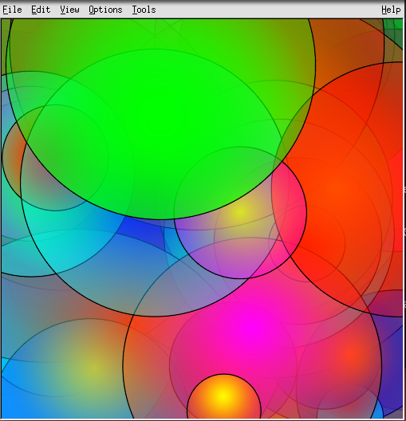
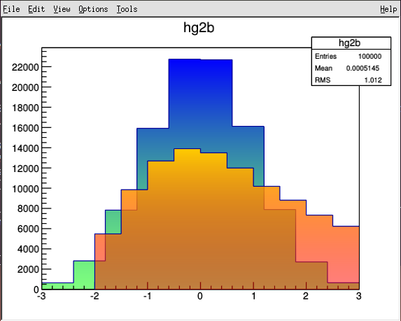
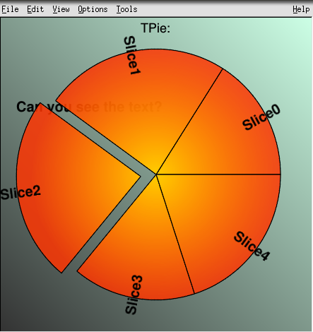

## 2D Graphics Libraries

### TASImage

-   In some cases dashed lines with a line width greater than "1" were
    not drawn.
-   The `TLatex` symbol `#tilde`, was misplaced.
-   In `TASImage::DrawtText`, `TTF::SetTextSize` was called with a rounded
    value (to pixel). This cause some misplacements of character in TLatex
    formulae.

### TPDF and TPostScript

-   Parenthesis can be used in PDF and PS file names.
-   In PDF files, italic greek characters were not correct for non null
    text angle.

### TImageDump
-   Fix a `TBox` clipping issue.

### TSVG
-   Some markers did not show in Google-Chrome.

### New class TTeXDump: Graphics interface to TeX

This class allow to generate `PGF/TikZ` vector graphics output
which can be included in TeX and LaTeX documents.

`PGF` is a TeX macro package for generating graphics. It is platform
and format-independent and works together with the most important TeX
backend drivers, including pdftex and dvips. It comes with a
user-friedly syntax layer called `TikZ`.

To generate a such file it is enough to do:

```
   gStyle->SetPaperSize(10.,10.);
   hpx->Draw();
   gPad->Print("hpx.tex");
```

Then, the generated file (<tt>hpx.tex</tt>) can be included in a
LaTeX document (`simple.tex`) in the following way:

```
\documentclass{article}
\usepackage{tikz}
\usetikzlibrary{patterns}
\title{A simple LaTeX example}
\date{July 2013}
\begin{document}
\maketitle
The following image as been generated using the TTeXDump class:
\par
\input{hpx.tex}
\end{document}
```

Note the two directive needed at the top of the LaTeX file:

```
\usepackage{tikz}
\usetikzlibrary{patterns}
```

Then including the picture in the document is done with the
`\input` directive.

The command `pdflatex simple.tex` will generate the corresponding pdf
file `simple.pdf`.


### X11 fonts

-   A coverity fix in `Rotated.cxx` had a side effect on rotated text
    drawn with X11 fonts.

### TCanvas and TPad

-   `TPad::SaveAs` produces named macros in .C files.
-   Change the way the string input is done in the Pad toolbar for text
    and Pave Label. It doesn't use anymore the `TGX11` function `RequestString`.
    Now the text appears directly as it will show and it is possible to
    enter several text string. The input is not block in the `RequestString` event loop.
-   The toolbar methods now work without XOR mode (useful for OpenGL()).
-   A new "vertex compression" algorithm added to deal with complex histograms
    (thousands/millions of bins - polygons with thousands/millions of vertices) -
    optimization/fix for X11 crashes.

### TGaxis and TAxis

-   The time axis behavior should now be correct along time zone and
    summer saving time. A fix has been done with the of Philippe Gras
    (CEA Saclay. IRFU/SEDI) and Julian Sitarek (IFAE). Time axis
    transported from a time zone to an other in a ROOT file are correct
    too. A new example test have been introduced to test the time axis
    (timeonaxis3.C)
-   In some case the format use to build the axis labels was incorrect.
    (cf: Jira report ROOT-5635).
-   New static function to change the position of the "power of 10"
    near the axis. A static function is used instead of  data members
    in `TAxis` in order to keep the `TAxis` class small. Adding two
    floating point numbers in that class (in fact in `TAttAxis`) would
    have a none negligible effect on the Root files' sizes as there is
    at least two axis per histogram and that there is often 1000th
    histograms in a single file.
    So we choose to follow the same mechanism as for the `SetMaxDigits`
    static method. The new function is: `SetExponentOffset`.
    Example:

``` {.cpp}
...
   TGaxis::SetMaxDigits(2);
   TGaxis::SetExponentOffset(-0.01, 0.01, "y"); // X and Y offset for Y axis
   TGaxis::SetExponentOffset(-0.05, 0.01, "x"); // Y and Y offset for X axis
...
   hist->Draw();
```

-   `TGaxis::SetMaxDigits()` was not acitve on standalone `TGaxis`.

### TLegend

-   The line attribute of objects in the legend were not taken into
    account with the option "e".
-   In case of automatic computation of the legend items' size, the
    text size was wrong if the font precision was set to 3.
-   Improve the spacing between lines. Due to the way the vertical
    text centring is done (bounding based) the spacing between lines
    may appeared irregular in some cases.
-   The error bar in the legend (option "E") didn't have the line
    attributes when drawn alone (without option "L").

### TPie

-   New drawing option "SC" to draw the labels with the slices' colors.

### TLine

-   Add `SetNDC`.

### TMathText

-   TMathText's purpose is to write mathematical equations, exactly as
    TeX would do it. The syntax is the same as the TeX's one. Author:
    Yue Shi Lai (MIT)) \
    Example:

``` {.cpp}
    {
       TMathText l;
       l.SetTextAlign(23);
       l.SetTextSize(0.06);
       l.DrawMathText(0.50, 1.000, "\\prod_{j\\ge0} \\left(\\sum_{k\\ge0} a_{jk}z^k\\right) = \\sum_{n\\ge0} z^n \\left(\\sum_{k_0,k_1,\\ldots\\ge0\\atop k_0+k_1+\\cdots=n} a_{0k_0}a_{1k_1} \\cdots \\right)");
       l.DrawMathText(0.50, 0.800, "W_{\\delta_1\\rho_1\\sigma_2}^{3\\beta} = U_{\\delta_1\\rho_1\\sigma_2}^{3\\beta} + {1\\over 8\\pi^2} \\int_{\\alpha_1}^{\\alpha_2} d\\alpha_2^\\prime \\left[ {U_{\\delta_1\\rho_1}^{2\\beta} - \\alpha_2^\\prime U_{\\rho_1\\sigma_2}^{1\\beta} \\over U_{\\rho_1\\sigma_2}^{0\\beta}} \\right]");
       l.DrawMathText(0.50, 0.600, "d\\Gamma = {1\\over 2m_A} \\left( \\prod_f {d^3p_f\\over (2\\pi)^3} {1\\over 2E_f} \\right) \\left| \\mathscr{M} \\left(m_A - \\left\\{p_f\\right\\} \\right) \\right|^2 (2\\pi)^4 \\delta^{(4)} \\left(p_A - \\sum p_f \\right)");
       l.DrawMathText(0.50, 0.425, "4\\mathrm{Re}\\left\\{{2\\over 1-\\Delta\\alpha} \\chi(s) \\left[ \\^{g}_\\nu^e \\^{g}_\\nu^f (1 + \\cos^2\\theta) + \\^{g}_a^e \\^{g}_a^f \\cos\\theta \\right] \\right\\}");
       l.DrawMathText(0.50, 0.330, "p(n) = {1\\over\\pi\\sqrt{2}} \\sum_{k = 1}^\\infty \\sqrt{k} A_k(n) {d\\over dn} {\\sinh \\left\\{ {\\pi\\over k} \\sqrt{2\\over 3} \\sqrt{n - {1\\over 24}} \\right\\} \\over \\sqrt{n - {1\\over 24}}}");
       l.DrawMathText(0.13, 0.150, "{(\\ell+1)C_{\\ell}^{TE} \\over 2\\pi}");
       l.DrawMathText(0.27, 0.110, "\\mathbb{N} \\subset \\mathbb{R}");
       l.DrawMathText(0.63, 0.100, "\\hbox{RHIC スピン物理 Нью-Йорк}");
    }
```

   

-   Implement `\\frac` using `\\over`.
-   Treat `\\mbox` as `\\hbox` to improve the compatibility with TTexDump.

### TLatex

-   The class `TMathText` is a TeX math formulae interpreter. It uses
    plain TeX syntax and uses "\\" as control instead of "\#". If a
    piece of text containing "\\" is given to `TLatex` then `TMathText`
    is automatically invoked. Therefore, as histograms' titles, axis
    titles, labels etc ... are drawn using `TLatex`, the `TMathText`
    syntax can be used for them also.
-   Fix a very old bug (in `TTF.cxx` since the beginning). With the
    following code the spaces between "text" and \#lambda were ignored.

``` {.cpp}
       TLatex t; t.DrawLatex( 0.1,0.1,"text   \#Lambda" )
```

-   Implement `#backslash`.
-   Implement `DrawLatexNDC`.
-   Implement `#minus` and `#plus` typographically better than the
    standard `"-"` and `"+"`.
-   Make sure all greek and math symbols are printed correctly by `TTexDump`.
-   Implement dummy operators `#mbox` and `#hbox` to improve the compatibility
    between `TLatex`, `TMathText` and `TTexDump`.
-   Some operators like `#minus`, `#plus`, `#mp`, `#hbar` etc ...
    ignored the color  defined by the operator `#color`.
-   With the Cocoa backend on Mac the text string were a bit too large
    compared to the TTF rendering.

### TPave

-   Implement `SetX1()` etc ... for `TPave` and inherited classes to make sure the
    NDC coordinates are also defined.

### TLinearGradient and TRadialGradient

-   Two new classes to support color gradient: `TLinearGradient` and `TRadialGradient`.
    Both classes inherit from `TColor` and can be used the same way as ROOT's
    standard colors in `TAttFill` (`SetFillColor(newColorIndex)`).
    Gradient fill can be created using either RGBA values directly, or from
    color indices (colors from the ROOT's color table).
-   TRadialGradient supports a simple radial gradient (center + radius)
    and an "extended" radial gradient (starting/ending points + two radii).
-   The new gradient fill option is available either with OpenGL ("gl-in-pad")
    or with a Cocoa backend (OS X only).
-   Please note, at the moment, a color gradient can not be saved
    in a ROOT file or a pdf/ps file. It can be saved as an image (png/jpg etc.).
-   There are several demos in the tutorials/cocoa and tutorials/gl sub-directories
    explaining how to use these new classes:
    * grad.C
    * grad2.C
    * radialgradients.C.

   

   

   

### TGCocoa and TGQuartz

-   Correct font metrics for greek and math symbols are implemented now.
-   Added support for linear and radial color gradients (see the notes above).
-   "GL-in-pad" implemented for Cocoa backend.
-   Keyboard event handling is more "X11-like" now.
-   Multi-display setup is supported now.
-   Transparent pads (colors with alpha value) are supported natively now.

