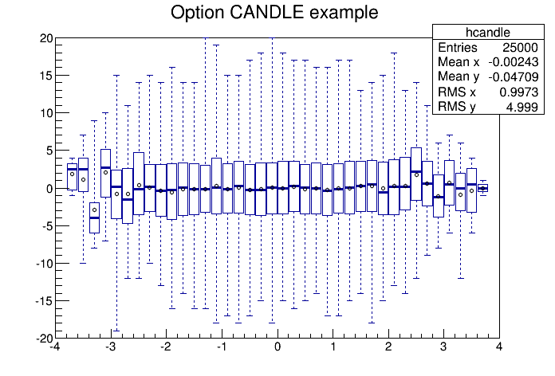

## Histogram Libraries

### THistPainter

-   With option COL `TProfile2D` histograms are handled differently
    because, for this type of 2D histograms, it is possible to know if
    an empty bin has been filled or not. So even if all the bins'
    contents are positive some empty bins might be painted. And vice
    versa, if some bins have a negative content some empty bins might be
    not painted.
-   With option COLZ the axis attributes were not imported correctly on
    the palette axis.
-   Make sure the 2D drawing options COL, ARR, CONT and BOX are ignored
    when used to plot a 1D histogram. 1D histograms plotted with one of
    these options is now drawn with the default 1D plotting option. This
    is useful when the default option in the TBrowser is, for instance,
    COL. Before this change the 1D histogram appeared as blank.
-   New plotting option `"LEGO3"`. Like the option `"LEGO1"`, the
    option `"LEGO3"` draws a lego plot using the hidden surface removal
    technique but doesn't draw the border lines of each individual
    lego-bar. This is very useful for histograms having many bins. With
    such histograms the option `"LEGO1"` gives a black image because of
    the border lines. This option also works with stacked legos.
-   New plotting option `"LEGO4"`. Draw a lego plot with hidden surface
    removal, like LEGO1, but without the shadow effect on each lego-bar.
-   Line attributes can be used in lego plots to change the edges'
    style. It works when drawing a `TH2` in LEGO or SURF mode whatever
    the coordinate system used (car, pol, cyl, sph, and psr). It also
    handles `THStack` (lego only).
-   Implement in THistPainter::GetObjectInfo the case of TProfile and
    TProfile2D to print the tooltip information on each bin. Disable the
    printing of the bin information for TH3, since it is not currently
    possible to retrieve the 3d bin number from the pixel coordinate.
-   Fit parameters with very long name destroyed the stats display. This
    is now fixed. \
    Example:

    ``` {.cpp}
    {
       gStyle->SetOptFit(111);
       TH1F *hist = new TH1F("hist","hist",100,-5,5);
       TF1 *fit = new TF1("fit","gaus",-5,5);
       fit->SetParName(2,"Parameter with very very very very long name");
       hist->FillRandom("gaus",5000);
       hist->Draw();
       hist->Fit(fit);
    }
    ```
-   The statistics display has a new option: "I"=2 (the default one
    remains "i"=1). The value displayed for integral is
    `TH1::Integral("width")` instead of `TH1::Integral()`.
    Example:

    ``` {.cpp}
    {
       TH1D * histo1D = new TH1D ("histo1D","",2,0.,4.) ;
       histo1D->SetBinContent( 1,1.) ;
       histo1D->SetBinContent( 2,2.) ;
       TCanvas * canvas = new TCanvas () ;
       canvas->Divide(2,1) ;
       canvas->cd(1) ; gStyle->SetOptStat("nemruoi") ; histo1D->DrawClone() ;
       canvas->cd(2) ; gStyle->SetOptStat("nemruoI") ; histo1D->DrawClone() ;
    }
    ```
-   `TH1` was drawn improperly in "Logx" mode if "X" axis starts at
    negative values. The following macro illustrades this problem.

    ``` {.cpp}
    {
       TCanvas *c1 = new TCanvas("c1", "c1",0,0,1200,700);
       int n = 100;
       Float_t d = 0.5;
       TH1F *h1 = new TH1F("h1", "x_min = - d", n, -d, 100-d);
       h1->Fill(1, 1); h1->Fill(3, 3); h1->Fill(5, 5); h1->Fill(7, 7);

       TH1F *h2 = new TH1F("h2", "x_min = +d", n, d, 100+d);
       h2->Fill(1, 1); h2->Fill(3, 3); h2->Fill(5, 5); h2->Fill(7, 7);

       c1->Divide(1, 2);
       c1->cd(1); gPad->SetLogx(); h1->Draw(); // upper picture
       c1->cd(2); gPad->SetLogx(); h2->Draw(); // lower picture
       h1->GetXaxis()->SetMoreLogLabels();
       h2->GetXaxis()->SetMoreLogLabels();
       c1_1->SetGridx();
       c1_2->SetGridx();
    }
    ```
-   In `PaintStat2` the temporary string used to paint the fit parameters
    was too small and in some cases the errors where truncated. The size
    of the string is now the same as in `PaintStat`.
-   Display the bin error for 2D histograms in the status bar.
-   New option `CANDLE` to draw 2D histograms as Candle-PLot (Box-PLot).
    A Candle plot (also known as a "box-and whisker plot" or simply "box plot")
    is a convenient way to describe graphically a data distribution (D) with
    only the five numbers. It was invented in 1977 by John Tukey.

    With the option CANDLEX five numbers are:

    1. The minimum value of the distribution D (bottom dashed line).
    2. The lower quartile (Q1): 25% of the data points in D are less than
       Q1 (bottom of the box).
    3. The median (M): 50% of the data points in D are less than M
       (thick line segment inside the box).
    4. The upper quartile (Q3): 75% of the data points in D are less
       than Q3 (top of the box).
    5. The maximum value of the distribution D (top dashed line).

    The mean value of the distribution D is also represented as a circle.

    In this implementation a TH2 is considered as a collection of TH1 along
    X (option `CANDLE` or `CANDLEX`) or Y (option `CANDLEY`).
    Each TH1 is represented as a candle plot.

    Example:

    ``` {.cpp}
    {
       TH2F *hcandle = new TH2F("hcandle","Option CANDLE example ",40,-4,4,40,-20,20);
       Float_t px, py;
       for (Int_t i = 0; i < 25000; i++) {
          gRandom->Rannor(px,py);
          hcandle->Fill(px,5*py);
       }
       hcandle->SetMarkerSize(0.5);
       hcandle->Draw("CANDLE");
    }
    ```
   

-   The option "9" as been removed. It is not needed anymore since the line compression
    has been implemented in `TPadPainter`.
-   The `BOX` option was handling `TH2::SetMinimum()` differently from
    the other drawing options. As reported [here](https://sft.its.cern.ch/jira/browse/ROOT-6305).

### TGraphPainter

-   Fix the problem described [here](http://root.cern.ch/phpBB3/viewtopic.php?f=3&t=8591).
    When drawn with option SAME the histogram 1st and last bins might
    be wrong. The following macro shows the problem:

    ``` {.cpp}
    {
       TCanvas *c = new TCanvas("c","c",900,900);
       c->Divide (1,2);

       TH1D * histo1 = new TH1D ("histo1","histo1",100,0.,100.) ;
       histo1->SetBinContent(51,80.) ;

       TH1D * histo2 = new TH1D ("histo2","histo2",100,49.9,51.1) ;  /// not ok
       histo2->SetMinimum(0.) ; histo2->SetMaximum(100.) ;

       c->cd(1); gPad->DrawFrame(49.9, 0., 51.1, 100);
       histo1->Draw("same");

       Double_t xAxis[4] = {3., 5., 7., 9.};
       TH1D *histo2 = new TH1D("histo","",3, xAxis);
       histo2->SetBinContent(1,2.);
       histo2->SetBinContent(2,4.);
       histo2->SetBinContent(3,3.);

       c->cd(2); gPad->DrawFrame(4.,0., 10.,5.);
       histo2->Draw("same");
    }
    ```
-   In `TGraph2DPainter::PaintLevels` the colour levels used to paint
    the triangles did not match the minimum and maximum set by the
    user on the `TGraph2D`. This problem was reported
    [here](http://root.cern.ch/phpBB3/viewtopic.php?f=3&t=16937&p=72314#p72314)

### TPaletteAxis

-   The histogram Z axis title is now painted along the palette axis.

### TAxis

-   The Axis has a new public bit `TAxis::kCanExtend`, which control the axis extensions (for example in case of time axis) and used to
    replace the old bit `TH1::kCanRebin` (see below).
    Note that this bit is automatically set when the axis has labels associated to each bin. In this case the axis becomes alphanumeric and
    there is no more relation to the observed quantities. Note that when an axis is alphanumeric the mean and the rms of the histograms are not anymore
    coputed and they are set to zero.

### TH1

-   The bit `TH1::kCanRebin` used to extend the histogram axes is now deprecated. The bit exists still in ROOT 6.0 but it has no effect.
    One should use now the new function `TH1::SetCanExtend(..)` passing the axis (using the appropriate enumeration), which needs to be extended.
    In addition to extend each axis individually, the function can be used also to  enable/disable extension for all axes.
    For example `TH1::SetCanExtend(TH1::kXaxis)` will make extendable only the X axis; `TH1::SetCanExtend(TH1::kAllAxes)` will
    make extendable all the axes (this is the same functionality of the previous function `SetBit(TH1::kCanRebin)` and
    `TH1::SetCanExtend(TH1::kNoAxis)` will remove the extendable functionality to all the axes (equivalent to the old `ResetBit(TH1::kCanRebin)`).
    The functionality of `TestBit(TH1::kCanRebin)` is now replaced by `TH1::CanExtendAllAxis()`.

-   An histogram filled with weights different than one has now automatically the sum of the weight squared stored inside, without the need to call anymore
    `TH1::Sumw2()`. As a consequences an histogram filled with weights will always draw the errors by default. If one desire to continue having the histogram drawn
    without the errors, one should use the `hist` option:  `h.Draw("hist")`.
    If, for memory reason, one does not want to remove the internal array storing the bin errors (the bin sum of weight square), one can use the function `TH1::Sumw2(false)`.

-   The copy constructor is not anymore public for TH1. Before (in 5.34) this code was allowed by the compiler, although giving undefined behavior: now not anymore:

    ``` {.cpp}
       TH1D h1;
       TH1 h2(h1);
    ```
    Now this code is not allowed anymore. It will give a compilation error.
    The copy constructor of the derived classes (`TH1D` in this example) should instead be used.
    This applies also for `TH2` and `TH3`.
    In case you want to copy histograms using the TH1 interface, you can use either `TObject::Clone`, which uses the I/O system and can be unconvenient in some cases (e.g. in a multi-threaded
    environment) or `TH1::Copy` which is public since some of the latest 5.34 revisions together with `TClass::New` as following:

    ``` {.cpp}
       TH1 * h2 = (TH1*) h1->IsA()->New();
       h1->Copy(*h2);
    ```
    Note that `TH1::Copy` does not copy the attached list of functions, while `TH1::Clone()` does a deep copy also of the contained functions.

-   Add new method `TH1::GetNCells` to retrieve the total number of bins of an histogram including underflow and overflows. This is the product of all the bins in each dimension.

-   The methods `GetCellContent`, `GetCellError` and `SetCellContent` and `SetCellError` have been deprecated. Get/SetBinContent and Get/SetBinError should be instead used and they have exactly the
    same functionality.

-   The following code should produce a plot. It did not.

    ``` {.cpp}
       TH1F* h=new TH1F("hist", "histogram", 10, 0, 3);
       h->FillRandom("gaus");
       h->Draw("same");
    ```
-   Make sure histograms having quotes in title are properly saved in .C files.

### TH2, TH3

-   Add new functions `TH2::QuantilesX` and `TH2::QuantilesY` to return in a 1D histogram the projected quantiles distribution along
    the other Y or X axis. The return histogram will have as bin error an approximate error on the quantile assuming a normal distribution of the
    bin contents in the other axis.

-   Update Projection methods of both TH2 and TH3 to not return a null
    pointer when an histogram with the same name already existed and it
    was not compatible. Now just set the new correct binning on the
    previously existing histogram.


### TGraph

-   `TGraph::Draw()` needed at least the option `AL` to draw the graph
     axis even when there was no active canvas or when the active canvas
     did not have any axis defined. This was counter-intuitive. Now if
     `TGraph::Draw()` is invoked without parameter and if there is no
     axis defined in the current canvas, the option `ALP` is automatically
     set.
-    Change `SavePrimtive()` to improve speed compilation on generated macros.

### TGraph2D

-   When `GetX(YZ)axis` were called on a `TGraph2D`, the frame limit and
    plotting options were changed.
-   Modify the `Clear` function in order to be able to reuse a
    `TGraph2D` after a `Clear` is performed.
-   In `GetHistogram()` the lower and higher axis limits are always
    different.
-   Protection added to avoid a Seg Fault on `.q` when `SetHistogram()`
    is called on a `TGraph2D`.

### TMultiGraph

-   In `TMultiGraph::Add(TMultiGraph *multigraph, Option_t *chopt)`
    If `chopt` is defined all the graphs in `multigraph` will be added
    with the `chopt` option. If `chopt` is undefined each graph will
    be added with the option it had in `multigraph`.
-   The option "A" in the `Draw()` was not cleaning properly the
    current pad.
-   Implement this option `pads`. This option is equivalent to the one in
    `THStack`. It allows to draw all the `TGraphs` in separated pads.

### THStack

-    By default the background of the histograms is erased before drawing the
     histograms. The new option `noclear` avoid this behaviour. This is useful
     when drawing a `THStack` on top of an other plot. If the patterns used to
     draw the histograms in the stack are transparents, then the plot behind
     will be visible.

### TH2Poly

-    Implement a simple version of "Scale".

### TF1

-   Change `TF1::Integral(double a, double b, double * params = 0, double eps = 1.E-12)` to
    `TF1::Integral(doubnle a, double b, double epsrel=1.E-12)`. One should use `TF1::SetParameters` to
    set the function parameters before computing the integral.

-   Add a new function `TF1::IntegralOneDim(Double_t a, Double_t b, Double_t epsrel, Double_t epsabs, Double_t &err)`
    that returns as last argument the error in the integration. `TF1::Integral` is implemented using `Tf1::IntegralOneDim`.

-   The one-dim and multi-dim integral functions are now implemented using the `ROOT::Math::IntegratorOneDim` and `ROOT::Math::IntegratorMultiDim`
    classes. This allows to change the integration algorithm used in `TF1` using the static methods of the classes
    `ROOT::Math::IntegratorOneDimOptions` and `ROOT::Math::IntegratorMultiDimOptions`. The default algorithm used are
    `ROOT::Math::IntegratorOneDimOptions::DefaultIntegratorType()` and `ROOT::Math::IntegratorMultiDimOptions::DefaultIntegratorType()`.
    For example, if ROOT has been built with mathmore the default one-dim integration type is the GSL AdaptiveSingular integration algorithm.

-   Implement the possibility to save a `TF1` as C code indenpant from
    ROOT. It is enough to save the function as a ".cc" file. \
    Example:

    ``` {.cpp}
       root [0] TF1 *f1 = new TF1("f1","x*x",-10,10)
       root [1] f1->SaveAs("f1.cc");
       Info in <TF1::SaveAs>: cc file: f1.cc has been generated
          root [2] .x f1.cc(9.)
          (double)8.10019368181367980e+01
    ```

### TF2, TF3

-   Implement `TF2::GetMinimumXY` and `TF3::GetMinimumXYZ` using the `ROOT::Math::Minimizer` class instead of `TFitter`. The methods return now the function value at the minimum.

-   Implement also a `TF2::GetMaximumXY` and `TF3::GetMaximumXYZ`.

-   Remove some ambigous `Integral` functions

### TFractionFitter, TBinomialFitter

-    Change to use the `ROOT::Math::Fitter` instead of the `TFitter` class.
