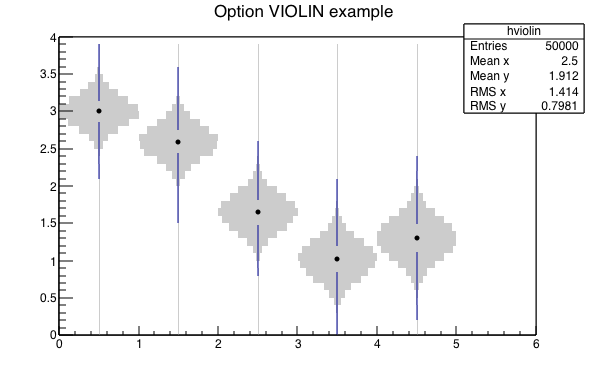

## Histogram Libraries

### THistPainter

-   Implement the option `FUNC` for 2D histograms in the same way
    it is implmented for 1D. Ie: when the option `FUNC` specified
    only the functions attached to the histogram are drawn.
-   New drawing option `VIOLIN`for 2D histograms from Davide Gerbaudo
    (davide.gerbaudo@gmail.com).
    A violin plot is a box plot that also encodes the pdf information at each point.
    Quartiles and mean are also represented at each point, with a marker and two lines.

    In this implementation a TH2 is considered as a collection of TH1 along
    X (option <tt>VIOLIN</tt> or <tt>VIOLINX</tt>) or Y (option <tt>VIOLINY</tt>).

    A solid fill style is recommended for this plot (as opposed to a hollow or
    hashed style).

    Example:

    ``` {.cpp}
    {
       Int_t nx(6), ny(40);
       Double_t xmin(0.0), xmax(+6.0), ymin(0.0), ymax(+4.0);
       TH2F* hviolin = new TH2F("hviolin", "Option VIOLIN example", nx, xmin, xmax, ny, ymin, ymax);
       TF1 f1("f1", "gaus", +0,0 +4.0);
       Double_t x,y;
       for (Int_t iBin=1; iBin<hviolin->GetNbinsX(); ++iBin) {
           Double_t xc = hviolin->GetXaxis()->GetBinCenter(iBin);
           f1.SetParameters(1, 2.0+TMath::Sin(1.0+xc), 0.2+0.1*(xc-xmin)/xmax);
           for(Int_t i=0; i<10000; ++i){
               x = xc;
               y = f1.GetRandom();
               hviolin->Fill(x, y);
           }
       }
       hviolin->SetFillColor(kGray);
       hviolin->SetMarkerStyle(20);
       hviolin->SetMarkerSize(0.5);
       hviolin->Draw("VIOLIN");
    c1->Update();
    return c1;
    }
    ```
   
